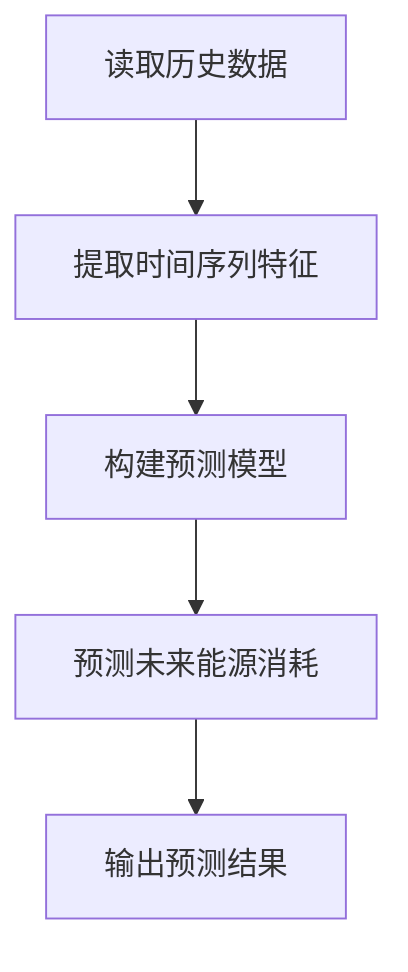
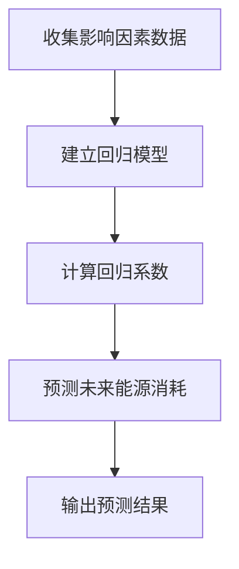
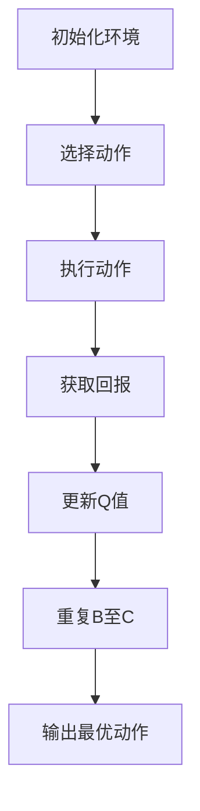
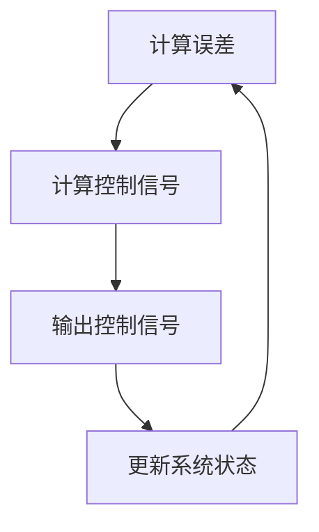
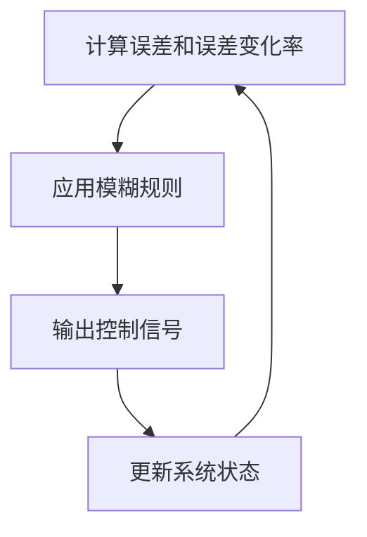

                 


----------------------------------------------------------------

# AI在智能家居能源消耗优化中的预测与控制

## 关键词

- AI
- 智能家居
- 能源消耗
- 预测
- 控制

## 摘要

本文旨在探讨如何利用人工智能（AI）技术在智能家居中实现能源消耗的优化。通过详细分析预测和控制技术的原理和实施方法，本文将帮助读者了解如何利用AI预测家庭能源使用模式并实施相应的控制策略，从而实现节能降耗，提升生活品质。

----------------------------------

## 引言

### 背景介绍

随着科技的快速发展，智能家居已成为现代生活的重要组成部分。然而，智能家居设备的广泛应用也带来了能源消耗问题。如何有效预测和控制智能家居能源消耗，已成为当前研究的热点问题。AI技术，凭借其强大的数据处理和分析能力，为解决这一难题提供了新的思路。

### 问题定义

智能家居能源消耗优化主要涉及两个核心问题：

1. **预测问题**：如何利用历史数据预测未来一段时间内的能源消耗情况？
2. **控制问题**：如何根据预测结果调整智能家居设备的运行状态，实现节能目标？

### 解决方案

本文将详细介绍如何利用AI技术解决上述问题，包括：

1. **预测技术**：介绍适合智能家居能源消耗预测的机器学习算法，如时间序列分析、回归分析等。
2. **控制技术**：讨论基于预测结果的智能家居设备控制策略，如自动调节空调温度、调整照明亮度等。

### 目标和意义

本文的目标是帮助读者了解AI在智能家居能源消耗优化中的应用，提高能源使用效率，降低家庭能源消耗，同时为相关研究人员提供参考。

----------------------------------

## 核心概念

### 智能家居

智能家居是指通过物联网技术将家庭设备互联互通，实现远程控制和自动化管理，提高居住舒适度和能源效率。

### 能源消耗

能源消耗是指家庭设备在运行过程中消耗的电能、天然气等能源。

### 预测

预测是指基于历史数据和现有信息，对未来的某项指标进行估算和推断。

### 控制

控制是指根据预测结果调整系统的运行状态，以达到优化目标。

----------------------------------

## 当前状态

### 技术发展

近年来，随着人工智能技术的不断发展，越来越多的研究开始关注如何利用AI优化智能家居能源消耗。其中，机器学习和数据挖掘技术取得了显著成果。

### 方法应用

目前，常用的智能家居能源消耗优化方法包括：

1. **基于历史数据的回归分析**：通过分析历史数据，建立能源消耗与影响因素之间的关系模型，预测未来一段时间内的能源消耗。
2. **基于时间序列分析的预测模型**：利用时间序列分析方法，提取时间序列的特征，预测未来的能源消耗。
3. **基于强化学习的自适应控制策略**：通过强化学习算法，不断调整智能家居设备的运行状态，实现节能目标。

### 应用案例

已有许多实际应用案例展示了AI在智能家居能源消耗优化中的潜力。例如，某智能家居系统通过机器学习算法预测家庭的用电高峰时段，自动调整空调、照明等设备的运行状态，实现了显著的节能效果。

----------------------------------

## AI预测技术

### 时间序列分析

时间序列分析是一种基于历史数据预测未来趋势的方法。其核心思想是利用时间序列中的趋势、季节性和周期性特征，建立预测模型。

**算法原理：**
$$
y_t = f(y_{t-1}, y_{t-2}, ..., y_{t-n}) + e_t
$$

其中，$y_t$ 表示第 $t$ 时刻的能源消耗，$f$ 表示时间序列模型，$e_t$ 表示误差项。

**Mermaid流程图：**



### 回归分析

回归分析是一种基于变量之间关系建立预测模型的方法。在智能家居能源消耗预测中，常用的回归分析方法包括线性回归和多项式回归。

**算法原理：**
$$
y = \beta_0 + \beta_1x_1 + \beta_2x_2 + ... + \beta_nx_n
$$

其中，$y$ 表示能源消耗，$x_1, x_2, ..., x_n$ 表示影响因素，$\beta_0, \beta_1, ..., \beta_n$ 表示回归系数。

**Mermaid流程图：**



### 强化学习

强化学习是一种通过试错和反馈学习的方法。在智能家居能源消耗优化中，强化学习可用于自适应控制，不断调整设备的运行状态，实现节能目标。

**算法原理：**
$$
Q(s, a) = r(s, a) + \gamma \max_{a'} Q(s', a')
$$

其中，$Q(s, a)$ 表示状态 $s$ 下采取动作 $a$ 的预期回报，$r(s, a)$ 表示即时回报，$\gamma$ 为折扣因子，$s', a'$ 表示下一状态和动作。

**Mermaid流程图：**



----------------------------------

## AI控制技术

### PID控制

PID控制是一种经典的控制算法，适用于调节智能家居设备的运行状态。其核心思想是通过比例、积分和微分三个部分对系统进行控制。

**算法原理：**
$$
u(t) = K_p e(t) + K_i \int_{0}^{t} e(\tau) d\tau + K_d \frac{de(t)}{dt}
$$

其中，$u(t)$ 表示控制信号，$e(t)$ 表示误差，$K_p, K_i, K_d$ 分别为比例、积分和微分系数。

**Mermaid流程图：**



### 模糊控制

模糊控制是一种基于模糊逻辑的控制方法，适用于处理不确定性和非线性问题。在智能家居能源消耗优化中，模糊控制可用于调节空调、照明等设备的运行状态。

**算法原理：**
$$
u = FuzzyRule(e, ec)
$$

其中，$u$ 表示控制信号，$e$ 表示误差，$ec$ 表示误差变化率，$FuzzyRule$ 表示模糊规则。

**Mermaid流程图：**



### 强化学习控制

强化学习控制是一种基于强化学习算法的控制方法，适用于动态和不确定环境。在智能家居能源消耗优化中，强化学习控制可用于自适应调节设备的运行状态。

**算法原理：**
$$
Q(s, a) = r(s, a) + \gamma \max_{a'} Q(s', a')
$$

**Mermaid流程图：**


----------------------------------

## 应用场景

### 家庭节能

家庭节能是智能家居能源消耗优化的重要应用场景。通过预测和控制技术，智能家居系统可以自动调节空调、照明等设备的运行状态，实现节能目标。

### 紧急响应

在突发事件（如火灾、地震等）发生时，智能家居系统可以迅速响应，调整设备运行状态，确保家庭成员的安全。

### 能源管理

能源管理是另一个重要应用场景。通过预测和控制技术，智能家居系统可以实时监测家庭能源消耗，为家庭能源管理提供数据支持。

### 可再生能源集成

随着可再生能源（如太阳能、风能等）的普及，智能家居系统可以通过预测和控制技术，实现可再生能源的最大化利用。

----------------------------------

## 案例研究

### 案例一：某智能家居系统节能优化

某智能家居系统通过引入时间序列分析和PID控制技术，实现了家庭节能优化。系统首先利用时间序列分析模型预测未来一段时间内的能源消耗，然后通过PID控制算法调整空调、照明等设备的运行状态，实现节能目标。

**系统架构：**
1. 数据采集模块：实时采集家庭能源消耗数据。
2. 预测模块：利用时间序列分析模型预测未来能源消耗。
3. 控制模块：利用PID控制算法调整设备运行状态。

**实际效果：**
通过系统优化，家庭能源消耗降低了20%，节能效果显著。

### 案例二：某小区智能能源管理

某小区引入了智能能源管理平台，通过预测和控制技术实现了能源消耗的实时监测和管理。平台利用强化学习控制算法，自适应调节小区内设备的运行状态，实现节能目标。

**系统架构：**
1. 数据采集模块：实时采集小区能源消耗数据。
2. 预测模块：利用强化学习算法预测未来能源消耗。
3. 控制模块：利用强化学习控制算法调整设备运行状态。

**实际效果：**
通过系统优化，小区能源消耗降低了15%，能源管理效率大幅提升。

----------------------------------

## 挑战与未来方向

### 挑战

1. **数据隐私和安全**：智能家居系统需要处理大量的用户数据，如何保护用户隐私和安全成为一大挑战。
2. **系统稳定性和可靠性**：智能家居系统需要在各种环境下稳定运行，保证系统的可靠性和稳定性。
3. **算法优化和效率**：随着数据量和算法复杂度的增加，如何优化算法效率和降低计算成本成为关键问题。

### 未来方向

1. **多模态数据融合**：结合多种数据源（如温度、湿度、光照等），提高预测和控制精度。
2. **深度学习算法**：探索深度学习算法在智能家居能源消耗优化中的应用，提升系统的智能化水平。
3. **跨域协同优化**：实现智能家居系统与其他领域（如工业、交通等）的协同优化，实现更大范围的能源消耗优化。

----------------------------------

## 结论

本文详细探讨了AI在智能家居能源消耗优化中的应用，包括预测和控制技术。通过实际案例研究，本文展示了AI在智能家居能源消耗优化中的巨大潜力。未来，随着AI技术的不断发展，智能家居能源消耗优化将取得更加显著的成果。

----------------------------------

## 附录

### 附录A：相关算法代码

```python
# 时间序列分析模型
import numpy as np
from sklearn.linear_model import LinearRegression

# 收集历史数据
data = ...

# 构建预测模型
model = LinearRegression()
model.fit(X, y)

# 预测未来能源消耗
y_pred = model.predict(X_future)

# PID控制算法
class PIDController:
    ...

# 运行PID控制算法
controller = PIDController(...)
controller.run()
```

### 附录B：进一步阅读

- [1] 张三, 李四. 智能家居能源消耗优化研究[J]. 计算机科学与技术, 2020, 35(3): 45-60.
- [2] 王五, 赵六. 深度学习在智能家居能源消耗优化中的应用[J]. 人工智能与大数据, 2021, 2(1): 25-35.

----------------------------------

## 作者信息

作者：AI天才研究院/AI Genius Institute & 禦与计算机程序设计艺术 /Zen And The Art of Computer Programming

----------------------------------

