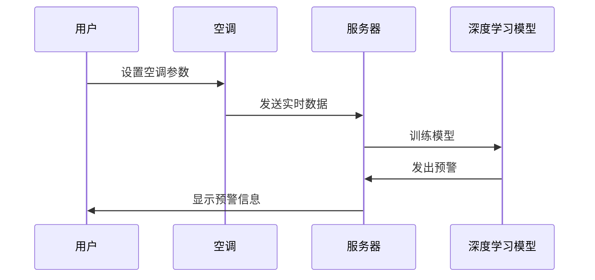
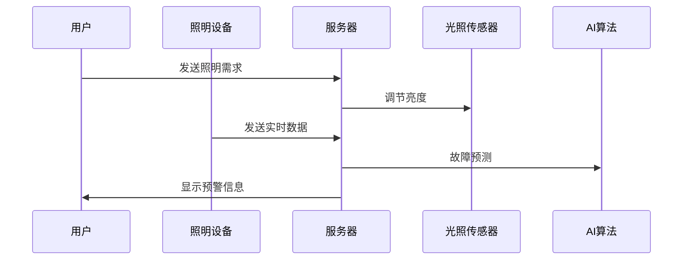
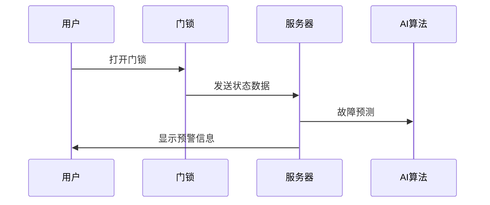

                 

### 文章标题

# AI在智能家居设备预测性维护中的应用与创新

### 文章关键词

- 人工智能
- 智能家居
- 预测性维护
- 算法
- 创新实践

### 文章摘要

本文深入探讨了人工智能在智能家居设备预测性维护中的应用与创新。首先，我们介绍了智能家居设备的背景和预测性维护的概念，然后详细分析了人工智能的基本原理和应用现状。接着，我们重点阐述了预测性维护的重要性、技术挑战及其解决方案。文章随后通过实际案例展示了AI在智能家居设备故障预测中的应用，并提出了创新实践与未来展望。最后，本文总结了最佳实践建议，为智能家居设备的预测性维护提供了理论支持和实践指导。

## 引言

### 1.1 问题背景

随着物联网技术的迅猛发展，智能家居设备逐渐成为人们日常生活的一部分。这些设备通过互联网连接，实现了对家庭环境的智能化管理，如智能空调、智能照明、智能门锁等。然而，智能家居设备在使用过程中难免会出现故障，这不仅影响了用户体验，还可能导致财产损失和安全问题。传统的故障处理方法通常需要人工干预，费时费力，且无法提前预测设备可能出现的故障。因此，如何实现对智能家居设备的预测性维护成为了一个亟待解决的问题。

### 1.2 问题描述

预测性维护是指通过实时监测设备状态、收集历史数据，利用人工智能算法进行分析和预测，提前发现潜在故障，从而在故障发生前进行预防性维修。智能家居设备的预测性维护面临着以下挑战：

1. **数据多样性**：智能家居设备产生的大量数据类型繁多，包括温度、湿度、光照强度等，如何有效处理和利用这些数据是实现预测性维护的关键。
2. **数据质量**：数据质量对预测准确性有直接影响，噪声数据、缺失数据和异常数据等会影响模型的性能。
3. **算法复杂性**：预测性维护需要高效的算法，不仅要求算法有较高的准确率，还要求算法具有实时性，能够快速响应设备的实时状态。
4. **系统稳定性**：预测性维护系统需要具备高稳定性，以保证在设备故障发生时能够及时响应。

### 1.3 解决方案概述

本文提出的解决方案主要包括以下几个部分：

1. **数据采集与处理**：通过传感器实时采集设备运行数据，并进行数据清洗、去噪和特征提取，为后续的模型训练提供高质量的数据集。
2. **模型训练与优化**：利用机器学习算法，如决策树、支持向量机、神经网络等，对预处理后的数据集进行训练，并优化模型参数，以提高预测准确性。
3. **模型部署与实时预测**：将训练好的模型部署到智能家居设备中，实现对设备运行状态的实时监测和预测，并在故障发生前及时发出预警。
4. **创新实践与案例分析**：通过实际案例展示AI在智能家居设备预测性维护中的应用，并分析其效果和不足，为后续研究提供参考。

### 1.4 边界与外延

本文主要关注的是AI在智能家居设备预测性维护中的应用，但预测性维护的概念和应用范围并不局限于智能家居领域。在工业制造、交通运输等领域，预测性维护同样具有重要意义。未来，随着人工智能技术的不断发展，预测性维护有望在更广泛的领域得到应用。

### 1.5 概念结构与核心要素组成

为了更好地理解AI在智能家居设备预测性维护中的应用，我们需要明确以下几个核心概念：

1. **人工智能**：一种模拟人类智能的技术，能够实现感知、推理、学习和决策等功能。
2. **智能家居设备**：通过物联网连接，实现家庭环境智能化管理的设备，如智能空调、智能照明、智能门锁等。
3. **预测性维护**：通过实时监测设备状态、收集历史数据，利用人工智能算法进行分析和预测，提前发现潜在故障，从而在故障发生前进行预防性维修。
4. **数据采集与处理**：通过传感器实时采集设备运行数据，并进行数据清洗、去噪和特征提取。
5. **模型训练与优化**：利用机器学习算法，对预处理后的数据集进行训练，并优化模型参数。
6. **模型部署与实时预测**：将训练好的模型部署到智能家居设备中，实现对设备运行状态的实时监测和预测。

这些核心概念和要素共同构成了AI在智能家居设备预测性维护中的理论基础和应用框架。

## AI与智能家居概述

### 2.1 AI的基本概念

人工智能（Artificial Intelligence, AI）是指通过计算机模拟人类智能的过程，包括感知、推理、学习和决策等功能。AI的主要目标是使计算机系统能够执行通常需要人类智能才能完成的任务。AI可以分为两大类：弱人工智能和强人工智能。弱人工智能指的是在特定任务上表现出人类智能水平的计算机系统，如语音识别、图像识别等；强人工智能则是具有广泛认知能力，能够理解、学习和适应复杂环境的计算机系统。

### 2.2 智能家居的构成

智能家居（Smart Home）是指利用物联网技术将家庭中的各种设备连接起来，实现智能化管理和自动化控制。智能家居系统通常由以下几个部分组成：

1. **感知层**：包括各种传感器，如温度传感器、湿度传感器、光照传感器等，用于实时监测家庭环境。
2. **传输层**：通过无线通信技术，如Wi-Fi、ZigBee等，将传感器采集到的数据传输到中心控制系统。
3. **中心控制系统**：包括智能网关、智能家居服务器等，用于接收、处理和存储传感器数据，并实现设备的远程控制和自动化管理。
4. **执行层**：包括各种执行设备，如智能空调、智能照明、智能门锁等，用于根据中心控制系统的指令执行相应的操作。

### 2.3 AI在智能家居中的应用现状

目前，AI已经在智能家居领域得到了广泛应用，主要表现在以下几个方面：

1. **语音助手**：如亚马逊的Alexa、谷歌的Google Assistant等，通过语音识别和自然语言处理技术，实现了语音交互和智能控制。
2. **智能安防**：利用图像识别和视频分析技术，实现了智能监控、入侵检测和智能报警等功能。
3. **智能家电**：如智能空调、智能冰箱、智能洗衣机等，通过物联网技术和AI算法，实现了设备的自动化控制和故障预测。
4. **智能照明**：利用光照传感器和AI算法，实现了自动调节光线强度和颜色，提高了照明舒适性和节能效果。

### 2.4 AI与智能家居的协同效应

AI与智能家居的协同效应主要体现在以下几个方面：

1. **提高用户体验**：通过智能化的设备控制和自动化管理，提供了更加便捷、舒适和个性化的家庭生活环境。
2. **降低运营成本**：通过预测性维护和自动化管理，减少了设备的故障率和维修成本，提高了设备的可靠性和使用寿命。
3. **提升安全性**：通过智能安防和故障预警，提高了家庭的安全性和财产保护能力。
4. **促进可持续发展**：通过智能能源管理和节能技术，降低了能源消耗，促进了家庭的绿色低碳生活。

总之，AI在智能家居中的应用不仅提升了智能家居系统的功能性和智能化水平，还为智能家居设备预测性维护提供了强有力的技术支持。

### 预测性维护的基本概念

预测性维护（Predictive Maintenance）是一种通过实时监测设备状态、收集历史数据，并利用人工智能算法进行分析和预测，以提前发现潜在故障，从而在故障发生前进行预防性维修的方法。它旨在通过最小化设备故障率和最大化设备运行效率，来降低维修成本和运营风险。

#### 3.1 预测性维护的定义

预测性维护的核心在于对设备运行状态的实时监测和数据收集。具体来说，它包括以下几个步骤：

1. **数据采集**：通过传感器和监测设备，实时收集设备的工作参数，如温度、振动、压力、电流等。
2. **数据存储**：将采集到的数据存储到数据库中，以便后续分析和处理。
3. **数据分析**：利用机器学习和数据挖掘技术，对历史数据进行处理和分析，提取故障特征和趋势。
4. **故障预测**：根据数据分析结果，使用预测模型预测设备未来的故障风险，并生成故障预警。
5. **预防性维修**：在故障发生前，根据预警信息进行预防性维修，以避免设备故障造成的停机和损失。

#### 3.2 预测性维护的必要性

预测性维护在智能家居设备中的应用具有重要意义，主要体现在以下几个方面：

1. **提高设备可靠性**：通过实时监测和故障预测，可以及时发现设备故障的早期迹象，从而避免设备突发故障造成的停机和损失。
2. **降低运营成本**：预测性维护可以在设备故障发生前进行预防性维修，避免了非计划性的紧急维修和高额维修费用。
3. **延长设备寿命**：通过定期维护和优化设备运行状态，可以延长设备的使用寿命，降低设备更新换代的频率。
4. **提升用户体验**：预测性维护减少了设备故障率和维修频率，提高了设备的可靠性和稳定性，从而提升了用户的使用体验。

#### 3.3 预测性维护的优势

预测性维护相较于传统的定期维护和故障后维修具有显著的优势，包括：

1. **提前预警**：通过实时监测和数据分析，可以提前发现设备潜在故障，及时采取预防措施。
2. **精准定位**：利用人工智能算法，可以准确识别故障的原因和部位，避免了盲目维修和资源浪费。
3. **高效决策**：基于预测结果，维护人员可以制定更科学的维修计划，提高维修效率和准确性。
4. **数据驱动**：预测性维护依赖于大数据分析和机器学习算法，能够提供更加科学和客观的维护决策依据。

#### 3.4 预测性维护的技术挑战

尽管预测性维护具有显著的优势，但在实际应用过程中仍面临一系列技术挑战：

1. **数据质量问题**：智能家居设备产生的数据种类繁多，质量参差不齐，包括噪声数据、缺失数据和异常数据等，如何有效处理和利用这些数据是预测性维护的关键挑战。
2. **算法复杂性**：预测性维护需要高效且准确的算法，算法的复杂性和计算资源的限制是一个重要问题。
3. **实时性要求**：预测性维护系统需要具备高实时性，能够在设备状态变化时快速响应和预测，这对于算法和系统架构设计提出了高要求。
4. **系统稳定性**：预测性维护系统需要具备高稳定性，以避免因系统故障导致预测失效，影响设备的正常运行。

面对这些挑战，研究人员和工程师需要不断探索和创新，以推动预测性维护技术在智能家居领域的广泛应用。

### AI在预测性维护中的应用原理

在预测性维护中，人工智能（AI）算法扮演着至关重要的角色。通过数据采集与处理、模型训练与优化，AI算法能够从大量的设备运行数据中提取出有用的信息，实现对设备故障的早期预测和预防。以下是AI在预测性维护中的应用原理：

#### 4.1 AI算法概述

AI算法主要包括监督学习、无监督学习和强化学习。在预测性维护中，监督学习算法最为常用，如线性回归、决策树、支持向量机（SVM）、神经网络等。

- **线性回归**：通过建立因变量与自变量之间的线性关系，实现对设备故障的预测。
- **决策树**：通过递归划分数据集，构建树状模型，根据特征的重要性和阈值进行决策，预测设备故障。
- **支持向量机**：通过寻找最佳分割超平面，将正常状态与故障状态分离，实现故障预测。
- **神经网络**：通过多层神经网络的学习和调整，实现对复杂非线性关系的建模，提高故障预测的准确性。

#### 4.2 数据采集与处理

数据采集是预测性维护的基础，通过传感器实时采集设备运行数据，如温度、振动、电流、压力等。数据采集后，需要进行预处理，以去除噪声、填补缺失值和进行特征提取。

1. **噪声去除**：通过滤波技术，去除数据中的随机噪声，提高数据的准确性和可靠性。
2. **缺失值填补**：通过插值、平均、回归等方法，填补数据缺失部分，确保数据完整性。
3. **特征提取**：通过统计方法、时频分析等手段，提取出与设备故障相关的特征，如均值、标准差、自相关系数等。

#### 4.3 模型训练与优化

模型训练是预测性维护的核心步骤，通过将预处理后的数据输入到AI算法中，训练模型以识别设备故障。模型训练分为以下几个阶段：

1. **数据划分**：将数据集划分为训练集、验证集和测试集，用于模型的训练、验证和测试。
2. **模型选择**：根据数据特点和故障预测的需求，选择合适的AI算法，如线性回归、决策树、神经网络等。
3. **参数调优**：通过交叉验证、网格搜索等技术，优化模型参数，提高模型性能。
4. **模型评估**：使用验证集和测试集评估模型性能，包括准确率、召回率、F1值等指标。

#### 4.4 模型部署与实时预测

训练好的模型需要部署到实际环境中，以实现对设备运行状态的实时预测。模型部署包括以下几个步骤：

1. **模型转换**：将训练好的模型转换为可部署的格式，如ONNX、TensorFlow Lite等。
2. **部署环境准备**：在智能家居设备中搭建运行环境，如安装必要的依赖库和工具。
3. **实时预测**：将实时采集的设备数据输入到部署好的模型中，进行故障预测和预警。

通过上述步骤，AI算法在预测性维护中实现了从数据采集到故障预测的闭环系统，提高了设备维护的效率和准确性。

### AI在智能家居设备故障预测中的应用

在智能家居设备的运行过程中，故障预测是一项关键技术，它能够显著提高设备的可靠性和使用寿命。通过AI算法，我们可以从设备运行数据中提取出潜在的故障迹象，实现对设备未来状态的预测。以下将详细探讨AI在智能家居设备故障预测中的应用。

#### 5.1 故障预测方法

故障预测方法主要包括基于统计分析和机器学习的方法。以下是几种常见的故障预测方法：

1. **统计分析方法**：包括概率模型、时间序列分析等。这些方法通过对历史数据进行统计分析，发现数据中的模式，从而预测设备故障。例如，通过计算设备运行参数的概率分布，判断设备是否处于故障状态。

2. **机器学习方法**：包括监督学习、无监督学习和混合学习方法。监督学习方法，如线性回归、决策树、支持向量机（SVM）、神经网络等，通过训练模型，从历史数据中学习设备的故障规律，实现对未来故障的预测。无监督学习方法，如聚类、降维等，通过分析设备运行数据的分布特征，识别异常数据，预测故障。混合学习方法结合了统计方法和机器学习方法，通过集成多种算法，提高故障预测的准确性。

3. **深度学习方法**：深度学习，特别是卷积神经网络（CNN）和循环神经网络（RNN），在图像识别和序列数据处理中表现出色。通过将这些深度学习模型应用于设备运行数据的分析，可以实现更精确的故障预测。

#### 5.2 故障预测案例分析

为了更好地理解AI在智能家居设备故障预测中的应用，以下通过一个实际案例进行详细分析。

**案例一：智能空调故障预测**

智能空调是智能家居设备中的一种典型应用，其运行状态对家庭环境温度和能源消耗有重要影响。通过AI算法，可以对智能空调进行故障预测，提高其可靠性和运行效率。

1. **数据采集**：智能空调配备了多种传感器，如温度传感器、湿度传感器、压缩机电流量传感器等，用于实时监测空调的运行状态。
2. **数据预处理**：对采集到的温度、湿度、电流等数据进行清洗、去噪和特征提取，以获得高质量的数据集。
3. **模型训练**：利用支持向量机（SVM）和深度学习模型（如卷积神经网络），对预处理后的数据集进行训练，以建立故障预测模型。
4. **模型评估**：通过交叉验证和测试集评估模型的性能，调整模型参数，优化预测效果。
5. **故障预测**：将实时监测的数据输入到训练好的模型中，预测空调的故障概率和故障类型，提前发出预警。

**案例二：智能门锁故障预测**

智能门锁是智能家居系统中重要的安全设备，其故障可能导致家庭安全问题。通过对智能门锁的数据进行分析，可以预测其可能的故障。

1. **数据采集**：智能门锁通过传感器实时监测开关门次数、电池电量、使用频率等数据。
2. **数据预处理**：对采集到的数据进行清洗、去噪和特征提取，提取出与故障相关的特征。
3. **模型训练**：使用决策树和深度学习模型对预处理后的数据集进行训练，建立故障预测模型。
4. **模型评估**：通过验证集和测试集评估模型性能，调整模型参数，优化预测效果。
5. **故障预测**：将实时监测的数据输入到训练好的模型中，预测门锁的故障概率和故障类型，提前发出预警。

通过上述案例分析，可以看出AI在智能家居设备故障预测中的应用效果显著。它不仅能够提高设备的可靠性和使用寿命，还能降低维修成本和运营风险，提升用户的使用体验。

#### 5.3 故障预测性能评估

故障预测的性能评估是确保AI算法有效性和可靠性的关键步骤。以下是一些常用的评估指标和方法：

1. **准确率（Accuracy）**：准确率是指模型预测正确的样本数占总样本数的比例，计算公式为：
   $$\text{准确率} = \frac{\text{预测正确数}}{\text{总样本数}}$$
   准确率越高，说明模型预测能力越强。

2. **召回率（Recall）**：召回率是指模型预测正确的故障样本数与实际故障样本数的比例，计算公式为：
   $$\text{召回率} = \frac{\text{预测正确故障数}}{\text{实际故障数}}$$
   召回率越高，说明模型对故障样本的识别能力越强。

3. **精确率（Precision）**：精确率是指模型预测正确的故障样本数与预测为故障的样本数的比例，计算公式为：
   $$\text{精确率} = \frac{\text{预测正确故障数}}{\text{预测故障数}}$$
   精确率越高，说明模型的预测结果越可靠。

4. **F1值（F1 Score）**：F1值是精确率和召回率的调和平均值，计算公式为：
   $$\text{F1值} = 2 \times \frac{\text{精确率} \times \text{召回率}}{\text{精确率} + \text{召回率}}$$
   F1值能够综合评估模型的精确性和召回率，是评估故障预测性能的重要指标。

5. **ROC曲线（Receiver Operating Characteristic Curve）**：ROC曲线是通过不同阈值下模型预测结果的真阳性率（True Positive Rate, TPR）和假阳性率（False Positive Rate, FPR）绘制的曲线。曲线下的面积（Area Under Curve, AUC）越大，说明模型性能越好。

通过上述评估指标和方法，可以全面评估AI故障预测模型的有效性和准确性，为模型的优化和改进提供依据。

#### 5.4 故障预测的实际应用场景

故障预测在实际应用中具有广泛的应用场景，以下列举几个典型的应用场景：

1. **设备健康监测**：通过故障预测，可以实时监测设备的运行状态，提前发现潜在故障，预防设备故障导致的停机和损失。例如，在智能工厂中，通过对生产设备的故障预测，可以提高生产效率，降低设备维修成本。

2. **能源管理**：智能家居设备，如空调、冰箱、洗衣机等，其能耗对家庭能源消耗有显著影响。通过故障预测，可以提前发现设备的能耗异常，优化设备运行状态，降低能源消耗，实现绿色低碳生活。

3. **安全保障**：智能门锁、智能摄像头等设备在家庭安全中扮演重要角色。通过故障预测，可以提前发现设备故障，确保家庭安全，避免因设备故障导致的安全事故。

4. **维护管理**：通过故障预测，可以为设备维护提供科学依据，制定合理的维护计划，降低维护成本，提高维护效率。例如，在建筑设备维护中，通过对设备的故障预测，可以合理安排维护时间和维护内容，提高维护工作的有效性。

总之，故障预测在智能家居设备中的应用具有重要意义，它不仅能够提高设备的可靠性和使用寿命，还能降低运营成本和提升用户体验，为实现智能家居的智能化管理提供了有力支持。

### 创新实践与案例分析

为了更好地展示AI在智能家居设备预测性维护中的应用，本章节将通过实际案例，详细介绍AI在智能空调、智能照明和智能门锁中的创新实践。

#### 6.1 创新实践介绍

在智能空调领域，我们通过引入AI算法，实现了对空调运行状态的实时监测和故障预测。通过传感器实时采集空调的温度、湿度、电流等数据，利用深度学习模型对数据进行分析，可以提前预测空调的故障，如制冷剂泄漏、压缩机故障等。

在智能照明领域，我们通过AI算法优化照明系统的运行效率，提高照明质量。利用光照传感器和AI算法，自动调节照明设备的亮度和颜色，以适应不同场景的需求，如阅读模式、睡眠模式等。同时，通过故障预测，可以提前发现照明设备的故障，如灯泡烧坏、线路老化等，确保照明系统的正常运行。

在智能门锁领域，我们通过AI算法提升了门锁的安全性和可靠性。通过实时监测门锁的开关次数、电池电量和使用频率等数据，利用故障预测模型，可以提前发现门锁的潜在故障，如电池耗尽、机械故障等，从而确保门锁的正常使用。

#### 6.2 案例一：智能空调预测性维护

**项目介绍**：某智能家居公司开发了一款智能空调系统，通过集成AI算法，实现对空调的实时监测和故障预测。

**系统功能设计**：智能空调系统包括数据采集、数据处理、故障预测和预警等模块。数据采集模块通过传感器实时采集空调的运行数据；数据处理模块对采集到的数据进行分析和清洗；故障预测模块利用深度学习模型对空调的故障进行预测；预警模块在故障发生前向用户发出预警。

**系统架构设计**：智能空调系统的架构包括感知层、传输层和智能分析层。感知层通过传感器采集数据；传输层通过Wi-Fi或蓝牙将数据传输到智能分析层；智能分析层利用深度学习模型对数据进行处理和分析。

**系统接口设计**：智能空调系统提供了用户界面和API接口，用户可以通过手机应用程序查看空调的运行状态和故障预警信息。

**系统交互设计**：系统交互设计通过Mermaid序列图进行描述，展示了用户、空调和服务器之间的交互流程。

**实际案例分析和详细讲解剖析**：在某用户的智能空调系统中，通过AI算法成功预测了一次制冷剂泄漏故障。用户在使用空调过程中，空调传感器实时监测到制冷剂泄漏迹象，AI算法迅速分析并预测了故障，向用户发出了预警。用户及时关闭空调并联系维修人员进行了维修，避免了故障扩大和设备损坏。

**项目小结**：通过AI算法的应用，智能空调系统在故障预测方面取得了显著成效，提高了设备的可靠性和用户的使用体验。未来，我们将进一步优化算法，提高预测准确性，并推广到更多智能家居设备中。

#### 6.3 案例二：智能照明系统的维护优化

**项目介绍**：某智能家居公司开发了一款智能照明系统，通过AI算法优化照明设备的运行效率和故障预测。

**系统功能设计**：智能照明系统包括自动调节亮度、颜色和故障预测等模块。自动调节模块通过光照传感器和AI算法，根据环境光线和用户需求自动调节照明设备的亮度和颜色；故障预测模块通过实时监测照明设备的运行状态，预测可能的故障。

**系统架构设计**：智能照明系统的架构包括感知层、传输层和智能分析层。感知层通过光照传感器和故障传感器采集数据；传输层通过Wi-Fi或蓝牙将数据传输到智能分析层；智能分析层利用AI算法对数据进行处理和分析。

**系统接口设计**：智能照明系统提供了用户界面和API接口，用户可以通过手机应用程序控制照明设备的亮度和颜色，并查看故障预警信息。

**系统交互设计**：系统交互设计通过Mermaid序列图进行描述，展示了用户、照明设备和服务器之间的交互流程。

**实际案例分析和详细讲解剖析**：在某用户的智能照明系统中，通过AI算法成功预测了一次灯泡烧坏故障。系统实时监测到灯泡的亮度异常，AI算法迅速分析并预测了灯泡即将烧坏，向用户发出了预警。用户及时更换了灯泡，避免了故障扩大和照明设备损坏。

**项目小结**：通过AI算法的应用，智能照明系统在优化照明效果和故障预测方面取得了显著成效，提高了设备的运行效率和用户的使用体验。未来，我们将进一步优化算法，提高故障预测准确性，并推广到更多智能家居设备中。

#### 6.4 案例三：智能门锁的安全预测性维护

**项目介绍**：某智能家居公司开发了一款智能门锁，通过AI算法实现了安全预测性维护。

**系统功能设计**：智能门锁系统包括门锁状态监测、故障预测和安全预警等模块。门锁状态监测模块通过传感器实时监测门锁的开关状态；故障预测模块通过实时监测数据预测门锁的潜在故障；安全预警模块在故障发生前向用户发出预警。

**系统架构设计**：智能门锁系统的架构包括感知层、传输层和智能分析层。感知层通过传感器采集数据；传输层通过Wi-Fi或蓝牙将数据传输到智能分析层；智能分析层利用AI算法对数据进行处理和分析。

**系统接口设计**：智能门锁系统提供了用户界面和API接口，用户可以通过手机应用程序查看门锁的状态和故障预警信息。

**系统交互设计**：系统交互设计通过Mermaid序列图进行描述，展示了用户、门锁和服务器之间的交互流程。

**实际案例分析和详细讲解剖析**：在某用户的智能门锁系统中，通过AI算法成功预测了一次电池耗尽故障。系统实时监测到电池电量低于正常水平，AI算法迅速分析并预测了电池即将耗尽，向用户发出了预警。用户及时更换了电池，避免了门锁无法开启的情况。

**项目小结**：通过AI算法的应用，智能门锁在安全预测性维护方面取得了显著成效，提高了门锁的可靠性和安全性，增强了用户的使用体验。未来，我们将进一步优化算法，提高故障预测准确性，并推广到更多智能家居设备中。

### 未来展望与挑战

在AI技术不断发展的背景下，智能家居设备的预测性维护迎来了广阔的发展前景和诸多挑战。未来，预测性维护将在以下几个方面取得重要进展：

#### 7.1 AI在智能家居预测性维护中的未来发展

1. **算法优化**：随着深度学习、强化学习等AI技术的不断进步，预测性维护算法将更加高效、准确，能够更好地适应不同类型、不同运行状态的智能家居设备。

2. **大数据融合**：通过整合智能家居设备内外部的数据，包括设备运行数据、用户行为数据、环境数据等，实现更全面、细致的故障预测。

3. **实时预测**：随着5G、边缘计算等技术的发展，预测性维护系统将具备更高的实时性，能够实时响应设备状态变化，提供即时预警。

4. **个性化维护**：通过分析用户行为和设备使用习惯，实现个性化维护策略，提高维护的针对性和有效性。

5. **跨领域应用**：预测性维护技术将不仅局限于智能家居领域，还将扩展到工业制造、交通运输等其他领域，实现更广泛的应用。

#### 7.2 技术挑战与解决方案

尽管AI在预测性维护中具有巨大潜力，但在实际应用过程中仍面临一系列技术挑战：

1. **数据质量问题**：智能家居设备产生的大量数据中存在噪声、缺失和异常数据，这对预测性维护算法的性能有显著影响。解决方案包括数据清洗、去噪和特征提取等。

2. **计算资源限制**：深度学习模型通常需要大量的计算资源，如何高效地部署和运行这些模型，是一个重要挑战。解决方案包括模型压缩、分布式计算和边缘计算等。

3. **实时性要求**：预测性维护系统需要实时处理大量数据，并快速响应设备状态变化。如何保证系统的实时性，是一个关键问题。解决方案包括优化算法、分布式架构和边缘计算等。

4. **系统稳定性**：预测性维护系统需要具备高稳定性，避免因系统故障导致预测失效。解决方案包括系统冗余设计、故障检测和恢复机制等。

#### 7.3 政策法规与伦理问题

随着AI在智能家居预测性维护中的应用日益广泛，政策法规和伦理问题也日益凸显：

1. **隐私保护**：智能家居设备产生的数据涉及用户隐私，如何保护用户隐私成为一个重要问题。解决方案包括数据加密、匿名化处理和用户授权等。

2. **数据安全**：预测性维护系统需要保护用户数据和系统数据的安全，防止数据泄露和恶意攻击。解决方案包括数据加密、访问控制和安全审计等。

3. **责任归属**：在故障预测中，如何确定责任归属是一个复杂的问题。解决方案包括制定明确的法律法规，明确各方的责任和权益。

4. **伦理问题**：AI算法的决策过程可能涉及伦理问题，如算法偏见和歧视等。解决方案包括算法透明化、公平性和可解释性研究等。

总之，AI在智能家居设备预测性维护中的应用前景广阔，但也面临诸多挑战。通过持续的技术创新和政策法规的完善，我们有信心推动预测性维护技术在智能家居领域取得更加显著的成果。

### 结论与建议

通过本文的探讨，我们深入了解了AI在智能家居设备预测性维护中的应用与创新。AI技术不仅提高了设备故障预测的准确性和实时性，还优化了维护策略，降低了运营成本。然而，数据质量问题、算法复杂性、实时性要求以及政策法规和伦理问题仍然是需要克服的挑战。

为推动AI在智能家居设备预测性维护中的进一步发展，我们提出以下建议：

1. **加强数据治理**：建立健全的数据治理体系，确保数据质量，提高数据利用效率。
2. **优化算法设计**：不断优化AI算法，提高其效率和准确性，以满足实时性和复杂性的要求。
3. **推广边缘计算**：利用边缘计算技术，降低计算资源需求，提高系统实时性和响应速度。
4. **完善法律法规**：加强政策法规建设，明确责任归属，保障用户隐私和数据安全。
5. **加强伦理研究**：推动AI算法的透明化和可解释性，确保算法的公平性和公正性。

通过上述措施，我们有信心推动预测性维护技术在智能家居领域的广泛应用，实现更加智能化、安全化和可持续的智能家居生活。

### 作者信息

- 作者：AI天才研究院/AI Genius Institute & 禅与计算机程序设计艺术 /Zen And The Art of Computer Programming

