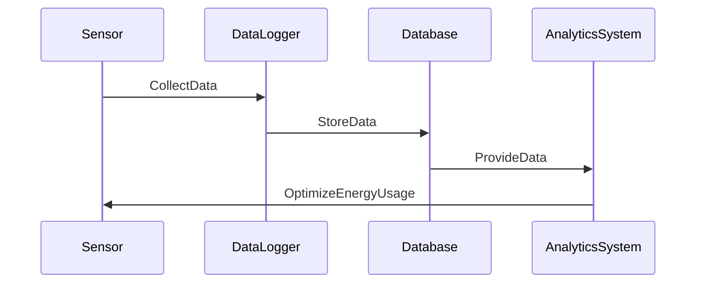

                 

### 3.1.1 能耗数据采集

#### 3.1.1.1 数据采集的重要性

能耗数据的采集是智能建筑能耗监测系统的基础。通过实时获取并分析建筑内各类设备的能耗数据，能够准确了解建筑整体的能耗情况，为后续的能耗分析和优化提供可靠的数据支持。数据采集的精度和及时性直接影响到智能建筑系统的性能和节能效果。

#### 3.1.1.2 数据采集方法

1. **传感器网络**

传感器是能耗数据采集的核心设备。根据监测需求，可选用温度传感器、湿度传感器、光照传感器、电流传感器等。传感器通过采集环境参数，将数据转化为电信号，并通过无线或有线网络传输到中央控制系统。

2. **无线传感器网络（WSN）**

无线传感器网络是一种分布式传感器系统，通过无线通信技术实现传感器节点的数据传输。WSN在智能建筑中的应用能够减少布线成本，提高系统的灵活性。

3. **有线传感器网络**

有线传感器网络主要通过电缆连接传感器和数据采集器，适用于环境稳定、布线方便的场景。

#### 3.1.1.3 数据采集器

数据采集器（Data Logger）是连接传感器和中央控制系统的桥梁。其主要功能是接收传感器传输的数据，进行预处理（如滤波、放大、转换等），然后传输到中央控制系统或数据库。

#### 3.1.1.4 数据传输方式

1. **有线传输**

有线传输通常采用以太网、RS-485、CAN总线等通信协议。有线传输具有较高的稳定性和可靠性，但需要布线，增加了建设成本。

2. **无线传输**

无线传输包括Wi-Fi、ZigBee、LoRa等通信技术。无线传输方便快捷，但容易受到干扰和信号衰减的影响。

#### 3.1.1.5 数据预处理

1. **数据清洗**

去除数据中的噪声、异常值等，确保数据的准确性和一致性。

2. **数据转换**

将采集到的模拟信号转换为数字信号，以便进行后续处理。

3. **数据归一化**

通过归一化处理，将不同量纲的数据转换为同一量纲，便于分析和比较。

#### 3.1.1.6 数据存储与管理

1. **本地存储**

数据采集器可以将处理后的数据实时存储到本地数据库或文件系统中。

2. **云端存储**

将数据上传到云端，实现远程访问和管理。云端存储具有数据安全、扩展性强、易于共享等优点。

#### 3.1.1.7 数据采集案例分析

以某大型智能办公楼为例，其能耗监测系统采用了无线传感器网络和有线传感器网络相结合的方式，实现了对电力、燃气、空调、照明等设备的能耗数据采集。通过数据预处理和存储系统，实现了对能耗数据的实时监控和分析。

**类图示例：**

```mermaid
classDiagram
  Sensor --> DataLogger: sendData
  DataLogger --> Database: storeData
  Database --> AnalyticsSystem: provideData
  Sensor << (温度、湿度、光照、电流等)
  DataLogger << (数据预处理、转换、存储)
  Database << (数据存储、管理)
  AnalyticsSystem << (数据分析和应用)
```

**Mermaid 序列图示例：**



**Python 示例代码：**

```python
import random

# 模拟传感器采集数据
def collect_data(sensor):
    return {
        'sensor_id': sensor,
        'temperature': random.uniform(20, 30),
        'humidity': random.uniform(40, 60),
        'illumination': random.uniform(100, 500),
        'current': random.uniform(0, 10)
    }

# 数据预处理
def preprocess_data(data):
    # 数据清洗、转换、归一化等操作
    return {
        'sensor_id': data['sensor_id'],
        'temperature': (data['temperature'] - 20) / 10,
        'humidity': (data['humidity'] - 40) / 20,
        'illumination': (data['illumination'] - 100) / 400,
        'current': (data['current'] - 0) / 10
    }

# 存储数据
def store_data(data):
    # 存储到数据库或文件系统
    print(f"Storing data: {data}")

# 主函数
def main():
    sensor_data = collect_data('sensor_1')
    preprocessed_data = preprocess_data(sensor_data)
    store_data(preprocessed_data)

if __name__ == "__main__":
    main()
```

通过上述步骤，我们实现了能耗数据的采集、预处理和存储。接下来，我们将探讨如何通过AI技术对采集到的能耗数据进行实时分析和预测。

