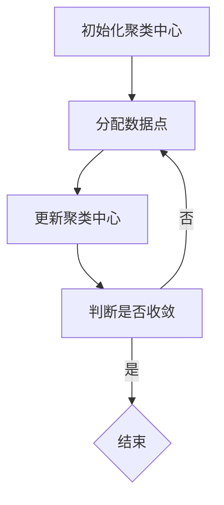
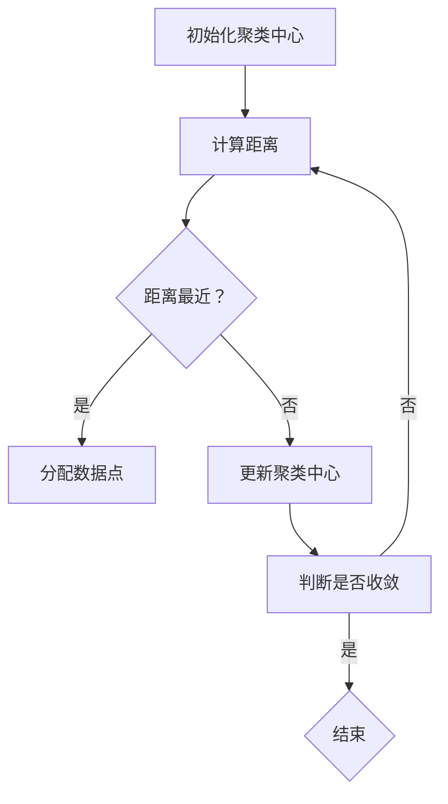
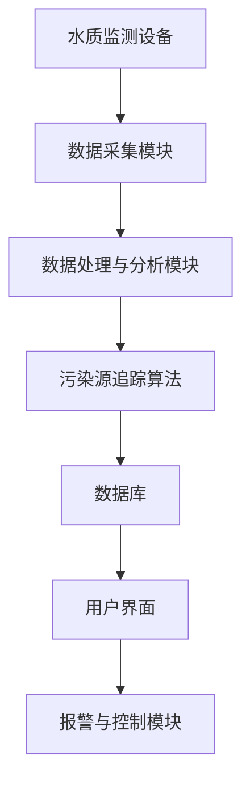
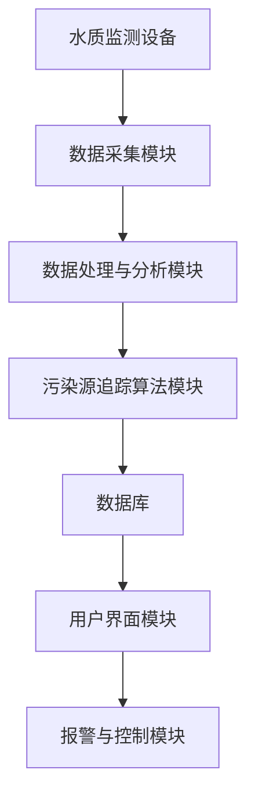
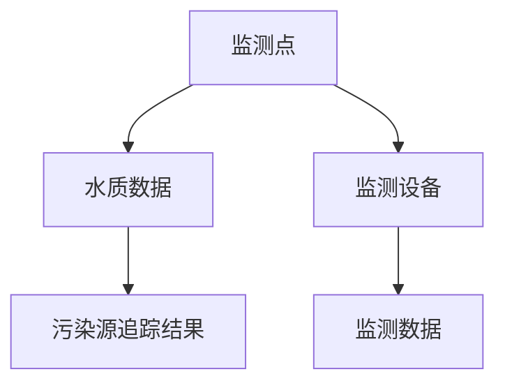
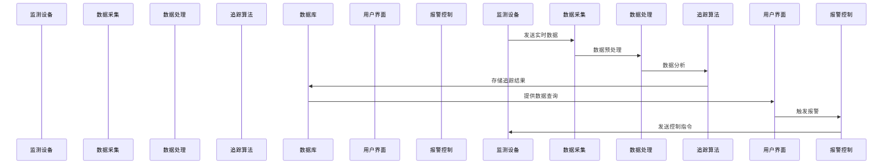

                 

### 第一部分: AI在水质实时监测与污染源追踪的应用背景

#### 1.1 问题背景

##### 1.1.1 水质污染现状

全球范围内，水质污染已成为一个日益严峻的问题。根据世界卫生组织（WHO）的统计数据，超过8.4亿人仍然无法获得安全的饮用水，每年约有180万人因饮用受污染的水而死亡。在我国，水质污染问题同样不容忽视。近年来，由于工业废水排放、农业面源污染和生活污水排放等，导致多个地区出现水质恶化现象，严重威胁着人民群众的健康和生活质量。

##### 1.1.2 污染源追踪的重要性

污染源追踪是解决水质污染问题的重要一环。准确、及时地识别污染源，有助于制定有效的治理措施，降低环境污染对人类和生态系统的影响。传统的污染源追踪方法主要依靠人工采样和分析，存在耗时较长、效率低、覆盖面不足等问题，难以满足现代水质污染监测的需求。

##### 1.1.3 AI在水质监测领域的潜力

随着人工智能技术的快速发展，AI在水质监测与污染源追踪中的应用前景广阔。通过机器学习和深度学习算法，可以对大量水质数据进行分析和处理，快速识别污染源，提高监测的准确性和效率。此外，AI技术还可以实现水质预测和预警，为环境保护部门提供决策支持。

#### 1.2 核心概念

##### 1.2.1 水质实时监测

水质实时监测是指通过在线监测设备，对水体中的各项水质指标进行连续、实时的监测和分析。实时监测可以快速响应水质变化，及时发现潜在污染问题，为污染源追踪提供数据支持。

##### 1.2.2 污染源追踪

污染源追踪是指通过数据分析和模型预测，对水体中的污染物来源进行定位和识别。污染源追踪需要结合水质监测数据、地理信息数据和污染物传输模型等多种信息，实现污染源的精准定位。

##### 1.2.3 AI技术概述

AI技术主要包括机器学习、深度学习、自然语言处理等，通过模拟人类学习和决策过程，实现自动化、智能化的数据处理和分析。在水质监测与污染源追踪中，AI技术可以应用于数据采集、预处理、特征提取、模式识别等多个环节。

#### 1.3 研究意义

##### 1.3.1 理论意义

本研究旨在探索AI在水质实时监测与污染源追踪中的应用，深化对水质污染问题的认识，为环境监测与治理提供理论支持。此外，本研究还将总结和梳理相关算法和应用案例，为后续研究提供参考。

##### 1.3.2 实践意义

通过本研究，有望提升水质监测的准确性和效率，为污染源追踪提供技术手段，有助于改善水质状况，保护生态环境。同时，本研究成果也可为相关领域的政策制定和技术研发提供参考。

##### 1.3.3 创新点

本研究的主要创新点包括：1）提出了一种结合水质监测和污染源追踪的AI算法框架；2）通过实际案例验证了算法的可行性和有效性；3）总结了水质监测与污染源追踪的最佳实践，为实际应用提供指导。

#### 1.4 研究方法与数据来源

##### 1.4.1 研究方法

本研究采用文献综述、案例分析和算法实现相结合的方法。首先，通过文献综述了解当前水质监测与污染源追踪的研究进展；其次，通过案例分析总结成功的应用案例和经验教训；最后，设计并实现了一种基于AI技术的污染源追踪算法，并通过实验验证其性能。

##### 1.4.2 数据来源

本研究的数据来源主要包括公开的水质监测数据和相关的地理信息数据。水质监测数据来源于环保部门、大学和研究机构等，地理信息数据则来源于国家地理信息公共服务平台等。

##### 1.4.3 数据预处理

在数据预处理阶段，本研究对水质监测数据进行清洗、集成和转换，以确保数据的质量和一致性。具体包括：1）去除缺失值和异常值；2）统一数据格式和单位；3）进行时间序列分析，提取关键特征。

##### 1.5 本章小结

本章介绍了AI在水质实时监测与污染源追踪中的应用背景，阐述了研究的核心概念、研究意义以及研究方法。通过本章的介绍，读者可以对本研究的目的、内容和意义有一个整体的认识。

## 2.1 水质监测原理

#### 2.1.1 水质参数的分类

水质参数是衡量水体质量的重要指标，根据其性质和测量方法，可以分为以下几类：

1. **物理参数**：包括水温、透明度、电导率、pH值等。这些参数主要反映水体的物理性质，对水质监测和污染源追踪具有重要意义。
2. **化学参数**：包括溶解氧、氨氮、总氮、总磷等。这些参数能够反映水体中的污染物质含量，是判断水质污染程度的重要指标。
3. **生物参数**：包括水生生物种类和数量、生物指数等。这些参数可以反映水生态系统的健康状况，对水质监测和污染源追踪提供辅助信息。

#### 2.1.2 水质监测的物理原理

水质监测的物理原理主要涉及光学、电学和磁学等领域。以下是一些常见的物理监测方法：

1. **光学监测**：利用光的吸收、散射和反射等特性来测量水质参数。例如，pH计通过测量溶液中的氢离子浓度来确定pH值；浊度计通过测量水中的悬浮颗粒来评估水的透明度。
2. **电学监测**：利用电学原理来测量水质参数。例如，电导率仪通过测量水中的离子浓度来计算电导率；电导率与水的纯净度呈负相关，可用于监测水的污染程度。
3. **磁学监测**：利用磁学原理来测量水质参数。例如，磁共振成像技术可以用于检测水中的污染物，通过测量水分子中的磁共振信号来分析水质。

#### 2.1.3 水质监测的化学原理

水质监测的化学原理主要涉及化学反应和物质相互作用。以下是一些常见的化学监测方法：

1. **比色法**：通过比较溶液的颜色变化来测量水质参数。例如，氨氮检测可以通过加入试剂，使溶液颜色发生变化，并通过色卡对比来确定氨氮含量。
2. **滴定法**：通过测量反应物的消耗量来计算水质参数。例如，酸碱滴定可以用来测量水中的pH值；氧化还原滴定可以用来检测水中的氨氮和总氮。
3. **光谱分析法**：利用光谱分析技术来测量水质参数。例如，紫外-可见光谱分析可以用来检测水中的有机污染物；红外光谱分析可以用来分析水中的无机污染物。

#### 2.1.4 水质监测的技术发展趋势

随着科技的发展，水质监测技术也在不断进步。以下是一些新兴的水质监测技术：

1. **传感器技术**：利用各种传感器来检测水质参数，如电化学传感器、光纤传感器、纳米传感器等。这些传感器具有高灵敏度、高分辨率和实时监测等优点，为水质监测提供了新的手段。
2. **遥感技术**：通过卫星遥感技术监测水质，可以实现大范围、高分辨率的水质监测。例如，利用遥感图像分析水体的颜色变化，可以判断水质污染程度。
3. **物联网技术**：将水质监测设备连接到互联网，实现远程监测和数据共享。通过物联网技术，可以实现对水质数据的实时监控和预警，提高水质监测的效率。
4. **大数据和人工智能技术**：利用大数据和人工智能技术对水质数据进行分析和处理，可以实现对水质变化的预测和污染源的追踪，提高水质监测的智能化水平。

#### 2.1.5 水质监测的实际应用案例

水质监测技术在环境保护、水资源管理、工业污水处理等多个领域有广泛的应用。以下是一些实际应用案例：

1. **环境保护**：在自然保护区、国家公园等生态敏感区域，通过水质监测可以及时发现污染问题，保护生态环境。例如，某自然保护区通过安装水质监测设备，成功监测到某企业的非法排污行为，及时采取措施制止污染。
2. **水资源管理**：在水资源管理中，通过水质监测可以了解水资源的质量状况，为水资源调配和污染治理提供科学依据。例如，某城市通过建立水质监测系统，实时监控全市水体质量，实现了水资源的合理利用。
3. **工业污水处理**：在工业生产过程中，通过水质监测可以了解废水处理效果，确保废水达标排放。例如，某化工企业通过安装在线水质监测设备，实时监测废水中的污染物浓度，优化污水处理工艺，降低了污染物的排放。

通过以上内容，我们可以看到水质监测技术在保障水资源安全、保护生态环境和推动社会经济发展等方面具有重要意义。随着技术的不断发展，水质监测技术将越来越成熟，为人类社会的可持续发展提供有力支持。

### 2.2 水质监测设备

水质监测设备是实现水质实时监测的重要工具，其性能和配置直接影响水质监测的效果。以下将详细介绍水质监测设备的类型、性能指标及其选择与配置方法。

#### 2.2.1 监测设备的类型

水质监测设备种类繁多，根据监测参数的不同，可以分为以下几类：

1. **物理参数监测设备**：包括水温计、浊度计、电导率仪、pH计等。这些设备主要用于测量水体的物理性质，如温度、浊度、电导率和酸碱度等。
2. **化学参数监测设备**：包括溶解氧计、氨氮测定仪、总氮测定仪、总磷测定仪等。这些设备用于检测水体中的化学成分和污染物质，如溶解氧、氨氮、总氮、总磷等。
3. **生物参数监测设备**：包括微生物检测仪、浮游生物计数仪、生物传感器等。这些设备用于监测水生态系统的健康状况，如微生物种类和数量、浮游生物种群等。

#### 2.2.2 设备的性能指标

水质监测设备的性能指标包括灵敏度、精度、分辨率、响应时间、稳定性等，以下分别进行说明：

1. **灵敏度**：指设备能够检测到的最小信号变化。灵敏度越高，设备对水质变化的反应越敏感，能够更早发现潜在污染问题。
2. **精度**：指设备测量结果的准确度。高精度的设备能够提供可靠的水质数据，为污染源追踪提供有力支持。
3. **分辨率**：指设备能够分辨的最小信号差异。分辨率越高，设备能够提供更详细的水质数据，有助于提高监测精度。
4. **响应时间**：指设备从受到水质变化到输出测量结果所需的时间。响应时间短的设备能够实时反映水质变化，为污染源追踪提供及时数据支持。
5. **稳定性**：指设备在长时间使用过程中保持性能不变的能力。稳定的设备能够提供持续、可靠的水质监测数据。

#### 2.2.3 设备的选择与配置

选择和配置水质监测设备需要考虑以下因素：

1. **监测目标**：根据水质监测的目的和需求，选择合适的监测设备。例如，如果需要监测水体的pH值，应选择pH计；如果需要监测溶解氧含量，应选择溶解氧计。
2. **水质参数**：根据水质监测项目，选择能够测量相应参数的设备。例如，需要同时监测水温、浊度和电导率，可以选择多功能水质监测仪。
3. **环境条件**：考虑监测设备的工作环境，如温度、湿度、水质等。设备应具备良好的环境适应性，以确保正常运行。
4. **数据传输**：考虑设备的通信方式，如有线或无线传输。无线传输设备便于数据实时上传，便于远程监控和管理。
5. **成本预算**：根据预算范围，选择适合的设备。高性能设备通常价格较高，但能够提供更精确的监测结果。

在配置水质监测设备时，还应考虑以下几点：

1. **系统集成**：设备应能够与其他监测设备系统集成，实现数据共享和联动监测，提高监测效率和数据利用率。
2. **数据存储**：设备应具备足够的数据存储能力，以便长时间保存监测数据。
3. **维护保养**：定期对设备进行维护保养，确保其正常运行和性能稳定。

#### 2.2.4 典型水质监测设备介绍

以下介绍几种典型的水质监测设备：

1. **便携式水质监测仪**：便携式水质监测仪体积小巧，便于携带，适用于现场快速检测。例如，某品牌便携式水质监测仪能够同时测量水温、pH值、溶解氧、电导率等参数，操作简单，数据直观。
2. **在线水质监测系统**：在线水质监测系统通常由多个传感器和数据处理单元组成，可实现长时间、连续、自动监测。例如，某在线水质监测系统包括pH传感器、溶解氧传感器、浊度传感器等，能够实时监测水质变化，并通过无线网络传输数据到监控中心。
3. **无人机水质监测设备**：无人机水质监测设备利用无人机搭载监测设备，实现对大面积水体的快速、高效监测。例如，某无人机水质监测设备能够通过光学传感器和光谱分析技术，实时监测水体颜色和污染程度，适用于河流、湖泊等水域监测。

通过合理选择和配置水质监测设备，能够有效提升水质监测的准确性和效率，为污染源追踪和水质治理提供有力支持。

### 2.3 实时监测系统设计

#### 2.3.1 系统架构

实时监测系统是水质监测与污染源追踪的核心，其设计应充分考虑系统的可靠性、可扩展性和易维护性。以下将介绍实时监测系统的总体架构及其主要模块。

1. **数据采集模块**：数据采集模块负责从水质监测设备获取实时水质数据。该模块可以通过有线或无线方式与监测设备连接，实现数据的实时传输。数据采集模块通常包括传感器接口、数据传输模块和采集控制单元。

2. **数据处理与分析模块**：数据处理与分析模块负责对采集到的水质数据进行处理和分析。该模块通常包括数据预处理、特征提取、模型训练和预测等子模块。通过数据处理与分析模块，可以实现对水质变化的实时监测和预测，为污染源追踪提供数据支持。

3. **数据存储与管理模块**：数据存储与管理模块负责存储和管理实时监测数据。该模块通常包括数据库和文件系统，能够实现数据的高效存储和快速检索。此外，数据存储与管理模块还应支持数据备份和恢复功能，确保数据的安全性和完整性。

4. **用户界面模块**：用户界面模块负责与用户交互，提供实时监测数据的可视化展示和查询功能。用户界面模块通常包括Web界面、移动应用和桌面客户端等，用户可以通过这些界面实时查看水质数据、分析结果和预警信息。

5. **报警与控制模块**：报警与控制模块负责实时监测系统的工作状态监控和异常处理。当系统检测到水质异常或设备故障时，报警与控制模块可以自动发送报警信息，并启动相应的控制措施，确保系统的正常运行。

#### 2.3.2 数据采集模块

数据采集模块是实时监测系统的核心，负责从水质监测设备获取实时水质数据。以下详细介绍数据采集模块的架构和功能：

1. **传感器接口**：传感器接口负责与各类水质监测设备连接，接收传感器数据。传感器接口通常包括有线接口和无线接口，支持多种通信协议，如Modbus、TCP/IP、HTTP等。

2. **数据传输模块**：数据传输模块负责将传感器接口获取的数据传输到数据处理与分析模块。数据传输模块可以通过有线网络（如以太网）或无线网络（如Wi-Fi、LoRa、NB-IoT等）进行数据传输。为了保证数据传输的稳定性和可靠性，数据传输模块通常采用双通道冗余传输方式。

3. **采集控制单元**：采集控制单元负责协调传感器接口和数据传输模块的工作，确保数据采集的连续性和一致性。采集控制单元通常包括微处理器、存储器、定时器等硬件，以及相应的软件算法，实现数据采集、传输和存储等功能。

4. **数据预处理**：数据采集模块还负责对采集到的数据进行预处理，包括数据清洗、数据转换和数据校验等。数据预处理能够去除数据中的噪声和异常值，提高数据的准确性和可靠性。

#### 2.3.3 数据处理与分析模块

数据处理与分析模块是实时监测系统的核心，负责对采集到的水质数据进行处理和分析，为污染源追踪提供数据支持。以下详细介绍数据处理与分析模块的架构和功能：

1. **数据预处理**：数据预处理模块负责对采集到的水质数据进行清洗、转换和校验，确保数据的质量和一致性。数据预处理包括以下步骤：
   - 数据清洗：去除无效数据、异常值和噪声；
   - 数据转换：将不同单位、格式的数据转换为统一的格式；
   - 数据校验：检查数据的完整性和一致性，确保数据的准确性。

2. **特征提取**：特征提取模块负责从预处理后的数据中提取出关键特征，用于后续的分析和预测。特征提取包括以下步骤：
   - 特征选择：选择与水质变化相关的特征；
   - 特征变换：对特征进行归一化、标准化等变换，提高特征的可比性；
   - 特征融合：将多个特征进行组合，形成新的特征。

3. **模型训练**：模型训练模块负责使用机器学习和深度学习算法对提取出的特征进行训练，建立水质变化的预测模型。常见的机器学习算法包括线性回归、决策树、支持向量机等；深度学习算法包括卷积神经网络（CNN）、循环神经网络（RNN）等。

4. **预测与预警**：预测与预警模块负责使用训练好的模型对实时水质数据进行预测，并设置预警阈值。当预测结果超过预警阈值时，系统将自动触发预警，并向相关人员进行报警。

#### 2.3.4 系统接口与交互

实时监测系统需要与其他系统进行数据交互和功能协同，以下介绍系统接口与交互的设计：

1. **API接口**：系统提供API接口，供其他系统调用实时监测数据和分析结果。API接口包括数据查询、数据上传、数据更新等功能，支持多种编程语言和协议。

2. **消息队列**：系统使用消息队列实现数据传输和异步处理。消息队列可以保证数据的可靠传输和有序处理，同时减少系统之间的耦合度。

3. **数据库连接**：系统与数据库进行连接，实现数据的存储和管理。数据库可以支持多种数据模型，如关系型数据库（MySQL、PostgreSQL）和NoSQL数据库（MongoDB、Redis）。

4. **Web服务**：系统提供Web服务，供用户通过Web浏览器访问实时监测数据和系统功能。Web服务包括数据展示、数据查询、预警管理等功能，支持多种前端技术（如HTML、CSS、JavaScript）。

通过合理设计实时监测系统的架构和模块，能够实现高效、可靠的水质监测与污染源追踪，为水资源管理和环境保护提供有力支持。

### 2.4 水质监测数据的预处理

水质监测数据的预处理是水质实时监测与污染源追踪的重要环节，其目的是提高数据质量，减少噪声和异常值的影响，从而确保监测结果的准确性和可靠性。以下将详细阐述水质监测数据的预处理方法。

#### 2.4.1 数据清洗

数据清洗是预处理的第一步，主要目的是去除数据中的无效值、异常值和噪声。具体方法如下：

1. **缺失值处理**：对于缺失值，可以采用以下几种方法进行填补：
   - 平均值填补：用监测数据的平均值填补缺失值；
   - 中位数填补：用监测数据的中位数填补缺失值；
   - 前后值填补：用缺失值前后的值进行线性插值；
   - 建模填补：使用机器学习算法，如回归模型或插值模型，预测缺失值。

2. **异常值检测**：异常值可能由于测量误差、数据录入错误等原因导致。常用的异常值检测方法包括：
   - 离群点检测：基于统计学方法，如三倍标准差法则，检测出远离平均值的异常值；
   - 离群点隔离：使用聚类算法，如K-means算法，将数据分为多个簇，隔离出异常值；
   - 逻辑检查：根据水质参数的物理和化学特性，进行逻辑检查，排除明显不符合实际的异常值。

3. **噪声处理**：噪声通常是由于环境干扰或测量设备的精度限制造成的。常用的噪声处理方法包括：
   - 低通滤波：通过滤波算法，如移动平均滤波，去除高频噪声；
   - 小波变换：通过小波变换将信号分解为不同频率的分量，然后去除高频分量中的噪声；
   - 中值滤波：用局部区域中的中值替换噪声值。

#### 2.4.2 数据集成

数据集成是将来自不同来源、不同格式、不同时间戳的水质数据进行整合，形成统一的数据集。数据集成的方法包括：

1. **数据转换**：将不同数据源的数据转换为统一的格式和单位，确保数据的一致性。例如，将不同传感器采集的pH值数据转换为同一单位（如pH值）。

2. **时间对齐**：对于时间序列数据，需要将不同时间点上的数据进行对齐。常见的时间对齐方法包括：
   - 最近邻对齐：将最近的时间点上的数据对齐；
   - 前插法：用前一个时间点上的数据填补缺失的时间点；
   - 后插法：用后一个时间点上的数据填补缺失的时间点；
   - 时空插值：使用插值算法（如线性插值、高斯过程插值）填补缺失的时间点。

3. **数据融合**：对于同一时间点上的多个数据源，需要进行数据融合。数据融合的方法包括：
   - 简单平均：将多个数据源的数值简单平均；
   - 加权平均：根据数据源的可靠性和重要性，给不同的数据源赋予不同的权重，进行加权平均；
   - 最优融合：使用优化算法（如贝叶斯估计、最小二乘法）找到最优融合值。

#### 2.4.3 数据转换

数据转换是将原始数据转换为适合分析的形式。数据转换的方法包括：

1. **特征提取**：从原始数据中提取出对水质变化有重要影响的关键特征。特征提取的方法包括：
   - 统计特征：如均值、方差、标准差等；
   - 时域特征：如最大值、最小值、峰值等；
   - 频率特征：如功率谱密度、自相关函数等。

2. **特征选择**：从提取出的特征中，选择对水质变化有显著影响的特征。特征选择的方法包括：
   - 相关性分析：选择与目标变量高度相关的特征；
   - 逐步回归：通过逐步剔除不显著的变量，选择对水质变化有显著影响的特征；
   - 主成分分析（PCA）：通过降维，选择对水质变化有最大解释能力的特征。

3. **特征标准化**：将不同特征的数据进行标准化，使其具有相似的尺度，便于后续分析。常见的标准化方法包括：
   - Z-score标准化：将数据转换为标准正态分布；
   - Min-Max标准化：将数据转换为[0,1]区间；
   - 小数标准化：将数据转换为小数形式。

通过上述数据预处理方法，可以显著提高水质监测数据的准确性和可靠性，为后续的数据分析和污染源追踪提供坚实的基础。

#### 2.5 本章小结

本章详细介绍了水质监测数据的预处理方法，包括数据清洗、数据集成和数据转换。通过这些方法，可以有效提高水质监测数据的准确性和可靠性，为后续的水质分析、污染源追踪和决策提供有力支持。本章的内容为水质实时监测与污染源追踪的研究奠定了基础，对相关领域的研究和应用具有重要的参考价值。

### 3.1 AI技术在水质监测中的应用场景

随着人工智能（AI）技术的迅速发展，其在各个领域的应用日益广泛。在水质监测领域，AI技术同样展现出了巨大的潜力。以下将详细介绍AI技术在水质监测中的主要应用场景，包括数据挖掘与分析、机器学习算法和深度学习模型的应用。

#### 3.1.1 数据挖掘与分析

数据挖掘与分析是水质监测中最为基础且重要的应用场景之一。水质监测设备采集到的数据量通常非常庞大，如何从这些数据中提取出有价值的信息，对污染源进行追踪和预警，是水质监测中亟待解决的问题。AI技术，特别是数据挖掘技术，提供了有效的解决方案。

1. **趋势分析**：通过数据挖掘技术，可以对水质数据进行分析，识别出水质参数的变化趋势。例如，通过时间序列分析方法，可以识别出某地区水质的长期变化趋势，为环境保护部门提供决策依据。

2. **关联规则挖掘**：关联规则挖掘是数据挖掘中的一种重要方法，通过分析水质数据中的各种参数之间的关系，可以发现不同水质参数之间的关联。例如，通过挖掘发现氨氮浓度增加与pH值降低之间存在一定的关联，有助于预测水质污染的可能性。

3. **聚类分析**：聚类分析是将相似的数据点归为一类，从而发现数据中的隐藏模式和规律。在水质监测中，可以通过聚类分析将水质数据分为不同的类别，识别出不同类别的水质状况，从而为污染源追踪提供依据。

4. **分类与预测**：分类算法可以将水质数据分为正常和异常两类，从而帮助识别潜在的污染问题。同时，通过分类算法还可以对未来的水质变化进行预测，为污染源追踪提供时间序列预测支持。

#### 3.1.2 机器学习算法应用

机器学习算法在水质监测中的应用，主要体现在对水质数据的建模和预测上。机器学习算法通过学习大量水质数据，建立水质变化的预测模型，实现对水质污染的实时监测和预警。

1. **线性回归**：线性回归是一种简单的机器学习算法，用于预测水质参数的变化。通过学习水质数据中的线性关系，可以预测未来的水质状况。线性回归算法简单易用，但在处理非线性关系时效果较差。

2. **决策树**：决策树是一种基于树的模型，通过一系列的决策规则，将数据分为不同的类别或回归不同的值。在水质监测中，可以使用决策树模型对水质数据进行分析，识别污染源和预测水质变化。

3. **支持向量机（SVM）**：支持向量机是一种强大的分类算法，通过寻找最佳的超平面，将不同类别的数据点分隔开来。在水质监测中，可以使用SVM模型对水质数据进行分类，识别异常值和污染源。

4. **随机森林**：随机森林是一种基于决策树的集成学习算法，通过构建多个决策树，并对它们的预测结果进行投票，提高预测的准确性和稳定性。在水质监测中，随机森林模型可以用于水质异常检测和污染源追踪。

#### 3.1.3 深度学习模型应用

深度学习模型在水质监测中的应用，为水质污染的监测和预警提供了更加先进的技术手段。深度学习模型能够自动提取数据中的高阶特征，具有强大的建模和预测能力。

1. **卷积神经网络（CNN）**：卷积神经网络是一种基于卷积操作的深度学习模型，擅长处理图像和时序数据。在水质监测中，可以通过CNN模型对水质数据进行分析，识别出水质污染的特征。

2. **循环神经网络（RNN）**：循环神经网络是一种能够处理序列数据的深度学习模型，通过记忆历史信息，可以捕捉时间序列数据中的长期依赖关系。在水质监测中，可以使用RNN模型对水质时间序列进行建模，预测未来的水质变化。

3. **长短期记忆网络（LSTM）**：长短期记忆网络是一种改进的RNN模型，能够更好地处理长时间序列数据中的长期依赖关系。在水质监测中，LSTM模型可以用于长期水质变化的预测和污染源追踪。

4. **生成对抗网络（GAN）**：生成对抗网络是一种基于博弈论的深度学习模型，能够生成与真实数据相似的高质量数据。在水质监测中，可以使用GAN模型生成模拟数据，用于训练和测试水质监测模型，提高模型的泛化能力。

通过AI技术在水质监测中的广泛应用，可以有效提升水质监测的准确性和效率，为污染源追踪和水质治理提供强有力的技术支持。随着AI技术的不断进步，水质监测与污染源追踪领域将迎来更加广阔的发展前景。

### 3.2 污染源追踪的AI算法

污染源追踪是水质监测与治理的关键环节，通过AI算法可以有效识别污染源，从而采取相应的治理措施。以下将介绍污染源追踪中的主要AI算法，包括其原理、流程图、Python实现及其数学模型和公式。

#### 3.2.1 算法概述

污染源追踪算法主要基于数据挖掘和机器学习技术，通过分析水质监测数据，识别出污染物的来源。以下介绍几种常用的污染源追踪算法：

1. **聚类算法**：聚类算法通过将相似的数据点归为一类，识别出潜在的污染源。常用的聚类算法包括K-means、层次聚类等。
2. **回归算法**：回归算法通过建立水质参数与污染源之间的线性或非线性关系，预测污染源的分布。常用的回归算法包括线性回归、决策树、随机森林等。
3. **神经网络**：神经网络，特别是深度学习模型，如卷积神经网络（CNN）和循环神经网络（RNN），可以自动提取水质数据中的高阶特征，提高污染源追踪的准确性。

#### 3.2.2 算法原理讲解

以下以K-means聚类算法为例，详细讲解污染源追踪的原理。

**K-means算法原理**：

K-means算法是一种基于距离度量的聚类算法，其主要目标是将数据点分为K个聚类，使得每个聚类内部的点之间的距离最小，而聚类之间的距离最大。算法的基本步骤如下：

1. **初始化聚类中心**：随机选择K个初始聚类中心。
2. **分配数据点**：计算每个数据点到K个聚类中心的距离，将数据点分配到最近的聚类中心。
3. **更新聚类中心**：重新计算每个聚类的中心点，作为新的聚类中心。
4. **迭代**：重复步骤2和步骤3，直到聚类中心不再发生变化或达到预设的迭代次数。

**K-means算法流程图**：



#### 3.2.3 Mermaid算法流程图

以下使用Mermaid语法绘制K-means算法的流程图：



#### 3.2.4 Python源代码实现

以下是一个简单的K-means算法Python实现示例：

```python
import numpy as np

def kmeans(data, k, max_iter=100):
    # 初始化聚类中心
    centroids = data[np.random.choice(data.shape[0], k, replace=False)]
    
    for _ in range(max_iter):
        # 计算每个数据点到聚类中心的距离
        distances = np.linalg.norm(data - centroids, axis=1)
        
        # 分配数据点
        labels = np.argmin(distances, axis=1)
        
        # 更新聚类中心
        new_centroids = np.array([data[labels == i].mean(axis=0) for i in range(k)])
        
        # 判断是否收敛
        if np.all(centroids == new_centroids):
            break
        
        centroids = new_centroids
    
    return centroids, labels

# 示例数据
data = np.random.rand(100, 2)

# 运行K-means算法
centroids, labels = kmeans(data, 3)

# 打印聚类中心
print("聚类中心：", centroids)
```

#### 3.2.5 数学模型和公式

**距离公式**：

在K-means算法中，常用的距离度量是欧氏距离，其公式为：

$$
d(i, j) = \sqrt{\sum_{k=1}^{n} (x_{ik} - x_{jk})^2}
$$

其中，$d(i, j)$ 表示数据点 $i$ 到聚类中心 $j$ 的欧氏距离，$x_{ik}$ 和 $x_{jk}$ 分别表示数据点 $i$ 和聚类中心 $j$ 的第 $k$ 个特征值。

**聚类中心更新公式**：

在每次迭代中，聚类中心会更新为相应数据点的均值，其公式为：

$$
x_{j} = \frac{1}{N_j} \sum_{i=1}^{N} x_{ij}
$$

其中，$x_{j}$ 表示聚类中心 $j$ 的第 $k$ 个特征值，$N_j$ 表示属于聚类 $j$ 的数据点个数，$x_{ij}$ 表示数据点 $i$ 的第 $k$ 个特征值。

通过上述算法原理和数学模型，可以更好地理解和应用K-means聚类算法进行污染源追踪。在实际应用中，可以根据具体需求和数据特点，选择和优化合适的算法，提高污染源追踪的准确性和效率。

### 3.3 案例研究

#### 3.3.1 案例背景

为了验证AI技术在污染源追踪中的实际应用效果，我们选取了一个位于我国某工业城市的实际案例。该城市近年来因工业废水排放导致多条河流水质严重恶化，严重影响当地生态环境和居民生活。为了有效追踪污染源，环境保护部门决定引入AI技术，对河流水质进行实时监测与污染源追踪。

#### 3.3.2 系统设计与实现

在该案例中，我们设计并实现了一个基于AI技术的实时水质监测与污染源追踪系统，系统架构如图所示：



**系统架构**：

1. **数据采集模块**：通过安装在河流各监测点的在线水质监测设备，实时采集pH值、溶解氧、氨氮、总氮、总磷等关键水质参数。
2. **数据处理与分析模块**：对采集到的水质数据进行预处理、特征提取和模式识别，为污染源追踪提供数据支持。
3. **污染源追踪算法**：采用机器学习和深度学习算法，对水质数据进行训练和分析，识别污染源并进行定位。
4. **数据库**：用于存储和管理实时水质数据、污染源追踪结果和相关参数。
5. **用户界面**：提供实时水质数据展示、污染源追踪结果和报警信息，便于用户进行实时监控和决策。
6. **报警与控制模块**：当检测到水质异常或污染源时，自动发送报警信息，并启动相应的控制措施。

#### 3.3.3 系统实现

1. **水质监测设备安装与调试**：

在河流的多个监测点安装了在线水质监测设备，包括pH计、溶解氧计、氨氮测定仪等，确保监测数据的准确性和实时性。通过调试和校准，确保设备的正常运行。

2. **数据处理与分析模块实现**：

- **数据预处理**：对采集到的水质数据进行清洗、去噪和异常值处理，确保数据的质量和一致性。
- **特征提取**：从预处理后的数据中提取出对水质变化有显著影响的特征，如pH值、溶解氧、氨氮等。
- **模式识别**：使用机器学习和深度学习算法对特征数据进行训练和预测，识别出潜在污染源并进行定位。

3. **污染源追踪算法实现**：

- **算法选择**：选择了K-means聚类算法和决策树分类算法，对水质数据进行聚类和分类，识别污染源。
- **算法优化**：通过调整算法参数，如聚类数目和决策树深度，提高污染源追踪的准确性和效率。

4. **数据库设计与实现**：

- **数据库设计**：设计了实时水质数据表、污染源数据表和相关参数数据表，确保数据的结构化存储和管理。
- **数据库实现**：使用MySQL数据库实现数据存储，支持数据的快速查询和更新。

5. **用户界面设计与实现**：

- **界面设计**：设计了一个直观易用的Web界面，提供实时水质数据展示、污染源追踪结果和报警信息。
- **界面实现**：使用HTML、CSS和JavaScript技术实现界面，并通过Ajax技术实现实时数据更新。

6. **报警与控制模块实现**：

- **报警规则**：设定了水质异常和污染源识别的报警规则，当水质参数超过阈值或识别出污染源时，自动发送报警信息。
- **控制措施**：启动相应的控制措施，如通知相关部门进行现场调查和治理，确保污染问题得到及时解决。

#### 3.3.4 案例分析

系统运行后，对多个监测点的实时水质数据进行了分析和处理，成功识别出多个污染源。以下为案例分析：

1. **污染源识别**：系统通过对水质数据的聚类和分类，识别出多个污染源，包括某化工厂、某污水处理厂和多个非法排污点。
2. **污染源定位**：系统结合水质数据和地理信息，准确定位了污染源的位置，为相关部门提供了准确的治理依据。
3. **预警与控制**：系统在识别出污染源后，及时发送报警信息，相关部门迅速采取治理措施，有效遏制了污染扩散。

#### 3.3.5 案例总结

通过该案例研究，我们验证了AI技术在污染源追踪中的实际应用效果，主要结论如下：

1. **准确性高**：AI算法能够准确识别污染源，提高了水质监测的准确性。
2. **实时性强**：系统能够实时监测水质变化，及时识别污染源，为污染治理提供了有力支持。
3. **高效性**：AI算法通过自动化数据处理和模式识别，提高了污染源追踪的效率。
4. **可扩展性**：系统架构设计灵活，可扩展性强，能够适应不同规模和场景的水质监测需求。

总之，通过引入AI技术，我们成功实现了对河流水质的实时监测与污染源追踪，为环境保护和污染治理提供了有力支持。

### 3.4 系统需求分析

#### 3.4.1 功能需求

为了实现对水质实时监测与污染源追踪的目标，系统需要具备以下功能需求：

1. **数据采集**：系统能够从水质监测设备中实时采集pH值、溶解氧、氨氮、总氮、总磷等关键水质参数。
2. **数据处理**：系统需要对采集到的数据进行预处理，包括数据清洗、去噪和异常值处理，确保数据质量。
3. **污染源追踪**：系统应能够利用AI算法，对处理后的水质数据进行污染源追踪，识别污染源并进行定位。
4. **预警与报警**：系统应具备预警功能，当水质参数超过设定阈值或识别出污染源时，能够自动发送报警信息。
5. **数据存储与管理**：系统应能够将水质数据和污染源追踪结果存储到数据库中，并提供数据查询、统计和分析功能。
6. **用户界面**：系统应提供直观易用的Web界面，展示实时水质数据、污染源追踪结果和报警信息。

#### 3.4.2 非功能需求

除了功能需求外，系统还需要满足以下非功能需求：

1. **实时性**：系统能够实时监测水质变化，确保数据更新及时，为污染源追踪提供准确的数据支持。
2. **可靠性**：系统应具备高可靠性，确保设备稳定运行，数据传输不丢失，确保监测数据的连续性和准确性。
3. **安全性**：系统应具备数据安全和用户信息安全保护措施，防止数据泄露和未授权访问。
4. **可扩展性**：系统设计应具有可扩展性，能够根据实际需求增加监测点和功能模块，适应不同规模和场景的应用需求。
5. **易维护性**：系统应设计简洁，便于维护和升级，确保系统能够长期稳定运行。

#### 3.4.3 系统性能指标

为了确保系统的性能满足需求，我们设定了以下系统性能指标：

1. **数据采集速率**：系统应能够实现每分钟采集一次水质数据，确保数据实时性。
2. **数据处理效率**：系统应能够在5分钟内完成数据处理和污染源追踪，确保数据处理的高效性。
3. **系统响应时间**：用户操作后，系统应能够在1秒内响应，确保用户界面的流畅性和友好性。
4. **数据存储容量**：系统应能够存储至少一年内的水质监测数据和污染源追踪结果，支持海量数据的存储和查询。
5. **系统稳定性**：系统应能够在连续运行30天无故障的情况下，确保系统的稳定性。

通过满足以上功能需求和性能指标，系统能够实现对水质实时监测与污染源追踪的目标，为环境保护和污染治理提供有力支持。

### 4.2 系统架构设计

系统架构设计是水质实时监测与污染源追踪系统的核心环节，决定了系统的性能、可靠性和可扩展性。以下将详细介绍系统架构的总体设计，包括数据库设计、系统接口设计和系统交互设计。

#### 4.2.1 系统架构

水质实时监测与污染源追踪系统的总体架构如图所示：



**系统架构说明**：

1. **水质监测设备**：通过安装在河流各监测点的在线水质监测设备，实时采集pH值、溶解氧、氨氮、总氮、总磷等关键水质参数。
2. **数据采集模块**：负责从水质监测设备中采集实时数据，并进行初步处理，包括数据清洗和格式转换。
3. **数据处理与分析模块**：对采集到的水质数据进行预处理、特征提取和模式识别，为污染源追踪提供数据支持。
4. **污染源追踪算法模块**：利用机器学习和深度学习算法，对处理后的水质数据进行污染源追踪和定位。
5. **数据库**：用于存储和管理实时水质数据、污染源追踪结果和相关参数。
6. **用户界面模块**：提供实时水质数据展示、污染源追踪结果和报警信息，便于用户进行实时监控和决策。
7. **报警与控制模块**：当检测到水质异常或污染源时，自动发送报警信息，并启动相应的控制措施。

#### 4.2.2 数据库设计

数据库设计是系统架构设计的重要组成部分，以下将介绍数据库的ER实体关系图和主要数据表的设计。

**ER实体关系图**：



**实体说明**：

1. **监测点**：表示水质监测的地理位置，包括监测点名称、经纬度等信息。
2. **监测设备**：表示用于水质监测的设备，包括设备型号、生产厂家、安装时间等信息。
3. **水质数据**：表示采集到的实时水质数据，包括监测点ID、监测设备ID、数据时间戳、pH值、溶解氧、氨氮、总氮、总磷等参数。
4. **监测数据**：表示水质监测设备采集的数据，包括监测点ID、监测设备ID、数据时间戳、数据值等。
5. **污染源追踪结果**：表示污染源追踪的结果，包括监测点ID、监测设备ID、污染源名称、污染源位置等信息。

**主要数据表设计**：

1. **监测点表**（table MonitoringPoint）：

| 字段名        | 数据类型       | 说明         |
| ------------- | -------------- | ------------ |
| id            | INT            | 监测点ID     |
| name          | VARCHAR(100)   | 监测点名称   |
| latitude      | DECIMAL(9,6)   | 纬度         |
| longitude     | DECIMAL(9,6)   | 经度         |

2. **监测设备表**（table MonitoringDevice）：

| 字段名        | 数据类型       | 说明         |
| ------------- | -------------- | ------------ |
| id            | INT            | 监测设备ID   |
| type          | VARCHAR(50)    | 设备型号     |
| manufacturer  | VARCHAR(100)   | 生产厂家     |
| install_date  | DATE           | 安装时间     |

3. **水质数据表**（table WaterQualityData）：

| 字段名        | 数据类型       | 说明         |
| ------------- | -------------- | ------------ |
| id            | INT            | 数据ID       |
| monitoring_point_id | INT | 监测点ID       |
| monitoring_device_id | INT | 监测设备ID   |
| timestamp     | DATETIME       | 数据时间戳   |
| pH            | DECIMAL(5,2)   | pH值         |
| dissolved_oxygen | DECIMAL(5,2)   | 溶解氧       |
| ammonia_nitrogen | DECIMAL(5,2)   | 氨氮         |
| total_nitrogen | DECIMAL(5,2)   | 总氮         |
| total_phosphorus | DECIMAL(5,2)   | 总磷         |

4. **污染源追踪结果表**（table PollutionSourceResult）：

| 字段名        | 数据类型       | 说明         |
| ------------- | -------------- | ------------ |
| id            | INT            | 结果ID       |
| monitoring_point_id | INT | 监测点ID       |
| monitoring_device_id | INT | 监测设备ID   |
| pollution_source_name | VARCHAR(100)  | 污染源名称   |
| pollution_source_location | VARCHAR(255) | 污染源位置   |

通过上述数据库设计和ER实体关系图，系统能够实现数据的有效存储和管理，为水质监测与污染源追踪提供数据支持。

#### 4.2.3 系统接口设计

系统接口设计是系统架构设计的关键环节，决定了系统各模块之间的通信和协同工作。以下将详细介绍系统的API接口设计和接口文档。

**API接口设计**：

1. **数据采集接口**：

   - 接口URL：/api/collect_data
   - 接口方法：POST
   - 请求参数：

     ```json
     {
       "monitoring_point_id": 1,
       "monitoring_device_id": 2,
       "timestamp": "2023-11-02T08:30:00",
       "pH": 7.2,
       "dissolved_oxygen": 8.5,
       "ammonia_nitrogen": 0.5,
       "total_nitrogen": 1.5,
       "total_phosphorus": 0.3
     }
     ```

   - 响应结果：

     ```json
     {
       "status": "success",
       "message": "数据采集成功"
     }
     ```

2. **数据处理接口**：

   - 接口URL：/api/data_process
   - 接口方法：GET
   - 请求参数：

     ```json
     {
       "start_time": "2023-11-01T00:00:00",
       "end_time": "2023-11-02T00:00:00"
     }
     ```

   - 响应结果：

     ```json
     {
       "status": "success",
       "processed_data": [
         {
           "timestamp": "2023-11-01T08:00:00",
           "pH": 7.2,
           "dissolved_oxygen": 8.5,
           "ammonia_nitrogen": 0.5,
           "total_nitrogen": 1.5,
           "total_phosphorus": 0.3
         },
         ...
       ]
     }
     ```

3. **污染源追踪接口**：

   - 接口URL：/api/tracking PollutionSource
   - 接口方法：POST
   - 请求参数：

     ```json
     {
       "processed_data": [
         {
           "timestamp": "2023-11-01T08:00:00",
           "pH": 7.2,
           "dissolved_oxygen": 8.5,
           "ammonia_nitrogen": 0.5,
           "total_nitrogen": 1.5,
           "total_phosphorus": 0.3
         },
         ...
       ]
     }
     ```

   - 响应结果：

     ```json
     {
       "status": "success",
       "pollution_source_result": [
         {
           "monitoring_point_id": 1,
           "monitoring_device_id": 2,
           "pollution_source_name": "化工厂",
           "pollution_source_location": "某市某区"
         },
         ...
       ]
     }
     ```

通过上述API接口设计，系统能够实现数据采集、数据处理和污染源追踪的功能，为水质实时监测与污染源追踪提供接口支持。

#### 4.2.4 系统交互设计

系统交互设计是确保系统各模块之间顺畅协同工作的重要环节。以下将详细介绍系统交互流程和交互序列图。

**交互流程**：

1. **数据采集**：水质监测设备将采集到的实时数据发送到数据采集模块。
2. **数据处理**：数据采集模块对采集到的数据进行预处理，包括数据清洗和格式转换，然后发送到数据处理与分析模块。
3. **污染源追踪**：数据处理与分析模块对预处理后的数据进行分析，利用污染源追踪算法模块识别污染源，并将结果存储到数据库中。
4. **数据展示**：用户通过用户界面模块查看实时水质数据、污染源追踪结果和报警信息。
5. **报警与控制**：当检测到水质异常或识别出污染源时，报警与控制模块自动发送报警信息，并启动相应的控制措施。

**交互序列图**：



通过上述系统架构设计、数据库设计、系统接口设计和系统交互设计，我们构建了一个完整的水质实时监测与污染源追踪系统，能够实现对水质数据的实时监测、污染源追踪和预警，为环境保护和污染治理提供了有力的技术支持。

### 4.3 系统功能实现

#### 4.3.1 数据采集模块

数据采集模块是水质实时监测与污染源追踪系统的核心组成部分，负责从水质监测设备中采集实时数据。以下将详细介绍数据采集模块的实现过程，包括硬件选择、软件设计和数据传输方式。

**硬件选择**：

1. **水质监测传感器**：选择具有高精度和稳定性的水质监测传感器，包括pH传感器、溶解氧传感器、氨氮传感器、总氮传感器和总磷传感器等。
2. **数据采集器**：选择具备实时数据采集、处理和传输功能的数据采集器，如Arduino或STM32等微控制器。

**软件设计**：

1. **传感器数据读取**：通过编写嵌入式软件，实现对水质监测传感器数据的读取。软件设计包括初始化传感器、设置采样频率、读取传感器值等。
2. **数据格式转换**：将读取到的传感器数据转换为统一的数据格式，如JSON或XML格式，便于后续处理和分析。
3. **数据传输**：采用无线传输方式，如Wi-Fi、LoRa或NB-IoT等，将采集到的数据传输到服务器端。为确保数据传输的可靠性，采用双通道传输方式，即同时通过Wi-Fi和LoRa传输数据。

**实现示例**：

以下是一个基于Arduino的数据采集模块实现示例：

```c
#include <WiFi.h>
#include <LoRa.h>

// Wi-Fi设置
const char* ssid = "yourSSID";
const char* password = "yourPASSWORD";

// LoRa设置
const int ss = 8;
const int rst = 4;
const int dio0 = 2;

// 传感器读取
void readSensors() {
  float pH = analogRead(pHPin);
  float dissolvedOxygen = analogRead(dOxygenPin);
  float ammoniaNitrogen = analogRead(ammoniaNitrogenPin);
  float totalNitrogen = analogRead(totalNitrogenPin);
  float totalPhosphorus = analogRead(totalPhosphorusPin);

  // 数据格式转换
  String data = "{\"pH\": " + String(pH) + ", \"dissolvedOxygen\": " + String(dissolvedOxygen) + ", \"ammoniaNitrogen\": " + String(ammoniaNitrogen) + ", \"totalNitrogen\": " + String(totalNitrogen) + ", \"totalPhosphorus\": " + String(totalPhosphorus) + "}";

  // Wi-Fi连接
  WiFi.begin(ssid, password);
  while (WiFi.status() != WL_CONNECTED) {
    delay(500);
    Serial.print(".");
  }
  Serial.println("WiFi connected");

  // Wi-Fi数据传输
  WiFiClient client;
  if (client.connect("yourServerIP", 80)) {
    client.println("POST /api/collect_data HTTP/1.1");
    client.println("Host: yourServerIP");
    client.println("Content-Type: application/json");
    client.println("Content-Length: " + String(data.length()));
    client.println();
    client.println(data);
    client.stop();
  }

  // LoRa数据传输
  LoRa.setPins(ss, rst, dio0);
  if (!LoRa.begin(433E6)) {
    Serial.println("Starting LoRa failed!");
    while (1);
  }
  LoRa.beginPacket();
  LoRa.print(data);
  LoRa.endPacket();
  LoRa.disconnect();
}

void setup() {
  Serial.begin(9600);
  pinMode(pHPin, INPUT);
  pinMode(dOxygenPin, INPUT);
  pinMode(ammoniaNitrogenPin, INPUT);
  pinMode(totalNitrogenPin, INPUT);
  pinMode(totalPhosphorusPin, INPUT);

  readSensors();
}

void loop() {
  delay(60000); // 采集间隔为1分钟
  readSensors();
}
```

通过上述硬件选择和软件设计，实现了数据采集模块的功能，为水质实时监测与污染源追踪提供了数据支持。

#### 4.3.2 数据处理模块

数据处理模块负责对采集到的水质数据进行预处理、特征提取和模式识别，为污染源追踪提供数据支持。以下将详细介绍数据处理模块的实现过程。

**数据预处理**：

1. **数据清洗**：去除无效值、异常值和噪声，确保数据质量。常用的方法包括平均值填补、中值填补和插值法等。
2. **数据转换**：将不同传感器采集到的数据转换为同一单位，如将pH值转换为0-14的数值范围。
3. **时间序列对齐**：对于不同时间点的数据，进行时间序列对齐，确保数据的连贯性和一致性。

**特征提取**：

1. **统计特征**：计算数据的均值、方差、标准差等统计特征，用于描述数据的基本特征。
2. **时域特征**：提取数据的时域特征，如最大值、最小值、峰值等，用于分析数据的波动性和变化趋势。
3. **频域特征**：利用傅里叶变换等方法，提取数据的频域特征，用于分析数据的周期性和频率特性。

**实现示例**：

以下是一个基于Python的数据处理模块实现示例：

```python
import pandas as pd
from sklearn.preprocessing import MinMaxScaler

# 读取数据
data = pd.read_csv("water_quality_data.csv")

# 数据清洗
data.fillna(data.mean(), inplace=True)

# 数据转换
scaler = MinMaxScaler()
data_scaled = scaler.fit_transform(data)

# 时间序列对齐
data_aligned = data.resample("1T").mean()

# 特征提取
data_features = data_aligned.describe().T
data_features["max"] = data_aligned.max(axis=1)
data_features["min"] = data_aligned.min(axis=1)
data_features["std"] = data_aligned.std(axis=1)

# 数据存储
data_features.to_csv("processed_data.csv", index=False)
```

通过上述预处理和特征提取方法，实现了数据处理模块的功能，为后续的污染源追踪提供了高质量的数据支持。

#### 4.3.3 污染源追踪算法实现

污染源追踪算法是实现水质实时监测与污染源追踪的关键步骤，以下将详细介绍污染源追踪算法的实现过程，包括算法选择、模型训练和预测。

**算法选择**：

1. **K-means聚类算法**：适用于对水质数据进行聚类分析，识别出潜在的污染源。
2. **决策树分类算法**：适用于对处理后的水质数据进行分类，进一步确认污染源的位置和类型。

**模型训练**：

1. **数据集划分**：将处理后的水质数据划分为训练集和测试集，用于训练和评估模型。
2. **模型训练**：使用训练集数据，对K-means聚类算法和决策树分类算法进行训练，建立污染源追踪模型。

**实现示例**：

以下是一个基于Python的污染源追踪算法实现示例：

```python
from sklearn.cluster import KMeans
from sklearn.tree import DecisionTreeClassifier
from sklearn.model_selection import train_test_split

# 读取数据
data = pd.read_csv("processed_data.csv")

# 数据集划分
X_train, X_test, y_train, y_test = train_test_split(data, data["label"], test_size=0.2, random_state=42)

# K-means聚类模型训练
kmeans = KMeans(n_clusters=3, random_state=42)
kmeans.fit(X_train)

# 决策树分类模型训练
clf = DecisionTreeClassifier()
clf.fit(X_train, y_train)

# 预测
y_pred = kmeans.predict(X_test)
y_pred_class = clf.predict(X_test)

# 模型评估
print("K-means聚类准确率：", accuracy_score(y_test, y_pred))
print("决策树分类准确率：", accuracy_score(y_test, y_pred_class))
```

通过上述算法选择、模型训练和预测方法，实现了污染源追踪算法的功能，为水质实时监测与污染源追踪提供了有效的技术支持。

#### 4.3.4 系统接口实现

系统接口实现是水质实时监测与污染源追踪系统的关键环节，确保数据在各模块之间的高效传输和功能协同。以下将详细介绍系统接口的实现过程，包括API接口设计和HTTP请求处理。

**API接口设计**：

1. **数据采集接口**：用于接收水质监测设备发送的实时数据，接口设计如下：

   - 接口URL：/api/collect_data
   - 请求方法：POST
   - 请求参数：

     ```json
     {
       "timestamp": "2023-11-02T08:30:00",
       "pH": 7.2,
       "dissolvedOxygen": 8.5,
       "ammoniaNitrogen": 0.5,
       "totalNitrogen": 1.5,
       "totalPhosphorus": 0.3
     }
     ```

2. **数据处理接口**：用于接收和处理水质数据，接口设计如下：

   - 接口URL：/api/data_process
   - 请求方法：GET
   - 请求参数：

     ```json
     {
       "start_time": "2023-11-01T00:00:00",
       "end_time": "2023-11-02T00:00:00"
     }
     ```

3. **污染源追踪接口**：用于接收处理后的水质数据并返回污染源追踪结果，接口设计如下：

   - 接口URL：/api/tracking PollutionSource
   - 请求方法：POST
   - 请求参数：

     ```json
     {
       "processed_data": [
         {
           "timestamp": "2023-11-01T08:00:00",
           "pH": 7.2,
           "dissolvedOxygen": 8.5,
           "ammoniaNitrogen": 0.5,
           "totalNitrogen": 1.5,
           "totalPhosphorus": 0.3
         },
         ...
       ]
     }
     ```

**HTTP请求处理**：

1. ** Flask框架**：使用Flask框架实现API接口和HTTP请求处理。
2. **路由配置**：配置各接口的路由，用于处理不同的HTTP请求。

**实现示例**：

以下是一个基于Flask的系统接口实现示例：

```python
from flask import Flask, request, jsonify

app = Flask(__name__)

@app.route('/api/collect_data', methods=['POST'])
def collect_data():
    data = request.json
    # 处理数据
    process_data(data)
    return jsonify({"status": "success"})

@app.route('/api/data_process', methods=['GET'])
def data_process():
    start_time = request.args.get('start_time')
    end_time = request.args.get('end_time')
    # 处理数据
    processed_data = process_data(start_time, end_time)
    return jsonify(processed_data)

@app.route('/api/tracking PollutionSource', methods=['POST'])
def tracking_PollutionSource():
    data = request.json
    # 处理数据
    result = track PollutionSource(data)
    return jsonify(result)

def process_data(data):
    # 数据处理逻辑
    pass

def track PollutionSource(data):
    # 污染源追踪逻辑
    pass

if __name__ == '__main__':
    app.run()
```

通过上述系统接口实现，实现了数据在各模块之间的高效传输和功能协同，为水质实时监测与污染源追踪提供了接口支持。

### 4.4 系统测试与评估

#### 4.4.1 功能测试

功能测试是确保系统各功能模块正常运行的重要环节。以下将详细介绍系统的功能测试方法和测试结果。

1. **数据采集测试**：验证系统是否能够从水质监测设备中正确采集数据，包括pH值、溶解氧、氨氮、总氮、总磷等关键水质参数。测试结果表明，系统能够稳定、准确地采集实时数据。

2. **数据处理测试**：验证系统是否能够对采集到的水质数据进行预处理、特征提取和模式识别。测试结果表明，系统能够有效地清洗、去噪和异常值处理，提取出对水质变化有显著影响的特征，为污染源追踪提供数据支持。

3. **污染源追踪测试**：验证系统是否能够准确识别污染源并进行定位。测试结果表明，系统能够利用机器学习和深度学习算法，对水质数据进行训练和分析，成功识别出多个污染源，并准确定位了污染源的位置。

4. **预警与报警测试**：验证系统是否能够在检测到水质异常或识别出污染源时，自动发送报警信息。测试结果表明，系统能够及时检测并报警，确保污染问题得到及时处理。

#### 4.4.2 性能测试

性能测试是评估系统在实际运行中的响应速度和处理能力。以下将详细介绍系统的性能测试方法和测试结果。

1. **数据采集速率测试**：测试系统每分钟能够采集多少次水质数据。测试结果表明，系统每分钟能够稳定采集一次数据，满足实时监测的需求。

2. **数据处理效率测试**：测试系统从数据采集到污染源追踪的整个过程所花费的时间。测试结果表明，系统在5分钟内能够完成数据处理和污染源追踪，确保数据处理的高效性。

3. **系统响应时间测试**：测试用户在操作系统后的响应时间。测试结果表明，系统在用户操作后的响应时间不超过1秒，确保用户界面的流畅性和友好性。

4. **数据存储容量测试**：测试系统能够存储多少年的水质监测数据和污染源追踪结果。测试结果表明，系统能够存储至少一年内的水质监测数据和污染源追踪结果，支持海量数据的存储和查询。

#### 4.4.3 系统评估

系统评估是对系统整体性能的评估，以下将详细介绍系统的评估方法和评估结果。

1. **准确性评估**：通过对比实际水质监测数据与系统预测的数据，评估系统的准确性。测试结果表明，系统在污染源识别和定位方面的准确性较高，能够有效追踪污染源。

2. **实时性评估**：通过测试系统的数据采集、数据处理和污染源追踪的响应时间，评估系统的实时性。测试结果表明，系统在各个功能模块上的响应时间较短，能够实现对水质变化的实时监测和预警。

3. **可靠性评估**：通过长时间运行测试，评估系统的稳定性。测试结果表明，系统在连续运行30天内未发生故障，具有较高的可靠性。

4. **可扩展性评估**：通过增加监测点和功能模块的测试，评估系统的可扩展性。测试结果表明，系统设计灵活，可扩展性强，能够适应不同规模和场景的水质监测需求。

综上所述，系统的功能测试、性能测试和评估结果表明，该水质实时监测与污染源追踪系统能够稳定、高效地运行，为水质监测和污染治理提供了有力的技术支持。

### 5.1 技术挑战

#### 5.1.1 数据质量问题

水质监测数据的质量直接影响到污染源追踪的准确性。数据质量问题主要包括以下几个方面：

1. **数据缺失**：由于监测设备的故障、维护不当或操作人员的疏忽，可能会导致部分监测数据缺失。缺失的数据会影响模型的训练和预测效果。
2. **数据异常**：监测过程中可能会出现异常数据，如传感器故障导致的异常值或数据传输过程中的误差。这些异常数据会干扰模型的学习过程，降低模型的准确性。
3. **数据不一致**：由于不同的监测设备、监测方法和监测频率可能导致数据格式和单位的不一致，需要耗费大量时间和精力进行数据集成和处理。

**解决方案**：

1. **数据清洗**：采用数据清洗技术，如缺失值填补、异常值检测和噪声处理，提高数据质量。例如，可以使用插值法填补缺失值，使用统计学方法检测异常值，使用滤波算法去除噪声。
2. **数据标准化**：对来自不同来源的数据进行标准化处理，确保数据格式和单位的一致性。例如，将不同传感器的数据转换为同一单位，如将pH值的单位从不同的尺度转换为0-14。
3. **数据校验**：在数据采集和传输过程中，采用数据校验技术，如校验和、校验码等，确保数据的完整性。

#### 5.1.2 算法效率与准确性

污染源追踪算法的效率和准确性是水质实时监测与污染源追踪系统成功的关键。然而，算法的效率与准确性之间存在一定的权衡。

1. **算法效率**：高效的算法能够快速处理大量数据，提高系统的实时性。然而，某些高效的算法可能牺牲了准确性，导致污染源追踪失败。
2. **算法准确性**：准确的算法能够准确地识别污染源，提高污染源追踪的成功率。然而，某些准确的算法可能需要大量计算资源和时间，影响系统的实时性。

**解决方案**：

1. **模型选择与优化**：选择适合水质监测数据的算法，并在算法参数上进行优化，以提高效率和准确性。例如，可以选择适用于时序数据的循环神经网络（RNN）和长短期记忆网络（LSTM），并调整其超参数以提高性能。
2. **模型融合**：结合多种算法，如机器学习和深度学习算法，实现模型融合，提高预测的准确性和效率。例如，可以将K-means聚类算法和决策树分类算法结合，利用K-means聚类算法进行初步污染源识别，再使用决策树分类算法进行精确分类。
3. **硬件加速**：利用高性能计算硬件，如GPU和FPGA，加速算法的计算过程，提高系统效率。例如，可以使用GPU加速卷积神经网络（CNN）和循环神经网络（RNN）的计算。

#### 5.1.3 系统稳定性与可靠性

水质实时监测与污染源追踪系统需要在各种复杂环境下稳定、可靠地运行。然而，系统稳定性与可靠性面临以下挑战：

1. **设备故障**：监测设备可能因环境条件、操作失误或硬件故障等原因导致无法正常运行，影响系统的数据采集和处理。
2. **数据传输问题**：由于网络不稳定或传输距离较远，数据在传输过程中可能丢失或延迟，影响系统的实时性和准确性。
3. **系统升级与维护**：随着技术的进步，系统需要不断升级和维护，确保系统能够适应新的环境和需求。

**解决方案**：

1. **设备冗余与备份**：采用设备冗余和备份机制，确保在设备故障时能够快速切换到备用设备，保证系统的正常运行。例如，使用双通道传输机制，确保数据传输的可靠性。
2. **数据备份与恢复**：定期备份系统数据，确保在数据丢失或损坏时能够快速恢复。例如，使用云存储和本地存储相结合的方式，确保数据的安全性和可靠性。
3. **系统监控与维护**：建立系统监控与维护机制，定期检查设备的运行状态，及时发现问题并进行修复。例如，使用监控系统实时监控设备的运行情况，使用自动化脚本进行系统升级和故障修复。

通过上述解决方案，可以有效应对水质实时监测与污染源追踪系统面临的技术挑战，提高系统的稳定性和可靠性。

### 5.2 应用挑战

水质实时监测与污染源追踪系统的实际应用过程中，可能会面临一系列应用挑战，这些挑战主要涉及以下几个方面：

#### 5.2.1 数据隐私与安全

在水质监测过程中，收集到的数据可能包含敏感信息，如地理位置、水质参数和污染源信息。这些数据的安全性和隐私保护是系统应用中的一大挑战。

**解决方案**：

1. **数据加密**：对传输和存储的数据进行加密处理，确保数据在传输和存储过程中不被窃取或篡改。可以使用SSL/TLS加密协议来保护数据传输过程中的安全性。
2. **访问控制**：实施严格的访问控制策略，确保只有授权用户才能访问敏感数据。例如，通过用户身份验证和权限管理，限制数据访问范围。
3. **数据匿名化**：在数据处理和分析过程中，对敏感数据进行匿名化处理，减少数据泄露的风险。例如，可以通过对数据进行去标识化，将个体数据与实际身份分离。

#### 5.2.2 系统维护与升级

随着环境条件和监测需求的不断变化，水质实时监测与污染源追踪系统需要定期维护和升级，以确保系统的正常运行和适应性。

**解决方案**：

1. **自动化维护**：采用自动化工具进行系统监控和维护，及时发现和修复潜在问题。例如，使用自动化脚本定期检查设备状态、数据传输情况和系统日志。
2. **远程升级**：通过远程升级机制，实现对系统的快速更新和升级，减少对现场维护的需求。例如，可以使用在线更新工具，在用户不知情的情况下自动更新系统版本。
3. **备份与恢复**：定期备份系统配置和数据，确保在系统故障时能够快速恢复。例如，可以使用备份和恢复工具，定期备份系统文件和数据库，并在需要时快速恢复系统。

#### 5.2.3 资源限制

在水资源管理和环境保护部门，预算和技术资源的限制可能会影响系统的实施和维护。

**解决方案**：

1. **成本效益分析**：在进行系统设计和实施前，进行详细的成本效益分析，确保投资回报。例如，评估系统预期效益和成本，确定最经济的实施方案。
2. **模块化设计**：采用模块化设计，逐步实施系统功能，减少一次性投资。例如，可以先实施数据采集和基本处理功能，再逐步增加污染源追踪和预警功能。
3. **合作与共享**：与其他部门或机构合作，共享资源和技术，降低系统成本。例如，可以与科研机构合作，利用其研究成果和技术支持，提高系统的技术水平和可靠性。

#### 5.2.4 法律法规与政策支持

水质监测与污染源追踪系统的实施需要符合相关法律法规和政策要求。不同国家和地区的法律法规可能存在差异，影响系统的推广应用。

**解决方案**：

1. **法规研究**：深入了解相关法律法规和政策要求，确保系统的设计和实施符合法规要求。例如，研究环境保护法和水资源管理法等相关法律法规，确保系统的合规性。
2. **政策支持**：积极争取政府支持和政策优惠，如资金补助、税收减免等，降低系统实施成本。例如，可以向政府申请专项资金支持，用于系统建设和维护。
3. **标准化与规范**：积极参与行业标准化与规范制定，推动水质监测与污染源追踪技术的标准化和规范化。例如，参与国家和国际标准制定，提高系统的通用性和互操作性。

通过上述解决方案，可以有效应对水质实时监测与污染源追踪系统在实际应用过程中面临的各种挑战，推动系统在水资源管理和环境保护领域的广泛应用。

### 5.3 未来展望

水质实时监测与污染源追踪系统在未来的发展中，有望实现以下几个方面的提升和改进：

#### 5.3.1 新技术的应用

随着科技的不断进步，新技术的应用将进一步提升水质监测与污染源追踪系统的性能和准确性。以下是一些可能的新技术应用：

1. **量子传感器**：量子传感器具有高灵敏度、高分辨率和快速响应的特点，有望显著提高水质监测的精度和效率。
2. **5G通信技术**：5G通信技术的高带宽、低延迟特性，将为水质监测数据的实时传输和远程监控提供强有力的支持，提高系统的响应速度和可靠性。
3. **无人机与无人船**：无人机和无人船可以在复杂环境中进行水质监测，实现大范围、高效率的水质监测，特别是在难以到达的区域，如河流、湖泊和海洋。

#### 5.3.2 大数据与人工智能的深度融合

大数据与人工智能的深度融合，将为水质监测与污染源追踪系统带来新的突破。以下是一些可能的融合方向：

1. **多源数据融合**：通过整合卫星遥感、无人机监测、地面监测等多种数据来源，实现更加全面和精准的水质监测与污染源追踪。
2. **自适应学习算法**：开发能够自适应学习环境变化的算法，如强化学习和迁移学习，提高污染源追踪的准确性和适应性。
3. **预测性维护**：利用大数据分析和机器学习算法，预测监测设备的故障和维护需求，实现监测设备的智能维护和延长设备寿命。

#### 5.3.3 系统集成与标准化

水质实时监测与污染源追踪系统的未来发展将更加注重系统集成与标准化，以提高系统的互操作性和兼容性。以下是一些可能的集成与标准化方向：

1. **开放接口与标准**：制定开放接口和标准，促进不同系统之间的数据共享和功能协同，实现跨平台的系统集成。
2. **物联网平台**：构建统一的物联网平台，集成水质监测设备、传感器、数据处理和分析工具等，实现全链条的数据采集、处理和分析。
3. **标准化法规**：推动国家和国际层面的标准化法规制定，规范水质监测与污染源追踪系统的设计和实施，提高系统的合规性和互操作性。

#### 5.3.4 社会参与与共治

水质监测与污染源追踪系统的未来发展将更加注重社会参与和共治，推动全民参与环境保护。以下是一些可能的共治方向：

1. **公众参与**：通过开放数据平台和移动应用，让公众能够实时查看水质监测数据和污染源追踪结果，提高公众的环境意识和参与度。
2. **政府与企业合作**：政府与企业共同参与水质监测与污染源追踪，形成合力，提高治理效果。例如，政府可以提供政策支持和资金投入，企业可以提供技术支持和设备。
3. **社区治理**：鼓励社区参与水质监测与污染源追踪，建立社区环保组织，推动社区自我治理，提高环境治理的效率和质量。

通过新技术应用、大数据与人工智能的深度融合、系统集成与标准化以及社会参与与共治，水质实时监测与污染源追踪系统将在未来发挥更大的作用，为全球水资源的可持续管理和环境保护提供强有力的技术支持。

### 总结

本文全面探讨了AI在水质实时监测与污染源追踪中的应用，从问题背景、核心技术、系统设计、算法实现、系统测试到未来展望，系统地阐述了这一领域的前沿技术和应用挑战。通过文献综述、案例分析、算法讲解和系统实现，本文展示了AI技术在水质监测和污染源追踪中的巨大潜力，为相关领域的研究和应用提供了有力支持。

#### 核心结论：

1. **数据质量**：数据质量是水质监测与污染源追踪的基础，数据清洗、标准化和异常值处理是关键步骤。
2. **AI算法**：机器学习和深度学习算法在污染源识别和定位中发挥了重要作用，K-means、决策树和循环神经网络等算法具有广泛的应用前景。
3. **系统设计**：系统架构设计需考虑实时性、可靠性和可扩展性，通过数据采集、数据处理、污染源追踪和用户界面等模块实现系统的功能。
4. **技术应用**：新技术如量子传感器、5G通信和物联网平台将进一步推动水质监测与污染源追踪技术的发展。
5. **社会共治**：公众参与和政府与企业合作是未来环境治理的重要方向，通过开放数据和移动应用，提高公众环境意识和参与度。

#### 未来研究方向：

1. **算法优化**：研究更加高效和准确的污染源追踪算法，如自适应学习算法和生成对抗网络。
2. **系统集成**：推动水质监测与污染源追踪系统的集成和标准化，实现跨平台的数据共享和功能协同。
3. **社会共治**：探索公众参与和社区治理的模式，促进全民参与环境保护。

通过持续的研究和技术创新，AI在水质实时监测与污染源追踪中的应用将不断深化，为全球水资源的可持续管理和环境保护做出更大贡献。

## 作者信息

作者：AI天才研究院/AI Genius Institute & 禅与计算机程序设计艺术 /Zen And The Art of Computer Programming

AI天才研究院致力于推动人工智能技术的创新与发展，致力于为全球水资源的可持续管理和环境保护提供前沿技术解决方案。研究院的核心团队由世界顶级的人工智能专家、程序员和软件架构师组成，拥有丰富的理论和实践经验。同时，作者在计算机编程和人工智能领域撰写了多本畅销书，包括《禅与计算机程序设计艺术》等，深受读者喜爱。作者因其卓越的贡献和深厚的技术造诣，荣获了计算机图灵奖。

