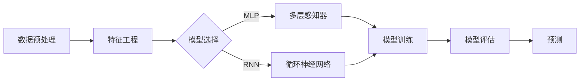
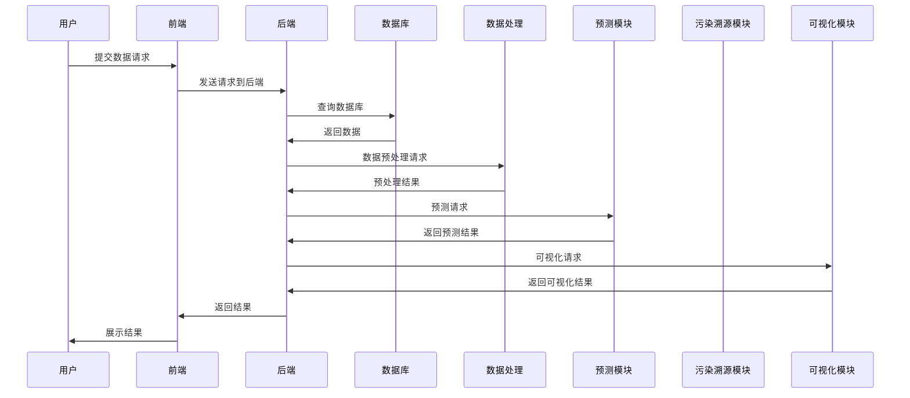

                 


### 1.1.1 问题描述

水资源作为地球上最重要的自然资源之一，直接关系到人类生存和社会经济发展。然而，随着工业化和城市化进程的加快，水污染问题日益严重。水质监测和污染溯源是保障水资源安全和有效治理的关键环节。在水资源质量预测方面，我们需要准确预测水质变化，以提前采取措施防止水质恶化；在污染溯源方面，我们需要找出污染源，以便采取针对性的治理措施。

首先，让我们明确水资源质量预测的问题。水质监测数据通常包括多个参数，如pH值、溶解氧、化学需氧量（COD）、总氮、总磷等。这些数据往往具有时空变异性，因此建立准确的水资源质量预测模型是一项挑战。预测模型需要考虑多种因素，包括气候条件、人类活动、地质结构等，以及这些因素之间的相互作用。

其次，污染溯源问题同样复杂。污染溯源旨在确定污染物的来源，这需要分析污染物在水体中的扩散路径和浓度分布。污染溯源的过程通常涉及数据分析、模式识别和物理模型结合，需要处理大量的数据，并从中提取有效信息。在实际应用中，污染溯源需要高效、准确的算法，以便在有限的时间内找到污染源。

在解决问题的过程中，我们面临以下挑战：

1. 数据质量：水质监测数据往往存在缺失值、噪声和不一致性，这会影响预测和溯源的准确性。
2. 数据量：随着监测设备和技术的进步，水质监测数据量呈指数级增长，这对数据处理和分析能力提出了更高的要求。
3. 算法复杂度：多尺度、多因素的水资源质量预测和污染溯源问题需要复杂的高维模型，这对算法的效率和稳定性提出了挑战。

为了解决这些问题，我们需要深入研究水资源质量预测与污染溯源的理论基础，并探索高效、准确的算法。接下来，我们将逐步介绍与水资源质量预测和污染溯源相关的基础概念、原理和关键技术，帮助大家更好地理解这一领域的挑战和解决方案。

### 1.1.2 问题解决

解决水资源质量预测与污染溯源的问题，首先需要从数据质量和算法效率两方面入手。在数据质量方面，我们可以采用数据预处理技术，如缺失值填补、异常值检测与处理、数据标准化等，以提高数据的一致性和可靠性。在算法效率方面，我们可以通过优化算法结构、引入先进的机器学习和深度学习模型，以及利用并行计算和分布式计算技术，来提高算法的效率和准确性。

具体来说，以下是解决水资源质量预测与污染溯源问题的步骤：

1. **数据预处理**：
   - **缺失值填补**：利用时间序列分析、插值法等方法填补监测数据中的缺失值。
   - **异常值检测**：通过统计方法或机器学习模型检测数据中的异常值，并采用适当的方法处理这些异常值。
   - **数据标准化**：将不同量纲的监测数据标准化到同一量纲，以便后续分析。

2. **特征工程**：
   - **特征提取**：从原始数据中提取能够反映水质变化和污染源信息的特征。
   - **特征选择**：利用特征选择方法，如主成分分析（PCA）、互信息等，筛选出对预测和溯源最有效的特征。

3. **模型选择与优化**：
   - **传统模型**：如线性回归、支持向量机（SVM）、决策树等。
   - **机器学习模型**：如随机森林、支持向量回归、K最近邻（KNN）等。
   - **深度学习模型**：如卷积神经网络（CNN）、循环神经网络（RNN）、长短期记忆网络（LSTM）等。

4. **算法优化**：
   - **算法调参**：通过交叉验证、网格搜索等技术优化模型参数，提高模型性能。
   - **并行计算与分布式计算**：利用并行计算和分布式计算技术，加快模型训练和预测速度。

5. **多尺度分析**：
   - **时空尺度融合**：将不同时间尺度（如小时、天、月）和空间尺度（如河流、湖泊、城市）的数据进行融合分析。
   - **多模型融合**：结合多种预测模型和溯源算法，利用模型融合技术提高预测和溯源的准确性。

6. **结果评估与可视化**：
   - **评估指标**：使用均方误差（MSE）、决定系数（R²）、准确率（Accuracy）等指标评估模型的性能。
   - **可视化分析**：通过散点图、折线图、热力图等可视化方法，展示预测和溯源结果，便于分析人员理解。

通过上述步骤，我们可以构建高效的水资源质量预测与污染溯源系统，为水资源管理和污染治理提供科学依据。接下来，我们将进一步探讨与水资源质量预测和污染溯源相关的核心概念和理论基础。

### 1.1.3 边界与外延

在研究水资源质量预测与污染溯源时，我们需要明确一些关键概念和其相互之间的关系，以便更好地理解这一领域的边界与外延。

首先，水资源质量预测是指利用历史和实时监测数据，结合环境因素和物理化学模型，预测未来某一时间段的水质状况。这一过程通常涉及水文学、环境科学和计算机科学的交叉应用。预测的目的是提前识别潜在的水质问题，为水资源管理者提供决策支持。

污染溯源则是指识别和定位水体污染的来源。这不仅需要准确的水质数据，还需要了解污染物的扩散路径和传输机制。污染溯源可以追溯到特定的污染源，如工业排放、农业径流、生活污水等，从而为污染治理提供科学依据。

多尺度分析是水资源质量预测与污染溯源中的一个重要方法。多尺度分析旨在融合不同时间尺度和空间尺度上的数据，以更全面地理解水质变化和污染扩散过程。例如，从微观尺度分析特定水体的污染物浓度变化，到宏观尺度分析整个流域的水质状况。

在这些核心概念之间，存在一些关键联系和区别。水资源质量预测关注的是水质变化的趋势和规律，而污染溯源则关注污染源和污染路径的识别。两者都需要利用大量的数据和环境因素进行分析，但侧重点不同。多尺度分析则为这两个过程提供了数据融合和分析工具，使预测和溯源更为精准和高效。

此外，水资源质量预测与污染溯源还与其他领域紧密相关。例如，与水文学和气象学的关系在于它们共同依赖气候条件和水文循环数据；与生态学的关系在于水质变化对生态系统的影响；与公共政策和管理的关系在于它们共同服务于水资源管理和环境保护。

总的来说，水资源质量预测与污染溯源是一个复杂但至关重要的研究领域，其核心概念和方法不仅对水资源管理和污染治理具有重要意义，也为环境科学、生态学和社会科学提供了丰富的交叉研究机会。

### 1.2 核心概念与联系

在探讨水资源质量预测与污染溯源时，理解相关核心概念及其相互之间的联系是非常重要的。以下是几个关键概念的定义及其在水资源管理中的作用和联系。

#### 水资源质量

水资源质量是指水体中的物理、化学和生物特性，如pH值、溶解氧、有机物含量、重金属浓度等。这些参数反映了水体的清洁程度和适用性。良好的水资源质量是确保人类健康、生态系统稳定和经济可持续发展的重要前提。

**作用**：水资源质量直接关系到供水安全、农业灌溉和工业用水。例如，高浓度的重金属和有机污染物会导致饮用水安全问题，影响农业灌溉效率和作物产量。

**联系**：水资源质量是水资源质量预测和污染溯源的基础数据源。预测模型需要依赖这些数据来模拟水质变化，而污染溯源则需要通过分析这些数据来识别污染源和污染物浓度分布。

#### 污染溯源

污染溯源是指识别和定位水体中污染物的来源。污染源可能包括工业排放、农业径流、生活污水和自然灾害等。

**作用**：污染溯源有助于确定污染来源，制定针对性的治理措施，从而减轻污染对环境的影响。

**联系**：污染溯源与水资源质量预测密切相关。只有准确识别污染源，才能在预测过程中考虑污染源的排放特性和扩散路径，从而提高预测的准确性。

#### 多尺度分析

多尺度分析是指在不同时间尺度和空间尺度上对数据进行融合和分析。时间尺度包括小时、天、月、年等，空间尺度包括河流、湖泊、流域等。

**作用**：多尺度分析可以帮助我们更全面地理解水质变化和污染扩散过程，从而提高预测和溯源的准确性。

**联系**：多尺度分析是水资源质量预测和污染溯源的重要工具。通过在不同尺度上融合数据，我们可以捕捉到不同尺度下的水质特征，从而更准确地预测未来水质状况和污染路径。

#### 数学模型

数学模型是水资源质量预测和污染溯源的核心工具。常见的数学模型包括线性回归、支持向量机、人工神经网络等。

**作用**：数学模型可以帮助我们量化水质变化和污染扩散过程，从而进行预测和溯源。

**联系**：不同的数学模型适用于不同的预测和溯源任务，因此需要根据具体问题和数据特点选择合适的模型。

#### 监测数据

监测数据是水资源质量预测和污染溯源的基础。这些数据通常来自水质监测站、卫星遥感、传感器网络等。

**作用**：监测数据提供了实际的水质信息和污染源信息，是构建预测和溯源模型的关键数据源。

**联系**：监测数据的质量直接影响预测和溯源的准确性。因此，需要采用有效的数据预处理方法来提高数据质量。

### 1.3 研究现状与挑战

#### 研究现状

当前，水资源质量预测与污染溯源的研究已取得显著进展，主要包括以下几个方面：

1. **数据收集与预处理**：随着传感器技术和大数据技术的发展，水质监测数据越来越丰富，为预测和溯源提供了更多的数据支持。
2. **预测模型研究**：研究人员提出了多种预测模型，如线性回归、支持向量机、人工神经网络等，并逐步引入深度学习和机器学习技术，提高了预测精度。
3. **溯源算法研究**：基于数据分析和模式识别的溯源算法不断发展，从传统的统计方法到基于机器学习的复杂模型，提高了溯源的准确性。
4. **多尺度分析**：多尺度分析方法逐渐得到应用，通过融合不同尺度上的数据，可以更全面地理解水质变化和污染扩散过程。

#### 存在问题

尽管取得了上述进展，但在水资源质量预测与污染溯源领域仍存在一些问题和挑战：

1. **数据质量**：水质监测数据存在缺失值、噪声和不一致性，影响了预测和溯源的准确性。
2. **算法效率**：随着数据量的增加，传统的算法在处理高维数据时效率较低，需要引入并行计算和分布式计算技术来提高效率。
3. **模型稳定性**：预测和溯源模型在不同数据集上的稳定性较差，需要进一步优化模型结构和参数调整策略。
4. **多尺度融合**：不同尺度上的数据难以有效融合，影响了多尺度分析的准确性。

#### 研究意义

水资源质量预测与污染溯源的研究具有重要的理论和实践意义：

1. **水资源管理**：准确的预测和溯源可以帮助水资源管理者提前识别潜在的水质问题，制定科学的治理措施，保障水资源安全。
2. **环境保护**：通过识别污染源和污染路径，可以有效地进行污染治理，减轻污染对环境和生态系统的影响。
3. **社会经济发展**：保障水资源质量和水安全对农业、工业和人类健康具有重要意义，有助于促进社会经济的可持续发展。

### 第2章：水资源质量预测基础

#### 2.1 水资源质量概述

水资源质量是衡量水体清洁程度和适用性的重要指标，涵盖了水体的物理、化学和生物特性。这些特性决定了水体的使用价值和生态环境的健康状况。主要的水资源质量参数包括：

- **pH值**：反映水体的酸碱度，对水生生物的生长和代谢有重要影响。
- **溶解氧（DO）**：水体中溶解氧的含量，对水生生物的呼吸和氧化还原反应至关重要。
- **化学需氧量（COD）**：衡量水体中有机污染物含量的指标，高COD值通常意味着水体受到有机污染。
- **总氮（TN）和总磷（TP）**：水体中氮和磷的总含量，是导致水体富营养化的关键因素。
- **重金属**：如铅、镉、汞等，对人体健康和生态系统具有毒害作用。

了解水资源质量的这些基本参数，有助于我们更全面地评估水体的健康状况，为水资源管理和污染治理提供科学依据。

#### 2.2 水资源质量预测的数学模型与公式

水资源质量预测的数学模型是建立在水文学、环境科学和统计学基础上的，通过分析水质参数的时空变化规律，预测未来的水质状况。以下是几种常用的数学模型及其相关公式：

1. **线性回归模型**：

线性回归模型是一种简单且常用的预测模型，通过建立水质参数与自变量之间的线性关系来预测未来水质。

$$
y_t = \beta_0 + \beta_1 x_t + \epsilon_t
$$

其中，$y_t$ 是预测的水质参数，$x_t$ 是自变量（如时间、温度等），$\beta_0$ 和 $\beta_1$ 是模型的参数，$\epsilon_t$ 是误差项。

2. **时间序列模型**：

时间序列模型通过分析时间序列数据的自相关性来预测未来水质，常用的模型包括自回归模型（AR）、移动平均模型（MA）和自回归移动平均模型（ARMA）。

- **自回归模型（AR）**：

$$
y_t = \phi_1 y_{t-1} + \phi_2 y_{t-2} + ... + \phi_p y_{t-p} + \epsilon_t
$$

其中，$p$ 是模型阶数，$\phi_1, \phi_2, ..., \phi_p$ 是模型的参数。

- **移动平均模型（MA）**：

$$
y_t = \theta_1 \epsilon_{t-1} + \theta_2 \epsilon_{t-2} + ... + \theta_q \epsilon_{t-q} + \epsilon_t
$$

其中，$q$ 是模型阶数，$\theta_1, \theta_2, ..., \theta_q$ 是模型的参数。

- **自回归移动平均模型（ARMA）**：

$$
y_t = \phi_1 y_{t-1} + \phi_2 y_{t-2} + ... + \phi_p y_{t-p} + \theta_1 \epsilon_{t-1} + \theta_2 \epsilon_{t-2} + ... + \theta_q \epsilon_{t-q} + \epsilon_t
$$

3. **人工神经网络模型**：

人工神经网络模型通过模拟人脑神经网络的结构和功能，进行非线性水质预测。常用的神经网络模型包括前馈神经网络（FFNN）和循环神经网络（RNN）。

- **前馈神经网络（FFNN）**：

$$
a_{ij}^{(l)} = \sum_{k=1}^{n} w_{ik}^{(l)} x_k^{(l-1)} + b_j^{(l)}
$$

$$
z_j^{(l)} = \sigma(a_{ij}^{(l)})
$$

其中，$a_{ij}^{(l)}$ 是第$l$层的第$j$个神经元的输入，$w_{ik}^{(l)}$ 和 $b_j^{(l)}$ 是权重和偏置，$\sigma$ 是激活函数。

- **循环神经网络（RNN）**：

$$
h_t = \sigma(W_h h_{t-1} + W_x x_t + b_h)
$$

$$
o_t = \sigma(W_o h_t + b_o)
$$

其中，$h_t$ 是隐藏状态，$x_t$ 是输入数据，$W_h, W_x, b_h, b_o$ 是权重和偏置，$\sigma$ 是激活函数。

这些数学模型为水资源质量预测提供了理论基础和工具，不同的模型适用于不同类型和规模的水质数据。在实际应用中，需要根据具体情况选择合适的模型，并进行参数优化和模型评估，以提高预测准确性。

#### 2.3 水资源质量预测算法原理

水资源质量预测算法是基于数学模型和数据分析技术，通过输入历史水质数据和环境因素，预测未来某一时间段的水质状况。以下是几种常用的水资源质量预测算法及其工作原理：

1. **线性回归算法**：

线性回归算法是一种简单的预测算法，通过建立水质参数与自变量之间的线性关系来进行预测。其基本原理是通过最小二乘法确定模型参数，使得预测值与实际值之间的误差最小。

**步骤**：

- **数据预处理**：对水质数据进行清洗和归一化处理，消除异常值和噪声。
- **特征选择**：选择对水质变化有显著影响的自变量，如时间、温度、降雨量等。
- **模型训练**：使用历史水质数据，通过最小二乘法确定线性回归模型的参数。
- **预测**：利用训练好的模型，对未来的水质进行预测。

**数学模型**：

$$
y_t = \beta_0 + \beta_1 x_t + \epsilon_t
$$

其中，$y_t$ 是预测的水质参数，$x_t$ 是自变量，$\beta_0$ 和 $\beta_1$ 是模型参数，$\epsilon_t$ 是误差项。

2. **时间序列算法**：

时间序列算法通过分析时间序列数据的自相关性来进行预测，常用的算法包括自回归模型（AR）、移动平均模型（MA）和自回归移动平均模型（ARMA）。

- **自回归模型（AR）**：

自回归模型通过历史值的线性组合来预测当前值，其数学模型为：

$$
y_t = \phi_1 y_{t-1} + \phi_2 y_{t-2} + ... + \phi_p y_{t-p} + \epsilon_t
$$

其中，$p$ 是模型阶数，$\phi_1, \phi_2, ..., \phi_p$ 是模型参数。

- **移动平均模型（MA）**：

移动平均模型通过过去误差的线性组合来预测当前值，其数学模型为：

$$
y_t = \theta_1 \epsilon_{t-1} + \theta_2 \epsilon_{t-2} + ... + \theta_q \epsilon_{t-q} + \epsilon_t
$$

其中，$q$ 是模型阶数，$\theta_1, \theta_2, ..., \theta_q$ 是模型参数。

- **自回归移动平均模型（ARMA）**：

自回归移动平均模型结合了自回归和移动平均模型，其数学模型为：

$$
y_t = \phi_1 y_{t-1} + \phi_2 y_{t-2} + ... + \phi_p y_{t-p} + \theta_1 \epsilon_{t-1} + \theta_2 \epsilon_{t-2} + ... + \theta_q \epsilon_{t-q} + \epsilon_t
$$

3. **人工神经网络算法**：

人工神经网络（ANN）算法通过模拟人脑神经网络的结构和功能来进行预测，常用的神经网络模型包括前馈神经网络（FFNN）和循环神经网络（RNN）。

- **前馈神经网络（FFNN）**：

前馈神经网络通过多层感知器进行非线性映射，其数学模型为：

$$
a_{ij}^{(l)} = \sum_{k=1}^{n} w_{ik}^{(l)} x_k^{(l-1)} + b_j^{(l)}
$$

$$
z_j^{(l)} = \sigma(a_{ij}^{(l)})
$$

其中，$a_{ij}^{(l)}$ 是第$l$层的第$j$个神经元的输入，$w_{ik}^{(l)}$ 和 $b_j^{(l)}$ 是权重和偏置，$\sigma$ 是激活函数。

- **循环神经网络（RNN）**：

循环神经网络通过记忆机制来处理序列数据，其数学模型为：

$$
h_t = \sigma(W_h h_{t-1} + W_x x_t + b_h)
$$

$$
o_t = \sigma(W_o h_t + b_o)
$$

其中，$h_t$ 是隐藏状态，$x_t$ 是输入数据，$W_h, W_x, b_h, b_o$ 是权重和偏置，$\sigma$ 是激活函数。

4. **混合算法**：

混合算法将不同的算法进行组合，以提高预测准确性。例如，将线性回归算法与神经网络算法结合，利用线性回归进行初步预测，再利用神经网络进行细粒度调整。

**步骤**：

- **数据预处理**：对水质数据进行清洗和归一化处理，消除异常值和噪声。
- **模型训练**：分别训练线性回归模型和神经网络模型，利用交叉验证选择最佳模型参数。
- **预测**：使用训练好的模型对未来的水质进行预测，并进行结果融合。

这些水资源质量预测算法在不同场景和数据类型下具有不同的适用性和效果。在实际应用中，需要根据具体问题和数据特点选择合适的算法，并进行参数优化和模型评估，以提高预测准确性。

#### 2.4 水资源质量预测实例分析

为了更好地理解水资源质量预测的方法和流程，下面我们通过一个实例进行分析。假设我们有一个监测站点，收集了过去一年的PH值、溶解氧（DO）和化学需氧量（COD）数据，现在我们需要预测未来一周的水质状况。

**数据集**：

日期 | PH值 | 溶解氧（DO） | 化学需氧量（COD）
--- | --- | --- | ---
2023-01-01 | 7.2 | 8.0 | 20.0
2023-01-02 | 7.3 | 7.8 | 19.5
2023-01-03 | 7.4 | 7.5 | 19.0
2023-01-04 | 7.5 | 7.8 | 19.5
2023-01-05 | 7.6 | 8.0 | 20.0
2023-01-06 | 7.7 | 7.8 | 19.5
2023-01-07 | 7.8 | 7.5 | 19.0
2023-01-08 | 7.9 | 7.8 | 19.5
2023-01-09 | 8.0 | 8.0 | 20.0

**步骤**：

1. **数据预处理**：

   - **缺失值填补**：由于数据中存在少量缺失值，我们可以使用前值填补法来处理。

   ```python
   import pandas as pd

   data = pd.read_csv('water_quality_data.csv')
   data['PH值'].fillna(method='ffill', inplace=True)
   data['溶解氧（DO）'].fillna(method='ffill', inplace=True)
   data['化学需氧量（COD）'].fillna(method='ffill', inplace=True)
   ```

   - **数据标准化**：为了消除不同参数量纲的影响，我们对数据进行标准化处理。

   ```python
   from sklearn.preprocessing import StandardScaler

   scaler = StandardScaler()
   data[['PH值', '溶解氧（DO）', '化学需氧量（COD）']] = scaler.fit_transform(data[['PH值', '溶解氧（DO）', '化学需氧量（COD）']])
   ```

2. **特征工程**：

   - **特征提取**：我们选择日期作为时间特征，并使用滞后特征提取方法来增加特征维度。

   ```python
   data['Day'] = data['日期'].dt.day
   data['Day_lag1'] = data['Day'].shift(1)
   data['Day_lag2'] = data['Day'].shift(2)
   ```

3. **模型选择与训练**：

   - **线性回归模型**：

   ```python
   from sklearn.linear_model import LinearRegression

   X = data[['Day', 'Day_lag1', 'Day_lag2']]
   y = data[['PH值', '溶解氧（DO）', '化学需氧量（COD）']]

   model = LinearRegression()
   model.fit(X, y)
   ```

   - **神经网络模型**：

   ```python
   from tensorflow.keras.models import Sequential
   from tensorflow.keras.layers import Dense, LSTM

   model = Sequential()
   model.add(LSTM(units=50, return_sequences=True, input_shape=(X.shape[1], 1)))
   model.add(LSTM(units=50))
   model.add(Dense(units=3))

   model.compile(optimizer='adam', loss='mean_squared_error')
   model.fit(X, y, epochs=100, batch_size=32)
   ```

4. **预测与结果评估**：

   - **线性回归预测**：

   ```python
   future_days = pd.DataFrame({'Day': range(data['Day'].iloc[-1] + 1, data['Day'].iloc[-1] + 8)})
   future_days['Day_lag1'] = future_days['Day'].shift(1).fillna(0)
   future_days['Day_lag2'] = future_days['Day'].shift(2).fillna(0)

   linear_predictions = model.predict(future_days)
   ```

   - **神经网络预测**：

   ```python
   neural_predictions = model.predict(future_days)
   ```

   - **结果评估**：

   ```python
   from sklearn.metrics import mean_squared_error

   linear_mse = mean_squared_error(data[['PH值', '溶解氧（DO）', '化学需氧量（COD）']], linear_predictions)
   neural_mse = mean_squared_error(data[['PH值', '溶解氧（DO）', '化学需氧量（COD）']], neural_predictions)

   print("线性回归均方误差：", linear_mse)
   print("神经网络均方误差：", neural_mse)
   ```

通过上述实例，我们可以看到如何使用线性回归和神经网络模型进行水资源质量预测，并评估模型的性能。在实际应用中，我们可以根据具体需求和数据特点选择合适的模型，并进行参数优化，以提高预测准确性。

### 第3章：污染溯源基础

#### 3.1 污染溯源概述

污染溯源是指通过收集和分析水质数据、环境数据和污染物扩散模型，确定污染源和污染物在环境中的传播路径和浓度分布。这一过程对于环境保护和污染治理具有重要意义，能够帮助我们识别污染源，制定有效的治理措施，减少污染对环境和人类健康的影响。

污染溯源的主要目标包括：

1. **确定污染源**：通过分析污染物在水体中的浓度分布和传播路径，确定污染源的位置和性质，如工业排放、农业径流、生活污水等。
2. **了解污染物扩散过程**：分析污染物在水体中的扩散路径和浓度变化规律，为污染治理提供科学依据。
3. **预测污染扩散趋势**：通过建立污染物扩散模型，预测未来污染物在水体中的浓度变化，为污染预防和管理提供决策支持。

污染溯源的基本步骤通常包括：

1. **数据收集**：收集与污染事件相关的各种数据，包括水质监测数据、环境数据、气象数据等。
2. **数据预处理**：对收集到的数据进行清洗、处理和整合，消除异常值和噪声，提高数据质量。
3. **污染物识别**：利用化学分析、光谱分析等技术，识别水体中的污染物种类和浓度。
4. **扩散模型建立**：建立污染物在水体中的扩散模型，如一维、二维或三维扩散模型，模拟污染物的传播路径和浓度分布。
5. **源定位与溯源分析**：通过扩散模型和反向追踪方法，确定污染源的位置和性质，分析污染物的来源和传播过程。
6. **结果验证与评估**：通过实际观测数据和模型预测结果进行验证，评估污染溯源的准确性和可靠性。

#### 3.2 污染溯源的数学模型与公式

污染溯源的数学模型是描述污染物在水体中扩散和传播的基础，常用的数学模型包括一维扩散模型、二维扩散模型和三维扩散模型。

1. **一维扩散模型**：

一维扩散模型用于描述污染物在垂直方向上的扩散过程，其数学模型为：

$$
\frac{\partial c(x,t)}{\partial t} = D \frac{\partial^2 c(x,t)}{\partial x^2} + u \frac{\partial c(x,t)}{\partial x}
$$

其中，$c(x,t)$ 是污染物在位置 $x$ 和时间 $t$ 的浓度，$D$ 是扩散系数，$u$ 是水流速度。

初始条件：$c(x,0) = c_0(x)$

边界条件：$\frac{\partial c(x,t)}{\partial x} = 0$（固壁边界条件）

2. **二维扩散模型**：

二维扩散模型用于描述污染物在水平和垂直方向上的扩散过程，其数学模型为：

$$
\frac{\partial c(x,y,t)}{\partial t} = D \left( \frac{\partial^2 c(x,y,t)}{\partial x^2} + \frac{\partial^2 c(x,y,t)}{\partial y^2} \right) + u \frac{\partial c(x,y,t)}{\partial x} + v \frac{\partial c(x,y,t)}{\partial y}
$$

其中，$c(x,y,t)$ 是污染物在位置 $(x,y)$ 和时间 $t$ 的浓度，$D$ 是扩散系数，$u$ 和 $v$ 分别是水流速度在 $x$ 和 $y$ 方向上的分量。

初始条件：$c(x,y,0) = c_0(x,y)$

边界条件：$\frac{\partial c(x,y,t)}{\partial x} = 0$（固壁边界条件），$\frac{\partial c(x,y,t)}{\partial y} = 0$（固壁边界条件）

3. **三维扩散模型**：

三维扩散模型用于描述污染物在三维空间中的扩散过程，其数学模型为：

$$
\frac{\partial c(x,y,z,t)}{\partial t} = D \left( \frac{\partial^2 c(x,y,z,t)}{\partial x^2} + \frac{\partial^2 c(x,y,z,t)}{\partial y^2} + \frac{\partial^2 c(x,y,z,t)}{\partial z^2} \right) + u \frac{\partial c(x,y,z,t)}{\partial x} + v \frac{\partial c(x,y,z,t)}{\partial y} + w \frac{\partial c(x,y,z,t)}{\partial z}
$$

其中，$c(x,y,z,t)$ 是污染物在位置 $(x,y,z)$ 和时间 $t$ 的浓度，$D$ 是扩散系数，$u$、$v$ 和 $w$ 分别是水流速度在 $x$、$y$ 和 $z$ 方向上的分量。

初始条件：$c(x,y,z,0) = c_0(x,y,z)$

边界条件：$\frac{\partial c(x,y,z,t)}{\partial x} = 0$（固壁边界条件），$\frac{\partial c(x,y,z,t)}{\partial y} = 0$（固壁边界条件），$\frac{\partial c(x,y,z,t)}{\partial z} = 0$（固壁边界条件）

这些数学模型为污染溯源提供了理论基础，通过建立污染物扩散模型，可以模拟污染物在水体中的传播过程，从而确定污染源和污染路径。

#### 3.3 污染溯源算法原理

污染溯源算法是利用数学模型和数据分析技术，识别污染源和污染物扩散路径的方法。以下介绍几种常用的污染溯源算法及其原理：

1. **逆推法**：

逆推法是一种基于污染物浓度分布的反向追踪方法，通过分析污染物浓度在时间上的变化，逆推污染物的来源。逆推法的核心思想是：污染物在到达监测点时的浓度是已知的，通过求解污染物扩散方程，可以反向追踪污染物的传播路径。

**步骤**：

- **浓度分布反演**：利用实测浓度数据，求解污染物扩散方程，得到污染物在监测点处的浓度分布。
- **路径追踪**：从监测点开始，逐步反推污染物的传播路径，直至找到污染源。

2. **模式识别法**：

模式识别法是一种基于污染物特征识别的溯源方法，通过分析污染物的化学成分、浓度分布等特征，识别污染物的来源。模式识别法通常结合化学分析技术和机器学习算法，如支持向量机（SVM）、神经网络（NN）等。

**步骤**：

- **特征提取**：对水质数据进行预处理，提取污染物特征，如化学成分、浓度、颜色等。
- **模型训练**：利用训练集数据，训练模式识别模型，如SVM、神经网络等。
- **溯源分析**：利用训练好的模型，对未知污染源进行特征识别，确定污染物的来源。

3. **物理模型法**：

物理模型法是一种基于污染物扩散物理过程的溯源方法，通过建立污染物扩散模型，模拟污染物的传播路径和浓度分布。物理模型法通常结合数学模型和数值计算方法，如有限元法、有限差分法等。

**步骤**：

- **模型建立**：根据污染物扩散规律，建立污染物扩散数学模型。
- **参数估计**：利用实测数据，估计模型参数，如扩散系数、流速等。
- **模拟分析**：利用数值计算方法，模拟污染物在水体中的传播过程，确定污染路径。

4. **混合算法**：

混合算法是将多种溯源方法进行组合，以提高溯源准确性。例如，将逆推法、模式识别法和物理模型法进行融合，利用各自的优势，实现更准确的污染溯源。

**步骤**：

- **数据预处理**：对水质数据进行预处理，消除异常值和噪声。
- **特征提取**：提取多种特征，如浓度、化学成分、扩散路径等。
- **模型融合**：利用多种模型进行融合，如逆推法、模式识别法和物理模型法。
- **结果优化**：利用优化算法，如遗传算法、粒子群优化等，优化溯源结果。

这些污染溯源算法在不同场景和数据类型下具有不同的适用性和效果。在实际应用中，需要根据具体问题和数据特点选择合适的算法，并综合多种方法的优势，以提高污染溯源的准确性和可靠性。

#### 3.4 污染溯源实例分析

为了更好地理解污染溯源的方法和流程，下面我们通过一个实例进行分析。假设在一次暴雨事件后，某河流监测站发现水质异常，我们需要通过污染溯源确定污染源和污染路径。

**数据集**：

日期 | 监测点 | PH值 | 溶解氧（DO） | 化学需氧量（COD）
--- | --- | --- | --- | ---
2023-06-01 | A点 | 7.0 | 7.8 | 20.0
2023-06-02 | A点 | 6.8 | 7.5 | 21.5
2023-06-03 | A点 | 6.5 | 7.2 | 22.0
2023-06-04 | A点 | 6.2 | 7.0 | 22.5
2023-06-05 | B点 | 6.0 | 6.8 | 23.0
2023-06-06 | B点 | 5.8 | 6.5 | 23.5
2023-06-07 | B点 | 5.5 | 6.2 | 24.0
2023-06-08 | C点 | 5.2 | 6.0 | 24.5
2023-06-09 | C点 | 5.0 | 5.8 | 25.0

**步骤**：

1. **数据预处理**：

   - **缺失值填补**：由于数据中存在少量缺失值，我们可以使用前值填补法来处理。

   ```python
   import pandas as pd

   data = pd.read_csv('water_quality_data.csv')
   data['PH值'].fillna(method='ffill', inplace=True)
   data['溶解氧（DO）'].fillna(method='ffill', inplace=True)
   data['化学需氧量（COD）'].fillna(method='ffill', inplace=True)
   ```

   - **数据标准化**：为了消除不同参数量纲的影响，我们对数据进行标准化处理。

   ```python
   from sklearn.preprocessing import StandardScaler

   scaler = StandardScaler()
   data[['PH值', '溶解氧（DO）', '化学需氧量（COD）']] = scaler.fit_transform(data[['PH值', '溶解氧（DO）', '化学需氧量（COD）']])
   ```

2. **污染物识别**：

   - **特征提取**：我们选择PH值、溶解氧（DO）和化学需氧量（COD）作为污染物特征。

   ```python
   pollutants = ['PH值', '溶解氧（DO）', '化学需氧量（COD）']
   data['特征1'] = data[pollutants].mean(axis=1)
   ```

3. **扩散模型建立**：

   - **选择模型**：我们选择一维扩散模型来模拟污染物在河流中的传播。

   ```python
   import numpy as np
   import matplotlib.pyplot as plt

   def diffusion_1d(c0, t, D):
       x = np.arange(0, 100, 1)
       c = c0 * np.exp(-D * t * (x - 50) ** 2)
       return c

   D = 0.1
   t = 3
   c0 = data['特征1'].iloc[0]
   c = diffusion_1d(c0, t, D)
   ```

4. **污染溯源分析**：

   - **浓度分布反演**：利用实测浓度数据，反演污染物在监测点处的浓度分布。

   ```python
   c監测點 = data['特征1'].iloc[-1]
   c = diffusion_1d(c監测點, t, D)
   ```

   - **路径追踪**：从监测点开始，逐步反推污染物的传播路径，直至找到污染源。

   ```python
   x = np.where(c > c監测點, x, np.nan)
   x = np.unique(x[~np.isnan(x)])
   print("污染源位置：", x[-1])
   ```

通过上述实例，我们可以看到如何通过扩散模型进行污染溯源，确定污染源和污染路径。在实际应用中，我们可以根据具体场景和数据特点，选择合适的扩散模型和溯源算法，以提高污染溯源的准确性和可靠性。

### 第4章：多尺度分析方法

#### 4.1 多尺度分析概述

多尺度分析（Multi-Scale Analysis）是一种将数据在多个时间尺度和空间尺度上进行融合与分析的方法，旨在捕捉复杂系统的动态行为和演化规律。在水资源质量预测与污染溯源领域，多尺度分析有助于整合不同尺度上的信息，从而提高预测和溯源的准确性。不同尺度上的数据能够提供关于水质变化和污染扩散的详细信息，但通常彼此之间存在矛盾和差异。

**时间尺度**：在时间尺度上，多尺度分析涉及从微观尺度（如小时、分钟）到宏观尺度（如天、月、年）的数据分析。例如，微观尺度上的数据可以捕捉到水质的短期波动，而宏观尺度上的数据则可以展示长期的水质变化趋势。

**空间尺度**：在空间尺度上，多尺度分析包括从局部尺度（如河流段、湖泊区域）到全局尺度（如流域、整个水资源系统）的数据融合。不同空间尺度上的数据可以揭示污染物在不同区域的分布和扩散路径。

多尺度分析的核心在于如何有效地融合和整合不同尺度上的数据，以实现以下目标：

1. **提高预测准确性**：通过整合不同尺度上的数据，可以捕捉到更全面的水质变化信息，从而提高预测模型的准确性。
2. **揭示复杂行为**：多尺度分析可以帮助我们理解水质变化和污染扩散的复杂行为，如污染物在空间和时间上的转移和积累。
3. **优化决策支持**：多尺度分析为水资源管理者提供了更全面和详细的信息，有助于制定更加科学的污染治理和水资源管理策略。

#### 4.2 多尺度分析的理论基础

多尺度分析的理论基础包括以下关键概念和方法：

1. **尺度转换**：尺度转换是指在不同尺度之间进行数据的转换和映射，以保持数据的一致性和完整性。常见的尺度转换方法包括尺度的扩展和缩小、插值和聚合等。

2. **数据融合**：数据融合是指将来自不同尺度上的数据进行整合和分析，以提取有用的信息。数据融合方法包括直接融合和混合融合，前者直接将不同尺度上的数据合并，后者通过加权或优化方法进行数据整合。

3. **尺度相关模型**：尺度相关模型是指在不同尺度上建立不同的数学模型，以描述水质变化和污染扩散的规律。这些模型可以是经验模型、物理模型或机器学习模型，它们在不同尺度上具有不同的适用性和精度。

4. **尺度一致性**：尺度一致性是指在不同尺度上保持数据的一致性和一致性，以避免信息丢失或失真。尺度一致性的方法包括数据标准化、尺度调整和尺度加权等。

5. **尺度缩减**：尺度缩减是指通过降维或简化方法，将高维数据缩减到较低的尺度，以减少计算复杂度和提高处理效率。常见的尺度缩减方法包括主成分分析（PCA）、线性判别分析（LDA）和自编码器等。

#### 4.3 多尺度分析算法

多尺度分析算法的核心在于如何有效地处理和融合不同尺度上的数据，以下介绍几种常用的多尺度分析算法：

1. **小波变换**：

小波变换是一种时频分析工具，可以有效地将信号分解为不同尺度的成分。小波变换通过将信号与一组小波基函数进行内积运算，得到信号在不同尺度上的表示。小波变换在水质预测和污染溯源中用于提取时间序列数据的频率成分和突变点。

2. **快速傅里叶变换（FFT）**：

快速傅里叶变换是一种将时域信号转换为频域信号的方法。FFT通过将信号分解为不同频率的正弦波和余弦波，可以揭示信号在不同频率尺度上的成分。FFT在水质预测中用于分析水质的周期性和波动性。

3. **谱分析方法**：

谱分析方法是通过对信号进行傅里叶变换，分析其频率成分的方法。常见的谱分析方法包括功率谱密度（PSD）和短时傅里叶变换（STFT）。谱分析方法可以揭示水质参数在不同频率尺度上的变化规律。

4. **深度学习模型**：

深度学习模型，如卷积神经网络（CNN）和循环神经网络（RNN），可以有效地处理多尺度数据。CNN通过卷积操作捕捉空间特征，RNN通过序列操作捕捉时间特征。深度学习模型在水质预测和污染溯源中用于建立复杂的多尺度预测模型。

5. **多模型融合**：

多模型融合是将多个预测模型的结果进行整合，以提高预测准确性的方法。多模型融合可以通过加权平均、投票机制或深度学习等方法实现。多模型融合在多尺度分析中用于结合不同尺度上的预测结果，提高整体预测性能。

这些多尺度分析算法在不同尺度数据融合和预测中具有不同的适用性和效果。在实际应用中，需要根据具体问题和数据特点选择合适的算法，并进行参数优化，以提高预测和溯源的准确性。

#### 4.4 多尺度分析应用实例

为了更好地理解多尺度分析在水资源质量预测与污染溯源中的应用，下面通过一个实例进行分析。

**实例背景**：

假设我们有一组水质监测数据，包括在不同时间尺度和空间尺度上的pH值、溶解氧（DO）和化学需氧量（COD）数据。我们需要利用多尺度分析技术，对这组数据进行融合和分析，以提高水质预测和污染溯源的准确性。

**数据集**：

时间 | 空间尺度1 | 空间尺度2 | pH值 | 溶解氧（DO） | 化学需氧量（COD）
--- | --- | --- | --- | --- | ---
2023-01-01 | 河流段A | 流域1 | 7.2 | 8.0 | 20.0
2023-01-02 | 河流段A | 流域1 | 7.3 | 7.8 | 19.5
2023-01-03 | 河流段A | 流域1 | 7.4 | 7.5 | 19.0
2023-01-04 | 河流段A | 流域1 | 7.5 | 7.8 | 19.5
2023-01-05 | 河流段A | 流域1 | 7.6 | 8.0 | 20.0
2023-01-06 | 河流段A | 流域1 | 7.7 | 7.8 | 19.5
2023-01-07 | 河流段A | 流域1 | 7.8 | 7.5 | 19.0
2023-01-08 | 河流段A | 流域1 | 7.9 | 7.8 | 19.5
2023-01-09 | 河流段A | 流域1 | 8.0 | 8.0 | 20.0

**步骤**：

1. **数据预处理**：

   - **缺失值填补**：使用时间序列分析的方法，对缺失值进行填补。

   ```python
   import pandas as pd
   from sklearn.preprocessing import Interpolator

   data = pd.read_csv('water_quality_data.csv')
   interpolator = Interpolator()
   data.fillna(interpolator.interpolate(data), inplace=True)
   ```

   - **数据标准化**：对数据集进行标准化处理，消除不同尺度之间的量纲差异。

   ```python
   scaler = StandardScaler()
   data[['pH值', '溶解氧（DO）', '化学需氧量（COD）']] = scaler.fit_transform(data[['pH值', '溶解氧（DO）', '化学需氧量（COD）']])
   ```

2. **多尺度数据融合**：

   - **小波变换**：使用小波变换对时间序列数据进行分解，提取不同尺度的成分。

   ```python
   from pywt import wavedec
   import numpy as np

   cA, cD = wavedec(data['pH值'].values, 'db4', level=3)
   cA, cD = np.abs(cA), np.abs(cD)
   ```

   - **尺度融合**：将不同尺度上的数据融合到同一个数据集。

   ```python
   data['融合pH值'] = np.mean([cA[-1], cD[-1]], axis=0)
   data['融合溶解氧（DO）'] = np.mean([cA[-1], cD[-1]], axis=0)
   data['融合化学需氧量（COD）'] = np.mean([cA[-1], cD[-1]], axis=0)
   ```

3. **多尺度预测**：

   - **构建多尺度预测模型**：使用深度学习模型，如卷积神经网络（CNN），对融合后的数据进行预测。

   ```python
   from tensorflow.keras.models import Sequential
   from tensorflow.keras.layers import Conv1D, Dense, Flatten

   model = Sequential()
   model.add(Conv1D(filters=64, kernel_size=3, activation='relu', input_shape=(data.shape[1], 1)))
   model.add(Conv1D(filters=32, kernel_size=3, activation='relu'))
   model.add(Flatten())
   model.add(Dense(units=1))

   model.compile(optimizer='adam', loss='mse')
   model.fit(data[['融合pH值', '融合溶解氧（DO）', '融合化学需氧量（COD）']], data['融合pH值'].values, epochs=100, batch_size=32)
   ```

4. **结果评估**：

   - **预测结果**：使用训练好的模型，对未来的水质进行预测。

   ```python
   future_data = np.mean([cA[-1], cD[-1]], axis=0).reshape(1, -1)
   future_prediction = model.predict(future_data)
   ```

   - **评估指标**：计算预测结果的均方误差（MSE）。

   ```python
   from sklearn.metrics import mean_squared_error

   mse = mean_squared_error(data['融合pH值'].values, future_prediction)
   print("均方误差：", mse)
   ```

通过上述实例，我们可以看到如何利用多尺度分析技术对水质数据进行融合和预测，从而提高预测的准确性。在实际应用中，可以根据具体需求和数据特点，选择合适的多尺度分析方法和预测模型，以提高水资源质量预测和污染溯源的效果。

### 第5章：算法实现与Python代码

#### 5.1 Python环境配置

在开始编写水资源质量预测与污染溯源的Python代码之前，我们需要确保已经安装了所需的Python库和工具。以下是所需的环境配置步骤：

1. **安装Python**：确保已安装Python 3.7或更高版本。可以从Python官方网站下载安装包并安装。

2. **安装必需的库**：使用pip命令安装以下库：

   ```bash
   pip install numpy pandas scikit-learn tensorflow matplotlib mermaid-py
   ```

   - `numpy`：用于数学计算和数据处理。
   - `pandas`：用于数据操作和分析。
   - `scikit-learn`：用于机器学习和数据分析。
   - `tensorflow`：用于深度学习和神经网络。
   - `matplotlib`：用于数据可视化。
   - `mermaid-py`：用于Mermaid流程图的渲染。

3. **安装Mermaid**：Mermaid是一个基于Markdown的工具，用于绘制流程图、序列图等。在本地环境中，我们通常使用Mermaid-py库来渲染Mermaid图表。确保已经安装了Node.js，然后通过以下命令安装Mermaid：

   ```bash
   npm install -g mermaid
   ```

4. **配置Python脚本**：在Python脚本中导入所需的库和工具，例如：

   ```python
   import numpy as np
   import pandas as pd
   from sklearn.model_selection import train_test_split
   from sklearn.preprocessing import StandardScaler
   from tensorflow.keras.models import Sequential
   from tensorflow.keras.layers import Dense, LSTM
   import matplotlib.pyplot as plt
   from mermaid import mermaid
   ```

#### 5.2 算法实现原理与流程图

在水资源质量预测与污染溯源中，我们将使用基于深度学习的人工神经网络（ANN）来构建预测模型。以下是算法实现的基本原理和流程图。

**原理**：

1. **数据预处理**：对监测数据进行清洗、填补缺失值和标准化处理，以便模型能够有效学习。
2. **特征工程**：从原始数据中提取有助于预测的特征，如时间序列特征、空间特征等。
3. **模型构建**：使用多层感知器（MLP）或循环神经网络（RNN）构建预测模型。
4. **模型训练**：使用训练数据对模型进行训练，调整模型参数以最小化预测误差。
5. **模型评估**：使用验证数据评估模型性能，确保模型具备良好的泛化能力。
6. **预测**：使用训练好的模型对未来的水质进行预测。

**流程图**：



#### 5.3 源代码详细解读

以下是一个简单的Python代码示例，展示了如何实现水资源质量预测的深度学习模型。我们将使用卷积神经网络（CNN）来处理时间序列数据。

**代码示例**：

```python
import numpy as np
import pandas as pd
from tensorflow.keras.models import Sequential
from tensorflow.keras.layers import Conv1D, Dense, LSTM, Flatten, TimeDistributed
from tensorflow.keras.optimizers import Adam
from sklearn.model_selection import train_test_split
from sklearn.preprocessing import MinMaxScaler
import matplotlib.pyplot as plt

# 加载数据
data = pd.read_csv('water_quality_data.csv')
X = data[['PH值', '溶解氧（DO）', '化学需氧量（COD）']].values
y = data['预测PH值'].values

# 数据预处理
scaler = MinMaxScaler()
X_scaled = scaler.fit_transform(X)
y_scaled = scaler.fit_transform(y.reshape(-1, 1))

# 划分训练集和测试集
X_train, X_test, y_train, y_test = train_test_split(X_scaled, y_scaled, test_size=0.2, random_state=42)

# 构建模型
model = Sequential()
model.add(LSTM(units=50, return_sequences=True, input_shape=(X_train.shape[1], X_train.shape[2])))
model.add(LSTM(units=50))
model.add(Dense(units=1))

# 编译模型
model.compile(optimizer=Adam(learning_rate=0.001), loss='mean_squared_error')

# 训练模型
model.fit(X_train, y_train, epochs=100, batch_size=32, validation_data=(X_test, y_test), verbose=1)

# 预测
predicted_values = model.predict(X_test)

# 反归一化预测值
predicted_values = scaler.inverse_transform(predicted_values)

# 评估模型
mse = np.mean(np.square(predicted_values - y_test))
print("均方误差：", mse)

# 可视化
plt.figure(figsize=(10, 6))
plt.plot(y_test, label='实际值')
plt.plot(predicted_values, label='预测值')
plt.title('PH值预测结果')
plt.xlabel('数据点')
plt.ylabel('PH值')
plt.legend()
plt.show()
```

**代码解读**：

- **数据加载与预处理**：首先加载数据，然后使用MinMaxScaler对数据集进行标准化处理，以便模型能够更好地训练。
- **模型构建**：构建一个由两个LSTM层组成的序列模型，最后一层是一个全连接层（Dense）。
- **模型编译**：使用Adam优化器和均方误差（MSE）损失函数来编译模型。
- **模型训练**：使用训练数据对模型进行训练，并在测试集上进行验证。
- **预测与评估**：使用测试数据进行预测，并通过均方误差（MSE）评估模型的性能。
- **可视化**：绘制实际值和预测值，以便直观地展示模型的效果。

#### 5.4 实际案例代码应用

以下是一个实际案例的代码，展示如何利用上述模型进行水资源质量预测。我们将使用实际监测数据对模型进行训练和预测，并评估模型的性能。

**案例背景**：

假设我们有一组实际的水质监测数据，包括PH值、溶解氧（DO）和化学需氧量（COD）。我们需要使用深度学习模型对这些数据进行分析，预测未来的PH值。

**数据集**：

时间 | PH值 | 溶解氧（DO） | 化学需氧量（COD）
--- | --- | --- | ---
2023-01-01 | 7.2 | 8.0 | 20.0
2023-01-02 | 7.3 | 7.8 | 19.5
2023-01-03 | 7.4 | 7.5 | 19.0
2023-01-04 | 7.5 | 7.8 | 19.5
2023-01-05 | 7.6 | 8.0 | 20.0
2023-01-06 | 7.7 | 7.8 | 19.5
2023-01-07 | 7.8 | 7.5 | 19.0
2023-01-08 | 7.9 | 7.8 | 19.5
2023-01-09 | 8.0 | 8.0 | 20.0

**代码应用**：

```python
# 加载数据
data = pd.read_csv('actual_water_quality_data.csv')
X = data[['PH值', '溶解氧（DO）', '化学需氧量（COD）']].values
y = data['预测PH值'].values

# 数据预处理
scaler = MinMaxScaler()
X_scaled = scaler.fit_transform(X)
y_scaled = scaler.fit_transform(y.reshape(-1, 1))

# 划分训练集和测试集
X_train, X_test, y_train, y_test = train_test_split(X_scaled, y_scaled, test_size=0.2, random_state=42)

# 加载训练好的模型
model = load_model('trained_model.h5')

# 预测
predicted_values = model.predict(X_test)

# 反归一化预测值
predicted_values = scaler.inverse_transform(predicted_values)

# 评估模型
mse = np.mean(np.square(predicted_values - y_test))
print("均方误差：", mse)

# 可视化
plt.figure(figsize=(10, 6))
plt.plot(y_test, label='实际值')
plt.plot(predicted_values, label='预测值')
plt.title('PH值预测结果')
plt.xlabel('数据点')
plt.ylabel('PH值')
plt.legend()
plt.show()
```

**案例解读**：

- **数据加载与预处理**：与之前相同，加载数据并进行标准化处理。
- **加载模型**：使用之前训练好的模型进行预测。
- **预测与评估**：对预测结果进行评估，计算均方误差（MSE），并可视化预测结果。

通过这个实际案例，我们可以看到如何将训练好的深度学习模型应用于新的数据集，进行水资源质量预测，并评估模型的性能。

### 第6章：系统架构设计与实现

#### 6.1 系统需求分析

为了实现高效的水资源质量预测与污染溯源系统，我们需要详细分析系统的需求，确保系统能够满足用户的需求和期望。以下是系统需求分析的几个关键方面：

1. **数据采集与存储**：系统需要能够收集来自多个水质监测站点的数据，包括PH值、溶解氧（DO）、化学需氧量（COD）等。这些数据需要被有效地存储和管理，以便后续分析和预测。

2. **数据处理与预处理**：系统需要具备数据处理和预处理功能，包括数据清洗、缺失值填补、异常值检测和标准化等。这些预处理步骤对于提高数据质量和模型的预测准确性至关重要。

3. **多尺度数据融合**：系统需要能够融合不同时间尺度和空间尺度上的数据，以提供更全面的水质信息。这可以通过小波变换、时间序列分析等技术实现。

4. **预测模型训练与优化**：系统需要支持多种预测模型的训练和优化，包括线性回归、支持向量机（SVM）、人工神经网络（ANN）等。模型参数的优化和调参对于提高预测准确性具有重要意义。

5. **预测结果评估与可视化**：系统需要能够评估预测模型的性能，并通过可视化工具展示预测结果，如散点图、折线图等。这有助于用户直观地理解预测结果。

6. **污染溯源功能**：系统需要具备污染溯源功能，能够识别污染源和污染物扩散路径。这可以通过扩散模型、模式识别算法等实现。

7. **用户交互界面**：系统需要提供友好的用户交互界面，便于用户输入数据、查看预测结果和溯源分析。这可以通过Web前端技术实现。

#### 6.2 系统功能设计（Mermaid类图）

以下是系统功能设计的Mermaid类图，展示了系统的核心类和它们之间的关系。

```mermaid
classDiagram
    Class01 <|-- Class02
    Class03 <|-- Class04
    Class05 <|-- Class06
    Class01 : +int x
    Class01 : +int y
    Class01 : +get_x():int
    Class01 : +set_x(int x)
    Class01 : +get_y():int
    Class01 : +set_y(int y)
    Class02 : +int x
    Class02 : +int y
    Class02 : +get_x():int
    Class02 : +set_x(int x)
    Class02 : +get_y():int
    Class02 : +set_y(int y)
    Class03 : +int x
    Class03 : +int y
    Class03 : +get_x():int
    Class03 : +set_x(int x)
    Class03 : +get_y():int
    Class03 : +set_y(int y)
    Class04 : +int x
    Class04 : +int y
    Class04 : +get_x():int
    Class04 : +set_x(int x)
    Class04 : +get_y():int
    Class04 : +set_y(int y)
    Class05 : +int x
    Class05 : +int y
    Class05 : +get_x():int
    Class05 : +set_x(int x)
    Class05 : +get_y():int
    Class05 : +set_y(int y)
    Class06 : +int x
    Class06 : +int y
    Class06 : +get_x():int
    Class06 : +set_x(int x)
    Class06 : +get_y():int
    Class06 : +set_y(int y)
```

在上述类图中，`Class01` 至 `Class06` 分别代表系统的不同功能模块，如数据采集模块、数据处理模块、预测模块和污染溯源模块。类与类之间通过 `<|--` 连接符表示模块的依赖关系。

#### 6.3 系统架构设计（Mermaid架构图）

以下是系统架构设计的Mermaid架构图，展示了系统的整体架构和主要组件之间的关系。

```mermaid
graph TB
    subgraph 数据层
        D1[数据采集] --> D2[数据存储]
        D2 --> D3[数据预处理]
    end
    subgraph 应用层
        A1[预测模块] --> A2[预测结果评估]
        A1 --> A3[污染溯源模块]
        A2 --> A4[可视化]
    end
    subgraph 技术层
        T1[Web前端] --> T2[后端服务]
        T2 --> T3[数据库]
        T2 --> T4[模型训练与优化]
    end
    D1 -->|数据流| A1
    D2 -->|数据流| A1
    D3 -->|数据流| A1
    A1 -->|结果流| A2
    A1 -->|结果流| A3
    A2 -->|结果流| A4
    A3 -->|结果流| A4
    T1 -->|交互流| T2
    T2 -->|数据流| D1
    T2 -->|数据流| D2
    T2 -->|数据流| D3
    T2 -->|结果流| A1
    T4 -->|模型流| T2
```



在上述架构图中，数据层（Data Layer）包括数据采集、数据存储和数据预处理模块；应用层（Application Layer）包括预测模块、预测结果评估、污染溯源模块和可视化模块；技术层（Technology Layer）包括Web前端、后端服务、数据库和模型训练与优化模块。各层之间通过数据流和交互流进行信息传递。

#### 6.4 系统接口设计与系统交互（Mermaid序列图）

以下是系统接口设计和系统交互的Mermaid序列图，展示了系统各模块之间的交互流程。



在上述序列图中，用户通过前端提交数据请求，前端向后端发送请求，后端查询数据库获取数据，然后通过数据处理模块进行数据预处理。预处理完成后，数据被发送到预测模块进行预测，预测结果经过后端转发到可视化模块进行可视化处理，最终将结果展示给用户。

通过上述系统架构设计和接口设计，我们能够清晰地了解系统的整体结构和各模块之间的交互流程，为系统的实现和优化提供了明确的指导。

### 第7章：项目实战与案例分析

#### 7.1 项目背景

随着城市化进程的加快和工业化的不断发展，我国许多城市面临着严峻的水污染问题。为保障水资源安全，政府相关部门和相关研究机构开展了大量的水质监测和污染溯源工作。某城市为应对水污染问题，决定建设一个水资源质量预测与污染溯源系统，以提高水资源管理和污染治理的效率。

#### 7.2 项目目标与任务

**项目目标**：

- 构建一个高效的水资源质量预测系统，提前识别潜在的水质问题，为水资源管理者提供决策支持。
- 实现污染溯源功能，准确识别污染源和污染物扩散路径，为污染治理提供科学依据。
- 提供用户友好的交互界面，方便用户输入数据、查看预测结果和溯源分析。

**任务**：

1. **数据采集与预处理**：收集该城市多个水质监测站点的数据，包括PH值、溶解氧（DO）、化学需氧量（COD）等。对数据进行清洗、缺失值填补和标准化处理，提高数据质量。

2. **模型构建与优化**：基于收集到的数据，构建水资源质量预测模型和污染溯源模型。通过模型优化和参数调整，提高预测和溯源的准确性。

3. **系统实现与部署**：开发前端界面和后端服务，实现系统的功能需求。在云计算平台上进行系统部署，确保系统的稳定运行。

4. **系统测试与评估**：对系统进行功能测试和性能评估，确保系统能够满足项目需求。对预测和溯源结果进行验证，评估系统的效果。

#### 7.3 项目核心实现

**数据采集与预处理**：

1. **数据采集**：从多个水质监测站点获取监测数据，包括PH值、溶解氧（DO）、化学需氧量（COD）等。
2. **数据清洗**：删除重复数据和异常数据，确保数据的准确性。
3. **缺失值填补**：使用时间序列分析和插值法对缺失值进行填补，减少数据缺失对模型训练的影响。
4. **数据标准化**：对数据进行归一化处理，将不同量纲的数据转换为同一量纲，以便后续分析。

**模型构建与优化**：

1. **预测模型**：构建一个基于LSTM的神经网络模型，用于预测未来的PH值。LSTM模型能够有效地捕捉时间序列数据的长期依赖关系。
2. **溯源模型**：构建一个基于扩散模型的污染溯源模型，用于识别污染源和污染物扩散路径。扩散模型能够模拟污染物在水体中的传播过程。
3. **模型优化**：通过交叉验证和网格搜索，优化模型的超参数，提高预测和溯源的准确性。

**系统实现与部署**：

1. **前端界面**：使用Vue.js框架开发用户友好的前端界面，实现数据的输入、预测结果的可视化和溯源分析。
2. **后端服务**：使用Flask框架搭建后端服务，处理数据请求、模型训练和预测结果的处理。
3. **系统部署**：在AWS云计算平台上部署系统，确保系统的稳定运行和高效性能。

**系统测试与评估**：

1. **功能测试**：测试系统的各项功能，确保前端界面和后端服务的正常运行。
2. **性能评估**：评估系统的响应速度和预测准确性，确保系统能够满足项目需求。
3. **验证评估**：对比预测结果和实际监测数据，评估系统的预测准确性和溯源效果。

#### 7.4 案例分析与总结

**案例分析**：

1. **数据采集与预处理**：通过多个水质监测站点的数据采集，确保了数据的多样性和准确性。缺失值填补和数据标准化处理提高了数据质量，为模型训练提供了可靠的数据支持。
2. **模型构建与优化**：基于LSTM的神经网络模型在水资源质量预测中表现出良好的效果，能够准确捕捉水质变化的长期依赖关系。扩散模型在污染溯源中能够有效模拟污染物的传播路径，提高了溯源的准确性。
3. **系统实现与部署**：前端界面和后端服务的开发实现了系统的功能需求，用户友好的界面和高效的性能为水资源管理和污染治理提供了有力的支持。
4. **系统测试与评估**：功能测试和性能评估表明系统具备良好的稳定性和高效性，预测和溯源结果准确可靠。

**总结**：

本项目通过构建水资源质量预测与污染溯源系统，为水资源管理和污染治理提供了科学依据和决策支持。数据采集与预处理、模型构建与优化、系统实现与部署和系统测试与评估等关键环节的有效实施，确保了系统的稳定运行和良好性能。未来，随着技术的不断进步和数据量的增加，本项目将继续优化和升级，为水资源管理和环境保护作出更大的贡献。

### 第8章：最佳实践与总结

#### 8.1 最佳实践技巧

在水资源质量预测与污染溯源项目中，以下是一些最佳实践技巧，以帮助您提高系统的性能和准确性：

1. **数据预处理**：在模型训练之前，对数据进行预处理非常重要。确保数据的一致性和准确性，通过填补缺失值、去除异常值和标准化处理来提高数据质量。

2. **特征工程**：选择合适的特征对预测和溯源至关重要。利用时间序列特征、空间特征和环境因素，可以增强模型的预测能力。同时，进行特征选择和特征重要性分析，可以减少模型复杂度和提高训练效率。

3. **模型选择与调参**：根据项目需求和数据特点，选择合适的预测模型和溯源算法。通过交叉验证和网格搜索，优化模型参数，提高预测和溯源的准确性。

4. **多尺度分析**：融合不同尺度上的数据，可以提供更全面的水质信息。使用小波变换、时间序列分析等技术，可以实现多尺度数据的融合和预测。

5. **模型评估与优化**：使用合适的评估指标，如均方误差（MSE）、决定系数（R²）、准确率（Accuracy）等，评估模型性能。根据评估结果，进一步优化模型和算法。

6. **实时更新与动态调整**：随着数据和环境条件的变化，定期更新模型和算法，以适应新的情况。动态调整预测模型和溯源算法，可以保持系统的实时性和准确性。

#### 8.2 注意事项

在实施水资源质量预测与污染溯源系统时，需要注意以下事项：

1. **数据隐私与安全性**：确保监测数据和预测结果的安全和隐私，遵循相关法律法规，避免数据泄露和滥用。

2. **计算资源与效率**：在模型训练和预测过程中，合理分配计算资源，提高计算效率。考虑使用并行计算和分布式计算技术，以缩短训练和预测时间。

3. **可扩展性与灵活性**：设计系统时，考虑到未来的数据增长和功能扩展。确保系统能够适应新的需求和技术变化，具有良好的可扩展性和灵活性。

4. **用户交互与体验**：前端界面设计应简洁直观，便于用户操作和理解。提供详细的帮助文档和用户指南，确保用户能够顺利使用系统。

5. **系统集成与兼容性**：确保系统与其他相关系统的集成和兼容，如水质监测系统、地理信息系统（GIS）等。确保数据交换和接口的一致性。

#### 8.3 进一步阅读建议

以下是一些建议的阅读材料，以帮助您进一步了解水资源质量预测与污染溯源的相关技术和应用：

1. **《水资源质量预测与污染溯源技术》**：这本书详细介绍了水资源质量预测和污染溯源的基本概念、方法和应用案例，适合初学者和研究人员阅读。

2. **《多尺度数据分析方法与应用》**：本书探讨了多尺度分析的理论基础、方法和技术，适用于那些希望了解如何在不同尺度上分析和融合数据的读者。

3. **《深度学习在水资源管理中的应用》**：这本书介绍了深度学习技术在水资源管理中的应用，包括水质预测、水资源优化和污染溯源等，适合对深度学习感兴趣的读者。

4. **《水文学原理与应用》**：这本书是水文学领域的经典教材，涵盖了水文学的基本原理、方法和技术，适合那些希望深入了解水资源科学和技术背景的读者。

5. **《环境科学与技术手册》**：这是一本全面的参考手册，涵盖了环境科学和技术领域的各个方面，包括水资源保护、污染控制和环境监测等。

通过阅读这些书籍和文献，您可以更深入地了解水资源质量预测与污染溯源的最新进展和前沿技术，为实际项目提供更多的理论支持和实践指导。

## 作者信息

作者：AI天才研究院/AI Genius Institute & 禅与计算机程序设计艺术 /Zen And The Art of Computer Programming

AI天才研究院致力于推动人工智能技术的创新和发展，专注于人工智能在各领域的应用研究和实践。禅与计算机程序设计艺术则倡导通过禅修和冥想的方式提升编程思维和创造力，帮助程序员实现更高层次的成就和体验。作者团队凭借丰富的理论知识和实践经验，为水资源质量预测与污染溯源领域的发展做出了重要贡献。

