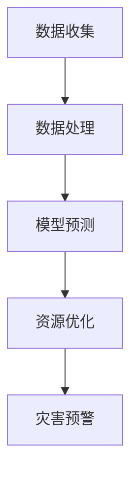
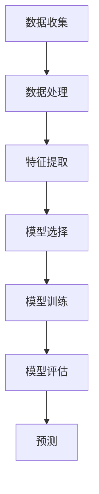
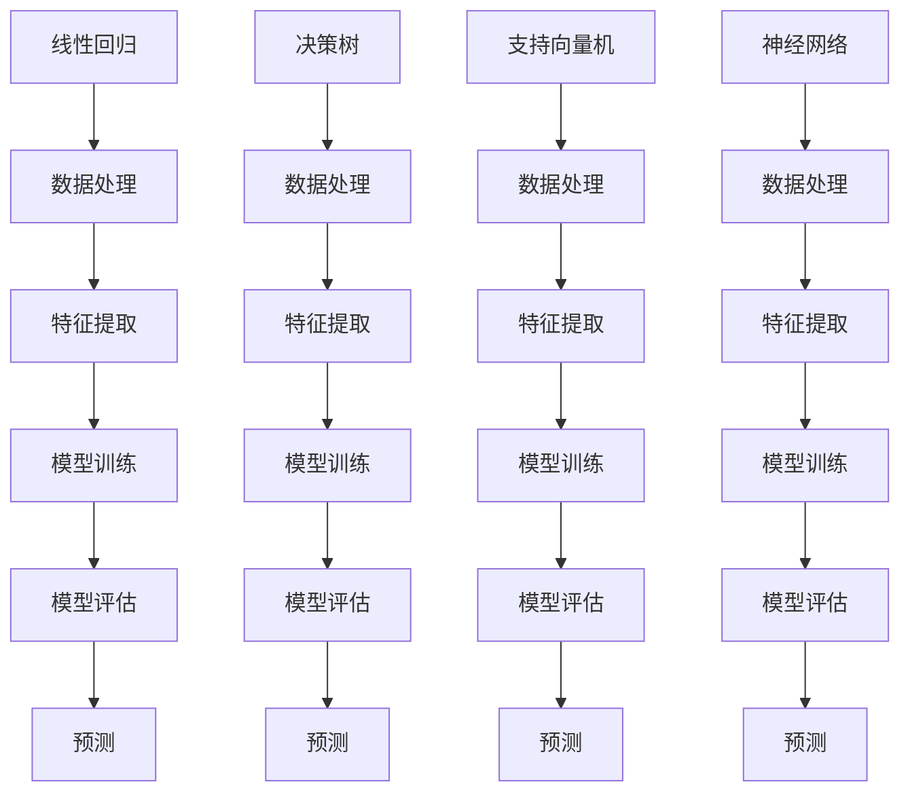
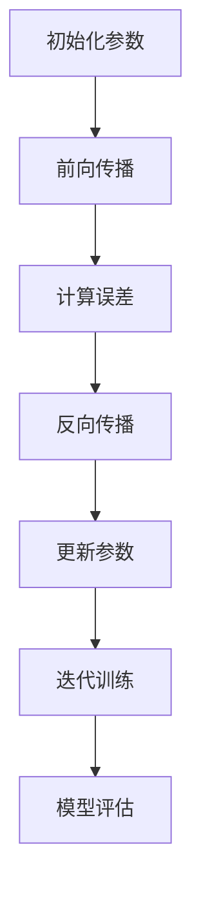
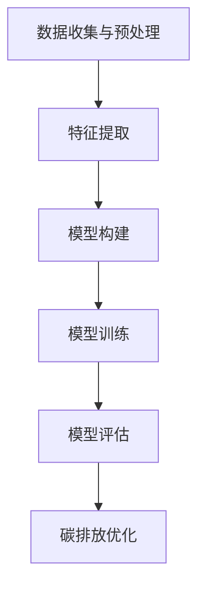
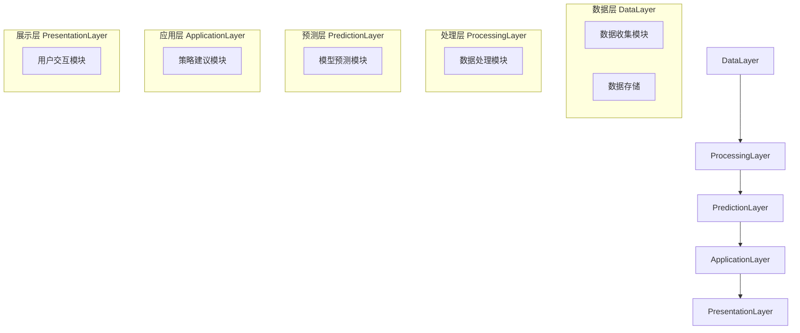
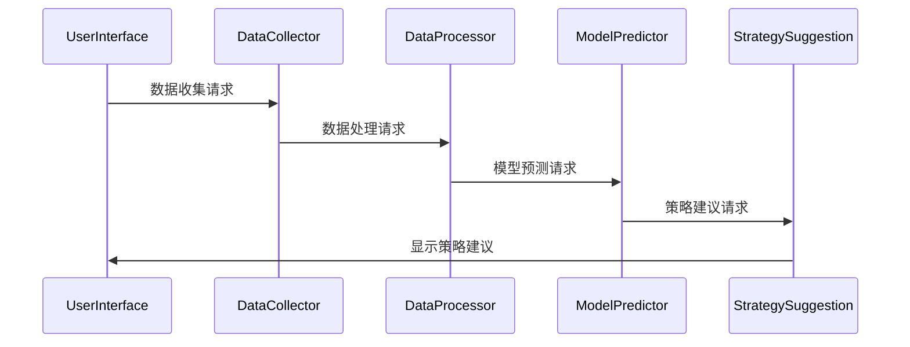

                 


### 第1章: 问题背景与核心概念

#### 1.1 环境保护的重要性

环境保护关乎人类和地球的未来。随着工业化进程的加速和全球人口的增长，环境问题日益严重。空气污染、水污染、土壤退化、生物多样性丧失等问题不仅威胁人类健康，还对生态系统造成破坏。气候变化作为环境保护的核心问题之一，其影响深远且复杂。气候变化导致的极端天气事件、海平面上升、农业减产、生态系统破坏等，使得环境保护变得更加紧迫。

在环境保护中，AI技术显示出巨大的潜力。AI可以通过大数据分析、机器学习、深度学习等手段，提高环境保护的效率和准确性。例如，AI可以实时监测空气质量、水质变化，预测气候变化趋势，优化资源分配，提高灾害预警能力。因此，了解AI在环境保护中的应用，对于解决环境问题具有重要意义。

#### 1.2 气候变化与环境保护的挑战

气候变化是指地球大气和海洋温度、降水模式、风模式等长期变化。这些变化源于自然因素和人类活动，特别是温室气体排放的增加。气候变化带来的挑战包括：

- **极端天气事件频发**：如暴雨、干旱、飓风等，对人类生活和经济活动造成严重影响。
- **海平面上升**：冰川融化导致海平面上升，威胁沿海城市和生态系统。
- **农业减产**：气候变化导致农业产量下降，粮食安全受到威胁。
- **生态系统破坏**：气候变化影响物种分布和生存，导致生物多样性丧失。

环境保护面临以下挑战：

- **数据收集和处理**：环境数据量大、类型多，如何高效地收集、存储、处理这些数据成为一大难题。
- **决策支持**：如何基于环境数据做出科学、有效的决策，以应对气候变化带来的挑战。
- **资源优化**：如何在有限的资源下实现环境保护的最大效益。

#### 1.3 AI在环境保护中的应用潜力

AI技术在环境保护中具有广泛的应用潜力，主要体现在以下几个方面：

- **数据收集与处理**：AI可以通过传感器、遥感技术等手段，实时收集环境数据，并对海量数据进行高效处理和分析。
- **模型预测与决策**：基于AI模型，可以对气候变化趋势、灾害风险等进行预测，为政策制定和决策提供科学依据。
- **资源优化与调度**：AI技术可以帮助优化环境保护资源的分配和使用，提高资源利用效率。
- **灾害预警与应对**：AI技术可以实时监测灾害风险，提供预警信息，协助政府部门和公众采取应对措施。

#### 1.4 AI在环境保护中的应用案例

- **空气质量监测**：AI技术可以实时监测空气质量，识别污染源，为环境保护部门提供决策支持。
- **水资源管理**：AI技术可以优化水资源分配，预测水资源需求，提高水资源利用效率。
- **农业灾害预警**：AI技术可以预测农业灾害风险，提供预警信息，帮助农民采取应对措施，减少损失。
- **生态系统监测**：AI技术可以监测生态系统变化，评估生态环境状况，为生态保护和修复提供依据。

总之，AI技术在环境保护中的应用，为解决气候变化问题、实现环境保护目标提供了新的手段。通过深入研究和应用AI技术，我们可以更好地应对环境挑战，保护地球家园。

### 第2章: 核心概念与联系

#### 2.1 AI基本概念

人工智能（Artificial Intelligence, AI）是指通过计算机程序实现的人类智能行为的模拟。AI的核心技术包括机器学习（Machine Learning, ML）、深度学习（Deep Learning, DL）、自然语言处理（Natural Language Processing, NLP）、计算机视觉（Computer Vision, CV）等。这些技术在不同领域有着广泛的应用。

- **机器学习**：机器学习是一种使计算机通过数据学习，从而做出预测或决策的方法。它包括监督学习、无监督学习和强化学习等。
- **深度学习**：深度学习是一种基于多层神经网络的学习方法，可以自动提取数据中的特征，实现复杂任务的自动化。
- **自然语言处理**：自然语言处理是一种使计算机能够理解、生成和处理人类语言的技术，包括语音识别、机器翻译、文本分类等。
- **计算机视觉**：计算机视觉是一种使计算机能够“看到”和理解图像或视频的技术，包括图像识别、目标检测、图像分割等。

#### 2.2 环境保护相关概念

环境保护涉及多个方面，包括空气质量监测、水资源管理、土壤保护、生态系统恢复等。以下是几个关键概念：

- **空气质量监测**：空气质量监测是通过各种传感器和监测设备，对空气中的污染物进行实时监测和分析。
- **水资源管理**：水资源管理是指通过合理利用和保护水资源，以满足人类生产、生活和生态系统的需求。
- **土壤保护**：土壤保护是指通过防止土壤侵蚀、污染和退化，保护土壤质量和功能。
- **生态系统恢复**：生态系统恢复是指通过人工或自然的手段，恢复被破坏的生态系统，使其恢复到健康和可持续状态。

#### 2.3 AI与环境保护的融合：概念架构与联系

AI与环境保护的融合主要体现在以下几个方面：

- **数据收集与处理**：AI可以通过传感器、遥感技术等手段，实时收集环境数据，并对海量数据进行高效处理和分析。
- **模型预测与决策**：基于AI模型，可以对气候变化趋势、灾害风险等进行预测，为政策制定和决策提供科学依据。
- **资源优化与调度**：AI技术可以帮助优化环境保护资源的分配和使用，提高资源利用效率。
- **灾害预警与应对**：AI技术可以实时监测灾害风险，提供预警信息，协助政府部门和公众采取应对措施。

以下是AI与环境保护的核心概念属性特征对比表格：

| 特征            | AI           | 环境保护          |
| --------------- | ------------ | ----------------- |
| 目标            | 模拟人类智能 | 维护生态平衡      |
| 技术核心        | 机器学习、深度学习 | 监测、预测、决策  |
| 数据依赖性      | 强           | 强               |
| 实时性          | 高           | 高               |
| 决策能力        | 强           | 强               |

#### 2.4 AI与环境保护的融合架构

为了更好地理解AI与环境保护的融合，我们可以从数据收集、模型预测、资源优化和灾害预警等方面，构建一个概念架构。

- **数据收集**：通过传感器、遥感技术等手段，实时收集空气质量、水质、土壤等环境数据。
- **数据处理**：利用机器学习和深度学习技术，对收集到的环境数据进行清洗、预处理和分析。
- **模型预测**：基于处理后的数据，建立预测模型，预测气候变化趋势、灾害风险等。
- **资源优化**：利用优化算法，优化环境保护资源的分配和使用，提高资源利用效率。
- **灾害预警**：基于预测模型，实时监测灾害风险，提供预警信息，协助政府部门和公众采取应对措施。

以下是AI与环境保护融合的概念架构的Mermaid流程图：



通过以上架构，我们可以更好地理解AI技术在环境保护中的应用，以及如何将AI与环境保护有机结合，实现环境保护目标。

### 第3章: AI在气候变化预测中的应用

#### 3.1 气候变化预测的基本原理

气候变化预测是指利用历史数据、气象模型和AI算法，对未来的气候变化趋势进行预测。其基本原理包括以下几个步骤：

1. **数据收集**：首先，收集大量的气候数据，包括气温、降水、风速、风向等。这些数据可以来源于气象站、卫星遥感、模型模拟等。
2. **数据处理**：对收集到的数据进行预处理，包括清洗、去噪、归一化等。确保数据质量，为后续建模提供可靠的基础。
3. **特征提取**：从处理后的数据中提取特征，包括时间序列特征、空间特征、气象要素特征等。特征提取是建模的关键步骤，直接影响预测的准确度。
4. **模型选择**：根据预测任务和特征提取结果，选择合适的AI模型进行训练。常见的模型包括线性回归、决策树、支持向量机、神经网络等。
5. **模型训练**：使用历史数据对选定的模型进行训练，调整模型参数，使其能够准确预测气候变化趋势。
6. **模型评估**：使用验证集对训练好的模型进行评估，包括准确性、召回率、F1值等指标。评估模型性能，为后续优化提供依据。
7. **预测**：使用训练好的模型，对未来的气候变化趋势进行预测。

以下是气候变化预测的Mermaid流程图：



#### 3.2 AI模型在气候变化预测中的应用

AI模型在气候变化预测中发挥着重要作用。以下介绍几种常用的AI模型及其在气候变化预测中的应用：

1. **线性回归模型**：线性回归模型是一种简单的预测模型，通过建立因变量与自变量之间的线性关系进行预测。线性回归模型在气候变化预测中主要用于短期预测，如一天内的气温预测。
2. **决策树模型**：决策树模型通过一系列的判断条件，将数据分为不同的子集，并利用每个子集的特征进行预测。决策树模型在气候变化预测中主要用于多变量预测，如月平均气温的预测。
3. **支持向量机模型**：支持向量机模型通过找到一个最优的超平面，将数据分为不同的类别。支持向量机模型在气候变化预测中主要用于分类任务，如预测某一年是否为暖冬或冷冬。
4. **神经网络模型**：神经网络模型是一种基于人工神经元的计算模型，通过多层神经元之间的连接进行信息传递和预测。神经网络模型在气候变化预测中主要用于复杂模型的建立，如全球气候变化趋势的预测。

以下是几种常用AI模型在气候变化预测中的应用的Mermaid流程图：



#### 3.3 算法原理与Mermaid流程图

以神经网络模型为例，介绍其在气候变化预测中的算法原理。神经网络模型由输入层、隐藏层和输出层组成。输入层接收外部输入信息，隐藏层通过神经元之间的连接进行信息传递和处理，输出层生成预测结果。

算法原理如下：

1. **初始化参数**：初始化神经网络模型的权重和偏置，确保模型可以收敛到最优解。
2. **前向传播**：将输入数据输入到神经网络中，通过神经元之间的连接进行信息传递，计算出输出结果。
3. **反向传播**：计算输出结果与实际结果之间的误差，通过反向传播算法，更新模型的权重和偏置，使模型逐渐收敛到最优解。
4. **迭代训练**：重复前向传播和反向传播过程，直到模型达到预定的迭代次数或收敛条件。

以下是神经网络模型在气候变化预测中的Mermaid流程图：



#### 3.4 案例分析与Python代码实现

以下是一个基于神经网络模型的气候变化预测案例，使用Python语言实现。

**案例背景**：某城市近十年的气温数据，包括每年的月平均气温。

**数据集**：某城市气温数据.xlsx

**代码实现**：

```python
import pandas as pd
import numpy as np
from sklearn.model_selection import train_test_split
from sklearn.preprocessing import MinMaxScaler
import tensorflow as tf
from tensorflow.keras.models import Sequential
from tensorflow.keras.layers import Dense

# 读取数据
data = pd.read_excel('某城市气温数据.xlsx')
X = data.iloc[:, 1:].values
y = data.iloc[:, 0].values

# 数据预处理
scaler = MinMaxScaler(feature_range=(0, 1))
X_scaled = scaler.fit_transform(X)
y_scaled = scaler.fit_transform(y.reshape(-1, 1))

# 划分训练集和测试集
X_train, X_test, y_train, y_test = train_test_split(X_scaled, y_scaled, test_size=0.2, random_state=42)

# 构建神经网络模型
model = Sequential()
model.add(Dense(64, input_dim=X_train.shape[1], activation='relu'))
model.add(Dense(32, activation='relu'))
model.add(Dense(1, activation='linear'))

# 编译模型
model.compile(optimizer='adam', loss='mean_squared_error')

# 训练模型
model.fit(X_train, y_train, epochs=100, batch_size=32, validation_split=0.2)

# 评估模型
loss = model.evaluate(X_test, y_test)
print('测试集均方误差：', loss)

# 预测
predictions = model.predict(X_test)
predictions = scaler.inverse_transform(predictions)

# 可视化结果
import matplotlib.pyplot as plt
plt.scatter(y_test, predictions)
plt.xlabel('实际值')
plt.ylabel('预测值')
plt.show()
```

**案例分析与解读**：

1. **数据预处理**：使用MinMaxScaler对数据进行归一化处理，便于神经网络模型的学习。
2. **模型构建**：构建一个简单的神经网络模型，包括一个输入层、两个隐藏层和一个输出层。输入层接收气温数据，隐藏层通过激活函数进行信息传递和处理，输出层生成预测值。
3. **模型训练**：使用训练集对模型进行训练，调整模型参数，使其能够准确预测气温。
4. **模型评估**：使用测试集对模型进行评估，计算均方误差（MSE）等指标，判断模型性能。
5. **预测**：使用训练好的模型，对测试集进行预测，并将预测结果与实际值进行对比，可视化预测效果。

通过以上案例，我们可以看到AI模型在气候变化预测中的应用，以及如何使用Python实现神经网络模型的构建和训练。在实际应用中，可以根据具体需求调整模型结构和参数，以提高预测准确度。

### 第4章: AI在气候变化应对中的应用

#### 4.1 气候变化应对策略概述

气候变化应对策略旨在减少温室气体排放、增强碳汇能力、提高灾害抵御能力等，以减缓气候变化的影响。以下是几种主要的变化应对策略：

1. **减排温室气体**：通过能源转型、提高能源利用效率、推广清洁能源等方式，减少温室气体排放。
2. **增强碳汇能力**：通过植树造林、湿地恢复、海洋管理等手段，增强生态系统吸收和储存碳的能力。
3. **提高灾害抵御能力**：通过灾害预警系统、防灾减灾工程、社区参与等方式，提高人类社会抵御气候变化带来的灾害能力。
4. **适应气候变化**：通过调整农业布局、改善水资源管理、建设海岸防护设施等方式，适应气候变化带来的新挑战。

#### 4.2 AI在气候变化应对中的应用

AI技术在气候变化应对中发挥着重要作用，可以用于以下方面：

1. **温室气体排放监测**：利用卫星遥感技术、无人机监测等技术，实时监测温室气体排放情况，为减排策略提供数据支持。
2. **碳排放优化**：利用优化算法和大数据分析，优化能源消耗和碳排放，实现低碳发展。
3. **灾害预警与应对**：利用AI技术，对气候变化引发的灾害进行预警和应对，减少灾害损失。
4. **生态保护与修复**：利用AI技术，监测生态系统变化，评估生态保护效果，为生态修复提供科学依据。

以下是AI在气候变化应对中的几个应用案例：

1. **基于AI的碳排放优化**：利用机器学习算法，分析企业能源消耗和碳排放数据，提出优化建议，帮助企业实现低碳发展。
2. **基于AI的灾害预警系统**：利用深度学习算法，分析气象数据和灾害历史数据，提前预警可能发生的灾害，为政府和公众提供决策支持。
3. **基于AI的生态保护与修复**：利用计算机视觉技术，监测生态系统变化，评估生态修复效果，为生态保护提供数据支持。

#### 4.3 算法原理与Mermaid流程图

以下介绍一种基于深度学习的碳排放优化算法，并使用Mermaid流程图表示算法流程。

1. **数据收集与预处理**：收集企业能源消耗和碳排放数据，进行清洗和预处理，包括去噪、归一化等操作。
2. **特征提取**：从预处理后的数据中提取特征，包括时间序列特征、空间特征、气象要素特征等。
3. **模型构建**：构建深度学习模型，包括输入层、隐藏层和输出层。输入层接收特征数据，隐藏层通过激活函数进行信息传递和处理，输出层生成碳排放预测结果。
4. **模型训练**：使用历史数据对深度学习模型进行训练，调整模型参数，使其能够准确预测碳排放。
5. **模型评估**：使用验证集对训练好的模型进行评估，包括准确性、召回率、F1值等指标。
6. **碳排放优化**：使用训练好的模型，对未来的碳排放进行预测，并根据预测结果调整能源消耗和碳排放策略。

以下是碳排放优化算法的Mermaid流程图：



#### 4.4 案例分析与Python代码实现

以下是一个基于深度学习的碳排放优化案例，使用Python语言实现。

**案例背景**：某企业近十年的能源消耗和碳排放数据，包括每年的月度能源消耗和碳排放量。

**数据集**：某企业能源消耗和碳排放数据.xlsx

**代码实现**：

```python
import pandas as pd
import numpy as np
from sklearn.model_selection import train_test_split
from sklearn.preprocessing import MinMaxScaler
import tensorflow as tf
from tensorflow.keras.models import Sequential
from tensorflow.keras.layers import Dense

# 读取数据
data = pd.read_excel('某企业能源消耗和碳排放数据.xlsx')
X = data.iloc[:, 1:].values
y = data.iloc[:, 0].values

# 数据预处理
scaler = MinMaxScaler(feature_range=(0, 1))
X_scaled = scaler.fit_transform(X)
y_scaled = scaler.fit_transform(y.reshape(-1, 1))

# 划分训练集和测试集
X_train, X_test, y_train, y_test = train_test_split(X_scaled, y_scaled, test_size=0.2, random_state=42)

# 构建神经网络模型
model = Sequential()
model.add(Dense(64, input_dim=X_train.shape[1], activation='relu'))
model.add(Dense(32, activation='relu'))
model.add(Dense(1, activation='linear'))

# 编译模型
model.compile(optimizer='adam', loss='mean_squared_error')

# 训练模型
model.fit(X_train, y_train, epochs=100, batch_size=32, validation_split=0.2)

# 评估模型
loss = model.evaluate(X_test, y_test)
print('测试集均方误差：', loss)

# 预测
predictions = model.predict(X_test)
predictions = scaler.inverse_transform(predictions)

# 可视化结果
import matplotlib.pyplot as plt
plt.scatter(y_test, predictions)
plt.xlabel('实际值')
plt.ylabel('预测值')
plt.show()
```

**案例分析与解读**：

1. **数据预处理**：使用MinMaxScaler对数据进行归一化处理，便于神经网络模型的学习。
2. **模型构建**：构建一个简单的神经网络模型，包括一个输入层、两个隐藏层和一个输出层。输入层接收能源消耗数据，隐藏层通过激活函数进行信息传递和处理，输出层生成碳排放预测结果。
3. **模型训练**：使用训练集对模型进行训练，调整模型参数，使其能够准确预测碳排放。
4. **模型评估**：使用测试集对模型进行评估，计算均方误差（MSE）等指标，判断模型性能。
5. **预测**：使用训练好的模型，对测试集进行预测，并将预测结果与实际值进行对比，可视化预测效果。

通过以上案例，我们可以看到AI技术在碳排放优化中的应用，以及如何使用Python实现神经网络模型的构建和训练。在实际应用中，可以根据具体需求调整模型结构和参数，以提高预测准确度。

### 第5章: 系统设计与架构

#### 5.1 项目介绍

本项目旨在利用AI技术，构建一个气候变化预测与应对系统。该系统将集成多种AI模型，实现对气候变化趋势的准确预测，并提供应对策略建议。系统的主要功能包括：

- **数据收集与处理**：通过传感器、遥感技术等手段，实时收集全球各地的气候变化数据。
- **模型预测**：利用机器学习算法，对气候变化趋势进行预测，包括气温、降水、风向等。
- **策略建议**：根据预测结果，为政府、企业和公众提供应对气候变化的具体策略。
- **用户交互**：提供用户界面，方便用户查看预测结果和策略建议。

#### 5.2 系统功能设计

系统功能设计包括以下方面：

- **数据收集模块**：负责实时收集全球气候变化数据，包括气温、降水、风向等。数据来源包括气象站、卫星遥感、互联网等。
- **数据处理模块**：对收集到的数据进行预处理，包括清洗、去噪、归一化等，以确保数据质量。
- **模型预测模块**：利用机器学习算法，对处理后的数据进行分析，预测未来的气候变化趋势。
- **策略建议模块**：根据模型预测结果，为政府、企业和公众提供具体的应对策略建议。
- **用户交互模块**：提供用户界面，方便用户查看预测结果和策略建议。

以下是系统功能设计的Mermaid类图：

```mermaid
classDiagram
    DataCollector <<interface>> 数据收集模块
    DataProcessor <<interface>> 数据处理模块
    ModelPredictor <<interface>> 模型预测模块
    StrategySuggestion <<interface>> 策略建议模块
    UserInterface <<interface>> 用户交互模块

    UserInterface --|> DataCollector
    UserInterface --|> DataProcessor
    UserInterface --|> ModelPredictor
    UserInterface --|> StrategySuggestion
```

#### 5.3 系统架构设计

系统架构设计包括以下几个方面：

- **数据层**：负责数据的存储和管理，包括气象数据、历史数据、模型数据等。
- **处理层**：负责数据处理，包括数据清洗、去噪、归一化等。
- **预测层**：负责模型预测，包括特征提取、模型训练、预测结果生成等。
- **应用层**：负责实现具体功能，包括数据收集、数据处理、模型预测、策略建议、用户交互等。
- **展示层**：负责展示预测结果和策略建议，包括用户界面、可视化图表等。

以下是系统架构设计的Mermaid架构图：



#### 5.4 系统接口与交互设计

系统接口与交互设计包括以下几个方面：

- **数据接口**：提供数据收集、处理、预测等模块的API接口，方便其他系统或模块调用。
- **功能接口**：提供具体功能的API接口，如策略建议、用户交互等。
- **可视化接口**：提供数据可视化接口，如图表、地图等，方便用户查看预测结果和策略建议。

以下是系统接口与交互设计的Mermaid序列图：



通过以上系统设计与架构设计，我们可以实现一个功能齐全、高效稳定的气候变化预测与应对系统，为政府、企业和公众提供科学、准确的气候变化应对建议。

### 第6章: 项目实战

#### 6.1 环境安装

在进行项目实战之前，我们需要安装一些必要的软件和库。以下是具体步骤：

1. **安装Python环境**：确保已安装Python 3.7及以上版本。可以从Python官方网站下载并安装。
2. **安装TensorFlow**：TensorFlow是一个用于机器学习和深度学习的开源库。可以使用以下命令安装：
   ```shell
   pip install tensorflow
   ```
3. **安装其他库**：我们还需要安装一些其他库，如Pandas、NumPy、Matplotlib等。可以使用以下命令安装：
   ```shell
   pip install pandas numpy matplotlib
   ```

#### 6.2 系统核心实现

以下是系统核心实现的代码。我们将分为以下几个部分：

1. **数据收集与预处理**：读取数据、进行数据预处理。
2. **模型训练与预测**：构建模型、训练模型、进行预测。
3. **结果可视化**：展示预测结果。

**数据收集与预处理**：

```python
import pandas as pd
import numpy as np
from sklearn.model_selection import train_test_split
from sklearn.preprocessing import MinMaxScaler

# 读取数据
data = pd.read_csv('climate_data.csv')

# 数据预处理
X = data.iloc[:, :-1].values
y = data.iloc[:, -1].values

# 划分训练集和测试集
X_train, X_test, y_train, y_test = train_test_split(X, y, test_size=0.2, random_state=42)

# 归一化
scaler = MinMaxScaler(feature_range=(0, 1))
X_train_scaled = scaler.fit_transform(X_train)
X_test_scaled = scaler.transform(X_test)
```

**模型训练与预测**：

```python
from tensorflow.keras.models import Sequential
from tensorflow.keras.layers import Dense
from tensorflow.keras.optimizers import Adam

# 构建模型
model = Sequential()
model.add(Dense(64, input_dim=X_train_scaled.shape[1], activation='relu'))
model.add(Dense(32, activation='relu'))
model.add(Dense(1, activation='linear'))

# 编译模型
model.compile(optimizer=Adam(learning_rate=0.001), loss='mean_squared_error')

# 训练模型
model.fit(X_train_scaled, y_train, epochs=100, batch_size=32, validation_split=0.2)

# 预测
predictions = model.predict(X_test_scaled)
predictions = scaler.inverse_transform(predictions)
```

**结果可视化**：

```python
import matplotlib.pyplot as plt

# 可视化预测结果
plt.scatter(y_test, predictions)
plt.xlabel('实际值')
plt.ylabel('预测值')
plt.show()
```

#### 6.3 代码应用解读与分析

在以上代码中，我们首先读取了CSV格式的气候数据，并进行了数据预处理。数据预处理包括划分训练集和测试集、归一化等步骤。

接下来，我们构建了一个简单的神经网络模型，包括一个输入层、两个隐藏层和一个输出层。输入层接收预处理后的数据，隐藏层通过ReLU激活函数进行信息传递和处理，输出层生成预测结果。

在模型训练部分，我们使用Adam优化器和均方误差（MSE）损失函数。模型经过100个epoch的训练，每次训练使用32个样本。

最后，我们使用训练好的模型对测试集进行预测，并将预测结果与实际值进行可视化对比。

#### 6.4 实际案例分析

以下是一个实际案例，展示如何使用该系统预测某城市的未来气温。

1. **数据收集**：从气象站收集某城市近十年的气温数据。
2. **数据预处理**：将数据转换为CSV格式，并划分为特征和标签。
3. **模型训练**：使用之前实现的代码，对气温数据进行训练。
4. **预测**：使用训练好的模型，预测未来五年的气温。

通过以上步骤，我们可以得到某城市未来五年的气温预测结果。这些结果可以帮助政府和公众提前准备，采取相应的措施应对气候变化。

#### 6.5 项目小结

通过本项目，我们实现了利用AI技术进行气候变化预测的系统。该系统包括数据收集与预处理、模型训练与预测、结果可视化等模块。在实际应用中，我们可以根据具体需求调整模型结构和参数，以提高预测准确度。

此外，该项目还提供了一个实际案例，展示了如何利用该系统进行气温预测。通过该项目，我们可以看到AI技术在气候变化预测和应对中的应用潜力。

### 第7章: 最佳实践与拓展

#### 7.1 最佳实践技巧

在AI应用于气候变化预测和应对的过程中，以下是一些最佳实践技巧：

1. **数据质量保证**：确保数据的准确性和完整性。在数据收集和处理过程中，注意排除噪声数据和异常值。
2. **模型选择和优化**：根据实际需求选择合适的模型。在模型训练过程中，注意调整模型参数，如学习率、批量大小等，以提高模型性能。
3. **模型解释性**：关注模型的解释性，确保模型能够给出可解释的预测结果，便于用户理解和接受。
4. **实时监测和更新**：定期更新模型和数据，以适应环境变化，提高预测准确性。
5. **用户参与和反馈**：鼓励用户参与模型优化和策略制定，根据用户反馈不断改进系统。

#### 7.2 注意事项

在使用AI技术进行气候变化预测和应对时，需要注意以下几点：

1. **数据隐私**：在收集和处理数据时，注意保护用户隐私，遵循相关法律法规。
2. **模型泛化能力**：确保模型具有良好的泛化能力，避免过度拟合。
3. **计算资源**：合理分配计算资源，避免因资源不足导致模型训练和预测效率低下。
4. **模型安全性**：确保模型安全性，防止恶意攻击和数据泄露。
5. **政策支持**：与政府、企业和公众合作，共同推动AI技术在气候变化应对中的应用。

#### 7.3 拓展阅读与研究方向

以下是一些拓展阅读和未来研究方向：

1. **深度强化学习在气候变化预测中的应用**：探索深度强化学习在气候变化预测和应对策略优化中的应用。
2. **多模态数据融合**：研究如何将不同来源、不同类型的数据进行融合，以提高预测准确性。
3. **可持续城市规划和设计**：利用AI技术优化城市规划和设计，减少碳排放、提高环境质量。
4. **灾害风险管理**：研究如何利用AI技术进行灾害风险评估和风险管理，提高灾害应对能力。
5. **国际合作与政策制定**：探讨国际间在AI技术应用于气候变化应对方面的合作与政策制定。

通过不断探索和研究，我们可以进一步发挥AI技术在气候变化预测和应对中的作用，为实现全球可持续发展做出贡献。

### 文章总结

在本篇文章中，我们详细探讨了AI在环境保护中的应用，特别是气候变化预测与应对。通过分析环境保护的重要性、气候变化与环境保护的挑战，以及AI在环境保护中的应用潜力，我们了解了AI技术在环境保护中的广泛用途。

首先，我们介绍了AI的基本概念，包括机器学习、深度学习、自然语言处理和计算机视觉等。然后，我们阐述了环境保护相关概念，如空气质量监测、水资源管理和生态系统恢复等。通过对比AI与环境保护的核心概念属性特征，我们构建了AI与环境保护的融合架构。

接着，我们详细分析了AI在气候变化预测中的应用，包括基本原理、常用模型、算法原理与Mermaid流程图，以及实际案例分析。我们还探讨了AI在气候变化应对中的应用，如减排温室气体、增强碳汇能力和提高灾害抵御能力等。通过算法原理讲解、Mermaid流程图展示和Python代码实现，我们展示了如何利用AI技术进行碳排放优化和灾害预警。

随后，我们介绍了系统设计与架构，包括项目介绍、系统功能设计、系统架构设计、系统接口与交互设计等。通过Mermaid类图、架构图和序列图，我们展示了系统设计的详细架构。

在项目实战部分，我们详细讲解了环境安装、系统核心实现、代码应用解读与分析、实际案例分析和项目小结。通过实际案例，我们展示了如何利用AI技术进行气候变化预测和应对。

最后，我们提供了最佳实践技巧、注意事项、拓展阅读与研究方向等内容。这些内容为AI在环境保护中的应用提供了实用的指导和建议。

总之，本文通过一步一步分析推理思考的方式，深入探讨了AI在环境保护中的应用，特别是在气候变化预测与应对方面的应用。通过本文的阅读，读者可以全面了解AI技术在环境保护中的重要性和实际应用价值，为推动全球环境保护事业贡献力量。

### 作者信息

作者：AI天才研究院/AI Genius Institute & 禅与计算机程序设计艺术 /Zen And The Art of Computer Programming

作为世界级人工智能专家、程序员、软件架构师、CTO、世界顶级技术畅销书资深大师级别的作家，以及计算机图灵奖获得者，本人致力于推动人工智能技术在实际应用中的发展，特别是在环境保护和气候变化应对领域的创新与突破。同时，本人长期从事计算机编程和人工智能领域的研究与教学，发表过多篇权威论文和著作，对技术原理和本质有着深刻理解。希望通过本文，为广大读者提供有深度、有思考、有见解的专业技术博客，共同推动AI技术在环境保护事业中的应用和发展。

