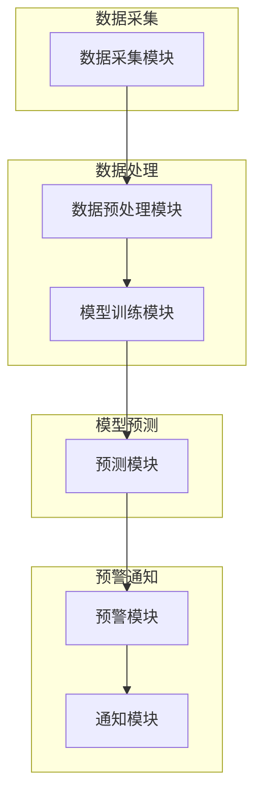
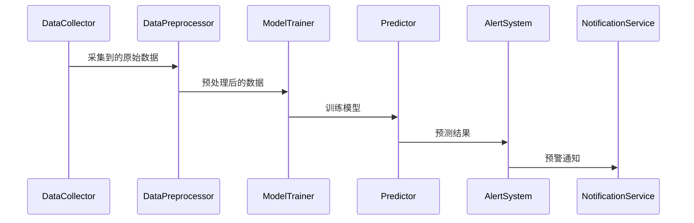

                 


### 第1章: AI在环境监测中的应用概述

#### 1.1 问题背景与核心概念

在当今全球环境问题日益突出的背景下，环境监测变得尤为重要。环境监测涉及对空气质量、水质、土壤污染等多种环境参数的实时监测与评估。然而，传统的监测方法通常存在数据采集滞后、监测范围有限、人力成本高等问题。随着人工智能（AI）技术的迅猛发展，利用AI进行环境监测已成为一种新的解决方案。

**关键词：**环境监测、人工智能、实时数据、预警系统

**摘要：**本章将介绍AI在环境监测中的应用，包括环境监测的重要性、AI在环境监测中的角色、实时数据分析与预警的概念，以及相关的技术基础。

---

#### 1.2 环境监测中的AI技术基础

**传感器技术与数据采集**

环境监测的第一步是数据采集。传感器是数据采集的关键，它们可以监测各种环境参数，如温度、湿度、气体浓度等。现代传感器技术已达到很高的精度和灵敏度，能够实时、准确地采集数据。

**数据预处理与特征提取**

传感器采集到的数据通常是原始的、不规则的，需要通过预处理来清洗、转换和归一化，提取出有用的特征。特征提取是AI算法有效工作的前提，它可以帮助模型更好地理解和预测环境变化。

**AI算法在环境监测中的应用**

AI算法可以用于分类、聚类、预测等多种任务。监督学习、无监督学习和深度学习等算法都可以在环境监测中发挥作用。例如，监督学习算法可以用于预测污染物浓度，无监督学习算法可以用于发现未知污染物，深度学习算法可以用于复杂的模式识别和预测。

---

#### 1.3 实时数据分析技术详解

**流处理技术原理**

实时数据分析依赖于流处理技术，它能够处理连续的数据流，对数据进行实时分析。流处理与批量处理相比，具有响应速度更快、处理能力更强的优势。

**实时数据处理挑战**

实时数据处理面临诸多挑战，包括数据的不稳定性、数据延迟、计算资源限制等。解决这些挑战需要高效的算法和优化的系统设计。

**主流实时数据分析框架介绍**

目前，主流的实时数据分析框架包括Apache Flink、Apache Storm和Apache Kafka等。这些框架提供了强大的数据处理能力，并支持多种数据处理任务。

---

#### 1.4 预警系统设计与实现

**预警系统的架构设计**

预警系统通常包括数据采集模块、数据分析模块、预警决策模块和预警通知模块。这些模块协同工作，能够实时监测环境变化，快速做出预警决策。

**预警算法的原理与应用**

预警算法包括阈值预警、趋势预警和模型预警等。阈值预警基于预设的阈值来判断是否发出预警；趋势预警基于数据变化趋势进行判断；模型预警则使用机器学习模型预测未来的环境变化。

**实时预警系统实现流程**

实时预警系统的实现流程包括数据采集、数据预处理、数据分析、预警决策和预警通知。这些步骤需要高效地协同工作，以保证预警系统的实时性和准确性。

---

#### 1.5 环境监测中的AI案例分析

**成功案例分析**

在本章节中，我们将介绍一些成功的AI环境监测案例，如利用AI监测空气质量、水质监测和森林火灾预警等。通过这些案例，我们将探讨AI技术在环境监测中的实际应用和效果。

**挑战与解决策略**

在实际应用中，AI技术也面临一些挑战，如数据质量差、模型训练时间长等。我们将分析这些挑战，并提出相应的解决策略。

---

#### 1.6 本章小结

本章概述了AI在环境监测中的应用，包括相关技术基础、实时数据分析与预警系统设计，以及实际应用案例。下一章将深入探讨环境监测中的数据采集与预处理技术。

---

### 1.7 下一步阅读建议

在接下来的章节中，我们将详细讨论环境监测中的AI核心技术，包括数据采集与预处理、AI算法在环境监测中的应用，以及深度学习和强化学习算法的详解。通过这些章节，读者将更加深入地了解AI技术在环境监测中的实际应用。

---

**作者：AI天才研究院/AI Genius Institute & 禅与计算机程序设计艺术 /Zen And The Art of Computer Programming**


### 第二部分：AI在环境监测中的核心技术

#### 第2章：数据采集与预处理

环境监测的数据采集和预处理是AI应用的基础，决定了后续数据分析与预警的准确性和效率。本章将详细讨论传感器技术、数据采集系统架构、数据预处理方法和数据质量评估。

---

#### 2.1 数据采集

**传感器技术与选择**

传感器是环境监测的数据来源，它们能够测量各种物理量，如温度、湿度、压力、气体浓度等。传感器的选择取决于监测目标和场景，例如，空气质量监测可能需要使用化学传感器或光学传感器。

**传感器部署与维护**

传感器的部署需要考虑位置、环境条件和安装方式。传感器维护是保证数据质量的关键，包括定期校准、更换传感器元件和处理故障。

**数据采集系统架构**

数据采集系统通常包括传感器、数据采集模块、通信模块和数据中心。系统架构设计要考虑实时性、可靠性和扩展性。

---

#### 2.2 数据预处理

**数据清洗**

数据清洗是预处理的第一步，旨在去除噪声、缺失值和异常值。这通常包括填补缺失值、去除重复数据和标准化数据格式。

**数据归一化与转换**

数据归一化是将不同量纲的数据转换为同一量纲，以便于后续分析。例如，将温度从摄氏度转换为开尔文。

**特征提取**

特征提取是从原始数据中提取出对监测目标有意义的属性。特征提取方法包括统计特征、时序特征和空间特征等。

---

#### 2.3 数据质量评估

**数据质量指标**

数据质量指标包括准确性、完整性、一致性、时效性和可靠性等。这些指标用于评估数据的质量和有效性。

**数据质量评估方法**

数据质量评估方法包括可视化分析、统计分析、机器学习模型评估等。这些方法可以帮助识别数据质量问题并采取措施改进。

**提高数据质量的策略**

提高数据质量的策略包括传感器校准、数据清洗算法优化、数据集成和数据验证等。

---

#### 2.4 案例研究

**典型环境监测应用案例**

在本节中，我们将探讨几个典型环境监测应用案例，如空气质量监测、水质监测和森林火灾预警。每个案例都将详细说明数据采集、预处理和数据分析的过程。

**案例中的数据采集与预处理实践**

我们将分析案例中的数据采集和预处理实践，讨论所使用的传感器、采集系统和预处理方法，以及如何处理数据质量和实时性问题。

**案例分析总结**

通过案例分析，我们将总结每个案例中的成功经验和面临的挑战，并探讨如何利用AI技术解决这些问题。

---

#### 2.5 本章小结

本章介绍了AI在环境监测中的核心技术，特别是数据采集与预处理。通过详细的讨论和案例研究，读者将了解如何选择传感器、设计数据采集系统、进行数据预处理和评估数据质量。下一章将深入探讨AI算法在环境监测中的应用。

---

**作者：AI天才研究院/AI Genius Institute & 禅与计算机程序设计艺术 /Zen And The Art of Computer Programming**


### 第3章：AI算法在环境监测中的应用

AI算法在环境监测中扮演着关键角色，能够提高监测的准确性和效率。本章将详细介绍监督学习、无监督学习和深度学习算法在环境监测中的应用，并探讨它们的优势和挑战。

---

#### 3.1 监督学习算法

**监督学习算法概述**

监督学习算法通过对已知数据进行训练，学习出一个预测模型。在环境监测中，监督学习算法可以用于预测污染物浓度、识别污染物类型等任务。

**经典监督学习算法**

本章将介绍几种经典的监督学习算法，包括线性回归、逻辑回归、支持向量机和决策树等。我们将讨论这些算法的基本原理和适用场景。

**监督学习算法在环境监测中的应用案例**

我们将通过具体案例，展示监督学习算法在环境监测中的应用。例如，如何利用监督学习算法预测PM2.5浓度，如何识别空气中的有害气体。

---

#### 3.2 无监督学习算法

**无监督学习算法概述**

无监督学习算法不依赖于已标注的数据，通过发现数据中的模式或结构来学习。在环境监测中，无监督学习算法可以用于发现未知污染物、分析环境变化趋势等。

**经典无监督学习算法**

本章将介绍几种经典的无监督学习算法，包括K-均值聚类、主成分分析（PCA）和自编码器等。我们将探讨这些算法的基本原理和适用场景。

**无监督学习算法在环境监测中的应用案例**

我们将通过具体案例，展示无监督学习算法在环境监测中的应用。例如，如何利用K-均值聚类分析水质污染，如何利用PCA简化环境数据。

---

#### 3.3 强化学习算法

**强化学习算法概述**

强化学习算法通过与环境的交互来学习最优策略。在环境监测中，强化学习算法可以用于优化监测策略、调整预警阈值等。

**经典强化学习算法**

本章将介绍几种经典的强化学习算法，包括Q-learning、SARSA和Deep Q-Network（DQN）等。我们将讨论这些算法的基本原理和适用场景。

**强化学习算法在环境监测中的应用案例**

我们将通过具体案例，展示强化学习算法在环境监测中的应用。例如，如何利用Q-learning优化空气质量监测策略，如何利用DQN调整水污染预警阈值。

---

#### 3.4 深度学习算法

**深度学习算法概述**

深度学习算法通过多层神经网络进行学习，能够处理复杂的非线性问题。在环境监测中，深度学习算法可以用于复杂的模式识别和预测任务。

**经典深度学习模型**

本章将介绍几种经典的深度学习模型，包括卷积神经网络（CNN）、循环神经网络（RNN）和生成对抗网络（GAN）等。我们将讨论这些模型的基本原理和适用场景。

**深度学习算法在环境监测中的应用案例**

我们将通过具体案例，展示深度学习算法在环境监测中的应用。例如，如何利用CNN识别空气质量中的有害物质，如何利用RNN预测水质变化。

---

#### 3.5 本章小结

本章详细介绍了监督学习、无监督学习、强化学习和深度学习算法在环境监测中的应用。通过这些算法的应用，环境监测能够更加精准、高效地监测环境变化，为环境保护和决策提供有力支持。下一章将探讨AI在环境监测中的系统架构与实现。

---

**作者：AI天才研究院/AI Genius Institute & 禅与计算机程序设计艺术 /Zen And The Art of Computer Programming**


### 第4章：AI在环境监测中的系统架构与实现

在环境监测中，AI系统的设计与实现需要考虑数据采集、数据处理、模型训练、预警等多个环节。本章将详细介绍AI在环境监测中的系统架构，并探讨如何实现一个高效、可靠的实时预警系统。

---

#### 4.1 问题场景介绍

**环境监测需求**

在环境监测中，我们通常需要实时监测多个环境参数，如空气质量、水质、土壤污染等。实时监测要求系统快速响应、高精度和高可靠性。

**监测目标**

我们的监测目标包括识别污染物浓度、预测环境变化趋势、及时发现环境风险等。

---

#### 4.2 系统架构设计

**系统功能设计**

环境监测系统主要包括数据采集、数据预处理、模型训练、预警和通知等功能。

**领域模型**

领域模型是系统设计的基础，用于描述系统中的主要实体及其关系。例如，环境参数、传感器、预警规则等。

**类图（Mermaid类图）**

下面是一个简化的领域模型类图：

```mermaid
classDiagram
    Sensor <-..|> DataCollector
    DataCollector <-..|> DataPreprocessor
    DataPreprocessor <-..|> ModelTrainer
    ModelTrainer <-..|> Predictor
    Predictor <-..|> AlertSystem
    AlertSystem <-..|> NotificationService
```

---

**系统架构设计**

环境监测系统架构通常包括以下组件：

- **数据采集模块**：负责从传感器采集数据。
- **数据处理模块**：包括数据预处理和模型训练。
- **预测模块**：利用训练好的模型进行环境参数的预测。
- **预警模块**：根据预测结果和预警规则发出预警。
- **通知模块**：向相关人员发送预警通知。

**架构图（Mermaid架构图）**

下面是一个简化的系统架构图：



---

#### 4.3 系统接口设计

系统接口设计是系统架构设计的重要组成部分，包括API设计、数据格式、协议选择等。

**API设计**

系统提供的API接口用于与其他系统进行数据交换和功能调用。例如，数据上传接口、预警查询接口、通知发送接口等。

**数据格式**

数据格式通常采用JSON或XML等标准格式，以确保数据交换的兼容性和可扩展性。

**协议选择**

系统接口通常使用HTTP/HTTPS协议，确保数据传输的安全性和可靠性。

---

#### 4.4 系统交互

系统交互设计描述了不同组件之间的通信和数据流动。下面是一个简化的系统交互序列图：



---

#### 4.5 环境监测系统实现

**环境安装**

环境监测系统需要在服务器或云计算平台上安装，包括传感器、采集模块、数据处理模块和预警模块等。

**系统核心实现**

系统核心实现包括数据采集、预处理、模型训练、预测和预警等模块。以下是一个简化的实现流程：

```python
# 数据采集
data_collector.collect_data()

# 数据预处理
preprocessor.preprocess_data()

# 模型训练
model_trainer.train_model()

# 预测
prediction = predictor.predict()

# 预警
if prediction.is_alert():
    alert_system.send_alert()
```

**代码应用解读与分析**

我们将对每个模块的核心代码进行解读和分析，解释其工作原理和实现细节。

**实际案例分析和详细讲解剖析**

通过实际案例，我们将展示系统在实际环境监测中的应用，包括数据采集、预处理、模型训练、预测和预警的全过程，并进行详细讲解和分析。

**项目小结**

在本章中，我们详细介绍了AI在环境监测中的系统架构与实现。通过本项目的实现，我们了解了环境监测系统的设计原则和实现方法，为后续的环境监测项目提供了参考。

---

#### 4.6 本章小结

本章介绍了AI在环境监测中的系统架构与实现，包括问题场景介绍、系统功能设计、系统架构设计、系统接口设计、系统交互设计和实际案例实现。通过本章的学习，读者将能够了解环境监测系统的整体架构和实现方法，为实际项目提供指导。

---

**作者：AI天才研究院/AI Genius Institute & 禅与计算机程序设计艺术 /Zen And The Art of Computer Programming**


### 第5章：AI在环境监测中的最佳实践与注意事项

在AI环境监测的实际应用中，最佳实践和注意事项对于系统的性能、可靠性和用户体验至关重要。本章将总结一些AI环境监测的最佳实践，并提出需要注意的事项。

---

#### 5.1 最佳实践

**数据质量控制**

数据质量是AI环境监测系统的核心。以下是一些数据质量控制的最佳实践：

- **定期校准传感器**：确保传感器数据的准确性。
- **去噪处理**：使用滤波算法去除数据中的噪声。
- **异常检测**：实时监测数据中的异常值，及时处理。

**模型优化**

模型优化是提高监测系统性能的关键。以下是一些模型优化的最佳实践：

- **特征选择**：选择对环境监测有重要影响的特征。
- **模型调参**：通过交叉验证和网格搜索调整模型参数。
- **集成学习**：结合多种模型进行预测，提高准确性。

**预警策略**

预警策略的制定对于及时响应环境风险至关重要。以下是一些预警策略的最佳实践：

- **动态阈值调整**：根据历史数据和实时数据动态调整预警阈值。
- **多层次预警**：设置多个预警级别，根据风险等级采取相应措施。

**系统扩展性**

系统扩展性是应对环境监测需求变化的关键。以下是一些系统扩展性的最佳实践：

- **模块化设计**：将系统划分为模块，便于维护和升级。
- **云服务部署**：利用云平台实现弹性扩展和资源调度。

---

#### 5.2 注意事项

**数据隐私**

在处理环境监测数据时，必须注意数据隐私。以下是一些数据隐私的注意事项：

- **加密传输**：确保数据在传输过程中加密，防止数据泄露。
- **访问控制**：实施严格的访问控制策略，防止未经授权的访问。
- **数据匿名化**：对敏感数据进行匿名化处理，保护个人隐私。

**系统可靠性**

系统可靠性是确保环境监测数据准确性的基础。以下是一些系统可靠性的注意事项：

- **容错设计**：设计容错机制，防止单个组件故障影响整个系统。
- **实时监控**：实时监控系统运行状态，及时发现和解决问题。
- **备份与恢复**：定期备份系统数据，确保数据不丢失。

**系统性能**

系统性能直接影响到用户体验。以下是一些系统性能的注意事项：

- **高效算法**：选择高效的算法和模型，减少计算时间。
- **负载均衡**：合理分配计算资源，避免系统过载。
- **缓存策略**：使用缓存策略，减少数据访问时间。

---

#### 5.3 拓展阅读

对于希望深入了解AI环境监测的读者，以下资源提供了进一步的学习和研究：

- **书籍**：《环境监测与人工智能：理论与实践》、《深度学习在环境监测中的应用》。
- **学术论文**：查阅相关领域的学术论文，了解最新的研究进展。
- **在线课程**：参加在线课程，如Coursera、edX等平台上的环境监测与人工智能课程。

---

#### 5.4 本章小结

本章总结了AI在环境监测中的最佳实践和注意事项，包括数据质量控制、模型优化、预警策略、系统扩展性、数据隐私、系统可靠性和系统性能等。通过遵循最佳实践并注意相关事项，可以有效提升AI环境监测系统的性能和可靠性。

---

**作者：AI天才研究院/AI Genius Institute & 禅与计算机程序设计艺术 /Zen And The Art of Computer Programming**

