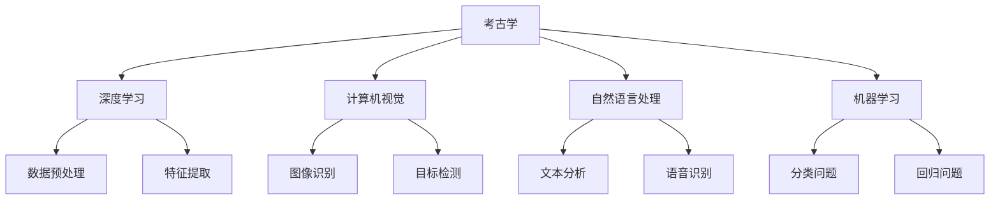

                 

### 第一部分：问题背景与核心概念

考古学作为一门研究人类历史文化的学科，一直以来都依赖于对文物的挖掘、保护、分析与解释。然而，随着考古学领域的不断扩展和复杂性的增加，传统的考古方法面临着诸多挑战。考古学需要处理的大量数据，不仅包括考古现场的图像、文字、声音等多媒体信息，还涉及地下文物的三维形态和结构。如何高效地处理这些复杂、庞大的数据，成为了考古学研究和资源管理中的关键问题。

#### 第1章：AI在考古学中的潜在应用

##### 1.1 问题背景与考古学需求

考古学的主要任务包括文物的挖掘、保护、修复和展示，以及历史事件的再现和解释。然而，这些任务往往伴随着以下问题和挑战：

- **文物挖掘与保护**：在挖掘过程中，考古学家需要面对复杂的地质环境和地下条件，确保文物的完整性和安全性。同时，挖掘出来的文物需要经过精细的保护和修复，以便进行后续的研究和展示。
- **考古现场数据收集**：考古现场产生的数据通常包括图像、声音、文字等多种形式，这些数据需要实时收集、处理和存储，以便后续的分析和研究。
- **考古资源管理与利用**：随着考古活动的不断深入，积累的数据和文物数量急剧增加，如何有效地管理和利用这些资源，成为了考古机构面临的一个严峻挑战。

##### 1.2 AI技术的优势

人工智能技术在处理这些考古学问题方面具有显著优势：

- **高效的数据处理与分析**：AI技术能够快速处理和分析大量数据，从而帮助考古学家更准确地识别和分析文物。
- **3D重建与可视化**：利用AI技术，可以实现对考古遗址的3D重建和可视化，从而提供更加直观和生动的考古场景。
- **预测模型与趋势分析**：AI技术可以根据历史数据和考古学规律，建立预测模型，预测未来考古发现的可能性，从而优化考古资源的配置和利用。

##### 1.3 AI核心概念与联系

AI技术的核心包括深度学习、计算机视觉、自然语言处理和机器学习等。以下是对这些核心概念的简要介绍及其在考古学中的应用：

###### 概念

- **深度学习**：深度学习是一种基于多层神经网络的人工智能方法，能够自动从数据中学习特征，适用于图像识别、语音识别等领域。
- **计算机视觉**：计算机视觉是一种使计算机能够像人一样理解和处理图像的技术，适用于考古现场的图像分析和文物识别。
- **自然语言处理**：自然语言处理是一种使计算机能够理解、生成和处理人类语言的技术，适用于考古文献的翻译和分析。
- **机器学习**：机器学习是一种从数据中学习规律，进行预测或决策的技术，适用于考古数据的分析、预测和趋势分析。

###### 概念属性特征对比表格

| 概念 | 特点 |
| --- | --- |
| 深度学习 | 基于多层神经网络，自动从数据中学习特征 |
| 计算机视觉 | 使计算机能够像人一样理解和处理图像 |
| 自然语言处理 | 使计算机能够理解、生成和处理人类语言 |
| 机器学习 | 从数据中学习规律，进行预测或决策 |

###### ER实体关系图架构

##### 1.3.1 深度学习

深度学习通过构建多层神经网络模型，模拟人脑的信息处理过程。它主要包括以下几个关键步骤：

- **数据预处理**：对数据进行清洗、归一化和特征提取，以便模型能够有效学习。
- **模型训练**：通过大量数据进行训练，使模型能够从数据中学习特征。
- **模型评估与优化**：通过测试集评估模型性能，并使用优化算法调整模型参数。

在考古学中，深度学习可以用于图像识别、语音识别和文本分析等领域。例如，通过卷积神经网络（CNN），可以实现对考古遗迹图像的自动分类和识别；通过循环神经网络（RNN），可以实现对考古文献的情感分析和关键词提取。

##### 1.3.2 计算机视觉

计算机视觉通过图像处理和机器学习算法，使计算机能够理解和分析图像。它主要包括以下几个关键步骤：

- **图像预处理**：对图像进行滤波、增强和分割等处理，以提高图像质量。
- **图像特征提取**：通过特征提取算法，从图像中提取具有区分性的特征。
- **目标检测与识别**：利用深度学习模型，对图像中的目标进行检测和识别。

在考古学中，计算机视觉可以用于考古现场图像的识别和3D重建。例如，通过目标检测算法，可以识别出考古现场中的文物和遗迹；通过多视角图像重建，可以实现对考古遗址的三维重建。

##### 1.3.3 自然语言处理

自然语言处理通过文本处理和机器学习算法，使计算机能够理解和生成人类语言。它主要包括以下几个关键步骤：

- **文本预处理**：对文本进行分词、去停用词和词性标注等处理，以提高文本质量。
- **文本特征提取**：通过词嵌入、TF-IDF等方法，从文本中提取具有区分性的特征。
- **文本分析**：利用深度学习模型，对文本进行情感分析、关键词提取和实体识别等处理。

在考古学中，自然语言处理可以用于考古文献的翻译和分析。例如，通过机器翻译，可以将考古文献翻译成现代语言；通过情感分析，可以分析考古文献的情感倾向和观点。

##### 1.3.4 机器学习

机器学习通过构建模型，从数据中学习规律，进行预测或决策。它主要包括以下几个关键步骤：

- **数据收集与预处理**：收集相关数据，并进行清洗、归一化和特征提取等处理。
- **模型选择与训练**：选择合适的模型，并通过训练数据训练模型。
- **模型评估与优化**：通过测试集评估模型性能，并使用优化算法调整模型参数。

在考古学中，机器学习可以用于考古数据的分析和预测。例如，通过分类模型，可以预测考古遗址中的文物类型；通过回归模型，可以预测考古发现的概率。

##### 1.3.5 深度学习在考古中的应用

深度学习在考古学中的应用非常广泛，主要包括以下几个方面：

- **考古遗迹识别与分类**：通过卷积神经网络，可以对考古遗迹图像进行自动识别和分类，从而提高考古现场图像分析的效率。
- **考古文献分析**：通过循环神经网络，可以对考古文献进行情感分析和关键词提取，从而更好地理解考古文献的内容。
- **考古数据预测与决策**：通过构建机器学习模型，可以对考古数据进行预测和分析，从而优化考古资源的配置和利用。

##### 1.3.6 计算机视觉在考古中的应用

计算机视觉在考古学中的应用也非常广泛，主要包括以下几个方面：

- **考古现场图像识别**：通过目标检测算法，可以识别考古现场中的文物和遗迹，从而提高考古现场图像分析的效率。
- **考古文物3D重建**：通过多视角图像重建，可以实现对考古遗址的三维重建，从而提供更加直观和生动的考古场景。
- **考古文物修复**：通过计算机视觉技术，可以实现对受损文物的修复，从而保护文物的历史价值。

##### 1.3.7 自然语言处理在考古中的应用

自然语言处理在考古学中的应用主要包括以下几个方面：

- **考古文献翻译**：通过机器翻译，可以将考古文献翻译成现代语言，从而方便考古学家对文献进行研究和分析。
- **考古文献分析**：通过情感分析和关键词提取，可以更好地理解考古文献的内容和观点，从而为考古研究提供更深入的分析。
- **考古知识图谱构建**：通过实体识别和关系抽取，可以构建考古知识图谱，从而为考古研究提供更加结构化和系统化的数据支持。

##### 1.3.8 机器学习在考古中的应用

机器学习在考古学中的应用主要包括以下几个方面：

- **考古数据预测**：通过构建预测模型，可以预测考古发现的概率和类型，从而优化考古资源的配置和利用。
- **考古资源管理**：通过分类和聚类模型，可以对考古资源进行分类和管理，从而提高考古资源的利用效率。
- **考古决策支持**：通过构建决策支持系统，可以提供考古决策的辅助，从而提高考古研究的效率和准确性。

##### 1.4 本章小结

本章主要介绍了AI技术在考古学中的应用，包括深度学习、计算机视觉、自然语言处理和机器学习等核心概念及其在考古学中的应用。通过这些技术，考古学家可以更高效地处理和分析考古数据，从而推动考古学的发展。未来，随着AI技术的进一步发展，AI在考古学中的应用将更加广泛和深入，为考古研究带来更多的突破。

## 目录大纲：AI在考古学中的应用：重现历史的新方法

### 第一部分：问题背景与核心概念

#### 第1章：AI在考古学中的潜在应用

##### 1.1 问题背景与考古学需求
- **考古学面临的问题与挑战**
  - 文物挖掘与保护
  - 考古现场数据收集
  - 考古资源管理与利用
- **AI技术的优势**
  - 高效的数据处理与分析
  - 3D重建与可视化
  - 预测模型与趋势分析
- **核心概念**
  - 深度学习
  - 计算机视觉
  - 自然语言处理
  - 机器学习
- **概念属性特征对比表格**

| 概念 | 特点 |
| --- | --- |
| 深度学习 | 基于多层神经网络，自动从数据中学习特征 |
| 计算机视觉 | 使计算机能够像人一样理解和处理图像 |
| 自然语言处理 | 使计算机能够理解、生成和处理人类语言 |
| 机器学习 | 从数据中学习规律，进行预测或决策 |

- **ER实体关系图架构**

##### 1.2 AI技术在考古学中的应用
- **深度学习在考古中的应用**
  - **考古遗迹识别与分类**
  - **考古文献分析**
  - **考古数据预测与决策**
- **计算机视觉在考古中的应用**
  - **考古现场图像识别**
  - **考古文物3D重建**
  - **考古文物修复**
- **自然语言处理在考古中的应用**
  - **考古文献翻译**
  - **考古文献分析**
  - **考古知识图谱构建**
- **机器学习在考古中的应用**
  - **考古数据预测**
  - **考古资源管理**
  - **考古决策支持**

### 第二部分：AI技术原理与实现

#### 第2章：深度学习在考古中的应用

##### 2.1 深度学习基本原理
- **神经网络**
  - **前向传播与反向传播**
  - **激活函数与损失函数**
- **深度学习模型**
  - **卷积神经网络（CNN）**
  - **循环神经网络（RNN）**
  - **生成对抗网络（GAN）**

##### 2.2 深度学习实现与流程
- **数据预处理**
  - **数据清洗与归一化**
  - **特征提取与降维**
- **模型训练与优化**
  - **网络架构选择**
  - **学习率调整与优化算法**
- **深度学习案例**
  - **考古图像识别**
    - **利用CNN进行考古遗迹图像识别**
    - **实现流程与结果分析**
  - **考古文献分析**
    - **利用RNN进行考古文献情感分析**
    - **实现流程与结果分析**

##### 2.3 本章小结

### 第三部分：计算机视觉在考古中的应用

#### 第3章：计算机视觉基础与考古应用

##### 3.1 计算机视觉基本原理
- **图像处理**
  - **颜色空间转换**
  - **边缘检测**
  - **形态学操作**
- **目标检测**
  - **区域提议**
  - **目标分类**
  - **位置回归**

##### 3.2 计算机视觉在考古中的实现
- **考古现场图像识别**
  - **利用图像处理技术提取考古遗迹特征**
  - **利用目标检测模型识别考古遗迹**
- **考古文物3D重建**
  - **利用多视角图像进行3D重建**
  - **利用深度学习模型进行纹理映射**
- **考古文物修复**
  - **利用计算机视觉技术对受损文物进行修复**

##### 3.3 计算机视觉案例
- **考古现场图像分析**
  - **利用深度学习模型识别考古现场中的文物**
  - **利用3D重建技术重现考古现场**
- **考古文物修复**
  - **利用计算机视觉技术对受损文物进行修复**

##### 3.4 本章小结

### 第四部分：AI在考古学的未来展望

#### 第4章：AI在考古学的未来展望

##### 4.1 当前研究的不足与挑战
- **技术局限**
  - 数据质量与多样性
  - 模型解释性与可靠性
  - 跨领域融合与协同
- **伦理与隐私**
  - 数据隐私保护
  - 人工智能伦理规范
- **可持续发展**
  - 绿色计算与能耗优化
  - 可持续的人工智能发展路径

##### 4.2 未来发展趋势与解决方案
- **技术创新**
  - 深度学习算法的优化与提升
  - 计算机视觉与自然语言处理的融合
- **应用拓展**
  - 虚拟现实与增强现实在考古中的应用
  - 大数据和区块链技术在考古中的应用
- **国际合作与交流**
  - 跨国考古项目的数据共享与协同研究
  - 人工智能技术在考古教育与研究中的普及

##### 4.3 本章小结

### 第五部分：实际案例与最佳实践

#### 第5章：AI在考古学中的实际应用案例与最佳实践

##### 5.1 案例介绍
- **项目背景**
  - **埃及古墓发掘**
  - **古希腊遗迹重建**
  - **中国夏商周考古研究**

##### 5.2 系统功能设计
- **功能模块**
  - **数据采集与预处理**
  - **图像识别与3D重建**
  - **文献分析与知识图谱构建**
  - **预测模型与决策支持**

##### 5.3 系统架构设计
- **系统架构**
  - **前端用户界面**
  - **后端数据处理与存储**
  - **数据采集与传输**
  - **算法模型训练与优化**

##### 5.4 系统接口设计
- **接口规范**
  - **数据接口**
  - **服务接口**
  - **API接口**

##### 5.5 系统交互
- **交互流程**
  - **用户操作流程**
  - **数据流与处理流程**
  - **算法模型训练与优化流程**

##### 5.6 代码实现
- **环境安装**
  - **硬件环境**
  - **软件环境**
  - **安装步骤**

- **核心实现**
  - **数据预处理**
  - **深度学习模型训练**
  - **计算机视觉算法实现**
  - **自然语言处理模型应用**

##### 5.7 代码应用解读与分析
- **代码解读**
  - **关键代码段解释**
  - **算法原理与实现**

##### 5.8 实际案例分析与详细讲解
- **案例背景**
  - **项目目标**
  - **技术难点**

- **案例分析**
  - **数据预处理与特征提取**
  - **模型训练与优化**
  - **结果分析与评估**

##### 5.9 项目小结

### 第六部分：总结与展望

#### 第6章：总结与展望

##### 6.1 文章总结
- **核心内容回顾**
  - **AI技术在考古学中的应用**
  - **深度学习、计算机视觉、自然语言处理和机器学习的基本原理与应用**
  - **实际案例与最佳实践**

##### 6.2 展望与未来工作
- **研究方向**
  - **深度学习算法的优化与提升**
  - **跨学科融合与协同研究**
  - **人工智能技术在考古教育中的应用**
- **挑战与机遇**
  - **技术发展带来的挑战**
  - **数据隐私与伦理问题**
  - **可持续发展与绿色发展**

## 文章标题：AI在考古学中的应用：重现历史的新方法

### 关键词：考古学、人工智能、深度学习、计算机视觉、自然语言处理

### 摘要：

本文详细探讨了人工智能在考古学中的应用，包括深度学习、计算机视觉、自然语言处理和机器学习等技术的原理及其在考古学中的实际应用。通过分析考古学面临的问题和挑战，本文介绍了AI技术在考古数据预处理、3D重建、文献分析、文物识别等方面的优势。文章通过实际案例展示了AI技术在考古学中的成功应用，并提出了未来研究和发展的方向。本文旨在为考古学家和人工智能研究者提供有价值的参考，推动人工智能技术在考古学领域的深入应用和发展。

