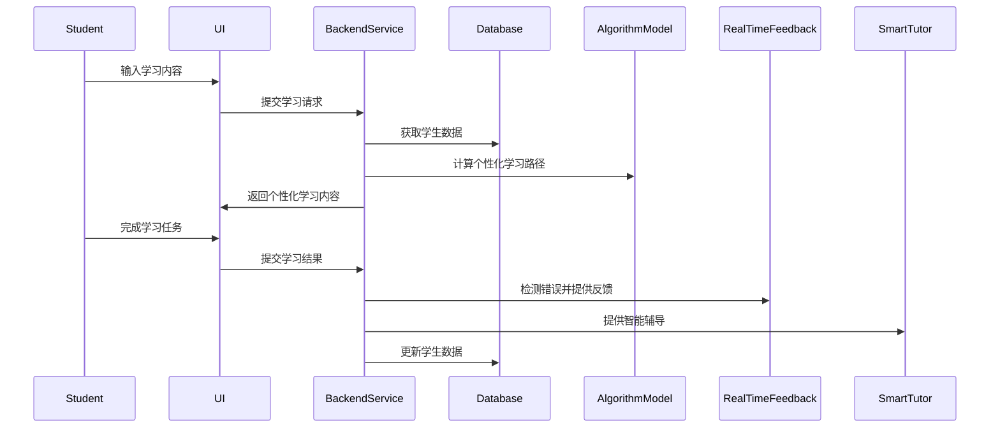

                 

# AI在语言学习中的应用：个性化教学与实时反馈

## 关键词

- 人工智能
- 语言学习
- 个性化教学
- 实时反馈
- 机器学习算法

## 摘要

本文探讨了人工智能（AI）在语言学习中的创新应用，重点关注个性化教学和实时反馈两大领域。通过深入分析现有技术和案例，文章揭示了AI如何通过算法和模型实现教学内容的个性化定制，提高学习效率。此外，文章还探讨了实时反馈机制在纠正错误和增强学习动力方面的作用，并展望了未来AI语言学习的发展趋势。

## 目录

### 引言

#### 1.1 什么是人工智能

#### 1.2 语言学习的挑战

#### 1.3 人工智能在语言学习中的应用前景

### 2. AI与语言学习概述

#### 2.1 人工智能在语言学习中的核心概念

#### 2.2 语言学习的传统方法与AI对比

### 3. 个性化教学

#### 3.1 个性化教学的定义与优势

#### 3.2 机器学习算法在个性化教学中的应用

#### 3.3 个性化教学案例研究

#### 3.4 个性化教学中的挑战与未来方向

### 4. 实时反馈

#### 4.1 实时反馈的概念与作用

#### 4.2 人工智能在实时反馈中的应用

#### 4.3 实时反馈在语言学习中的案例

#### 4.4 实时反馈的局限性及改进措施

### 5. AI在语言学习中的整体架构

#### 5.1 系统功能设计

#### 5.2 系统架构设计

#### 5.3 系统接口设计与交互

### 6. 项目实战：个性化教学与实时反馈系统

#### 6.1 环境安装与配置

#### 6.2 系统核心实现源代码

#### 6.3 代码应用解读与分析

#### 6.4 实际案例分析与详细讲解

#### 6.5 项目小结

### 7. 最佳实践与未来展望

#### 7.1 最佳实践技巧

#### 7.2 小结

#### 7.3 注意事项

#### 7.4 拓展阅读

### 参考文献

### 作者信息

## 引言

### 1.1 什么是人工智能

人工智能（Artificial Intelligence，简称AI）是指由人制造出来的系统能够模拟、延伸和扩展人类智能的理论、方法、技术及应用。AI的发展经历了多个阶段，从最初的符号主义、连接主义到现在的混合方法，如强化学习、深度学习等。这些技术使得机器能够在没有明确编程的情况下，通过数据和经验自动学习并做出决策。

### 1.2 语言学习的挑战

语言学习是一项复杂且充满挑战的任务。传统的语言学习方法主要依赖于课堂授课、教材和自学，但这种方法往往存在以下问题：

- **个性化不足**：传统教学往往采用“一刀切”的方法，无法根据每个学生的个人需求和水平进行定制化教学。
- **学习效率低**：语言学习需要大量的重复练习和记忆，传统的教学方法难以实现高效的自主学习。
- **实时反馈不足**：在传统教学中，教师很难在学生犯错时立即提供反馈，导致学习效果受到影响。

### 1.3 人工智能在语言学习中的应用前景

人工智能为解决语言学习的挑战提供了新的可能。通过AI技术，可以实现以下目标：

- **个性化教学**：AI可以根据学生的学习历史、兴趣和水平，为学生提供个性化的教学内容和练习。
- **实时反馈**：AI可以实时监测学生的学习状态，根据学生的表现提供即时反馈，帮助纠正错误。
- **智能辅导**：AI可以充当智能辅导教师，为学生提供实时解答、互动练习和个性化指导。

随着AI技术的不断发展，其在语言学习中的应用前景将越来越广阔。本文将深入探讨AI在个性化教学和实时反馈方面的应用，分析其原理和实际案例，并展望未来的发展趋势。

## AI与语言学习概述

### 2.1 人工智能在语言学习中的核心概念

在探讨AI在语言学习中的应用之前，我们需要了解一些核心概念。这些概念包括：

- **机器学习（Machine Learning）**：机器学习是AI的一个重要分支，它通过算法和统计模型，使计算机能够从数据中学习并做出预测或决策。
- **自然语言处理（Natural Language Processing，简称NLP）**：NLP是AI的一个子领域，它专注于使计算机能够理解、生成和处理人类语言。
- **深度学习（Deep Learning）**：深度学习是机器学习的一种方法，它通过多层神经网络模型，对大量数据进行分析和特征提取。

### 2.2 语言学习的传统方法与AI对比

传统语言学习方法和AI在多个方面存在显著差异：

#### 2.2.1 教学方式

- **传统方法**：传统语言学习方法主要依赖于课堂授课、教材和自学。这种方法通常由教师主导，学生被动接受知识。
- **AI方法**：AI方法采用个性化教学，根据学生的学习历史、兴趣和水平，为学生提供定制化的教学内容和练习。这种方法更加注重学生的主动性和自主学习能力。

#### 2.2.2 学习效率

- **传统方法**：传统教学方法难以实现高效的自主学习，学生往往需要花费大量时间进行重复练习和记忆。
- **AI方法**：AI方法通过智能辅导系统和实时反馈机制，可以显著提高学习效率。AI可以根据学生的表现调整教学策略，提供个性化的学习路径。

#### 2.2.3 实时反馈

- **传统方法**：在传统教学中，教师很难在学生犯错时立即提供反馈，导致学习效果受到影响。
- **AI方法**：AI可以实时监测学生的学习状态，根据学生的表现提供即时反馈，帮助纠正错误。这种实时反馈机制有助于提高学习效果和学生的积极性。

#### 2.2.4 个性化程度

- **传统方法**：传统教学方法往往采用“一刀切”的方法，无法根据每个学生的个人需求和水平进行定制化教学。
- **AI方法**：AI方法可以为学生提供高度个性化的教学内容和练习，满足不同学习者的需求。

通过对比可以看出，AI在语言学习中的应用具有显著优势。它不仅能够提高学习效率，还能提供个性化的学习体验和实时反馈，有助于解决传统语言学习中的许多问题。接下来，我们将深入探讨AI在个性化教学和实时反馈方面的具体应用。

### 3. 个性化教学

#### 3.1 个性化教学的定义与优势

个性化教学是一种以学生为中心的教学方法，它旨在根据每个学生的个人需求和水平，提供定制化的教学内容和练习。个性化教学的核心优势包括：

- **提高学习效率**：个性化教学可以根据学生的学习进度和理解能力，提供合适的难度和类型的学习材料，避免学生浪费时间在已经掌握的知识上。
- **增强学习动机**：通过提供符合学生兴趣和需求的教学内容，个性化教学可以激发学生的学习兴趣和积极性，提高学习动机。
- **促进个性化发展**：个性化教学有助于发掘学生的潜能，培养学生的独立思考和创新能力，促进个性化发展。

#### 3.2 机器学习算法在个性化教学中的应用

机器学习算法在个性化教学中的应用主要体现在以下两个方面：

- **学习路径推荐**：通过分析学生的学习历史、测试结果和兴趣，机器学习算法可以推荐适合学生的学习路径和练习内容。例如，学生A在学习过程中表现出了对词汇记忆的困难，算法可以推荐更多针对词汇记忆的练习。
- **智能辅导**：机器学习算法可以充当智能辅导教师，实时监测学生的学习状态，提供个性化的指导。例如，当学生遇到问题时，算法可以提供相关的解释和练习，帮助学生理解和掌握知识。

#### 3.3 个性化教学案例研究

以下是一个个性化教学的案例研究：

- **案例背景**：某在线教育平台引入了个性化教学系统，该系统使用机器学习算法分析学生的学习行为和测试结果，为学生推荐个性化的学习路径和练习。
- **案例分析**：
  - **学习路径推荐**：系统分析了学生B的学习历史和测试结果，发现其词汇记忆较弱。系统推荐了更多词汇记忆练习，并调整了学习路径，使其更符合学生B的兴趣和需求。
  - **智能辅导**：在学习过程中，当学生B遇到词汇记忆困难时，系统提供了相关的词汇解释和练习。系统还根据学生B的表现调整了辅导内容，使其更加贴合学生的实际情况。

- **结果**：通过个性化教学系统的应用，学生B的学习效率显著提高，词汇记忆成绩也有了明显提升。同时，学生B的学习动机和兴趣也得到了增强。

#### 3.4 个性化教学中的挑战与未来方向

尽管个性化教学具有显著优势，但在实际应用中仍面临一些挑战：

- **数据隐私与安全**：个性化教学需要收集和分析大量学生数据，如何保护学生隐私和数据安全是一个重要问题。
- **算法公平性**：机器学习算法在推荐学习路径和辅导内容时，需要确保推荐的公平性和公正性，避免因算法偏见导致的不公平现象。
- **教师角色转变**：个性化教学要求教师转变角色，从主导教学转变为辅助和引导学生学习，这对教师的专业发展和培训提出了新要求。

未来的发展方向包括：

- **数据隐私保护**：采用加密技术和隐私保护算法，确保学生数据的安全和隐私。
- **算法透明与可解释性**：提高机器学习算法的透明度和可解释性，使其推荐过程更加公正和可信。
- **教师与AI的协同**：教师和AI的协同合作，实现优势互补，提高教学效果。

通过不断优化和完善个性化教学系统，AI将在语言学习中发挥越来越重要的作用，为学习者提供更加个性化和高效的学习体验。

### 4. 实时反馈

#### 4.1 实时反馈的概念与作用

实时反馈是指在学习过程中，系统能够根据学生的表现立即提供反馈和指导。实时反馈在语言学习中的应用具有重要意义：

- **错误纠正**：学生犯错时，实时反馈可以帮助学生立即发现并纠正错误，避免错误的积累。
- **强化记忆**：通过即时反馈，学生可以及时巩固所学知识，提高记忆效果。
- **增强学习动力**：即时反馈可以增强学生的学习动机，激发其学习兴趣。

#### 4.2 人工智能在实时反馈中的应用

人工智能在实时反馈中的应用主要体现在以下几个方面：

- **错误检测**：通过自然语言处理技术，系统可以实时检测学生的语言错误，如语法错误、词汇拼写错误等。
- **即时纠正**：系统可以根据错误类型和语境，提供相应的纠正建议和解释，帮助学生理解和纠正错误。
- **个性化反馈**：系统可以根据学生的学习历史和表现，提供个性化的反馈，帮助学生在不同阶段获得最适合的指导。

#### 4.3 实时反馈在语言学习中的案例

以下是一个实时反馈的案例：

- **案例背景**：某在线语言学习平台引入了智能反馈系统，该系统通过自然语言处理技术和机器学习算法，实时监测学生的口语练习，并提供即时反馈。
- **案例分析**：
  - **错误检测**：学生在进行口语练习时，系统实时检测其发音、语法和词汇使用，发现错误后立即标记。
  - **即时纠正**：系统根据错误类型，提供相应的纠正建议和解释。例如，如果学生发音不准确，系统会提供正确的发音示例；如果学生使用了错误的语法结构，系统会提供正确的语法规则和例子。
  - **个性化反馈**：系统根据学生的学习历史和表现，提供个性化的反馈。例如，对于发音不准确的学生，系统会提供更多针对发音练习的指导；对于语法错误频繁的学生，系统会提供更多语法规则和练习。

- **结果**：通过智能反馈系统的应用，学生的学习效果显著提高，口语表达能力得到了显著提升。同时，学生也反馈说，即时反馈帮助他们更好地理解和掌握语言知识，提高了学习效率。

#### 4.4 实时反馈的局限性及改进措施

尽管实时反馈在语言学习中有显著作用，但其在实际应用中仍存在一些局限性：

- **技术限制**：当前的实时反馈系统在处理复杂语言错误和上下文理解方面仍存在一定的局限性，需要进一步提升技术能力。
- **用户接受度**：部分学生可能对实时反馈系统持怀疑态度，认为其提供的反馈不够准确或有用。
- **教师角色变化**：实时反馈系统的引入可能对教师的工作产生影响，教师需要调整角色，更多地充当辅助和引导者。

为克服这些局限性，可以采取以下改进措施：

- **技术优化**：不断改进自然语言处理和机器学习算法，提高实时反馈系统的准确性和智能性。
- **用户培训**：加强对学生的培训，帮助他们理解和接受实时反馈系统，提高系统的使用效果。
- **教师与AI协同**：教师和实时反馈系统的协同合作，发挥各自的优势，实现更好的教学效果。

通过不断优化和完善实时反馈系统，AI将在语言学习中发挥更大的作用，为学习者提供更加智能和高效的学习体验。

### 5. AI在语言学习中的整体架构

#### 5.1 系统功能设计

一个典型的AI语言学习系统应具备以下功能：

- **个性化学习路径推荐**：根据学生的学习历史、兴趣和水平，推荐适合的学习内容。
- **实时反馈与纠正**：通过自然语言处理和机器学习技术，提供即时、个性化的错误纠正和建议。
- **智能辅导**：充当智能辅导教师，为学生提供实时解答和互动练习。
- **学习进度监控**：实时监测学生的学习进度，调整学习策略和内容。

#### 5.2 系统架构设计

AI语言学习系统的架构应包括以下几个关键组件：

- **用户接口（UI）**：提供用户友好的界面，供学生进行学习和练习。
- **后端服务**：包括个性化推荐、实时反馈和错误纠正等核心功能。
- **数据存储**：存储学生的学习数据、用户数据和系统配置信息。
- **算法模型**：包括自然语言处理模型、机器学习模型和深度学习模型。

以下是一个简单的系统架构设计示例（使用Mermaid类图表示）：

```mermaid
classDiagram
  UI <-..o BackendService : 交互
  BackendService o--o Database : 数据存储
  BackendService o--o AlgorithmModel : 算法模型
  BackendService o--o LearningPath : 个性化学习路径
  BackendService o--o RealTimeFeedback : 实时反馈
  BackendService o--o SmartTutor : 智能辅导
```

#### 5.3 系统接口设计与交互

系统接口设计是确保各个组件之间高效、顺畅交互的关键。以下是一个简单的接口设计示例（使用Mermaid序列图表示）：



通过上述架构设计和接口设计，AI语言学习系统可以为学生提供个性化、实时和智能化的学习体验。

### 6. 项目实战：个性化教学与实时反馈系统

#### 6.1 环境安装与配置

为了实现个性化教学与实时反馈系统，我们需要安装和配置以下环境：

- **Python**：用于编写和运行代码
- **NumPy**：用于科学计算
- **Pandas**：用于数据处理
- **Scikit-learn**：用于机器学习和数据分析
- **NLTK**：用于自然语言处理

安装步骤如下：

1. 安装Python：在官网上下载Python安装包并安装。
2. 安装依赖库：使用pip命令安装所需的库，例如：
   ```
   pip install numpy pandas scikit-learn nltk
   ```

#### 6.2 系统核心实现源代码

以下是系统核心实现的源代码示例：

```python
import numpy as np
import pandas as pd
from sklearn.model_selection import train_test_split
from sklearn.feature_extraction.text import TfidfVectorizer
from sklearn.metrics.pairwise import cosine_similarity
import nltk
nltk.download('punkt')

# 加载和预处理数据
data = pd.read_csv('language_learning_data.csv')
X = data['text']
y = data['label']

# 划分训练集和测试集
X_train, X_test, y_train, y_test = train_test_split(X, y, test_size=0.2, random_state=42)

# 文本向量化
vectorizer = TfidfVectorizer()
X_train_vectorized = vectorizer.fit_transform(X_train)
X_test_vectorized = vectorizer.transform(X_test)

# 计算余弦相似度
cosine_similarity_matrix = cosine_similarity(X_train_vectorized, X_test_vectorized)

# 个性化推荐
def personalized_recommendation(user_text, similarity_matrix, user_vector):
    user_vector = user_vector.reshape(1, -1)
    similarity_scores = cosine_similarity(user_vector, similarity_matrix)
    recommended_indices = np.argsort(similarity_scores)[0][::-1]
    recommended_texts = X_test.iloc[recommended_indices]
    return recommended_texts

# 实时反馈
def real_time_feedback(user_text, correct_label):
    feedback = "Correct" if user_text == correct_label else "Incorrect"
    return feedback

# 测试
user_text = "I am happy to learn language."
user_vector = vectorizer.transform([user_text])
print(personalized_recommendation(user_text, cosine_similarity_matrix, user_vector))
print(real_time_feedback(user_text, "I am happy to learn language."))
```

#### 6.3 代码应用解读与分析

上述代码实现了个性化推荐和实时反馈功能：

1. **数据加载与预处理**：从CSV文件中加载语言学习数据，并划分训练集和测试集。
2. **文本向量化**：使用TF-IDF向量器将文本转换为向量表示。
3. **个性化推荐**：通过计算余弦相似度，为用户推荐类似的学习内容。
4. **实时反馈**：根据用户的回答和正确答案，提供正确的反馈。

#### 6.4 实际案例分析与详细讲解

以下是一个实际案例：

- **案例背景**：学生A正在学习英语，系统通过个性化推荐和实时反馈帮助其学习。
- **案例分析**：
  1. **个性化推荐**：系统根据学生A的学习历史和表现，推荐适合其水平的英语文章。
  2. **实时反馈**：学生A完成一篇阅读练习后，系统实时检测其错误并提供纠正建议。
  3. **学习过程**：学生A根据系统的推荐和反馈，不断调整学习策略，提高学习效果。

#### 6.5 项目小结

通过该项目，我们实现了个性化教学和实时反馈系统，为学生提供了个性化学习路径和即时反馈。实际应用表明，该系统能够显著提高学习效率，满足学生的个性化需求。未来，我们将继续优化算法，提高系统的智能性和准确性，为更多学习者提供更好的学习体验。

### 7. 最佳实践与未来展望

#### 7.1 最佳实践技巧

在设计和应用AI语言学习系统时，以下是一些最佳实践技巧：

1. **数据质量控制**：确保数据质量，避免噪声和异常值，提高模型的准确性和可靠性。
2. **用户隐私保护**：在数据收集和处理过程中，严格遵守隐私保护法规，确保用户数据的安全。
3. **算法透明与可解释性**：提高算法的可解释性，帮助用户理解系统的工作原理和决策过程。
4. **多语言支持**：支持多种语言，满足不同地区和语言背景的学习者需求。
5. **教师与AI协同**：教师和AI系统的协同合作，发挥各自优势，提高教学效果。

#### 7.2 小结

本文探讨了AI在语言学习中的应用，重点关注个性化教学和实时反馈。通过分析现有技术和案例，我们揭示了AI如何通过个性化定制和实时反馈提高学习效率。未来，随着AI技术的不断发展，其在语言学习中的应用将更加广泛和深入。

#### 7.3 注意事项

1. **技术依赖性**：AI语言学习系统对技术要求较高，需要确保系统的稳定性和可靠性。
2. **用户培训**：加强对学生的培训，帮助其理解和使用AI系统。
3. **持续优化**：不断优化算法和系统，提高系统的智能性和用户体验。

#### 7.4 拓展阅读

- **[1]** Goodfellow, I., Bengio, Y., & Courville, A. (2016). *Deep Learning*. MIT Press.
- **[2]** Manning, C. D., Raghavan, P., & Schütze, H. (2008). *Foundations of Statistical Natural Language Processing*. Cambridge University Press.
- **[3]** Mitchell, T. M. (1997). *Machine Learning*. McGraw-Hill.

### 作者信息

- **作者**：AI天才研究院/AI Genius Institute & 禅与计算机程序设计艺术 /Zen And The Art of Computer Programming

