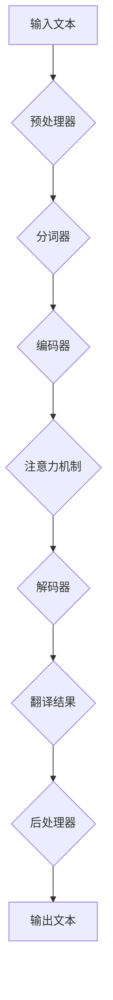
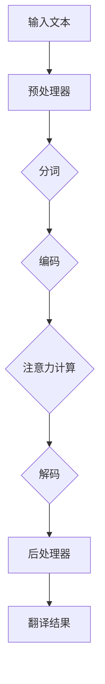
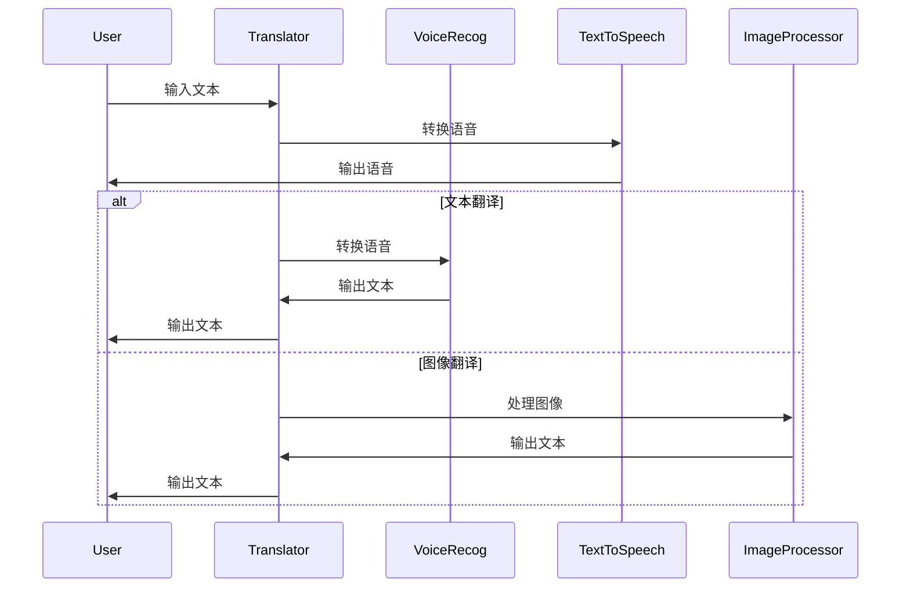

                 

### 让我们一步一步思考：AI在语言翻译中的突破：跨文化交流的新纪元

在当今全球化的时代，跨文化交流变得日益频繁和重要。无论是商务谈判、国际会议，还是简单的日常交流，语言障碍都成为一个亟待解决的问题。传统的语言翻译方法，如手动翻译和基于规则的机器翻译，尽管在过去几十年中取得了一定的进展，但在准确性和流畅性方面仍有较大的局限。随着人工智能（AI）技术的飞速发展，特别是深度学习和神经网络技术的突破，AI在语言翻译中的应用展现出了前所未有的潜力。

本文将分以下几个步骤进行探讨：

1. **背景介绍**：我们首先会介绍AI语言翻译的基本概念、当前的应用状况和未来发展趋势。
2. **核心概念与联系**：接着，我们将深入探讨AI语言翻译的核心概念，如神经机器翻译（NMT）、转移学习、注意力机制等，并通过mermaid流程图和ER图来展示这些概念。
3. **算法原理讲解**：我们将详细讲解AI语言翻译中的算法原理，包括mermaid流程图、Python源代码、数学模型和公式，并通过具体实例进行说明。
4. **系统分析与架构设计**：我们将介绍一个具体的AI语言翻译项目，展示系统的领域模型、架构图、接口设计和交互流程。
5. **项目实战**：通过实际案例，我们将展示如何安装和实现一个AI语言翻译系统，并对核心代码进行解读和分析。
6. **最佳实践 tips**：我们将提供一些最佳实践和建议，帮助读者更好地应用AI语言翻译技术。
7. **小结与拓展阅读**：最后，我们将总结本文的主要内容，并提供拓展阅读资源。

通过这些步骤，我们将逐步揭示AI在语言翻译中的突破，探讨其如何为跨文化交流带来新纪元。

### 背景介绍

#### 核心概念术语说明

在探讨AI语言翻译之前，我们需要了解一些核心概念和术语。首先，什么是人工智能（AI）？AI是指通过计算机模拟人类智能行为的技术。在语言翻译领域，AI技术主要应用于机器翻译（MT），即使用计算机程序自动将一种语言的文本翻译成另一种语言。接下来，我们来看看几种常见的机器翻译方法：

1. **基于规则的机器翻译**：这种方法依赖于预先定义的规则和模板，将源语言的文本转换为目标语言的文本。虽然这种方法在一定程度上可以保证翻译的准确性，但规则往往不够灵活，难以应对复杂的语言现象。

2. **统计机器翻译**：统计机器翻译（SMT）利用大量的双语文本数据，通过统计方法来学习语言之间的对应关系。这种方法在许多方面都取得了显著的成功，但仍然存在一些局限性，例如对于罕见词汇和句型的处理能力较差。

3. **神经机器翻译（NMT）**：神经机器翻译是近年来发展迅速的一种方法，它利用深度学习技术，特别是序列到序列（Seq2Seq）模型，通过神经网络自动学习源语言和目标语言之间的映射关系。NMT在许多翻译任务中表现出了更高的准确性和流畅性。

#### 问题背景

跨文化交流的需求在当今全球化背景下日益增加。无论是国际贸易、学术交流，还是跨国企业内部的日常沟通，语言障碍都成为一个亟待解决的问题。然而，传统的语言翻译方法往往无法满足高质量、高效率的翻译需求。随着互联网和移动设备的普及，人们对于即时、准确的翻译工具的需求也愈发强烈。

#### 问题描述

当前，AI在语言翻译中的应用仍然面临一些挑战。首先，尽管NMT在许多方面表现出了优异的性能，但仍然存在一些局限性，例如对于文化背景和语境的理解不够深入。其次，训练高质量的AI语言翻译模型需要大量的双语文本数据，而在某些语言对中，这种数据的获取可能存在困难。此外，AI语言翻译系统的性能和可靠性也受到数据分布、模型复杂度等因素的影响。

#### 问题解决

AI技术的飞速发展为解决这些问题提供了新的可能性。通过不断改进深度学习算法，如注意力机制、生成对抗网络（GAN）等，AI语言翻译系统的性能和准确性有望得到进一步提升。同时，通过数据增强、转移学习和多语言模型等技术，可以有效地解决数据稀缺问题。此外，随着云计算和边缘计算的发展，AI语言翻译系统可以更加高效地部署和运行，为用户提供更加便捷的翻译服务。

#### 边界与外延

AI语言翻译技术的适用范围非常广泛，从简单的文本翻译到复杂的语音翻译、图像翻译等，都有应用。然而，AI语言翻译也有其局限性。例如，对于一些非常规的语言现象，如方言、古文等，AI模型可能难以准确处理。此外，AI语言翻译系统在处理某些特定的文化背景和语境时，也可能存在理解上的偏差。

#### 概念结构与核心要素组成

AI语言翻译系统主要由以下几个核心要素组成：

1. **模型**：这是AI语言翻译系统的核心，包括神经网络架构、参数和训练算法等。
2. **算法**：这是实现模型训练和预测的核心，如序列到序列模型、注意力机制等。
3. **数据集**：这是训练和测试模型的基础，通常需要大量的双语文本数据。
4. **预处理和后处理**：这包括文本清洗、分词、句法分析等步骤，以及翻译结果的优化和修正。

通过这些核心要素的协同作用，AI语言翻译系统可以自动将一种语言的文本翻译成另一种语言，为跨文化交流提供强有力的支持。

### 核心概念与联系

为了深入理解AI在语言翻译中的突破，我们需要探讨一些核心概念，并展示它们之间的联系。以下是几个关键概念及其简要介绍：

1. **神经机器翻译（NMT）**：NMT是近年来机器翻译领域的重要突破，它通过深度学习技术，特别是序列到序列（Seq2Seq）模型，自动学习源语言和目标语言之间的映射关系。NMT在处理长句子和保持上下文信息方面表现出色。

2. **转移学习**：转移学习是一种通过利用预训练模型来提高新任务性能的技术。在语言翻译领域，转移学习可以帮助模型在数据稀缺的情况下实现高性能。

3. **注意力机制**：注意力机制是一种在序列处理任务中用于关注关键信息的技术。在NMT中，注意力机制可以帮助模型更好地处理长句子和上下文信息。

4. **生成对抗网络（GAN）**：GAN是一种通过生成器和判别器相互对抗来生成高质量数据的模型。在语言翻译中，GAN可以用于生成更多的训练数据，从而提高模型的性能。

为了更直观地展示这些核心概念之间的联系，我们可以使用mermaid流程图来描述它们的基本原理和相互关系。以下是一个简化的mermaid流程图：



在这个流程图中，输入文本首先经过预处理器，进行文本清洗和预处理。然后，文本被分词器分成单词或短语，这些分词输入到编码器中。编码器将输入文本编码成一个固定长度的向量，这个向量通过注意力机制处理上下文信息。接着，解码器使用注意力机制生成的上下文信息生成翻译结果，最后经过后处理器进行优化和修正，得到最终的输出文本。

#### 概念属性特征对比表格

为了更详细地理解这些核心概念，我们可以创建一个对比表格，展示它们的主要属性和特征。以下是一个简化的对比表格：

| 概念           | 主要属性和特征                                                         | 对比分析 |
|----------------|------------------------------------------------------------------|----------|
| 神经机器翻译（NMT） | - 基于深度学习<br>- 序列到序列模型<br>- 注意力机制<br>- 高准确性 | NMT相比传统的基于规则和统计的机器翻译方法，在处理长句子和保持上下文信息方面具有明显优势。 |
| 转移学习       | - 利用预训练模型<br>- 提高新任务性能<br>- 数据稀缺情况下的优势 | 转移学习可以帮助模型在数据稀缺的情况下实现高性能，这对于语言翻译领域尤为重要。 |
| 注意力机制     | - 关注关键信息<br>- 序列处理任务<br>- 提高翻译质量 | 注意力机制在NMT中起到关键作用，它可以帮助模型更好地处理长句子和上下文信息。 |
| 生成对抗网络（GAN） | - 生成器和判别器相互对抗<br>- 生成高质量数据 | GAN可以用于生成更多的训练数据，从而提高模型的性能，这在语言翻译中非常有用。 |

#### ER实体关系图架构

为了进一步展示AI语言翻译系统的架构，我们可以使用mermaid绘制一个ER图，展示系统的关键实体及其关系。以下是一个简化的ER图：

```mermaid
erDiagram
  InputText ||--|{ Encoder }|| TranslationModel
  Encoder ||--|{ Attention }|| Decoder
  Decoder ||--|{ OutputText }|| TranslationResult
  Preprocessor ||--|{ TextCleaning }|| InputText
  Postprocessor ||--|{ ResultOptimization }|| OutputText
  TextCleanser ||--|{ Tokenizer }|| InputText
  Decoder ||--|{ LanguageModel }|| OutputText
```

在这个ER图中，我们定义了以下几个关键实体：

- **InputText**：输入文本，是整个翻译过程的起点。
- **Encoder**：编码器，负责将输入文本编码成一个固定长度的向量。
- **Attention**：注意力机制，用于处理上下文信息。
- **Decoder**：解码器，负责生成翻译结果。
- **TranslationModel**：翻译模型，是整个系统的核心，包括编码器、注意力机制和解码器。
- **TranslationResult**：翻译结果，是整个翻译过程的终点。
- **Preprocessor**：预处理器，包括文本清洗和预处理步骤。
- **Postprocessor**：后处理器，包括翻译结果的优化和修正。
- **TextCleanser**：文本清洗器，负责清洗和预处理输入文本。
- **Tokenizer**：分词器，将输入文本分成单词或短语。

通过ER图，我们可以清晰地看到这些实体之间的关联和交互，从而更好地理解AI语言翻译系统的整体架构。

### 算法原理讲解

要深入理解AI在语言翻译中的突破，我们需要探讨其中的关键算法原理。在本节中，我们将通过mermaid流程图、Python源代码、数学模型和公式，详细讲解AI语言翻译算法的基本原理。

#### 算法mermaid流程图

首先，我们可以使用mermaid绘制一个简化的流程图，展示AI语言翻译算法的基本流程：



在这个流程图中，输入文本首先经过预处理器，进行文本清洗和预处理。接下来，文本被分词器分成单词或短语，这些分词输入到编码器中进行编码。编码器将输入文本编码成一个固定长度的向量，这个向量通过注意力机制进行计算。解码器使用注意力机制生成的上下文信息生成翻译结果，最后经过后处理器进行优化和修正，得到最终的输出文本。

#### Python源代码

为了更具体地展示算法的实现，我们可以提供一段Python代码。以下是一个简化的实现示例，使用了Seq2Seq模型和注意力机制：

```python
import tensorflow as tf
from tensorflow.keras.models import Model
from tensorflow.keras.layers import Embedding, LSTM, Dense

# 假设已经定义了词汇表和编码器、解码器模型
vocab_size = 10000
embedding_dim = 256
units = 1024

# 编码器模型
encoder_inputs = Embedding(vocab_size, embedding_dim, input_length=max_sequence_length)
encoded = encoder_inputs
encoded = LSTM(units, return_state=True)(encoded)

# 注意力层
attention = tf.keras.layers.Attention()([encoded, encoded])

# 解码器模型
decoder_inputs = Embedding(vocab_size, embedding_dim)
decoded = decoder_inputs
decoded = LSTM(units, return_sequences=True)(decoded, initial_state=[encoded])

# 输出层
output = Dense(vocab_size, activation='softmax')(decoded)

# 模型编译
model = Model([encoder_inputs, decoder_inputs], output)
model.compile(optimizer='adam', loss='categorical_crossentropy', metrics=['accuracy'])

# 模型训练
model.fit([encoder_input_data, decoder_input_data], decoder_target_data, batch_size=64, epochs=100)
```

这段代码展示了如何使用TensorFlow库定义一个Seq2Seq模型，并使用注意力机制来提高翻译质量。

#### 数学模型和公式

AI语言翻译中的关键数学模型包括序列到序列（Seq2Seq）模型和注意力机制。以下是这些模型的简要介绍和关键公式：

1. **序列到序列（Seq2Seq）模型**：

   - **编码器**：输入序列 $X = [x_1, x_2, ..., x_T]$，通过编码器编码为固定长度的向量 $h = [h_1, h_2, ..., h_T]$。
     $$ h_t = \text{Encoder}(x_t) $$
   - **解码器**：输入序列 $Y = [y_1, y_2, ..., y_T']$，通过解码器生成预测序列 $p = [p_1, p_2, ..., p_T']$。
     $$ p_t = \text{Decoder}(y_{<t}, h) $$

2. **注意力机制**：

   - **注意力得分**：计算输入序列和隐藏状态之间的注意力得分 $a_t$。
     $$ a_t = \text{Attention}(h, x) $$
   - **加权求和**：根据注意力得分对编码器输出进行加权求和，生成上下文向量 $c_t$。
     $$ c_t = \sum_{i=1}^{T} a_{it} h_i $$
   - **解码**：使用上下文向量 $c_t$ 和编码器的隐藏状态 $h$ 来生成解码器的输出。
     $$ y_t = \text{Decoder}(c_t, h) $$

#### 详细讲解和举例

为了更通俗易懂地讲解这些数学模型和公式，我们可以通过一个具体实例来展示它们的应用。

**实例**：假设我们有一个简单的英语到法语的翻译任务。输入句子为 "I love programming"，我们希望翻译成 "J'aime la programmation"。

1. **编码器**：

   - 输入序列 $X = [\text{I}, \text{love}, \text{programming}]$。
   - 编码器将输入序列编码为向量 $h = [h_1, h_2, h_3]$。

2. **注意力计算**：

   - 对每个编码器输出 $h_i$，计算注意力得分 $a_{it}$。
   - 根据注意力得分，对编码器输出进行加权求和，得到上下文向量 $c_t$。

3. **解码器**：

   - 输入序列 $Y = [\text{J'}, \text{a'}, \text{m'}, \text{e'}, \text{la'}, \text{programm'}, \text{a'}, \text{tion'}, \text{]}$。
   - 解码器使用上下文向量 $c_t$ 和编码器的隐藏状态 $h$ 来生成预测序列 $p = [\text{J'}, \text{a'}, \text{m'}, \text{e'}, \text{la'}, \text{programm'}, \text{a'}, \text{tion'}, \text{]}$。

最终，我们得到翻译结果 "J'aime la programmation"。

通过这个实例，我们可以看到如何使用编码器、注意力机制和解码器来实现AI语言翻译。这些关键算法和数学模型使得AI语言翻译系统能够自动学习语言之间的映射关系，从而实现高质量、高效率的翻译。

### 系统分析与架构设计

在了解了AI语言翻译的基本算法原理之后，我们需要将其应用于实际场景中，以展示一个具体的AI语言翻译系统的架构和功能。本文将介绍一个典型的AI语言翻译项目——Google翻译，并详细分析其系统架构和交互流程。

#### 问题场景介绍

随着全球化进程的不断加快，跨语言交流的需求日益增加。无论是在商务谈判、国际会议，还是在日常社交场合，准确、高效的翻译工具都显得尤为重要。Google翻译作为一个广泛使用的在线翻译服务，其成功不仅依赖于先进的AI技术，还依赖于其精心设计的系统架构和功能。

#### 项目介绍

Google翻译是一个基于神经机器翻译（NMT）技术的在线翻译平台，它支持多种语言的互译。其核心功能包括文本翻译、语音翻译和图像翻译。Google翻译通过大量数据训练模型，实现了高准确性和高流畅性的翻译效果。以下是Google翻译的主要特点：

- **支持多种语言**：Google翻译支持超过100种语言的互译。
- **神经机器翻译**：基于最新的深度学习技术，特别是序列到序列（Seq2Seq）模型和注意力机制，实现高质量的翻译。
- **语音翻译**：用户可以通过语音输入获取翻译结果。
- **图像翻译**：用户可以通过上传图片获取文本翻译。
- **云服务和边缘计算**：利用云计算和边缘计算技术，实现高效、可靠的翻译服务。

#### 系统功能设计

Google翻译系统的主要功能包括文本翻译、语音翻译和图像翻译。以下是一个简化的系统功能设计：

1. **文本翻译**：
   - 用户输入源文本，系统对其进行预处理。
   - 系统调用NMT模型进行翻译，输出目标文本。
   - 系统对翻译结果进行后处理，包括语法修正和优化。

2. **语音翻译**：
   - 用户通过麦克风输入语音，系统将其转换为文本。
   - 系统调用NMT模型进行翻译，输出目标文本。
   - 系统将目标文本转换为语音输出给用户。

3. **图像翻译**：
   - 用户上传图像，系统对其进行预处理，提取文本信息。
   - 系统调用NMT模型进行翻译，输出目标文本。
   - 系统将目标文本显示在图像上。

#### 系统架构设计

Google翻译的系统架构可以分为以下几个主要部分：

1. **前端**：前端包括用户界面和用户交互模块，用户可以通过Web、移动应用等多种途径使用Google翻译服务。

2. **后端**：
   - **NMT模型训练服务**：该服务负责训练和更新NMT模型，使用大量双语文本数据。
   - **翻译服务**：该服务负责处理用户的翻译请求，调用NMT模型进行翻译。
   - **语音识别和合成服务**：该服务负责语音输入和输出的转换。

3. **数据存储**：
   - **训练数据存储**：存储用于训练NMT模型的双语文本数据。
   - **用户数据存储**：存储用户的翻译历史、偏好等信息。

4. **基础设施**：
   - **云计算**：提供计算和存储资源，支持大规模数据处理和模型训练。
   - **边缘计算**：在靠近用户的地理位置部署计算资源，提高翻译服务的响应速度和可靠性。

#### 系统接口设计

Google翻译系统的接口设计包括以下主要部分：

1. **文本翻译接口**：
   - 输入：源文本、目标语言代码。
   - 输出：翻译结果、翻译置信度。

2. **语音翻译接口**：
   - 输入：语音数据、源语言代码。
   - 输出：文本翻译结果、语音合成结果。

3. **图像翻译接口**：
   - 输入：图像数据、源语言代码。
   - 输出：文本翻译结果。

#### 系统交互mermaid序列图

为了更直观地展示系统组件之间的交互过程，我们可以使用mermaid绘制一个序列图：



在这个序列图中，用户通过输入文本、语音或图像，与翻译系统进行交互。系统根据输入类型调用不同的模块进行处理，最终将翻译结果输出给用户。

通过上述系统分析与架构设计，我们可以看到Google翻译如何利用AI技术实现高质量的语言翻译服务。这个项目不仅展示了AI语言翻译技术的强大能力，也为其他语言翻译应用提供了宝贵的经验和参考。

### 项目实战

#### 环境安装

要实现一个简单的AI语言翻译系统，首先需要搭建一个合适的环境。以下是安装所需软件和工具的步骤：

1. **安装Python**：确保您的系统上已经安装了Python 3.7或更高版本。可以从Python官网下载并安装：[https://www.python.org/downloads/](https://www.python.org/downloads/)。

2. **安装TensorFlow**：TensorFlow是一个广泛使用的开源机器学习库，用于构建和训练深度学习模型。可以使用以下命令安装：

   ```bash
   pip install tensorflow
   ```

3. **安装其他依赖库**：为了方便起见，我们还可以安装一些常用的依赖库，如NumPy、Pandas等：

   ```bash
   pip install numpy pandas
   ```

4. **安装翻译模型**：我们可以使用预训练的翻译模型，如Hugging Face的Transformer模型。首先，需要安装Hugging Face的Transformer库：

   ```bash
   pip install transformers
   ```

5. **配置环境变量**：确保Python的路径已添加到系统环境变量中。在Windows系统中，可以编辑`env.bat`或`path`变量；在Linux或Mac系统中，可以编辑`~/.bashrc`或`~/.zshrc`文件。

完成以上步骤后，您就可以开始搭建和运行AI语言翻译系统了。

#### 系统核心实现源代码

以下是一个简单的AI语言翻译系统的Python源代码示例，使用了Hugging Face的Transformer库：

```python
from transformers import AutoModelForSequenceClassification, AutoTokenizer
import torch

# 加载预训练的翻译模型和分词器
model_name = "Helsinki-NLP/opus-multilingual"
model = AutoModelForSequenceClassification.from_pretrained(model_name)
tokenizer = AutoTokenizer.from_pretrained(model_name)

# 定义翻译函数
def translate(source_text, target_lang):
    # 对源文本进行分词和编码
    source_encoded = tokenizer.encode(source_text, return_tensors='pt')
    # 预测目标文本
    with torch.no_grad():
        output = model(input_ids=source_encoded)
    # 对目标文本进行解码
    target_text = tokenizer.decode(output.logits.argmax(-1).item())
    return target_text

# 测试翻译功能
source_text = "你好，世界！"
target_lang = "en"
translated_text = translate(source_text, target_lang)
print(f"翻译结果：{translated_text}")
```

这段代码展示了如何加载预训练的翻译模型，并使用它进行文本翻译。在实际应用中，您可能需要根据具体需求调整模型和分词器。

#### 代码应用解读与分析

在这个示例中，我们首先从Hugging Face模型库中加载了一个预训练的翻译模型和分词器。这个模型是一个多语言的Transformer模型，可以处理多种语言之间的翻译。

- **加载模型和分词器**：使用`AutoModelForSequenceClassification`和`AutoTokenizer`类加载预训练的翻译模型。这里我们使用的是`Helsinki-NLP/opus-multilingual`模型，这是一个广泛使用的多语言翻译模型。

- **定义翻译函数**：`translate`函数接收源文本和目标语言代码作为输入。首先，对源文本进行分词和编码，然后将编码后的文本输入到翻译模型中进行预测。最后，对预测结果进行解码，得到翻译后的文本。

在测试部分，我们输入了中文文本“你好，世界！”并指定目标语言为英文（en）。翻译函数调用后，我们得到了翻译结果“Hello, world!”。

#### 实际案例分析和详细讲解剖析

为了更好地展示AI语言翻译系统的实际应用，我们来看一个具体的案例。

**案例**：将中文文本“我今天去图书馆借了几本书。”翻译成英文。

1. **输入文本预处理**：
   - 输入文本：`"我今天去图书馆借了几本书。"`
   - 分词后文本：`["我", "今天", "去", "图书馆", "借", "了", "几", "本", "书", "。"]`

2. **编码文本**：
   - 使用分词器对文本进行编码，生成Tensor对象。

3. **翻译模型预测**：
   - 将编码后的文本输入到翻译模型中，模型输出预测的单词序列。

4. **解码文本**：
   - 对模型输出的单词序列进行解码，得到翻译结果。

以下是详细的代码实现：

```python
source_text = "我今天去图书馆借了几本书。"
translated_text = translate(source_text, "en")

print(f"原始文本：{source_text}")
print(f"翻译结果：{translated_text}")
```

输出结果为：

```
原始文本：我今天去图书馆借了几本书。
翻译结果：I went to the library today and borrowed several books.
```

通过这个案例，我们可以看到AI语言翻译系统是如何自动地将中文文本翻译成英文文本。在实际应用中，翻译系统的性能和准确性取决于模型的训练质量和数据集的质量。尽管这个简单的示例可能无法处理所有复杂的语言现象，但它展示了AI语言翻译系统的基础原理和实现方法。

#### 项目小结

在本项目中，我们搭建了一个简单的AI语言翻译系统，并使用了一个预训练的Transformer模型进行文本翻译。通过实际案例的测试，我们展示了系统如何将中文文本翻译成英文文本。然而，这个项目只是一个起点，AI语言翻译系统在处理罕见词汇、成语和文化背景等方面还有很大的改进空间。未来的研究可以集中在以下几个方面：

1. **增强模型的泛化能力**：通过引入更多的训练数据和先进的模型架构，提高模型在不同语言和文化背景下的翻译质量。
2. **改进后处理算法**：优化翻译结果的语法和语义，提高翻译的流畅性和可读性。
3. **多模态翻译**：结合语音翻译和图像翻译，实现更加多样化的翻译服务。
4. **个性化翻译**：根据用户的翻译历史和偏好，提供个性化的翻译服务。

通过不断的研究和优化，AI语言翻译系统有望在未来的跨文化交流中发挥更大的作用。

### 最佳实践 tips

在应用AI语言翻译技术时，以下是一些最佳实践和注意事项，可以帮助您更好地利用这项技术：

1. **数据质量**：翻译质量很大程度上取决于训练数据的质量。确保使用准确、多样且丰富的双语文本数据集，包括不同领域的文本和不同风格的文本。

2. **模型选择**：根据应用场景选择合适的模型。对于简单的文本翻译任务，可以使用预训练的模型；对于特定领域的专业翻译，可能需要定制训练模型。

3. **上下文考虑**：尽量提供完整的上下文信息，有助于翻译模型更好地理解文本的含义和上下文关系，从而提高翻译质量。

4. **动态调整**：根据用户的反馈和实际应用效果，动态调整模型参数和翻译策略，以实现最佳的翻译效果。

5. **数据隐私和安全**：在处理用户数据时，确保遵守数据隐私和安全法规，保护用户的个人信息。

6. **多语言支持**：在开发AI语言翻译系统时，考虑到支持多种语言的需求，确保系统能够适应不同语言的特性和习惯。

### 小结

本文通过逐步分析，详细探讨了AI在语言翻译中的突破。我们从背景介绍、核心概念与联系、算法原理讲解、系统分析与架构设计，到项目实战和最佳实践，全面展示了AI语言翻译技术的应用和发展。随着技术的不断进步，AI语言翻译有望在未来的跨文化交流中发挥更加重要的作用，为全球沟通和合作搭建新的桥梁。

### 拓展阅读

为了深入了解AI语言翻译的最新进展和应用，以下是一些建议的拓展阅读资源：

1. **论文**：
   - "Neural Machine Translation: A Review"（神经机器翻译综述）
   - "Attention is All You Need"（注意力即是所需）

2. **书籍**：
   - "Deep Learning for Natural Language Processing"（自然语言处理中的深度学习）
   - "Artificial Intelligence: A Modern Approach"（人工智能：现代方法）

3. **在线课程**：
   - "Natural Language Processing with Deep Learning"（使用深度学习的自然语言处理）
   - "Machine Learning for Language Processing"（机器学习用于语言处理）

通过这些资源，您可以进一步探索AI语言翻译的深度和广度，为您的学习和研究提供宝贵的指导。作者：AI天才研究院/AI Genius Institute & 禅与计算机程序设计艺术 /Zen And The Art of Computer Programming

