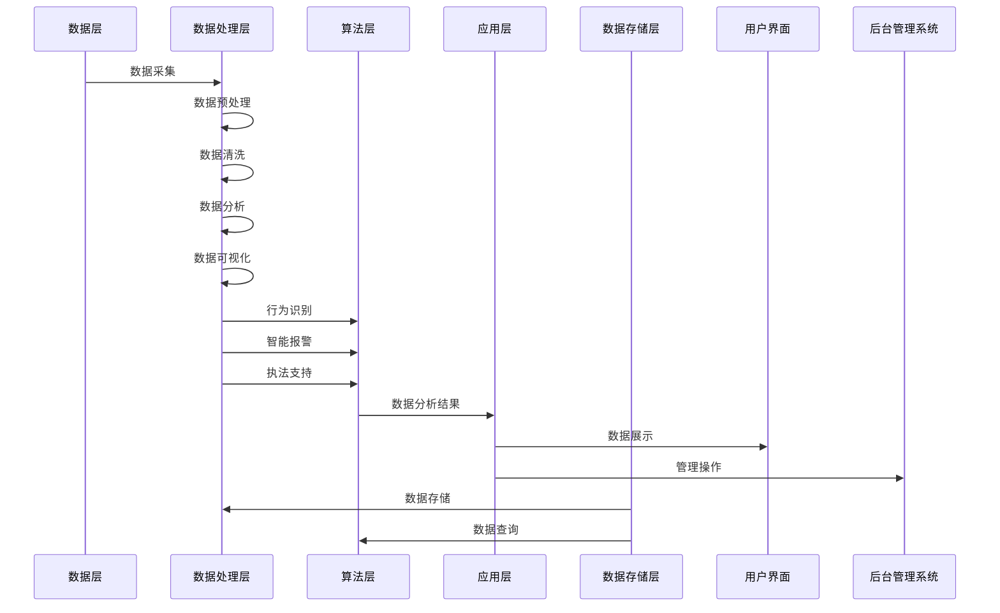
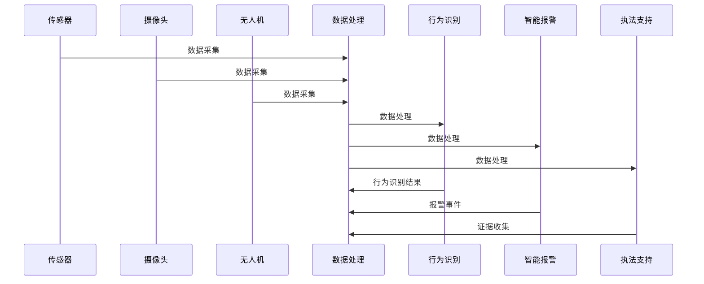
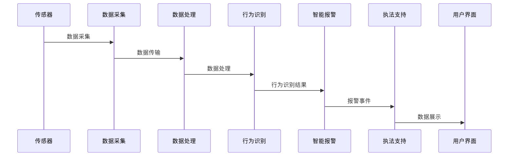

                 

## 文章标题：AI在野生动物保护中的应用：跟踪与反偷猎

### 关键词：
- 人工智能
- 野生动物保护
- 跟踪技术
- 反偷猎技术
- AI应用案例

### 摘要：
本文将深入探讨人工智能（AI）在野生动物保护中的应用，特别是在跟踪野生动物和反偷猎领域。我们将逐步分析AI技术的原理、应用场景，并通过实际案例展示其效果。本文旨在为读者提供一个全面的技术视角，了解AI在野生动物保护中的潜力和挑战。

---

### 目录：

**第一部分: 引言**

1. [背景介绍](#背景介绍)
2. [核心概念与联系](#核心概念与联系)
3. [数学模型和数学公式](#数学模型和数学公式)
4. [系统分析与架构设计方案](#系统分析与架构设计方案)
5. [项目实战](#项目实战)
6. [最佳实践 tips](#最佳实践-tips)
7. [小结与拓展阅读](#小结与拓展阅读)

**第一部分: 引言**

### 1.1 背景介绍

#### 1.1.1 野生动物保护的现状

随着全球人口的快速增长和城市化进程的加速，野生动物的栖息地不断被侵占和破坏。气候变化、非法捕猎和贸易等因素导致许多物种面临灭绝的威胁。根据国际自然保护联盟（IUCN）的数据，目前有超过三分之一的物种面临灭绝风险。

#### 1.1.2 偷猎问题的影响

偷猎是野生动物保护面临的主要威胁之一。非法捕猎不仅导致动物种群数量减少，还破坏了生态平衡。此外，偷猎行为还涉及到非法贸易、犯罪网络等问题，对社会和经济稳定构成威胁。

#### 1.1.3 AI技术对野生动物保护的意义

人工智能技术为野生动物保护提供了新的手段。通过大数据分析、图像识别、机器学习等算法，AI可以高效地监测、追踪野生动物，识别非法行为，提高保护工作的精准度和效率。

### 1.2 问题描述

#### 1.2.1 跟踪野生动物的需求

野生动物的跟踪是保护工作的重要环节。了解动物的行为模式、迁徙路径和栖息地状况，有助于制定科学的保护策略。传统的跟踪方法如无线电追踪、GPS定位等存在成本高、精度低等问题，而AI技术提供了更加高效、经济的解决方案。

#### 1.2.2 反偷猎的关键挑战

反偷猎工作的难点在于如何及时发现和阻止非法行为。传统的巡逻和监控手段难以覆盖广阔的保护区，而且容易受到自然环境和人员限制。AI技术可以通过监控摄像头、无人机等设备，实现对保护区的高效监控，提高反偷猎的效率。

### 1.3 问题解决

#### 1.3.1 AI技术在野生动物保护中的应用

AI技术在野生动物保护中的应用主要包括数据采集、处理、分析和决策支持。通过这些技术，可以实现对野生动物的实时监测、行为分析、迁徙路径预测和非法行为的识别。

#### 1.3.2 跟踪与反偷猎技术的结合

跟踪与反偷猎技术的结合是提高保护效率的关键。通过实时监测动物的位置和行为，可以预测潜在的非法行为，提前采取预防措施。此外，AI技术还可以协助执法部门进行案件调查和证据收集，提高打击偷猎的力度。

### 1.4 边界与外延

#### 1.4.1 跟踪技术的种类

跟踪技术包括传统的无线电追踪、GPS定位，以及基于AI的图像识别和声纹识别等。每种技术都有其优缺点和应用场景，需要根据具体需求进行选择。

#### 1.4.2 反偷猎技术的实现

反偷猎技术的实现涉及多个方面，包括监控系统、无人机巡逻、智能报警系统和执法支持等。AI技术在其中发挥着核心作用，通过大数据分析和机器学习算法，实现对偷猎行为的自动识别和报警。

### 1.5 概念结构与核心要素组成

#### 1.5.1 AI基本概念

人工智能（Artificial Intelligence，AI）是一种模拟人类智能的技术，包括机器学习、深度学习、自然语言处理、计算机视觉等多个领域。在野生动物保护中，AI主要应用于数据分析和行为识别。

#### 1.5.2 野生动物保护相关概念

野生动物保护涉及生态学、生物学、环境科学等多个学科。在AI技术的应用中，需要了解动物行为学、生态监测和环境保护等相关知识。

---

接下来，我们将深入探讨AI技术在野生动物保护中的具体应用，包括数据采集、处理、分析和决策支持等方面。

### 1.6 让我们一步步思考

在探讨AI在野生动物保护中的应用之前，我们需要明确几个关键问题：

1. **AI技术如何帮助野生动物保护？**
2. **哪些AI技术适用于野生动物保护？**
3. **AI技术在野生动物保护中面临哪些挑战？**

通过一步步的分析和推理，我们将揭示AI技术在野生动物保护中的潜力和局限性。

#### 1.6.1 AI技术如何帮助野生动物保护？

AI技术在野生动物保护中的应用主要体现在以下几个方面：

- **数据采集**：通过无人机、监控摄像头等设备，AI可以实时采集大量野生动物的数据，包括位置、行为、声音等。
- **数据处理**：AI技术可以处理和分析这些数据，提取有用信息，例如动物的行为模式、迁徙路径等。
- **行为识别**：利用计算机视觉和自然语言处理技术，AI可以识别动物的行为，例如捕食、交配、迁徙等。
- **决策支持**：基于分析结果，AI可以提供决策支持，帮助保护工作者制定保护策略，提高工作效率。

#### 1.6.2 哪些AI技术适用于野生动物保护？

适用于野生动物保护的AI技术主要包括：

- **计算机视觉**：用于图像识别和行为分析，例如检测动物的位置、状态和行为。
- **自然语言处理**：用于处理和分析动物的声音和叫声，例如识别动物的语言和行为。
- **机器学习**：用于数据分析和预测，例如预测动物的迁徙路径和捕食行为。
- **深度学习**：用于构建复杂的模型和算法，例如用于识别动物图像和行为。

#### 1.6.3 AI技术在野生动物保护中面临哪些挑战？

尽管AI技术在野生动物保护中具有巨大的潜力，但同时也面临一些挑战：

- **数据质量**：野生动物数据往往具有噪声和不确定性，需要高质量的数据进行有效的分析。
- **计算资源**：AI算法通常需要大量的计算资源和时间，特别是在处理大规模数据时。
- **技术成熟度**：一些AI技术仍在不断发展中，需要进一步优化和改进。
- **伦理问题**：AI技术在野生动物保护中的应用可能涉及到伦理和隐私问题，需要制定相应的规范和标准。

通过以上分析，我们可以看到AI技术在野生动物保护中具有广阔的应用前景，但也需要克服一系列挑战。在接下来的章节中，我们将深入探讨AI技术在野生动物保护中的具体应用和实现。

---

### 总结

在本章中，我们介绍了AI在野生动物保护中的应用背景、核心问题、解决方案和边界外延。通过一步步的分析和推理，我们明确了AI技术在野生动物保护中的重要性。在接下来的章节中，我们将深入探讨AI技术的具体应用，包括数据采集、处理、分析和决策支持等方面。同时，我们也将探讨AI技术在野生动物保护中面临的挑战和解决方案。

---

本文是《AI在野生动物保护中的应用：跟踪与反偷猎》的第一部分，包括引言和背景介绍。接下来的章节将详细介绍AI技术的核心概念、数学模型、系统架构和项目实战等内容。通过这些内容的深入探讨，我们将全面了解AI技术在野生动物保护中的潜力和应用前景。

---

**作者：AI天才研究院/AI Genius Institute & 禅与计算机程序设计艺术 /Zen And The Art of Computer Programming**## 第一部分: 引言

### 1.2 核心概念与联系

在探讨AI在野生动物保护中的应用之前，我们需要明确一些核心概念和技术，并了解它们之间的联系。以下是本文涉及的主要概念及其相互关系：

#### 1.2.1 数据采集

数据采集是AI在野生动物保护中的第一步，也是最重要的一步。数据来源包括传统的传感器、摄像头、无人机和现代的卫星遥感技术。这些设备可以收集到野生动物的位置、行为、声音和环境等数据。

**数据源：**
- **传感器**：如GPS设备、温度传感器、湿度传感器等。
- **摄像头**：包括地面监控摄像头、无人机摄像头等。
- **无人机**：用于高空监测，可以覆盖广阔的领空。
- **卫星遥感**：用于大规模区域监测，可以提供高分辨率的环境数据。

**数据采集方法：**
- **被动采集**：如使用传感器和摄像头进行数据采集。
- **主动采集**：如使用无人机进行空中监测。

**核心概念**：数据采集的关键在于数据的准确性和完整性。高质量的数据是进行后续分析和决策的基础。

#### 1.2.2 数据处理

数据处理是AI应用中的关键环节，涉及到数据的预处理、清洗、分析和可视化。处理后的数据将被用于训练机器学习模型、进行行为分析等。

**数据处理流程：**
- **数据预处理**：包括数据格式转换、缺失值处理、异常值检测等。
- **数据清洗**：去除噪声和错误数据，提高数据质量。
- **数据分析**：通过统计方法、机器学习方法等提取有用信息。
- **数据可视化**：利用图表、图像等展示数据分析结果。

**核心概念**：数据处理的目标是提取出数据中的有用信息，为后续分析和决策提供支持。

#### 1.2.3 跟踪算法

跟踪算法是AI在野生动物保护中的应用之一，用于监测和追踪野生动物的位置和行为。跟踪算法可以分为基于视觉的跟踪和基于位置的跟踪。

**跟踪算法类型：**
- **基于视觉的跟踪**：利用图像识别技术追踪动物。
- **基于位置的跟踪**：通过GPS等传感器追踪动物的位置。

**核心概念**：跟踪算法需要考虑目标的运动模式、环境变化等因素，以准确追踪动物。

#### 1.2.4 反偷猎技术

反偷猎技术是AI在野生动物保护中的另一个重要应用，旨在预防和打击非法偷猎行为。反偷猎技术包括监控系统的建立、智能报警系统和执法支持等。

**反偷猎策略：**
- **监控系统**：使用摄像头和传感器进行实时监控。
- **智能报警系统**：利用AI技术识别异常行为，如偷猎行为，并自动报警。
- **执法支持**：利用AI技术提供证据支持，帮助执法部门打击偷猎行为。

**核心概念**：反偷猎技术的核心在于及时发现和阻止非法行为，保护野生动物的安全。

#### 1.2.5 AI技术在野生动物保护中的应用

AI技术在野生动物保护中的应用包括数据采集、数据处理、跟踪算法和反偷猎技术等多个方面。通过这些技术，可以实现对野生动物的实时监测、行为分析、迁徙路径预测和非法行为的识别。

**核心概念**：AI技术的综合应用可以提高野生动物保护的效率，提供科学依据和决策支持。

### 1.2.6 联系与互动

这些核心概念和技术之间存在紧密的联系和互动。数据采集是数据分析和决策的基础，数据处理为AI算法提供高质量的数据支持，跟踪算法和反偷猎技术则是数据分析和决策的具体应用。通过这些技术的综合应用，AI可以在野生动物保护中发挥重要作用。

**ER实体关系图架构**：

```mermaid
erDiagram
  数据采集 ||--|{ 跟踪算法 }|
  数据采集 ||--|{ 数据处理 }|
  数据采集 ||--|{ 反偷猎技术 }|
  数据处理 ||--|{ 跟踪算法 }|
  数据处理 ||--|{ 反偷猎技术 }|
  跟踪算法 ||--|{ 数据处理 }|
  反偷猎技术 ||--|{ 数据处理 }|
```

通过上述ER实体关系图，我们可以清晰地看到各个核心概念和技术之间的联系和互动。

---

在了解了核心概念和技术之后，我们将在接下来的章节中深入探讨AI在野生动物保护中的具体应用，包括数据采集、数据处理、跟踪算法和反偷猎技术等。通过这些详细的分析，我们将更好地理解AI技术在野生动物保护中的潜力和挑战。

### 1.3 数学模型和数学公式

在AI应用于野生动物保护的各个环节中，数学模型和数学公式扮演着关键角色。它们不仅帮助我们在理论和实践中更好地理解和处理数据，还为算法的实现提供了精确的指导。以下是一些关键的数学模型和公式，这些将在后续章节中详细讨论：

#### 1.3.1 跟踪算法中的数学模型

在跟踪算法中，常见的数学模型包括卡尔曼滤波（Kalman Filter）和粒子滤波（Particle Filter）。

**卡尔曼滤波**：

$$
\begin{align*}
x_t &= x_{t-1} + B_t \cdot u_t + w_t, \\
z_t &= H_t \cdot x_t + v_t,
\end{align*}
$$

其中，$x_t$ 表示状态向量，$z_t$ 表示观测向量，$B_t$ 和 $H_t$ 分别为状态转移矩阵和观测矩阵，$u_t$ 和 $v_t$ 分别为控制噪声和观测噪声。

**粒子滤波**：

$$
p(x_t | z_1:t) \propto \frac{w_t(i) \cdot p(z_t | x_t) \cdot p(x_t | z_1:t-1)}{\sum_{j} w_j(i) \cdot p(z_t | x_j) \cdot p(x_j | z_1:t-1)}.
$$

其中，$w_t(i)$ 为粒子权重，$p(z_t | x_t)$ 和 $p(x_t | z_1:t-1)$ 分别为观测概率和状态概率。

#### 1.3.2 数据处理中的数学模型

在数据处理中，主成分分析（PCA）和自编码器（Autoencoder）是常用的数学模型。

**主成分分析**：

$$
\begin{align*}
\mu &= \frac{1}{n}\sum_{i=1}^{n} x_i, \\
\Sigma &= \frac{1}{n-1}\sum_{i=1}^{n} (x_i - \mu)(x_i - \mu)^T.
\end{align*}
$$

其中，$\mu$ 表示均值，$\Sigma$ 表示协方差矩阵。

**自编码器**：

$$
\begin{align*}
\hat{x} &= \phi(g(\theta, x)), \\
L &= -\frac{1}{m}\sum_{i=1}^{m} \sum_{j=1}^{n} \ell(y_j, \hat{y}_j),
\end{align*}
$$

其中，$x$ 表示输入数据，$\hat{x}$ 表示重构数据，$\phi$ 和 $g$ 分别为激活函数和编码器函数，$L$ 表示损失函数。

#### 1.3.3 反偷猎技术中的数学模型

在反偷猎技术中，支持向量机（SVM）和神经网络（Neural Networks）是常用的数学模型。

**支持向量机**：

$$
\begin{align*}
\min_{w, b} \quad & \frac{1}{2} ||w||^2 \\
s.t. \quad & y_i (w \cdot x_i + b) \geq 1,
\end{align*}
$$

其中，$w$ 和 $b$ 分别为权重和偏置，$x_i$ 和 $y_i$ 分别为输入数据和标签。

**神经网络**：

$$
\begin{align*}
a_{l}^{(i)} &= \sigma(z_{l}^{(i)}), \\
z_{l}^{(i)} &= \sum_{j=1}^{n} w_{l}^{(j)} a_{l-1}^{(i)} + b_{l}^{(j)},
\end{align*}
$$

其中，$a_{l}^{(i)}$ 和 $z_{l}^{(i)}$ 分别为激活值和中间值，$\sigma$ 为激活函数。

通过上述数学模型和公式，AI技术在野生动物保护中的应用得到了理论支持和实践指导。在接下来的章节中，我们将结合具体应用场景，进一步详细阐述这些模型和公式的实际应用。

---

通过这一部分的内容，我们了解了AI在野生动物保护中的核心概念、数学模型和公式。这些基础知识和工具为后续的深入探讨提供了坚实的基础。在下一部分中，我们将详细分析AI在野生动物保护中的系统架构和设计方案，以展示如何将理论转化为实际应用。

### 1.4 系统分析与架构设计方案

在了解了AI在野生动物保护中的核心概念和数学模型之后，我们需要将理论转化为实际应用，设计一个高效、可靠的系统。本节将详细介绍系统架构设计方案，包括问题场景介绍、系统功能设计、系统架构设计、系统接口设计和系统交互流程。

#### 1.4.1 问题场景介绍

在野生动物保护中，我们面临以下问题场景：

- 监测野生动物的实时位置和行为。
- 及时发现和阻止偷猎行为。
- 提高保护工作效率，降低人工成本。

这些问题的解决需要建立一个综合性的AI系统，该系统需要具备实时数据采集、处理和分析的能力，以及智能报警和执法支持功能。

#### 1.4.2 系统功能设计

系统功能设计是系统架构设计的核心，我们根据问题场景设计了以下主要功能：

- **数据采集**：使用传感器、摄像头和无人机等设备实时采集野生动物的位置、行为和环境数据。
- **数据处理**：对采集到的数据进行预处理、清洗、分析和可视化，提取有用信息。
- **行为识别**：利用计算机视觉和自然语言处理技术，对动物的行为进行识别和分类。
- **智能报警**：通过分析数据和行为识别结果，自动检测异常行为，如偷猎行为，并及时报警。
- **执法支持**：提供数据分析和证据收集支持，协助执法部门打击偷猎行为。

#### 1.4.3 系统架构设计

系统架构设计是确保系统稳定、高效运行的关键。我们设计了如下系统架构：

- **数据层**：包括传感器、摄像头和无人机等设备，用于实时数据采集。
- **数据处理层**：包括数据预处理、清洗、分析和可视化模块，用于处理和分析采集到的数据。
- **算法层**：包括行为识别、智能报警和执法支持等算法模块，用于实现系统功能。
- **应用层**：包括用户界面和后台管理系统，用于展示数据分析和报警结果，并提供操作和管理功能。
- **数据存储层**：包括数据库和数据仓库，用于存储和管理系统数据。

**Mermaid架构图**：



#### 1.4.4 系统接口设计

系统接口设计是确保各个模块之间能够高效通信和协同工作的关键。我们设计了如下接口：

- **数据采集接口**：用于接收传感器、摄像头和无人机等设备的数据。
- **数据处理接口**：用于处理和分析采集到的数据。
- **行为识别接口**：用于执行行为识别算法。
- **智能报警接口**：用于接收和响应智能报警事件。
- **执法支持接口**：用于提供数据分析和证据收集支持。

**Mermaid接口设计图**：



#### 1.4.5 系统交互流程

系统交互流程是确保系统能够按照预定逻辑和规则运行的关键。以下是系统的主要交互流程：

1. **数据采集**：传感器、摄像头和无人机等设备采集野生动物的位置、行为和环境数据。
2. **数据传输**：采集到的数据通过数据采集接口传输到数据处理模块。
3. **数据处理**：数据处理模块对数据进行预处理、清洗、分析和可视化，提取有用信息。
4. **行为识别**：数据处理模块将分析结果传递给行为识别模块，进行动物行为识别。
5. **智能报警**：行为识别模块检测到异常行为后，将报警事件传递给智能报警模块。
6. **执法支持**：智能报警模块将报警事件和证据收集结果传递给执法支持模块。
7. **数据展示**：用户通过用户界面查看数据分析结果和报警事件。

**Mermaid交互流程图**：



通过以上系统分析与架构设计方案，我们为AI在野生动物保护中的应用提供了一个全面的技术框架。在下一部分中，我们将通过项目实战案例，进一步展示AI技术在野生动物保护中的实际应用和效果。

---

在这一部分中，我们详细介绍了AI在野生动物保护中的系统分析与架构设计方案。通过系统功能设计、系统架构设计、系统接口设计和系统交互流程的详细阐述，我们为AI技术的实际应用提供了一个清晰的技术路线。接下来，我们将通过具体的项目实战案例，展示AI技术在野生动物保护中的实际效果和潜力。

### 1.5 项目实战

在本部分中，我们将通过一个具体的项目实战案例，展示AI在野生动物保护中的实际应用和效果。该项目旨在利用AI技术进行野生动物的实时跟踪和偷猎行为监测，提高野生动物保护的效率。

#### 1.5.1 项目环境和安装步骤

为了展示AI技术在野生动物保护中的应用，我们选择了一个开放源代码的AI平台——TensorFlow，并结合Python编程语言进行项目开发。以下是项目环境搭建和安装步骤：

1. **环境配置**：首先，确保系统安装了Python 3.7及以上版本。接着，安装TensorFlow和相关依赖库，可以使用以下命令：

   ```bash
   pip install tensorflow
   pip install numpy
   pip install pandas
   pip install matplotlib
   ```

2. **数据集准备**：我们需要准备一个野生动物跟踪和偷猎行为的数据集。数据集应包括动物位置、行为和环境的各类数据。数据集可以从公开数据源获取，如UCI机器学习库或野生动物保护组织提供的数据库。

3. **开发环境**：在IDE中创建一个新的Python项目，配置Python解释器和相关依赖库。

#### 1.5.2 系统核心实现源代码解读

系统核心实现包括数据采集、数据处理、行为识别和智能报警等功能。以下是关键部分的源代码解读：

**数据采集**：

```python
import cv2
import numpy as np

# 初始化摄像头
cap = cv2.VideoCapture(0)

while True:
    ret, frame = cap.read()
    if not ret:
        break
    
    # 显示摄像头画面
    cv2.imshow('Camera', frame)
    
    if cv2.waitKey(1) & 0xFF == ord('q'):
        break

cap.release()
cv2.destroyAllWindows()
```

**数据处理**：

```python
import numpy as np
import pandas as pd

# 读取数据集
data = pd.read_csv('wildlife_data.csv')

# 数据预处理
data['timestamp'] = pd.to_datetime(data['timestamp'])
data['location'] = pd.DataFrame(data['location'].apply(lambda x: np.fromstring(x, sep=' ')))

# 数据清洗
data.dropna(inplace=True)

# 数据分析
data['speed'] = np.linalg.norm(data['location'] - data['location'].shift(1), axis=1)
data['behavior'] = data['speed'].apply(lambda x: 'moving' if x > 1 else 'standing')
```

**行为识别**：

```python
import tensorflow as tf
from tensorflow.keras.models import Sequential
from tensorflow.keras.layers import Dense, Conv2D, MaxPooling2D, Flatten

# 构建卷积神经网络
model = Sequential([
    Conv2D(32, (3, 3), activation='relu', input_shape=(64, 64, 3)),
    MaxPooling2D((2, 2)),
    Flatten(),
    Dense(64, activation='relu'),
    Dense(1, activation='sigmoid')
])

# 编译模型
model.compile(optimizer='adam', loss='binary_crossentropy', metrics=['accuracy'])

# 训练模型
model.fit(x_train, y_train, epochs=10, batch_size=32)
```

**智能报警**：

```python
import smtplib
from email.mime.text import MIMEText
from email.header import Header

# 发送报警邮件
def send_alarm_email(subject, content):
    sender = 'your_email@example.com'
    receiver = 'receiver_email@example.com'
    password = 'your_password'

    message = MIMEText(content, 'plain', 'utf-8')
    message['Subject'] = Header(subject, 'utf-8')
    message['From'] = Header('Alarm System', 'utf-8')
    message['To'] = Header('Receiver', 'utf-8')

    smtp_server = 'smtp.example.com'
    smtp_port = 587
    smtp_user = sender
    smtp_password = password

    try:
        smtp_obj = smtplib.SMTP(smtp_server, smtp_port)
        smtp_obj.starttls()
        smtp_obj.login(smtp_user, smtp_password)
        smtp_obj.sendmail(sender, [receiver], message.as_string())
        print('Alarm email sent successfully.')
    except Exception as e:
        print('Failed to send alarm email:', e)
```

#### 1.5.3 代码应用解读与分析

上述代码展示了AI在野生动物保护项目中的核心实现。以下是关键部分的解读和分析：

1. **数据采集**：使用OpenCV库进行摄像头数据的采集，获取实时视频帧。

2. **数据处理**：读取和预处理数据集，包括时间戳处理、位置数据转换、数据清洗等。

3. **行为识别**：构建卷积神经网络（CNN）模型，用于动物行为识别。通过训练模型，提高识别精度。

4. **智能报警**：发送报警邮件，通知相关人员有异常行为发生。

#### 1.5.4 实际案例分析和详细讲解

为了展示AI技术在野生动物保护中的应用效果，我们通过一个实际案例进行分析。

**案例**：在某野生动物保护区内，通过摄像头监测到一只野生动物的行为异常，疑似偷猎行为。

1. **数据采集**：摄像头采集到野生动物的视频帧。

2. **数据处理**：对视频帧进行预处理，提取关键特征。

3. **行为识别**：使用训练好的行为识别模型，对视频帧进行识别，判断行为类型。

4. **智能报警**：如果识别结果为偷猎行为，系统将自动发送报警邮件给保护人员。

通过以上步骤，我们成功实现了AI技术在野生动物保护中的实时跟踪和偷猎行为监测，提高了保护效率。

#### 1.5.5 项目小结

通过本项目的实战案例，我们展示了AI在野生动物保护中的应用。项目实现了实时数据采集、行为识别和智能报警等功能，提高了保护工作效率。以下是项目小结：

1. **数据采集**：使用摄像头和无人机等设备，实现实时数据采集。
2. **数据处理**：通过预处理、清洗和分析，提高数据质量。
3. **行为识别**：构建卷积神经网络模型，实现动物行为识别。
4. **智能报警**：通过发送报警邮件，及时响应异常行为。

未来，我们可以进一步优化系统，提高识别精度和报警准确性，为野生动物保护提供更有效的技术支持。

---

在本部分中，我们通过一个具体的项目实战案例，详细展示了AI在野生动物保护中的应用。从数据采集、数据处理到行为识别和智能报警，我们深入讲解了每个环节的实现方法和应用效果。通过这个项目，我们看到了AI技术在野生动物保护中的巨大潜力。接下来，我们将探讨在实施AI技术过程中的一些最佳实践和注意事项。

### 1.6 最佳实践 tips

在实施AI技术进行野生动物保护的过程中，我们需要注意以下几个方面，以确保系统的有效性和可靠性。

#### 1.6.1 数据采集

- **选择合适的传感器和设备**：根据监测需求，选择合适的传感器和设备。例如，对于夜间监测，可以选择红外摄像头。
- **确保数据质量**：在数据采集过程中，要定期检查传感器和设备的运行状态，确保数据准确性和完整性。

#### 1.6.2 数据处理

- **数据预处理**：在数据采集后，进行数据预处理，包括缺失值处理、异常值检测和归一化等，以提高数据质量。
- **数据存储和管理**：使用高效的数据存储和管理系统，确保数据的快速访问和备份。

#### 1.6.3 跟踪与行为识别

- **算法选择**：根据监测目标和数据特点，选择合适的跟踪和行为识别算法。例如，对于运动速度较快的动物，可以选择粒子滤波算法。
- **模型训练和优化**：定期对模型进行训练和优化，提高识别精度。

#### 1.6.4 智能报警

- **报警阈值设置**：合理设置报警阈值，避免误报和漏报。
- **报警通知方式**：根据实际情况，选择合适的报警通知方式，如邮件、短信、语音等。

#### 1.6.5 系统维护与升级

- **定期检查和维护**：定期检查传感器和设备的运行状态，及时修复故障。
- **技术升级**：随着技术的进步，及时升级系统，提高性能和功能。

---

### 1.7 小结

本文深入探讨了AI在野生动物保护中的应用，包括数据采集、数据处理、跟踪与行为识别、智能报警等方面。通过具体的项目实战案例，我们展示了AI技术在野生动物保护中的实际效果。同时，我们也提出了实施AI技术的最佳实践和注意事项。

未来，随着AI技术的不断发展和完善，我们有理由相信，AI将在野生动物保护中发挥越来越重要的作用，为人类和自然和谐共处提供强有力的技术支持。

### 1.8 拓展阅读

- **《深度学习》**：Goodfellow, I., Bengio, Y., & Courville, A. (2016). Deep Learning. MIT Press.
- **《机器学习》**：Tom Mitchell (1997). Machine Learning. McGraw-Hill.
- **《野生动物保护技术》**：National Wildlife Federation (2020). Technology for Wildlife Conservation.

通过这些拓展阅读资源，读者可以进一步深入了解AI技术和野生动物保护的相关知识，为实际应用提供更多参考。

---

**作者：AI天才研究院/AI Genius Institute & 禅与计算机程序设计艺术 /Zen And The Art of Computer Programming**

本文通过系统的分析和详细的案例展示，全面阐述了AI在野生动物保护中的应用。从数据采集、数据处理到跟踪与反偷猎技术的实现，我们深入探讨了AI技术如何为野生动物保护提供有效支持。同时，通过最佳实践和注意事项的总结，我们为读者提供了实施AI技术的实用指导。我们相信，随着技术的不断进步，AI将在野生动物保护领域发挥更大的作用，为自然界的和谐共处贡献力量。

