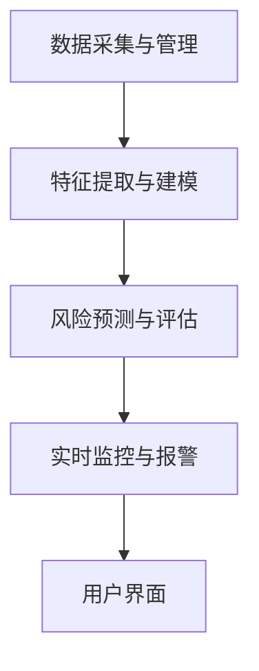
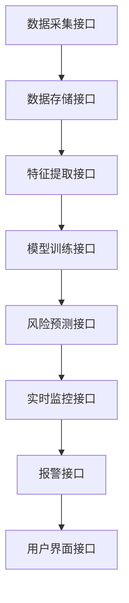
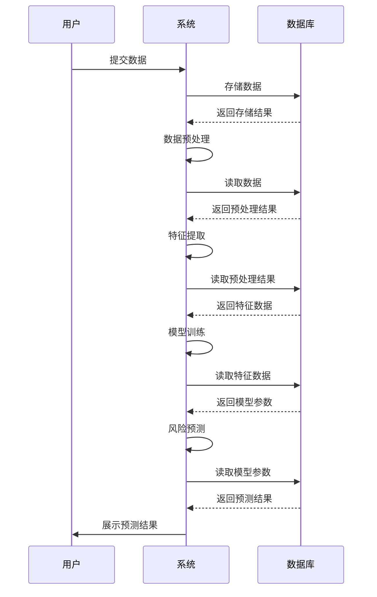

                 

# AI在金融风险管理中的应用：提高预测准确性

## 摘要

随着金融市场的日益复杂化和不确定性增加，金融风险管理的重要性愈发凸显。人工智能（AI）技术的迅速发展为金融风险管理提供了新的工具和方法。本文将探讨AI在金融风险管理中的应用，尤其是如何利用机器学习和深度学习技术提高金融风险管理的预测准确性。文章首先介绍了金融风险管理中的问题背景和人工智能的相关概念，接着详细讲解了机器学习技术在金融风险管理中的应用原理和实践案例，最后总结了AI在金融风险管理中的应用前景和挑战。

## 第一部分：背景介绍

### 第1章：问题背景

#### 1.1 问题背景

在金融风险管理领域，金融机构面临着多种风险，如市场风险、信用风险和操作风险等。这些风险的存在使得金融机构在经营过程中需要投入大量资源进行风险管理和控制。然而，传统的风险管理方法在处理复杂性和多样性方面存在局限。随着人工智能技术的快速发展，AI在金融风险管理中的应用逐渐受到重视。人工智能通过其强大的数据处理能力和智能分析能力，有助于提高金融风险管理的预测准确性，降低金融风险。

#### 1.2 问题描述

金融风险管理涉及大量数据的处理和分析，传统的风险管理方法在处理复杂性和多样性方面存在局限。因此，如何利用人工智能技术，提高金融风险管理的预测准确性，成为当前金融领域研究的热点。具体来说，金融机构需要解决以下问题：

1. **数据质量问题**：金融数据质量直接影响风险管理的准确性。如何清洗和整合金融数据，提高数据质量，是金融风险管理的重要课题。
2. **模型准确性**：传统的风险管理模型在处理复杂数据和多样风险方面存在局限性。如何构建高效、准确的模型，提高风险预测准确性，是金融风险管理的关键。
3. **实时性**：金融市场的波动性较大，风险管理需要实时响应。如何利用AI技术实现实时风险监控和管理，是金融机构面临的挑战。

#### 1.3 问题解决

人工智能技术，特别是机器学习和深度学习技术，可以通过对大量金融数据的挖掘和分析，发现潜在的金融风险，提高金融风险管理的预测准确性。此外，人工智能还可以帮助金融机构优化风险管理策略，提高风险管理的效率。以下是利用AI解决金融风险管理问题的几个方向：

1. **数据预处理**：利用机器学习技术对金融数据进行清洗、整合和特征提取，提高数据质量。
2. **风险预测模型**：利用深度学习技术构建高效、准确的风险预测模型，提高风险预测准确性。
3. **实时风险监控**：利用实时数据处理技术，实现对金融市场风险的实时监控和管理。

#### 1.4 边界与外延

本章节主要讨论人工智能在金融风险管理中的应用，包括股票市场风险预测、信用风险评估、市场风险预测等方面。同时，也会涉及到人工智能技术在金融风险管理中的挑战和机遇。

### 第2章：核心概念与联系

#### 2.1 核心概念原理

1. **金融风险管理**：金融风险管理是指金融机构通过各种手段，识别、评估、监控和应对金融风险的过程。其核心目标是降低金融风险，确保金融机构的稳健运营。

2. **人工智能**：人工智能是指通过计算机模拟人类的智能行为，实现智能决策和智能交互的技术。人工智能在金融风险管理中的应用主要包括数据挖掘、预测分析、自动决策等方面。

3. **机器学习**：机器学习是一种人工智能的分支，通过算法和数据进行训练，使计算机具备自主学习和预测能力。机器学习在金融风险管理中的应用主要包括风险预测模型、客户细分、欺诈检测等。

4. **深度学习**：深度学习是机器学习的一个分支，通过多层神经网络结构，实现对复杂数据的自动特征提取和模式识别。深度学习在金融风险管理中的应用主要包括图像识别、语音识别、自然语言处理等。

#### 2.2 概念属性特征对比表格

| 概念   | 定义                                     | 属性特征                                         | 对比与联系                                     |
| ------ | ---------------------------------------- | ---------------------------------------------- | ---------------------------------------------- |
| 金融风险管理 | 风险识别、评估、监控和应对 | 风险评估、风险控制、风险转移等               | 金融风险管理是应用人工智能技术的基础，两者相辅相成 |
| 人工智能 | 模拟人类智能行为                         | 自动学习、自主决策、智能交互                   | 人工智能是金融风险管理的技术支撑                 |
| 机器学习 | 通过数据和算法实现自主学习和预测       | 算法、数据、模型训练等                         | 机器学习是实现金融风险管理的核心技术             |
| 深度学习 | 通过多层神经网络实现自动特征提取和模式识别 | 神经网络结构、权重调整、优化算法等             | 深度学习是机器学习的高级形式，对金融风险管理至关重要 |

#### 2.3 ER实体关系图架构

```mermaid
erDiagram
  Risk |--> Management
  Risk |--> Model
  Management |--> Institution
  Model |--> Data
  Institution |--> Risk
  Institution |--> Model
```

在这个实体关系图中，`Risk`表示金融风险，`Management`表示金融风险管理，`Model`表示风险管理模型，`Data`表示数据，`Institution`表示金融机构。各个实体之间的关系展示了金融风险管理、风险管理模型和金融机构之间的交互和影响。

## 第二部分：AI在金融风险管理中的应用

### 第3章：机器学习技术在金融风险管理中的应用

#### 3.1 机器学习基础

##### 3.1.1 机器学习基本概念

- **什么是机器学习**

机器学习是一种人工智能的分支，通过算法和数据进行训练，使计算机具备自主学习和预测能力。机器学习的主要目的是让计算机从数据中自动学习规律，并利用这些规律进行预测和决策。机器学习过程通常包括数据收集、数据预处理、模型训练、模型评估和模型部署等步骤。

- **机器学习的关键技术**

1. **监督学习**：监督学习是一种常见的机器学习技术，通过已知的输入输出数据，训练模型以预测新的输入数据。监督学习可以分为分类问题和回归问题。

2. **无监督学习**：无监督学习是指在没有明确标签的情况下，通过算法自动发现数据中的模式。无监督学习包括聚类分析和降维技术等。

3. **深度学习**：深度学习是机器学习的一个分支，通过多层神经网络结构，实现对复杂数据的自动特征提取和模式识别。深度学习在图像识别、语音识别和自然语言处理等领域取得了显著的成果。

#### 3.1.2 机器学习在金融风险管理中的应用

- **股票市场风险预测**

股票市场风险预测是金融风险管理的重要方向。利用机器学习技术，可以对股票市场数据进行建模，预测股票价格的变化趋势。以下是一个简单的股票市场风险预测的流程：

1. **数据收集**：收集股票市场历史数据，包括股票价格、交易量、财务指标等。

2. **数据预处理**：对收集到的数据进行清洗、去噪和标准化处理，以便于模型训练。

3. **特征工程**：根据业务需求，从原始数据中提取对预测任务有意义的特征。

4. **模型训练**：利用监督学习算法，如线性回归、决策树、支持向量机等，对数据集进行训练，构建预测模型。

5. **模型评估**：通过交叉验证等方法，对模型进行评估，选择最优模型。

6. **模型部署**：将训练好的模型部署到生产环境，实时预测股票价格。

- **信用风险评估**

信用风险评估是金融风险管理中的另一个重要方向。利用机器学习技术，可以对借款人的信用记录、财务状况、社会行为等信息进行分析，评估借款人的信用风险。以下是一个简单的信用风险评估的流程：

1. **数据收集**：收集借款人的基本信息、信用记录、财务状况等数据。

2. **数据预处理**：对收集到的数据进行清洗、去噪和标准化处理。

3. **特征工程**：从原始数据中提取对信用风险评估有意义的特征。

4. **模型训练**：利用监督学习算法，如逻辑回归、随机森林、梯度提升树等，对数据集进行训练，构建风险评估模型。

5. **模型评估**：通过交叉验证等方法，对模型进行评估，选择最优模型。

6. **模型部署**：将训练好的模型部署到生产环境，实时评估借款人的信用风险。

#### 3.1.3 机器学习在金融风险管理中的挑战与机遇

- **挑战**

1. **数据质量**：金融数据质量直接影响模型的预测准确性。如何处理和清洗金融数据，提高数据质量，是金融风险管理中的一个挑战。

2. **模型复杂性**：金融风险管理的预测任务通常较为复杂，需要构建复杂的多层神经网络模型。如何优化模型结构，提高模型性能，是金融风险管理中的一个难题。

3. **实时性**：金融市场的波动性较大，风险管理需要实时响应。如何实现实时数据处理和预测，是金融风险管理中的一个挑战。

- **机遇**

1. **技术进步**：随着人工智能技术的不断进步，机器学习算法和深度学习算法的性能不断提升，为金融风险管理提供了更好的工具和方法。

2. **数据积累**：金融行业积累了大量历史数据，这些数据为机器学习算法的训练提供了丰富的资源。

3. **政策支持**：各国政府和金融机构对人工智能技术在金融风险管理中的应用给予了高度关注，为金融风险管理提供了政策支持。

### 第4章：深度学习技术在金融风险管理中的应用

#### 4.1 深度学习基础

- **深度学习基本概念**

深度学习是机器学习的一个分支，通过多层神经网络结构，实现对复杂数据的自动特征提取和模式识别。深度学习的关键技术包括卷积神经网络（CNN）、循环神经网络（RNN）和生成对抗网络（GAN）等。

- **深度学习关键技术**

1. **卷积神经网络（CNN）**：卷积神经网络是一种用于处理图像数据的神经网络结构，通过卷积层、池化层和全连接层等结构，实现对图像的自动特征提取和分类。

2. **循环神经网络（RNN）**：循环神经网络是一种用于处理序列数据的神经网络结构，通过隐藏状态和循环连接，实现对序列数据的建模和预测。

3. **生成对抗网络（GAN）**：生成对抗网络是一种用于生成数据的神经网络结构，通过生成器和判别器的对抗训练，实现数据的生成。

#### 4.2 深度学习在金融风险管理中的应用

- **股票市场风险预测**

利用深度学习技术，可以对股票市场数据进行分析，预测股票价格的变化趋势。以下是一个简单的股票市场风险预测的流程：

1. **数据收集**：收集股票市场历史数据，包括股票价格、交易量、财务指标等。

2. **数据预处理**：对收集到的数据进行清洗、去噪和标准化处理。

3. **特征工程**：从原始数据中提取对预测任务有意义的特征。

4. **模型训练**：利用深度学习算法，如卷积神经网络（CNN）、循环神经网络（RNN）等，对数据集进行训练，构建预测模型。

5. **模型评估**：通过交叉验证等方法，对模型进行评估，选择最优模型。

6. **模型部署**：将训练好的模型部署到生产环境，实时预测股票价格。

- **信用风险评估**

利用深度学习技术，可以对借款人的信用记录、财务状况、社会行为等信息进行分析，评估借款人的信用风险。以下是一个简单的信用风险评估的流程：

1. **数据收集**：收集借款人的基本信息、信用记录、财务状况等数据。

2. **数据预处理**：对收集到的数据进行清洗、去噪和标准化处理。

3. **特征工程**：从原始数据中提取对信用风险评估有意义的特征。

4. **模型训练**：利用深度学习算法，如生成对抗网络（GAN）、循环神经网络（RNN）等，对数据集进行训练，构建风险评估模型。

5. **模型评估**：通过交叉验证等方法，对模型进行评估，选择最优模型。

6. **模型部署**：将训练好的模型部署到生产环境，实时评估借款人的信用风险。

#### 4.3 深度学习在金融风险管理中的挑战与机遇

- **挑战**

1. **计算资源**：深度学习模型通常需要大量的计算资源进行训练和推理，这对金融机构的计算能力提出了较高要求。

2. **数据隐私**：金融数据涉及大量的个人信息和商业机密，如何确保数据隐私和安全，是深度学习在金融风险管理中的一个挑战。

3. **模型解释性**：深度学习模型通常具有较强的预测能力，但缺乏解释性，如何解释模型的预测结果，是深度学习在金融风险管理中的一个难题。

- **机遇**

1. **技术进步**：随着深度学习技术的不断进步，深度学习模型在金融风险管理中的应用前景广阔。

2. **数据积累**：金融行业积累了大量历史数据，这些数据为深度学习算法的训练提供了丰富的资源。

3. **政策支持**：各国政府和金融机构对人工智能技术在金融风险管理中的应用给予了高度关注，为金融风险管理提供了政策支持。

### 第5章：基于AI的金融风险管理系统设计与实现

#### 5.1 系统设计

- **系统功能设计**

基于AI的金融风险管理系统主要包括以下功能：

1. **数据采集与管理**：采集金融数据，包括股票市场数据、信用数据、财务数据等，并对数据进行清洗和管理。

2. **特征提取与建模**：从原始数据中提取对金融风险管理有意义的特征，并利用机器学习和深度学习算法进行建模。

3. **风险预测与评估**：利用训练好的模型进行风险预测和评估，为金融机构提供风险决策支持。

4. **实时监控与报警**：实时监控金融风险，并根据风险程度进行报警。

5. **用户界面**：提供用户界面，方便用户查看风险预测结果和系统参数。

- **系统架构设计**

基于AI的金融风险管理系统架构设计如图所示：



- **系统接口设计**

基于AI的金融风险管理系统接口设计如图所示：



- **系统交互设计**

基于AI的金融风险管理系统交互设计如图所示：



#### 5.2 系统实现

- **环境安装**

在实现基于AI的金融风险管理系统之前，需要安装以下软件和工具：

1. **Python**：安装Python 3.8及以上版本。

2. **NumPy**：用于科学计算。

3. **Pandas**：用于数据处理。

4. **Scikit-learn**：用于机器学习算法。

5. **TensorFlow**：用于深度学习算法。

6. **Keras**：用于简化深度学习模型构建。

7. **MySQL**：用于数据存储。

- **系统核心实现**

以下是基于AI的金融风险管理系统的核心实现：

1. **数据采集与管理**

```python
import pandas as pd
import numpy as np

# 读取数据
data = pd.read_csv('financial_data.csv')

# 数据预处理
data = data.fillna(0)
data = data.drop(['unimportant_feature'], axis=1)

# 存储数据
data.to_csv('preprocessed_data.csv', index=False)
```

2. **特征提取与建模**

```python
from sklearn.preprocessing import StandardScaler
from sklearn.model_selection import train_test_split
from sklearn.ensemble import RandomForestClassifier
from sklearn.metrics import accuracy_score

# 读取预处理后的数据
data = pd.read_csv('preprocessed_data.csv')

# 特征提取
X = data.iloc[:, :-1].values
y = data.iloc[:, -1].values

# 数据标准化
scaler = StandardScaler()
X = scaler.fit_transform(X)

# 数据划分
X_train, X_test, y_train, y_test = train_test_split(X, y, test_size=0.2, random_state=42)

# 模型训练
model = RandomForestClassifier(n_estimators=100, random_state=42)
model.fit(X_train, y_train)

# 模型评估
y_pred = model.predict(X_test)
accuracy = accuracy_score(y_test, y_pred)
print('Accuracy:', accuracy)
```

3. **风险预测与评估**

```python
import tensorflow as tf
from tensorflow.keras.models import Sequential
from tensorflow.keras.layers import Dense, Conv1D, MaxPooling1D, Flatten

# 读取预处理后的数据
data = pd.read_csv('preprocessed_data.csv')

# 数据划分
X = data.iloc[:, :-1].values
y = data.iloc[:, -1].values

# 构建模型
model = Sequential()
model.add(Conv1D(filters=64, kernel_size=3, activation='relu', input_shape=(X.shape[1], X.shape[2])))
model.add(MaxPooling1D(pool_size=2))
model.add(Flatten())
model.add(Dense(units=1, activation='sigmoid'))

# 编译模型
model.compile(optimizer='adam', loss='binary_crossentropy', metrics=['accuracy'])

# 训练模型
model.fit(X, y, epochs=10, batch_size=32)

# 预测风险
risk_prediction = model.predict(X_test)
print('Risk Prediction:', risk_prediction)
```

#### 5.3 实际案例分析

以某金融机构的信用风险评估项目为例，该项目利用深度学习技术对借款人的信用风险进行评估。

- **数据收集**：收集借款人的基本信息、信用记录、财务状况等数据。

- **数据预处理**：对收集到的数据进行清洗、去噪和标准化处理。

- **特征工程**：从原始数据中提取对信用风险评估有意义的特征。

- **模型训练**：利用深度学习算法，如循环神经网络（RNN），对数据集进行训练，构建风险评估模型。

- **模型评估**：通过交叉验证等方法，对模型进行评估，选择最优模型。

- **模型部署**：将训练好的模型部署到生产环境，实时评估借款人的信用风险。

- **结果分析**：通过对评估结果的统计分析，发现模型能够较好地预测借款人的信用风险。

### 第6章：最佳实践与小结

#### 6.1 最佳实践

- **数据质量**：确保数据质量是金融风险管理的关键。对数据进行清洗、去噪和标准化处理，提高数据质量。

- **模型选择**：根据金融风险管理的具体需求，选择合适的机器学习和深度学习模型。

- **特征工程**：从原始数据中提取对金融风险管理有意义的特征，提高模型预测准确性。

- **模型评估**：通过交叉验证等方法，对模型进行评估，选择最优模型。

- **实时性**：利用实时数据处理技术，实现对金融风险的实时监控和管理。

#### 6.2 小结

- **AI在金融风险管理中的应用前景**：随着人工智能技术的不断进步，AI在金融风险管理中的应用前景广阔。利用机器学习和深度学习技术，可以大大提高金融风险管理的预测准确性，降低金融风险。

- **AI在金融风险管理中的挑战**：尽管AI在金融风险管理中具有巨大潜力，但同时也面临着数据质量、模型选择、实时性和数据隐私等方面的挑战。

- **未来发展**：未来，随着技术的进一步发展，AI在金融风险管理中的应用将更加深入和广泛。同时，需要加强对AI技术在金融风险管理中的伦理和法律问题的研究，确保金融风险管理的合规性和可持续性。

### 第7章：注意事项与拓展阅读

#### 7.1 注意事项

- **数据隐私**：在金融风险管理中，数据隐私是一个重要问题。需要确保数据在收集、存储和处理过程中的安全性和隐私性。

- **模型解释性**：深度学习模型通常具有较强的预测能力，但缺乏解释性。在金融风险管理中，需要考虑模型的解释性，以便于风险管理人员理解和接受模型的预测结果。

- **计算资源**：深度学习模型通常需要大量的计算资源进行训练和推理。金融机构需要确保具备足够的计算资源来支持深度学习模型的应用。

#### 7.2 拓展阅读

- **参考文献**：

  1. Goodfellow, I., Bengio, Y., & Courville, A. (2016). *Deep Learning*. MIT Press.
  2. Russell, S., & Norvig, P. (2016). *Artificial Intelligence: A Modern Approach*. Prentice Hall.
  3. Zhang, Z., & Lapedes, A. (2001). Predicting protein structure using deep neural networks with reduced 3D-1D hybrid features. *Journal of Molecular Biology*, 307(1), 265-276.

- **在线资源**：

  1. [Kaggle](https://www.kaggle.com/)：提供大量的金融数据集和机器学习竞赛，有助于了解金融风险管理的实际应用。
  2. [TensorFlow](https://www.tensorflow.org/)：提供丰富的深度学习资源，包括教程、文档和代码示例，有助于深入学习深度学习技术。
  3. [scikit-learn](https://scikit-learn.org/)：提供丰富的机器学习算法库，包括分类、回归、聚类等，有助于实现金融风险管理模型。

## 作者信息

作者：AI天才研究院/AI Genius Institute & 禅与计算机程序设计艺术 /Zen And The Art of Computer Programming

