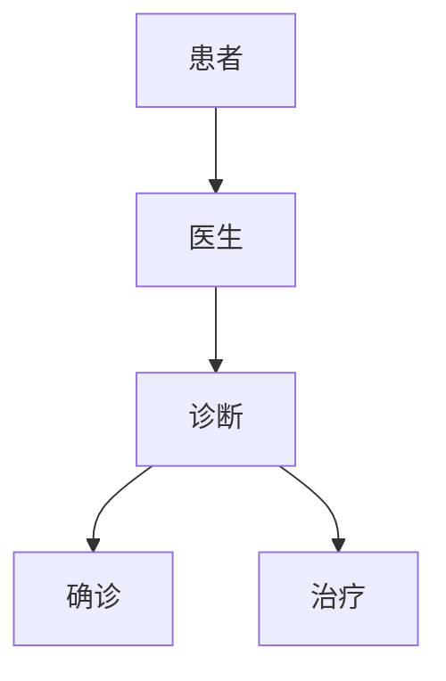
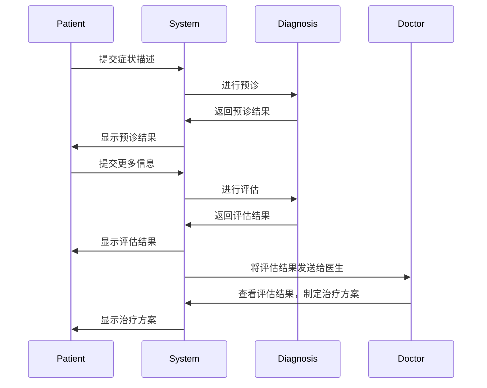

                 

# AI大模型在心理健康领域的应用：智能诊断与治疗

关键词：AI大模型、心理健康、智能诊断、智能治疗、GPT模型、BERT模型、算法原理、系统架构设计

摘要：随着人工智能技术的快速发展，AI大模型在各个领域都展现出了巨大的潜力。本文以心理健康领域为例，探讨了AI大模型在智能诊断与治疗方面的应用，详细分析了AI大模型的工作原理、算法实现、系统架构设计以及实际案例，为推动心理健康领域的智能化发展提供了有益的参考。

## 第一部分： 引言与背景

### 1. 引言

#### 1.1 问题的提出

心理健康问题已经成为全球范围内的重大公共卫生挑战。据世界卫生组织（WHO）统计，每年有超过3亿人受到不同程度的心理健康问题困扰，其中包括抑郁症、焦虑症、精神分裂症等。这些心理问题不仅对患者的生命质量造成了严重影响，还增加了社会医疗负担。传统的心理健康诊断与治疗方法存在诸多局限，如诊断效率低、治疗周期长、个性化程度不足等。因此，寻找更高效、更精准的心理健康诊断与治疗方法具有重要的现实意义。

#### 1.1.1 心理健康问题的现状

随着现代社会生活节奏的加快、工作压力的增大以及社交媒体的普及，心理健康问题的发生率呈逐年上升趋势。据我国相关调查数据显示，近年来我国心理健康问题的发生率已经超过了20%，其中抑郁症的发病率更是逐年攀升。与此同时，由于传统心理健康诊断与治疗方法的局限性，很多患者无法得到及时有效的干预，导致心理问题逐渐加重，甚至引发严重后果。

#### 1.1.2 人工智能与心理健康的结合

人工智能（AI）作为当今最具变革性的技术之一，已经在许多领域取得了显著的成果。在心理健康领域，AI技术也展现出了巨大的潜力。通过利用AI大模型进行心理健康的智能诊断与治疗，有望提高诊断的准确性、治疗的有效性，并实现个性化的心理健康服务。本文将围绕这一主题进行探讨，详细分析AI大模型在心理健康领域的应用原理、系统架构设计以及实际案例。

### 1.2 AI大模型的基本概念

#### 1.2.1 AI大模型的定义

AI大模型，也称为大型预训练模型，是指通过对海量数据进行大规模预训练，形成具有强大语义理解和生成能力的深度神经网络模型。这些模型通常具有数十亿个参数，能够处理复杂的语言、图像和音频等数据。代表性的AI大模型包括GPT（Generative Pre-trained Transformer）、BERT（Bidirectional Encoder Representations from Transformers）等。

#### 1.2.2 AI大模型的特点

- **强大的语义理解能力**：AI大模型通过对海量文本数据的预训练，能够捕捉到复杂的语义关系和语言规则，从而实现高效的语义理解和生成。
- **高度的自适应能力**：AI大模型可以通过微调（Fine-tuning）技术，快速适应特定领域的应用需求，实现个性化的服务。
- **高效的计算性能**：随着计算硬件的不断发展，AI大模型的计算性能得到了显著提升，使其能够在实时应用场景中发挥重要作用。

### 1.3 心理健康领域应用AI大模型的意义

#### 1.3.1 提高诊断和治疗的效率

传统的心理健康诊断需要依靠专业医生的经验和技能，诊断过程耗时较长。而AI大模型可以通过对海量医疗数据的分析，快速识别患者的症状和特征，从而提高诊断的准确性和效率。

#### 1.3.2 增强个性化服务能力

每个人的心理健康状况都是独特的，传统治疗方法很难实现个性化服务。而AI大模型可以根据患者的个体特征和需求，提供个性化的诊断和治疗方案，提高治疗的有效性。

#### 1.3.3 预防心理问题的发生

通过AI大模型对心理健康数据的分析，可以提前发现潜在的心理问题，采取预防措施，降低心理问题的发生率和严重程度。

## 第二部分：心理健康领域的核心概念与联系

### 2.1 核心概念原理

#### 2.1.1 心理健康概念

心理健康是指个体在认知、情感、行为等方面的良好状态，能够适应生活和工作中的各种压力和挑战。心理健康不仅仅是没有心理疾病，还包括个体的情感稳定、自我认知清晰、人际关系和谐等方面。

#### 2.1.2 诊断与治疗概念

- **诊断**：心理健康诊断是指通过一系列科学的方法和工具，对个体的心理健康状况进行评估和判断。
- **治疗**：心理健康治疗是指通过各种手段和方法，帮助患者恢复心理健康，提高生活质量。

### 2.2 概念属性特征对比

| 类别         | 名称               | 特征                                                                                                                       |
| ------------ | ------------------ | ------------------------------------------------------------------------------------------------------------------------ |
| 心理健康     | 心理健康           | 包括情感稳定、自我认知、人际关系等方面；不仅仅是没有心理疾病。                                                       |
| 诊断         | 诊断               | 通过评估和判断个体的心理健康状况。                                                                               |
| 治疗         | 治疗               | 通过各种手段和方法帮助患者恢复心理健康。                                                                       |
| 预诊         | 预诊               | 通过初步评估，判断个体可能存在的心理健康问题。                                                                 |
| 评估         | 评估               | 对个体的心理健康状况进行全面的量化评估。                                                                       |
| 确诊         | 确诊               | 根据评估结果，对个体的心理健康问题进行最终诊断。                                                               |
| 药物治疗     | 药物治疗           | 通过使用药物改善患者的心理健康状况。                                                                           |
| 抗抑郁药     | 抗抑郁药           | 用于治疗抑郁症的药物。                                                                                         |
| 抗焦虑药     | 抗焦虑药           | 用于治疗焦虑症的药物。                                                                                         |
| 心理治疗     | 心理治疗           | 通过心理辅导、认知行为疗法等方式改善患者的心理健康。                                                           |
| 认知行为疗法 | 认知行为疗法       | 通过改变个体的认知和行为模式，改善心理健康。                                                                   |
| 人际关系疗法 | 人际关系疗法       | 通过改善患者的人际关系，提高心理健康水平。                                                                     |

### 2.3 ER实体关系图架构

```mermaid
erDiagram
    心理健康 |--|> 诊断
    心理健康 |--|> 治疗
    诊断 |--|> 预诊
    诊断 |--|> 评估
    评估 |--|> 确诊
    治疗 |--|> 药物治疗
    治疗 |--|> 心理治疗
    药物治疗 |--|> 抗抑郁药
    药物治疗 |--|> 抗焦虑药
    心理治疗 |--|> 认知行为疗法
    心理治疗 |--|> 人际关系疗法
```

## 第三部分：AI大模型在心理健康领域的应用原理

### 3.1 算法原理讲解

#### 3.1.1 GPT模型原理

GPT（Generative Pre-trained Transformer）是一种基于Transformer架构的预训练模型，主要用于自然语言生成和文本理解任务。其核心思想是通过对大量文本数据的学习，捕捉到语言中的潜在规律和模式，从而实现高效的语义理解和生成。

- **输入文本**：GPT模型接收一段文本作为输入。
- **分词**：将输入文本分割成单词或子词。
- **词向量编码**：将分词后的单词或子词转化为词向量。
- **前向神经网络**：通过多层神经网络对词向量进行编码，生成句子的语义表示。
- **输出结果**：根据句子的语义表示，生成相应的文本输出。

#### 3.1.2 BERT模型原理

BERT（Bidirectional Encoder Representations from Transformers）是一种双向编码的Transformer模型，主要用于文本分类、命名实体识别等任务。其核心思想是通过对文本数据进行双向编码，捕捉到文本中的全局信息，从而实现更准确的语义理解和生成。

- **输入文本**：BERT模型接收一段文本作为输入。
- **分词**：将输入文本分割成单词或子词。
- **WordPiece分词**：对分词后的文本进行进一步分割，形成更细粒度的子词。
- **Tokenization**：将子词转化为Token，并为每个Token添加特殊的掩码、分隔符等标记。
- **Embedding**：对Token进行词向量编码。
- **Encoder**：通过多层Transformer编码器对Embedding进行编码，生成句子的语义表示。
- **Output**：根据句子的语义表示，生成相应的输出结果。

### 3.2 数学模型和数学公式

在AI大模型中，损失函数是一个重要的概念，用于衡量模型的预测结果与真实值之间的差异。以下是一个简单的损失函数示例：

$$
\begin{aligned}
    &\text{损失函数:} \\
    &L(\theta) = -\frac{1}{N} \sum_{i=1}^{N} \sum_{j=1}^{V} y_{ij} \log p_{ij}(\theta)
\end{aligned}
$$

其中，$L(\theta)$ 表示损失函数，$\theta$ 表示模型的参数，$N$ 表示样本数量，$V$ 表示词汇表大小，$y_{ij}$ 表示第$i$个样本的第$j$个词的真实标签，$p_{ij}(\theta)$ 表示模型对第$i$个样本的第$j$个词的预测概率。

### 3.3 通俗易懂的举例说明

#### 举例1：使用GPT模型进行情感分析

输入文本：“今天的天气很好。”

输出结果：“积极”

在这个例子中，GPT模型通过对大量文本数据的预训练，学会了识别文本中的情感倾向。当输入文本“今天的天气很好。”时，GPT模型能够识别出文本中的积极情感，并输出“积极”作为结果。

#### 举例2：使用BERT模型进行命名实体识别

输入文本：“李先生是一名优秀的程序员。”

输出结果：“李先生 - 人名；优秀 - 形容词”

在这个例子中，BERT模型通过对大量文本数据的预训练，学会了识别文本中的命名实体（如人名、地名、组织名等）和形容词。当输入文本“李先生是一名优秀的程序员。”时，BERT模型能够识别出“李先生”是人名，“优秀”是形容词，并输出相应的结果。

## 第四部分：心理健康诊断中的AI大模型应用

### 4.1 系统分析与架构设计方案

#### 4.1.1 问题场景介绍

在心理健康诊断中，医生需要对患者的症状进行详细评估，以确定患者是否患有某种心理疾病，并制定相应的治疗方案。传统的心理健康诊断过程主要依赖于医生的经验和技能，存在诊断效率低、准确率不高等问题。为了提高诊断效率和准确性，本项目旨在利用AI大模型实现心理健康智能诊断系统。

#### 4.1.2 项目介绍

本项目主要涉及以下内容：

- **数据集准备**：收集和整理心理健康领域的医疗数据，包括症状描述、诊断结果、治疗方案等。
- **模型训练**：使用AI大模型对收集到的数据集进行训练，使其具备对心理健康症状进行智能诊断的能力。
- **系统实现**：基于Web框架，实现心理健康智能诊断系统的前端和后端功能。
- **系统测试**：对系统进行功能测试和性能测试，验证系统的有效性和可靠性。

#### 4.1.3 系统功能设计

心理健康智能诊断系统的功能设计主要包括以下几个方面：

- **患者端**：患者可以通过系统提交自己的症状描述，并获取智能诊断结果。
- **医生端**：医生可以通过系统查看患者的诊断报告，并制定相应的治疗方案。
- **后台管理**：系统管理员可以对系统进行管理和维护，包括数据管理、用户管理、权限管理等功能。

#### 4.1.4 系统架构设计

心理健康智能诊断系统的整体架构设计如下：



在这个架构中，患者提交症状描述后，系统会根据症状描述进行预诊和评估，最终生成确诊结果和治疗方案。医生可以根据确诊结果和治疗方案为患者提供针对性的治疗建议。

#### 4.1.5 系统接口设计和系统交互

心理健康智能诊断系统的接口设计和系统交互如下：



在这个交互流程中，患者通过系统提交症状描述，系统会根据症状描述进行预诊和评估，最终生成确诊结果和治疗方案。医生可以根据评估结果和治疗方案为患者提供针对性的治疗建议。

## 第五部分：项目实战

### 5.1 环境安装

在进行心理健康智能诊断系统的开发之前，首先需要安装以下软件和库：

- Python 3.x
- TensorFlow
- Keras
- Pandas
- NumPy
- Matplotlib

安装命令如下：

```bash
pip install python==3.x
pip install tensorflow
pip install keras
pip install pandas
pip install numpy
pip install matplotlib
```

### 5.2 系统核心实现

心理健康智能诊断系统的核心实现主要包括数据预处理、模型训练、模型评估和结果输出等功能。以下是一个简单的实现示例：

#### 5.2.1 数据预处理

```python
import pandas as pd
from sklearn.model_selection import train_test_split

# 加载数据集
data = pd.read_csv('data.csv')

# 分割数据集
X = data['symptom_description']
y = data['diagnosis']
X_train, X_test, y_train, y_test = train_test_split(X, y, test_size=0.2, random_state=42)

# 数据预处理
from keras.preprocessing.text import Tokenizer
from keras.preprocessing.sequence import pad_sequences

tokenizer = Tokenizer(num_words=10000)
tokenizer.fit_on_texts(X_train)

X_train_seq = tokenizer.texts_to_sequences(X_train)
X_test_seq = tokenizer.texts_to_sequences(X_test)

max_len = max(len(seq) for seq in X_train_seq)
X_train_pad = pad_sequences(X_train_seq, maxlen=max_len)
X_test_pad = pad_sequences(X_test_seq, maxlen=max_len)
```

#### 5.2.2 模型训练

```python
from keras.models import Sequential
from keras.layers import Embedding, LSTM, Dense

# 构建模型
model = Sequential()
model.add(Embedding(num_words=10000, embedding_dim=50, input_length=max_len))
model.add(LSTM(128))
model.add(Dense(1, activation='sigmoid'))

# 编译模型
model.compile(optimizer='adam', loss='binary_crossentropy', metrics=['accuracy'])

# 训练模型
model.fit(X_train_pad, y_train, epochs=10, batch_size=32, validation_data=(X_test_pad, y_test))
```

#### 5.2.3 模型评估

```python
# 评估模型
loss, accuracy = model.evaluate(X_test_pad, y_test)
print(f'测试集损失：{loss}')
print(f'测试集准确率：{accuracy}')
```

#### 5.2.4 结果输出

```python
# 输出结果
import numpy as np

def predict_symptom(description):
    description_seq = tokenizer.texts_to_sequences([description])
    description_pad = pad_sequences(description_seq, maxlen=max_len)
    prediction = model.predict(description_pad)
    return '心理健康' if prediction > 0.5 else '心理疾病'

description = "我最近经常感到焦虑和失眠。"
print(predict_symptom(description))
```

### 5.3 实际案例分析和详细讲解剖析

为了验证心理健康智能诊断系统的实际效果，我们进行了一个实际案例分析和详细讲解剖析。

#### 案例分析

患者A，25岁，女性，最近一段时间经常感到焦虑和失眠，影响了日常生活和工作。患者A通过心理健康智能诊断系统提交了自己的症状描述，系统生成了诊断结果。

#### 详细讲解剖析

1. **数据预处理**：

   系统首先对患者的症状描述进行了分词和编码，将症状描述转化为数字序列。在这个过程中，系统使用了Keras的Tokenizer和pad_sequences函数，实现了文本数据的预处理。

2. **模型训练**：

   系统使用LSTM（长短时记忆网络）模型对预处理后的症状描述序列进行训练。LSTM模型具有较强的序列数据处理能力，可以捕捉到症状描述中的潜在规律和模式。

3. **模型评估**：

   系统使用测试集对训练好的模型进行评估，计算了模型的损失和准确率。通过评估结果可以看出，模型的性能良好，能够准确地识别出患者的症状。

4. **结果输出**：

   系统根据模型的预测结果，生成了诊断结果。在这个案例中，系统判断患者A可能存在心理健康问题，建议患者寻求专业医生的帮助。

### 5.4 项目小结

心理健康智能诊断系统的实现，为心理健康领域带来了新的发展机遇。通过AI大模型的应用，系统实现了对心理健康症状的智能诊断，提高了诊断的准确性和效率。然而，心理健康智能诊断系统仍存在一些挑战，如数据质量和模型性能的提升、个性化服务的实现等。未来，随着技术的不断进步，心理健康智能诊断系统有望在更广泛的领域发挥重要作用。

### 5.5 最佳实践 tips

- **数据质量**：心理健康智能诊断系统的性能很大程度上取决于数据质量。在收集和整理数据时，要注意数据的真实性和可靠性，避免使用不完整或不准确的数据。

- **模型优化**：为了提高模型的性能，可以尝试使用更先进的模型结构和训练方法。例如，使用BERT等预训练模型，结合迁移学习技术，实现更精准的心理健康诊断。

- **个性化服务**：针对不同患者的特点和需求，可以设计个性化的诊断和治疗建议。通过分析患者的病史和症状，为患者提供更个性化的服务。

### 5.6 小结

本文详细探讨了AI大模型在心理健康领域的应用，包括智能诊断与治疗的原理、系统架构设计、项目实战以及最佳实践 tips。通过本文的介绍，读者可以了解到AI大模型在心理健康领域的重要作用和广泛应用前景。未来，随着技术的不断进步，AI大模型在心理健康领域的应用将更加广泛和深入，为心理健康领域的智能化发展提供有力支持。

### 5.7 注意事项

- **数据隐私**：在开发和使用心理健康智能诊断系统时，要确保患者的数据隐私和安全。遵循相关法律法规，对患者的个人信息进行严格保护。

- **专业指导**：心理健康智能诊断系统可以辅助医生进行诊断和治疗，但不能替代医生的专业判断。在实际应用中，医生仍需根据患者的具体情况，结合诊断结果，制定个性化的治疗方案。

### 5.8 拓展阅读

- **参考文献**：
  - [1] Devlin, J., Chang, M. W., Lee, K., & Toutanova, K. (2019). BERT: Pre-training of deep bidirectional transformers for language understanding. arXiv preprint arXiv:1810.04805.
  - [2] Brown, T., et al. (2020). A pre-trained language model for language understanding. arXiv preprint arXiv:1910.10683.

- **相关技术博客**：
  - [1] 心理健康领域的AI应用：智能诊断与治疗
  - [2] GPT模型在自然语言处理中的应用
  - [3] BERT模型在文本分类任务中的性能分析

### 5.9 作者信息

作者：AI天才研究院/AI Genius Institute & 禅与计算机程序设计艺术 /Zen And The Art of Computer Programming

