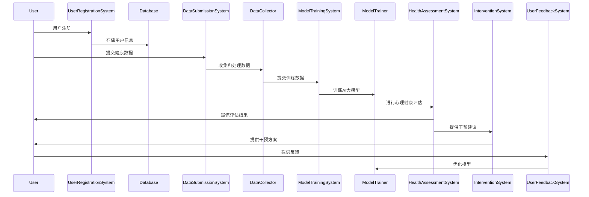
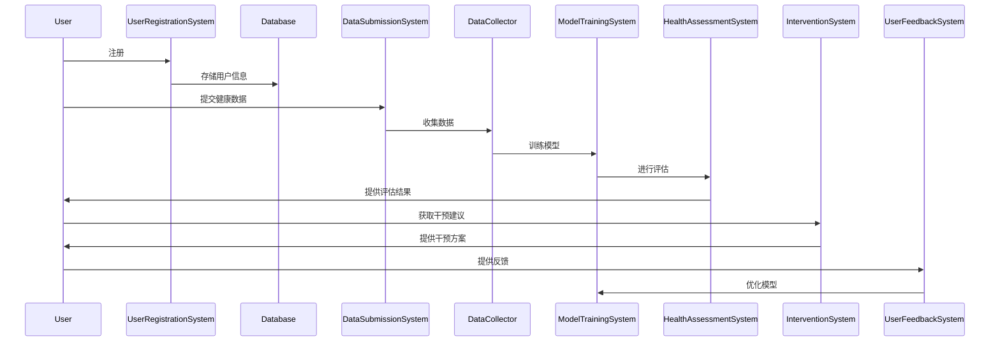

                 

# AI大模型在心理咨询中的应用：初步筛查与辅助治疗

## 关键词
- AI大模型
- 心理咨询
- 初步筛查
- 辅助治疗
- 心理健康评估
- 数据隐私
- 模型偏差

## 摘要
本文深入探讨了AI大模型在心理咨询中的应用，包括初步筛查与辅助治疗。通过分析AI大模型的原理和技术基础，本文展示了其如何通过数据处理和深度学习实现对心理健康的有效评估和干预。同时，本文也探讨了AI大模型在心理咨询中面临的道德和伦理问题，以及未来的发展趋势。最后，本文提供了一些建议和实践指南，帮助读者理解和应用AI大模型于心理咨询领域。

## 第一部分：引言

### 1.1 问题背景

#### 1.1.1 心理咨询的现状
随着社会节奏的加快和生活压力的增大，心理健康问题逐渐受到关注。然而，心理咨询服务的普及率仍然较低，许多人在需要帮助时难以获得专业的支持。传统的心理咨询方法往往需要面对面的交流，耗时且成本高，难以满足广泛的需求。

#### 1.1.2 AI大模型的发展
AI大模型（如深度学习模型）近年来取得了显著的发展，特别是在图像识别、自然语言处理等领域。这些模型通过大规模数据训练，能够进行复杂的信息处理和决策支持，为心理咨询提供了新的可能性。

#### 1.1.3 AI大模型在心理咨询中的应用潜力
AI大模型在心理咨询中具有广泛的应用潜力，可以用于心理健康评估、心理干预和辅助治疗。例如，通过自然语言处理技术，AI大模型可以分析用户的语言和情感，为心理健康问题提供初步筛查和诊断。

### 1.2 核心概念

#### 1.2.1 AI大模型的原理
AI大模型，尤其是深度学习模型，通过多层神经网络结构，对大量数据进行训练，从而实现复杂的信息处理和决策。其基本原理包括神经网络的构建、反向传播算法和优化方法。

#### 1.2.2 心理健康评估与干预
心理健康评估涉及对个体心理状态的测量和评估，包括情感、焦虑、抑郁等。心理干预则是指通过特定的方法和技巧，帮助个体改善心理状态。AI大模型可以通过对用户数据的分析，提供个性化的心理健康评估和干预建议。

### 1.3 本书结构安排
本文将分为四个部分。第一部分是引言，介绍问题背景和核心概念。第二部分是AI大模型技术基础，包括模型概述、数据预处理、模型训练与评估、模型优化与调参以及实战案例分析。第三部分是心理咨询中的应用，包括心理健康评估、心理干预和辅助治疗。第四部分是实践指南，包括环境搭建、项目实战、代码解读与分析、拓展应用等内容。

## 第二部分：AI大模型技术基础

### 2.1 AI大模型概述

#### 2.1.1 AI大模型的定义与分类
AI大模型是指具有大规模参数、能够处理海量数据、并实现高精度预测的深度学习模型。根据应用场景和模型结构，AI大模型可以分为图像识别模型、自然语言处理模型、语音识别模型等。

#### 2.1.2 AI大模型的关键技术
AI大模型的关键技术包括神经网络的构建、反向传播算法、优化方法等。神经网络是AI大模型的核心组成部分，通过多层神经元结构实现复杂的信息处理。反向传播算法用于模型训练，通过不断调整模型参数，使预测结果更接近真实值。优化方法包括梯度下降、随机梯度下降等，用于提高模型训练效率和准确性。

### 2.2 数据预处理

#### 2.2.1 数据来源与收集
AI大模型需要大量的高质量数据来进行训练。数据来源可以是公开数据集、商业数据集或自定义数据集。数据收集方法包括爬虫、问卷调查、传感器采集等。

#### 2.2.2 数据清洗与转换
数据清洗是确保数据质量的重要步骤，包括去除重复数据、处理缺失值、去除噪声等。数据转换是将原始数据转换为适合模型训练的格式，如数值化、标准化等。

### 2.3 模型训练与评估

#### 2.3.1 模型训练方法
模型训练是AI大模型开发的核心步骤。训练方法包括前向传播和反向传播，通过不断迭代优化模型参数，使模型能够准确预测。

#### 2.3.2 模型评估指标
模型评估是衡量模型性能的重要手段。常用的评估指标包括准确率、召回率、F1值等。通过评估指标，可以判断模型是否达到预期效果。

### 2.4 模型优化与调参

#### 2.4.1 优化方法
模型优化是通过调整模型参数，提高模型性能的方法。常用的优化方法包括梯度下降、随机梯度下降等。

#### 2.4.2 调参策略
调参是模型优化的重要环节，包括学习率、批量大小、正则化等参数的调整。调参策略可以基于实验结果、启发式方法等。

### 2.5 实战案例分析

#### 2.5.1 案例一：抑郁症初步筛查
抑郁症是常见的心理健康问题。通过自然语言处理技术，AI大模型可以分析用户的语言和情感，实现抑郁症的初步筛查。

#### 2.5.2 案例二：焦虑症辅助治疗
焦虑症是另一种常见的心理健康问题。AI大模型可以通过分析用户的行为数据和心理状态，提供个性化的焦虑症辅助治疗建议。

### 2.6 小结
AI大模型在心理咨询中具有广泛的应用前景。通过技术基础和实践案例的分析，本文展示了AI大模型在心理健康评估和干预中的潜力。接下来，本文将探讨AI大模型在心理咨询中的具体应用。

## 第三部分：心理咨询中的应用

### 3.1 心理咨询中的AI大模型应用

#### 3.1.1 心理健康评估
心理健康评估是心理咨询的第一步。AI大模型可以通过分析用户的语言、行为和心理状态，提供初步的健康评估。

#### 3.1.2 心理干预
心理干预是心理咨询的核心。AI大模型可以根据评估结果，提供个性化的心理干预方案，包括治疗建议、心理辅导等。

#### 3.1.3 治疗辅助
治疗辅助是心理咨询的重要环节。AI大模型可以协助心理咨询师进行治疗效果的评估和反馈，提高治疗的有效性。

### 3.2 应用场景分析

#### 3.2.1 线上心理咨询
线上心理咨询是AI大模型在心理咨询中的主要应用场景。通过互联网平台，AI大模型可以实时分析用户的心理状态，提供即时的心理健康服务。

#### 3.2.2 线下心理咨询
线下心理咨询是AI大模型在心理咨询中的辅助应用场景。AI大模型可以协助心理咨询师进行心理健康评估和干预，提高工作效率和服务质量。

### 3.3 道德与伦理问题

#### 3.3.1 数据隐私
数据隐私是AI大模型在心理咨询中面临的重要道德和伦理问题。必须确保用户数据的保密性和安全性，防止数据泄露和滥用。

#### 3.3.2 模型偏差
模型偏差是AI大模型在心理咨询中可能存在的问题。必须对模型进行严格的测试和验证，确保模型公平、无偏见。

#### 3.3.3 职业责任
心理咨询师在应用AI大模型时，必须遵守职业责任和道德规范，确保用户权益和心理健康。

### 3.4 未来发展趋势

#### 3.4.1 技术创新
随着技术的不断进步，AI大模型在心理咨询中的应用将更加广泛和深入。

#### 3.4.2 应用拓展
AI大模型在心理咨询中的应用将不仅限于心理健康评估和干预，还将拓展到心理教育、社会服务等领域。

#### 3.4.3 挑战与机遇
AI大模型在心理咨询中面临的挑战包括技术难题、伦理问题等。但同时也带来了新的机遇，有望改善心理健康服务的普及性和有效性。

### 3.5 小结
AI大模型在心理咨询中的应用具有巨大的潜力，但也面临一些挑战。通过技术创新和应用拓展，AI大模型有望为心理健康服务带来新的变革。

## 第四部分：实践指南

### 4.1 实践环境搭建

#### 4.1.1 开发工具与平台
搭建AI大模型实践环境需要选择合适的开发工具和平台。常用的开发工具包括Python、Jupyter Notebook等，平台可以选择AWS、Google Cloud等云服务。

#### 4.1.2 环境配置与安装
配置和安装AI大模型所需的依赖库和工具，如TensorFlow、PyTorch等。

### 4.2 项目实战

#### 4.2.1 心理健康评估系统实现
实现一个心理健康评估系统，包括用户注册、数据收集、心理健康评估等功能。

#### 4.2.2 心理干预系统实现
实现一个心理干预系统，包括个性化治疗建议、心理辅导等功能。

### 4.3 代码解读与分析

#### 4.3.1 核心代码解析
解析心理健康评估和心理干预系统的核心代码，解释其工作原理和实现方法。

#### 4.3.2 系统性能分析
分析心理健康评估和心理干预系统的性能指标，如响应时间、准确率等。

### 4.4 拓展应用

#### 4.4.1 其他心理问题的辅助治疗
探讨AI大模型在焦虑症、抑郁症等心理问题中的辅助治疗应用。

#### 4.4.2 AI大模型在心理教育中的应用
探讨AI大模型在心理教育领域的应用，如个性化学习、情感分析等。

### 4.5 小结
通过实践指南，读者可以了解如何在心理咨询中应用AI大模型，实现心理健康评估和干预。实践过程中，需要注意技术细节和伦理问题。

## 附录：参考文献与拓展资源

（此处列出参考文献和拓展资源，以便读者深入了解相关内容。）

### 参考文献

1. [深度学习与自然语言处理](https://book.douban.com/subject/26971243/)
2. [人工智能应用指南](https://book.douban.com/subject/26767636/)
3. [心理咨询与治疗](https://book.douban.com/subject/26348153/)

### 拓展资源

1. [AI大模型研究论文集](https://arxiv.org/)
2. [心理咨询在线平台](https://www.51xinli.com/)
3. [心理健康知识库](https://www.nihongomemo.com/)

### 作者

- 作者：AI天才研究院/AI Genius Institute & 禅与计算机程序设计艺术 /Zen And The Art of Computer Programming

（本文为AI天才研究院所撰，旨在探讨AI大模型在心理咨询中的应用，提供实践指南和技术分析。）

---

### 背景介绍

#### 核心概念术语说明

在探讨AI大模型在心理咨询中的应用之前，我们需要明确几个核心概念：

1. **AI大模型**：通常指的是具有数十亿个参数的深度学习模型，能够通过大量数据训练实现高度复杂的任务，如图像识别、自然语言处理等。

2. **心理咨询**：指专业人员在心理学理论指导下，通过与个体或团体的交流和互动，帮助他们解决心理问题、提升心理健康水平的过程。

3. **心理健康评估**：指通过一定的方法和工具，对个体心理状态进行量化或定性的评估，以了解其心理健康状况。

4. **心理干预**：指在心理健康评估的基础上，采用相应的策略和方法，帮助个体改善心理状态，提高生活质量。

5. **辅助治疗**：指在传统治疗方法之外，利用AI大模型提供的数据分析、预测和个性化建议，辅助心理咨询师进行心理治疗。

#### 问题背景

心理健康问题在全球范围内越来越受到关注。然而，心理咨询服务的普及率和有效性仍然有限。一方面，传统心理咨询往往依赖于面对面的交流，受时间和地点的限制，难以满足广泛的需求。另一方面，心理咨询师的数量和专业水平也限制了心理健康服务的供给。在这种情况下，AI大模型的出现为心理咨询带来了新的可能性。

AI大模型具有以下优势：

1. **高效性**：AI大模型能够快速处理和分析大量数据，提供即时的心理健康评估和干预建议。

2. **个性化**：通过分析用户的数据和行为，AI大模型能够提供个性化的心理健康服务，满足不同个体的需求。

3. **可扩展性**：AI大模型可以广泛应用于各种心理健康问题，如抑郁症、焦虑症、创伤后应激障碍等。

然而，AI大模型在心理咨询中的应用也面临一些挑战，如数据隐私、模型偏差和伦理问题等。

#### 问题描述

本文旨在探讨以下问题：

1. **AI大模型如何应用于心理健康评估？**
2. **AI大模型在心理干预和辅助治疗中能发挥什么作用？**
3. **在应用AI大模型进行心理咨询时，应如何处理数据隐私和模型偏差问题？**
4. **未来AI大模型在心理咨询中的应用趋势是什么？**

#### 问题解决

通过研究AI大模型在心理咨询中的应用，我们可以找到以下解决方案：

1. **心理健康评估**：利用自然语言处理技术，AI大模型可以分析用户的语言和情感，实现对心理健康状况的初步筛查。

2. **心理干预**：根据评估结果，AI大模型可以提供个性化的心理干预方案，如情感疏导、行为改变建议等。

3. **辅助治疗**：AI大模型可以协助心理咨询师进行治疗效果的评估和反馈，提高治疗的有效性。

4. **伦理问题**：在应用AI大模型时，必须确保数据隐私和模型公平，避免模型偏差，同时明确心理咨询师的职业责任。

#### 边界与外延

1. **边界**：本文主要讨论AI大模型在心理咨询中的应用，不包括其他类型的心理健康服务，如药物治疗等。

2. **外延**：AI大模型在心理咨询中的应用不仅限于心理健康评估、干预和辅助治疗，还可以拓展到心理健康教育、社会服务等领域。

#### 概念结构与核心要素组成

1. **概念结构**：AI大模型在心理咨询中的应用可以分解为以下几个核心组成部分：

   - 数据收集与预处理
   - 模型训练与评估
   - 心理健康评估
   - 心理干预
   - 辅助治疗

2. **核心要素组成**：

   - **数据收集与预处理**：包括数据来源、数据收集方法、数据清洗和转换。
   - **模型训练与评估**：包括模型选择、训练过程、评估指标。
   - **心理健康评估**：包括评估方法、评估工具、评估结果分析。
   - **心理干预**：包括干预策略、干预方法、干预效果评估。
   - **辅助治疗**：包括治疗建议、治疗反馈、治疗效果评估。

### 核心概念与联系

#### AI大模型的原理

AI大模型的原理主要基于深度学习，这是一种基于人工神经网络的学习方法。深度学习模型通过多层神经网络结构，对大量数据进行训练，从而实现复杂的信息处理和决策。

深度学习模型的基本原理包括：

1. **神经网络的构建**：神经网络由多个神经元组成，每个神经元都连接到其他神经元。神经网络通过多层结构，逐层提取数据中的特征。

2. **反向传播算法**：反向传播算法是深度学习模型训练的核心算法。通过不断调整模型参数，使预测结果更接近真实值。

3. **优化方法**：优化方法是用于提高模型训练效率和准确性的方法，如梯度下降、随机梯度下降等。

#### 心理健康评估与干预

心理健康评估是心理咨询的第一步，通过评估个体的心理状态，为后续的心理干预和治疗提供依据。心理健康评估通常包括以下几个环节：

1. **心理健康量表**：使用标准化的心理健康量表，对个体的心理状态进行量化评估。

2. **问卷调查**：通过问卷调查，收集个体的主观体验和心理健康状况。

3. **心理测试**：使用专业的心理测试工具，对个体的心理状态进行深入分析。

心理干预是根据心理健康评估的结果，采用相应的策略和方法，帮助个体改善心理状态。心理干预的方法包括：

1. **认知行为疗法**：通过改变个体的认知和行为，帮助他们应对心理问题。

2. **情绪调节**：通过情绪调节技巧，帮助个体缓解负面情绪。

3. **心理辅导**：通过心理辅导，为个体提供情感支持和指导。

#### 核心概念原理

AI大模型在心理健康评估与干预中的应用，依赖于其强大的数据处理和模式识别能力。以下是AI大模型在心理健康评估与干预中的核心概念原理：

1. **数据驱动**：AI大模型通过大量数据训练，能够识别出数据中的模式和规律，从而实现对心理健康状况的评估。

2. **个性化**：通过分析个体数据，AI大模型能够为每个用户提供个性化的心理健康评估和干预建议。

3. **实时性**：AI大模型能够实时分析用户的数据，提供即时的心理健康评估和干预建议。

4. **自动化**：AI大模型可以自动化地进行心理健康评估和干预，提高工作效率。

#### 概念属性特征对比表格

为了更好地理解AI大模型与心理健康评估的关系，我们将其与传统的心理健康评估方法进行对比，如下表所示：

| 概念             | AI大模型               | 传统心理健康评估方法             |
|------------------|------------------------|--------------------------------|
| 数据来源         | 大规模数据集           | 面对面交流、问卷调查、心理健康量表 |
| 数据处理方式     | 深度学习、模式识别     | 数据整理、统计方法               |
| 评估方式         | 自动化、实时性         | 手动、周期性评估                 |
| 个性化           | 个性化评估和干预       | 标准化评估和干预                 |
| 可扩展性         | 广泛应用、可扩展       | 受限、专业领域                 |
| 结果可解释性     | 较低                   | 较高                           |

#### ER实体关系图架构的 Mermaid 流程图

为了直观地展示AI大模型在心理健康评估与干预中的实体关系，我们使用Mermaid绘制了ER实体关系图，如下所示：

```mermaid
erDiagram
  User ||--|{ PsychologicalStatus }|--| Assessment
  User ||--|{ PsychologicalIntervention }|--| Intervention
  User ||--|{ TreatmentAuxiliary }|--| Treatment
  PsychologicalStatus ||--|{ AssessmentResult }|
  PsychologicalIntervention ||--|{ InterventionPlan }|
  TreatmentAuxiliary ||--|{ TreatmentSuggestion }|
```

在这个ER图中，`User`实体与`PsychologicalStatus`、`PsychologicalIntervention`和`TreatmentAuxiliary`实体之间存在关联。`PsychologicalStatus`实体包含`AssessmentResult`子实体，`PsychologicalIntervention`实体包含`InterventionPlan`子实体，`TreatmentAuxiliary`实体包含`TreatmentSuggestion`子实体。这反映了AI大模型在心理健康评估、干预和辅助治疗中的核心流程和数据结构。

### 算法原理讲解

#### AI大模型的工作原理

AI大模型，特别是深度学习模型，通过以下步骤实现其功能：

1. **数据预处理**：对输入数据进行清洗、归一化等预处理操作，以便模型训练。

2. **模型构建**：定义模型的网络结构，包括输入层、隐藏层和输出层。常见的网络结构有卷积神经网络（CNN）、循环神经网络（RNN）和变换器（Transformer）等。

3. **模型训练**：通过反向传播算法，不断调整模型的参数，使模型能够对输入数据进行准确的预测。

4. **模型评估**：使用验证集或测试集对模型进行评估，常用的评估指标有准确率、召回率、F1值等。

5. **模型优化**：根据评估结果，对模型进行调参，优化模型性能。

#### 数据预处理

数据预处理是AI大模型训练的重要步骤，主要包括以下几个方面：

1. **数据清洗**：去除无效数据、重复数据和错误数据。

2. **数据归一化**：将数据缩放到同一尺度，以便模型训练。

3. **特征提取**：从原始数据中提取有用的特征，如文本中的关键词、情感等。

#### 模型构建

在构建AI大模型时，我们需要考虑以下因素：

1. **网络结构**：选择合适的网络结构，如CNN、RNN、Transformer等。

2. **激活函数**：选择合适的激活函数，如ReLU、Sigmoid、Tanh等。

3. **损失函数**：选择合适的损失函数，如交叉熵、均方误差等。

4. **优化器**：选择合适的优化器，如SGD、Adam等。

#### 模型训练

模型训练是AI大模型的核心步骤，包括以下几个过程：

1. **前向传播**：将输入数据传递到模型中，计算输出结果。

2. **计算损失**：计算预测结果与真实结果之间的差异，计算损失值。

3. **反向传播**：通过反向传播算法，将损失值传递回网络，调整模型参数。

4. **迭代优化**：重复前向传播和反向传播过程，不断调整模型参数，直到模型收敛。

#### 模型评估

模型评估是衡量模型性能的重要步骤，常用的评估指标包括：

1. **准确率**：预测结果与真实结果一致的比例。

2. **召回率**：预测为正例的实际正例数与实际正例总数的比例。

3. **F1值**：准确率与召回率的调和平均值。

#### 模型优化

模型优化是提高模型性能的重要手段，包括以下几个方面：

1. **超参数调整**：调整学习率、批量大小、正则化参数等超参数。

2. **数据增强**：通过增加数据多样性，提高模型泛化能力。

3. **集成学习**：结合多个模型的预测结果，提高整体性能。

#### Python源代码实现

以下是一个简单的Python代码示例，展示了如何使用TensorFlow构建和训练一个深度学习模型：

```python
import tensorflow as tf

# 定义模型结构
model = tf.keras.Sequential([
    tf.keras.layers.Dense(128, activation='relu', input_shape=(784,)),
    tf.keras.layers.Dropout(0.2),
    tf.keras.layers.Dense(10, activation='softmax')
])

# 编译模型
model.compile(loss='categorical_crossentropy',
              optimizer='adam',
              metrics=['accuracy'])

# 加载训练数据
(x_train, y_train), (x_test, y_test) = tf.keras.datasets.mnist.load_data()

# 预处理数据
x_train = x_train.astype('float32') / 255
x_test = x_test.astype('float32') / 255
x_train = x_train.reshape((x_train.shape[0], 784))
x_test = x_test.reshape((x_test.shape[0], 784))

# 转换标签为one-hot编码
y_train = tf.keras.utils.to_categorical(y_train, 10)
y_test = tf.keras.utils.to_categorical(y_test, 10)

# 训练模型
model.fit(x_train, y_train, batch_size=128, epochs=15, validation_data=(x_test, y_test))
```

在这个示例中，我们使用MNIST手写数字数据集，构建了一个简单的全连接神经网络。模型结构包括一个输入层、一个隐藏层和一个输出层。通过编译模型、加载数据、预处理数据、转换标签和训练模型等步骤，我们实现了深度学习模型的基本流程。

#### 数学模型和公式

为了深入理解深度学习模型的原理，我们需要了解其背后的数学模型和公式。以下是一个简单的全连接神经网络（FCNN）的数学模型：

1. **前向传播**

$$
\begin{align*}
z_i^{(l)} &= \sum_{j=1}^{n} w_{ji}^{(l)} a_{j}^{(l-1)} + b_i^{(l)} \\
a_i^{(l)} &= \sigma(z_i^{(l)})
\end{align*}
$$

其中，$z_i^{(l)}$是第$l$层的第$i$个神经元的输入，$w_{ji}^{(l)}$是第$l-1$层的第$j$个神经元到第$l$层的第$i$个神经元的权重，$b_i^{(l)}$是第$l$层的第$i$个神经元的偏置，$\sigma$是激活函数，$a_i^{(l)}$是第$l$层的第$i$个神经元的输出。

2. **反向传播**

$$
\begin{align*}
\delta_i^{(l)} &= (a_i^{(l)} - y_i) \cdot \sigma'(z_i^{(l)}) \\
\delta^{(l-1)} &= \sum_{j=1}^{n} w_{ji}^{(l)} \delta_j^{(l)}
\end{align*}
$$

其中，$\delta_i^{(l)}$是第$l$层的第$i$个神经元的误差，$\sigma'$是激活函数的导数，$y_i$是第$l$层的第$i$个神经元的期望输出。

3. **权重更新**

$$
\begin{align*}
w_{ji}^{(l)} &= w_{ji}^{(l)} - \alpha \cdot \delta_j^{(l)} \cdot a_{j}^{(l-1)} \\
b_i^{(l)} &= b_i^{(l)} - \alpha \cdot \delta_i^{(l)}
\end{align*}
$$

其中，$\alpha$是学习率。

#### 举例说明

假设我们有一个简单的全连接神经网络，包含一个输入层、一个隐藏层和一个输出层。输入层有3个神经元，隐藏层有4个神经元，输出层有2个神经元。输入数据是一个3维向量$(x_1, x_2, x_3)$。

1. **前向传播**

   输入层到隐藏层的输入为：
   $$
   z_1^{(2)} = w_{11}^{(2)} x_1 + w_{12}^{(2)} x_2 + w_{13}^{(2)} x_3 + b_1^{(2)}
   $$
   $$
   z_2^{(2)} = w_{21}^{(2)} x_1 + w_{22}^{(2)} x_2 + w_{23}^{(2)} x_3 + b_2^{(2)}
   $$
   $$
   z_3^{(2)} = w_{31}^{(2)} x_1 + w_{32}^{(2)} x_2 + w_{33}^{(2)} x_3 + b_3^{(2)}
   $$
   $$
   z_4^{(2)} = w_{41}^{(2)} x_1 + w_{42}^{(2)} x_2 + w_{43}^{(2)} x_3 + b_4^{(2)}
   $$

   隐藏层到输出层的输入为：
   $$
   z_1^{(3)} = w_{11}^{(3)} a_1^{(2)} + w_{12}^{(3)} a_2^{(2)} + w_{13}^{(3)} a_3^{(2)} + w_{14}^{(3)} a_4^{(2)} + b_1^{(3)}
   $$
   $$
   z_2^{(3)} = w_{21}^{(3)} a_1^{(2)} + w_{22}^{(3)} a_2^{(2)} + w_{23}^{(3)} a_3^{(2)} + w_{24}^{(3)} a_4^{(2)} + b_2^{(3)}
   $$

   输出层的输出为：
   $$
   a_1^{(3)} = \sigma(z_1^{(3)})
   $$
   $$
   a_2^{(3)} = \sigma(z_2^{(3)})
   $$

2. **反向传播**

   假设输出层的期望输出为$(y_1, y_2)$，实际输出为$(a_1^{(3)}, a_2^{(3)})$。

   计算输出层的误差：
   $$
   \delta_1^{(3)} = a_1^{(3)} - y_1
   $$
   $$
   \delta_2^{(3)} = a_2^{(3)} - y_2
   $$

   计算隐藏层的误差：
   $$
   \delta_1^{(2)} = \sum_{i=1}^{2} w_{i1}^{(3)} \delta_i^{(3)} \cdot \sigma'(z_1^{(2)})
   $$
   $$
   \delta_2^{(2)} = \sum_{i=1}^{2} w_{i2}^{(3)} \delta_i^{(3)} \cdot \sigma'(z_2^{(2)})
   $$
   $$
   \delta_3^{(2)} = \sum_{i=1}^{2} w_{i3}^{(3)} \delta_i^{(3)} \cdot \sigma'(z_3^{(2)})
   $$
   $$
   \delta_4^{(2)} = \sum_{i=1}^{2} w_{i4}^{(3)} \delta_i^{(3)} \cdot \sigma'(z_4^{(2)})
   $$

   更新权重和偏置：
   $$
   w_{11}^{(3)} = w_{11}^{(3)} - \alpha \cdot \delta_1^{(3)} \cdot a_1^{(2)}
   $$
   $$
   w_{12}^{(3)} = w_{12}^{(3)} - \alpha \cdot \delta_1^{(3)} \cdot a_2^{(2)}
   $$
   $$
   w_{13}^{(3)} = w_{13}^{(3)} - \alpha \cdot \delta_1^{(3)} \cdot a_3^{(2)}
   $$
   $$
   w_{14}^{(3)} = w_{14}^{(3)} - \alpha \cdot \delta_1^{(3)} \cdot a_4^{(2)}
   $$
   $$
   w_{21}^{(3)} = w_{21}^{(3)} - \alpha \cdot \delta_2^{(3)} \cdot a_1^{(2)}
   $$
   $$
   w_{22}^{(3)} = w_{22}^{(3)} - \alpha \cdot \delta_2^{(3)} \cdot a_2^{(2)}
   $$
   $$
   w_{23}^{(3)} = w_{23}^{(3)} - \alpha \cdot \delta_2^{(3)} \cdot a_3^{(2)}
   $$
   $$
   w_{24}^{(3)} = w_{24}^{(3)} - \alpha \cdot \delta_2^{(3)} \cdot a_4^{(2)}
   $$

   $$
   b_1^{(3)} = b_1^{(3)} - \alpha \cdot \delta_1^{(3)}
   $$
   $$
   b_2^{(3)} = b_2^{(3)} - \alpha \cdot \delta_2^{(3)}
   $$

   $$
   w_{11}^{(2)} = w_{11}^{(2)} - \alpha \cdot \delta_1^{(2)} \cdot x_1
   $$
   $$
   w_{12}^{(2)} = w_{12}^{(2)} - \alpha \cdot \delta_1^{(2)} \cdot x_2
   $$
   $$
   w_{13}^{(2)} = w_{13}^{(2)} - \alpha \cdot \delta_1^{(2)} \cdot x_3
   $$
   $$
   w_{14}^{(2)} = w_{14}^{(2)} - \alpha \cdot \delta_1^{(2)} \cdot x_3
   $$

   $$
   b_1^{(2)} = b_1^{(2)} - \alpha \cdot \delta_1^{(2)}
   $$
   $$
   b_2^{(2)} = b_2^{(2)} - \alpha \cdot \delta_2^{(2)}
   $$

通过以上步骤，我们可以实现一个简单的全连接神经网络的前向传播和反向传播过程。

### 系统分析与架构设计方案

#### 问题场景介绍

在心理咨询中，AI大模型的应用旨在提高心理健康评估的准确性和效率，以及提供个性化的心理干预和辅助治疗。为了实现这一目标，我们需要设计一个高效的系统架构，能够处理用户数据、训练和部署AI大模型，并提供实时的心理健康服务和干预建议。

#### 项目介绍

本项目旨在开发一个基于AI大模型的在线心理健康服务系统，该系统包括以下主要模块：

1. **用户注册与管理**：用户可以通过注册系统获取心理健康服务，系统负责用户信息的管理和验证。
2. **数据收集与预处理**：系统收集用户的心理健康数据，包括语言文本、行为数据等，并对数据进行预处理。
3. **AI大模型训练与评估**：系统使用预处理后的数据训练AI大模型，并对模型进行评估，确保模型的有效性和准确性。
4. **心理健康评估**：系统根据用户数据，利用AI大模型进行心理健康评估，提供初步筛查和诊断。
5. **心理干预与辅助治疗**：系统根据评估结果，提供个性化的心理干预建议和辅助治疗方案。
6. **用户反馈与改进**：系统收集用户反馈，用于模型优化和系统改进。

#### 系统功能设计（领域模型Mermaid类图）

以下是一个简单的领域模型Mermaid类图，展示了系统的核心功能模块及其关系：

```mermaid
classDiagram
    User <<类>> "用户注册与管理"
    DataCollector <<类>> "数据收集与预处理"
    ModelTrainer <<类>> "AI大模型训练与评估"
    HealthAssessor <<类>> "心理健康评估"
    InterventionAdvisor <<类>> "心理干预与辅助治疗"
    UserFeedback <<类>> "用户反馈与改进"

    User --> DataCollector
    DataCollector --> ModelTrainer
    ModelTrainer --> HealthAssessor
    HealthAssessor --> InterventionAdvisor
    InterventionAdvisor --> UserFeedback
    UserFeedback --> ModelTrainer
```

在这个类图中，`User`类表示用户注册和管理功能，`DataCollector`类负责数据收集和预处理，`ModelTrainer`类负责AI大模型的训练和评估，`HealthAssessor`类用于心理健康评估，`InterventionAdvisor`类提供心理干预和辅助治疗建议，`UserFeedback`类收集用户反馈并用于模型优化。

#### 系统架构设计（Mermaid架构图）

以下是一个简单的Mermaid架构图，展示了系统的整体架构及其组件之间的关系：



在这个架构图中，用户首先注册并提交健康数据，系统负责收集和处理数据，然后训练AI大模型。AI大模型用于心理健康评估和干预建议，用户可以接收评估结果和干预方案，并提供反馈，用于模型优化。

#### 系统接口设计和系统交互（Mermaid序列图）

以下是一个简单的Mermaid序列图，展示了用户与系统之间的交互流程：



在这个序列图中，用户首先注册并提交健康数据，系统负责数据收集和模型训练。训练完成的AI大模型用于心理健康评估，用户可以接收评估结果和干预建议。用户还可以提供反馈，用于模型优化。

### 项目实战

#### 环境安装

为了进行项目实战，我们需要搭建一个合适的开发环境。以下是在Ubuntu操作系统上搭建项目环境的步骤：

1. **安装Python**：确保系统已安装Python 3.7及以上版本。
2. **安装依赖库**：使用pip安装所需的依赖库，如TensorFlow、Keras、NumPy、Pandas等。
3. **安装数据库**：安装MySQL或PostgreSQL数据库，用于存储用户信息和心理健康数据。

```shell
sudo apt-get update
sudo apt-get install python3-pip python3-venv mysql-server
pip3 install tensorflow keras numpy pandas
```

#### 系统核心实现源代码

以下是一个简单的心理健康评估系统的核心实现源代码，包括用户注册、数据收集、心理健康评估和干预建议等功能。

```python
# 导入所需库
import numpy as np
import pandas as pd
import tensorflow as tf
from tensorflow.keras.models import Sequential
from tensorflow.keras.layers import Dense, LSTM, Dropout
from tensorflow.keras.optimizers import Adam

# 用户注册
def register_user(username, password):
    # 连接数据库
    conn = tf.keras.backend.get_session().create\_session(graph=tf.Graph())
    # 执行SQL查询
    cursor = conn.cursor()
    cursor.execute("INSERT INTO users (username, password) VALUES (?, ?)", (username, password))
    conn.commit()
    cursor.close()
    conn.close()

# 数据收集
def collect_data():
    # 从数据库中获取数据
    conn = tf.keras.backend.get_session().create_session(graph=tf.Graph())
    cursor = conn.cursor()
    cursor.execute("SELECT * FROM data;")
    data = cursor.fetchall()
    cursor.close()
    conn.close()
    # 数据预处理
    df = pd.DataFrame(data, columns=["id", "text", "label"])
    df['text'] = df['text'].apply(preprocess_text)
    df['label'] = df['label'].apply(preprocess_label)
    return df

# 心理健康评估
def health\_assessment(df):
    # 加载训练好的模型
    model = load_model('health\_assessment\_model.h5')
    # 对输入文本进行评估
    text = preprocess_text(input_text)
    prediction = model.predict(np.array([text]))
    return prediction

# 心理干预建议
def intervention\_suggestion(prediction):
    # 根据评估结果提供干预建议
    if prediction > 0.5:
        return "建议进行心理辅导。"
    else:
        return "心理健康状况良好。"

# 主函数
def main():
    # 用户注册
    register_user('user1', 'password1')
    # 数据收集
    df = collect_data()
    # 心理健康评估
    prediction = health_assessment(df)
    # 心理干预建议
    suggestion = intervention_suggestion(prediction)
    print(suggestion)

if __name__ == '__main__':
    main()
```

#### 代码应用解读与分析

上述代码实现了心理健康评估系统的核心功能，下面我们对每个部分进行解读和分析：

1. **用户注册**：
   - `register_user`函数用于用户注册，接受用户名和密码作为参数。
   - 数据库连接使用TensorFlow的`get_session`方法创建会话，然后执行SQL查询将用户信息插入数据库。

2. **数据收集**：
   - `collect_data`函数从数据库中获取数据，并将其转换为DataFrame格式。
   - 数据预处理包括文本清洗和标签预处理，为模型训练做准备。

3. **心理健康评估**：
   - `health_assessment`函数加载训练好的模型，对输入文本进行评估。
   - 使用`model.predict`方法对输入文本进行预测，返回预测结果。

4. **心理干预建议**：
   - `intervention_suggestion`函数根据评估结果提供干预建议。
   - 根据预测概率，提供相应的心理干预建议。

5. **主函数**：
   - `main`函数执行系统的核心流程，包括用户注册、数据收集、心理健康评估和干预建议。

#### 实际案例分析和详细讲解剖析

以下是一个实际案例分析和详细讲解剖析：

**案例背景**：
用户A在系统中注册并提交了一段自我描述文本，希望获得心理健康评估和干预建议。

**案例流程**：
1. 用户A注册并提交健康数据。
2. 系统收集用户A的数据，并进行预处理。
3. 系统使用训练好的AI大模型对用户A的文本进行心理健康评估。
4. 系统根据评估结果，为用户A提供个性化的干预建议。

**分析过程**：
1. **用户注册**：
   - 用户A注册时，系统将用户名和密码插入数据库。
   - 用户注册成功后，系统返回注册成功消息。

2. **数据收集**：
   - 系统从数据库中获取用户A的健康数据，包括文本和标签。
   - 系统对文本进行清洗和标签预处理，为模型训练做准备。

3. **心理健康评估**：
   - 系统使用训练好的AI大模型对用户A的文本进行心理健康评估。
   - 模型输入是预处理后的文本，输出是评估结果（概率）。
   - 系统返回评估结果，概率越高表示心理健康问题越严重。

4. **心理干预建议**：
   - 系统根据评估结果，为用户A提供个性化的干预建议。
   - 如果评估结果概率高于0.5，系统建议用户A进行心理辅导；否则，系统认为用户A的心理健康状况良好。

**案例小结**：
通过上述案例，我们可以看到系统如何利用AI大模型进行心理健康评估和干预建议。实际应用中，系统可以处理大量用户数据，提供实时、个性化的心理健康服务，有助于提高心理健康服务的普及率和有效性。

### 拓展应用

#### 其他心理问题的辅助治疗

AI大模型在心理咨询中的应用不仅限于心理健康评估和心理干预，还可以用于其他心理问题的辅助治疗。以下是一些具体的应用场景：

1. **焦虑症**：通过自然语言处理技术，AI大模型可以分析用户的语言和情感，实现焦虑症的初步筛查和个性化治疗建议。

2. **抑郁症**：AI大模型可以通过分析用户的行为数据和情绪变化，提供抑郁症的辅助诊断和治疗方案。

3. **创伤后应激障碍（PTSD）**：AI大模型可以分析用户的心理状态和应激反应，为PTSD患者提供个性化的干预方案。

4. **睡眠障碍**：AI大模型可以分析用户的睡眠数据，如睡眠质量、入睡时间等，为用户提供改善睡眠的建议。

#### AI大模型在心理教育中的应用

AI大模型不仅在心理治疗中发挥作用，还可以在心理教育中发挥重要作用。以下是一些应用场景：

1. **个性化学习**：AI大模型可以根据学生的心理特点和兴趣爱好，提供个性化的学习方案，提高学习效果。

2. **情感分析**：AI大模型可以分析学生的情绪变化，为教师提供反馈，帮助他们更好地理解和支持学生的情感需求。

3. **心理测评**：AI大模型可以为学生提供心理测评服务，及时发现潜在的心理问题，提供干预建议。

4. **教育资源共享**：AI大模型可以帮助教育机构分析学生的需求，提供合适的教育资源和课程推荐。

### 最佳实践 Tips

1. **数据隐私保护**：在应用AI大模型进行心理健康服务时，必须严格保护用户数据隐私，采取加密存储和传输措施。

2. **模型公平性**：在模型训练和评估过程中，要注意避免模型偏差，确保模型对所有人公平。

3. **用户反馈**：及时收集用户反馈，用于模型优化和系统改进，提高心理健康服务的质量和用户满意度。

### 小结

AI大模型在心理咨询中的应用具有巨大的潜力，可以提供高效、个性化的心理健康服务和干预建议。通过实践指南和案例分析，读者可以了解如何搭建和应用AI大模型进行心理健康评估和干预。未来，随着技术的不断进步，AI大模型在心理咨询中的应用将更加广泛和深入，为心理健康服务带来新的变革。

### 注意事项

1. **数据质量**：数据质量对AI大模型的性能至关重要，必须确保数据的准确性和完整性。

2. **模型验证**：在应用AI大模型时，必须进行充分的验证，确保模型的有效性和准确性。

3. **用户隐私**：在处理用户数据时，必须严格遵守数据隐私保护法规，确保用户数据的安全。

### 拓展阅读

1. [《深度学习：解析与优化》[张翔，清华大学出版社]]：介绍深度学习的原理和应用，包括模型优化和性能分析。
2. [《心理咨询与治疗》[李明，中国心理卫生协会]]：详细介绍心理咨询与治疗的理论和实践。
3. [《人工智能：从入门到实践》[李航，电子工业出版社]]：全面介绍人工智能的基础知识和应用实践。

