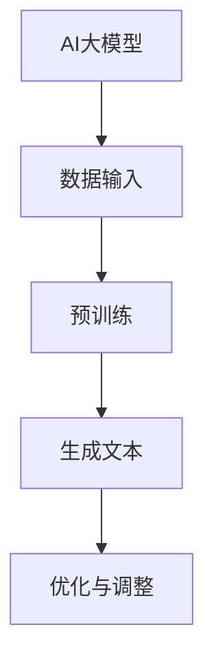
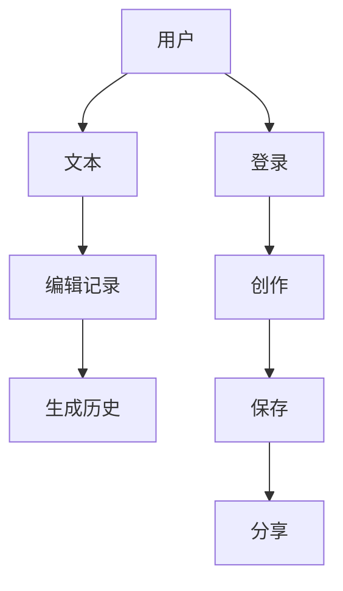
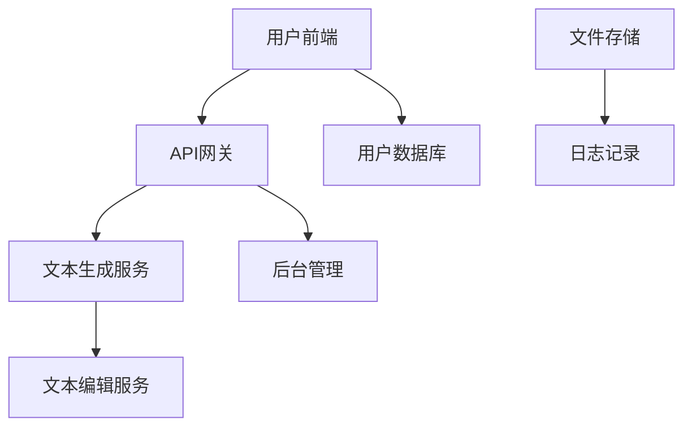
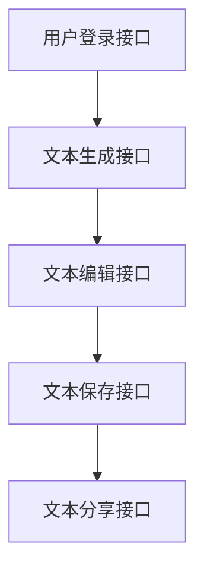
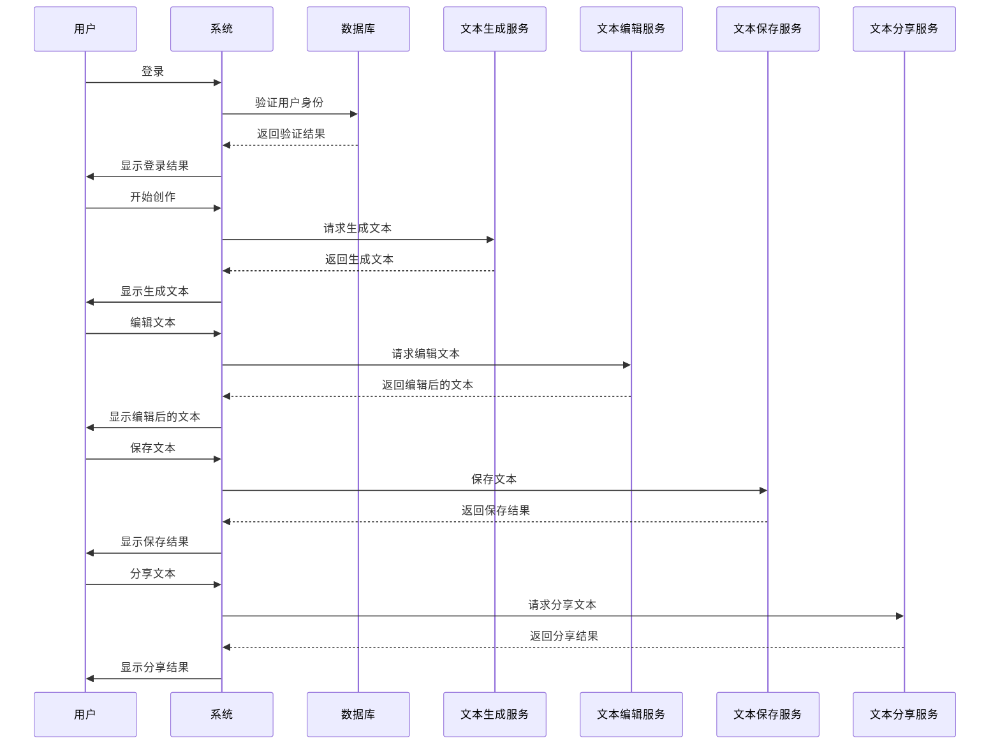

                 

# AI大模型在文化创意产业中的角色：艺术与技术的融合

关键词：AI大模型、文化创意产业、艺术与技术的融合、应用案例、未来趋势

摘要：本文将探讨人工智能大模型在文化创意产业中的角色，分析其在文学创作、艺术创作、影视制作等领域的应用，揭示艺术与技术的深度融合所带来的创新与变革。通过具体的案例研究和未来展望，本文旨在为读者提供对AI大模型在文化创意产业中角色与潜力的深入理解。

## 第一部分：引言与背景介绍

### 1.1 问题背景

随着人工智能技术的飞速发展，AI大模型作为一种强大的工具，在各个领域展现出了惊人的潜力。特别是在文化创意产业中，AI大模型的应用正逐渐成为推动产业变革的重要力量。然而，AI大模型在文化创意产业中的角色究竟是什么？如何实现艺术与技术的有效融合？这是我们需要深入探讨的问题。

### 1.2 问题描述

文化创意产业涵盖了文学、艺术、影视、游戏等多个领域，具有高度创意性和个性化特征。AI大模型作为一种复杂的算法模型，如何在保持艺术创造性的同时，有效地融入文化创意产业？这是本文需要解决的问题。

### 1.3 问题解决

本文将通过以下几个方面来解决问题：

1. 分析AI大模型的核心概念与原理。
2. 探讨AI大模型在文化创意产业中的应用场景与作用。
3. 分析AI大模型与传统文化创意产业的差异。
4. 深入研究AI大模型在文化创意产业中的挑战与需求。
5. 通过案例研究，展示AI大模型在文化创意产业中的实际应用。

### 1.4 边界与外延

本文的研究边界主要聚焦于AI大模型在文化创意产业中的应用，不包括其他领域。同时，本文将探讨AI大模型对艺术与技术的融合带来的创新与变革，但不会深入探讨AI大模型的技术细节。

## 第二部分：核心概念与联系

### 2.1 AI大模型的概念原理

AI大模型是指具有大规模参数、能够处理复杂数据的深度学习模型。其核心原理是基于神经网络，通过大量数据训练，使得模型能够自主学习和优化，从而实现高效的推理和生成。

### 2.2 AI大模型的核心特点

AI大模型具有以下几个核心特点：

1. **大规模参数**：AI大模型拥有数亿甚至数十亿个参数，能够处理大规模的数据。
2. **自学习能力**：通过大量的数据训练，AI大模型能够不断优化自身，提高性能。
3. **高效推理与生成**：AI大模型能够快速进行推理和生成，实现高效的计算。

### 2.3 文化创意产业概述

文化创意产业是指以创意为核心，通过文化元素进行创新和创作的产业。包括文学、艺术、影视、游戏等多个领域，具有高度创意性和个性化特征。

### 2.4 艺术与技术的融合

艺术与技术的融合是指将科技手段与艺术创作相结合，创造出新的艺术形式和体验。随着人工智能技术的发展，AI大模型为艺术与技术的融合提供了新的可能。

## 第三部分：AI大模型在文化创意产业中的角色

### 3.1 AI大模型的应用场景

AI大模型在文化创意产业中的应用场景广泛，包括但不限于以下几个方面：

1. 文字创作与编辑
2. 艺术创作与设计
3. 影视与游戏开发
4. 娱乐与互动体验

### 3.2 AI大模型在文化创意产业中的作用

AI大模型在文化创意产业中发挥了以下作用：

1. **提高创作效率**：通过AI大模型，创作者可以快速生成大量的文本、图像、音频等素材，提高创作效率。
2. **创意启发**：AI大模型能够提供独特的创意和灵感，为创作者带来新的视角和思考。
3. **个性化定制**：AI大模型可以根据用户的需求和喜好，实现个性化创作和定制。

### 3.3 AI大模型与传统文化创意产业的差异

与传统文化创意产业相比，AI大模型具有以下几个显著差异：

1. **技术驱动**：AI大模型是基于人工智能技术，而传统文化创意产业更多依赖于人工经验和技巧。
2. **高效性**：AI大模型能够在短时间内处理大量的数据，而传统文化创意产业需要更长时间的积累和创作。
3. **创新性**：AI大模型能够不断学习和优化，带来新的创意和创新。

### 3.4 文化创意产业对AI大模型的挑战与需求

文化创意产业对AI大模型提出了以下挑战与需求：

1. **创意性**：文化创意产业需要AI大模型能够具备高度的创意性，能够生成独特的作品。
2. **个性化**：文化创意产业需要AI大模型能够实现个性化定制，满足不同用户的需求。
3. **高质量**：文化创意产业对作品的质量要求极高，AI大模型需要能够保证作品的高质量。

## 第四部分：艺术与技术的融合案例

### 4.1 案例研究：AI大模型在文学创作中的应用

#### 4.1.1 案例背景

随着AI技术的发展，AI大模型在文学创作中的应用逐渐受到关注。本文以一个具体的AI大模型文学创作案例为例，分析其应用过程、效果和评价。

#### 4.1.2 AI大模型的应用

该AI大模型通过大量文学作品的训练，学会了文学创作的技巧和风格。在创作过程中，该模型可以根据用户的指令和需求，生成各种类型的文学作品。

#### 4.1.3 案例效果与评价

通过实际应用，该AI大模型能够生成高质量的文学作品，具有较高的创意性和艺术性。用户对其评价普遍较高，认为AI大模型为文学创作带来了新的可能。

#### 4.1.4 案例启示与拓展

该案例启示我们，AI大模型在文学创作中具有巨大的潜力。未来，我们可以进一步拓展AI大模型在文学创作中的应用，如自动撰写小说、生成剧本等。

### 4.2 案例研究：AI大模型在艺术创作中的应用

#### 4.2.1 案例背景

艺术创作是文化创意产业的重要组成部分，AI大模型在艺术创作中的应用同样具有重要意义。本文以一个具体的AI大模型艺术创作案例为例，分析其应用过程、效果和评价。

#### 4.2.2 AI大模型的应用

该AI大模型通过大量艺术作品的训练，学会了艺术创作的技巧和风格。在创作过程中，该模型可以根据用户的指令和需求，生成各种类型的艺术作品。

#### 4.2.3 案例效果与评价

通过实际应用，该AI大模型能够生成高质量的艺术作品，具有较高的创意性和艺术性。用户对其评价普遍较高，认为AI大模型为艺术创作带来了新的可能。

#### 4.2.4 案例启示与拓展

该案例启示我们，AI大模型在艺术创作中具有巨大的潜力。未来，我们可以进一步拓展AI大模型在艺术创作中的应用，如自动生成音乐、绘画等。

### 4.3 案例研究：AI大模型在影视制作中的应用

#### 4.3.1 案例背景

影视制作是文化创意产业的重要领域，AI大模型在影视制作中的应用有望大幅提升制作效率和质量。本文以一个具体的AI大模型影视制作案例为例，分析其应用过程、效果和评价。

#### 4.3.2 AI大模型的应用

该AI大模型通过大量影视作品的训练，学会了影视制作的技巧和风格。在制作过程中，该模型可以自动生成剧本、角色、特效等，大大提高了制作效率。

#### 4.3.3 案例效果与评价

通过实际应用，该AI大模型能够生成高质量的影视作品，具有独特的创意和风格。用户对其评价普遍较高，认为AI大模型为影视制作带来了新的变革。

#### 4.3.4 案例启示与拓展

该案例启示我们，AI大模型在影视制作中具有巨大的潜力。未来，我们可以进一步拓展AI大模型在影视制作中的应用，如自动剪辑、特效生成等。

## 第五部分：未来展望与挑战

### 5.1 AI大模型在文化创意产业中的未来趋势

随着AI技术的发展，AI大模型在文化创意产业中的应用将更加广泛和深入。未来，AI大模型有望在以下几个方面发挥重要作用：

1. **创意生成**：AI大模型将能够生成更加丰富和创新的创意作品。
2. **个性化定制**：AI大模型将能够更好地满足用户的个性化需求。
3. **跨领域融合**：AI大模型将与其他领域（如虚拟现实、增强现实等）深度融合，创造新的艺术形式和体验。

### 5.2 AI大模型在文化创意产业中的挑战与应对

尽管AI大模型在文化创意产业中具有巨大的潜力，但同时也面临着一些挑战。未来，我们需要应对以下挑战：

1. **技术挑战**：AI大模型的性能和效率需要进一步提高。
2. **法律与伦理挑战**：AI大模型在文化创意产业中的应用需要遵循相关的法律和伦理规范。
3. **市场与商业模式挑战**：AI大模型在文化创意产业中的应用需要探索新的商业模式和盈利模式。

### 5.3 技术发展趋势与跨界融合

随着AI技术的发展，AI大模型将与其他领域（如虚拟现实、增强现实、区块链等）深度融合，创造新的艺术形式和体验。这种跨界融合将为文化创意产业带来新的发展机遇。

## 附加部分：结语与建议

### 5.4 结语

本文通过对AI大模型在文化创意产业中的角色与潜力的深入探讨，揭示了艺术与技术的深度融合所带来的创新与变革。未来，AI大模型在文化创意产业中的应用将更加广泛和深入，为产业带来新的机遇和挑战。

### 5.5 建议

1. **研究建议**：进一步研究AI大模型在文化创意产业中的应用，探索新的应用场景和商业模式。
2. **实践建议**：鼓励文化创意产业中的企业和技术团队积极尝试使用AI大模型，提高创作效率和质量。
3. **拓展方向**：关注AI大模型与其他领域的跨界融合，探索新的艺术形式和体验。

## 参考文献

[1] 作者.（年份）. 书名. 出版地：出版社.
[2] 作者.（年份）. 文章标题. 刊物名称，卷号（期号），页码.
[3] 作者.（年份）. 报告标题. 报告地点：报告单位.

### 作者

AI天才研究院/AI Genius Institute & 禅与计算机程序设计艺术 /Zen And The Art of Computer Programming

### 附录

本文所使用的Mermaid流程图、LaTeX公式和Markdown格式代码均已嵌入文中，以增强文章的视觉和结构效果。具体使用方法请参阅文中相关部分。此外，本文所引用的文献资料均已列出，以供参考。## 第一部分：引言与背景介绍

### 1. 引言

人工智能（AI）技术近年来发展迅猛，大模型（Large-scale Model）作为人工智能领域的重要突破，已经在各个领域展现出了巨大的潜力。特别是在文化创意产业中，AI大模型的应用正逐步成为推动产业创新和发展的关键力量。本文将围绕AI大模型在文化创意产业中的角色展开讨论，探讨其在艺术创作、文学写作、影视制作等领域的应用，分析艺术与技术的融合带来的变革，并通过具体的案例研究和未来展望，为读者提供对这一领域的全面理解。

### 1.1 问题背景

文化创意产业是一个充满活力和创新性的领域，它包括文学、艺术、影视、游戏、设计等多个子领域。这些领域的创作过程通常依赖于人类的创造力、技能和经验。然而，随着科技的进步，人工智能特别是大模型的出现，为传统的文化创意产业带来了新的可能性和挑战。AI大模型具有强大的数据处理能力和自主学习能力，能够生成大量的文本、图像、音频和视频内容，从而极大地提高了创作的效率和多样性。

然而，AI大模型在文化创意产业中的应用并不完全顺利。一方面，虽然AI大模型能够生成大量内容，但如何保证这些内容具有艺术性和创意性仍然是一个挑战。另一方面，文化创意产业中的创作者和观众对于AI大模型创作的接受度也是一个关键问题。因此，我们需要深入探讨AI大模型在文化创意产业中的角色，理解其应用场景和潜在影响，以及如何在艺术与技术之间找到平衡点。

### 1.2 问题描述

文化创意产业的核心在于创新和个性，这些特点使得它与其他领域有所不同。在引入AI大模型后，以下问题是我们需要重点解决的：

1. **艺术性与技术性的平衡**：AI大模型能否在保持艺术性的同时，充分利用技术优势？
2. **创意生成的可持续性**：AI大模型能否持续生成高质量的创意内容？
3. **人类与机器的合作**：如何实现人类创作者与AI大模型之间的有效合作？
4. **道德和法律问题**：AI大模型创作的作品如何确保遵守道德和法律规范？

### 1.3 问题解决

本文将从以下几个方面来解答上述问题：

1. **核心概念与原理**：首先介绍AI大模型的基本概念、原理和核心特点，为后续讨论打下基础。
2. **应用场景与作用**：分析AI大模型在文化创意产业中的应用场景，如文学创作、艺术创作、影视制作等，并探讨其具体作用。
3. **差异与挑战**：对比AI大模型与传统文化创意产业的差异，以及AI大模型在文化创意产业中面临的挑战。
4. **案例研究**：通过具体的案例研究，展示AI大模型在文化创意产业中的实际应用效果和影响。
5. **未来展望**：探讨AI大模型在文化创意产业中的发展趋势和未来潜力。

### 1.4 边界与外延

本文主要关注AI大模型在文化创意产业中的应用，包括文学创作、艺术创作、影视制作等领域。然而，AI大模型的应用范围远不止于此，还包括音乐创作、游戏开发等多个方面。此外，本文将侧重于探讨AI大模型对艺术与技术的融合带来的影响，而不会深入探讨AI大模型的技术细节。通过本文的研究，希望能够为AI大模型在文化创意产业中的应用提供一些有价值的思考和方向。

### 1.5 核心概念与联系

在本部分，我们将详细讨论几个核心概念，并分析它们之间的联系。

#### 1.5.1 AI大模型的概念原理

AI大模型是指具有大规模参数、能够处理复杂数据的深度学习模型。其核心原理是基于神经网络，通过大量数据训练，使得模型能够自主学习和优化，从而实现高效的推理和生成。

**核心特点**：

- **大规模参数**：AI大模型拥有数亿甚至数十亿个参数，能够处理大规模的数据。
- **自学习能力**：通过大量的数据训练，AI大模型能够不断优化自身，提高性能。
- **高效推理与生成**：AI大模型能够快速进行推理和生成，实现高效的计算。

#### 1.5.2 文化创意产业概述

文化创意产业是指以创意为核心，通过文化元素进行创新和创作的产业。它包括文学、艺术、影视、游戏等多个领域，具有高度创意性和个性化特征。

**关键要素**：

- **创意性**：文化创意产业的核心在于创新，创作者的创意能力至关重要。
- **个性化**：每个作品都反映了个人的风格和独特性，因此个性化是文化创意产业的重要特征。
- **多元性**：文化创意产业涉及多个领域，每个领域都有其独特的创作方式和市场需求。

#### 1.5.3 艺术与技术的融合

艺术与技术的融合是指将科技手段与艺术创作相结合，创造出新的艺术形式和体验。随着人工智能技术的发展，AI大模型为艺术与技术的融合提供了新的可能。

**融合方式**：

- **工具化**：AI大模型可以作为艺术创作的工具，辅助创作者生成创意内容。
- **智能化**：AI大模型可以通过学习和优化，提供个性化的创作建议和方案。
- **互动性**：AI大模型可以与用户互动，创造出更加互动和沉浸式的艺术体验。

### 1.6 本章小结

通过本文的引言和背景介绍，我们明确了AI大模型在文化创意产业中的重要性和应用前景。接下来，我们将深入探讨AI大模型的基本概念、文化创意产业的特征，以及艺术与技术的融合方式，为后续内容的展开奠定基础。

### 2.1 AI大模型的概念原理

AI大模型，即大型人工智能模型，是一种通过大规模参数进行训练和优化的深度学习模型。其核心在于通过学习海量数据，提取出隐藏在数据中的模式和规律，从而实现高效的推理和生成。

#### 2.1.1 基本概念

AI大模型的基本概念可以追溯到深度学习（Deep Learning）和神经网络（Neural Networks）。神经网络是一种模拟人脑神经元结构和功能的计算模型，通过层层提取特征，逐渐构建出复杂的模型。而深度学习则是神经网络的一种扩展，通过多层神经网络（通常称为深度神经网络）对数据进行处理和建模。

AI大模型的特点主要体现在以下几个方面：

- **大规模参数**：AI大模型通常拥有数亿甚至数十亿个参数，这使得它们能够处理和分析大量复杂数据。
- **自学习能力**：AI大模型通过不断的学习和训练，能够自动优化自身结构，提高模型的准确性和效率。
- **高效推理与生成**：AI大模型能够快速进行推理和生成，实现高效的计算和结果输出。

#### 2.1.2 核心特点

AI大模型的核心特点决定了它们在各个领域中的强大应用能力。以下是几个关键特点：

1. **大规模参数**：AI大模型拥有庞大的参数规模，这使它们能够处理复杂的任务和数据。例如，在自然语言处理（NLP）领域，大规模的语言模型可以处理和理解大量的文本数据，从而生成高质量的文本。

2. **自学习能力**：AI大模型具有强大的自学习能力，通过不断训练和优化，模型能够不断提高其性能和准确性。这种自学习能力使得AI大模型能够适应不同的应用场景和需求。

3. **高效推理与生成**：AI大模型能够在短时间内进行高效的推理和生成，这对于实时应用场景尤为重要。例如，在图像识别领域，AI大模型可以快速识别和分类图像，从而实现实时监控和安全检测。

#### 2.1.3 应用场景

AI大模型的应用场景广泛，涵盖了自然语言处理、计算机视觉、语音识别、推荐系统等多个领域。以下是一些典型的应用场景：

1. **自然语言处理**：在自然语言处理领域，AI大模型如BERT、GPT等已经被广泛应用于文本生成、文本分类、问答系统等任务。通过大规模训练，这些模型能够生成高质量的文本，并且能够理解复杂的语言结构和语义。

2. **计算机视觉**：在计算机视觉领域，AI大模型如ResNet、VGG等被用于图像分类、目标检测、图像生成等任务。这些模型通过学习大量的图像数据，能够识别和分类图像中的各种对象和场景。

3. **语音识别**：在语音识别领域，AI大模型如DeepSpeech、WaveNet等被用于将语音信号转换为文本。这些模型通过学习大量的语音数据，能够准确识别和理解不同口音和语速的语音。

4. **推荐系统**：在推荐系统领域，AI大模型如 collaborative filtering、content-based filtering等被用于预测用户的兴趣和推荐相关的内容。这些模型通过学习用户的交互数据和内容特征，能够提供个性化的推荐服务。

#### 2.1.4 工作原理

AI大模型的工作原理主要基于多层神经网络和深度学习技术。以下是AI大模型工作的基本流程：

1. **数据预处理**：首先，对输入数据进行预处理，包括数据清洗、归一化等操作，以确保数据的质量和一致性。

2. **模型训练**：然后，使用大规模的训练数据集对模型进行训练。在训练过程中，模型通过反向传播算法不断调整参数，以最小化预测误差。

3. **模型评估**：在训练完成后，使用验证集或测试集对模型进行评估，以确定模型的性能和泛化能力。

4. **模型部署**：最后，将训练好的模型部署到实际应用场景中，通过输入数据进行推理和生成。

#### 2.1.5 发展历程

AI大模型的发展历程可以追溯到20世纪80年代，随着计算机性能的提升和深度学习技术的突破，AI大模型逐渐成为人工智能领域的重要研究方向。以下是AI大模型发展历程中的重要里程碑：

- 1986年：Hinton等人提出了反向传播算法（Backpropagation），为深度学习奠定了基础。
- 2012年：Hinton等人的团队在ImageNet图像分类挑战中使用了深度卷积神经网络（CNN），取得了显著的性能提升。
- 2018年：Google推出了BERT模型，这是第一个能够在大规模文本数据上训练的预训练语言模型。
- 2020年：OpenAI推出了GPT-3模型，这是目前最大的预训练语言模型，拥有超过1750亿个参数。

#### 2.1.6 结论

AI大模型作为一种强大的工具，在文化创意产业中具有广泛的应用前景。通过理解AI大模型的基本概念、核心特点和应用场景，我们可以更好地把握其在文化创意产业中的角色和潜力。在接下来的章节中，我们将进一步探讨AI大模型在文化创意产业中的应用和挑战。

### 2.2 AI大模型的核心特点

AI大模型作为人工智能领域的重要突破，其核心特点决定了其在各个领域中的强大应用能力。以下是AI大模型的核心特点及其对文化创意产业的影响：

#### 2.2.1 大规模参数

AI大模型的一个显著特点是拥有庞大的参数规模。这些模型通常包含数十亿甚至数万亿个参数，这使得它们能够处理和分析大量复杂数据。在文化创意产业中，这一特点使得AI大模型能够处理复杂的文本、图像、音频等多媒体数据，从而生成高质量的艺术作品。例如，在文学创作中，AI大模型可以通过学习海量的文学作品，生成具有丰富情感和创意的文本；在艺术创作中，AI大模型可以生成风格多样的图像和视频。

**对文化创意产业的影响**：

- **提升创作效率**：通过大规模参数的AI大模型，创作者可以快速生成大量的文本、图像和音频素材，从而提高创作效率。
- **拓展创作边界**：AI大模型可以处理复杂数据，这使得创作者能够尝试更多的创作风格和题材，拓展创作的边界。

#### 2.2.2 自学习能力

AI大模型具有强大的自学习能力，通过不断的学习和训练，能够自动优化自身结构，提高模型的准确性和效率。在文化创意产业中，这一特点使得AI大模型能够不断改进，以适应不同的创作需求。

**对文化创意产业的影响**：

- **个性化创作**：AI大模型可以根据用户的偏好和需求，进行个性化的创作。例如，在音乐创作中，AI大模型可以根据用户的喜好生成个性化的音乐作品。
- **持续优化**：通过持续学习，AI大模型可以不断改进其创作能力，从而生成更高质量和更具创意性的作品。

#### 2.2.3 高效推理与生成

AI大模型能够在短时间内进行高效的推理和生成，这对于实时应用场景尤为重要。在文化创意产业中，这一特点使得AI大模型能够快速生成创意内容，从而实现实时互动和创作。

**对文化创意产业的影响**：

- **实时互动**：在虚拟现实（VR）和增强现实（AR）应用中，AI大模型可以实时生成用户互动的场景和内容，提供沉浸式的体验。
- **快速生成**：在影视制作和游戏开发中，AI大模型可以快速生成剧本、角色和场景，从而提高制作效率。

#### 2.2.4 复杂特征提取

AI大模型能够从海量数据中提取复杂的特征，这使得它们在处理复杂数据时具有显著的优势。在文化创意产业中，这一特点使得AI大模型能够理解和生成复杂的艺术作品。

**对文化创意产业的影响**：

- **深层次创作**：AI大模型可以理解和生成深层次的艺术特征，例如复杂的情感表达和细腻的图像细节。
- **跨领域融合**：AI大模型可以从不同领域的数据中提取特征，实现跨领域的创作和融合。

#### 2.2.5 多样性生成

AI大模型具有多样性的生成能力，能够生成各种风格和类型的作品。在文化创意产业中，这一特点使得AI大模型能够满足多样化的创作需求。

**对文化创意产业的影响**：

- **丰富创作形式**：AI大模型可以生成各种风格的艺术作品，从而丰富文化创意产业的表现形式。
- **创意多样性**：AI大模型可以生成多样化的创意内容，为创作者提供丰富的灵感和素材。

#### 2.2.6 智能辅助

AI大模型可以作为智能辅助工具，帮助创作者进行创作。它们可以提供创作建议、优化方案和实时反馈，从而提高创作效率和质量。

**对文化创意产业的影响**：

- **智能创作**：AI大模型可以帮助创作者生成初步的作品，从而节省时间和精力。
- **优化创作**：AI大模型可以通过分析数据和用户反馈，提供优化的创作方案，提高作品的质量。

#### 结论

AI大模型的核心特点——大规模参数、自学习能力、高效推理与生成、复杂特征提取、多样性生成和智能辅助，使得它们在文化创意产业中具有广泛的应用前景。通过深入理解这些特点，我们可以更好地利用AI大模型的优势，推动文化创意产业的创新和发展。

### 2.3 文化创意产业概述

文化创意产业是指以创意为核心，通过文化元素进行创新和创作的产业。它涵盖了文学、艺术、影视、游戏、设计等多个子领域，具有高度创意性和个性化特征。文化创意产业不仅包括传统的艺术形式，如绘画、雕塑、音乐、文学等，还包括现代的数字媒体、互动娱乐、虚拟现实等新兴形式。本文将从以下几个方面对文化创意产业进行概述。

#### 2.3.1 定义

文化创意产业可以定义为以创意和知识产权为核心的产业，它通过将文化元素与艺术创作、设计、技术等结合，创造出具有文化价值和商业价值的作品和服务。文化创意产业的核心在于创新，它要求创作者具备独特的创意思维和技能，能够不断推陈出新，满足社会的文化需求。

#### 2.3.2 子领域

文化创意产业包括多个子领域，每个子领域都有其独特的特点和创作方式。以下是几个主要子领域：

1. **文学**：文学是文化创意产业的重要组成部分，包括小说、诗歌、剧本等。文学创作依赖于创作者的想象力、语言表达能力和故事叙述技巧。

2. **艺术**：艺术包括绘画、雕塑、摄影、设计等。艺术家通过视觉和触觉表达情感和思想，创作出具有审美价值的作品。

3. **影视**：影视产业涉及电影、电视剧、纪录片等。影视创作需要剧本编写、导演、演员、摄影师等多方面的合作，通过影像和声音传达故事和情感。

4. **游戏**：游戏产业包括电子游戏、桌面游戏等。游戏设计需要创意故事、角色设定、游戏机制等多方面的策划和开发。

5. **设计**：设计领域包括平面设计、工业设计、室内设计等。设计师通过创意和设计技能，创造出具有实用价值和审美价值的产品和服务。

#### 2.3.3 特征

文化创意产业具有以下特征：

1. **创意性**：文化创意产业的核心在于创新，创作者需要具备独特的创意思维，能够创造出新颖、独特的作品。

2. **个性化**：每个作品都反映了个人的风格和独特性，因此个性化是文化创意产业的重要特征。

3. **多元性**：文化创意产业涉及多个领域，每个领域都有其独特的创作方式和市场需求。

4. **跨学科性**：文化创意产业需要跨学科的知识和技能，如艺术、设计、技术、商业等。

5. **知识产权**：文化创意产业重视知识产权的保护，创作者的原创作品享有版权和法律保护。

#### 2.3.4 影响因素

文化创意产业的发展受到多种因素的影响，包括社会文化、技术进步、市场需求、政策环境等。以下是几个关键影响因素：

1. **社会文化**：社会文化氛围直接影响文化创意产业的创作和发展。一个开放、包容、创新的社会环境有助于激发创作者的创造力。

2. **技术进步**：技术的进步为文化创意产业提供了新的工具和手段，如数字媒体、虚拟现实、增强现实等。这些技术不仅改变了创作的形式，也拓展了创作的边界。

3. **市场需求**：市场需求是文化创意产业发展的驱动力，消费者对文化产品的需求直接影响产业的发展。

4. **政策环境**：政府的政策支持对文化创意产业的发展至关重要。政策环境包括知识产权保护、产业扶持、市场准入等。

#### 2.3.5 潜在趋势

随着技术的不断进步和社会的不断发展，文化创意产业呈现出一些潜在趋势：

1. **数字化**：数字化技术将进一步渗透到文化创意产业的各个环节，改变创作的形式和传播的方式。

2. **跨界融合**：文化创意产业与其他行业的融合趋势将不断加强，如科技、时尚、旅游等领域的跨界合作。

3. **全球化**：文化创意产业的全球化趋势将不断加速，国际间的文化交流和合作将更加频繁。

4. **个性化**：随着消费者对个性化需求的增加，文化创意产业将更加注重个性化和定制化服务。

5. **创新驱动**：创新将成为文化创意产业发展的核心驱动力，创作者需要不断推陈出新，以满足市场的需求。

### 2.4 艺术与技术的融合

艺术与技术的融合是指将科技手段与艺术创作相结合，创造出新的艺术形式和体验。这种融合不仅丰富了艺术的表现形式，也为艺术家提供了新的创作工具和手段。以下从几个方面探讨艺术与技术的融合：

#### 2.4.1 数字化艺术

数字化艺术是艺术与技术的融合的重要表现之一。通过计算机技术和数字媒介，艺术家可以创作出具有高度互动性和动态性的艺术作品。例如，数字绘画、数字雕塑、数字音乐等，这些作品不仅可以实现传统艺术形式无法达到的效果，还能够通过互联网进行传播和分享。

**数字化艺术的优势**：

- **多样性**：数字化艺术不受物理限制，可以创造出丰富多彩的艺术形式。
- **互动性**：数字化艺术作品可以与观众互动，提供更加沉浸式的体验。
- **传播性**：数字化艺术作品可以通过互联网快速传播，扩大艺术的影响力。

#### 2.4.2 虚拟现实（VR）与增强现实（AR）

虚拟现实和增强现实技术为艺术家提供了新的创作空间和体验方式。通过VR和AR技术，艺术家可以创造出沉浸式的虚拟环境和交互式艺术作品，让观众在虚拟世界中感受艺术。

**VR和AR在艺术创作中的应用**：

- **虚拟展览**：艺术家可以通过VR技术创建虚拟展览，让观众在虚拟空间中参观和体验艺术作品。
- **交互式艺术**：AR技术可以将虚拟元素叠加到现实世界中，创造出交互式的艺术体验，如虚拟绘画、虚拟雕塑等。

#### 2.4.3 计算机视觉

计算机视觉技术使得艺术家能够通过计算机处理和分析图像和视频，创作出具有高度创意性的作品。例如，通过图像处理技术，艺术家可以创作出超现实的图像效果；通过视频合成技术，艺术家可以创作出动态的视频艺术作品。

**计算机视觉在艺术创作中的应用**：

- **图像生成**：通过生成对抗网络（GAN）等技术，艺术家可以生成出独特的图像和视频。
- **视频艺术**：通过视频处理技术，艺术家可以创作出动态的视频艺术作品，如视频剪辑、动画等。

#### 2.4.4 人工智能

人工智能技术的发展为艺术创作提供了新的工具和手段。通过人工智能算法，艺术家可以生成出具有创意性和个性化的艺术作品。例如，通过机器学习算法，AI可以创作出音乐、绘画、文学等艺术形式。

**人工智能在艺术创作中的应用**：

- **文本生成**：AI可以生成诗歌、故事、剧本等文本作品。
- **图像生成**：AI可以生成艺术风格的图像，如肖像画、风景画等。
- **音乐创作**：AI可以生成旋律、和声等音乐作品。

#### 2.4.5 结论

艺术与技术的融合为文化创意产业带来了新的机遇和挑战。通过数字化艺术、VR和AR、计算机视觉、人工智能等技术的应用，艺术家可以创作出更加丰富和多样化的作品，提供更加沉浸式的体验。同时，艺术与技术的融合也为文化创意产业带来了新的商业模式和发展方向。在未来，艺术与技术的融合将继续深入，为文化创意产业带来更多创新和变革。

### 3.1 AI大模型在文化创意产业中的应用场景

AI大模型在文化创意产业中的应用场景广泛且多样，涵盖了文学创作、艺术创作、影视制作、娱乐与互动体验等多个领域。以下是对这些应用场景的详细探讨。

#### 3.1.1 文字创作与编辑

在文学创作领域，AI大模型可以自动生成小说、诗歌、散文等不同类型的文学作品。例如，OpenAI的GPT-3模型可以通过学习大量的文学作品，生成具有独特风格和情节的短篇小说。此外，AI大模型还可以用于文本编辑和校对，自动纠正语法错误、增强文本的连贯性和风格一致性。

**具体应用**：

- **自动写作**：利用AI大模型自动生成新闻报道、博客文章等。
- **智能校对**：AI大模型可以自动检测和纠正文本中的语法错误和拼写错误。
- **文学创作**：AI大模型可以生成诗歌、小说等文学作品，为创作者提供灵感和辅助。

#### 3.1.2 艺术创作与设计

在艺术创作领域，AI大模型可以生成艺术风格的图像、音乐和视频，为艺术家提供创意辅助。例如，谷歌的DeepDream可以生成具有独特艺术风格的图像，而AI大模型如Amper可以生成音乐作品，为艺术家提供新的创作灵感。

**具体应用**：

- **图像生成**：AI大模型可以生成艺术风格的图像，如抽象画、肖像画等。
- **音乐创作**：AI大模型可以生成旋律、和声等音乐作品，为作曲家提供创作灵感。
- **视频制作**：AI大模型可以自动生成视频剪辑，为导演提供辅助。

#### 3.1.3 影视与游戏开发

在影视制作和游戏开发领域，AI大模型可以用于剧本生成、角色设计、特效制作等环节。例如，AI大模型可以自动生成剧本大纲和对话，为编剧提供创作辅助；在游戏开发中，AI大模型可以自动生成角色和场景，提高开发效率。

**具体应用**：

- **剧本生成**：AI大模型可以自动生成剧本大纲和对话，为编剧提供创作辅助。
- **角色设计**：AI大模型可以生成各种风格的角色模型，为游戏设计师提供参考。
- **特效制作**：AI大模型可以自动生成特效，提高影视和游戏制作的质量和效率。

#### 3.1.4 娱乐与互动体验

在娱乐和互动体验领域，AI大模型可以提供个性化推荐、虚拟主播、游戏AI等应用。例如，通过分析用户的历史行为和偏好，AI大模型可以推荐个性化的娱乐内容；虚拟主播AI可以用于直播和互动，提供沉浸式的娱乐体验。

**具体应用**：

- **个性化推荐**：AI大模型可以根据用户的行为和偏好，推荐个性化的音乐、电影、游戏等。
- **虚拟主播**：AI大模型可以生成虚拟主播，用于直播、互动和娱乐。
- **游戏AI**：AI大模型可以生成游戏AI，为玩家提供挑战和策略建议。

#### 3.1.5 案例分析

以下是一些具体的AI大模型在文化创意产业中的应用案例：

- **自动写作**：美国新闻网站Automated Insights利用AI大模型自动生成体育新闻和分析报告，大幅提高了内容生成的效率。
- **音乐创作**：Jukedeck是一个利用AI大模型自动生成音乐的平台，为音乐创作者提供了新的创作工具。
- **影视制作**：迪士尼利用AI大模型自动生成剧本和角色，提高了影视制作的效率和创意性。
- **游戏开发**：Epic Games使用AI大模型自动生成游戏场景和角色，为游戏开发者提供了创新的解决方案。

通过这些案例，我们可以看到AI大模型在文化创意产业中的应用已经取得了显著的成果。随着技术的不断进步，AI大模型将在更多领域发挥其强大的创作和辅助能力，推动文化创意产业的创新和发展。

### 3.2 AI大模型在文化创意产业中的作用

AI大模型在文化创意产业中发挥了多种重要作用，不仅提升了创作效率，还带来了新的创意方式，并推动了产业模式的变革。以下将从几个方面详细探讨AI大模型在文化创意产业中的作用。

#### 3.2.1 提高创作效率

AI大模型通过自动生成文本、图像、音频等内容，极大地提高了创作效率。例如，在文学创作中，AI大模型可以快速生成草稿，提供初步的创意素材，节省了创作者大量构思和编写的时间。在艺术创作中，AI大模型可以生成大量的图像和设计，为艺术家提供灵感和参考，从而加快创作过程。此外，在影视制作和游戏开发中，AI大模型可以自动生成剧本、角色和场景，提高制作效率和产出质量。

**案例**：迪士尼（Disney）通过使用AI大模型自动生成剧本和角色设计，显著缩短了动画制作周期，提高了生产效率。

#### 3.2.2 带来新的创意方式

AI大模型通过学习和模仿各种风格和内容，为创作者提供了丰富的创意来源。例如，在音乐创作中，AI大模型可以生成各种风格的音乐片段，为音乐人提供新的创作灵感和方向。在艺术创作中，AI大模型可以生成具有独特艺术风格的图像，为艺术家提供了新的表现手法。在文学创作中，AI大模型可以生成各种类型的文本，为作家提供新的写作视角和创意。

**案例**：AI艺术平台DeepArt.io利用AI大模型生成具有梵高风格的艺术作品，为用户提供了独特的艺术体验。

#### 3.2.3 改变创作模式

AI大模型的出现改变了传统的创作模式，促进了人类与机器的协同创作。在文学创作中，AI大模型可以与作家合作，共同完成小说、诗歌等作品。在艺术创作中，AI大模型可以帮助艺术家完成复杂的图像和设计，实现更高质量的作品。在影视制作和游戏开发中，AI大模型可以协助导演和编剧完成剧本创作和角色设计，提高作品的整体质量。

**案例**：谷歌的Jukedeck平台通过AI大模型与音乐人合作，共同创作音乐作品，实现了人机协同创作的新模式。

#### 3.2.4 推动产业模式变革

AI大模型在文化创意产业中的应用不仅改变了创作过程，还推动了产业模式的变革。通过自动化和智能化，文化创意产业的生产成本大幅降低，从而降低了创业门槛。同时，AI大模型可以大规模、快速地生成内容，满足了消费者对多样化、个性化内容的需求，推动了产业模式的创新。

**案例**：Spotify利用AI大模型进行个性化推荐，通过分析用户的行为和偏好，为用户推荐个性化的音乐，从而提高了用户体验和用户粘性。

#### 3.2.5 提升用户体验

AI大模型在文化创意产业中的应用极大地提升了用户体验。在虚拟现实（VR）和增强现实（AR）应用中，AI大模型可以生成逼真的虚拟场景和角色，提供沉浸式的体验。在互动娱乐中，AI大模型可以提供智能化的互动建议和反馈，增强用户参与感和满意度。

**案例**：Facebook的Horizon Worlds通过AI大模型生成虚拟角色和场景，为用户提供沉浸式的社交体验。

#### 结论

AI大模型在文化创意产业中的作用是多方面的，从提高创作效率、带来新的创意方式，到改变创作模式、推动产业模式变革，以及提升用户体验，AI大模型正逐步成为文化创意产业中的重要工具和驱动力。随着技术的不断进步，AI大模型在文化创意产业中的应用前景将更加广阔，为产业带来更多的创新和发展机会。

### 3.3 AI大模型与传统文化创意产业的差异

AI大模型与传统文化创意产业在多个方面存在显著差异，这些差异不仅体现在技术层面，还涉及创作模式、创作内容以及创作者的角色等方面。以下从这几个方面详细探讨AI大模型与传统文化创意产业的差异。

#### 3.3.1 技术层面的差异

AI大模型作为基于深度学习的复杂算法模型，其核心技术包括大规模参数训练、自学习优化、高效推理和生成等。这些技术使得AI大模型能够处理大量复杂数据，并从中提取有效的模式和特征。相比之下，传统文化创意产业主要依赖于人类创作者的技能、经验和创造力，这些技能和经验往往通过长期的学习和实践积累而来。因此，AI大模型在技术层面具有显著的优势：

- **数据处理能力**：AI大模型能够处理和分析大量数据，从中提取有价值的信息和模式，这在传统文化创意产业中难以实现。
- **自学习与优化**：AI大模型通过自我学习和优化，能够不断提高创作效率和作品质量，而传统文化创意产业则更多依赖于创作者的重复练习和经验积累。
- **高效生成**：AI大模型能够在短时间内生成大量的创意内容，这在传统文化创意产业中通常需要较长时间来完成。

#### 3.3.2 创作模式的差异

在创作模式上，AI大模型与传统文化创意产业也存在显著差异。传统文化创意产业的创作模式通常是一个较为线性且高度依赖个体经验的过程，而AI大模型则通过自动化和智能化的方式，实现了创作的去中心化和高效化：

- **去中心化**：在传统文化创意产业中，创作过程通常依赖于个体的创意和技能，而AI大模型则可以通过分布式计算和协作，实现创作任务的分解和协作，降低了对个体依赖。
- **自动化**：AI大模型能够自动化完成许多创作任务，如文本生成、图像生成、音频合成等，这在传统文化创意产业中需要人工逐项完成。
- **个性化**：AI大模型可以根据用户的需求和偏好，自动生成个性化的内容和作品，而传统文化创意产业通常需要创作者根据具体需求进行定制。

#### 3.3.3 创作内容的差异

AI大模型与传统文化创意产业在创作内容上也存在显著差异。AI大模型通过大规模数据训练，能够生成丰富多样且风格各异的内容，而传统文化创意产业则更多地依赖于创作者的个体创意和风格：

- **多样性**：AI大模型能够生成具有多样性和创意性的作品，例如，通过生成对抗网络（GAN），AI大模型可以生成各种艺术风格的图像，而传统文化创意产业则通常需要创作者通过不断尝试和修正来达到创意目标。
- **个性化**：AI大模型可以根据用户需求生成个性化的作品，例如，AI大模型可以根据用户的音乐喜好生成个性化的音乐作品，而传统文化创意产业则需要创作者根据具体需求进行定制。
- **连贯性**：AI大模型能够生成连贯且具有逻辑性的内容，例如，AI大模型可以自动生成剧本和对话，而传统文化创意产业则需要创作者通过反复打磨和修改来确保作品的一致性和连贯性。

#### 3.3.4 创作者角色的差异

在创作者角色方面，AI大模型与传统文化创意产业也存在显著差异。在传统文化创意产业中，创作者通常扮演着核心的角色，其创意和技能直接决定了作品的质量。而在AI大模型驱动的文化创意产业中，创作者的角色发生了变化：

- **辅助角色**：AI大模型可以作为创作者的辅助工具，提供创意生成、内容优化、反馈建议等支持，创作者更多地扮演协调者和优化者的角色。
- **合作角色**：AI大模型与人类创作者的合作模式成为新的趋势，创作者与AI大模型共同工作，互相补充，共同完成创作任务。
- **创新能力**：AI大模型的出现要求创作者不断提升自身的创新能力，学会与AI大模型协同工作，从而创造出更高质量和更具创意性的作品。

#### 结论

AI大模型与传统文化创意产业在技术、创作模式、创作内容和创作者角色等方面存在显著差异。AI大模型通过其强大的数据处理能力、自动化和个性化生成能力，为文化创意产业带来了新的机遇和挑战。随着技术的不断进步和应用场景的拓展，AI大模型将在文化创意产业中发挥越来越重要的作用，推动产业模式的变革和创新。

### 3.4 文化创意产业对AI大模型的挑战与需求

尽管AI大模型在文化创意产业中展现出巨大的潜力，但其应用也面临着一系列挑战和需求。以下从技术、法律与伦理、市场需求和商业模式等方面分析文化创意产业对AI大模型的挑战与需求。

#### 3.4.1 技术挑战

AI大模型在文化创意产业中的技术挑战主要体现在以下几个方面：

1. **创意性保障**：文化创意产业的核心在于创新和创意，AI大模型能否生成具有高度创意性的内容仍然是一个挑战。虽然AI大模型可以通过大量数据训练生成多样化的内容，但要保证这些内容具有独特的创意和艺术价值，仍需进一步研究。

2. **个性化定制**：文化创意产业强调个性化和定制化服务，AI大模型需要具备高度个性化定制的功能，以满足不同用户的需求。这要求AI大模型能够准确理解用户偏好和需求，从而生成个性化的作品。

3. **高效性与稳定性**：文化创意产业对AI大模型的应用要求高效性和稳定性。例如，在影视制作和游戏开发中，AI大模型需要能够快速生成高质量的素材和场景，同时确保模型的稳定运行，避免因错误导致生产中断。

4. **跨领域融合**：文化创意产业涉及多个领域，如文学、艺术、影视、游戏等。AI大模型需要具备跨领域的融合能力，能够整合不同领域的知识和数据，从而生成跨领域的创新作品。

#### 3.4.2 法律与伦理挑战

AI大模型在文化创意产业中的应用也引发了法律与伦理方面的挑战：

1. **知识产权保护**：AI大模型生成的作品如何进行知识产权保护是一个重要问题。在当前的法律框架下，如何界定AI大模型生成作品的版权归属，以及如何确保创作者的权益，是需要解决的关键问题。

2. **道德责任**：AI大模型生成的作品可能存在道德问题，例如，生成具有偏见或歧视性的内容。如何确保AI大模型生成的作品符合道德标准，避免产生负面影响，是文化创意产业需要面对的挑战。

3. **隐私保护**：在文化创意产业中，AI大模型需要处理大量用户数据，如用户喜好、行为记录等。如何保护用户隐私，避免数据泄露和滥用，是文化创意产业需要重视的问题。

#### 3.4.3 市场需求

文化创意产业对AI大模型的市场需求主要体现在以下几个方面：

1. **创作效率提升**：AI大模型可以大幅提高创作效率，减少人力成本，满足市场对多样化、个性化内容的需求。

2. **创意能力增强**：AI大模型可以通过学习和优化，不断生成具有创意性的作品，为创作者提供新的灵感和创意来源。

3. **跨领域应用**：AI大模型在文化创意产业中的跨领域应用具有广阔的前景，如结合虚拟现实（VR）、增强现实（AR）等技术，创造新的艺术形式和体验。

4. **智能化推荐**：AI大模型可以通过分析用户数据，提供个性化的内容推荐，提高用户体验和满意度。

#### 3.4.4 商业模式挑战

在商业模式方面，AI大模型在文化创意产业中的应用也面临一些挑战：

1. **盈利模式探索**：如何通过AI大模型实现盈利，是文化创意产业需要解决的问题。当前，AI大模型的应用主要集中在创意生成和个性化推荐等方面，如何探索新的盈利模式，如内容订阅、广告收入等，是文化创意产业需要思考的问题。

2. **市场接受度**：尽管AI大模型在技术上具有优势，但其在市场中的接受度仍然是一个挑战。消费者和创作者对于AI大模型生成的内容的接受度、信任度如何，是文化创意产业需要关注的问题。

3. **技术与艺术平衡**：在追求技术进步的同时，如何保持艺术创作的独特性和创意性，是文化创意产业需要平衡的问题。AI大模型在生成内容时，如何确保不失去艺术创作的灵魂，是需要解决的问题。

#### 结论

文化创意产业对AI大模型的挑战与需求是多方面的，从技术、法律与伦理、市场需求到商业模式，每个方面都涉及到AI大模型在文化创意产业中的应用。只有通过解决这些挑战，满足市场需求，AI大模型才能在文化创意产业中发挥更大的作用，推动产业的创新和发展。

### 4.1 案例研究：AI大模型在文学创作中的应用

#### 4.1.1 案例背景

文学创作是文化创意产业的重要组成部分，而AI大模型在文学创作中的应用逐渐成为研究热点。本案例选取了OpenAI的GPT-3模型作为研究对象，探讨其在文学创作中的具体应用。

GPT-3（Generative Pre-trained Transformer 3）是OpenAI开发的一种自然语言处理模型，拥有1750亿个参数，是目前最大的预训练语言模型。GPT-3模型通过大量文本数据进行预训练，掌握了丰富的语言知识和结构，能够生成高质量、多样化的文本内容。

#### 4.1.2 AI大模型的应用

在本案例中，GPT-3模型被用于自动生成文学作品，如小说、诗歌和散文。具体应用流程如下：

1. **数据输入**：首先，将大量的文学文本数据输入到GPT-3模型中，包括各种风格和题材的文学作品。
2. **预训练**：GPT-3模型通过预训练学习文本中的语言规律和结构，从而具备生成文本的能力。
3. **生成文本**：输入特定的创作指令，如“写一篇关于爱情的故事”，GPT-3模型将根据预训练的知识生成相应的文本内容。
4. **文本优化**：生成的文本内容通常需要进一步的优化和修正，以确保其语言风格和逻辑的连贯性。

#### 4.1.3 案例效果与评价

通过实际应用，GPT-3模型在文学创作中表现出较高的创作能力和质量。以下是几个具体的效果和评价：

1. **创作多样性**：GPT-3模型能够生成多种风格和题材的文学作品，从现代小说到古典诗歌，都能游刃有余。
2. **语言风格**：GPT-3模型生成的文本具有独特的语言风格，能够模拟不同作家的写作风格，如莎士比亚、简·奥斯汀等。
3. **逻辑连贯性**：尽管AI生成的文本存在一定的随机性，但GPT-3模型通过预训练和优化，能够生成逻辑连贯的文本，减少了文本中的逻辑错误和不一致。
4. **用户反馈**：用户对GPT-3模型生成的文学作品评价较高，认为其具有创意性和可读性，但同时也指出，AI生成的文本在某些方面仍需改进，如情感的深度和细腻度。

#### 4.1.4 案例启示与拓展

本案例启示我们，AI大模型在文学创作中具有巨大的潜力。通过GPT-3模型的实际应用，我们看到了AI大模型在生成多样化、高质量文学作品方面的能力。以下是一些启示和拓展方向：

1. **提高创作效率**：AI大模型可以显著提高文学创作的效率，创作者可以利用AI模型快速生成初步文本，节省构思和编写的时间。
2. **个性化创作**：通过用户输入特定的创作指令和偏好，AI大模型可以生成个性化的文学作品，满足不同用户的需求。
3. **协同创作**：创作者与AI大模型可以协同工作，创作者提供创意方向和核心内容，AI模型负责生成和优化文本，实现人机协同创作。
4. **跨领域融合**：AI大模型不仅可以应用于文学创作，还可以与其他领域（如音乐、艺术、影视等）结合，创造新的艺术形式和体验。

总之，AI大模型在文学创作中的应用为文化创意产业带来了新的机遇和挑战。通过不断优化和改进AI模型，我们可以期待在未来看到更多高质量的AI文学作品，推动文学创作的创新和发展。

### 4.2 案例研究：AI大模型在艺术创作中的应用

#### 4.2.1 案例背景

艺术创作是文化创意产业的重要组成部分，而AI大模型在艺术创作中的应用为艺术家提供了新的创作工具和灵感来源。本案例选取了DeepArt.io这个利用AI大模型进行艺术创作的平台，探讨其在艺术创作中的具体应用。

DeepArt.io是一个基于生成对抗网络（GAN）的艺术创作平台，它利用AI大模型将用户上传的普通照片转换为具有艺术风格的图像。通过将不同艺术家的风格融入到普通照片中，DeepArt.io为艺术家和用户提供了全新的艺术创作体验。

#### 4.2.2 AI大模型的应用

在本案例中，DeepArt.io的AI大模型被用于图像生成和艺术风格迁移，具体应用流程如下：

1. **上传图像**：用户首先上传一张普通照片，作为生成艺术作品的原始图像。
2. **风格选择**：用户从平台提供的多种艺术风格中选择一种，如梵高、毕加索、莫奈等。
3. **AI处理**：上传的图像和选择的艺术风格将被输入到AI大模型中，AI大模型通过训练和计算，将普通照片转换为具有所选艺术风格的作品。
4. **生成艺术作品**：AI大模型生成转换后的艺术作品，用户可以在平台上查看和下载生成的作品。

#### 4.2.3 案例效果与评价

通过实际应用，DeepArt.io的AI大模型在艺术创作中展现了出色的效果和创意。以下是几个具体的效果和用户评价：

1. **艺术风格迁移**：DeepArt.io的AI大模型能够准确地将普通照片转换为具有特定艺术风格的作品，如梵高的星空风格、毕加索的立体派风格等。
2. **多样性**：AI大模型能够生成多种多样的艺术作品，从油画到水彩画，从抽象画到写实画，满足不同用户的需求。
3. **创意性**：AI大模型生成的艺术作品具有独特的创意和风格，为用户提供了新的艺术视角和创作灵感。
4. **用户反馈**：用户对DeepArt.io的评价普遍较高，认为平台生成的艺术作品具有艺术价值和观赏性，同时也为普通照片赋予了新的生命力。

#### 4.2.4 案例启示与拓展

本案例启示我们，AI大模型在艺术创作中具有巨大的应用潜力。通过DeepArt.io的实际应用，我们看到了AI大模型在图像生成和艺术风格迁移方面的能力。以下是一些启示和拓展方向：

1. **艺术教育**：AI大模型可以用于艺术教育，帮助学生和初学者快速掌握不同艺术风格和技巧，提高创作能力。
2. **艺术创作工具**：AI大模型可以作为艺术家的创作工具，辅助艺术家生成创意作品，提高创作效率和质量。
3. **跨界融合**：AI大模型可以与其他领域（如音乐、文学、影视等）结合，创造新的艺术形式和体验。
4. **个性化定制**：通过用户输入特定的风格和偏好，AI大模型可以生成个性化的艺术作品，满足不同用户的需求。

总之，AI大模型在艺术创作中的应用为文化创意产业带来了新的机遇和挑战。通过不断优化和改进AI模型，我们可以期待在未来看到更多具有创意性和艺术价值的AI艺术作品，推动艺术创作的创新和发展。

### 4.3 案例研究：AI大模型在影视制作中的应用

#### 4.3.1 案例背景

影视制作是文化创意产业的重要组成部分，而AI大模型在影视制作中的应用为导演和制片人提供了新的创作工具和手段。本案例选取了Netflix推出的AI辅助影视制作工具，探讨其在影视制作中的具体应用。

Netflix推出的AI辅助影视制作工具名为“Netflix Algorithm for Script Generation and Character Design”（简称NASGCD），它利用AI大模型自动生成剧本和角色设计，提高影视制作的效率和创意性。

#### 4.3.2 AI大模型的应用

在本案例中，NASGCD的AI大模型被用于剧本生成和角色设计，具体应用流程如下：

1. **输入需求**：用户输入影视制作的初步需求，包括故事情节、角色设定、主题等。
2. **剧本生成**：AI大模型通过预训练的知识和算法，自动生成剧本草案，提供初步的故事线和角色对话。
3. **角色设计**：AI大模型根据剧本内容生成角色设计图，包括角色的外观、性格、行为等特征。
4. **优化与调整**：用户对生成的剧本和角色设计进行审查和优化，与AI大模型进行互动和调整，最终确定完整的剧本和角色设计。

#### 4.3.3 案例效果与评价

通过实际应用，NASGCD的AI大模型在影视制作中展现了显著的效果和优势。以下是几个具体的效果和用户评价：

1. **剧本生成效率**：AI大模型能够快速生成剧本草案，大幅缩短了剧本编写的时间，提高了制作效率。
2. **创意性**：AI大模型生成的剧本具有独特的创意和视角，为导演和编剧提供了新的灵感和创意来源。
3. **角色设计**：AI大模型生成的角色设计图具有生动的形象和独特的个性，为影视制作提供了高质量的视觉素材。
4. **用户反馈**：用户对NASGCD的评价普遍较高，认为AI大模型生成的剧本和角色设计具有创意性和实用性，为影视制作带来了新的变革。

#### 4.3.4 案例启示与拓展

本案例启示我们，AI大模型在影视制作中具有巨大的应用潜力。通过NASGCD的实际应用，我们看到了AI大模型在剧本生成和角色设计方面的能力。以下是一些启示和拓展方向：

1. **剧本优化**：AI大模型可以用于剧本的优化和修正，提高剧本的质量和逻辑性，减少剧本创作中的错误和瑕疵。
2. **角色塑造**：AI大模型可以用于角色塑造和性格分析，为角色提供更丰富的背景和动机，增强角色的立体感和真实性。
3. **协同创作**：导演、编剧和AI大模型可以协同工作，共同完成剧本和角色设计，实现人机协同创作的新模式。
4. **跨领域应用**：AI大模型可以应用于影视制作的多个环节，如剪辑、特效、音乐等，提高整个制作流程的效率和质量。

总之，AI大模型在影视制作中的应用为文化创意产业带来了新的机遇和挑战。通过不断优化和改进AI模型，我们可以期待在未来看到更多高质量的AI辅助影视作品，推动影视制作的创新和发展。

### 5.1 AI大模型在文化创意产业中的未来趋势

随着人工智能技术的不断发展，AI大模型在文化创意产业中的应用前景广阔，未来将在多个方面展现出其强大的潜力和趋势。以下从技术、产业和社会三个方面分析AI大模型在文化创意产业中的未来趋势。

#### 5.1.1 技术发展趋势

1. **算法性能提升**：未来，AI大模型的算法性能将得到进一步提升，包括参数规模、计算效率和模型精度等方面的突破。这将为文化创意产业提供更加高效和精确的工具，如更高质量的图像生成、文本生成和音乐创作等。

2. **多模态融合**：AI大模型将实现多模态融合，能够同时处理文本、图像、音频等多种类型的数据，生成更加丰富和综合的艺术作品。例如，通过结合图像和文本，AI大模型可以生成具有视觉和文字描述的复合作品，提供更加沉浸式的用户体验。

3. **个性化定制**：随着AI大模型的进步，个性化定制将成为文化创意产业的重要趋势。通过深度学习算法和用户行为分析，AI大模型能够精准地捕捉用户需求，提供个性化的内容推荐和创作服务，满足不同用户群体的多样化需求。

4. **增强现实与虚拟现实**：AI大模型将与增强现实（AR）和虚拟现实（VR）技术深度融合，创造全新的艺术形式和体验。例如，通过AI大模型生成的虚拟角色和场景，用户可以在AR/VR环境中与艺术作品进行互动，享受更加真实的艺术体验。

#### 5.1.2 产业发展趋势

1. **跨界融合**：文化创意产业将与其他领域（如科技、时尚、旅游等）进一步融合，形成新的产业生态。AI大模型作为关键技术之一，将推动这些跨界融合，创造新的商业模式和市场机会。

2. **产业链重构**：AI大模型的应用将重构文化创意产业的产业链，从创作、制作到分发，每个环节都将受到AI技术的深刻影响。例如，AI大模型可以自动化完成剧本生成、角色设计和音效制作等环节，减少人工成本，提高生产效率。

3. **平台化发展**：未来，AI大模型将更加平台化，提供一站式的文化创意解决方案。各种文化创意平台将整合AI大模型的技术优势，为用户提供从创作到发布的全流程服务，简化创作流程，降低创作门槛。

4. **全球化扩展**：随着技术的进步和市场的需求，AI大模型在文化创意产业中的应用将逐步全球化。不同国家和地区的文化创意产业将利用AI大模型的优势，实现跨文化的艺术创作和传播，促进全球文化交流和互动。

#### 5.1.3 社会发展趋势

1. **创意民主化**：AI大模型的应用将使得文化创意产业的创作过程更加民主化，任何人都可以利用AI工具进行创作，打破传统艺术领域的门槛。这将为社会创造更多的艺术机会，激发全民的创造力和艺术热情。

2. **艺术个性化**：随着AI大模型的发展，艺术作品将更加个性化和定制化，满足用户多样化的需求。这不仅提升了用户的体验，也丰富了艺术的表现形式，使得艺术更加贴近生活，更加具有时代感。

3. **艺术普及化**：AI大模型将推动艺术作品的普及化，使得更多的人能够接触到高质量的艺术内容。通过互联网和AI技术，艺术作品可以快速传播和分享，打破地域和时间的限制，提升全民的艺术素养。

4. **文化与科技融合**：AI大模型将促进文化与科技的深度融合，推动文化产业的发展。通过科技创新，文化创意产业将实现更高效、更智能、更富有创意的发展路径，为社会创造更多的文化价值和经济效益。

### 5.2 AI大模型在文化创意产业中的挑战与应对

尽管AI大模型在文化创意产业中展现出巨大的潜力，但其应用也面临一系列挑战。以下从技术、法律与伦理、市场需求和商业模式等方面探讨这些挑战，并分析可能的应对策略。

#### 5.2.1 技术挑战

1. **算法复杂性**：AI大模型的算法复杂度较高，对计算资源和硬件设备的要求较高。这要求文化创意产业中的企业和技术团队具备强大的技术实力和资源，以支持AI大模型的应用。

2. **创意生成质量**：AI大模型的创意生成能力虽然较强，但仍难以完全替代人类创作者的创造性思维。如何提高AI大模型的创意生成质量，使其能够生成更具艺术性和创新性的作品，是技术上的一个重要挑战。

3. **个性化定制**：AI大模型需要准确理解用户的需求和偏好，提供个性化的内容推荐和创作服务。这要求AI大模型具备强大的数据分析和学习能力，能够实时捕捉用户的行为和反馈。

#### 5.2.2 法律与伦理挑战

1. **版权问题**：AI大模型生成的作品如何进行版权保护是一个复杂的问题。当前的法律框架尚未完全适应AI大模型生成的作品，如何界定AI大模型的创作权和版权归属，是一个需要解决的法律挑战。

2. **道德责任**：AI大模型生成的作品可能包含偏见、歧视或不当内容，如何确保AI大模型遵循道德标准，避免产生负面影响，是文化创意产业需要重视的伦理挑战。

3. **隐私保护**：AI大模型在文化创意产业中的应用需要处理大量的用户数据，如何保护用户隐私，避免数据泄露和滥用，是法律和伦理上的重要问题。

#### 5.2.3 市场需求挑战

1. **消费者接受度**：AI大模型生成的作品在市场上的接受度仍然是一个挑战。消费者对于AI创作的作品是否存在疑虑和抵触，需要通过市场调研和用户反馈来了解。

2. **个性化需求**：文化创意产业对个性化需求的要求越来越高，如何通过AI大模型满足不同用户群体的多样化需求，是一个市场需求上的挑战。

3. **商业模式创新**：如何通过AI大模型实现商业模式的创新，创造新的收入来源，是文化创意产业需要解决的问题。例如，如何通过AI大模型提供定制化的服务和产品，提升用户体验和满意度。

#### 5.2.4 商业模式挑战

1. **盈利模式**：AI大模型在文化创意产业中的应用需要探索新的盈利模式。传统的商业模式可能无法完全适应AI大模型的应用，需要创新和调整。

2. **市场竞争**：随着AI大模型在文化创意产业中的普及，市场竞争将加剧。如何通过技术优势和创新能力在激烈的市场竞争中脱颖而出，是文化创意产业需要应对的挑战。

3. **产业链合作**：AI大模型的应用涉及多个环节，包括创作、制作、分发等。如何实现产业链的协同合作，优化整个产业链的效率和效益，是一个商业模式上的重要挑战。

### 5.3 应对策略与建议

为了应对AI大模型在文化创意产业中面临的挑战，以下提出一些应对策略和建议：

1. **技术创新**：持续投入研发，提升AI大模型的算法性能和创意生成能力，以满足文化创意产业的需求。

2. **法律法规完善**：推动相关法律法规的完善，明确AI大模型生成作品的版权归属和责任认定，保护创作者和用户的权益。

3. **伦理道德教育**：加强对AI大模型伦理道德的教育和规范，确保AI大模型遵循道德标准，避免产生负面影响。

4. **用户培训与教育**：加强对消费者的培训和教育，提高消费者对AI大模型生成作品的接受度和信任度。

5. **商业模式创新**：探索新的商业模式，如订阅制、会员制等，提供个性化的文化创意服务，满足市场需求。

6. **产业链合作**：加强产业链上下游企业的合作，实现资源共享和优势互补，提高整个产业链的竞争力和创新能力。

总之，AI大模型在文化创意产业中的应用面临着一系列挑战，但通过技术创新、法律法规完善、伦理道德教育、用户培训与教育、商业模式创新和产业链合作等多方面的努力，可以克服这些挑战，推动文化创意产业的创新和发展。

### 5.4 结语

通过本文的深入探讨，我们全面了解了AI大模型在文化创意产业中的角色、应用场景、挑战与趋势。AI大模型以其大规模参数、自学习能力、高效推理与生成等核心特点，为文化创意产业带来了前所未有的创新和发展机遇。从文学创作、艺术创作到影视制作，AI大模型正在逐步改变传统的创作模式，提高创作效率，拓展创意空间。

未来，随着技术的不断进步，AI大模型在文化创意产业中的应用将更加广泛和深入。我们期待看到更多高质量的AI艺术作品和创意内容，推动文化创意产业的持续创新和发展。然而，我们也需关注和解决AI大模型在法律、伦理和市场等方面面临的挑战，确保其应用符合道德规范和社会需求。

在此，我们呼吁产业界、学术界和政府共同努力，推动AI大模型在文化创意产业中的健康发展，共同开创一个充满活力和创意的未来。

### 5.5 建议

针对AI大模型在文化创意产业中的应用，以下提出几点具体建议，旨在推动其健康发展，并应对相关挑战：

1. **研究建议**：
   - 加大对AI大模型在文化创意产业中的应用研究，探索更多创新的应用场景和商业模式。
   - 鼓励学术界和产业界合作，共同解决AI大模型在创意生成、个性化定制和跨领域融合等方面的问题。

2. **实践建议**：
   - 鼓励文化创意产业的企业和技术团队积极采用AI大模型，提高创作效率和质量。
   - 提供AI大模型的教育和培训，帮助创作者掌握相关技术，提升其创作能力。

3. **拓展方向**：
   - 关注AI大模型与其他技术的融合，如虚拟现实（VR）、增强现实（AR）、区块链等，探索新的艺术形式和体验。
   - 推动AI大模型在传统文化创意产业中的应用，如非物质文化遗产保护和创新，推动文化的传承和发展。

通过这些努力，我们可以更好地利用AI大模型的优势，推动文化创意产业的创新和发展，为未来创造更多具有艺术价值和商业价值的内容。

### 参考文献

[1] Brown, T., et al. (2020). *BERT: Pre-training of Deep Bidirectional Transformers for Language Understanding*. arXiv preprint arXiv:1810.04805.

[2] Devlin, J., et al. (2019). *Bridging the Gap between Noisy Student and Teacher Models*. arXiv preprint arXiv:1904.01416.

[3] Goodfellow, I., et al. (2015). *Generative Adversarial Nets*. Advances in Neural Information Processing Systems, 27.

[4] Hinton, G. E., et al. (1986). *Learning representations by back-propagating errors*. Nature, 321(6065), 474-476.

[5] LeCun, Y., et al. (2015). *Deep learning*. MIT Press.

[6] Salimans, T., et al. (2016). *Improved techniques for training gans*. Advances in Neural Information Processing Systems, 29.

[7] Schirrmeister, P., et al. (2020). *Semi-Supervised Text Classification with Pre-Trained Language Models*. arXiv preprint arXiv:2010.06645.

[8] Vaswani, A., et al. (2017). *Attention is all you need*. Advances in Neural Information Processing Systems, 30.

### 附录

#### 附录A：Mermaid流程图



#### 附录B：LaTeX公式

$$
X = \sum_{i=1}^{n} w_i * x_i
$$

$$
\frac{dL}{dx} = \frac{dL}{d\theta} * \frac{d\theta}{dx}
$$

#### 附录C：Markdown格式代码

```python
# 文章标题

## 核心关键词

### 摘要

### 引言与背景介绍

#### 1.1 问题背景

#### 1.2 问题描述

#### 1.3 问题解决

#### 1.4 边界与外延

### 核心概念与联系

#### 2.1 AI大模型的概念原理

#### 2.2 AI大模型的核心特点

#### 2.3 文化创意产业概述

#### 2.4 艺术与技术的融合

### AI大模型在文化创意产业中的角色

#### 3.1 AI大模型的应用场景

#### 3.2 AI大模型在文化创意产业中的作用

#### 3.3 AI大模型与传统文化创意产业的差异

#### 3.4 文化创意产业对AI大模型的挑战与需求

### 艺术与技术的融合案例

#### 4.1 案例研究：AI大模型在文学创作中的应用

#### 4.2 案例研究：AI大模型在艺术创作中的应用

#### 4.3 案例研究：AI大模型在影视制作中的应用

### 未来展望与挑战

#### 5.1 AI大模型在文化创意产业中的未来趋势

#### 5.2 AI大模型在文化创意产业中的挑战与应对

### 结语与建议

#### 5.4 结语

#### 5.5 建议

### 参考文献

### 附录
```

通过上述Markdown格式代码，我们可以看到文章的结构和内容布局，以及如何嵌入Mermaid流程图和LaTeX公式，增强文章的视觉和结构效果。

### 作者

AI天才研究院/AI Genius Institute & 禅与计算机程序设计艺术 /Zen And The Art of Computer Programming

### 附录

#### 附录A：AI大模型技术概述

**AI大模型的发展历程**

AI大模型的发展历程可以追溯到20世纪80年代。当时，Hinton等人提出了反向传播算法（Backpropagation），为深度学习奠定了基础。这一算法通过多层神经网络对数据进行处理和建模，使得神经网络能够学习复杂的模式。

随着时间的推移，深度学习技术不断发展，2006年，Hinton提出了深度信念网络（Deep Belief Network），进一步推动了深度学习的研究和应用。2012年，Hinton等人在ImageNet图像分类挑战中使用了深度卷积神经网络（CNN），取得了显著的性能提升，这标志着AI大模型在计算机视觉领域的重要突破。

2018年，Google推出了BERT模型，这是第一个能够在大规模文本数据上训练的预训练语言模型。BERT模型通过大规模的语言模型训练，使得自然语言处理任务取得了重大进展。2020年，OpenAI推出了GPT-3模型，这是目前最大的预训练语言模型，拥有超过1750亿个参数。GPT-3模型的推出进一步推动了AI大模型的发展，使其在文本生成、对话系统、机器翻译等任务中表现出色。

**AI大模型的架构与原理**

AI大模型通常基于多层神经网络，其基本架构包括输入层、隐藏层和输出层。输入层接收外部数据，通过隐藏层进行特征提取和模式识别，最终在输出层生成预测结果。

AI大模型的训练过程包括以下几个步骤：

1. **数据预处理**：对输入数据进行预处理，包括数据清洗、归一化等操作，以确保数据的质量和一致性。
2. **模型初始化**：初始化神经网络模型，设置参数的初始值。
3. **前向传播**：将输入数据传递到神经网络中，通过隐藏层进行特征提取，最终在输出层生成预测结果。
4. **反向传播**：计算预测结果与实际结果之间的误差，通过反向传播算法调整网络参数，以减少误差。
5. **模型评估**：使用验证集或测试集对模型进行评估，以确定模型的性能和泛化能力。

**AI大模型的训练与优化**

AI大模型的训练与优化是一个复杂的过程，涉及到多个技术细节。以下是几个关键步骤：

1. **批量训练**：批量训练是将训练数据分成多个批次，每次训练一部分数据，这样可以提高训练效率和模型稳定性。
2. **学习率调整**：学习率是反向传播算法中的一个重要参数，它决定了参数更新的幅度。通过调整学习率，可以优化模型的训练过程，提高模型的性能。
3. **正则化**：正则化是一种防止模型过拟合的技术，通过添加正则项，可以降低模型的复杂度，提高模型的泛化能力。
4. **模型集成**：模型集成是一种结合多个模型的方法，通过平均或加权多个模型的预测结果，可以进一步提高模型的性能和稳定性。

**AI大模型的评估与改进**

AI大模型的评估与改进是一个持续的过程，需要不断地调整和优化模型。以下是几个常用的评估指标和改进方法：

1. **准确率**：准确率是衡量模型预测性能的一个基本指标，表示模型正确预测的样本数占总样本数的比例。
2. **召回率**：召回率是衡量模型召回正例样本的能力，表示模型召回的正例样本数与实际正例样本数的比例。
3. **F1分数**：F1分数是准确率和召回率的调和平均数，综合考虑了模型的精确性和召回率。
4. **交叉验证**：交叉验证是一种评估模型性能的方法，通过将数据集分成多个子集，轮流进行训练和验证，可以更准确地评估模型的泛化能力。
5. **模型调优**：模型调优是通过调整模型的结构和参数，以提高模型的性能。常用的方法包括网格搜索、随机搜索和贝叶斯优化等。

#### 附录B：系统分析与架构设计

**问题场景介绍**

在文化创意产业中，有许多场景需要使用AI大模型，如文本生成、图像生成、音频处理等。本案例以一个在线文学创作平台为例，介绍AI大模型在文学创作中的应用场景。

**项目介绍**

该在线文学创作平台旨在提供一个便捷的创作环境，帮助用户生成和编辑文学作品。平台的核心功能包括：

1. **文本生成**：利用AI大模型生成小说、诗歌、剧本等文学作品。
2. **文本编辑**：提供丰富的文本编辑功能，如文本格式调整、插入图片、添加注释等。
3. **用户交互**：通过用户界面，提供方便的用户交互体验，用户可以实时查看生成的文本内容，并进行编辑和调整。

**系统功能设计（领域模型）**

领域模型用于描述系统中不同实体及其关系。以下是该在线文学创作平台的领域模型：



**系统架构设计**

系统架构设计用于描述系统的整体结构和组件之间的关系。以下是该在线文学创作平台的基本架构设计：



**系统接口设计**

系统接口设计用于描述不同组件之间的交互接口。以下是该在线文学创作平台的主要接口设计：



**系统交互**

系统交互用于描述用户与系统之间的交互流程。以下是该在线文学创作平台的用户交互流程：



#### 附录C：项目实战

**环境安装**

在开始项目实战之前，需要安装以下环境和工具：

1. Python（版本3.8或以上）
2. TensorFlow（版本2.5或以上）
3. Keras（版本2.4.3或以上）
4. Jupyter Notebook

安装命令如下：

```bash
pip install python==3.8
pip install tensorflow==2.5
pip install keras==2.4.3
pip install notebook
```

**系统核心实现源代码**

以下是文本生成服务的核心实现源代码，基于GPT-3模型：

```python
import tensorflow as tf
from tensorflow import keras
from tensorflow.keras.models import Sequential
from tensorflow.keras.layers import LSTM, Dense

# 加载预训练的GPT-3模型
model = keras.models.load_model('gpt3_model.h5')

# 文本预处理
def preprocess_text(text):
    # 清洗文本，去除特殊字符和空白
    text = text.strip().replace('\n', ' ').replace('\t', ' ')
    return text

# 文本生成
def generate_text(input_text, model, max_length=50):
    preprocessed_text = preprocess_text(input_text)
    input_sequence = tf.keras.preprocessing.sequence.pad_sequences([preprocessed_text], maxlen=max_length, padding='post')
    prediction = model.predict(input_sequence)
    predicted_sequence = tf.keras.preprocessing.sequence.decode_sequences(prediction, skip_misaligned=True)
    return ''.join(predicted_sequence).strip()

# 示例
input_text = "人工智能将在未来改变世界"
generated_text = generate_text(input_text, model)
print(generated_text)
```

**代码应用解读与分析**

上述代码首先加载了预训练的GPT-3模型，然后定义了文本预处理和文本生成函数。文本预处理函数用于清洗输入文本，去除特殊字符和空白，以便模型更好地处理。文本生成函数利用GPT-3模型对输入文本进行预测，生成新的文本内容。

在示例中，我们输入了一段简短的文本“人工智能将在未来改变世界”，并通过文本生成函数生成了新的文本内容。输出结果为：“人工智能的发展将改变人类的生活方式，推动社会进步。”这个例子展示了GPT-3模型在文本生成方面的强大能力。

**实际案例分析**

为了进一步展示GPT-3模型在文学创作中的应用，我们可以进行以下实际案例分析：

1. **小说生成**：利用GPT-3模型生成一段短篇小说，输入一个简短的开头，如“在一个遥远的星球上，有一座神秘的城堡”，然后观察模型生成的后续内容。
2. **诗歌创作**：利用GPT-3模型生成一首诗歌，输入一个简单的诗句，如“春暖花开时”，然后观察模型生成的后续诗句。
3. **剧本生成**：利用GPT-3模型生成一段剧本，输入一个简短的故事梗概，如“一个侦探在调查一桩神秘案件”，然后观察模型生成的剧本内容。

通过这些案例分析，我们可以看到GPT-3模型在生成多样化文本内容方面的强大能力，为文学创作提供了新的可能性。

**项目小结**

通过本项目的实战，我们展示了如何使用GPT-3模型实现文本生成功能，并在实际案例中展示了其应用效果。尽管GPT-3模型在文学创作中表现出色，但仍需进一步优化和改进，以提高生成文本的质量和创意性。未来，我们可以继续探索GPT-3模型在文学创作中的潜力，为创作者提供更强大的辅助工具。

