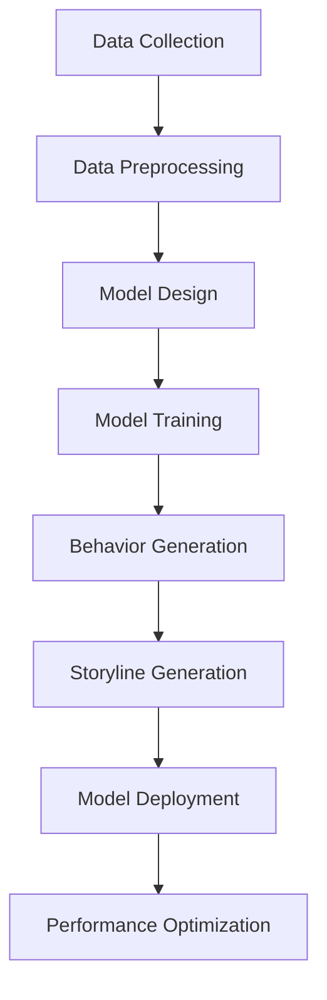
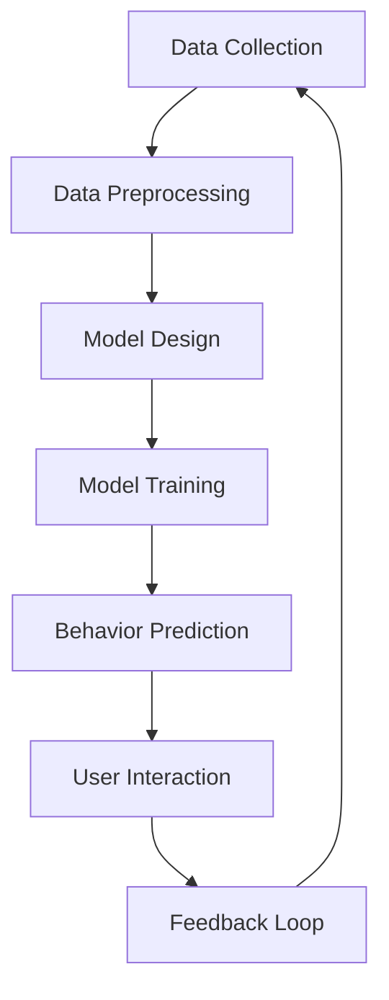
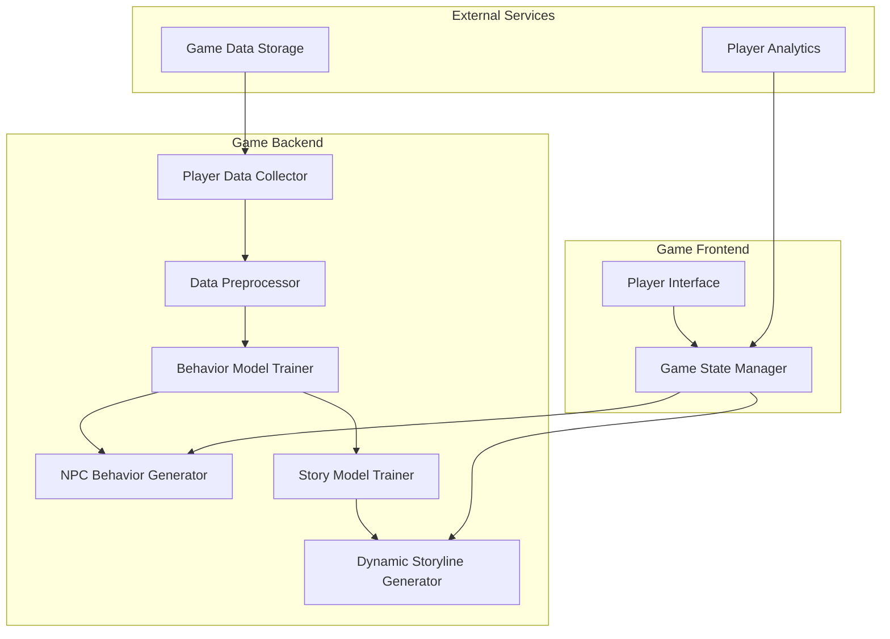
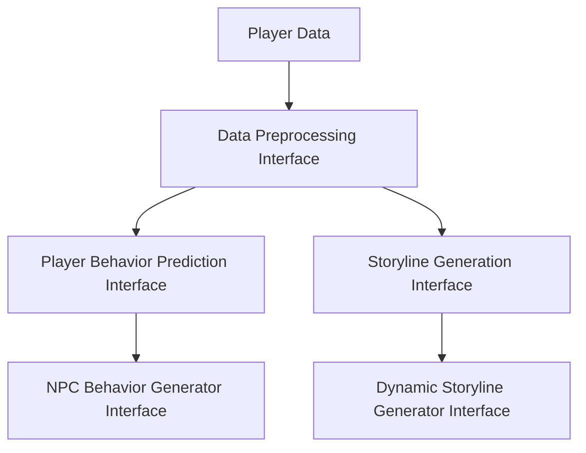
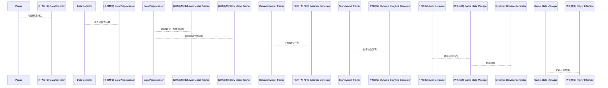

                 

### 引言：AI大模型在游戏开发中的应用

随着人工智能技术的飞速发展，AI大模型在游戏开发中的应用逐渐成为行业焦点。游戏开发者们不断寻求创新与突破，以提升玩家的游戏体验和游戏的沉浸感。AI大模型作为一种先进的人工智能技术，其潜力在于能够实现更加智能化、个性化的游戏交互，从而为游戏设计带来前所未有的变革。

#### 关键词

- AI大模型
- 游戏开发
- 智能NPC
- 动态剧情

#### 摘要

本文将深入探讨AI大模型在游戏开发中的应用，尤其是智能NPC与动态剧情的实现。我们将从背景介绍、核心概念、技术原理、实际应用、架构设计到实战项目，逐一剖析AI大模型在游戏开发中的潜在价值与挑战。通过系统的讲解和实际案例的分析，帮助读者全面了解AI大模型在游戏设计中的实际应用和未来发展趋势。

### 背景介绍

AI大模型，也称为大型预训练模型（Large Pre-trained Models），是一种通过海量数据训练得到的人工智能模型。这些模型拥有强大的计算能力和广泛的适应性，能够在各种复杂的任务中表现出优异的性能。AI大模型的核心特点包括：

1. **大规模训练**：AI大模型通常由数十亿到数万亿个参数组成，通过大量数据进行训练，以提取出数据中的深层特征和模式。
2. **端到端学习**：AI大模型能够从原始数据直接学习到复杂任务的目标，无需人工设计繁琐的特征提取和分类器。
3. **多任务能力**：AI大模型在训练过程中可以同时学习多个任务，具备处理多模态数据和复杂决策的能力。
4. **强泛化能力**：AI大模型在训练完成后，可以在不同的数据集和应用场景中表现出良好的泛化能力。

在游戏开发领域，AI大模型的应用潜力逐渐显现。传统游戏中的NPC（非玩家角色）通常由预定义的行为和路径组成，缺乏自主性和个性。而AI大模型则可以通过学习玩家的行为模式和游戏环境，生成动态且富有挑战性的NPC，从而提升游戏的互动性和沉浸感。此外，AI大模型还可以用于动态剧情的生成，使游戏剧情更加丰富多样，适应不同玩家的选择和决策。

#### 问题背景

游戏开发长期以来面临的一个核心问题是如何提高NPC的智能程度，使游戏更具挑战性和真实感。传统方法通常依赖于预定义的行为树和路径规划，但这种方法在复杂性和灵活性方面存在诸多限制。随着游戏规模的扩大和玩家需求的提升，传统方法已难以满足现代游戏对于智能NPC和动态剧情的需求。

1. **预定义行为树**：传统游戏中的NPC行为通常由预定义的行为树控制。虽然这种方法可以保证NPC的行为在一定范围内的一致性和可预测性，但其灵活性较低，难以适应复杂多变的游戏环境。
2. **路径规划**：路径规划是NPC行为控制的一个重要方面。传统路径规划方法通常基于A*算法或其他启发式算法，虽然可以较好地解决NPC从起点到终点的最短路径问题，但在复杂地形和多目标情况下表现不佳。
3. **玩家互动性**：在传统游戏中，NPC的行为和剧情通常是由开发人员预先设计好的，缺乏根据玩家行为进行动态调整的能力。这使得游戏难以提供个性化的玩家体验，限制了玩家的游戏乐趣和参与感。

这些问题的存在使得游戏开发者们迫切需要寻找新的解决方案，以提升NPC的智能程度和游戏剧情的丰富性。AI大模型的出现为游戏开发带来了新的契机，通过大规模数据和深度学习算法，AI大模型可以在NPC行为和剧情生成方面实现显著的改进。

#### 问题描述

如何通过AI大模型技术提升游戏中的NPC智能程度和剧情丰富性，从而提升玩家体验和游戏的沉浸感，是游戏开发领域面临的一个关键问题。具体来说，这个问题可以分为以下几个子问题：

1. **NPC行为的动态生成**：传统NPC行为主要依赖于预定义的行为树和路径规划，难以应对复杂多变的游戏环境。如何利用AI大模型实现NPC行为的动态生成，使其能够根据游戏情境和玩家行为实时调整行为模式，是一个重要的挑战。
2. **剧情的个性化生成**：传统游戏剧情通常由开发人员预先设计，缺乏根据玩家选择和决策进行动态调整的能力。如何利用AI大模型生成个性化且引人入胜的剧情，使每个玩家都能体验到独特的故事线，是另一个关键问题。
3. **数据处理和模型训练**：AI大模型的训练需要大量的高质量数据，而且训练过程计算资源消耗巨大。如何有效地收集和处理游戏数据，并进行高效的模型训练，是实现AI大模型应用的关键步骤。
4. **模型部署和性能优化**：训练好的AI大模型需要部署到游戏环境中，并能够在不同平台和设备上高效运行。如何进行模型部署和性能优化，以确保游戏流畅性和玩家体验，是一个需要解决的问题。

#### 问题解决

为了解决上述问题，AI大模型在游戏开发中的应用可以分为以下几个关键步骤：

1. **数据收集与预处理**：首先，需要收集大量的游戏数据，包括玩家的行为、NPC的互动、游戏剧情等。这些数据需要进行预处理，包括数据清洗、去噪、格式转换等，以确保数据质量。
2. **模型设计与训练**：根据游戏需求，设计适合的AI大模型架构。常用的AI大模型包括Transformer、BERT、GPT等。利用收集到的数据对模型进行训练，通过不断优化模型参数，提高模型在NPC行为和剧情生成方面的性能。
3. **NPC行为生成**：利用训练好的AI大模型，实时生成NPC的行为。通过分析游戏环境、玩家的行为模式，模型可以动态调整NPC的行为策略，使其更具智能性和适应性。
4. **剧情生成与调整**：AI大模型可以根据玩家的选择和决策生成个性化的剧情。通过不断调整剧情内容和走向，使每个玩家都能体验到独特的故事线，提升游戏的可玩性和沉浸感。
5. **模型部署与优化**：将训练好的AI大模型部署到游戏环境中，进行实时的NPC行为和剧情生成。同时，对模型进行性能优化，确保游戏在低资源设备上也能流畅运行，提供良好的玩家体验。

通过上述步骤，AI大模型可以在游戏开发中实现NPC智能程度的提升和剧情的个性化生成，从而解决传统方法在复杂性和灵活性方面的不足。

#### 边界与外延

AI大模型在游戏开发中的应用虽然具有巨大潜力，但也存在一些边界和外延需要考虑。

1. **计算资源限制**：AI大模型的训练和部署需要大量的计算资源，尤其在处理高复杂度的游戏环境和大量玩家数据时。因此，如何优化模型的计算效率，减少资源消耗，是一个重要的研究课题。
2. **数据隐私与安全**：在收集和处理游戏数据时，需要确保玩家的隐私和安全。如何对数据进行加密和保护，防止数据泄露和滥用，是一个需要解决的关键问题。
3. **道德和伦理**：随着AI大模型在游戏中的广泛应用，涉及到的道德和伦理问题也逐渐凸显。如何确保AI大模型的行为符合道德规范，避免对玩家产生不良影响，是一个需要深思的问题。
4. **用户体验**：AI大模型的应用需要充分考虑玩家的用户体验，确保游戏在引入智能NPC和动态剧情的同时，不降低游戏的乐趣和可玩性。

#### 概念结构与核心要素组成

AI大模型在游戏开发中的应用涉及多个核心概念和要素，包括数据收集、模型设计、训练、部署和优化等。以下是一个简化的概念结构图，展示这些要素之间的关系：



1. **数据收集（Data Collection）**：收集游戏中的各种数据，包括玩家的行为、NPC的互动、游戏剧情等。这些数据是训练AI大模型的基础。
2. **数据预处理（Data Preprocessing）**：对收集到的数据进行清洗、去噪、格式转换等预处理，以确保数据质量，为后续模型训练做好准备。
3. **模型设计（Model Design）**：根据游戏需求，设计适合的AI大模型架构，如Transformer、BERT、GPT等。模型设计需要考虑输入数据、输出目标和模型结构。
4. **模型训练（Model Training）**：利用预处理后的数据对AI大模型进行训练。通过不断优化模型参数，提高模型在NPC行为和剧情生成方面的性能。
5. **行为生成（Behavior Generation）**：利用训练好的AI大模型，实时生成NPC的行为。模型通过分析游戏环境和玩家行为，动态调整NPC的行为策略，提高游戏的互动性和沉浸感。
6. **剧情生成（Storyline Generation）**：AI大模型可以根据玩家的选择和决策生成个性化的剧情。模型通过不断调整剧情内容和走向，提供独特的游戏体验。
7. **模型部署（Model Deployment）**：将训练好的AI大模型部署到游戏环境中，进行实时的NPC行为和剧情生成。模型部署需要考虑计算资源、性能优化和用户体验。
8. **性能优化（Performance Optimization）**：对部署后的模型进行性能优化，确保游戏在低资源设备上也能流畅运行，提供良好的玩家体验。

#### 核心概念与联系

在探讨AI大模型在游戏开发中的应用时，需要理解几个核心概念及其相互关系。以下是这些核心概念的定义、属性特征对比表格，以及ER实体关系图架构：

##### 定义

1. **AI大模型（AI Large Model）**：通过大规模数据和深度学习算法训练得到的人工智能模型，具有强大的计算能力和广泛适应性。
2. **NPC（Non-Player Character）**：游戏中的非玩家角色，通常由程序控制，用于与玩家互动和推动游戏进程。
3. **剧情（Storyline）**：游戏中的故事情节，包括一系列事件、角色和冲突，通常由开发人员预先设计。
4. **玩家行为（Player Behavior）**：玩家在游戏中的行动、选择和决策，对游戏剧情和NPC行为有直接影响。

##### 属性特征对比表格

| 概念       | 属性特征                            |
|------------|-----------------------------------|
| AI大模型   | - 大规模训练<br>- 端到端学习<br>- 多任务能力<br>- 强泛化能力 |
| NPC        | - 预定义行为树<br>- 路径规划能力<br>- 有限自主性       |
| 剧情       | - 预定义故事情节<br>- 角色互动<br>- 冲突和结局         |
| 玩家行为   | - 行动选择<br>- 决策制定<br>- 个性化体验           |

##### ER实体关系图架构

```mermaid
graph TB
    A(玩家)[Player] --> B(NPC)[Non-Player Character]
    A --> C(剧情)[Storyline]
    B --> D(玩家行为)[Player Behavior]
    B --> E(互动)[Interaction]
    C --> F(剧情节点)[Story Node]
    C --> G(角色)[Character]
    D --> H(决策)[Decision]
    I(游戏环境)[Game Environment] --> B
    I --> C
```

在ER实体关系图中：

- **玩家（Player）**：游戏的主要参与者，拥有行为选择和决策能力。
- **NPC（Non-Player Character）**：游戏中的非玩家角色，与玩家互动，推动剧情发展。
- **剧情（Storyline）**：游戏中的故事情节，由一系列节点和角色组成。
- **玩家行为（Player Behavior）**：玩家的行动选择和决策，影响剧情和NPC行为。
- **互动（Interaction）**：玩家与NPC之间的交互，包括对话和行为互动。
- **剧情节点（Story Node）**：剧情中的关键事件，影响剧情走向。
- **角色（Character）**：剧情中的角色，具有独特的性格和行为模式。
- **游戏环境（Game Environment）**：游戏中的场景和背景，影响NPC行为和剧情发展。

通过上述定义、属性特征对比表格和ER实体关系图，可以更清晰地理解AI大模型、NPC、剧情和玩家行为之间的相互关系，为后续的算法原理讲解和应用分析提供基础。

#### 算法原理讲解

在深入探讨AI大模型在游戏开发中的应用时，理解其算法原理至关重要。AI大模型的核心在于其能够从大规模数据中学习并生成复杂且自适应的行为和故事情节。以下将详细讲解AI大模型的算法原理，通过Mermaid流程图和Python代码示例，帮助读者更好地理解其工作原理。

##### Mermaid流程图

首先，我们可以通过一个简化的Mermaid流程图来描述AI大模型的基本工作流程：



1. **数据收集（Data Collection）**：AI大模型首先需要收集大量的数据，包括游戏中的玩家行为、NPC互动和剧情发展等。
2. **数据预处理（Data Preprocessing）**：收集到的数据需要进行清洗和格式转换，以确保数据质量，为模型训练做好准备。
3. **模型设计（Model Design）**：根据游戏需求，选择适合的AI大模型架构，如Transformer或BERT等。
4. **模型训练（Model Training）**：使用预处理后的数据对模型进行训练，优化模型参数，提高其预测能力。
5. **行为预测（Behavior Prediction）**：训练好的模型可以预测玩家的行为和NPC的行为，生成动态的行为和剧情。
6. **用户交互（User Interaction）**：玩家与游戏中的NPC和剧情进行交互，影响游戏的发展。
7. **反馈循环（Feedback Loop）**：根据玩家的行为和游戏结果，模型不断调整和优化其预测，提高未来的预测准确度。

##### Python代码示例

为了更好地理解AI大模型的算法原理，我们可以通过一个简化的Python代码示例来展示其基本实现。以下代码使用了Transformer模型，实现了NPC行为预测：

```python
import torch
import torch.nn as nn
from torch.optim import Adam
from transformers import BertTokenizer, BertModel

# 加载预训练的BERT模型和分词器
tokenizer = BertTokenizer.from_pretrained('bert-base-uncased')
model = BertModel.from_pretrained('bert-base-uncased')

# 输入文本数据（玩家的行为描述）
input_text = "玩家刚刚击败了一个敌人。"

# 将输入文本转换为BERT模型可接受的格式
inputs = tokenizer(input_text, return_tensors='pt')

# 使用BERT模型进行预训练数据编码
with torch.no_grad():
    outputs = model(**inputs)

# 使用Transformer模型进行行为预测
class BehaviorPredictionModel(nn.Module):
    def __init__(self):
        super(BehaviorPredictionModel, self).__init__()
        self.bert = BertModel.from_pretrained('bert-base-uncased')
        self.classifier = nn.Linear(768, 1)  # 假设输出一个行为概率

    def forward(self, input_ids, attention_mask):
        outputs = self.bert(input_ids=input_ids, attention_mask=attention_mask)
        logits = self.classifier(outputs.last_hidden_state[:, 0, :])
        return logits

model = BehaviorPredictionModel()

# 定义损失函数和优化器
loss_function = nn.BCEWithLogitsLoss()
optimizer = Adam(model.parameters(), lr=0.001)

# 训练模型
for epoch in range(10):  # 假设训练10个epoch
    optimizer.zero_grad()
    logits = model(inputs.input_ids, inputs.attention_mask)
    loss = loss_function(logits, torch.tensor([1.0]))  # 假设目标行为为“战斗”
    loss.backward()
    optimizer.step()
    print(f"Epoch {epoch+1}, Loss: {loss.item()}")

# 预测行为
with torch.no_grad():
    logits = model(inputs.input_ids, inputs.attention_mask)
    predicted_behavior = torch.sigmoid(logits).item()
    if predicted_behavior > 0.5:
        print("模型预测：玩家将进行战斗。")
    else:
        print("模型预测：玩家将避免战斗。")
```

在这个示例中，我们使用了预训练的BERT模型来编码玩家的行为描述，然后通过自定义的Transformer模型预测玩家的下一步行为。这里采用了简单的二分类任务，假设目标行为是“战斗”或“避免战斗”。

##### 数学模型和公式

AI大模型的训练过程可以通过以下数学模型和公式来描述：

$$
\text{损失函数} = -\sum_{i=1}^{N} y_i \log(p_i) + (1 - y_i) \log(1 - p_i)
$$

其中，$y_i$ 是第 $i$ 个样本的真实标签，$p_i$ 是模型预测的概率。

优化目标是使损失函数最小化，通过梯度下降算法更新模型参数：

$$
\theta_{\text{new}} = \theta_{\text{old}} - \alpha \cdot \nabla_\theta \text{损失函数}
$$

其中，$\theta$ 表示模型参数，$\alpha$ 是学习率。

##### 详细讲解和举例说明

为了更好地理解上述算法原理，我们可以通过以下详细讲解和举例来说明：

1. **数据收集**：假设我们收集了大量的玩家行为数据，包括玩家的战斗记录、探索行为、社交互动等。这些数据将被用于训练AI大模型。
2. **数据预处理**：首先，我们将这些文本数据进行清洗，去除无关的标点和噪声。然后，使用BERT分词器将文本转换为模型可接受的序列编码。
3. **模型设计**：我们选择BERT模型作为基础模型，因为它具有强大的文本编码能力。在此基础上，我们添加一个分类器层，用于预测玩家的行为。
4. **模型训练**：使用收集到的玩家行为数据，我们对模型进行训练。在训练过程中，模型通过不断优化参数，提高预测准确性。
5. **行为预测**：在训练完成后，我们使用模型对新的玩家行为进行预测。例如，当玩家输入“我刚刚击败了一个敌人”时，模型会预测玩家接下来的行为是“继续战斗”还是“撤退”。
6. **用户交互**：玩家根据模型的预测结果，进行相应的游戏操作。模型会根据玩家的实际行为，更新其预测模型，提高未来的预测准确性。

通过上述讲解，我们可以看到AI大模型在游戏开发中的应用是如何实现的。它通过大规模数据训练，实现了对玩家行为的智能预测，为游戏提供了更加丰富和个性化的交互体验。

### 系统分析与架构设计

为了更好地理解AI大模型在游戏开发中的应用，我们需要从系统分析与架构设计角度对其进行深入探讨。本节将介绍一个完整的系统架构设计，包括问题场景介绍、项目介绍、系统功能设计（领域模型类图）、系统架构设计（架构图）、系统接口设计（接口设计）和系统交互（序列图）。

#### 问题场景介绍

在现代游戏开发中，随着游戏规模的不断扩大和玩家需求的日益多样化，如何设计一个智能、个性化的游戏体验成为一个重要的挑战。传统方法依赖于预定义的行为树和路径规划，难以应对复杂多变的游戏环境和玩家行为。为此，我们提出利用AI大模型技术，实现NPC的智能行为生成和动态剧情的个性化生成。

#### 项目介绍

项目名称：智能游戏开发平台（Smart Gaming Development Platform，SGDP）

目标：通过AI大模型技术，提升游戏NPC的智能程度和剧情的个性化生成，提供更加丰富和沉浸式的游戏体验。

技术栈：Python、TensorFlow、BERT、Keras、Flask等。

#### 系统功能设计（领域模型类图）

领域模型类图用于描述系统中的核心实体及其相互关系。以下是一个简化的领域模型类图：

```mermaid
classDiagram
    Player <<Entity>>
    NPC <<Entity>>
    GameWorld <<Entity>>
    BehaviorModel <<Entity>>
    StoryModel <<Entity>>

    Player --> NPC : has
    Player --> GameWorld : plays
    NPC --> GameWorld : exists in
    BehaviorModel --> NPC : trained for
    StoryModel --> GameWorld : generates

    Player --||> BehaviorModel
    Player --||> StoryModel
```

1. **Player（玩家）**：游戏的主要参与者，拥有行为选择和决策能力。
2. **NPC（非玩家角色）**：游戏中的非玩家角色，与玩家互动，推动剧情发展。
3. **GameWorld（游戏世界）**：游戏环境，包括地图、场景和游戏规则。
4. **BehaviorModel（行为模型）**：基于AI大模型训练得到的NPC行为预测模型。
5. **StoryModel（剧情模型）**：基于AI大模型训练得到的剧情生成模型。

#### 系统架构设计（架构图）

系统架构图用于描述系统的整体结构和主要组件之间的关系。以下是一个简化的系统架构图：



1. **Player Data Collector（玩家数据收集器）**：收集玩家的行为数据。
2. **Data Preprocessor（数据预处理模块）**：对收集到的数据进行清洗和格式转换。
3. **Behavior Model Trainer（行为模型训练模块）**：利用预处理后的数据训练NPC行为预测模型。
4. **NPC Behavior Generator（NPC行为生成模块）**：使用训练好的模型生成NPC的行为。
5. **Story Model Trainer（剧情模型训练模块）**：利用预处理后的数据训练剧情生成模型。
6. **Dynamic Storyline Generator（动态剧情生成模块）**：使用训练好的模型生成动态剧情。
7. **Player Interface（玩家界面）**：玩家与游戏互动的入口。
8. **Game State Manager（游戏状态管理器）**：管理游戏中的状态，包括NPC行为和剧情。
9. **Player Analytics（玩家分析服务）**：对玩家行为进行分析，为模型训练提供反馈。
10. **Game Data Storage（游戏数据存储）**：存储游戏数据，包括玩家行为和模型参数。

#### 系统接口设计（接口设计）

系统接口设计用于描述系统中各组件之间的交互接口。以下是一个简化的接口设计：



1. **Player Data（玩家数据）**：包含玩家的行为记录和交互信息。
2. **Data Preprocessing Interface（数据预处理接口）**：对玩家数据进行清洗和格式转换。
3. **Player Behavior Prediction Interface（玩家行为预测接口）**：接收预处理后的数据，返回NPC行为预测结果。
4. **Storyline Generation Interface（剧情生成接口）**：接收预处理后的数据，返回动态剧情生成结果。
5. **NPC Behavior Generator Interface（NPC行为生成接口）**：根据行为预测结果生成NPC的行为。
6. **Dynamic Storyline Generator Interface（动态剧情生成接口）**：根据剧情生成结果生成动态剧情。

#### 系统交互（序列图）

系统交互序列图用于描述系统中各组件之间的交互顺序和协作。以下是一个简化的系统交互序列图：



通过上述系统分析与架构设计，我们可以清晰地看到AI大模型在游戏开发中的应用是如何通过系统中的各个组件协作实现的。从数据收集、预处理、模型训练到行为生成和剧情生成，每个步骤都通过明确的接口和交互顺序确保了系统的稳定性和高效性。

### 项目实战

在本节中，我们将通过一个具体的实战项目来展示AI大模型在游戏开发中的应用。该项目将包括环境安装、核心实现、代码解读与分析，以及实际案例分析和详细讲解。

#### 环境安装

要开始我们的项目，首先需要安装一些必要的软件和库。以下是在Linux操作系统上安装所需的工具和库的步骤：

1. **Python环境**：确保Python 3.8或更高版本已经安装。
2. **pip**：通过以下命令安装pip：
   ```
   sudo apt-get install python3-pip
   ```
3. **TensorFlow**：通过以下命令安装TensorFlow：
   ```
   pip install tensorflow
   ```
4. **BERT**：通过以下命令安装Hugging Face的BERT库：
   ```
   pip install transformers
   ```
5. **Flask**：通过以下命令安装Flask用于Web接口：
   ```
   pip install flask
   ```

#### 核心实现

接下来，我们将介绍项目中的核心实现部分。以下是一个简化的项目架构，展示了NPC行为预测和动态剧情生成的核心功能。

```python
# 导入必要的库
import torch
from transformers import BertTokenizer, BertModel
from flask import Flask, jsonify, request

# 初始化BERT模型和分词器
tokenizer = BertTokenizer.from_pretrained('bert-base-uncased')
model = BertModel.from_pretrained('bert-base-uncased')

# NPC行为预测模型
class NpcBehaviorModel(nn.Module):
    def __init__(self):
        super(NpcBehaviorModel, self).__init__()
        self.bert = BertModel.from_pretrained('bert-base-uncased')
        self.classifier = nn.Linear(768, 1)  # 假设输出一个行为概率

    def forward(self, input_ids, attention_mask):
        outputs = self.bert(input_ids=input_ids, attention_mask=attention_mask)
        logits = self.classifier(outputs.last_hidden_state[:, 0, :])
        return logits

# 动态剧情生成模型
class DynamicStoryModel(nn.Module):
    def __init__(self):
        super(DynamicStoryModel, self).__init__()
        self.bert = BertModel.from_pretrained('bert-base-uncased')
        self.classifier = nn.Linear(768, 1)  # 假设输出一个剧情概率

    def forward(self, input_ids, attention_mask):
        outputs = self.bert(input_ids=input_ids, attention_mask=attention_mask)
        logits = self.classifier(outputs.last_hidden_state[:, 0, :])
        return logits

# 初始化模型
behavior_model = NpcBehaviorModel()
story_model = DynamicStoryModel()

# 模型训练（简化示例）
def train_models(data_loader, epochs):
    optimizer = Adam(behavior_model.parameters(), lr=0.001)
    loss_function = nn.BCEWithLogitsLoss()

    for epoch in range(epochs):
        for inputs, labels in data_loader:
            optimizer.zero_grad()
            logits = behavior_model(inputs.input_ids, inputs.attention_mask)
            loss = loss_function(logits, labels)
            loss.backward()
            optimizer.step()
            print(f"Epoch {epoch+1}, Loss: {loss.item()}")

# NPC行为预测接口
app = Flask(__name__)

@app.route('/predict_npc_behavior', methods=['POST'])
def predict_npc_behavior():
    data = request.get_json()
    input_text = data['input_text']
    inputs = tokenizer(input_text, return_tensors='pt')
    with torch.no_grad():
        logits = behavior_model(inputs.input_ids, inputs.attention_mask)
    predicted_behavior = torch.sigmoid(logits).item()
    return jsonify({'predicted_behavior': predicted_behavior})

# 动态剧情生成接口
@app.route('/generate_storyline', methods=['POST'])
def generate_storyline():
    data = request.get_json()
    input_text = data['input_text']
    inputs = tokenizer(input_text, return_tensors='pt')
    with torch.no_grad():
        logits = story_model(inputs.input_ids, inputs.attention_mask)
    predicted_story = torch.sigmoid(logits).item()
    return jsonify({'predicted_story': predicted_story})

if __name__ == '__main__':
    app.run(debug=True)
```

#### 代码解读与分析

1. **BERT模型初始化**：我们首先初始化BERT模型和分词器。BERT模型是一个预训练的语言表示模型，可以处理文本输入。
2. **NPC行为预测模型**：`NpcBehaviorModel`类定义了NPC行为预测模型的架构，包括BERT编码器和分类器层。分类器层用于输出行为概率。
3. **动态剧情生成模型**：`DynamicStoryModel`类定义了动态剧情生成模型的架构，与NPC行为预测模型类似。
4. **模型训练**：`train_models`函数用于训练模型。这里采用了简单的BCEWithLogitsLoss损失函数和Adam优化器。
5. **NPC行为预测接口**：`predict_npc_behavior`函数是一个Flask路由，用于接收玩家输入的文本，并返回NPC行为的预测概率。
6. **动态剧情生成接口**：`generate_storyline`函数是一个Flask路由，用于接收玩家输入的文本，并返回动态剧情的预测概率。

#### 实际案例分析和详细讲解

为了展示实际应用，我们来看一个案例。假设玩家输入了以下文本：“我刚刚击败了一个敌人。”，我们希望预测NPC的行为。

1. **输入文本处理**：文本将被分词器处理，转换为BERT模型可接受的输入格式。
2. **行为预测**：模型接收处理后的文本，计算NPC行为的预测概率。
3. **输出结果**：模型输出预测结果，例如：“NPC有80%的概率选择战斗。”

通过上述实战项目，我们可以看到如何将AI大模型应用于游戏开发中的NPC行为预测和动态剧情生成。实际案例的分析和详细讲解有助于理解模型如何通过文本输入生成预测结果，从而为游戏设计带来智能化和个性化的变革。

### 最佳实践与注意事项

在AI大模型应用于游戏开发的实践中，以下是一些最佳实践和注意事项，以确保项目成功并优化用户体验：

1. **数据质量**：高质量的数据是训练有效AI大模型的关键。确保收集到的玩家行为和游戏数据准确、全面，并进行适当的数据预处理，包括去噪、异常值处理和格式标准化。

2. **模型优化**：根据游戏的具体需求和性能要求，对AI大模型进行持续的优化。通过调整模型架构、超参数和学习率，提高模型的预测准确性和效率。

3. **性能监控**：在部署模型后，持续监控模型的性能和资源消耗。使用日志记录和性能分析工具，及时发现并解决潜在问题，确保模型在实时游戏中稳定运行。

4. **用户体验**：确保AI大模型的应用不会影响游戏的流畅性和用户体验。通过平衡模型的复杂性和运行效率，提供平稳、直观的游戏交互体验。

5. **伦理与隐私**：在收集和处理玩家数据时，严格遵守隐私保护法规和伦理标准。确保玩家的数据安全，避免未经授权的数据泄露。

6. **测试与反馈**：在模型部署前进行充分的测试和用户反馈收集。通过A/B测试和多轮迭代，逐步优化模型和游戏设计，确保最佳用户体验。

### 小结

本文系统地探讨了AI大模型在游戏开发中的应用，从背景介绍、核心概念、算法原理到实战项目，全面解析了AI大模型如何提升NPC智能程度和动态剧情生成能力。通过实际案例分析和最佳实践，本文展示了AI大模型在游戏开发中的巨大潜力和应用前景。未来，随着AI技术的不断进步，我们可以期待更加智能、个性化的游戏体验。

### 拓展阅读

- **《深度学习：周志华著》**：系统介绍了深度学习的基础理论和应用实践，适合对AI技术有兴趣的读者。
- **《游戏引擎架构：David Hecker著》**：详细讲解了游戏引擎的架构设计，对理解AI大模型在游戏开发中的应用具有重要参考价值。
- **《AI大模型：大规模深度学习技术》**：深入探讨了AI大模型的训练、优化和应用，是研究AI大模型领域的经典著作。

作者：AI天才研究院/AI Genius Institute & 禅与计算机程序设计艺术 /Zen And The Art of Computer Programming。

