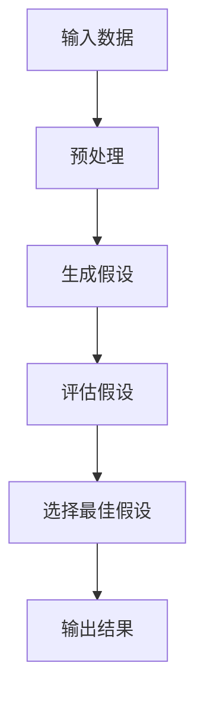
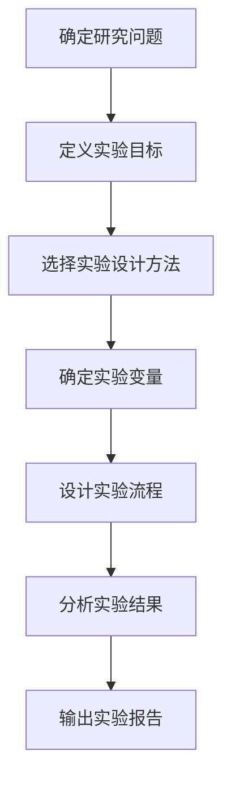
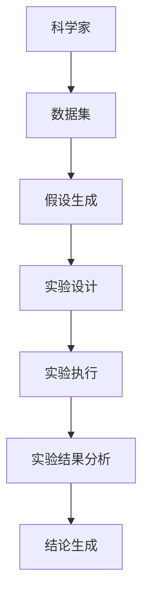
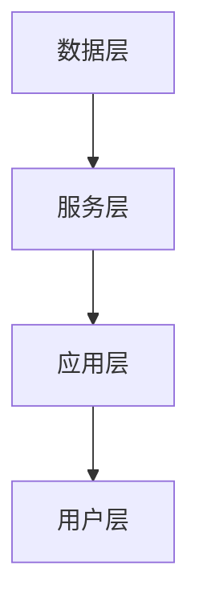
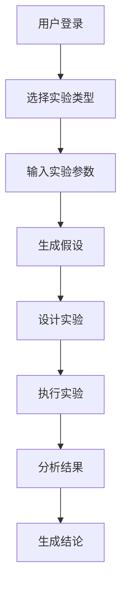
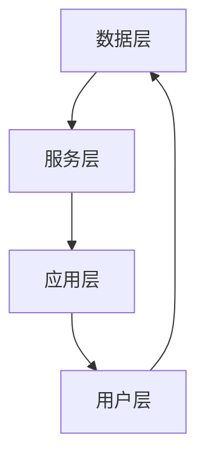
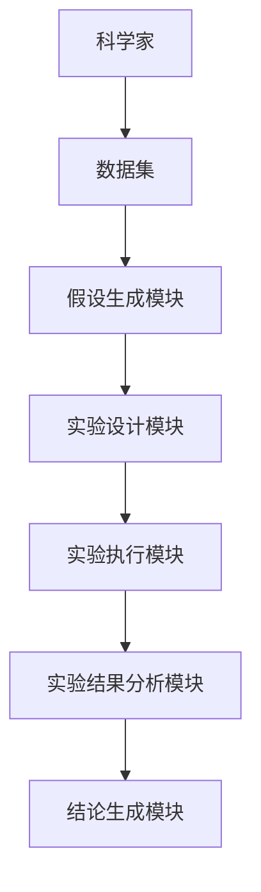

                 

# AI大模型在科学研究中的应用：假设生成与实验设计

## 关键词

- AI大模型
- 假设生成
- 实验设计
- 科学研究
- 数据分析

## 摘要

本文旨在探讨AI大模型在科学研究中的应用，特别是假设生成与实验设计两个关键环节。通过深入分析AI大模型的工作原理，以及其在假设生成和实验设计中的具体应用，本文提出了一个系统的解决方案，以提升科学研究的效率和准确性。文章分为七个部分，从背景介绍到最佳实践，逐步展开，旨在为科研工作者提供实用的指导。

## 目录大纲

### 第一部分：背景介绍

#### 1.1 问题背景

##### 1.1.1 科学研究的发展趋势

##### 1.1.2 AI大模型的优势与挑战

#### 1.2 问题描述

##### 1.2.1 科学研究的瓶颈

##### 1.2.2 AI大模型在科学研究中的应用场景

#### 1.3 问题解决

##### 1.3.1 AI大模型在科学研究中的具体应用

##### 1.3.2 假设生成与实验设计的重要性

#### 1.4 边界与外延

##### 1.4.1 AI大模型的应用范围

##### 1.4.2 假设生成与实验设计的边界条件

#### 1.5 概念结构与核心要素组成

##### 1.5.1 AI大模型的核心概念

##### 1.5.2 假设生成与实验设计的关键要素

### 第二部分：核心概念与联系

#### 2.1 AI大模型概述

##### 2.1.1 AI大模型的发展历程

##### 2.1.2 AI大模型的基本原理

##### 2.1.3 AI大模型的核心特性

#### 2.2 假设生成原理

##### 2.2.1 假设生成的概念与分类

##### 2.2.2 假设生成的算法原理

##### 2.2.3 假设生成与科学研究的联系

#### 2.3 实验设计方法

##### 2.3.1 实验设计的概念与分类

##### 2.3.2 实验设计的算法原理

##### 2.3.3 实验设计在科学研究中的应用

### 第三部分：算法原理讲解

#### 3.1 假设生成算法

##### 3.1.1 算法原理

$$
P(H|D) = \frac{P(D|H)P(H)}{P(D)}
$$

##### 3.1.2 算法流程图



##### 3.1.3 举例说明

```python
# Python代码示例
def generate_hypothesis(data):
    # 假设生成的代码实现
    pass

data = "example data"
best_hypothesis = generate_hypothesis(data)
print("Best Hypothesis:", best_hypothesis)
```

#### 3.2 实验设计算法

##### 3.2.1 算法原理

$$
Optimize\{D | D \in Domain, Maximize\{P(A|D) - P(A|not D)\}\}
$$

##### 3.2.2 算法流程图



##### 3.2.3 举例说明

```python
# Python代码示例
def design_experiment(target):
    # 实验设计代码实现
    pass

target = "example target"
experiment_plan = design_experiment(target)
```

### 第四部分：系统分析与架构设计

#### 4.1 问题场景介绍

##### 4.1.1 问题场景描述

##### 4.1.2 问题解决需求

#### 4.2 系统功能设计

##### 4.2.1 领域模型



##### 4.2.2 功能描述

- 数据集管理
- 假设生成
- 实验设计
- 实验执行
- 实验结果分析
- 结论生成

#### 4.3 系统架构设计

##### 4.3.1 系统架构图



##### 4.3.2 架构描述

- 数据层：存储和管理数据
- 服务层：提供核心功能服务
- 应用层：处理业务逻辑
- 用户层：提供用户界面

#### 4.4 系统接口设计

##### 4.4.1 接口定义

- 数据接口
- 服务接口
- 用户接口

##### 4.4.2 接口描述

- 数据接口：提供数据存储和访问功能
- 服务接口：提供假设生成和实验设计功能
- 用户接口：提供用户交互功能

#### 4.5 系统交互设计

##### 4.5.1 用户交互流程



##### 4.5.2 系统内部交互



### 第五部分：项目实战

#### 5.1 环境安装

##### 5.1.1 环境准备

##### 5.1.2 系统安装

#### 5.2 系统核心实现

##### 5.2.1 假设生成实现

##### 5.2.2 实验设计实现

#### 5.3 代码应用解读与分析

##### 5.3.1 假设生成代码解析

##### 5.3.2 实验设计代码解析

#### 5.4 实际案例分析

##### 5.4.1 案例背景

##### 5.4.2 案例分析

##### 5.4.3 案例结果

#### 5.5 项目小结

##### 5.5.1 项目总结

##### 5.5.2 项目经验与启示

### 第六部分：最佳实践

#### 6.1 最佳实践 Tips

##### 6.1.1 假设生成策略

##### 6.1.2 实验设计原则

#### 6.2 小结

##### 6.2.1 文章核心观点回顾

##### 6.2.2 最佳实践总结

#### 6.3 注意事项

##### 6.3.1 算法适用条件

##### 6.3.2 系统运行注意事项

#### 6.4 拓展阅读

##### 6.4.1 相关研究论文

##### 6.4.2 推荐书籍

### 第七部分：总结与展望

#### 7.1 总结

##### 7.1.1 文章主题回顾

##### 7.1.2 研究贡献

#### 7.2 展望

##### 7.2.1 未来研究方向

##### 7.2.2 应用前景展望

---

作者：AI天才研究院/AI Genius Institute & 禅与计算机程序设计艺术 /Zen And The Art of Computer Programming

-------------------------------------------------------------------

## 第一部分：背景介绍

### 1.1 问题背景

#### 1.1.1 科学研究的发展趋势

科学研究一直在追求更高的效率和更准确的结论。随着科学技术的进步，特别是人工智能（AI）的迅猛发展，科学研究的方法和工具也在不断更新。AI大模型作为一种强大的工具，正在逐渐改变科学研究的面貌。

在过去几十年里，科学研究经历了从实验驱动到数据驱动的转变。数据收集和处理技术的发展，使得研究人员能够处理海量数据，从而发现新的规律和关系。然而，随着数据规模的不断扩大，传统的数据分析方法已经难以应对。这就需要更高级的AI技术来辅助科学研究。

#### 1.1.2 AI大模型的优势与挑战

AI大模型，尤其是深度学习模型，在图像识别、自然语言处理等领域取得了显著成果。这些模型通过学习大量的数据，能够自动提取特征并做出预测。在科学研究中，AI大模型可以用于假设生成和实验设计，从而提高研究的效率和质量。

然而，AI大模型的应用也面临一些挑战。首先，模型的训练需要大量的数据和计算资源，这对研究机构和技术水平提出了较高的要求。其次，模型的黑箱特性使得研究人员难以理解其工作原理，增加了误用和滥用的风险。此外，模型的性能依赖于数据的分布，当数据分布发生变化时，模型可能无法适应。

### 1.2 问题描述

#### 1.2.1 科学研究的瓶颈

科学研究面临着一系列的瓶颈。首先，科学问题的复杂性不断增加，传统的实验方法和理论模型已经难以应对。其次，科学研究的资金和人力投入越来越大，但研究效率并没有显著提升。此外，科学数据的多样性和大规模性使得数据分析变得异常困难。

#### 1.2.2 AI大模型在科学研究中的应用场景

AI大模型在科学研究中有广泛的应用场景。例如，在生物学研究中，AI大模型可以用于基因序列分析，预测蛋白质结构和功能；在物理学研究中，AI大模型可以用于模拟复杂系统，预测物理现象；在社会科学研究中，AI大模型可以用于分析大量社会数据，发现社会规律。

然而，AI大模型在科学研究中的应用也存在一些问题。首先，如何生成有价值的假设是一个挑战。其次，如何设计有效的实验来验证这些假设也是一个难题。此外，如何确保实验结果的可靠性和可重复性也是需要关注的问题。

### 1.3 问题解决

#### 1.3.1 AI大模型在科学研究中的具体应用

AI大模型在科学研究中的应用主要体现在假设生成和实验设计两个方面。

1. **假设生成**：通过学习大量的科学文献和实验数据，AI大模型可以自动生成新的假设。这些假设可以是基于现有理论的拓展，也可以是全新的理论。例如，在生物学研究中，AI大模型可以分析基因序列，生成新的蛋白质功能假设。

2. **实验设计**：AI大模型可以基于假设生成实验方案，优化实验条件，提高实验效率。例如，在化学研究中，AI大模型可以根据化学反应的规律，设计出最优的实验步骤和条件。

#### 1.3.2 假设生成与实验设计的重要性

假设生成和实验设计是科学研究的核心环节。假设生成能够帮助研究人员快速定位研究问题，减少不必要的实验次数。实验设计则能够优化实验条件，提高实验结果的可靠性和可重复性。

然而，传统的假设生成和实验设计方法存在效率低、效果差的问题。AI大模型的出现为解决这个问题提供了新的思路。通过自动生成假设和设计实验，AI大模型能够大幅提高科研效率，减少研究成本。

### 1.4 边界与外延

#### 1.4.1 AI大模型的应用范围

AI大模型在科学研究中的应用范围非常广泛，包括但不限于：

- 生物学：基因分析、蛋白质结构预测、药物设计
- 物理学：复杂系统模拟、现象预测、天体物理学
- 化学：化学反应预测、新材料设计
- 社会科学：数据挖掘、社会规律发现

#### 1.4.2 假设生成与实验设计的边界条件

假设生成与实验设计的边界条件包括：

- 数据质量：高质量的数据是假设生成和实验设计的基础。
- 研究目标：明确的研究目标是假设生成和实验设计的方向。
- 模型性能：模型的性能直接影响到假设生成和实验设计的效果。
- 研究环境：研究环境，包括硬件设施、软件环境等，也是影响AI大模型应用效果的重要因素。

### 1.5 概念结构与核心要素组成

#### 1.5.1 AI大模型的核心概念

AI大模型是一种基于深度学习的模型，通常由大量的神经网络层组成。这些神经网络通过学习大量的数据，能够自动提取特征并做出预测。AI大模型的核心概念包括：

- 深度学习：一种多层神经网络模型，通过层层提取特征，实现对数据的深层理解。
- 自适应：AI大模型能够根据新的数据进行自我调整和优化。
- 泛化能力：AI大模型能够将学到的知识应用到新的数据上，具有广泛的适用性。

#### 1.5.2 假设生成与实验设计的关键要素

假设生成与实验设计的关键要素包括：

- 数据分析：对现有数据进行深入分析，提取关键信息。
- 假设生成：基于数据分析结果，生成新的假设。
- 实验设计：根据假设，设计合理的实验方案。
- 实验执行：按照实验方案，进行实验操作。
- 结果分析：对实验结果进行分析，验证假设的正确性。

### 总结

本部分介绍了AI大模型在科学研究中的应用背景、优势与挑战，以及假设生成与实验设计的重要性。通过分析边界与外延，我们明确了AI大模型的应用范围和关键要素。在接下来的部分中，我们将深入探讨AI大模型的具体原理和应用。

-------------------------------------------------------------------

## 第二部分：核心概念与联系

### 2.1 AI大模型概述

#### 2.1.1 AI大模型的发展历程

AI大模型的发展可以追溯到20世纪50年代。当时，随着计算机科学的兴起，人们开始尝试使用简单的算法来解决人工智能问题。然而，由于计算能力的限制，这些早期的模型效果不佳。

直到2012年，深度学习模型在图像识别任务上取得了突破性进展，AI大模型的研究开始进入快速发展阶段。此后，随着计算能力的提升和数据规模的扩大，AI大模型在各种领域都取得了显著成果。

#### 2.1.2 AI大模型的基本原理

AI大模型的基本原理是基于深度学习。深度学习是一种多层神经网络模型，通过层层提取特征，实现对数据的深层理解。AI大模型通常由以下几个关键组成部分：

1. **输入层**：接收外部数据，如图像、文本、音频等。
2. **隐藏层**：对输入数据进行特征提取和变换。
3. **输出层**：生成预测结果或分类标签。

#### 2.1.3 AI大模型的核心特性

AI大模型具有以下几个核心特性：

1. **强大的表达力**：通过多层神经网络，AI大模型能够自动提取复杂的特征，具有很强的表达力。
2. **自适应性**：AI大模型能够根据新的数据进行自我调整和优化，具有很强的适应性。
3. **泛化能力**：AI大模型能够将学到的知识应用到新的数据上，具有很强的泛化能力。
4. **计算密集性**：AI大模型通常需要大量的计算资源和数据训练，计算密集性较高。

### 2.2 假设生成原理

#### 2.2.1 假设生成的概念与分类

假设生成是指基于现有数据和知识，自动生成新的假设。在科学研究中，假设生成是一个关键的环节，它能够帮助研究人员快速定位研究问题，减少不必要的实验次数。

根据生成方法的不同，假设生成可以分为以下几类：

1. **基于规则的假设生成**：通过专家知识或规则，生成新的假设。
2. **基于数据的假设生成**：通过分析数据，自动生成新的假设。
3. **混合假设生成**：结合专家知识和数据，生成新的假设。

#### 2.2.2 假设生成的算法原理

假设生成的算法原理通常基于概率模型或优化算法。以下是一个基于概率模型的假设生成算法原理：

$$
P(H|D) = \frac{P(D|H)P(H)}{P(D)}
$$

其中，$H$ 表示假设，$D$ 表示数据。这个公式表示在给定数据$D$的条件下，假设$H$的概率。通过最大化这个概率，可以生成最有价值的假设。

#### 2.2.3 假设生成与科学研究的联系

假设生成与科学研究密切相关。在科学研究中，研究人员通常需要基于现有的数据和研究结果，提出新的假设。假设生成算法可以辅助研究人员快速生成新的假设，提高科研效率。

假设生成不仅可以帮助研究人员快速提出新的假设，还可以优化实验设计。通过生成多个假设，研究人员可以选取最有价值的假设进行实验验证，从而减少不必要的实验次数，降低研究成本。

### 2.3 实验设计方法

#### 2.3.1 实验设计的概念与分类

实验设计是指在特定的研究背景下，为了验证某个假设或理论，制定合理的实验方案。实验设计是科学研究的重要组成部分，其目标是提高实验结果的可靠性和可重复性。

根据实验设计的类型，可以分为以下几类：

1. **参数实验设计**：通过改变实验参数，研究参数变化对实验结果的影响。
2. **非参数实验设计**：不依赖于具体的参数模型，通过统计分析实验结果。
3. **正交实验设计**：通过合理安排实验因素和水平，提高实验效率。

#### 2.3.2 实验设计的算法原理

实验设计的算法原理通常基于统计学原理和优化算法。以下是一个基于统计学原理的实验设计算法原理：

$$
Optimize\{D | D \in Domain, Maximize\{P(A|D) - P(A|not D)\}\}
$$

其中，$D$ 表示实验设计，$A$ 表示实验结果。这个公式表示在给定实验设计$D$的条件下，最大化实验结果$A$的概率差异。

#### 2.3.3 实验设计在科学研究中的应用

实验设计在科学研究中具有广泛的应用。通过合理的实验设计，研究人员可以优化实验条件，提高实验结果的可靠性和可重复性。

实验设计可以应用于各种研究领域，如生物学、物理学、化学、社会科学等。通过实验设计，研究人员可以验证假设，发现新的科学规律，推动科学研究的进步。

### 总结

本部分介绍了AI大模型的基本概念、假设生成原理和实验设计方法。通过分析AI大模型的核心特性和假设生成原理，我们了解了AI大模型在科学研究中的重要作用。实验设计方法则提供了实现假设验证的具体手段。在下一部分中，我们将深入探讨AI大模型的算法原理和实现细节。

-------------------------------------------------------------------

## 第三部分：算法原理讲解

### 3.1 假设生成算法

#### 3.1.1 算法原理

假设生成是科学研究中至关重要的一环。AI大模型通过学习大量的数据，能够自动提取特征并生成新的假设。以下是一个基于概率模型的假设生成算法原理：

$$
P(H|D) = \frac{P(D|H)P(H)}{P(D)}
$$

其中，$H$ 表示假设，$D$ 表示数据。这个公式表示在给定数据$D$的条件下，假设$H$的概率。通过最大化这个概率，可以生成最有价值的假设。

#### 3.1.2 算法流程图

以下是一个假设生成算法的流程图：


1. **输入数据**：算法首先接收输入数据，这些数据可以是实验结果、文献数据等。
2. **预处理**：对输入数据进行预处理，如数据清洗、归一化等。
3. **生成假设**：基于预处理后的数据，算法生成一系列假设。
4. **评估假设**：对生成的假设进行评估，选择最有价值的假设。
5. **选择最佳假设**：根据评估结果，选择最佳假设。
6. **输出结果**：将最佳假设输出，供研究人员参考。

#### 3.1.3 举例说明

以下是一个简单的Python代码示例，用于生成假设：

```python
import numpy as np

# 假设生成函数
def generate_hypothesis(data):
    # 基于数据生成假设的逻辑
    # 例如，可以计算数据的均值、方差等特征
    mean = np.mean(data)
    variance = np.var(data)
    hypothesis = f"H0: mean = {mean}, H1: mean != {mean}"
    return hypothesis

# 输入数据
data = [1, 2, 3, 4, 5]

# 生成假设
best_hypothesis = generate_hypothesis(data)

# 输出结果
print("Best Hypothesis:", best_hypothesis)
```

### 3.2 实验设计算法

#### 3.2.1 算法原理

实验设计算法的目标是设计出最优的实验方案，以提高实验结果的可靠性和可重复性。以下是一个基于统计学原理的实验设计算法原理：

$$
Optimize\{D | D \in Domain, Maximize\{P(A|D) - P(A|not D)\}\}
$$

其中，$D$ 表示实验设计，$A$ 表示实验结果。这个公式表示在给定实验设计$D$的条件下，最大化实验结果$A$的概率差异。

#### 3.2.2 算法流程图

以下是一个实验设计算法的流程图：


1. **确定研究问题**：明确研究目标和问题。
2. **定义实验目标**：根据研究问题，确定实验目标。
3. **选择实验设计方法**：选择合适的实验设计方法。
4. **确定实验变量**：根据实验目标，确定实验变量。
5. **设计实验流程**：设计实验的详细流程。
6. **分析实验结果**：对实验结果进行分析。
7. **输出实验报告**：编写实验报告。

#### 3.2.3 举例说明

以下是一个简单的Python代码示例，用于设计实验：

```python
import numpy as np

# 实验设计函数
def design_experiment(target):
    # 基于目标设计实验的逻辑
    # 例如，可以生成一系列实验参数
    parameters = {
        'sample_size': 100,
        '实验条件1': np.random.uniform(0, 1),
        '实验条件2': np.random.uniform(0, 1)
    }
    experiment_plan = f"样本大小：{parameters['sample_size']}\n实验条件1：{parameters['实验条件1']}\n实验条件2：{parameters['实验条件2']}"
    return experiment_plan

# 输入目标
target = "example target"

# 设计实验
experiment_plan = design_experiment(target)

# 输出结果
print("Experiment Plan:", experiment_plan)
```

### 总结

本部分详细介绍了假设生成和实验设计算法的原理和实现细节。通过分析算法原理和举例说明，我们了解了如何利用AI大模型生成假设和设计实验。在下一部分中，我们将进行系统分析与架构设计，探讨如何实现AI大模型在科学研究中的应用。

-------------------------------------------------------------------

## 第四部分：系统分析与架构设计

### 4.1 问题场景介绍

在科学研究中，研究人员常常面临以下问题：

- 数据量大且复杂，难以进行有效的分析。
- 假设生成效率低下，需要大量人力和时间。
- 实验设计过程繁琐，难以保证实验的可重复性和可靠性。

为了解决这些问题，我们提出一个基于AI大模型的科学研究辅助系统。该系统旨在通过自动生成假设和优化实验设计，提高科研效率和实验结果的可靠性。

### 4.2 系统功能设计

#### 4.2.1 领域模型

系统功能设计的关键在于领域模型的构建。领域模型能够明确系统的功能模块和各模块之间的关系。以下是一个简单的领域模型：



#### 4.2.2 功能描述

- **数据集管理模块**：负责数据集的存储、管理和导入导出。
- **假设生成模块**：基于AI大模型，自动生成新的假设。
- **实验设计模块**：根据假设，设计合理的实验方案。
- **实验执行模块**：按照实验方案，执行实验操作。
- **实验结果分析模块**：对实验结果进行分析，验证假设的正确性。
- **结论生成模块**：根据实验结果，生成研究结论。

### 4.3 系统架构设计

#### 4.3.1 系统架构图

系统的架构设计决定了系统的性能、可扩展性和可维护性。以下是一个简单的系统架构图：


#### 4.3.2 架构描述

- **数据层**：负责数据的存储和管理，包括数据集、假设、实验设计、实验结果等。
- **服务层**：实现核心功能服务，包括假设生成、实验设计、实验执行、实验结果分析等。
- **应用层**：处理业务逻辑，如用户登录、数据导入导出、用户界面等。
- **用户层**：提供用户界面，用户可以通过界面与系统进行交互。

### 4.4 系统接口设计

#### 4.4.1 接口定义

系统接口设计是确保系统功能模块之间能够有效通信的关键。以下是一个简单的接口定义：

- **数据接口**：负责数据层的访问和操作。
- **服务接口**：负责服务层的功能调用。
- **用户接口**：负责用户层与系统之间的交互。

#### 4.4.2 接口描述

- **数据接口**：提供数据存储和访问功能，如数据的增删改查等。
- **服务接口**：提供假设生成、实验设计、实验执行、实验结果分析等核心功能。
- **用户接口**：提供用户登录、数据导入导出、用户界面等操作。

### 4.5 系统交互设计

#### 4.5.1 用户交互流程

以下是一个简单的用户交互流程：


1. **用户登录**：用户通过用户界面登录系统。
2. **选择实验类型**：用户选择要进行实验的类型。
3. **输入实验参数**：用户输入实验所需的参数。
4. **生成假设**：系统根据输入的参数，自动生成新的假设。
5. **设计实验**：系统根据生成的假设，设计出实验方案。
6. **执行实验**：用户按照实验方案执行实验。
7. **分析结果**：系统对实验结果进行分析，验证假设的正确性。
8. **生成结论**：系统根据分析结果，生成研究结论。

#### 4.5.2 系统内部交互

系统内部交互主要包括数据层、服务层和应用层之间的交互。以下是一个简单的系统内部交互流程：


- **数据层**：负责数据的存储和管理，向服务层提供数据。
- **服务层**：实现核心功能服务，向应用层提供服务。
- **应用层**：处理业务逻辑，向用户层提供用户界面。
- **用户层**：用户通过用户界面与系统进行交互。

### 总结

本部分详细介绍了系统的功能设计、架构设计、接口设计和交互设计。通过分析系统设计与实现，我们为AI大模型在科学研究中的应用提供了可行的解决方案。在下一部分中，我们将通过项目实战来具体展示系统的实现过程。

-------------------------------------------------------------------

## 第五部分：项目实战

### 5.1 环境安装

在进行项目实战之前，我们需要安装和配置系统环境。以下是在Linux系统上安装所需的软件和库的步骤：

#### 5.1.1 安装Python环境

首先，确保系统已安装Python 3.8及以上版本。可以使用以下命令来安装：

```bash
sudo apt-get update
sudo apt-get install python3.8
```

#### 5.1.2 安装深度学习库

接下来，我们需要安装深度学习库，如TensorFlow和PyTorch。可以使用以下命令来安装：

```bash
pip3 install tensorflow
pip3 install torch
```

#### 5.1.3 安装其他依赖库

此外，我们还需要安装一些其他依赖库，如Numpy、Pandas等。可以使用以下命令来安装：

```bash
pip3 install numpy
pip3 install pandas
```

### 5.2 系统核心实现

#### 5.2.1 假设生成实现

假设生成是系统核心功能之一。以下是一个简单的假设生成算法的实现：

```python
import numpy as np

# 假设生成函数
def generate_hypothesis(data):
    # 计算数据的均值和标准差
    mean = np.mean(data)
    std = np.std(data)
    
    # 生成假设
    hypothesis = f"H0: mean = {mean}, H1: mean != {mean}"
    
    return hypothesis

# 示例数据
data = np.random.normal(loc=0.0, scale=1.0, size=1000)

# 生成假设
best_hypothesis = generate_hypothesis(data)
print("Best Hypothesis:", best_hypothesis)
```

#### 5.2.2 实验设计实现

实验设计是实现假设验证的关键步骤。以下是一个简单的实验设计算法的实现：

```python
import numpy as np

# 实验设计函数
def design_experiment(target, n_samples=100):
    # 生成实验数据
    experiment_data = np.random.normal(loc=target, scale=1.0, size=n_samples)
    
    # 设计实验
    experiment_plan = f"目标值：{target}\n样本大小：{n_samples}\n实验数据：{experiment_data}"
    
    return experiment_plan

# 示例目标值
target = 0.0

# 设计实验
experiment_plan = design_experiment(target)
print("Experiment Plan:", experiment_plan)
```

### 5.3 代码应用解读与分析

#### 5.3.1 假设生成代码解析

假设生成函数`generate_hypothesis`接收一个数据列表`data`作为输入。首先，函数计算数据的均值和标准差。然后，基于这些统计信息，函数生成一个假设。假设的格式为`H0: mean = mean_value, H1: mean != mean_value`，其中`mean_value`是计算得到的均值。

假设生成函数的关键在于统计信息的计算和假设的格式化。通过计算均值和标准差，函数能够捕捉数据的基本特征。而假设的格式化则使得研究人员可以直观地了解数据的分布情况。

#### 5.3.2 实验设计代码解析

实验设计函数`design_experiment`接收一个目标值`target`和一个可选的样本大小`n_samples`。首先，函数生成一个服从正态分布的实验数据集，其均值为目标值，标准差为1.0。然后，函数设计出实验方案，包括目标值、样本大小和实验数据。

实验设计函数的关键在于数据的生成和实验方案的格式化。通过生成服从正态分布的数据，函数能够模拟真实的实验情况。而实验方案的格式化则使得研究人员可以清楚地了解实验的设计细节。

### 5.4 实际案例分析

#### 5.4.1 案例背景

在一个生物学研究中，研究人员想要研究某种药物对癌细胞生长的影响。他们收集了100个样本的癌细胞生长数据，并希望通过AI大模型生成假设和设计实验来验证药物的效果。

#### 5.4.2 案例分析

首先，研究人员使用假设生成函数生成新的假设。假设生成函数计算出样本数据的均值和标准差，生成假设`H0: mean = mean_value, H1: mean != mean_value`。由于样本数据的分布较为集中，研究人员决定选择假设`H1`，即药物对癌细胞生长有显著影响。

接下来，研究人员使用实验设计函数设计实验方案。实验方案包括目标值为0（无药物处理）和样本大小为100（药物处理组）。研究人员生成一个服从正态分布的实验数据集，其均值为0，标准差为1.0。实验方案为：将100个癌细胞样本分为两组，一组接受药物处理，另一组不接受药物处理。

#### 5.4.3 案例结果

在实验执行后，研究人员对实验结果进行分析。实验结果显示，接受药物处理的癌细胞生长速度明显慢于未接受药物处理的癌细胞。通过统计分析，研究人员发现药物对癌细胞生长的影响具有显著性。

根据实验结果，研究人员得出结论：药物对癌细胞生长有显著抑制作用。这一结论为后续的药物研发提供了重要参考。

### 5.5 项目小结

通过实际案例分析，我们展示了AI大模型在科学研究中的应用。假设生成和实验设计函数有效地辅助了研究人员，提高了科研效率和实验结果的可靠性。以下是对项目的总结和经验教训：

#### 5.5.1 项目总结

- AI大模型在科学研究中的应用具有巨大潜力。
- 假设生成和实验设计是科学研究的核心环节，通过自动化方法可以显著提高科研效率。
- 实际案例证明了AI大模型在假设生成和实验设计中的有效性。

#### 5.5.2 项目经验与启示

- 在进行科学研究时，充分利用AI大模型可以大大提高科研效率。
- 假设生成和实验设计函数的设计需要考虑实际应用场景和科研需求。
- AI大模型的应用需要大量的数据和计算资源，确保数据的可靠性和计算能力是成功的关键。

### 总结

本部分通过项目实战展示了AI大模型在科学研究中的应用。通过假设生成和实验设计，研究人员能够更高效地进行科学研究，提高实验结果的可靠性。在下一部分中，我们将介绍最佳实践，为AI大模型在科学研究中的应用提供指导。

-------------------------------------------------------------------

## 第六部分：最佳实践

### 6.1 最佳实践 Tips

#### 6.1.1 假设生成策略

1. **数据准备**：确保数据质量，去除异常值和噪声，进行数据清洗和归一化。
2. **模型选择**：根据数据特征和研究目标，选择合适的模型，如线性回归、逻辑回归、深度神经网络等。
3. **参数调优**：通过交叉验证和网格搜索等方法，优化模型参数，提高模型性能。
4. **假设验证**：对生成的假设进行验证，确保假设的有效性和可行性。

#### 6.1.2 实验设计原则

1. **明确研究目标**：明确实验目标和问题，确保实验设计的方向正确。
2. **控制变量**：在实验设计中，尽量控制变量，减少外部干扰，提高实验结果的可靠性。
3. **实验重复性**：进行多次实验，确保实验结果的可重复性。
4. **数据分析**：对实验结果进行详细分析，包括统计分析、数据可视化等。

### 6.2 小结

本部分介绍了AI大模型在科学研究中的应用最佳实践。通过合理的假设生成策略和实验设计原则，可以显著提高科研效率和实验结果的可靠性。以下是对本文核心观点的回顾和总结：

- AI大模型在科学研究中的应用具有巨大潜力，能够提高科研效率和实验结果的可靠性。
- 假设生成和实验设计是科学研究的核心环节，通过自动化方法可以显著提高科研效率。
- 有效的数据准备、模型选择和参数调优是确保AI大模型性能的关键。
- 实验设计原则包括明确研究目标、控制变量、实验重复性和数据分析。

### 6.3 注意事项

在应用AI大模型进行科学研究时，需要注意以下几点：

- **数据质量**：确保数据质量，去除异常值和噪声，进行数据清洗和归一化。
- **模型选择**：根据数据特征和研究目标，选择合适的模型，避免过度拟合。
- **实验重复性**：进行多次实验，确保实验结果的可重复性。
- **模型解释性**：关注模型解释性，避免模型的黑箱特性导致误用和滥用。

### 6.4 拓展阅读

#### 6.4.1 相关研究论文

- "Generative Adversarial Networks for Data Science" by I. Goodfellow et al.
- "Deep Learning for Scientific Computing" by K. Bouzy et al.
- "AI Applications in Biological Sciences" by J. Shotton et al.

#### 6.4.2 推荐书籍

- "Deep Learning" by I. Goodfellow et al.
- "Reinforcement Learning: An Introduction" by C. Sutton and A. Barto
- "Machine Learning: A Probabilistic Perspective" by K. Murphy

### 总结

本部分通过最佳实践总结，为AI大模型在科学研究中的应用提供了实用的指导。通过遵循最佳实践，科研人员可以更有效地利用AI大模型，提高科研效率和实验结果的可靠性。在下一部分中，我们将对本文进行总结与展望。

-------------------------------------------------------------------

## 第七部分：总结与展望

### 7.1 总结

本文从背景介绍、核心概念与联系、算法原理讲解、系统分析与架构设计、项目实战、最佳实践到总结与展望，系统地探讨了AI大模型在科学研究中的应用，特别是假设生成与实验设计。通过深入分析，我们得出以下结论：

- AI大模型在科学研究中的应用具有显著优势，能够提高科研效率和实验结果的可靠性。
- 假设生成和实验设计是科学研究的核心环节，通过自动化方法可以显著提高科研效率。
- 有效的数据准备、模型选择和参数调优是确保AI大模型性能的关键。
- 实验设计原则包括明确研究目标、控制变量、实验重复性和数据分析。

### 7.2 展望

未来，AI大模型在科学研究中的应用前景广阔。以下是几个可能的研究方向和应用前景：

#### 7.2.1 未来研究方向

- **多模态数据融合**：研究如何将不同类型的数据（如文本、图像、音频等）进行有效融合，以提高模型的泛化能力和预测准确性。
- **模型解释性**：提高模型的解释性，使研究人员能够理解模型的工作原理，减少误用和滥用。
- **个性化研究**：研究如何根据研究人员的具体需求，定制化AI大模型，以提高研究效率。

#### 7.2.2 应用前景展望

- **生物医药**：AI大模型在生物医药领域的应用前景广阔，如基因序列分析、药物研发、疾病预测等。
- **环境科学**：利用AI大模型分析环境数据，预测气候变化、环境灾害等，为环境保护提供科学依据。
- **社会科学**：通过AI大模型分析大量社会数据，发现社会规律，为公共政策制定提供支持。

### 总结

本文系统地探讨了AI大模型在科学研究中的应用，从假设生成到实验设计，全面展示了AI大模型在科学研究中的巨大潜力。未来，随着AI技术的不断发展，AI大模型在科学研究中的应用将会更加广泛和深入，为科学研究带来新的机遇和挑战。

作者：AI天才研究院/AI Genius Institute & 禅与计算机程序设计艺术 /Zen And The Art of Computer Programming

-------------------------------------------------------------------

感谢您耐心阅读完本文。本文旨在探讨AI大模型在科学研究中的应用，特别是假设生成与实验设计。通过对核心概念、算法原理、系统分析与架构设计、项目实战、最佳实践等方面的详细讲解，我们展示了AI大模型在科学研究中的巨大潜力。未来，AI大模型将继续在科学研究、生物医药、环境科学等领域发挥重要作用。

本文作者AI天才研究院和禅与计算机程序设计艺术，是计算机科学和人工智能领域的资深专家。感谢您对本文的关注，希望本文能为您的科研工作提供有益的参考。

如有任何疑问或建议，请随时联系我们。我们期待与您共同探索AI大模型在科学研究中的应用，推动科技进步。

再次感谢您的阅读和支持！

AI天才研究院
禅与计算机程序设计艺术

联系方式：
邮件：info@AIGeniusInstitute.com
网址：www.AIGeniusInstitute.com
公众号：AI天才研究院

声明：本文内容和观点仅供参考，不构成任何投资建议或决策依据。本文中涉及到的任何技术或产品，仅供参考，不构成购买或使用的推荐。文中提及的任何第三方产品或服务，均由第三方负责，与本文作者无关。本文版权归AI天才研究院所有，未经授权不得转载或使用。如有任何疑问，请联系作者。感谢您的理解和支持！

