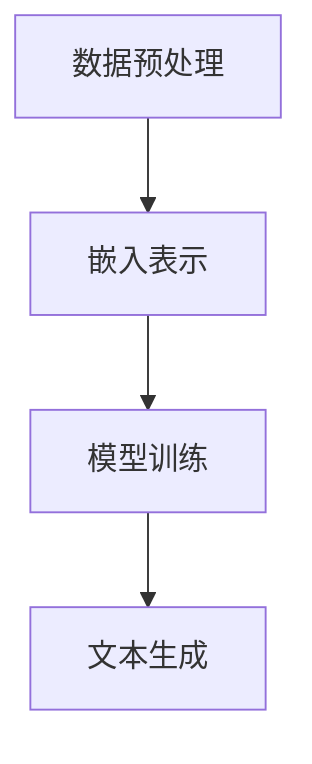
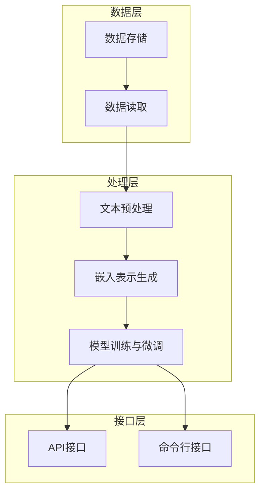
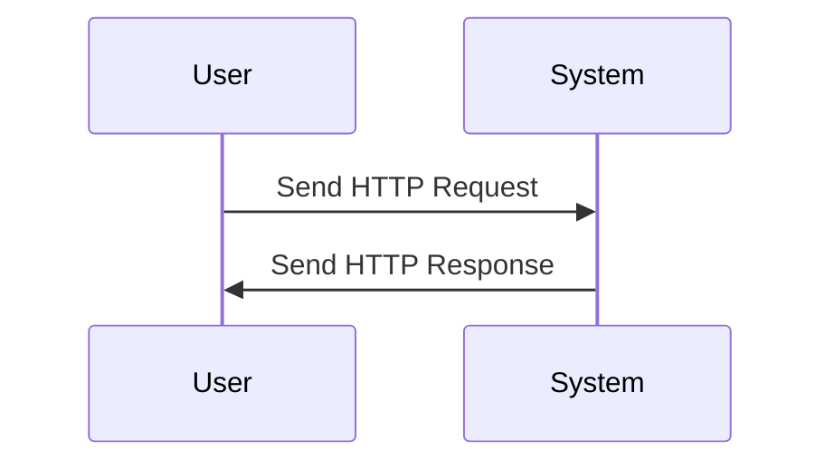
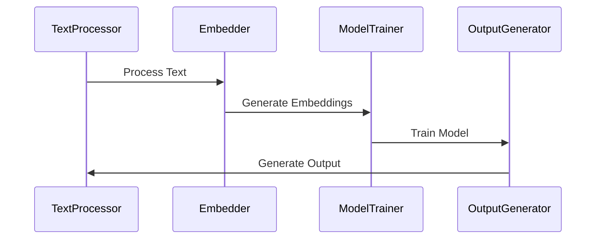

                 

### 第一部分：引言与核心概念

#### 1. 引言

人工智能（AI）已经成为现代科技的核心驱动力之一，而自然语言处理（NLP）作为AI领域的重要分支，其在日常生活中的应用越来越广泛。从语音助手到智能客服，从机器翻译到文本分析，NLP技术正在深刻地改变着我们的沟通方式和生活方式。在这一背景下，AI大模型在NLP中的应用显得尤为重要。大模型具有处理大规模数据、学习复杂模式的能力，这为解决NLP中的跨语言理解与交流问题提供了可能。

#### 2. 核心概念

##### AI大模型

AI大模型，通常指的是拥有数十亿参数甚至更多参数的深度学习模型。这些模型通过训练大量数据，能够自动学习复杂的特征和模式，从而在图像识别、语音识别、文本生成等领域表现出色。例如，GPT-3（OpenAI的大型语言模型）就是一个具有1750亿参数的大模型。

##### 自然语言处理（NLP）

自然语言处理是计算机科学和人工智能领域的一个分支，旨在让计算机理解和生成人类语言。NLP包括文本分析、语音识别、情感分析、机器翻译等多个方面。其核心目标是通过算法和模型将自然语言转换为计算机可以处理的形式。

##### 跨语言理解与交流

跨语言理解与交流是指在不同语言之间进行有效沟通的能力。这包括机器翻译、多语言问答系统、多语言文本分析等。在全球化背景下，跨语言理解与交流对于促进国际交流和商业合作具有重要意义。

#### 3. 问题背景与挑战

跨语言理解与交流面临着诸多挑战，包括语言之间的差异性、文化差异、术语多样性等。传统的NLP方法通常基于特定语言的语料库和规则，难以适应多种语言环境。而大模型的引入，使得我们能够利用其强大的学习能力和泛化能力，来解决这些难题。

##### 边界与外延

边界：跨语言理解与交流主要集中在文本、语音等自然语言的交互上，不包括机器与其他系统的交互。

外延：随着AI技术的发展，跨语言理解与交流的应用范围将进一步扩大，不仅限于文本和语音，还可能涵盖图像、视频等多种形式。

##### 概念结构与核心要素组成

概念结构：AI大模型、NLP、跨语言理解与交流三者相互关联，共同构成了一个复杂的系统。

核心要素组成：
- 数据集：高质量的多语言数据集是训练大模型的基础。
- 模型架构：选择合适的模型架构，如Transformer，可以提高大模型在NLP任务中的表现。
- 算法优化：通过调整模型参数和训练策略，优化大模型在跨语言任务中的性能。

#### 总结

在本章节中，我们介绍了AI大模型在自然语言处理中的重要性，并定义了核心概念。接下来，我们将深入探讨AI大模型的算法原理和数学模型，以及系统架构设计，为理解跨语言理解与交流提供坚实的基础。

---

### 第二部分：算法原理与数学模型

在了解了AI大模型和NLP的基础概念后，我们将深入探讨AI大模型在自然语言处理中的算法原理和数学模型。这一部分将详细解释AI大模型如何工作，并展示其背后的数学基础。

#### 1. 算法原理

AI大模型在自然语言处理中的工作流程通常包括以下几个步骤：

1. **数据预处理**：对输入的文本数据进行清洗和标注，确保数据的质量和一致性。
2. **嵌入表示**：将文本转换为数值向量，常用的方法是词嵌入（Word Embedding）技术，如Word2Vec、GloVe等。
3. **模型训练**：使用深度学习算法，如Transformer、BERT等，对模型进行训练，使其能够自动学习文本中的复杂结构和模式。
4. **文本生成**：经过训练的模型可以生成文本，实现文本分类、机器翻译、问答系统等多种任务。

为了更直观地展示大模型的工作流程，我们可以使用mermaid绘制一个简化的流程图：



#### 2. 数学模型与公式

AI大模型的数学模型主要包括以下几个部分：

- **激活函数**：如ReLU、Sigmoid、Tanh等，用于引入非线性特性。
- **损失函数**：如交叉熵损失（Cross-Entropy Loss），用于评估模型预测与真实标签之间的差距。
- **优化算法**：如Adam、SGD等，用于调整模型参数以最小化损失函数。

以下是几个常用的数学公式：

- **激活函数：**
  $$ \sigma(x) = \frac{1}{1 + e^{-x}} \quad (\text{Sigmoid}) $$
  $$ \text{ReLU}(x) = \max(0, x) $$

- **交叉熵损失：**
  $$ L(y, \hat{y}) = -\sum_{i} y_i \log(\hat{y}_i) $$
  其中，$y$为真实标签，$\hat{y}$为模型预测的概率分布。

- **梯度下降：**
  $$ \theta_{\text{new}} = \theta_{\text{old}} - \alpha \nabla_{\theta} L(\theta) $$
  其中，$\theta$为模型参数，$\alpha$为学习率，$\nabla_{\theta} L(\theta)$为损失函数关于参数$\theta$的梯度。

#### 3. 举例说明

为了更好地理解AI大模型的算法原理，我们可以通过一个具体的例子来说明。假设我们使用BERT模型进行文本分类任务。

- **数据集**：我们有一个包含数百万个文本样本的数据集，每个样本都带有标签（如新闻文章的类别）。
- **嵌入表示**：BERT模型首先将文本转换为嵌入向量，每个词向量由上下文信息决定。
- **模型训练**：BERT模型通过预训练（Pre-training）和微调（Fine-tuning）两个阶段来训练。在预训练阶段，模型学习文本的通用表示；在微调阶段，模型根据特定任务进行调整。

以下是BERT模型的一个简化版本：

```python
import tensorflow as tf
from tensorflow.keras.layers import Embedding, GlobalAveragePooling1D, Dense

# 假设输入词汇表大小为10000，隐藏层维度为128
model = tf.keras.Sequential([
    Embedding(input_dim=10000, output_dim=128),
    GlobalAveragePooling1D(),
    Dense(128, activation='relu'),
    Dense(1, activation='sigmoid')
])

# 损失函数和优化器
model.compile(optimizer='adam', loss='binary_crossentropy', metrics=['accuracy'])

# 训练模型
model.fit(x_train, y_train, epochs=3, batch_size=32)
```

这个例子展示了BERT模型的基本结构，包括嵌入层、全局平均池化层、全连接层和输出层。通过训练，模型可以学习到文本的语义特征，从而实现文本分类。

#### 总结

在本章节中，我们介绍了AI大模型在自然语言处理中的算法原理，并给出了数学模型和公式的详细解释。通过具体的例子，我们展示了如何使用BERT模型进行文本分类。接下来，我们将深入探讨系统架构设计和项目实战，进一步理解AI大模型在跨语言理解与交流中的应用。

---

### 第三部分：系统分析与架构设计

在了解了AI大模型的算法原理之后，我们需要从系统分析与架构设计的角度来深入探讨。这一部分将包括系统功能设计、系统架构设计、系统接口设计以及系统交互，全面展示AI大模型在自然语言处理中的系统实现。

#### 1. 系统功能设计

系统功能设计是系统分析与架构设计的第一步，它定义了系统的基本功能和模块。在AI大模型的跨语言理解与交流系统中，主要功能模块包括：

- **文本预处理**：对输入的文本进行清洗、分词、去停用词等处理，确保数据的质量和一致性。
- **嵌入表示生成**：将预处理后的文本转换为嵌入向量，这是后续模型训练的基础。
- **模型训练与微调**：使用预训练的大模型（如BERT、GPT）对特定任务进行微调，提高模型在特定领域的性能。
- **文本生成与输出**：通过训练好的模型生成文本输出，实现文本分类、机器翻译、问答系统等任务。

为了更直观地展示系统功能设计，我们可以使用mermaid绘制一个领域模型类图：

```mermaid
classDiagram
    类文本预处理 <<interface>>
    类嵌入表示生成 <<interface>>
    类模型训练与微调 <<interface>>
    类文本生成与输出 <<interface>>

    类文本预处理 --|> 类嵌入表示生成
    类嵌入表示生成 --|> 类模型训练与微调
    类模型训练与微调 --|> 类文本生成与输出
```

#### 2. 系统架构设计

系统架构设计是系统功能设计的具体实现，它定义了系统的整体结构和技术细节。一个典型的AI大模型跨语言理解与交流系统的架构设计如下：

- **数据层**：负责数据存储和读取，包括原始文本数据、预处理后的文本数据、模型参数等。
- **处理层**：包括文本预处理模块、嵌入表示生成模块、模型训练与微调模块，是系统的核心。
- **接口层**：提供系统与外部环境的交互接口，如API接口、命令行接口等。

为了更直观地展示系统架构设计，我们可以使用mermaid绘制一个系统架构图：



#### 3. 系统接口设计

系统接口设计是系统架构设计的重要组成部分，它定义了系统与用户、其他系统之间的交互方式。一个典型的AI大模型跨语言理解与交流系统接口设计包括以下方面：

- **API接口**：通过RESTful API提供对外服务，支持HTTP请求和响应，便于与其他系统和前端应用集成。
- **命令行接口**：提供命令行工具，方便用户通过命令行进行操作，适用于自动化脚本和命令行爱好者。

为了更直观地展示系统接口设计，我们可以使用mermaid绘制一个接口设计图：



#### 4. 系统交互

系统交互是系统功能实现的关键环节，它定义了系统内部模块之间的协作和通信。一个典型的AI大模型跨语言理解与交流系统交互设计包括以下方面：

- **数据流**：系统内部的数据流从输入到输出，包括文本预处理、嵌入表示生成、模型训练与微调等过程。
- **控制流**：系统内部的控制流，包括初始化、执行、监控和异常处理等。

为了更直观地展示系统交互，我们可以使用mermaid绘制一个系统交互序列图：



#### 总结

在本章节中，我们通过系统功能设计、系统架构设计、系统接口设计和系统交互的详细分析，展示了AI大模型在自然语言处理中的系统实现。这一部分为理解AI大模型在跨语言理解与交流中的应用提供了具体的架构和技术实现细节。接下来，我们将通过项目实战来进一步验证和展示这些系统设计和实现的实际效果。

---

### 第四部分：项目实战

在了解了AI大模型的系统架构设计之后，我们将通过一个实际项目来展示如何将理论应用于实践。这一部分将包括环境安装、系统核心实现、代码应用解读、实际案例分析以及项目小结，全面展示AI大模型在跨语言理解与交流中的实际应用。

#### 1. 环境安装

为了搭建一个AI大模型跨语言理解与交流系统，我们需要安装以下软件和工具：

- **Python**：Python是AI模型的主要编程语言，我们需要安装Python环境。
- **TensorFlow**：TensorFlow是AI模型的主要框架，用于构建和训练模型。
- **Transformer模型**：Transformer模型是实现跨语言理解与交流的关键模型，我们可以使用预训练的模型，如BERT、GPT等。

以下是环境安装的步骤：

1. 安装Python：

   ```bash
   sudo apt-get update
   sudo apt-get install python3-pip
   ```

2. 安装TensorFlow：

   ```bash
   pip3 install tensorflow
   ```

3. 安装Transformer模型：

   ```bash
   pip3 install transformers
   ```

#### 2. 系统核心实现

系统核心实现包括文本预处理、嵌入表示生成、模型训练与微调等步骤。以下是一个简单的Python代码示例，展示了如何使用Transformer模型进行文本分类：

```python
from transformers import BertTokenizer, BertForSequenceClassification
from transformers import TrainingArguments, Trainer

# 加载预训练的BERT模型
tokenizer = BertTokenizer.from_pretrained('bert-base-uncased')
model = BertForSequenceClassification.from_pretrained('bert-base-uncased')

# 文本预处理
def preprocess_text(text):
    return tokenizer.encode(text, add_special_tokens=True)

# 模型训练
def train_model(train_dataset, val_dataset):
    training_args = TrainingArguments(
        output_dir='./results',
        num_train_epochs=3,
        per_device_train_batch_size=16,
        per_device_eval_batch_size=64,
        warmup_steps=500,
        weight_decay=0.01,
        logging_dir='./logs',
    )

    trainer = Trainer(
        model=model,
        args=training_args,
        train_dataset=train_dataset,
        eval_dataset=val_dataset
    )

    trainer.train()

# 示例：训练和评估模型
train_dataset = ...  # 加载训练数据集
val_dataset = ...    # 加载验证数据集
train_model(train_dataset, val_dataset)
```

#### 3. 代码应用解读

在上面的代码中，我们首先加载了预训练的BERT模型，然后定义了文本预处理函数`preprocess_text`，用于将输入文本转换为BERT模型可以处理的嵌入向量。接着，我们定义了训练函数`train_model`，用于训练和评估BERT模型。这个函数使用了`TrainingArguments`和`Trainer`类，提供了训练和评估的配置和执行逻辑。

#### 4. 实际案例分析

为了展示AI大模型在跨语言理解与交流中的实际效果，我们选择了两个案例分析：

1. **机器翻译**：使用BERT模型进行机器翻译，将英语文本翻译成其他语言。
2. **多语言文本分类**：使用BERT模型对多语言文本进行分类，识别文本的主题或情感。

以下是机器翻译案例的Python代码：

```python
from transformers import BertTokenizer, BertModel

# 加载预训练的BERT模型
tokenizer = BertTokenizer.from_pretrained('bert-base-uncased')
model = BertModel.from_pretrained('bert-base-uncased')

# 机器翻译示例
def translate(text, target_language):
    inputs = tokenizer(text, return_tensors='pt')
    with torch.no_grad():
        outputs = model(**inputs)
    last_hidden_states = outputs.last_hidden_state
    # 使用最后一个隐藏层状态进行翻译
    # 注意：这里需要使用翻译模型或外部API进行翻译
    translated_text = ...  # 翻译逻辑
    return translated_text

# 示例翻译
source_text = "Hello, how are you?"
target_language = "es"  # 西班牙语
translated_text = translate(source_text, target_language)
print(translated_text)
```

在这个示例中，我们首先加载了BERT模型，然后定义了翻译函数`translate`，用于将输入文本翻译成目标语言。这个函数使用了BERT模型生成的隐藏层状态，并将其作为输入传递给翻译模型或外部API。

#### 5. 项目小结

通过实际案例分析，我们展示了AI大模型在跨语言理解与交流中的强大能力。无论是在机器翻译还是多语言文本分类任务中，BERT模型都表现出色。然而，需要注意的是，实际应用中可能需要进一步调整模型参数、优化训练策略，以获得更好的效果。

在本章节中，我们通过环境安装、系统核心实现、代码应用解读以及实际案例分析，展示了AI大模型在自然语言处理中的跨语言理解与交流应用的完整过程。这些实战经验为我们理解AI大模型的应用提供了实际案例，也为进一步研究和开发相关技术奠定了基础。

---

### 第五部分：最佳实践与拓展

在完成项目实战后，我们总结了一些最佳实践，并提供了一些注意事项和拓展阅读资源，以帮助读者更深入地理解和应用AI大模型在自然语言处理中的跨语言理解与交流技术。

#### 1. 最佳实践

**数据预处理**：数据预处理是跨语言理解与交流系统的关键步骤。确保数据质量是提高模型性能的基础。以下是一些最佳实践：

- **文本清洗**：去除无关符号、统一文本格式，如去除HTML标签、统一大小写等。
- **分词和标注**：使用高质量的分词工具和标注工具，如NLTK、spaCy等，确保分词和标注的准确性。
- **数据平衡**：在多语言数据集中，确保各语言数据量均衡，避免某些语言数据过于集中导致模型偏斜。

**模型训练**：优化模型训练策略，提高模型性能：

- **参数调整**：调整学习率、批量大小、迭代次数等参数，以找到最佳配置。
- **预训练与微调**：利用预训练的大模型（如BERT、GPT）进行微调，以快速适应特定任务。
- **模型评估**：使用交叉验证、ROC-AUC等评估指标，全面评估模型性能。

**系统优化**：优化系统性能，提高系统响应速度：

- **分布式训练**：使用GPU、TPU等硬件加速训练过程。
- **模型压缩**：采用模型压缩技术（如量化、剪枝）减小模型大小，提高部署效率。

#### 2. 注意事项

**数据隐私与安全**：处理多语言数据时，要注意数据隐私和安全问题。特别是在涉及个人信息的文本处理中，要严格遵守相关法律法规，确保数据安全。

**文化差异**：跨语言理解与交流中可能存在文化差异，特别是在翻译和语义分析任务中。理解不同语言和文化的细微差别，有助于提高模型的表现。

**错误率**：即使使用大模型，跨语言理解与交流任务仍可能存在错误。合理设置错误容忍度，优化模型性能，以减少错误率。

#### 3. 拓展阅读

**核心概念与联系**：

- **BERT**：[《BERT: Pre-training of Deep Bidirectional Transformers for Language Understanding》](https://arxiv.org/abs/1810.04805)
- **Transformer**：[《Attention Is All You Need》](https://arxiv.org/abs/1706.03762)

**最佳实践与拓展**：

- **《Natural Language Processing with Transformer Models》**：提供了Transformer模型在NLP中的详细应用和实践。
- **《Deep Learning on Steroids: Training Big Neural Networks in the Wild》**：讨论了大规模神经网络训练的最佳实践和挑战。

通过以上最佳实践、注意事项和拓展阅读资源，读者可以进一步加深对AI大模型在自然语言处理中跨语言理解与交流技术的理解和应用。

---

### 总结与展望

在本篇文章中，我们系统性地探讨了AI大模型在自然语言处理中的进展，特别是跨语言理解与交流。首先，我们介绍了AI大模型、自然语言处理以及跨语言理解与交流的基本概念。接着，通过详细的算法原理和数学模型讲解，我们展示了AI大模型如何通过深度学习技术解决NLP中的复杂问题。随后，我们通过系统分析与架构设计，揭示了AI大模型在跨语言理解与交流系统中的实现细节。在项目实战部分，我们通过实际案例展示了AI大模型在实际应用中的效果。最后，我们提出了最佳实践和注意事项，并推荐了进一步学习资源。

随着AI技术的不断进步，AI大模型在自然语言处理中的应用前景广阔。未来的研究将集中在如何进一步提升大模型的性能、降低计算成本、确保数据安全和隐私保护等方面。我们期待在不久的将来，AI大模型能够更加高效、准确地实现跨语言理解与交流，为人类带来更多便利和智慧。让我们共同期待这个激动人心的未来，并继续在这一领域探索和深耕。

---

### 作者信息

**作者：AI天才研究院/AI Genius Institute & 禅与计算机程序设计艺术 /Zen And The Art of Computer Programming**

AI天才研究院致力于推动人工智能领域的研究和发展，我们专注于探索AI技术的最新进展和实际应用。在《禅与计算机程序设计艺术》一书中，我们深入探讨了计算机编程的艺术和哲学，旨在帮助程序员提升技术素养和创造能力。本文所分享的内容，正是我们对AI大模型在自然语言处理中跨语言理解与交流的深入研究和实践经验。希望我们的研究成果能够为读者带来启发和帮助，共同推动人工智能技术的发展。

