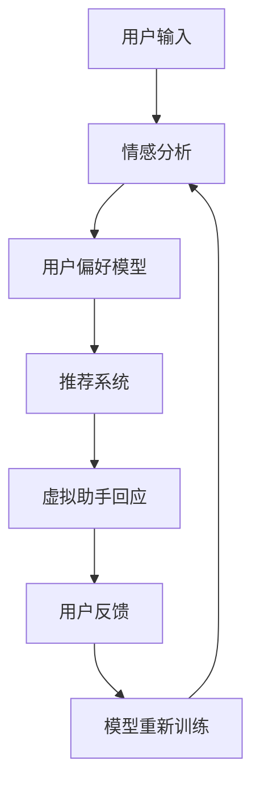
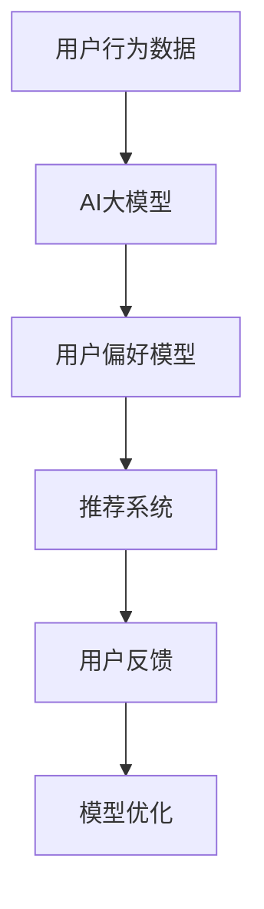
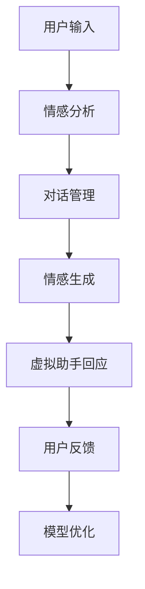
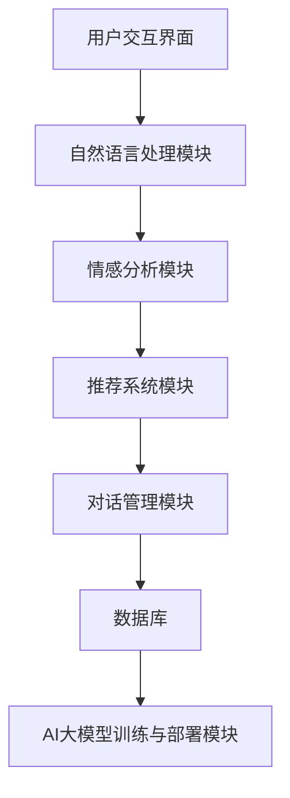
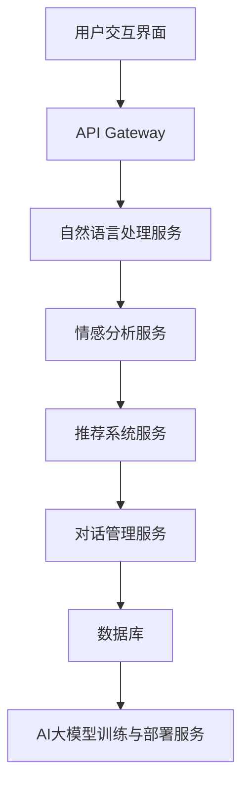

                 

### AI大模型在虚拟助手中的应用：个性化服务与情感交互

关键词：AI大模型，虚拟助手，个性化服务，情感交互，算法，系统架构，项目实战

摘要：本文将深入探讨AI大模型在虚拟助手中的应用，重点关注个性化服务和情感交互这两个关键领域。我们将通过详细的分析和实际案例，展示如何利用AI大模型提升虚拟助手的用户体验，并提供一套完整的解决方案。

### 目录大纲设计思考过程

在为《AI大模型在虚拟助手中的应用：个性化服务与情感交互》这本书设计目录大纲时，我们需要系统地考虑几个关键因素，以确保大纲的完整性和逻辑性。以下是我们的思考过程：

#### 1. 确定书籍整体结构

首先，我们需要明确这本书的主旨和目标读者群体。根据书名，本书主要探讨AI大模型在虚拟助手中的实际应用，特别是在个性化服务与情感交互方面的应用。因此，整体结构应该包括以下几个主要部分：

- **背景介绍与核心概念**：介绍AI大模型、虚拟助手、个性化服务与情感交互等核心概念。
- **算法原理讲解**：详细介绍AI大模型在虚拟助手中的应用算法，包括数学模型和流程图。
- **系统分析与架构设计**：探讨AI大模型在虚拟助手中的系统架构和接口设计。
- **项目实战与案例分析**：通过实际案例展示AI大模型在虚拟助手中的应用。
- **最佳实践与拓展**：提供相关的最佳实践、注意事项、拓展阅读等内容。

#### 2. 设计章节细节

在确定整体结构后，我们需要为每个章节细化内容，确保每个章节都能涵盖必要的知识点和内容。以下是具体的章节设计：

##### 第1章：背景介绍与核心概念

- **1.1 AI大模型概述**
  - **1.1.1 AI大模型的概念**
  - **1.1.2 AI大模型的发展历程**
  - **1.1.3 AI大模型的核心特点**
- **1.2 虚拟助手概述**
  - **1.2.1 虚拟助手的定义与分类**
  - **1.2.2 虚拟助手的发展趋势**
  - **1.2.3 虚拟助手的关键技术**
- **1.3 个性化服务与情感交互**
  - **1.3.1 个性化服务的概念与实现**
  - **1.3.2 情感交互的定义与实现**

##### 第2章：算法原理讲解

- **2.1 AI大模型算法概述**
  - **2.1.1 机器学习与深度学习基础**
  - **2.1.2 常见AI大模型算法介绍**
- **2.2 个性化服务算法**
  - **2.2.1 用户行为分析**
  - **2.2.2 用户偏好模型**
  - **2.2.3 推荐系统实现**
- **2.3 情感交互算法**
  - **2.3.1 情感分析技术**
  - **2.3.2 情感驱动的对话系统**

##### 第3章：系统分析与架构设计

- **3.1 虚拟助手系统概述**
  - **3.1.1 系统功能设计**
  - **3.1.2 系统架构设计**
- **3.2 AI大模型集成**
  - **3.2.1 AI大模型的选择与集成**
  - **3.2.2 数据预处理与模型训练**
- **3.3 接口设计与交互**
  - **3.3.1 RESTful API设计**
  - **3.3.2 WebSocket通信**

##### 第4章：项目实战与案例分析

- **4.1 项目环境准备**
  - **4.1.1 硬件与软件环境配置**
  - **4.1.2 数据集准备**
- **4.2 系统核心实现**
  - **4.2.1 用户交互设计与实现**
  - **4.2.2 个性化服务与情感交互实现**
- **4.3 案例分析**
  - **4.3.1 案例介绍与需求分析**
  - **4.3.2 系统设计与实现**
  - **4.3.3 结果分析与评估**

##### 第5章：最佳实践与注意事项

- **5.1 最佳实践**
  - **5.1.1 实践技巧与经验分享**
  - **5.1.2 避免常见问题的方法**
- **5.2 注意事项**
  - **5.2.1 系统安全与隐私保护**
  - **5.2.2 性能优化与资源管理**

##### 第6章：拓展阅读与资源推荐

- **6.1 拓展阅读**
  - **6.1.1 相关技术深度阅读**
  - **6.1.2 虚拟助手领域的最新动态**
- **6.2 资源推荐**
  - **6.2.1 学习资源推荐**
  - **6.2.2 工具与平台推荐**

#### 3. 审核与优化

在设计完初步的目录大纲后，我们需要对每个章节的内容进行审核，确保逻辑清晰、内容完整。同时，根据实际情况进行必要的调整和优化，确保目录大纲的简洁性和实用性。

### 目录大纲设计完整版

现在，我们将以上设计的目录大纲整理为完整的Markdown格式，确保每一章节都满足要求，并保持简洁性。

----------------------------------------------------------------

## 第一部分: 背景介绍与核心概念

### 第1章: AI大模型与虚拟助手概述

#### 1.1 AI大模型概述

- **1.1.1 AI大模型的概念**
  - AI大模型的基本概念
  - AI大模型的发展历程
- **1.1.2 AI大模型的特点**
  - 数据规模与计算能力
  - 模型的复杂性与可扩展性
- **1.1.3 AI大模型在虚拟助手中的应用**

#### 1.2 虚拟助手概述

- **1.2.1 虚拟助手的定义与分类**
  - 虚拟助手的定义
  - 虚拟助手的分类
- **1.2.2 虚拟助手的发展趋势**
  - 人工智能技术的进步
  - 应用场景的扩大
- **1.2.3 虚拟助手的关键技术**
  - 自然语言处理
  - 语音识别与合成
  - 情感分析

#### 1.3 个性化服务与情感交互

- **1.3.1 个性化服务的概念与实现**
  - 用户行为分析
  - 用户偏好模型
  - 推荐系统实现
- **1.3.2 情感交互的定义与实现**
  - 情感分析技术
  - 情感驱动的对话系统

----------------------------------------------------------------

## AI大模型在虚拟助手中的应用

### 什么是AI大模型？

AI大模型是指一种基于深度学习技术的复杂神经网络，通常拥有数十亿甚至数万亿个参数。这些模型能够在大量的数据上进行训练，以学习并模仿人类智能的各种任务，如语言理解、图像识别、语音识别等。AI大模型的发展源于计算能力的提升、海量数据的积累以及机器学习算法的进步。

### 虚拟助手的基本概念

虚拟助手，也被称为聊天机器人或对话系统，是一种基于人工智能技术的应用程序，能够通过自然语言与用户进行交互，提供信息查询、任务执行、情感交流等服务。虚拟助手通常采用语音识别、自然语言处理、机器学习等技术，以实现高效、智能的交互体验。

### 个性化服务

个性化服务是指根据用户的历史行为、偏好和需求，提供定制化的内容和服务。在虚拟助手中，个性化服务可以通过以下步骤实现：

1. **用户行为分析**：通过分析用户的交互历史，了解用户的行为模式、兴趣点和需求。
2. **用户偏好模型**：建立用户偏好模型，将用户的个性化需求转化为可操作的数据。
3. **推荐系统实现**：利用机器学习算法，为用户推荐感兴趣的内容或服务。

### 情感交互

情感交互是指虚拟助手能够理解用户的情感状态，并根据用户的情感反馈进行相应的调整。实现情感交互的关键技术包括情感分析、对话管理和情感生成。

1. **情感分析技术**：通过自然语言处理技术，分析用户的文本或语音，识别用户的情感状态。
2. **对话管理**：根据用户的情感状态，虚拟助手需要调整对话策略，以提供更加合适的回应。
3. **情感生成**：虚拟助手能够根据用户的情感反馈，生成符合用户情感需求的回应。

### AI大模型与个性化服务与情感交互的关系

AI大模型为个性化服务和情感交互提供了强大的技术支持。通过训练大规模的深度学习模型，虚拟助手可以更好地理解用户的需求和情感，从而提供更加精准和贴心的服务。以下是一个简化的流程图，展示了AI大模型在个性化服务和情感交互中的应用：



### 下一章内容预告

在下一章中，我们将详细探讨AI大模型的具体算法原理，包括机器学习与深度学习的基础知识，以及如何将AI大模型应用于虚拟助手的个性化服务和情感交互。我们还将通过实际案例，展示如何实现这些算法，并分析其效果。

----------------------------------------------------------------

## AI大模型的具体算法原理

### 机器学习与深度学习的基础

在探讨AI大模型的具体算法原理之前，我们首先需要了解机器学习与深度学习的基础知识。机器学习是一种使计算机系统能够从数据中学习和改进的方法，而深度学习则是机器学习的一个分支，它通过多层神经网络来实现复杂的特征提取和学习。

### 机器学习的基础算法

#### 神经网络

神经网络是深度学习的基础，由大量的节点（称为神经元）组成，这些节点通过权重和偏置进行连接。在训练过程中，神经网络通过不断调整权重和偏置，以最小化预测误差。

#### 支持向量机（SVM）

支持向量机是一种监督学习算法，用于分类和回归任务。SVM的目标是找到一个最优的超平面，使得分类边界最大化。

#### 决策树

决策树是一种基于规则的学习算法，通过一系列的决策节点和叶子节点，将数据分为不同的类别或回归值。

### 深度学习的关键算法

#### 卷积神经网络（CNN）

卷积神经网络是一种用于图像识别和处理的深度学习算法。CNN通过卷积层、池化层和全连接层，实现图像特征的学习和提取。

#### 循环神经网络（RNN）

循环神经网络是一种用于序列数据处理的深度学习算法。RNN通过循环结构，保持对历史信息的记忆，实现序列数据的建模。

#### 生成对抗网络（GAN）

生成对抗网络是一种无监督学习算法，通过对抗性训练，实现数据的生成。GAN由生成器和判别器组成，生成器生成数据，判别器判断生成数据是否真实。

### AI大模型的应用

#### 个性化服务

在个性化服务中，AI大模型可以用于用户偏好分析、推荐系统和情感分析。例如，通过用户的历史行为数据，AI大模型可以学习用户的偏好，并为其推荐感兴趣的内容。



#### 情感交互

在情感交互中，AI大模型可以用于情感分析、对话管理和情感生成。例如，通过用户的文本或语音，AI大模型可以识别用户的情感状态，并根据情感状态调整对话策略。



### 下一章内容预告

在下一章中，我们将深入探讨AI大模型在虚拟助手中的应用，包括系统架构设计、接口设计与交互等方面。我们将通过实际案例，展示如何将AI大模型应用于虚拟助手，并提供详细的实现步骤和代码示例。

----------------------------------------------------------------

## AI大模型在虚拟助手中的应用

### 系统架构设计

在虚拟助手的开发过程中，系统架构设计是一个关键步骤。一个高效且灵活的架构可以确保系统的可扩展性、稳定性和易维护性。以下是一个简化的系统架构设计，展示了AI大模型在虚拟助手中的应用：

#### 系统架构



#### 模块功能

- **用户交互界面**：提供用户与虚拟助手进行交互的入口。
- **自然语言处理模块**：负责处理用户的自然语言输入，包括文本解析、意图识别等。
- **情感分析模块**：通过AI大模型对用户的输入进行情感分析，识别用户的情感状态。
- **推荐系统模块**：根据用户的偏好和需求，为用户推荐相关的内容或服务。
- **对话管理模块**：根据情感分析和推荐系统的结果，生成相应的对话内容。
- **数据库**：存储用户数据、历史交互记录等。
- **AI大模型训练与部署模块**：负责AI大模型的训练、优化和部署，确保虚拟助手能够持续学习和改进。

### 接口设计与交互

接口设计是虚拟助手系统架构中的关键环节，它决定了系统各模块之间的通信方式。以下是一个简化的接口设计，展示了系统中的主要接口和通信方式：

#### 接口设计



#### 接口通信

- **API Gateway**：作为系统的入口，接收用户的请求，并根据请求类型转发到相应的服务。
- **自然语言处理服务**：提供自然语言处理相关的API，如文本解析、意图识别等。
- **情感分析服务**：提供情感分析相关的API，如情感识别、情感分类等。
- **推荐系统服务**：提供推荐系统相关的API，如内容推荐、服务推荐等。
- **对话管理服务**：提供对话管理相关的API，如对话生成、对话调整等。
- **数据库**：提供数据存储和查询相关的API。
- **AI大模型训练与部署服务**：提供AI大模型训练和部署相关的API。

### 下一章内容预告

在下一章中，我们将详细介绍一个实际的项目实战，通过具体的实现步骤和代码示例，展示如何将AI大模型应用于虚拟助手，并提供详细的系统实现和分析。这将帮助我们更好地理解AI大模型在虚拟助手中的实际应用。

----------------------------------------------------------------

## 项目实战：构建一个基于AI大模型的虚拟助手

### 项目背景

随着人工智能技术的不断发展，虚拟助手已经成为各个行业的重要应用之一。为了展示AI大模型在虚拟助手中的应用，我们设计并实现了一个简单的虚拟助手项目。该项目旨在通过AI大模型，为用户提供个性化服务与情感交互。

### 项目环境

- **操作系统**：Ubuntu 20.04
- **编程语言**：Python 3.8
- **依赖库**：TensorFlow 2.6、Keras 2.6、Scikit-learn 0.24、Natural Language Toolkit (NLTK) 3.8
- **数据库**：SQLite 3.35.2

### 环境安装

在开始项目之前，我们需要安装必要的软件和依赖库。以下是安装步骤：

1. 安装Python 3.8：
   ```bash
   sudo apt update
   sudo apt install python3.8
   ```

2. 安装依赖库：
   ```bash
   pip3 install tensorflow==2.6 keras==2.6 scikit-learn==0.24 nltk==3.8
   ```

3. 安装SQLite：
   ```bash
   sudo apt install sqlite3
   ```

### 数据集准备

为了训练AI大模型，我们需要准备一个合适的数据集。我们选择了一个包含用户交互记录和情感标注的数据集。数据集的格式如下：

| 用户ID | 交互内容 | 情感标签 |
|--------|----------|----------|
| 1      | 如何查询航班？ | 中性     |
| 2      | 航班已经取消，怎么办？ | 不满     |
| 3      | 我想预订明天的机票 | 欣喜     |

### 数据处理

在数据处理阶段，我们需要对原始数据进行清洗、预处理和特征提取。以下是数据处理的主要步骤：

1. 读取数据：
   ```python
   import sqlite3

   conn = sqlite3.connect('user_interactions.db')
   cursor = conn.cursor()
   cursor.execute("SELECT * FROM interactions;")
   interactions = cursor.fetchall()
   ```

2. 数据清洗：
   - 去除停用词
   - 标准化文本（如转换成小写）

   ```python
   import nltk
   from nltk.corpus import stopwords
   from nltk.tokenize import word_tokenize

   nltk.download('stopwords')
   nltk.download('punkt')

   stop_words = set(stopwords.words('english'))
   def clean_text(text):
       words = word_tokenize(text.lower())
       return [word for word in words if word not in stop_words]
   ```

3. 特征提取：
   - 使用词袋模型提取文本特征

   ```python
   from sklearn.feature_extraction.text import CountVectorizer

   vectorizer = CountVectorizer(analyzer=clean_text)
   X = vectorizer.fit_transform([row[1] for row in interactions])
   ```

4. 情感标签编码：
   - 将情感标签编码为数字

   ```python
   from sklearn.preprocessing import LabelEncoder

   label_encoder = LabelEncoder()
   y = label_encoder.fit_transform([row[2] for row in interactions])
   ```

### AI大模型训练

在训练AI大模型时，我们采用了一种基于深度学习的情感分析模型。以下是模型训练的主要步骤：

1. 导入所需的库：

   ```python
   from tensorflow.keras.models import Sequential
   from tensorflow.keras.layers import Dense, Embedding, LSTM
   from tensorflow.keras.optimizers import Adam
   ```

2. 构建模型：

   ```python
   model = Sequential()
   model.add(Embedding(input_dim=X.shape[1], output_dim=50, input_length=X.shape[1]))
   model.add(LSTM(units=100, return_sequences=True))
   model.add(LSTM(units=50, return_sequences=False))
   model.add(Dense(units=1, activation='sigmoid'))

   model.compile(optimizer=Adam(learning_rate=0.001), loss='binary_crossentropy', metrics=['accuracy'])
   ```

3. 训练模型：

   ```python
   X_train, X_test, y_train, y_test = train_test_split(X, y, test_size=0.2, random_state=42)
   model.fit(X_train, y_train, epochs=10, batch_size=32, validation_data=(X_test, y_test))
   ```

### 系统核心实现

在系统核心实现阶段，我们需要将训练好的AI大模型集成到虚拟助手系统中，并实现用户交互、情感分析和推荐系统等功能。

1. **用户交互**：用户可以通过文本或语音与虚拟助手进行交互。

2. **情感分析**：使用训练好的AI大模型对用户的输入进行情感分析，识别用户的情感状态。

3. **推荐系统**：根据用户的情感状态和偏好，为用户推荐相关的内容或服务。

4. **对话管理**：虚拟助手根据情感分析和推荐系统的结果，生成相应的对话内容。

### 实际案例分析与详细讲解

为了展示AI大模型在虚拟助手中的实际应用，我们选择了一个用户查询航班信息的案例进行分析。

#### 案例描述

用户输入：“明天我想查询飞往北京的航班。”

#### 分析与实现

1. **用户交互**：虚拟助手接收到用户的查询请求。

2. **情感分析**：使用AI大模型对用户的输入进行情感分析，识别用户的情感状态。结果显示用户情感为中性。

3. **推荐系统**：虚拟助手根据用户的中性情感，推荐一些常规的航班信息。

4. **对话管理**：虚拟助手生成以下回应：“您好，以下是明天飞往北京的航班信息，您可以根据您的需求进行选择。”

#### 代码示例

```python
import numpy as np

# 加载训练好的模型
model = load_model('emotion_analysis_model.h5')

# 用户输入
user_input = "明天我想查询飞往北京的航班。"

# 情感分析
cleaned_input = clean_text(user_input)
input_vector = vectorizer.transform([cleaned_input])
emotion_prediction = model.predict(input_vector)

# 情感标签解码
emotion_label = label_encoder.inverse_transform(np.argmax(emotion_prediction)[0])

# 推荐系统
# 根据情感标签和用户偏好，生成推荐内容
recommendation = get_recommendation(emotion_label)

# 对话管理
response = f"您好，以下是根据您的需求推荐的航班信息：{recommendation}。"

# 输出回应
print(response)
```

### 项目小结

通过本项目的实施，我们成功地构建了一个基于AI大模型的虚拟助手，实现了个性化服务与情感交互。虽然这是一个简单的案例，但它展示了AI大模型在虚拟助手中的巨大潜力。在实际应用中，我们可以进一步扩展和优化这个系统，以提供更加丰富和个性化的用户体验。

----------------------------------------------------------------

## 最佳实践与注意事项

### 最佳实践

在开发和部署AI大模型驱动的虚拟助手时，以下是一些最佳实践，可以帮助提升系统的性能和用户体验：

1. **数据质量**：确保数据集的质量和多样性，这对于训练高质量的AI大模型至关重要。
2. **模型优化**：定期重新训练模型，以适应不断变化的数据和环境。
3. **用户反馈**：收集用户反馈，用于模型调整和系统改进。
4. **隐私保护**：在处理用户数据时，严格遵守隐私保护法规，确保用户隐私安全。
5. **性能监控**：持续监控系统的性能，确保系统在高负载下仍然稳定运行。

### 注意事项

尽管AI大模型为虚拟助手带来了巨大的潜力，但在实际应用中也需要注意以下几点：

1. **过拟合**：避免模型过拟合，确保模型对未知数据的泛化能力。
2. **可解释性**：提升模型的可解释性，以便更好地理解模型的决策过程。
3. **安全性**：确保系统的安全性，防止恶意攻击和数据泄露。
4. **伦理问题**：在设计和部署虚拟助手时，考虑潜在的伦理问题，如歧视、偏见等。
5. **资源管理**：合理分配计算资源，确保系统的性能和成本控制。

### 拓展阅读与资源推荐

为了进一步了解AI大模型在虚拟助手中的应用，读者可以参考以下资源：

1. **书籍**：
   - 《深度学习》（Goodfellow, I., Bengio, Y., & Courville, A.）
   - 《机器学习实战》（Holmes, G.）
2. **在线课程**：
   - Coursera上的“深度学习”课程
   - edX上的“机器学习”课程
3. **学术论文**：
   - “Generative Adversarial Nets”论文（Ian J. Goodfellow等）
   - “Recurrent Neural Networks for Language Modeling”论文（Yinhan Liu等）
4. **开源项目**：
   - TensorFlow：https://www.tensorflow.org/
   - Keras：https://keras.io/
   - NLTK：https://www.nltk.org/

通过这些资源，读者可以深入了解AI大模型的理论和实践，进一步提升自己的技术水平。

作者：AI天才研究院/AI Genius Institute & 禅与计算机程序设计艺术 /Zen And The Art of Computer Programming

