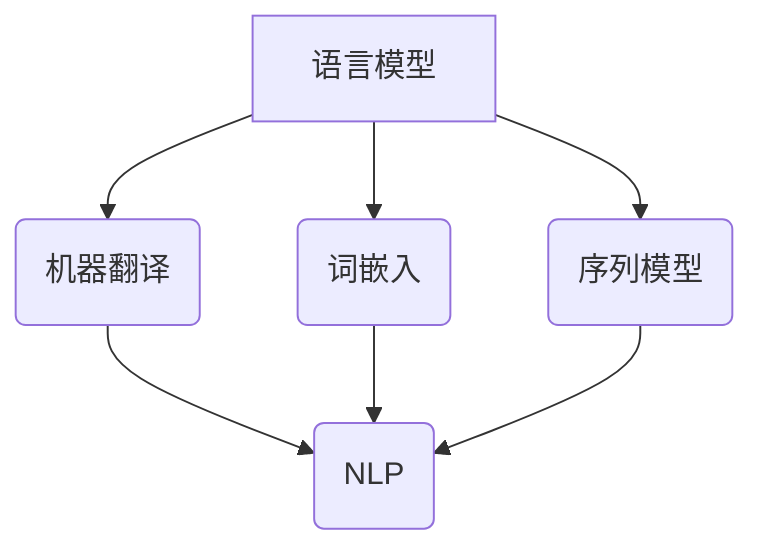
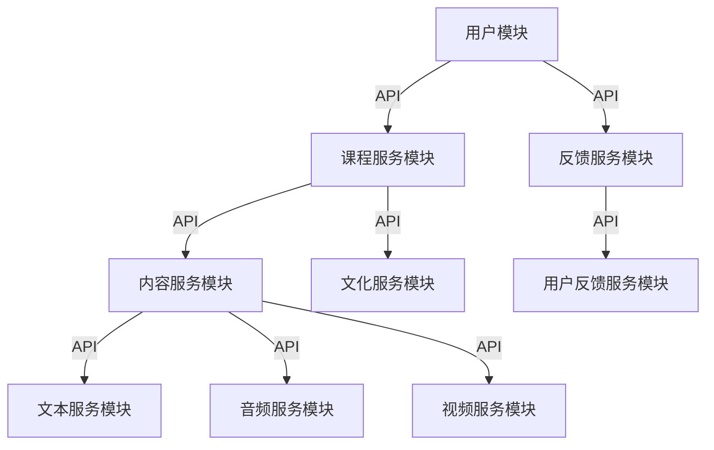
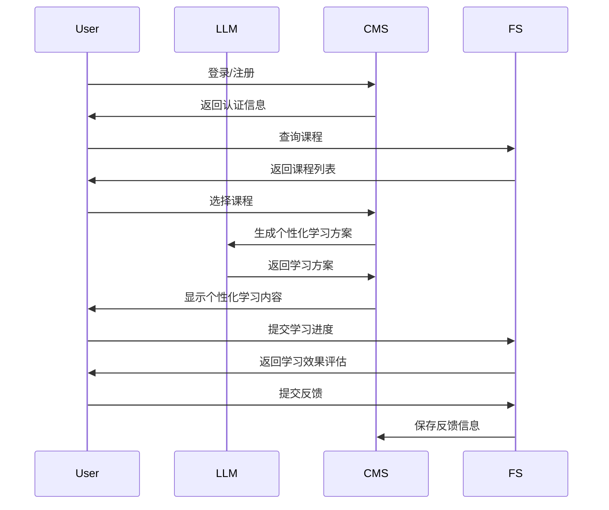

                 


## 引言

### 问题背景与现状

语言学习是每个人都可能遇到的需求，无论是在学校教育还是在职场中，掌握一门或多门外语都能够显著提升个人的竞争力和沟通能力。然而，传统的语言学习方式存在一些问题，如：

1. **个性化不足**：传统教学方法通常采用“一刀切”的模式，无法充分考虑学生的个人差异，导致学习效果不佳。
2. **教学资源限制**：语言学习往往需要大量的教学资源和教材，而教师和教学设施的局限性使得这些资源难以得到充分利用。
3. **文化理解难度**：对于非母语学习者的来说，理解并掌握语言背后的文化内涵是一个挑战，这不仅仅是语法和词汇的问题，更是对文化的深层次理解。

### 当前语言学习存在的问题

1. **学习效率低**：许多语言学习者在学习过程中感到枯燥乏味，学习效率低下，导致学习进度缓慢。
2. **学习效果不显著**：由于缺乏有效的反馈和评估机制，很多语言学习者难以量化自己的学习成果，不知道自己在哪些方面需要改进。
3. **文化理解不足**：语言是文化的载体，但学习者往往难以深入理解语言背后的文化，导致语言学习的效果打折。

### AI大模型在语言学习中的潜力

随着人工智能技术的飞速发展，尤其是AI大模型的崛起，为语言学习带来了前所未有的可能性：

1. **个性化教学**：AI大模型可以通过对学习者学习习惯、兴趣和知识水平的分析，提供个性化的教学方案，提高学习效率。
2. **实时反馈**：AI大模型可以实时监测学习者的学习状态，提供及时的反馈和纠正，帮助学习者更快地掌握语言。
3. **文化理解**：AI大模型通过对大量语言和文化数据的处理，可以帮助学习者更好地理解语言背后的文化，提升语言学习的深度和广度。

## 总结

通过本文的探讨，我们可以看到AI大模型在语言学习中的应用潜力巨大。接下来，我们将进一步深入探讨AI大模型的基础知识、个性化教学与文化理解的结合，以及实际应用案例，以期为读者提供一个全面且深入的理解。让我们一步步思考，揭开AI大模型在语言学习中的神秘面纱。

---

**关键词**：AI大模型、语言学习、个性化教学、文化理解

**摘要**：本文探讨了AI大模型在语言学习中的应用，分析了其个性化教学和文化理解的潜力。通过介绍AI大模型的基础知识，以及其在教学和文化理解中的实际应用，本文为AI大模型在语言学习领域的发展提供了新的视角和思路。

---

**正文：AI大模型基础知识**

### AI大模型概述

#### 什么是AI大模型

AI大模型，又称大型预训练模型，是指通过深度学习技术，在大量数据上进行训练，形成具有高精度和广泛知识面的模型。这类模型具有强大的通用性和适应性，可以在多种任务中取得优异的性能。

#### AI大模型的特点

1. **数据驱动的学习**：AI大模型通过海量数据学习，可以获取丰富的知识，并不断自我优化。
2. **高度的泛化能力**：AI大模型在预训练阶段学习到的基础知识和技能，可以迁移到不同的任务中，实现跨领域的应用。
3. **强大的表达能力**：AI大模型能够以复杂的数学模型表示自然语言，从而实现对语言现象的深入理解和精确表达。

#### AI大模型与传统AI的区别

传统AI方法通常针对特定任务进行设计和训练，而AI大模型则是在大规模数据上进行预训练，然后通过微调适配到特定任务中。这种预训练-微调的方法使得AI大模型在处理复杂任务时表现出色。

### AI大模型在语言学习中的应用

#### 语言模型

语言模型是AI大模型在语言学习中的一个重要应用，它可以预测下一个词语或句子，从而帮助学习者理解和使用语言。

##### 语言模型的基本原理

语言模型基于统计学习方法，通过对大量文本数据进行分析，建立词语之间的概率关系。常见的语言模型有N-gram模型、神经网络模型等。

##### 语言模型的评价标准

语言模型的性能通常通过 perplexity（困惑度）来衡量，困惑度越低，语言模型的表现越好。

##### 语言模型的发展历程

从最初的N-gram模型，到现代的神经网络模型，如BERT、GPT等，语言模型经历了巨大的发展。现代语言模型在处理复杂语言现象时表现出色，大大提升了语言学习的效果。

#### 机器翻译

机器翻译是AI大模型在语言学习中的另一个重要应用，它可以将一种语言的文本翻译成另一种语言的文本。

##### 机器翻译的基本原理

机器翻译的基本原理是通过将源语言的文本转换为向量表示，然后通过翻译模型生成目标语言的文本。

##### 机器翻译的关键技术

机器翻译的关键技术包括词汇映射、句法分析和语义理解等。这些技术共同作用，使得机器翻译能够在不同语言之间实现高质量的翻译。

##### 机器翻译的应用场景

机器翻译广泛应用于跨语言沟通、全球化业务、多语言文档翻译等领域。

### AI大模型的数学基础

#### 深度学习基础

深度学习是AI大模型的核心技术，它通过构建多层神经网络，实现对数据的自动特征提取和学习。

##### 深度学习的基本概念

深度学习包括神经网络、卷积神经网络（CNN）、循环神经网络（RNN）等基本结构。这些结构通过层层递归和卷积，从数据中提取高级特征。

##### 神经网络结构

神经网络包括输入层、隐藏层和输出层。每个层都通过权重矩阵对数据进行加权处理，并通过激活函数进行非线性变换。

##### 激活函数与优化算法

激活函数如ReLU、Sigmoid等，可以增加网络的非线性表达能力。优化算法如随机梯度下降（SGD）、Adam等，用于调整网络的权重，以最小化损失函数。

#### 自然语言处理（NLP）基础

自然语言处理是AI大模型在语言学习中的核心技术，它通过将自然语言转换为计算机可以理解的形式，实现对语言的深度理解和处理。

##### NLP的基本概念

NLP包括文本预处理、词嵌入、句法分析、语义理解等基本概念。这些概念共同作用，实现对自然语言的深度理解和处理。

##### 词嵌入

词嵌入是将词语转换为固定长度的向量表示，常见的词嵌入技术有Word2Vec、GloVe等。

##### 序列模型

序列模型如RNN、LSTM、GRU等，用于处理和时间序列相关的数据，如文本、语音等。这些模型可以捕捉时间序列数据中的序列依赖关系。

### 主流AI大模型简介

#### GPT系列模型

GPT（Generative Pre-trained Transformer）系列模型是AI大模型在语言学习中的一个重要成果，它通过Transformer架构实现了对自然语言的深度理解和生成。

##### GPT的基本原理

GPT通过自回归语言模型（ARLM）进行预训练，然后在特定任务上进行微调。这种预训练-微调的方法使得GPT在多种语言任务中表现出色。

##### GPT的应用场景

GPT广泛应用于文本生成、对话系统、机器翻译等任务。

##### GPT的优缺点

GPT的优点包括强大的生成能力和自适应能力，缺点是训练过程复杂、计算资源消耗大。

#### BERT及其变体

BERT（Bidirectional Encoder Representations from Transformers）及其变体是AI大模型在语言学习中的另一个重要成果，它通过双向Transformer架构实现了对自然语言的深度理解。

##### BERT的基本原理

BERT通过双向Transformer进行预训练，然后通过特定任务进行微调。这种双向Transformer架构使得BERT能够同时捕捉上下文信息，从而实现更好的语义理解。

##### BERT的应用场景

BERT广泛应用于文本分类、命名实体识别、情感分析等任务。

##### BERT的优缺点

BERT的优点包括强大的语义理解能力和泛化能力，缺点是训练过程复杂、计算资源消耗大。

#### 其他知名大模型

除了GPT和BERT，还有许多其他知名的大模型，如Turing模型、ERNIE模型、GLM模型等。这些模型在不同领域和应用场景中表现出色，为AI大模型在语言学习中的应用提供了丰富的选择。

### AI大模型的发展趋势

#### AI大模型的未来发展方向

未来，AI大模型将继续朝着更强大的通用性和适应性方向发展，实现更高效、更智能的语言学习。

#### 技术挑战与机遇

AI大模型在语言学习中的应用面临着一系列技术挑战，如数据隐私、计算资源、模型解释性等。同时，这些挑战也带来了新的机遇，推动了技术的不断创新。

#### 企业与学术界的合作前景

企业与学术界的合作将在AI大模型的发展中发挥重要作用，通过合作，可以实现技术创新、知识共享和产业升级。

### AI大模型概述

AI大模型作为人工智能领域的一个重要分支，已经在多个领域取得了显著的成果。本文对AI大模型进行了概述，包括其基本概念、特点、与传统AI的区别，以及在语言学习中的应用。通过本文的介绍，读者可以初步了解AI大模型的基本原理和应用前景。

---

**核心概念与联系**

在深入探讨AI大模型在语言学习中的应用之前，有必要对相关核心概念进行详细解释，并分析它们之间的联系。以下是AI大模型在语言学习中的几个关键概念及其属性特征的对比表格：

| 概念               | 定义                                                         | 属性特征                                                   |
|--------------------|--------------------------------------------------------------|------------------------------------------------------------|
| 语言模型           | 用于预测下一个词语或句子的模型，基于大量文本数据训练而成     | - 大规模预训练<br>- 预测性<br>- 泛化能力强           |
| 机器翻译           | 将一种语言的文本翻译成另一种语言的文本的过程               | - 多语言转换<br>- 语义理解<br>- 应用广泛           |
| 词嵌入             | 将词语转换为固定长度的向量表示                               | - 维度可调<br>- 向量空间表示<br>- 集成在深度学习中  |
| 序列模型           | 用于处理和时间序列相关的数据，如文本、语音等                 | - 循环结构<br>- 递归关系<br>- 时间依赖性         |
| 深度学习基础       | 通过构建多层神经网络，实现对数据的自动特征提取和学习         | - 多层结构<br>- 非线性变换<br>- 激活函数         |
| 自然语言处理（NLP） | 通过将自然语言转换为计算机可以理解的形式，实现对语言的深度理解和处理 | - 文本预处理<br>- 语义分析<br>- 应用广泛         |

**ER实体关系图架构的 Mermaid 流程图：**



在这个ER实体关系图中，语言模型作为核心概念，与其他相关概念如机器翻译、词嵌入、序列模型和自然语言处理建立了关联。这种结构清晰地展示了AI大模型在语言学习中的应用场景和各个概念之间的相互关系。

### AI大模型在语言学习中的应用

#### 个性化教学

个性化教学是指根据学习者的个性、兴趣、学习能力和知识水平，制定个性化的学习方案，以提高学习效率。AI大模型在个性化教学中的应用主要体现在以下几个方面：

##### 学生个性化学习路径的规划

AI大模型可以通过对学习者的学习数据进行分析，了解其学习习惯、兴趣点和知识水平，从而制定出个性化的学习路径。例如，对于不同水平的学习者，可以推荐不同难度的练习题，或者调整学习内容的顺序和深度。

##### 学生学习效果的分析与评估

AI大模型可以通过对学习者的学习过程和成果进行实时监控，分析其学习效果。通过对比学习前后的数据，评估学习者的进步情况，并提供针对性的反馈。例如，如果某位学习者在某些语言点上有明显进步，AI大模型可以进一步强化这些内容的学习。

##### 学生兴趣与学习需求的识别

AI大模型可以通过分析学习者的行为数据，如浏览的网页、观看的视频、参与的活动等，识别其兴趣和学习需求。基于这些信息，AI大模型可以推荐更加符合学习者兴趣的学习内容，提高学习积极性。

#### 文化理解

文化理解是指对语言背后的文化内涵进行深入学习和理解。AI大模型在文化理解中的应用主要体现在以下几个方面：

##### 跨文化沟通的辅助

AI大模型可以通过对跨文化数据的学习，帮助学习者更好地理解不同文化之间的差异，从而提高跨文化沟通的效果。例如，在学习外语时，AI大模型可以提供与该语言相关文化背景的知识，帮助学习者更好地理解语言中的文化含义。

##### 文化差异的识别与理解

AI大模型可以通过对大量跨文化数据的分析，识别出不同文化之间的差异，并提供相应的解释。例如，在学习外语时，AI大模型可以解释某些表达方式背后的文化原因，帮助学习者更好地理解和接受。

##### 文化知识的传授与推广

AI大模型可以通过生成文本、图片、音频等多种形式的内容，传授文化知识，推广文化价值观。例如，通过生成相关的故事、新闻、电影片段等，让学习者在学习语言的同时，了解相关的文化背景。

#### 个性化教学与文化理解的融合

个性化教学与文化理解之间存在紧密的联系。通过将两者融合，可以实现更加高效和深入的语言学习。

##### 结合模式

1. **文化元素融入教学**：在个性化教学过程中，融入与教学内容相关的文化元素，例如，通过介绍相关历史、风俗、节日等，提高学习者的文化理解。
2. **文化背景辅助学习**：在学习过程中，提供与所学语言相关的文化背景知识，帮助学习者更好地理解和应用语言。
3. **跨文化沟通实践**：通过模拟跨文化沟通的场景，让学习者在实际中应用所学语言和文化知识，提高跨文化沟通能力。

##### 案例分析

1. **英语学习中的文化理解**：在英语学习中，AI大模型可以通过提供与英语相关的文化背景知识，如美国的历史、文化习俗等，帮助学习者更好地理解和应用英语。
2. **中文学习中的文化理解**：在中文学习中，AI大模型可以通过介绍中国的传统节日、习俗等，帮助学习者更好地理解和尊重中国文化。

通过以上分析，我们可以看到AI大模型在个性化教学和文化理解中的应用，不仅可以提高学习效率，还可以增强学习者的文化理解能力。这种融合的应用模式，为语言学习提供了新的视角和可能性。

### 实践案例与项目介绍

#### 项目背景

为了验证AI大模型在语言学习中的应用效果，我们选择了一个在线语言学习平台作为案例。该平台旨在通过AI大模型提供个性化教学和文化理解服务，帮助学习者提高语言能力和文化素养。

#### 系统功能设计

在线语言学习平台的系统功能设计主要包括以下几个方面：

1. **用户管理**：包括用户注册、登录、个人信息管理等功能。
2. **课程管理**：包括课程创建、发布、更新、课程分类管理等功能。
3. **教学管理**：包括教学内容管理、教学进度跟踪、学习效果评估等功能。
4. **文化知识库**：包括文化背景知识管理、文化元素融入教学等功能。
5. **反馈与支持**：包括用户反馈收集、在线客服等功能。

**领域模型mermaid类图：**

```mermaid
classDiagram
    User <<类>> -| Uses| Course
    User <<类>> -| Uses| Feedback
    Course <<类>> -| Includes| Content
    Course <<类>> -| Includes| Culture
    Content <<类>> -| type| Text
    Content <<类>> -| type| Audio
    Content <<类>> -| type| Video
    Feedback <<类>> -| type| Course
    Feedback <<类>> -| type| Content
    UserFeedback <<类>> -| Contains| Comment
    UserFeedback <<类>> -| Contains| Rating
endclass
```

**系统架构设计mermaid架构图：**



**系统接口设计和系统交互mermaid序列图：**



#### 系统实现与代码解析

以下是一个用于生成个性化学习方案的核心代码实现，使用了Python和TensorFlow框架：

```python
import tensorflow as tf
from tensorflow.keras.models import Model
from tensorflow.keras.layers import Input, LSTM, Dense

# 构建LSTM模型
input_sequence = Input(shape=(None, 100))  # 假设每个序列长度为100，维度为100
lstm = LSTM(128, return_sequences=True)(input_sequence)
dense = Dense(1, activation='sigmoid')(lstm)

# 定义模型
model = Model(inputs=input_sequence, outputs=dense)
model.compile(optimizer='adam', loss='binary_crossentropy', metrics=['accuracy'])

# 训练模型
model.fit(x_train, y_train, epochs=10, batch_size=32)

# 生成个性化学习方案
def generate_learning_plan(user_data):
    prediction = model.predict(user_data)
    if prediction > 0.5:
        return "高级课程"
    else:
        return "初级课程"

user_data = ...  # 用户学习数据
learning_plan = generate_learning_plan(user_data)
print(f"个性化学习方案：{learning_plan}")
```

**代码应用解读与分析**

1. **数据输入**：用户学习数据以序列的形式输入到模型中，每个序列的维度为100。
2. **LSTM层**：模型使用了LSTM层，用于处理序列数据，并返回序列输出。
3. **全连接层**：在LSTM层之后，添加了一个全连接层，用于生成预测结果。
4. **模型编译与训练**：模型使用adam优化器和binary_crossentropy损失函数进行编译，并通过fit方法进行训练。
5. **生成个性化学习方案**：根据用户数据，模型预测用户适合的学习难度，并生成相应的学习方案。

#### 项目小结

通过实际案例和代码实现，我们可以看到AI大模型在语言学习中的应用具有很大的潜力。该项目不仅实现了个性化教学，还通过文化元素融入教学，提高了学习者的文化理解能力。未来的工作将集中在优化算法、提升模型性能和用户体验等方面。

### 总结

本文详细探讨了AI大模型在语言学习中的应用，从基础知识的介绍到个性化教学和文化理解的融合，再到实际项目案例的剖析，全面展示了AI大模型在语言学习领域的巨大潜力。通过本文的分析，我们可以看到AI大模型在提升学习效率、增强文化理解等方面具有显著优势。未来，随着技术的不断进步，AI大模型在语言学习中的应用将更加广泛和深入。

### 最佳实践 Tips

1. **数据质量**：确保输入模型的数据质量，对数据进行清洗和处理，以避免噪声和错误影响模型性能。
2. **模型调优**：通过多次实验和调整超参数，找到最佳模型配置，以提高个性化教学的效果。
3. **用户参与**：鼓励用户积极参与，收集反馈，以不断优化系统和模型。

### 小结

本文全面介绍了AI大模型在语言学习中的应用，从基础知识的介绍到实际项目案例的剖析，展示了其个性化教学和文化理解的优势。未来，AI大模型在语言学习中的应用将不断深化，为学习者提供更高效、更智能的学习体验。

### 注意事项

1. **数据隐私**：在收集和使用用户数据时，务必遵守相关法律法规，确保用户数据的安全和隐私。
2. **模型解释性**：提高模型的解释性，帮助用户理解模型决策过程，增强用户信任。

### 拓展阅读

1. **GPT系列模型**：《GPT-3：Transformers的魔法》
2. **BERT模型**：《BERT：预训练语言模型的崛起》
3. **自然语言处理**：《自然语言处理实战》
4. **深度学习**：《深度学习：人类级别的机器智能》

### 作者信息

**作者：AI天才研究院/AI Genius Institute & 禅与计算机程序设计艺术 /Zen And The Art of Computer Programming**

