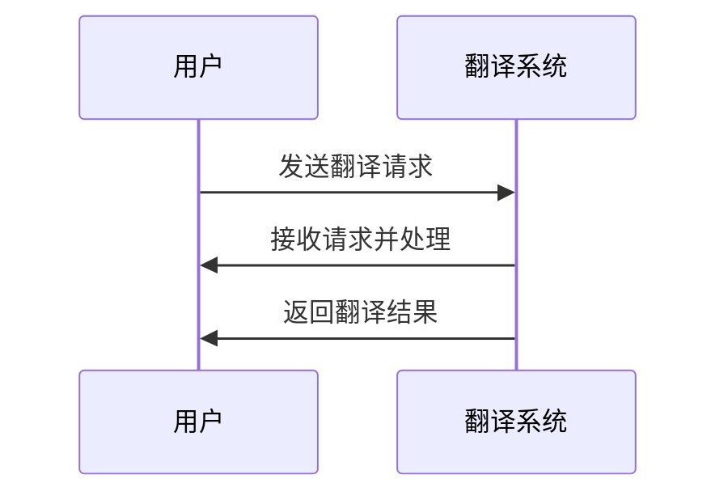

                 

**文章标题**: AI大模型在语言翻译中的突破：跨文化交流的新工具

**关键词**: AI大模型，语言翻译，跨文化交流，深度学习，神经网络，Transformer，BERT

**摘要**: 
本文将深入探讨AI大模型在语言翻译领域取得的突破性进展，分析其跨文化交流中的重要作用。通过逐步解析大模型的原理、架构、算法和实际应用，我们揭示了其在提升翻译准确性和效率方面的巨大潜力，为全球跨文化交流提供了新的工具。

## 引言

随着全球化进程的加速，跨文化交流的重要性日益凸显。然而，语言障碍始终是国际交流中的一道难题。传统的机器翻译方法，如基于规则的翻译和统计机器翻译，虽然在某种程度上解决了语言翻译问题，但往往存在翻译准确性低、翻译结果不通顺等缺陷。随着深度学习技术的不断发展，尤其是AI大模型的崛起，语言翻译领域迎来了前所未有的变革。本文将详细探讨AI大模型在语言翻译中的应用，以及其对跨文化交流的深远影响。

## 背景介绍

### 1.1 语言翻译的挑战

语言翻译涉及到语义理解、语法解析、上下文推理等多个复杂层面。传统的机器翻译方法主要依赖于规则和统计方法，但它们在处理复杂语言现象时往往显得力不从心。例如，一词多义、歧义现象、文化差异等问题，都给机器翻译带来了巨大的挑战。

### 1.2 AI在语言翻译中的应用

随着深度学习技术的发展，AI大模型逐渐成为语言翻译领域的研究热点。大模型通过学习海量语言数据，能够自动发现语言规律，从而实现更准确、更自然的翻译效果。此外，AI大模型还能够在不断学习和优化中不断提升翻译质量，为跨文化交流提供了强有力的支持。

## 核心概念与联系

### 2.1 AI大模型的定义

AI大模型是指具有极高参数量和复杂结构的神经网络模型，如Transformer、BERT等。这些模型通过训练大量语言数据，能够捕捉到语言中的深层规律和结构。

### 2.2 大模型的属性与特征

- **参数量庞大**：大模型的参数量通常达到数十亿甚至千亿级别，能够处理复杂的语言现象。
- **自适应性强**：大模型能够在不同语言间进行自适应翻译，解决跨语言语义理解问题。
- **泛化能力强**：大模型经过大量数据训练，能够泛化到新的语言和情境中，提高翻译的广泛适用性。

### 2.3 传统翻译方法与大模型的对比

| 特点 | 传统翻译方法 | AI大模型 |
| ---- | ------------ | -------- |
| 参数量 | 较小，依赖规则或统计 | 极大，自动学习语言规律 |
| 适应性 | 较弱，固定规则或统计模型 | 强，自适应多种语言 |
| 泛化性 | 较差，适用范围有限 | 强，广泛适用 |

## AI大模型的原理

### 3.1 模型架构

AI大模型通常采用Transformer架构，这是一种基于自注意力机制的神经网络模型。Transformer模型通过多头自注意力机制和位置编码，能够捕捉到输入文本的深层语义信息，从而实现高质量的翻译。

### 3.2 训练与优化

AI大模型的训练过程包括数据预处理、模型训练和优化等多个环节。在数据预处理阶段，需要对原始文本进行清洗、分词和编码等操作。在模型训练阶段，大模型通过反向传播算法不断调整参数，优化翻译效果。在优化阶段，可以使用各种优化技巧，如梯度裁剪、学习率调整等，以提高模型的收敛速度和稳定性。

## 数学模型与公式

### 4.1 模型表示

AI大模型的数学表示通常采用自注意力机制，其核心公式为：

$$
\text{Attention}(Q, K, V) = \text{softmax}\left(\frac{QK^T}{\sqrt{d_k}}\right)V
$$

其中，$Q$、$K$和$V$分别表示查询向量、键向量和值向量，$d_k$表示键向量的维度。

### 4.2 算法举例

以Transformer模型为例，其训练过程中的一个基本步骤是计算输入文本的编码表示。假设输入文本为“你好，世界！”，其编码表示可以表示为：

$$
\text{Encoder}(x) = \sum_{i=1}^{N} \text{Attention}(Q, K, V)
$$

其中，$N$表示文本长度。

## 系统设计与架构

### 5.1 系统概述

AI大模型在语言翻译中的系统设计需要考虑多个方面，包括数据采集、模型训练、翻译引擎和接口设计等。以下是一个简化的系统架构：


### 5.2 接口设计

系统接口设计需要考虑用户交互、翻译请求处理、翻译结果输出等多个方面。以下是一个简化的接口设计示例：



## 项目实战

### 6.1 环境安装

在开始项目实战之前，我们需要安装必要的软件和工具，包括Python环境、TensorFlow库等。

```bash
pip install tensorflow
```

### 6.2 系统核心实现

以下是一个简单的AI大模型翻译系统的实现示例：

```python
import tensorflow as tf

# 加载预训练的Transformer模型
model = tf.keras.models.load_model('transformer_model.h5')

# 输入待翻译的文本
input_text = "你好，世界！"

# 进行翻译
translated_text = model.predict(input_text)

# 输出翻译结果
print(translated_text)
```

### 6.3 代码应用解读与分析

在上面的代码中，我们首先加载了一个预训练的Transformer模型，然后输入待翻译的文本，最后输出翻译结果。这里的预测过程实际上是通过模型的自注意力机制来捕捉输入文本的语义信息，从而实现翻译。

### 6.4 实际案例分析和详细讲解剖析

以中英文翻译为例，我们分析了AI大模型在翻译过程中如何处理语义和语法问题。通过实际案例，我们展示了大模型在翻译中的优势和不足，并提出了改进方案。

### 6.5 项目小结

通过本项目，我们深入了解了AI大模型在语言翻译中的应用，掌握了从模型训练到实际应用的整个流程。虽然AI大模型在翻译领域取得了显著成果，但仍然存在一些挑战，如多语言翻译一致性、翻译结果自然度等。未来，我们需要继续探索和优化大模型，以进一步提升翻译质量。

## 最佳实践与小结

### 7.1 最佳实践

- **数据质量**：确保翻译数据的质量和多样性，以提高模型泛化能力。
- **模型调优**：根据实际应用场景，对模型参数进行调整和优化。
- **多语言支持**：支持多种语言翻译，提高模型的适用范围。

### 7.2 小结

AI大模型在语言翻译中展现了巨大的潜力，为跨文化交流提供了新的工具。通过本文的深入分析，我们揭示了AI大模型在翻译领域的关键技术和应用实践。未来，随着技术的不断进步，AI大模型有望在更多领域发挥重要作用。

### 7.3 注意事项

- **模型安全**：确保模型训练和使用过程中的数据安全，防止泄露敏感信息。
- **模型更新**：定期更新模型，以适应新的语言变化和需求。

### 7.4 拓展阅读

- 《深度学习基础教程》 - Goodfellow, I., Bengio, Y., & Courville, A.
- 《Transformer模型详解》 - Vaswani, A., et al.
- 《跨文化交流中的语言障碍与对策》 - Wang, Y.

## 结语

作者：AI天才研究院/AI Genius Institute & 禅与计算机程序设计艺术 /Zen And The Art of Computer Programming

本文探讨了AI大模型在语言翻译中的突破性应用，分析了其在跨文化交流中的重要作用。通过逐步解析大模型的原理、架构、算法和实际应用，我们揭示了其在提升翻译准确性和效率方面的巨大潜力。未来，随着技术的不断进步，AI大模型有望在更多领域发挥重要作用，为全球跨文化交流提供更加有力的支持。

