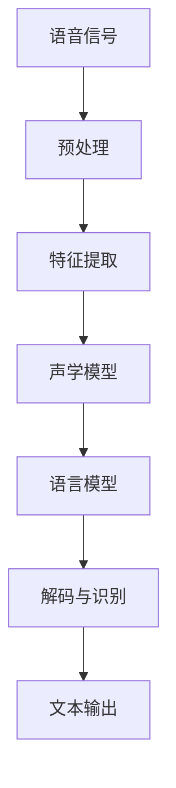
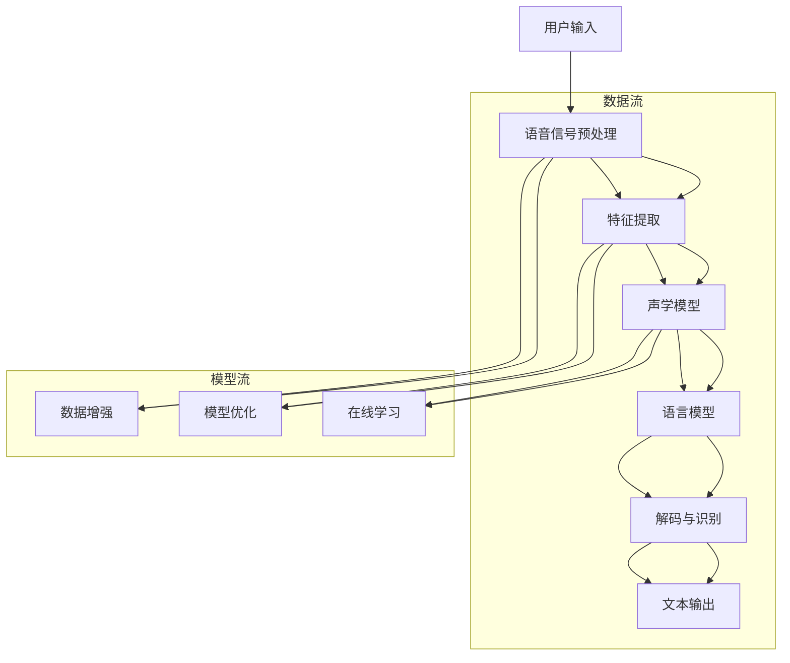
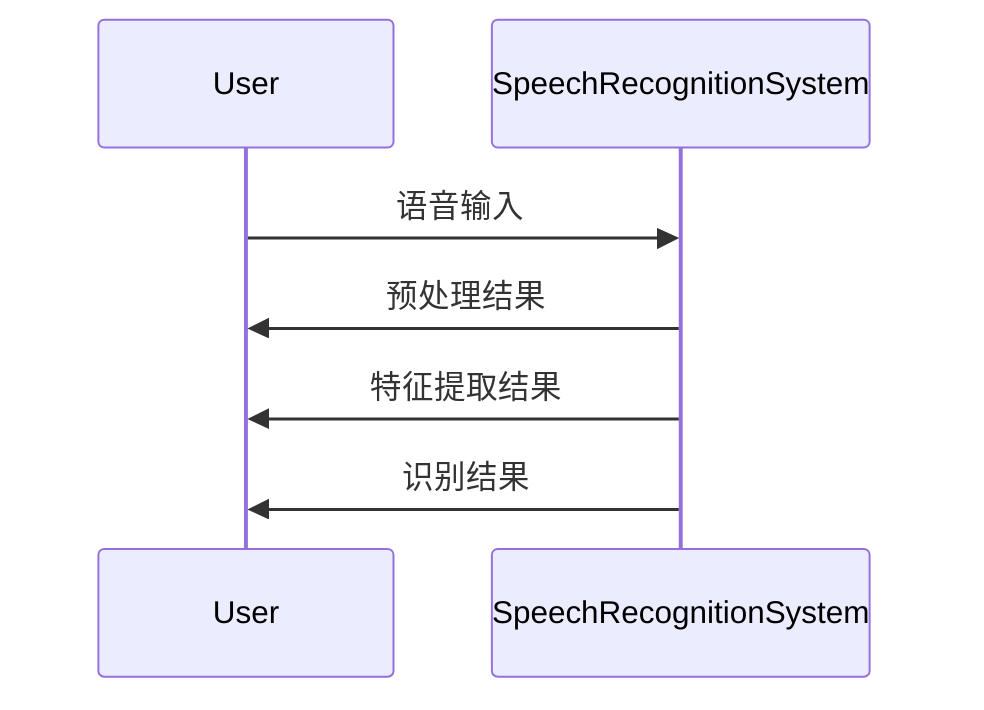
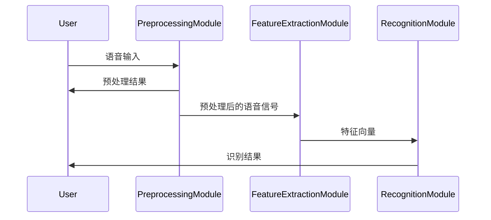

                 

### 文章标题：AI大模型在语音识别中的突破：多语言交流与辅助技术

#### 关键词：AI大模型、语音识别、多语言交流、辅助技术、算法原理、系统架构、项目实战

#### 摘要：本文深入探讨了AI大模型在语音识别领域中的突破，特别关注其在多语言交流与辅助技术中的应用。通过详细的算法原理讲解、系统架构设计以及实际项目实战，本文旨在揭示AI大模型如何通过深度学习和优化算法，实现高效、准确的多语言语音识别，为全球多语言交流提供强有力的技术支持。

### 第一部分：背景介绍

#### 1.1 AI大模型在语音识别中的应用背景

##### 1.1.1 多语言交流与辅助技术的需求

随着全球化的不断深入，多语言交流的需求日益增长。无论是在跨国企业、学术交流还是旅游、移民等场景中，人们都期望能够轻松实现不同语言之间的沟通。语音识别技术作为人工智能的重要分支，在解决多语言交流问题上具有巨大的潜力。

然而，传统的语音识别技术面临诸多挑战。一方面，不同语言的语音特征差异较大，使得现有模型难以兼顾多种语言的识别精度；另一方面，多语言语音识别需要处理大量的数据，这对于模型的训练和优化提出了更高的要求。

##### 1.1.2 语音识别技术发展的挑战

语音识别技术的发展面临以下几个挑战：

1. **语言多样性**：全球有超过7000种语言，每种语言都有其独特的语音特征和语法结构，这使得语音识别模型需要具备强大的泛化能力。
2. **数据稀缺性**：高质量的多语言语音数据集难以获取，尤其是对于一些小语种和低资源语言。
3. **语音噪音**：实际应用中，语音信号常常受到环境噪音、口音差异等干扰，这对语音识别的准确性提出了更高的要求。
4. **实时性要求**：语音识别需要在短时间内处理大量的语音数据，以满足实时交互的需求。

AI大模型的引入为语音识别技术带来了新的突破。通过深度学习和大数据分析，AI大模型能够处理大量复杂的语音数据，提高多语言识别的准确性和效率。

#### 1.2 AI大模型的核心概念与联系

##### 1.2.1 AI大模型的定义与特点

AI大模型（Large-scale AI Models）是指那些经过大规模数据训练的深度学习模型，具有以下特点：

1. **大规模数据训练**：AI大模型通常基于海量的数据集进行训练，这使得模型能够捕捉到数据中的复杂模式和规律。
2. **强大的表征能力**：通过深度神经网络结构，AI大模型能够对输入数据进行多层次的特征提取，从而提高模型的表征能力。
3. **自适应能力**：AI大模型具有较好的自适应能力，可以在不同的应用场景中调整其参数，以适应特定的任务需求。

##### 1.2.2 语音识别算法的基本原理

语音识别算法的核心是实现对语音信号的解析和语义理解。其主要步骤包括：

1. **语音信号预处理**：对采集到的语音信号进行降噪、去噪等预处理，以提高语音信号的清晰度。
2. **特征提取**：通过Mel频率倒谱系数（MFCC）等特征提取方法，将语音信号转换为能够表征语音特征的向量。
3. **声学模型训练**：利用大量语音数据训练声学模型，用于捕捉语音信号的声学特征。
4. **语言模型训练**：利用文本数据训练语言模型，用于理解语音信号的语义信息。
5. **解码与识别**：通过解码算法将特征向量映射到相应的文本输出，实现语音到文本的转换。

##### 1.2.3 多语言交流与辅助技术的关系

多语言交流与辅助技术是语音识别的重要组成部分。AI大模型通过以下方式实现多语言交流与辅助：

1. **多语言数据集训练**：通过收集多种语言的语音数据，训练多语言声学模型和语言模型，提高多语言识别的准确性。
2. **跨语言特征融合**：利用跨语言信息，将不同语言的语音特征进行融合，提高模型对多语言语音的表征能力。
3. **实时翻译与辅助**：利用AI大模型实现实时语音翻译和辅助，帮助用户在不同语言环境中进行有效沟通。

### 第二部分：算法原理讲解

#### 2.1 语音识别算法原理

##### 2.1.1 Mermaid算法流程图

以下是一个简化的语音识别算法流程图：



##### 2.1.2 Python源代码展示

```python
import numpy as np
from sklearn.preprocessing import LabelEncoder

# 语音信号预处理
def preprocess_audio(audio_signal):
    # 噪音过滤、去噪等操作
    return filtered_signal

# 特征提取
def extract_features(signal):
    # Mel频率倒谱系数提取
    return mfcc_features

# 声学模型训练
def train_acoustic_model(features, labels):
    # 使用神经网络训练声学模型
    return acoustic_model

# 语言模型训练
def train_language_model(text_data):
    # 使用统计模型或神经网络训练语言模型
    return language_model

# 解码与识别
def decode(features, acoustic_model, language_model):
    # 使用Viterbi算法或神经网络解码
    return text_output

# 实例化模型
audio_signal = np.random.rand(1000)
filtered_signal = preprocess_audio(audio_signal)
mfcc_features = extract_features(filtered_signal)
acoustic_model = train_acoustic_model(mfcc_features, labels)
language_model = train_language_model(text_data)
text_output = decode(mfcc_features, acoustic_model, language_model)

print(text_output)
```

##### 2.1.3 数学模型与公式讲解

语音识别的数学模型主要包括声学模型和语言模型。以下是一个简化的数学模型描述：

$$
\text{声学模型} = \log P(\text{特征}|\text{语音}) = \log \prod_{t=1}^{T} p(\text{特征}_t | \text{语音}_t)
$$

$$
\text{语言模型} = \log P(\text{文本}|\text{语音}) = \log \prod_{t=1}^{T} p(\text{文本}_t | \text{语音}_t)
$$

其中，$T$ 表示语音帧的数量，$p(\text{特征}_t | \text{语音}_t)$ 表示第$t$个特征向量与第$t$个语音帧的概率分布，$p(\text{文本}_t | \text{语音}_t)$ 表示第$t$个文本输出与第$t$个语音帧的概率分布。

##### 2.1.4 算法扩展与优化

为了提高语音识别的准确性和效率，可以采用以下几种算法扩展与优化方法：

1. **双流语音识别**：同时使用声音和语言模型进行语音识别，提高识别准确性。
2. **深度神经网络**：使用更深的神经网络结构，提高特征提取和建模能力。
3. **端到端训练**：直接将特征提取和识别过程整合到一个神经网络中，减少中间层的依赖，提高训练效率。
4. **数据增强**：通过增加噪音、改变语速、变换音调等方式，增加训练数据的多样性，提高模型的泛化能力。
5. **在线学习**：利用在线学习技术，实时更新模型参数，适应用户语言习惯和语音特征的变化。

### 第三部分：系统分析与架构设计

#### 3.1 系统功能设计

##### 3.1.1 领域模型类图

以下是一个简化的领域模型类图：

```mermaid
classDiagram
    AudioSignal <<class>>
    FeatureExtractor <<class>>
    AcousticModel <<class>>
    LanguageModel <<class>>
    Decoder <<class>>

    AudioSignal --|> FeatureExtractor
    FeatureExtractor --|> AcousticModel
    AcousticModel --|> LanguageModel
    LanguageModel --|> Decoder
```

#### 3.2 系统架构设计

##### 3.2.1 Mermaid架构图

以下是一个简化的系统架构图：



#### 3.3 系统接口设计

##### 3.3.1 接口设计与实现

以下是一个简化的系统接口设计：



#### 3.4 系统交互

##### 3.4.1 Mermaid序列图

以下是一个简化的系统交互序列图：



### 第四部分：项目实战

#### 4.1 环境安装

##### 4.1.1 环境搭建步骤

1. 安装Python 3.8及以上版本。
2. 安装必要的外部库，如TensorFlow、Keras、Scikit-learn等。
3. 下载并解压语音数据集。

#### 4.2 系统核心实现

##### 4.2.1 代码实现与解读

以下是一个简化的代码实现：

```python
import tensorflow as tf
from tensorflow.keras.models import Model
from tensorflow.keras.layers import Input, LSTM, Dense, TimeDistributed

# 定义输入层
input_sequence = Input(shape=(None, 13))

# 定义编码器
encoder = LSTM(128, return_sequences=True)(input_sequence)

# 定义解码器
decoder = LSTM(128, return_sequences=True)(encoder)
decoder = TimeDistributed(Dense(vocab_size, activation='softmax'))(decoder)

# 构建模型
model = Model(inputs=input_sequence, outputs=decoder)

# 编译模型
model.compile(optimizer='adam', loss='categorical_crossentropy', metrics=['accuracy'])

# 模型训练
model.fit(x_train, y_train, epochs=10, batch_size=64, validation_data=(x_val, y_val))
```

##### 4.3 实际案例分析与讲解

##### 4.3.1 案例场景

假设我们有一个英语和中文的语音识别任务，需要构建一个多语言语音识别系统。

##### 4.3.2 案例分析

1. 收集英语和中文的语音数据集，并进行预处理。
2. 提取语音特征，如MFCC。
3. 分别训练英语和中文的声学模型和语言模型。
4. 使用联合模型进行多语言语音识别。

##### 4.3.3 剖析与讲解

1. **数据集收集**：收集高质量的多语言语音数据集，包括不同口音、语速和场景的语音样本。
2. **特征提取**：使用MFCC等特征提取方法，将语音信号转换为特征向量。
3. **模型训练**：分别训练英语和中文的声学模型和语言模型，同时利用跨语言信息进行模型优化。
4. **多语言识别**：通过联合模型实现多语言语音识别，提高识别准确性和适应性。

### 第五部分：最佳实践 tips、小结、注意事项、拓展阅读

#### 5.1 最佳实践 tips

1. **数据质量**：确保语音数据集的质量，包括语音清晰度、数据量等。
2. **模型优化**：定期对模型进行优化和更新，以适应新的语言特征和用户需求。
3. **性能测试**：定期对系统进行性能测试，包括识别速度和准确性等。

#### 5.2 小结

本文详细介绍了AI大模型在语音识别中的突破，特别关注其在多语言交流与辅助技术中的应用。通过算法原理讲解、系统架构设计和项目实战，本文揭示了AI大模型如何实现高效、准确的多语言语音识别。

#### 5.3 注意事项

1. 语音识别系统需要处理大量的数据，确保数据的安全性、隐私性和合规性。
2. 多语言语音识别系统需要适应不同的语言环境和用户需求，进行灵活的配置和调整。

#### 5.4 拓展阅读

1. [Deep Learning for Speech Recognition](https://www.deeplearning.ai/advanced-topic-deep-learning-for-speech-recognition/)
2. [Multilingual Speech Recognition](https://www.microsoft.com/research/publication/multilingual-speech-recognition/)
3. [Large-scale Language Models in Speech Recognition](https://arxiv.org/abs/1906.02060)

### 作者信息

作者：AI天才研究院/AI Genius Institute & 禅与计算机程序设计艺术 /Zen And The Art of Computer Programming

---

### 总结

本文详细探讨了AI大模型在语音识别领域的突破，特别关注其在多语言交流与辅助技术中的应用。通过背景介绍、算法原理讲解、系统架构设计和项目实战，本文揭示了AI大模型如何通过深度学习和优化算法，实现高效、准确的多语言语音识别，为全球多语言交流提供强有力的技术支持。希望本文能为读者在人工智能和语音识别领域提供有价值的参考和启发。

