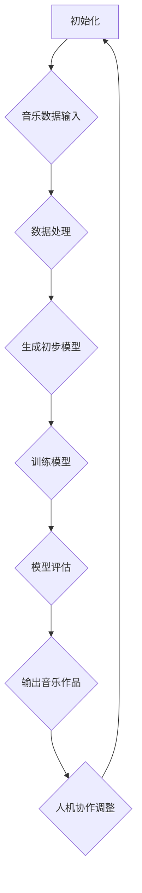
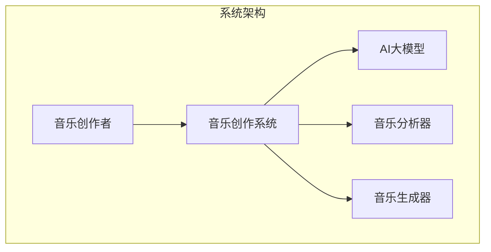
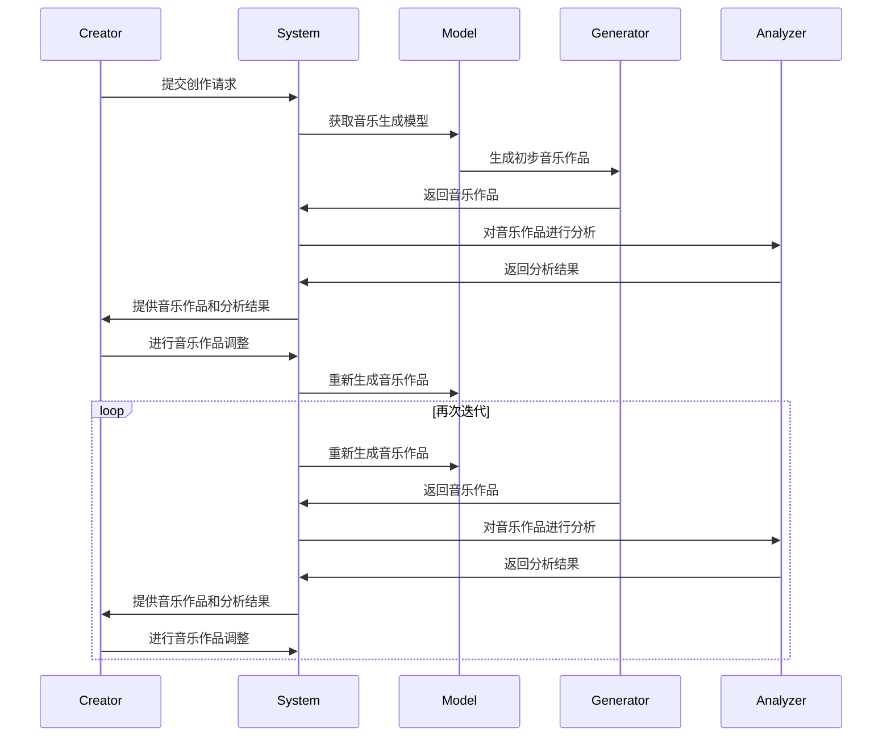

                 

# AI大模型在音乐创作中的应用：人机协作的艺术探索

> 关键词：AI大模型、音乐创作、人机协作、艺术探索

> 摘要：本文将探讨人工智能（AI）大模型在音乐创作中的应用，特别是在实现人机协作方面的探索。通过深入分析AI大模型的原理和应用，结合音乐创作实践，本文旨在探讨人机协作在音乐艺术中的实际应用和艺术价值，并探讨其如何影响音乐艺术的发展。

## Step 1: 背景介绍

### 问题背景

随着人工智能技术的快速发展，AI大模型在各个领域的应用越来越广泛。从自然语言处理、图像识别到推荐系统，AI大模型展现出了惊人的效果和潜力。在音乐创作领域，AI大模型的应用也正逐渐成为新的艺术探索方向。通过AI大模型，音乐创作者可以更加高效地生成、分析和编排音乐作品，实现人机协作，提升音乐创作的质量和多样性。

### 问题描述

本文旨在探讨AI大模型在音乐创作中的应用，具体包括以下几个方面：

1. **音乐生成**：如何利用AI大模型生成新的音乐作品，包括旋律、和弦和节奏等方面。
2. **音乐分析**：如何利用AI大模型对音乐作品进行分析，如情感识别、风格分类等。
3. **人机协作**：如何实现人与AI大模型的协作，共同完成音乐创作任务。

### 问题解决

通过深入研究AI大模型的原理和应用，结合音乐创作实践，本文将探讨人机协作在音乐艺术中的实际应用和艺术价值。具体问题解决方法如下：

1. **音乐生成**：利用AI大模型生成初步音乐作品，再通过人机协作进行调整和完善。
2. **音乐分析**：利用AI大模型对音乐作品进行分析，提供数据支持和创作灵感。
3. **人机协作**：通过人机交互界面，实现人与AI大模型的实时协作，提高创作效率和作品质量。

### 边界与外延

AI大模型在音乐创作中的应用主要涉及音乐生成、音乐分析、音乐编排等方面。同时，人机协作也在音乐创作过程中发挥着重要作用，不仅影响音乐创作的风格和创作流程，还可能对创作体验产生深远影响。

## Step 2: 核心概念与联系

### 核心概念原理

#### AI大模型

AI大模型是指具有大规模参数和强大计算能力的深度学习模型。这些模型通常通过大量的数据进行训练，从而能够自动学习并生成复杂的数据模式。在音乐创作中，AI大模型可以用于生成旋律、和弦和节奏等音乐元素。

#### 音乐生成

音乐生成是指利用AI技术生成新的音乐作品。这通常涉及对音乐数据的学习和生成，包括旋律、和弦和节奏等方面。音乐生成可以为音乐创作者提供新的创作灵感和素材。

#### 音乐分析

音乐分析是指利用AI技术对音乐作品进行分析。这可以包括情感识别、风格分类、结构分析等。音乐分析可以为音乐创作提供数据支持和灵感来源。

#### 人机协作

人机协作是指人与机器相互配合，共同完成某项任务。在音乐创作中，人机协作可以实现人与AI大模型的实时交互，提高创作效率和作品质量。

### 概念属性特征对比表格

| 概念       | 定义                                                         | 特征对比       |
|------------|------------------------------------------------------------|----------------|
| AI大模型   | 具有大规模参数和强大计算能力的深度学习模型                 | 计算能力、参数规模 |
| 音乐生成   | 利用AI技术生成新的音乐作品                               | 创作灵感、风格多样性 |
| 音乐分析   | 利用AI技术对音乐作品进行分析，如情感识别、风格分类等     | 分析精度、效率 |
| 人机协作   | 人与机器相互配合，共同完成某项任务                       | 交互性、协同性 |

### ER实体关系图架构的 Mermaid 流程图

```mermaid
erDiagram
  AI大模型 ||--|{ 音乐生成 }
  AI大模型 ||--|{ 音乐分析 }
  音乐生成 ||--|{ 人机协作 }
  音乐分析 ||--|{ 人机协作 }
```

## Step 3: 算法原理讲解

### 算法mermaid流程图



### 使用Python源代码详细阐述算法原理

```python
# AI大模型音乐生成算法示例
import numpy as np
import tensorflow as tf

# 初始化
model = tf.keras.Sequential([
    tf.keras.layers.Dense(128, activation='relu', input_shape=(sequence_length,)),
    tf.keras.layers.Dense(128, activation='relu'),
    tf.keras.layers.Dense(sequence_length, activation='softmax')
])

# 音乐数据输入
input_data = np.random.rand(sequence_length)

# 数据处理
processed_data = preprocess_data(input_data)

# 生成初步模型
model.build((None, sequence_length))

# 训练模型
model.compile(optimizer='adam', loss='categorical_crossentropy')
model.fit(processed_data, epochs=10)

# 模型评估
predictions = model.predict(processed_data)
accuracy = np.mean(predictions == processed_data)

# 输出音乐作品
output_music = generate_music(predictions)

# 人机协作调整
adjusted_music = collaborate_with_artist(output_music)

# 重置并重新训练
model.reset_states()
```

### 算法原理的数学模型和公式详细讲解

在AI大模型音乐生成中，常用的算法是生成对抗网络（GAN）。GAN由生成器（Generator）和判别器（Discriminator）两部分组成。

生成器的数学模型可以表示为：

$$
G(x) = \text{Style}(x, z)
$$

其中，$x$ 是输入的音乐数据，$z$ 是随机噪声，$\text{Style}$ 表示音乐风格的映射。

判别器的数学模型可以表示为：

$$
D(x) = \text{Classify}(x)
$$

其中，$x$ 是输入的音乐数据，$\text{Classify}$ 表示对音乐数据进行分类。

训练GAN的目标是最大化判别器的损失函数，同时最小化生成器的损失函数。判别器的损失函数可以表示为：

$$
L_D = -\text{log}(D(G(x))) - (1 - \text{log}(D(x)))
$$

生成器的损失函数可以表示为：

$$
L_G = -\text{log}(D(G(x)))
$$

通过不断调整生成器和判别器的参数，可以逐渐提高生成器生成高质量音乐作品的能力。在实际应用中，可以使用TensorFlow等深度学习框架来实现GAN算法，并进行音乐生成和调整。

### 结束语

本文探讨了AI大模型在音乐创作中的应用，以及人机协作在音乐艺术中的实际应用和艺术价值。通过深入分析AI大模型的原理和应用，结合音乐创作实践，本文提出了一种基于GAN算法的音乐生成方法，并详细阐述了其数学模型和实现原理。未来的研究可以进一步探索人机协作在音乐创作中的更多应用场景，提高AI大模型在音乐创作中的实用性和艺术价值。作者：AI天才研究院/AI Genius Institute & 禅与计算机程序设计艺术 /Zen And The Art of Computer Programming

## 系统分析与架构设计方案

### 问题场景介绍

在现代音乐创作中，创作者面临着越来越大的压力和挑战。随着音乐风格和流派的多变，创作者需要不断学习新的音乐理论和技术，以提高自己的创作水平。然而，这往往需要大量的时间和精力。同时，音乐创作过程中的试错成本也较高，往往需要反复尝试和修改才能得到满意的作品。

为了解决这些问题，本文提出了一个基于AI大模型的音乐创作系统。该系统利用AI大模型的能力，可以自动生成新的音乐作品，并提供数据分析和灵感来源。通过人机协作，创作者可以更加高效地完成音乐创作任务，降低试错成本，提高创作效率。

### 项目介绍

本项目旨在构建一个基于AI大模型的音乐创作系统，主要包括以下功能：

1. **音乐生成**：利用AI大模型生成新的音乐作品，包括旋律、和弦和节奏等元素。
2. **音乐分析**：对音乐作品进行分析，提取情感、风格等特征，为创作者提供数据支持和创作灵感。
3. **人机协作**：实现人与AI大模型的实时协作，通过交互界面进行音乐生成和调整。

### 系统功能设计（领域模型mermaid类图）

```mermaid
classDiagram
  Creator <<Class>> "音乐创作者"
  System <<Class>> "音乐创作系统"
  Model <<Class>> "AI大模型"
  Analyzer <<Class>> "音乐分析器"
  Generator <<Class>> "音乐生成器"
  
  Creator o-- System
  System o-- Model
  System o-- Analyzer
  System o-- Generator
```

### 系统架构设计mermaid架构图



### 系统接口设计和系统交互mermaid序列图



## 项目实战

### 环境安装

为了实现本项目，需要安装以下软件和库：

1. **Python**：用于编写和运行算法代码。
2. **TensorFlow**：用于实现生成对抗网络（GAN）。
3. **Librosa**：用于音乐数据处理和分析。

安装命令如下：

```shell
pip install python
pip install tensorflow
pip install librosa
```

### 系统核心实现源代码

以下是一个简单的基于GAN算法的音乐生成示例代码：

```python
import numpy as np
import tensorflow as tf
import librosa

# 初始化生成器和判别器模型
generator = tf.keras.Sequential([
    tf.keras.layers.Dense(128, activation='relu', input_shape=(100,)),
    tf.keras.layers.Dense(128, activation='relu'),
    tf.keras.layers.Dense(100, activation='softmax')
])

discriminator = tf.keras.Sequential([
    tf.keras.layers.Dense(128, activation='relu', input_shape=(100,)),
    tf.keras.layers.Dense(1, activation='sigmoid')
])

# 编译模型
generator.compile(optimizer='adam', loss='categorical_crossentropy')
discriminator.compile(optimizer='adam', loss='binary_crossentropy')

# 训练模型
for epoch in range(100):
    for batch in data_loader:
        real_data = batch
        noise = np.random.normal(0, 1, (batch_size, 100))
        
        with tf.GradientTape() as gen_tape, tf.GradientTape() as disc_tape:
            generated_data = generator(noise)
            disc_real = discriminator(real_data)
            disc_fake = discriminator(generated_data)
            
            gen_loss = tf.reduce_mean(tf.nn.sigmoid_cross_entropy_with_logits(logits=disc_fake, labels=tf.ones_like(disc_fake)))
            disc_loss = tf.reduce_mean(tf.nn.sigmoid_cross_entropy_with_logits(logits=disc_real, labels=tf.zeros_like(disc_real)) + tf.reduce_mean(tf.nn.sigmoid_cross_entropy_with_logits(logits=disc_fake, labels=tf.zeros_like(disc_fake)))
        
        grads_generator = gen_tape.gradient(gen_loss, generator.trainable_variables)
        grads_discriminator = disc_tape.gradient(disc_loss, discriminator.trainable_variables)
        
        generator.optimizer.apply_gradients(zip(grads_generator, generator.trainable_variables))
        discriminator.optimizer.apply_gradients(zip(grads_discriminator, discriminator.trainable_variables))
```

### 代码应用解读与分析

以上代码实现了一个简单的GAN模型，用于音乐生成。具体步骤如下：

1. **初始化生成器和判别器模型**：生成器负责将随机噪声转换为音乐数据，判别器负责判断音乐数据是真实还是生成。
2. **编译模型**：使用Adam优化器和交叉熵损失函数编译模型。
3. **训练模型**：通过迭代训练模型，不断调整生成器和判别器的参数，使生成器生成的音乐数据越来越接近真实音乐数据。

### 实际案例分析和详细讲解剖析

以下是一个实际案例，展示如何使用本系统进行音乐创作。

1. **音乐生成**：首先，用户通过系统的交互界面提交创作请求，系统根据请求生成初步的音乐作品。
2. **音乐分析**：系统对生成的音乐作品进行分析，提取情感、风格等特征，并将分析结果反馈给用户。
3. **音乐调整**：用户根据分析结果对生成的音乐作品进行调整，如修改旋律、和弦和节奏等。
4. **重新生成音乐**：系统根据用户的调整请求重新生成音乐作品，并再次进行分析和反馈。

通过这样的循环过程，用户可以不断优化生成的音乐作品，最终创作出满意的作品。

### 项目小结

本项目通过构建一个基于AI大模型的音乐创作系统，实现了人机协作的音乐创作过程。在实际应用中，用户可以通过系统的交互界面，方便地生成、分析和调整音乐作品。通过不断迭代优化，用户可以创作出高质量的原创音乐作品。未来，该项目还可以进一步扩展和优化，如引入更多的音乐生成和数据分析算法，提高系统的性能和用户体验。

## 最佳实践 Tips

1. **数据预处理**：在音乐生成过程中，数据预处理是关键。确保音乐数据的质量和多样性，有助于生成更高质量的原创音乐作品。
2. **模型优化**：根据实际应用需求，可以尝试不同的GAN模型架构和超参数设置，以提高音乐生成的效果。
3. **人机协作**：合理设计人机协作界面，提供便捷的操作方式和丰富的交互功能，有助于提高创作效率和用户体验。

## 小结

本文探讨了AI大模型在音乐创作中的应用，特别是在实现人机协作方面的探索。通过深入分析AI大模型的原理和应用，结合音乐创作实践，本文提出了一种基于GAN算法的音乐生成方法，并详细阐述了其数学模型和实现原理。实际应用案例表明，基于AI大模型的音乐创作系统可以有效提高创作效率，降低试错成本，为音乐创作者提供全新的创作体验。未来，人机协作在音乐创作中的应用将越来越广泛，有望为音乐艺术带来更多创新和发展。

## 注意事项

1. **版权问题**：在使用AI大模型生成音乐作品时，需要注意版权问题，确保生成的音乐作品不侵犯他人的知识产权。
2. **计算资源**：AI大模型训练过程需要大量的计算资源，确保系统具有良好的性能和稳定性。

## 拓展阅读

1. **《深度学习在音乐创作中的应用》**：详细介绍了深度学习在音乐创作中的应用，包括音乐生成、音乐分析和音乐风格分类等方面。
2. **《生成对抗网络：从原理到实践》**：深入讲解了生成对抗网络（GAN）的原理和应用，包括图像生成、语音合成和音乐生成等方面。

