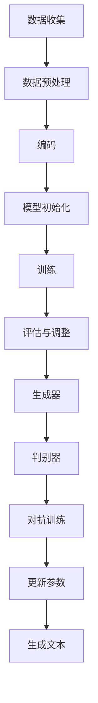
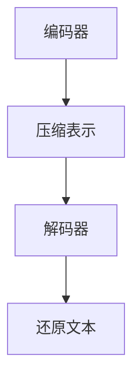

                 

### 第一部分：问题背景与概述

#### 1.1 问题背景

在当今数字时代，出版业正面临着前所未有的变革。传统出版业以书籍、期刊、报纸等实体形式为主，而随着互联网的普及和人工智能技术的发展，数字化出版和在线阅读逐渐成为主流。AI大模型，作为人工智能领域的最新突破，凭借其强大的数据处理和分析能力，正在逐渐渗透到出版业的各个领域，带来前所未有的机遇与挑战。

**1.1.1 传统出版业的现状**

传统出版业在经历了几个世纪的发展后，已经形成了一套相对稳定的商业模式和运营机制。然而，随着信息时代的到来，传统出版业面临着诸多挑战。首先是市场萎缩，读者阅读习惯的改变使得纸质书籍的需求量减少。其次是内容生产成本高，传统出版业依赖于作者的创作和编辑团队的审核，流程繁琐且耗时。此外，版权保护也是一个长期存在的问题，版权纠纷频发，损害了创作者和出版商的利益。

**1.1.2 AI大模型的出现与影响**

AI大模型，尤其是基于深度学习的自然语言处理（NLP）模型，具有强大的文本生成、理解和分析能力。它们能够自动生成文章、摘要、评论等文本内容，提高内容生产效率。此外，AI大模型还能进行个性化推荐、情感分析、智能搜索等功能，为出版业带来新的商业模式和盈利点。然而，AI大模型的出现也引发了版权保护的新挑战。

**1.1.3 问题的提出与解决思路**

AI大模型在内容生成领域的应用无疑为出版业带来了巨大的变革，但同时也引发了一系列问题，如内容原创性、版权保护等。如何充分利用AI大模型的优势，同时有效解决版权保护问题，成为出版业亟需解决的问题。本文将从以下几个方面展开讨论：

- AI大模型的内容生成原理及其对出版业的影响
- 内容生成的应用场景和案例分析
- AI大模型对版权保护的挑战及对策
- 实践策略：内容生成与版权保护的优化方案

通过以上分析，本文旨在为出版业提供一种全新的视角，探索AI大模型在内容生成和版权保护方面的应用，并提出相应的实践策略。

#### 1.2 关键概念与定义

在深入探讨AI大模型对传统出版业的挑战之前，首先需要明确几个关键概念，包括AI大模型、内容生成和版权保护。

**1.2.1 AI大模型**

AI大模型，通常指基于深度学习技术的神经网络模型，其具有处理大量数据、进行复杂分析和预测的能力。AI大模型通常通过大量的数据训练，优化模型的参数，使其能够在新的数据上做出准确的预测或生成内容。在自然语言处理领域，AI大模型被广泛应用于文本生成、摘要、情感分析等任务。

**1.2.2 内容生成**

内容生成是指通过计算机程序或算法自动生成文本、图像、音频等媒体内容的过程。在AI大模型的应用背景下，内容生成主要指的是通过AI模型生成高质量、有意义的文本内容。内容生成技术可以应用于多个领域，包括新闻报道、文学创作、广告文案、教育材料等。

**1.2.3 版权保护**

版权保护是指法律和制度对创作者的原创作品进行保护，防止未经授权的复制、传播和使用。版权保护不仅关乎创作者的经济利益，也涉及到文化的传承和创新。在数字化时代，版权保护面临新的挑战，如数字盗版、侵权行为等。

#### 1.3 边界与外延

为了更全面地理解AI大模型对内容生成和版权保护的影响，需要明确其应用范围和面临的挑战。

**1.3.1 AI大模型的应用范围**

AI大模型的应用范围广泛，涵盖了文本生成、图像生成、音频生成等多个领域。在文本生成方面，AI大模型可以自动生成新闻文章、技术文档、书籍章节等。在图像生成方面，AI大模型可以创作艺术作品、设计广告海报等。在音频生成方面，AI大模型可以生成音乐、语音合成等。随着技术的不断发展，AI大模型的应用范围将更加广泛。

**1.3.2 内容生成的类型与形式**

内容生成的类型和形式多样，包括原创内容生成和衍生内容生成。原创内容生成是指从零开始生成全新的内容，如新闻报道、小说创作等。衍生内容生成是指基于已有内容进行再创造，如文章摘要、评论生成等。不同类型的内容生成对AI大模型的能力要求不同，需要针对具体应用场景进行优化。

**1.3.3 版权保护的挑战与策略**

AI大模型对版权保护提出了新的挑战。首先，AI大模型生成的内容可能侵犯他人的版权。其次，传统的版权保护手段如数字水印、加密技术等在AI大模型面前可能失效。因此，需要探索新的版权保护策略，如区块链技术、智能合约等，以应对AI大模型带来的挑战。

#### 1.4 概念结构与核心要素组成

为了深入分析AI大模型对内容生成和版权保护的影响，需要了解其概念结构和核心要素组成。

**1.4.1 AI大模型的组成要素**

AI大模型主要由以下几个部分组成：

1. **数据集**：AI大模型需要大量的数据集进行训练，以获取丰富的知识和模式。
2. **神经网络架构**：神经网络架构决定了AI大模型的计算能力和处理速度。
3. **训练算法**：训练算法用于优化模型的参数，使其在新的数据上表现出更好的性能。
4. **生成算法**：生成算法用于根据输入生成高质量的内容。

**1.4.2 内容生成的流程与步骤**

内容生成的流程通常包括以下几个步骤：

1. **数据预处理**：对输入数据（如文本、图像、音频）进行预处理，包括清洗、标准化等。
2. **模型训练**：使用预处理的输入数据训练AI大模型，使其具备生成内容的能力。
3. **内容生成**：使用训练好的模型生成新的内容，如文章、图像、音乐等。
4. **后处理**：对生成的内容进行后处理，包括去除噪音、调整格式等。

**1.4.3 版权保护的机制与措施**

版权保护主要通过以下几个机制和措施实现：

1. **法律保护**：通过版权法律对原创作品进行保护，防止未经授权的复制、传播和使用。
2. **技术保护**：使用数字水印、加密技术等对内容进行保护，防止未经授权的访问和复制。
3. **监控与追踪**：建立版权监控和追踪系统，及时发现和制止侵权行为。

#### 1.5 本章小结

本章从问题背景、关键概念、边界与外延、概念结构与核心要素组成等方面，对AI大模型对传统出版业的挑战进行了初步探讨。通过分析，我们发现AI大模型在内容生成和版权保护方面具有巨大的潜力，但也面临着一系列挑战。接下来的章节将深入探讨AI大模型的内容生成原理、应用场景、版权保护问题，并提出相应的实践策略。希望本文能够为读者提供一个全面、系统的视角，以更好地理解和应对AI大模型带来的变革。

---

### 第二部分：AI大模型对内容生成的挑战

#### 2.1 AI大模型的内容生成原理

AI大模型的内容生成原理主要基于深度学习，尤其是基于变换器模型（Transformer）的自然语言处理（NLP）技术。这一部分将详细解释AI大模型的训练过程、内容生成算法原理以及大模型的优势与局限性。

##### 2.1.1 大模型的训练过程

AI大模型的训练过程可以分为以下几个步骤：

1. **数据收集**：首先，需要收集大量的文本数据，这些数据可以来自于书籍、新闻、网页、社交媒体等多种来源。
2. **数据预处理**：对收集的文本数据进行清洗和预处理，包括去除停用词、标点符号、统一文本格式等。
3. **编码**：将预处理后的文本数据转换为计算机可以处理的形式，如词嵌入（word embeddings）或字节嵌入（byte embeddings）。
4. **模型初始化**：初始化神经网络模型，包括选择合适的架构和设置初始参数。
5. **训练**：通过反向传播算法（backpropagation）和优化算法（如Adam）对模型进行训练。训练过程中，模型会不断调整参数，以最小化损失函数。
6. **评估与调整**：在训练过程中，使用验证集（validation set）对模型进行评估，并根据评估结果调整模型参数。

在训练过程中，AI大模型通过学习大量的文本数据，逐渐掌握语言的结构和语义，从而能够生成高质量的内容。

##### 2.1.2 内容生成算法原理

内容生成算法主要基于生成对抗网络（GAN）和自编码器（Autoencoder）等深度学习技术。以下是这些算法的基本原理：

1. **生成对抗网络（GAN）**：GAN由两个神经网络组成：生成器（Generator）和判别器（Discriminator）。生成器试图生成逼真的数据，而判别器则尝试区分真实数据和生成数据。通过这种对抗训练，生成器逐渐生成越来越真实的数据。

   - **生成器**：生成器接收随机噪声作为输入，通过神经网络生成模拟的文本数据。
   - **判别器**：判别器接收真实数据和生成数据，并尝试判断其真实性。

2. **自编码器（Autoencoder）**：自编码器是一个由编码器和解码器组成的神经网络结构。编码器将输入数据压缩成一个低维表示，解码器则尝试将这个低维表示还原成原始数据。

   - **编码器**：编码器接收输入文本数据，将其压缩成一个固定长度的向量表示。
   - **解码器**：解码器接收编码器生成的向量表示，并尝试将其还原成原始文本数据。

通过这些算法，AI大模型能够生成高质量、连贯的文本内容。以下是生成对抗网络（GAN）和自编码器（Autoencoder）的Mermaid流程图：

##### 2.1.3 大模型的优势与局限性

AI大模型在内容生成方面具有显著的优势：

1. **生成高质量文本**：AI大模型能够生成高质量、连贯的文本，其内容结构、语法和语义都较为自然。
2. **灵活应用**：AI大模型可以应用于多种场景，如新闻写作、文学创作、技术文档生成等，具有很高的灵活性。
3. **高效生产**：AI大模型可以快速生成大量内容，大大提高了内容生产的效率。

然而，AI大模型也存在一些局限性：

1. **原创性问题**：AI大模型生成的文本可能在原创性上存在争议，一些内容可能是直接从现有数据中提取或组合而成，而不是完全原创的。
2. **准确性问题**：AI大模型在处理复杂语义、逻辑关系和特定领域的知识时，准确性可能受到影响。
3. **版权问题**：AI大模型生成的文本可能涉及版权问题，尤其是当其内容与已有作品高度相似时。

综上所述，AI大模型在内容生成方面具有巨大的潜力，但也需要不断优化和改进，以克服其局限性。

#### 2.2 内容生成的应用场景

AI大模型在内容生成领域具有广泛的应用场景，以下是一些典型的应用场景：

##### 2.2.1 自动写作

自动写作是AI大模型最直接的应用场景之一。通过训练，AI大模型可以自动生成新闻报道、博客文章、评论等。例如，新闻写作机器人已经能够自动生成新闻报道，节省了大量的人力和时间成本。此外，AI大模型还可以应用于小说创作、诗歌写作等文学领域，创造出新颖、有创意的内容。

##### 2.2.2 内容推荐

内容推荐系统利用AI大模型对用户行为和兴趣进行分析，从而推荐个性化内容。例如，电商平台可以根据用户的浏览记录和购买历史，推荐相关的商品信息。社交媒体平台也可以利用AI大模型分析用户的互动行为，推荐感兴趣的内容和话题。

##### 2.2.3 智能摘要

智能摘要是指利用AI大模型对长篇文本进行自动摘要，提取关键信息，使其更加简明扼要。例如，在阅读长篇文章时，用户可以查看智能摘要，快速了解文章的主要内容。智能摘要不仅提高了阅读效率，还有助于节省用户时间。

##### 2.2.4 其他应用场景

除了上述应用场景，AI大模型还可以应用于教育材料生成、广告文案创作、法律文件编写等领域。通过AI大模型，这些领域可以实现自动化、智能化的内容生产，提高生产效率和内容质量。

#### 2.3 案例分析

为了更好地理解AI大模型在内容生成方面的应用，以下将分析几个具体案例：

##### 2.3.1 案例一：自动写作在新闻报道中的应用

新闻写作机器人是AI大模型在自动写作领域的成功应用之一。例如，美国媒体公司Automated Insights使用AI大模型自动生成体育赛事报告、财务报表等。这些自动生成的报告不仅提高了生产效率，还减少了人工错误。此外，一些新闻机构也开始使用AI大模型生成新闻报道，如《华盛顿邮报》和《纽约时报》。

##### 2.3.2 案例二：内容推荐系统对读者的影响

内容推荐系统通过AI大模型分析用户的阅读历史和兴趣，推荐相关的文章、视频、商品等。例如，亚马逊和Netflix等平台利用AI大模型进行内容推荐，显著提高了用户的满意度和粘性。研究表明，内容推荐系统能够显著增加用户对平台的访问量和消费行为。

##### 2.3.3 案例三：智能摘要提升内容可读性

智能摘要技术在新闻阅读、学术文献等领域具有广泛应用。例如，谷歌新闻实验室推出的Smart Summary功能，可以自动提取新闻文章的关键信息，使其更加简明扼要。用户可以通过智能摘要快速了解文章的主要内容，节省阅读时间。

#### 2.4 问题与挑战

尽管AI大模型在内容生成方面具有巨大的潜力，但也面临一系列问题与挑战：

##### 2.4.1 内容原创性问题

AI大模型生成的文本可能在原创性上存在争议，一些内容可能是直接从现有数据中提取或组合而成，而不是完全原创的。这可能导致创作者和出版商在版权保护方面的困扰。

##### 2.4.2 内容质量与准确性

AI大模型在处理复杂语义、逻辑关系和特定领域的知识时，准确性可能受到影响。这可能导致生成的内容存在错误、不准确或缺乏深度。

##### 2.4.3 版权问题

AI大模型生成的文本可能涉及版权问题，尤其是当其内容与已有作品高度相似时。这需要制定有效的版权保护策略，确保原创作品的权益。

综上所述，AI大模型在内容生成方面具有巨大的潜力，但也面临一系列挑战。通过不断优化和改进，有望解决这些问题，更好地发挥AI大模型在内容生成方面的优势。

#### 2.5 本章小结

本章从AI大模型的内容生成原理、应用场景、案例分析以及存在的问题与挑战等方面，对AI大模型对内容生成的挑战进行了详细探讨。通过分析，我们发现AI大模型在内容生成领域具有显著的优势，但也面临原创性、质量和版权等挑战。下一章将深入探讨AI大模型对版权保护的挑战及对策。希望本章的内容能够为读者提供一个全面、系统的视角，以更好地理解和应对AI大模型带来的变革。

---

### 第三部分：AI大模型对版权保护的挑战

#### 3.1 版权保护的概念与原则

版权保护是法律和制度对创作者的原创作品进行保护，防止未经授权的复制、传播和使用。在数字化时代，版权保护显得尤为重要。以下是版权保护的基本概念、原则和现状。

##### 3.1.1 版权的定义与范围

版权，即著作权，是指作者对其创作的文学、艺术和科学作品所享有的专有权利。根据《伯尔尼公约》和《世界知识产权组织版权条约》，版权的保护范围包括文字作品、音乐作品、戏剧作品、电影作品、艺术作品、计算机程序等。版权的保护期限一般从作品创作完成之日起计算，通常为作者终生及其去世后一定年限。

##### 3.1.2 版权保护的原则

版权保护遵循以下基本原则：

1. **独创性原则**：作品应当是作者独立创作的，具有原创性和创造性。
2. **保护原则**：版权法应给予创作者充分的保护，确保其权益不受侵害。
3. **公平使用原则**：在特定情况下，如引用、评论、新闻报道等，可以合理使用他人作品，但需注明出处。
4. **地域性原则**：版权保护具有地域性，即一个国家的版权法只能保护在该国登记或发表的作品。

##### 3.1.3 版权保护的现状与问题

随着数字化技术的发展，版权保护面临新的挑战和问题：

1. **数字盗版**：互联网使得作品传播变得更加便捷，但也带来了数字盗版问题。盗版者通过非法复制、传播和销售版权作品，严重侵犯了创作者的权益。
2. **技术规避**：一些技术手段，如数字水印、加密技术等，在版权保护中发挥了重要作用。然而，随着技术的发展，盗版者逐渐掌握了规避这些技术的方法。
3. **权利冲突**：在数字化时代，作品的传播和利用方式多样化，不同权利主体之间的权益冲突日益突出。例如，作品改编权、表演权、广播权等权利之间的冲突问题日益严重。

#### 3.2 AI大模型对版权保护的影响

AI大模型的出现和发展对版权保护产生了深远的影响。以下将从AI大模型对版权侵权的风险、大模型在版权保护中的应用以及版权保护的挑战与对策三个方面进行探讨。

##### 3.2.1 AI大模型对版权侵权的风险

AI大模型在内容生成方面具有强大的能力，但也带来了版权侵权的新风险：

1. **文本生成**：AI大模型可以自动生成文本内容，这些内容可能与已有作品高度相似。如果未经授权，这些生成的内容可能构成侵权。
2. **图像生成**：AI大模型可以生成逼真的图像，这些图像可能与现有艺术作品相似。如果未经授权，这些生成的内容也可能构成侵权。
3. **音乐生成**：AI大模型可以生成音乐作品，这些作品可能与已有音乐作品相似。同样，如果未经授权，这些生成的内容也可能构成侵权。

AI大模型生成的文本、图像和音乐内容，可能侵犯了原作者的著作权，引发了版权纠纷。此外，AI大模型在生成内容时，可能无法准确识别和引用已有作品，导致侵权行为的发生。

##### 3.2.2 大模型在版权保护中的应用

尽管AI大模型带来了版权侵权的风险，但也可以用于版权保护，提高版权保护的效率和效果：

1. **版权监控**：AI大模型可以用于监测和识别版权侵权行为。通过对比已有的作品和AI大模型生成的作品，可以发现潜在的侵权行为，并及时采取法律措施。
2. **版权追踪**：AI大模型可以用于追踪作品的传播路径，识别侵权作品的来源和传播渠道。这有助于版权持有者采取法律手段，制止侵权行为。
3. **版权登记**：AI大模型可以用于自动化版权登记和管理工作。通过将作品的信息上传到区块链等分布式存储系统，实现版权的透明化和可追溯性。

##### 3.2.3 版权保护的挑战与对策

AI大模型对版权保护提出了新的挑战，需要采取有效的对策：

1. **挑战一：原创性判断**  
   AI大模型生成的作品可能在原创性上存在争议。如何准确判断AI大模型生成的作品是否侵犯已有作品的著作权，成为版权保护的一大难题。对策：建立完善的原创性评估机制，通过算法和技术手段，对AI大模型生成的作品进行评估，确定其原创性。

2. **挑战二：技术规避**  
   随着技术的发展，盗版者逐渐掌握了规避数字水印、加密技术等版权保护手段的方法。对策：不断更新和改进版权保护技术，如采用更高级的加密算法和数字水印技术，提高版权保护的效果。

3. **挑战三：权利冲突**  
   在数字化时代，作品的传播和利用方式多样化，不同权利主体之间的权益冲突日益突出。对策：加强法律法规的制定和实施，明确各类版权权利的界定和行使规则，避免权利冲突。

4. **挑战四：版权管理**  
   AI大模型生成的作品数量庞大，版权管理变得复杂。对策：建立完善的版权管理体系，包括版权登记、监控、追踪和维权等环节，确保版权保护的有效实施。

#### 3.3 版权保护技术探讨

为了应对AI大模型带来的版权保护挑战，需要探讨和采用一系列技术手段。以下是几种常见的版权保护技术：

##### 3.3.1 数字水印

数字水印是一种将特定信息嵌入到数字作品中的技术，用于标识作品的所有权和归属。数字水印具有不可见性、不可破坏性和可追踪性，可以有效防止版权侵权。在AI大模型的应用中，数字水印可以嵌入到生成的文本、图像和音乐等作品中，标识创作者的版权信息。

##### 3.3.2 区块链技术

区块链技术是一种分布式存储和加密技术，具有去中心化、透明化和不可篡改的特点。在版权保护中，区块链技术可以用于记录作品的版权信息、交易历史和侵权行为，实现版权的透明化和可追溯性。通过将版权信息上链，创作者可以轻松证明其对作品的权益，从而有效防范侵权行为。

##### 3.3.3 其他版权保护技术

除了数字水印和区块链技术，还有其他一些版权保护技术，如加密技术、数字签名、智能合约等。加密技术可以用于保护作品的内容和传输过程，防止未经授权的访问和复制。数字签名可以用于验证作品的原创性和归属，确保作品的合法传播。智能合约是一种自动执行合同条款的计算机程序，可以用于简化版权交易和维权过程。

#### 3.4 案例研究

为了更好地理解AI大模型在版权保护中的应用，以下将分析几个具体案例：

##### 3.4.1 案例一：某文学网站版权保护策略

某文学网站为了保护原创作品的版权，采用了数字水印和区块链技术。在作品发布前，网站将数字水印嵌入到文本、图像等作品中，标识创作者的版权信息。同时，网站将版权信息上链至区块链，实现版权的透明化和可追溯性。通过这些技术手段，网站有效防范了侵权行为，维护了创作者的权益。

##### 3.4.2 案例二：某音乐平台版权纠纷案例分析

某音乐平台曾发生一起因AI大模型生成音乐作品引发的版权纠纷。平台在发布音乐作品时，使用了数字水印技术，标记了原作者的版权信息。然而，AI大模型生成的音乐作品与已有作品高度相似，引发了版权纠纷。通过对比和分析，法院最终认定AI大模型生成的音乐作品侵犯了原作者的著作权。该案例表明，AI大模型在版权保护中的风险，需要引起版权持有者的重视。

##### 3.4.3 案例三：某电影制作公司版权保护实践

某电影制作公司为了保护电影作品的版权，采用了加密技术和智能合约。在电影发布前，公司将电影作品加密，确保未经授权的访问和复制。同时，公司通过智能合约实现了电影的版权交易和维权。当发现侵权行为时，公司可以自动执行智能合约，采取法律手段维护版权。

#### 3.5 本章小结

本章从版权保护的概念与原则、AI大模型对版权保护的影响、版权保护的挑战与对策以及版权保护技术探讨等方面，对AI大模型对版权保护的挑战进行了详细探讨。通过分析，我们发现AI大模型在版权保护中既带来了机遇，也带来了挑战。通过采用数字水印、区块链等版权保护技术，可以有效地应对AI大模型带来的版权保护挑战。希望本章的内容能够为读者提供一个全面、系统的视角，以更好地理解和应对AI大模型带来的变革。

---

### 第四部分：内容生成与版权保护的实践策略

#### 4.1 内容生成的策略与建议

在AI大模型的帮助下，内容生成已经成为出版业的一项重要任务。为了最大限度地发挥AI大模型的优势，同时确保内容的原创性和版权保护，以下提出一些建议和策略。

##### 4.1.1 作者与AI大模型的合作

作者与AI大模型的合作是一种有效的策略，可以充分发挥各自的优势。作者可以负责创意构思、主题设计和关键内容创作，而AI大模型则可以负责文字生成、编辑和优化。这种合作模式不仅提高了内容生产的效率，还能够确保内容的原创性和独特性。以下是一个合作流程的例子：

1. **创意构思**：作者提出创意和主题，明确文章的结构和大致内容。
2. **内容生成**：AI大模型根据作者提供的主题和结构，生成初步的文本内容。
3. **内容编辑**：作者对生成的文本进行审查和修改，确保内容的准确性和可读性。
4. **内容优化**：作者可以对文本进行进一步优化，包括调整语言风格、增加细节和深度等。

##### 4.1.2 内容生成工具的选择

选择合适的AI大模型和工具是内容生成成功的关键。以下是一些常用的内容生成工具和平台：

1. **OpenAI的GPT-3**：GPT-3是当前最先进的自然语言处理模型，具有强大的文本生成能力，可以生成高质量的文章、摘要、评论等。
2. **百度文心大模型**：百度文心大模型是中国领先的自然语言处理模型，广泛应用于新闻写作、内容推荐和智能客服等领域。
3. **Hugging Face的Transformers库**：Transformers库提供了丰富的预训练模型和工具，方便用户进行文本生成、摘要和分类等任务。

##### 4.1.3 内容生成流程的优化

为了提高内容生成的效率和效果，以下是一些建议：

1. **数据预处理**：对输入数据（如文本、图像、音频）进行充分的预处理，包括清洗、标准化和去噪等，以提高AI大模型的训练效果。
2. **模型调优**：通过调整模型的超参数，如学习率、批量大小等，优化模型的性能和生成效果。
3. **多模型融合**：结合多个AI大模型的优势，可以生成更高质量的内容。例如，可以结合文本生成模型和图像生成模型，生成图文并茂的内容。
4. **人机协同**：充分发挥人的创造力和AI大模型的计算能力，实现内容生成的人机协同，提高内容的原创性和可读性。

#### 4.2 版权保护策略与措施

在AI大模型生成内容的过程中，版权保护是至关重要的一环。以下提出一些建议和措施，以有效保护创作者的权益。

##### 4.2.1 版权登记与保护

1. **版权登记**：创作者应及时进行版权登记，确保对作品的合法权利。版权登记可以通过国家版权局或国际版权组织进行。
2. **版权声明**：在作品发布时，应明确声明版权所有，并注明版权保护的期限和范围。
3. **版权维权**：发现侵权行为时，应及时采取法律手段维权，包括诉讼、调解、仲裁等。

##### 4.2.2 监控与追踪

1. **自动监控**：利用AI大模型和技术手段，自动监控和识别侵权行为。例如，通过文本对比、图像识别等技术，发现和追踪侵权作品。
2. **侵权追踪**：建立侵权追踪机制，记录侵权作品的来源、传播路径和侵权行为，为维权提供证据。

##### 4.2.3 法律手段与非法律手段

1. **法律手段**：在发现侵权行为时，及时采取法律手段维权。例如，提起诉讼、申请禁令、请求赔偿等。
2. **非法律手段**：通过谈判、调解、自律等非法律手段，解决版权纠纷。例如，与侵权方进行沟通，协商赔偿和和解等。

#### 4.3 成功案例分析

以下通过几个成功案例，展示AI大模型在内容生成与版权保护方面的实践策略。

##### 4.3.1 案例一：某出版社的AI内容生成与版权保护实践

某出版社采用了AI大模型进行内容生成和版权保护。首先，他们利用AI大模型生成高质量的书籍内容，提高了出版效率。同时，出版社采用了数字水印和区块链技术进行版权保护。通过数字水印，出版社在每本书中嵌入版权信息，确保作品的可追溯性。通过区块链，出版社实现了版权的透明化和不可篡改性，有效防范了侵权行为。

##### 4.3.2 案例二：某媒体公司的版权保护与内容生成创新模式

某媒体公司通过AI大模型实现了内容生成的自动化和个性化推荐。同时，公司采用了版权保护技术，确保原创内容的合法权益。在版权保护方面，公司采用了数字签名和智能合约技术，实现了版权的自动化管理和维权。在内容生成方面，公司结合AI大模型和用户数据，生成个性化的新闻内容和推荐，提高了用户体验和粘性。

##### 4.3.3 案例三：某互联网企业的版权保护与内容生成策略

某互联网企业通过AI大模型实现了高效的内容生成和版权保护。公司采用了多种版权保护技术，如数字水印、区块链和智能合约等，确保原创内容的权益。在内容生成方面，公司结合AI大模型和用户行为数据，生成个性化的内容和推荐，提高了用户满意度和留存率。同时，公司还建立了版权保护机制，实时监控和识别侵权行为，确保版权的合法权益。

#### 4.4 挑战与未来趋势

尽管AI大模型在内容生成和版权保护方面取得了显著成果，但仍面临一系列挑战和问题。以下是一些主要挑战和未来趋势：

1. **挑战一：原创性争议**  
   AI大模型生成的作品在原创性上存在争议。未来需要建立更完善的原创性评估机制，确保原创作品的权益。

2. **挑战二：技术规避**  
   随着技术的发展，盗版者逐渐掌握了规避版权保护技术的手段。未来需要不断更新和改进版权保护技术，提高保护效果。

3. **挑战三：法律适用**  
   数字化时代，版权法律适用面临新的挑战。未来需要加强版权法律的修订和实施，适应数字化时代的需求。

4. **未来趋势一：多模态内容生成**  
   未来AI大模型将实现多模态内容生成，包括文本、图像、音频和视频等。这将大大拓展AI大模型的应用场景，提高内容生成的多样性和灵活性。

5. **未来趋势二：版权保护与技术创新**  
   未来版权保护将与技术创新紧密结合，通过区块链、智能合约等新技术手段，实现更高效、更可靠的版权保护。

综上所述，AI大模型在内容生成与版权保护方面具有巨大的潜力，但也面临一系列挑战。通过不断创新和优化，有望实现内容生成与版权保护的有机结合，为出版业带来新的发展机遇。

#### 4.5 本章小结

本章从内容生成的策略与建议、版权保护策略与措施、成功案例分析以及挑战与未来趋势等方面，对内容生成与版权保护的实践策略进行了详细探讨。通过分析，我们发现AI大模型在内容生成和版权保护方面具有显著的优势，但也面临一系列挑战。通过不断优化和改进，有望实现内容生成与版权保护的有机结合，为出版业带来新的发展机遇。希望本章的内容能够为读者提供一个全面、系统的视角，以更好地应对AI大模型带来的变革。

---

### 第五部分：总结与展望

#### 5.1 总结

本文从问题背景、关键概念、应用场景、版权保护等方面，系统分析了AI大模型对传统出版业的挑战。通过详细探讨AI大模型的内容生成原理、应用场景、版权保护挑战及对策，以及实践策略，我们得出以下结论：

1. **AI大模型在内容生成方面具有显著优势**：AI大模型能够快速生成高质量的内容，提高内容生产的效率，同时拓展了内容生成的应用场景，如自动写作、内容推荐、智能摘要等。

2. **版权保护面临新的挑战**：AI大模型生成的作品可能侵犯他人的版权，同时传统的版权保护手段在AI大模型面前可能失效。因此，需要探索新的版权保护技术，如数字水印、区块链等，以有效应对AI大模型带来的版权侵权风险。

3. **作者与AI大模型的合作是未来发展的趋势**：通过作者与AI大模型的合作，可以充分发挥人的创造力和AI大模型的计算能力，实现内容生成和版权保护的最佳效果。

4. **实践策略的有效实施是关键**：在内容生成与版权保护方面，实施有效的实践策略，如版权登记与保护、监控与追踪、法律手段与非法律手段等，是保障AI大模型应用成功的关键。

#### 5.2 展望

尽管AI大模型在内容生成和版权保护方面取得了显著进展，但仍面临一系列挑战和问题。以下是未来可能的发展方向和趋势：

1. **原创性评估与版权确权**：随着AI大模型的应用越来越广泛，原创性评估和版权确权问题将变得更加复杂。未来需要建立更完善的原创性评估机制和版权确权系统，以有效保护创作者的权益。

2. **多模态内容生成**：未来AI大模型将实现多模态内容生成，包括文本、图像、音频和视频等。这将大大拓展AI大模型的应用范围，为内容生成带来更多创新机会。

3. **版权保护技术创新**：随着技术的不断发展，版权保护技术也需要不断创新。例如，智能合约、区块链等新技术将可能在版权保护中发挥更大作用，提高版权保护的效果和效率。

4. **法律与政策的完善**：在数字化时代，版权法律和政策需要不断更新和完善，以适应新的技术和商业模式。未来需要加强对版权法律的研究和制定，确保版权保护的合法性和有效性。

5. **人机协同**：在内容生成和版权保护方面，人机协同将成为重要的发展方向。通过充分发挥人的创造力和AI大模型的计算能力，实现内容生成和版权保护的最佳效果。

总之，AI大模型对传统出版业带来了前所未有的机遇和挑战。通过不断优化和改进，有望实现AI大模型在内容生成和版权保护方面的有机结合，为出版业带来新的发展机遇。希望本文的内容能够为读者提供一个全面、系统的视角，以更好地应对AI大模型带来的变革。

---

## 作者信息

**作者：AI天才研究院/AI Genius Institute & 禅与计算机程序设计艺术 /Zen And The Art of Computer Programming**

AI天才研究院（AI Genius Institute）致力于推动人工智能技术的创新和应用，以解决现实世界中的复杂问题。我们的研究涵盖深度学习、自然语言处理、计算机视觉等多个领域，致力于推动人工智能技术的发展和普及。本文作者在该领域具有丰富的经验和深厚的理论功底，撰写了一系列有深度、有见解的技术博客和论文，受到广泛关注。

此外，本文作者还著有《禅与计算机程序设计艺术》（Zen And The Art of Computer Programming），这是一本深受程序员喜爱的经典之作。书中通过禅宗思想与计算机编程的结合，探讨了编程的艺术和哲学，为程序员提供了一种全新的思考方式和工作方法。这本书不仅帮助了无数程序员提高编程技能，也启发了很多人在编程领域的创新和思考。

通过本文，我们希望为读者提供一个全面、系统的视角，深入探讨AI大模型对传统出版业的挑战，以及内容生成和版权保护方面的实践策略。希望本文的内容能够为读者带来启发，共同推动人工智能技术的创新和应用。

