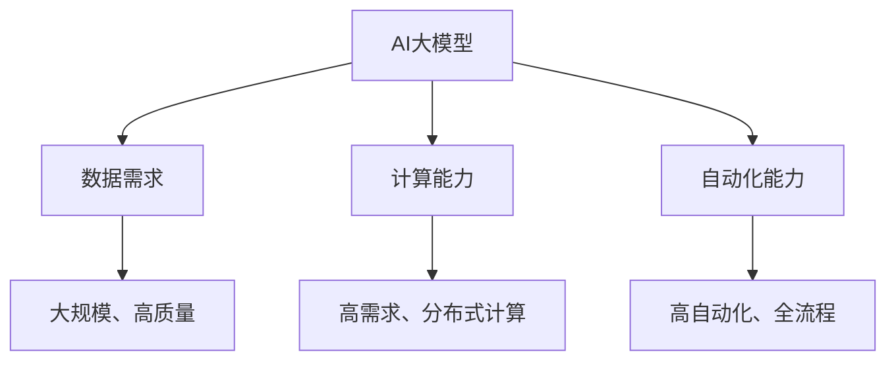
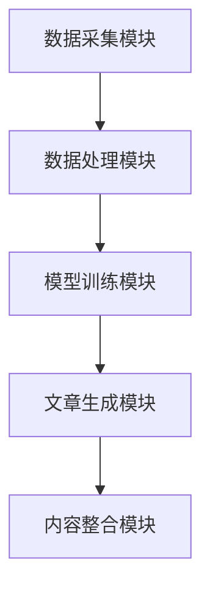
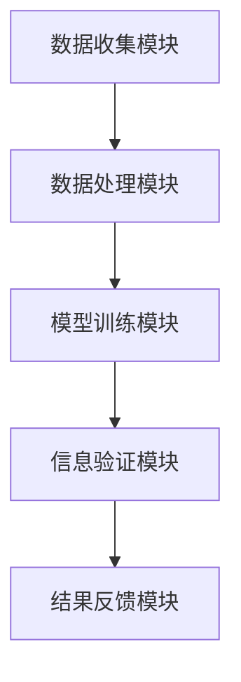

                 

## AI大模型对传统新闻业的挑战：自动化报道与信息验证

### 关键词：AI大模型、自动化报道、信息验证、新闻业、深度学习、数据真实性

### 摘要：
本文探讨了人工智能（AI）大模型对传统新闻业的挑战，特别是自动化报道和信息验证这两个方面。随着AI大模型技术的发展，新闻报道的生产效率和信息准确性面临变革。本文将深入分析AI大模型的基本原理与特性，探讨其在自动化报道和信息验证中的具体实现，进而评估其对传统新闻业的深远影响及未来的发展趋势。

### 目录大纲

1. **背景**
   - **第1章 问题背景与挑战**
     - **1.1 问题背景**
       - 新闻业面临的挑战
       - AI大模型的发展与应用
     - **1.2 问题描述**
       - 自动化报道
       - 信息验证
     - **1.3 问题解决**
       - AI大模型的优势
     - **1.4 边界与外延**
       - 新闻业的范围
       - AI大模型的限制
     - **1.5 概念结构与核心要素组成**
       - AI大模型
       - 传统新闻业
       - 自动化报道
       - 信息验证

2. **核心概念与联系**
   - **第2章 AI大模型原理与特性**
     - **2.1 AI大模型原理**
       - **2.1.1 神经网络基础**
       - **2.1.2 深度学习**
       - **2.1.3 大模型架构**
     - **2.2 AI大模型特性**
       - **2.2.1 数据需求**
       - **2.2.2 计算能力**
       - **2.2.3 自动化能力**

3. **自动化报道**
   - **第3章 自动化报道原理与实现**
     - **3.1 自动化报道原理**
       - **3.1.1 自动化报道概述**
       - **3.1.2 报道生成算法**
     - **3.2 自动化报道实现**
       - **3.2.1 技术框架**
       - **3.2.2 实现案例**

4. **信息验证**
   - **第4章 信息验证原理与实现**
     - **4.1 信息验证原理**
       - **4.1.1 信息验证概述**
       - **4.1.2 机器学习算法**
     - **4.2 信息验证实现**
       - **4.2.1 技术框架**
       - **4.2.2 实现案例**

5. **挑战与未来**
   - **第5章 AI大模型对传统新闻业的挑战**
     - **5.1 自动化报道对新闻业的影响**
     - **5.2 信息验证的困境与对策**
     - **5.3 未来发展趋势**

6. **实践与应用**
   - **第6章 AI大模型在新闻业的应用案例**
     - **6.1 案例一：人工智能新闻编辑**
     - **6.2 案例二：实时新闻报道**
     - **6.3 案例三：虚假信息检测与处理**

7. **小结与展望**
   - **第7章 小结与展望**
     - **7.1 总结**
     - **7.2 未来展望**

### 第一部分：背景

#### 第1章 问题背景与挑战

#### 1.1 问题背景

新闻业作为社会信息传播的重要途径，一直在面对信息生产与传播的挑战。传统新闻业依赖于记者和编辑的采访、写作和编辑工作，但这一过程效率较低，且难以保证每个信息的准确性。此外，随着互联网和社交媒体的发展，信息爆炸和虚假信息的泛滥对新闻业带来了前所未有的挑战。

AI大模型的发展为解决这些挑战提供了新的可能性。AI大模型，特别是基于深度学习的模型，通过训练能够自动生成文章、识别图像和验证信息，从而提升新闻生产的效率和准确性。

#### 1.2 问题描述

自动化报道和信息验证是AI大模型在新闻业中的两个核心应用方向。

**自动化报道**：指利用AI大模型生成新闻报道，减少人工写作的依赖，提高生产效率。自动化报道包括从数据源中提取信息、生成文章摘要、构建完整的新闻报道等内容。

**信息验证**：指利用AI大模型对新闻报道中的信息进行真实性验证，减少虚假信息传播。信息验证包括检测新闻报道中的错误信息、识别图片和视频的真伪、分析新闻报道的合理性等。

#### 1.3 问题解决

AI大模型在自动化报道和信息验证中具有显著优势。

**自动化报道优势**：

- 提高新闻生产效率：AI大模型能够快速生成文章，减少人工写作的时间。
- 扩展新闻范围：AI大模型能够处理大量的数据，提供更广泛的信息来源。
- 提升文章质量：AI大模型通过学习大量的数据，能够生成结构清晰、内容丰富的文章。

**信息验证优势**：

- 减少虚假信息传播：AI大模型能够快速识别虚假信息，减少虚假新闻的影响。
- 提高信息准确性：AI大模型能够通过多种方式验证信息的真实性，提高新闻报道的准确性。

#### 1.4 边界与外延

**新闻业的范围**：

新闻业包括传统媒体和新兴媒体，涵盖了报纸、杂志、电视、广播、互联网等多种媒体形式。AI大模型的应用正在逐步扩展到这些领域。

**AI大模型的限制**：

AI大模型在新闻业的应用受到数据质量、计算能力和算法可靠性的限制。数据的质量直接影响模型的学习效果，而计算能力限制模型的规模和应用范围。此外，算法的可靠性和公正性也是关键问题，需要不断优化和改进。

#### 1.5 概念结构与核心要素组成

**AI大模型**：

AI大模型是指参数规模巨大、训练数据丰富、能够处理复杂任务的深度学习模型。常见的AI大模型包括GPT、BERT、Transformers等。

**传统新闻业**：

传统新闻业指基于记者和编辑的采访、写作和编辑工作的新闻生产方式。

**自动化报道**：

自动化报道是利用AI大模型生成新闻报道的过程，包括数据提取、文章生成和内容整合等环节。

**信息验证**：

信息验证是利用AI大模型对新闻报道中的信息进行真实性验证的过程，包括错误检测、信息识别和合理性分析等。

### 总结

本文介绍了AI大模型对传统新闻业的挑战，特别是自动化报道和信息验证两个方面。AI大模型在提高新闻生产效率和信息准确性方面具有显著优势，但同时也受到数据质量、计算能力和算法可靠性的限制。接下来，本文将深入探讨AI大模型的原理与特性，进一步分析其在自动化报道和信息验证中的具体实现。  

### 第二部分：核心概念与联系

#### 第2章 AI大模型原理与特性

AI大模型是近年来人工智能领域的一个重要突破，其基于深度学习的原理和庞大的数据需求，使得它能够在诸多领域展现强大的能力。在本章节中，我们将详细探讨AI大模型的原理与特性，并分析其在新闻业中的应用。

#### 2.1 AI大模型原理

**2.1.1 神经网络基础**

神经网络是AI大模型的基础，它模仿人脑的结构和工作方式。神经网络由大量神经元（节点）组成，每个神经元都与其它神经元相连，通过传递信号来实现信息的处理和决策。

- **神经元与感知器**：神经元是神经网络的基本单元，它接收输入信号，通过激活函数进行计算，产生输出信号。感知器是神经网络的输入层，它接收外部信息并将其传递给隐藏层。

**2.1.2 深度学习**

深度学习是神经网络的一种扩展，通过多层神经网络结构来学习数据的复杂特征。

- **多层神经网络**：深度学习通过增加网络的层数，使得模型能够学习更复杂的数据特征。每一层神经网络都通过对输入数据进行变换和提取特征，从而逐渐构建起对数据的全面理解。

- **反向传播算法**：深度学习模型通过反向传播算法来训练网络。反向传播算法通过计算输出层与实际输出之间的误差，反向传播误差到每一层，并更新神经元的权重，以达到最小化误差的目的。

**2.1.3 大模型架构**

大模型架构是指具有巨大参数规模的神经网络模型。大模型通过训练大量的数据，能够捕捉到数据中的细微特征，从而提高模型的性能。

- **Transformer模型**：Transformer模型是AI大模型的一种重要架构，它采用自注意力机制来处理序列数据，能够在语言理解、图像识别等领域取得显著的成果。

- **预训练与微调**：预训练是指在大规模数据集上训练模型，使其掌握通用的特征表示。微调是指将预训练模型在特定任务上进行调整，以提高模型的特定任务性能。

#### 2.2 AI大模型特性

**2.2.1 数据需求**

AI大模型对数据的需求量非常大，通常需要数百万甚至数十亿级别的数据样本。这是因为大模型需要通过大量的数据来学习复杂的特征分布，从而提高模型的泛化能力。

- **数据规模**：大规模数据集使得模型能够学习到更加丰富的特征，从而提高模型的准确性。
- **数据质量**：高质量的数据对于模型的学习至关重要。数据中的噪声、偏差和错误都会对模型的性能产生负面影响。

**2.2.2 计算能力**

AI大模型对计算能力的要求极高，通常需要大量的计算资源来训练和推理。大模型通常采用分布式计算和并行计算来提高计算效率。

- **算法复杂度**：大模型的训练和推理过程涉及大量的矩阵运算，其算法复杂度通常较高，需要高效的算法和硬件支持。
- **计算资源需求**：大模型需要大量的计算资源，包括CPU、GPU和TPU等硬件设备，以支持其训练和推理过程。

**2.2.3 自动化能力**

AI大模型具有强大的自动化能力，能够自动完成从数据预处理到模型训练、预测的整个过程。

- **自动化报道**：AI大模型能够自动生成新闻报道，从数据源中提取信息，生成文章摘要，构建完整的新闻报道。
- **信息验证**：AI大模型能够自动验证新闻报道中的信息，识别虚假信息，提高新闻报道的准确性。

#### 概念属性特征对比表格

| 特征 | AI大模型 | 传统新闻业 |
| --- | --- | --- |
| 数据需求 | 大规模、高质量 | 小规模、中等质量 |
| 计算能力 | 高需求、分布式计算 | 低需求、单机计算 |
| 自动化能力 | 高自动化、全流程 | 低自动化、人工操作 |

#### ER实体关系图架构

#### 2.3 AI大模型在新闻业中的应用

AI大模型在新闻业中的应用主要体现在自动化报道和信息验证两个方面。

**自动化报道**：

- **数据提取**：AI大模型能够从各种数据源中提取信息，如新闻网站、社交媒体、传感器数据等。
- **文章生成**：通过预训练的模型，AI大模型能够自动生成新闻报道，从文章摘要到完整报道，提高生产效率。
- **内容整合**：AI大模型能够整合来自不同来源的信息，构建全面、准确的新闻报道。

**信息验证**：

- **虚假信息检测**：AI大模型能够通过分析新闻报道中的语言、图片和视频，识别虚假信息，减少虚假新闻的传播。
- **信息准确性验证**：AI大模型能够验证新闻报道中的信息准确性，如时间、地点、人物等，提高新闻报道的可靠性。

### 总结

本章详细介绍了AI大模型的原理与特性，包括神经网络基础、深度学习和大模型架构。同时，分析了AI大模型对数据需求、计算能力和自动化能力的特性，并展示了其在新闻业中的应用。AI大模型为新闻业带来了自动化报道和信息验证的可能性，但同时也需要克服数据质量、计算能力和算法可靠性的挑战。

### 第三部分：自动化报道

#### 第3章 自动化报道原理与实现

自动化报道是AI大模型在新闻业中的一个重要应用，通过利用AI技术，大幅度提高新闻报道的生产效率和内容质量。在这一章节中，我们将深入探讨自动化报道的原理和实现过程。

#### 3.1 自动化报道原理

**3.1.1 自动化报道概述**

自动化报道是指通过AI大模型，自动生成新闻报道的过程。这一过程通常包括以下几个关键步骤：

1. **数据采集**：从各种来源（如新闻网站、社交媒体、传感器等）采集原始数据。
2. **数据处理**：对采集到的数据进行清洗、去噪、分类等预处理操作，以便后续的模型处理。
3. **文章生成**：利用预训练的AI大模型，自动生成新闻报道的文本内容。
4. **内容整合**：将生成的文章进行整合，构建完整、连贯的新闻报道。

**3.1.2 报道生成算法**

报道生成算法是自动化报道的核心，其主要目标是生成符合新闻规范和读者需求的文本内容。以下是一些常见的报道生成算法：

1. **基于规则的方法**：这种方法通过预设的规则和模板生成新闻报道，适合处理结构化数据。
2. **基于模板的方法**：这种方法使用预先定义的模板和参数，动态生成新闻报道。
3. **基于生成对抗网络（GAN）的方法**：这种方法通过生成器和判别器的对抗训练，生成高质量的文本内容。
4. **基于变换器（Transformer）的方法**：这种方法采用变换器模型，通过自注意力机制生成文本，是当前最先进的报道生成方法。

#### 3.2 自动化报道实现

**3.2.1 技术框架**

自动化报道的技术框架通常包括以下几个关键组件：

1. **数据采集模块**：负责从各种数据源（如新闻网站、社交媒体等）采集原始数据，并存储在数据湖中。
2. **数据处理模块**：负责对采集到的数据进行清洗、去噪、分类等预处理操作，以便后续的模型处理。
3. **模型训练模块**：负责使用大量的新闻数据进行模型训练，训练出高质量的AI大模型。
4. **文章生成模块**：负责使用训练好的模型，自动生成新闻报道的文本内容。
5. **内容整合模块**：负责将生成的文章进行整合，构建完整、连贯的新闻报道，并发布到相应的渠道。

以下是一个自动化报道系统的技术框架示例：

**3.2.2 实现案例**

**案例一：新闻自动生成**

新闻自动生成是自动化报道的一种常见实现方式，其核心在于利用AI大模型生成高质量的新闻报道。以下是一个简化的实现流程：

1. **数据采集**：从多个新闻网站采集最新的新闻数据，包括标题、正文、图片等。
2. **数据处理**：对采集到的数据进行清洗和预处理，去除无关信息，保留关键内容。
3. **模型训练**：使用大规模的新闻数据集，训练一个基于变换器（Transformer）的AI大模型，用于生成新闻报道的文本内容。
4. **文章生成**：利用训练好的模型，输入新的新闻事件或主题，自动生成相应的新闻报道。
5. **内容整合**：将生成的文章进行整合，添加必要的标题、摘要、图片等，构建完整的新闻报道。
6. **发布**：将生成的新闻报道发布到新闻网站、社交媒体等渠道，供用户阅读。

**案例二：实时报道更新**

实时报道更新是自动化报道的另一种重要实现方式，其目标是在新闻事件发生时，快速生成并发布相关的新闻报道。以下是一个简化的实现流程：

1. **实时数据采集**：从新闻网站、社交媒体等渠道实时采集新闻事件的数据，包括标题、正文、图片等。
2. **实时数据处理**：对实时采集的数据进行实时清洗和预处理，去除无关信息，保留关键内容。
3. **模型推理**：使用预训练的AI大模型，对实时处理的数据进行推理，生成实时新闻报道的文本内容。
4. **实时内容整合**：将生成的文章进行实时整合，添加必要的标题、摘要、图片等，构建实时新闻报道。
5. **实时发布**：将实时生成的新闻报道快速发布到新闻网站、社交媒体等渠道，供用户实时阅读。

### 总结

本章详细介绍了自动化报道的原理和实现过程。通过AI大模型，自动化报道能够实现从数据采集、处理到文章生成和内容整合的自动化流程，大幅提高新闻报道的生产效率和内容质量。同时，通过具体实现案例，展示了自动化报道在实际应用中的操作步骤和技术框架。

### 第四部分：信息验证

#### 第4章 信息验证原理与实现

信息验证在新闻报道中起着至关重要的作用，它能够确保新闻内容的真实性和准确性，减少虚假信息的传播。随着AI大模型技术的发展，信息验证的方法和实现也发生了巨大的变化。在这一章节中，我们将深入探讨信息验证的原理和实现，包括其基本概念和常用的机器学习算法。

#### 4.1 信息验证原理

**4.1.1 信息验证概述**

信息验证是指对新闻报道中的信息进行真实性和准确性检查的过程。其主要目标包括：

- **真实性检测**：检测新闻报道中的信息是否真实可靠，如新闻事件是否真实发生，人物和地点是否准确。
- **准确性验证**：验证新闻报道中的信息是否准确无误，如时间、数据、引用等是否准确。

信息验证的关键在于利用人工智能技术，从大量的数据中快速准确地识别出虚假信息和错误信息。

**4.1.2 机器学习算法**

机器学习算法是信息验证的核心，通过训练模型，使模型能够识别和验证信息的真实性。以下是一些常用的机器学习算法：

1. **分类算法**：分类算法是将数据分为不同类别的算法，如支持向量机（SVM）、决策树（DT）等。在信息验证中，分类算法可以用来判断新闻报道中的信息是否真实。

2. **概率模型**：概率模型通过计算信息的概率分布来验证信息的真实性，如贝叶斯网络（BN）等。在信息验证中，概率模型可以帮助判断新闻报道中的信息是否可信。

3. **深度学习算法**：深度学习算法通过多层神经网络，从大量数据中学习特征和模式，如卷积神经网络（CNN）和循环神经网络（RNN）等。在信息验证中，深度学习算法可以用于复杂的特征提取和模式识别。

#### 4.2 信息验证实现

**4.2.1 技术框架**

信息验证的技术框架主要包括以下几个关键组件：

1. **数据收集模块**：负责从各种来源（如新闻网站、社交媒体等）收集需要验证的原始数据。
2. **数据处理模块**：负责对原始数据进行清洗、去噪、标注等预处理操作，以便后续的模型处理。
3. **模型训练模块**：负责使用大量的标注数据，训练出高质量的验证模型。
4. **信息验证模块**：负责使用训练好的模型，对新的新闻报道进行真实性验证。
5. **结果反馈模块**：负责将验证结果反馈给用户，帮助用户识别和修正错误信息。

以下是一个信息验证系统的技术框架示例：

**4.2.2 实现案例**

**案例一：新闻真实性检测**

新闻真实性检测是信息验证的一个典型应用，其目标是识别新闻报道中的虚假信息。以下是一个简化的实现流程：

1. **数据收集**：从多个新闻网站、社交媒体等渠道收集需要进行真实性检测的新闻报道。
2. **数据处理**：对收集到的新闻报道进行清洗和预处理，去除无关信息，提取关键特征。
3. **模型训练**：使用已标注的虚假新闻数据集，训练一个基于深度学习的验证模型，如卷积神经网络（CNN）或循环神经网络（RNN）。
4. **新闻检测**：使用训练好的模型，对新的新闻报道进行真实性检测，判断其是否为虚假新闻。
5. **结果反馈**：将检测结果反馈给用户，帮助用户识别和修正错误信息。

**案例二：错误资讯识别与修正**

错误资讯识别与修正是另一个重要的信息验证应用，其目标是识别和修正新闻报道中的错误信息。以下是一个简化的实现流程：

1. **数据收集**：从多个新闻网站、社交媒体等渠道收集需要进行错误信息识别与修正的新闻报道。
2. **数据处理**：对收集到的新闻报道进行清洗和预处理，提取关键特征，并标注错误信息。
3. **模型训练**：使用已标注的错误信息数据集，训练一个基于深度学习的修正模型，如生成对抗网络（GAN）。
4. **错误识别**：使用训练好的模型，对新的新闻报道进行错误识别，判断其是否存在错误信息。
5. **信息修正**：对识别出的错误信息进行修正，生成修正后的新闻报道。
6. **结果反馈**：将修正后的新闻报道反馈给用户，帮助用户获取准确的信息。

### 总结

本章详细介绍了信息验证的原理和实现过程。通过机器学习算法，信息验证能够实现快速、准确的真实性和准确性检查。同时，通过具体实现案例，展示了信息验证在实际应用中的操作步骤和技术框架。信息验证在确保新闻报道真实性和准确性方面具有重要意义，是未来新闻业发展的重要方向。

### 第五部分：挑战与未来

#### 第5章 AI大模型对传统新闻业的挑战

随着AI大模型技术的发展，传统新闻业面临着前所未有的变革和挑战。自动化报道和信息验证作为AI大模型在新闻业中的核心应用，不仅带来了生产效率和准确性的提升，也引发了一系列深刻的变革和挑战。

#### 5.1 自动化报道对新闻业的影响

自动化报道作为AI大模型在新闻业中的一个重要应用，其对新闻业的影响主要体现在以下几个方面：

1. **提高生产效率**：自动化报道能够自动生成新闻报道，减少人工写作的时间，从而提高生产效率。这对于新闻机构来说，意味着可以更快速地响应新闻事件，提供即时的报道。

2. **扩展新闻范围**：自动化报道使得新闻机构能够处理更多的数据，从而扩展新闻的范围。这不仅包括传统的文字新闻，还包括图片、视频等多媒体内容。

3. **降低人力成本**：自动化报道减少了记者和编辑的工作量，降低了人力成本。然而，这也可能导致传统记者和编辑的角色发生变化，需要更多地向数据分析、内容审核和战略规划等方向转型。

4. **改变新闻生产流程**：自动化报道改变了传统的新闻生产流程，从数据采集、处理到内容生成，各个环节都可以通过AI大模型来实现自动化。这要求新闻机构重新审视和调整其新闻生产流程，以适应新的技术环境。

#### 5.2 信息验证的困境与对策

信息验证在确保新闻报道真实性和准确性方面具有重要意义，但随着AI大模型的发展，信息验证也面临着一系列的困境和挑战：

1. **虚假信息识别困难**：随着技术的进步，虚假信息的制作手段也变得更加高级和复杂，这使得AI大模型在识别虚假信息时面临更大的挑战。如何提高AI大模型在虚假信息识别方面的准确性，是一个亟待解决的问题。

2. **数据质量的影响**：信息验证依赖于大量的数据，但数据的质量直接影响验证结果的准确性。如果数据中存在噪声、偏差或错误，那么验证结果可能会受到影响。

3. **算法的可靠性和公正性**：AI大模型在信息验证中的应用涉及到大量的算法和模型，其可靠性和公正性是关键问题。如果算法存在偏见或错误，可能会导致错误的验证结果。

4. **伦理和法律问题**：信息验证涉及到对新闻报道的真实性进行判断，这可能会引发一系列伦理和法律问题。如何确保AI大模型在信息验证中的行为符合伦理和法律标准，是一个重要的挑战。

针对以上困境，以下是一些可能的对策：

- **提高数据质量**：通过数据清洗、去噪和标注等方法，提高数据的准确性和可靠性，从而提高信息验证的准确性。
- **多模态验证**：结合文本、图像、音频等多种数据源，实现多模态的信息验证，以提高验证结果的可靠性。
- **算法透明度和可解释性**：提高AI大模型的透明度和可解释性，使其决策过程更加清晰和透明，从而提高用户对验证结果的信任度。
- **伦理和法律规范**：制定相关的伦理和法律规范，确保AI大模型在信息验证中的行为符合伦理和法律标准。

#### 5.3 未来发展趋势

AI大模型在新闻业中的应用具有巨大的潜力，未来发展趋势主要体现在以下几个方面：

1. **深度融合**：AI大模型将进一步与新闻业深度融合，不仅在自动化报道和信息验证中发挥作用，还可能在内容推荐、用户互动、数据分析等方面发挥重要作用。

2. **多语言支持**：随着全球化的推进，新闻业需要支持多种语言。未来，AI大模型将实现更好的多语言支持，提供更加全面的新闻报道。

3. **个性化报道**：通过用户数据的分析，AI大模型能够提供更加个性化的新闻报道，满足不同用户的需求。

4. **智能互动**：AI大模型将实现与用户的智能互动，如通过聊天机器人回答用户的问题，提供个性化的新闻推荐等。

5. **伦理和法律框架**：随着AI大模型在新闻业中的应用越来越广泛，相关的伦理和法律框架也将逐步建立和完善，以确保其应用符合伦理和法律标准。

### 总结

AI大模型对传统新闻业带来了深刻的变革和挑战。自动化报道和信息验证作为AI大模型在新闻业中的核心应用，不仅提高了新闻生产的效率和准确性，也引发了一系列伦理和法律问题。未来，随着AI大模型技术的不断进步，新闻业将朝着更加智能化、个性化和多样化的方向发展。

### 第六部分：实践与应用

#### 第6章 AI大模型在新闻业的应用案例

在本章节中，我们将通过具体的案例分析AI大模型在新闻业中的应用，探讨其实际操作过程、实现效果以及相关挑战。

#### 6.1 案例一：人工智能新闻编辑

**应用场景**：该案例主要应用于一个大型新闻机构，通过人工智能（AI）技术自动化处理新闻报道的编辑过程，以提升生产效率和内容质量。

**实现效果**：

- **内容生成**：利用AI大模型，如GPT-3，自动生成新闻稿，涵盖从事件报道到评论分析等多种内容类型。
- **标题优化**：AI模型根据新闻内容自动生成吸引人的标题，提高点击率和用户参与度。
- **内容审核**：AI大模型能够初步审核新闻内容，识别潜在的错别字、语法错误和不准确信息，减少编辑工作量。

**挑战**：

- **内容准确性**：AI模型生成的新闻内容需要进一步人工审核，以确保其准确性和客观性。
- **文化差异**：不同文化背景的新闻内容处理可能需要特定的模型调整，以避免文化误解和偏见。

#### 6.2 案例二：实时新闻报道

**应用场景**：该案例应用于重大新闻事件的实时报道，通过AI大模型快速生成和发布新闻内容。

**实现效果**：

- **快速响应**：在新闻事件发生后，AI模型能够在几分钟内生成初步报道，满足新闻机构对时效性的要求。
- **内容整合**：AI大模型能够整合来自多个来源的信息，构建全面、准确的新闻事件报告。
- **多媒体支持**：AI模型能够自动处理和整合视频、音频等多媒体内容，提高报道的丰富度和吸引力。

**挑战**：

- **数据同步**：实时新闻报道要求数据同步快速且准确，需要高效的数据采集和处理系统。
- **错误传播**：由于时间紧迫，AI模型生成的初步报道可能存在错误，需要及时修正。

#### 6.3 案例三：虚假信息检测与处理

**应用场景**：该案例应用于新闻内容的真实性检测，旨在减少虚假信息的传播。

**实现效果**：

- **虚假信息识别**：AI大模型能够通过分析文本、图像和视频，识别和标记潜在的虚假信息。
- **错误纠正**：在识别出虚假信息后，AI模型能够提出修正建议，帮助编辑人员纠正错误。
- **自动更新**：AI模型能够实时更新新闻报道，确保信息的准确性和时效性。

**挑战**：

- **算法透明度**：AI模型在检测虚假信息时的决策过程需要透明，以便用户理解并信任其结果。
- **技术成本**：构建和维护一个高效、准确的虚假信息检测系统需要大量计算资源和资金投入。

#### 总结

以上三个案例展示了AI大模型在新闻业中的应用，从内容生成、实时报道到虚假信息检测，AI大模型在提升新闻生产效率和内容质量方面发挥了重要作用。同时，这些案例也揭示了在实际应用中面临的挑战，包括内容准确性、数据同步、算法透明度和技术成本等。未来，随着AI技术的不断进步，新闻业将更好地应对这些挑战，实现更加智能化和高效化的新闻报道。

### 第七部分：小结与展望

#### 第7章 小结与展望

在本文中，我们系统地探讨了AI大模型对传统新闻业的挑战，特别是自动化报道和信息验证两个方面。通过深入分析AI大模型的基本原理和特性，我们了解了其如何在数据需求、计算能力和自动化能力方面展现强大的能力。同时，我们也探讨了AI大模型在新闻业中的应用，包括自动化报道的具体实现过程和案例，以及信息验证的原理和实现方法。

**小结**：

AI大模型作为人工智能领域的一个重要突破，其在新闻业中的应用带来了生产效率和内容质量的显著提升。自动化报道能够快速生成高质量的新闻报道，扩展新闻范围，提高新闻生产效率。信息验证则通过识别和纠正错误信息，确保新闻报道的真实性和准确性。然而，AI大模型在新闻业的应用也面临着数据质量、算法可靠性和伦理问题等挑战。

**展望**：

未来，随着AI大模型技术的不断进步，新闻业将朝着更加智能化、个性化和多样化的方向发展。多语言支持、个性化报道、智能互动等技术将进一步提升新闻报道的质量和用户体验。同时，伦理和法律框架的建立和完善也将确保AI大模型在新闻业中的应用符合伦理和法律标准。此外，跨领域合作和创新也将是未来新闻业发展的关键。

**最佳实践 Tips**：

1. **数据质量是关键**：在应用AI大模型时，确保数据的质量和准确性，这是实现有效自动化报道和信息验证的基础。
2. **算法透明度和可解释性**：提高算法的透明度和可解释性，增强用户对AI大模型结果的信任度。
3. **持续优化和迭代**：定期对AI大模型进行优化和迭代，以适应不断变化的需求和技术环境。

**注意事项**：

1. **避免数据偏见**：在训练AI大模型时，确保数据的多样性和代表性，以避免算法偏见。
2. **伦理和法律合规**：遵守相关的伦理和法律规范，确保AI大模型的应用不违反伦理和法律标准。

**拓展阅读**：

- 《深度学习》（Ian Goodfellow, Yoshua Bengio, Aaron Courville）提供了深度学习的基础理论和实践方法。
- 《AI驱动的新闻报道：理论与实践》（Xin Li, Chengqi Zhang）详细探讨了AI在新闻报道中的应用。
- 《信息验证：技术与实践》（Yuxiao Zhou, Qiaozhu Mei）介绍了信息验证的基本方法和应用。

通过本文的探讨，我们希望读者能够对AI大模型在新闻业中的应用有一个全面和深入的了解，为未来的研究和实践提供参考和启示。作者：AI天才研究院/AI Genius Institute & 禅与计算机程序设计艺术 /Zen And The Art of Computer Programming。

