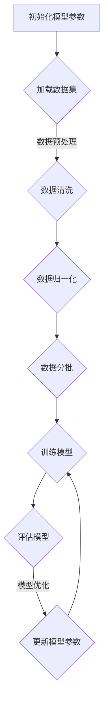
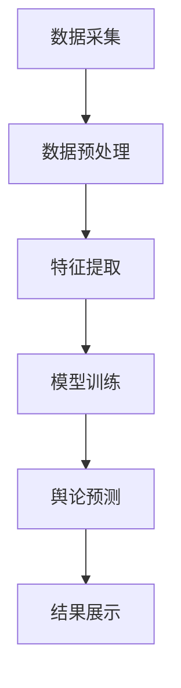
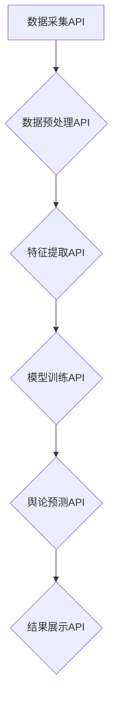
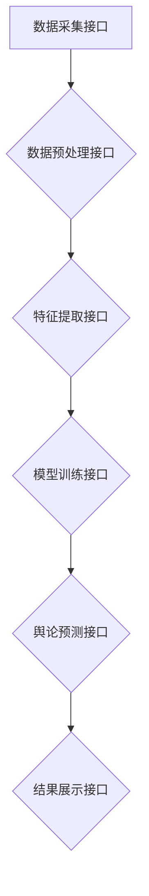

                 


### 第1章: 背景介绍

#### 1.1 问题背景

随着人工智能（AI）技术的快速发展，尤其是深度学习和神经网络技术的突破，AI大模型（Large-scale AI Models）已成为当前研究的热点。这些大模型具备强大的学习能力和数据处理能力，能够在各种复杂场景中发挥重要作用。与此同时，社交媒体作为现代社会信息传播的重要渠道，已经深刻影响了人们的日常生活和舆论形成。因此，AI大模型与社交媒体的结合成为了一个备受关注的研究领域。

AI大模型的发展历程可以追溯到上世纪80年代，随着计算机性能的不断提升和海量数据的积累，深度学习逐渐成熟。2012年，AlexNet在ImageNet竞赛中取得了突破性的成绩，标志着深度学习时代的到来。此后，VGG、ResNet、GPT等大模型相继出现，使AI大模型在图像识别、自然语言处理等领域取得了显著的进展。

社交媒体的发展同样经历了从简单的信息发布和浏览，到复杂的社交互动和内容分享的演变。从Facebook、Twitter到Instagram、微信等平台，社交媒体已经成为人们获取信息、交流观点、表达情感的重要场所。在这个过程中，信息的流动和舆论的形成变得愈发复杂，对社会的各个方面产生了深远的影响。

#### 1.2 问题描述

AI大模型对社交媒体的影响主要体现在信息流动和舆论形成两个方面。首先，AI大模型通过分析和预测用户行为，能够影响信息的传播路径和速度，从而改变信息的流动模式。其次，AI大模型在处理和生成内容时，可能会引发舆论的偏见和误导，影响公众的意见和态度。

具体来说，问题可以概括为以下几点：

1. **信息过滤与偏见**：AI大模型在社交媒体上的应用，可能会通过对用户数据的分析，过滤掉某些信息，从而影响用户的接收范围和认知。这种现象可能会导致信息偏见和舆论误导。

2. **内容生成与传播**：AI大模型可以生成大量内容，这些内容可能会在社交媒体上迅速传播，影响舆论走向。然而，由于AI大模型缺乏人类的道德和伦理观念，其生成的内容可能存在不当或有害的成分。

3. **舆论操纵与误导**：AI大模型可以通过算法优化，操纵舆论走向，误导公众。例如，通过控制信息的传播路径和速度，使某些观点或信息占据主导地位，从而影响公众的意见和决策。

4. **隐私保护与安全**：AI大模型在处理和分析社交媒体数据时，可能会侵犯用户的隐私，引发安全问题。

#### 1.3 问题解决

为了解决上述问题，我们需要从以下几个方面入手：

1. **透明性与可解释性**：提高AI大模型的透明性和可解释性，使人们能够理解模型的决策过程和影响机制。

2. **伦理与道德约束**：在AI大模型的设计和应用过程中，重视伦理和道德问题，确保其生成的内容和影响是积极和正面的。

3. **隐私保护与安全**：加强对社交媒体数据的安全保护，防止AI大模型滥用用户数据。

4. **算法优化与监督**：优化AI大模型的算法，提高其识别和过滤偏见和误导信息的能力。同时，加强对AI大模型的监督，防止其被恶意利用。

#### 1.4 边界与外延

本文的研究范围主要关注AI大模型对社交媒体的影响，包括信息流动和舆论形成两个方面。边界包括以下几个方面：

1. **技术层面**：本文主要讨论AI大模型的基本原理和应用，不包括其他相关技术的研究。

2. **应用层面**：本文主要探讨AI大模型在社交媒体上的应用，不涉及其他领域的应用。

3. **地域层面**：本文的研究主要针对全球范围内的社交媒体和AI大模型，不考虑特定地区或国家的特殊情况。

#### 1.5 概念结构与核心要素组成

为了更好地理解AI大模型对社交媒体的影响，我们需要明确以下几个核心概念：

1. **AI大模型**：指具有大规模参数、能够处理海量数据的人工智能模型，包括深度学习模型、图神经网络模型等。

2. **社交媒体**：指用户可以通过发布、分享、评论等方式进行互动和交流的平台，如Facebook、Twitter、微信等。

3. **信息流动**：指信息在社交媒体上的传播过程，包括信息的生成、传播、接收和处理等环节。

4. **舆论形成**：指公众对某一事件或话题的意见和态度的形成过程，包括信息的接收、处理、传播和反馈等环节。

这些概念之间的联系如下：

- AI大模型通过对用户数据的分析和预测，影响信息的流动和舆论的形成。
- 社交媒体作为信息流动和舆论形成的载体，为AI大模型提供了丰富的数据和场景。
- 信息流动和舆论形成是AI大模型在社交媒体上的主要影响方式。

### 第2章: 核心概念与联系

#### 2.1 AI大模型原理

AI大模型，也称为大型深度学习模型，是人工智能领域的一项重要技术。其核心原理是基于神经网络，通过对海量数据进行训练，学习数据的特征和规律，从而实现自动化的数据分析和决策。

AI大模型的主要类型包括：

1. **深度学习模型**：如卷积神经网络（CNN）、循环神经网络（RNN）、Transformer等。这些模型具有多层神经网络结构，能够提取数据的深层特征。

2. **图神经网络模型**：如图卷积网络（GCN）、图注意力网络（GAT）等。这些模型适用于处理图结构数据，能够提取节点和边的关系特征。

3. **生成对抗网络（GAN）**：通过生成器和判别器的对抗训练，实现数据的生成和判别。

AI大模型的应用领域广泛，包括但不限于：

1. **自然语言处理（NLP）**：如文本分类、情感分析、机器翻译等。

2. **计算机视觉**：如图像分类、目标检测、图像生成等。

3. **推荐系统**：如个性化推荐、广告投放等。

4. **金融风控**：如信用评估、欺诈检测等。

#### 2.2 社交媒体特点

社交媒体是指用户可以通过发布、分享、评论等方式进行互动和交流的平台。其特点如下：

1. **用户生成内容（UGC）**：用户是内容的主要生产者，通过发布文字、图片、视频等形式的内容，实现信息的传播和交流。

2. **社交网络结构**：社交媒体形成了复杂的社交网络结构，用户之间通过关系连接，形成网络节点和边。

3. **信息传播路径**：信息在社交媒体上的传播路径多样，包括直接传播、间接传播、群体传播等。

4. **舆论动态形成**：社交媒体上的舆论形成迅速，公众意见和态度可以在短时间内形成和传播。

#### 2.3 信息流动机制

信息流动机制是指信息在社交媒体上的传播过程。其主要包括以下环节：

1. **信息生成**：用户发布或生成内容，包括文字、图片、视频等。

2. **信息传播**：内容在社交媒体上通过用户关系进行传播，包括直接传播（如直接转发）和间接传播（如评论、点赞）。

3. **信息处理**：用户对接收到的信息进行处理，包括阅读、评论、分享等。

4. **信息反馈**：用户对信息传播的反馈，包括点赞、评论、转发等。

信息流动机制受到多种因素影响，包括用户行为、内容特征、网络结构等。

#### 2.4 舆论形成过程

舆论形成过程是指公众对某一事件或话题的意见和态度的形成过程。其主要包括以下环节：

1. **信息接收**：公众接收来自社交媒体的信息，包括直接接收和间接接收。

2. **信息处理**：公众对接收到的信息进行处理，包括理解、判断、分析等。

3. **意见表达**：公众根据处理后的信息表达自己的意见和态度，包括评论、转发、点赞等。

4. **舆论传播**：公众意见和态度在社交媒体上传播，形成舆论。

舆论形成过程受到信息传播机制、用户行为、社会环境等多种因素影响。

### 第3章: AI大模型算法原理讲解

#### 3.1 算法流程图

为了更好地理解AI大模型的算法原理，我们可以通过Mermaid语言绘制一个简化的算法流程图。以下是一个基于Transformer的AI大模型的算法流程：



在这个流程图中，A表示初始化模型参数，B表示加载数据集，C表示数据清洗，D表示数据归一化，E表示数据分批，F表示训练模型，G表示评估模型，H表示更新模型参数。

#### 3.2 算法原理

AI大模型的算法原理主要基于深度学习和神经网络。以下以Transformer模型为例，详细讲解其算法原理。

Transformer模型是一种基于自注意力机制的深度学习模型，其核心思想是将输入序列映射到输出序列，通过多头自注意力机制和前馈神经网络实现。

1. **多头自注意力机制**：多头自注意力机制是一种全局依赖的机制，能够使模型在处理序列数据时，考虑到序列中所有位置的信息。其基本思想是将输入序列通过多个不同的线性变换，得到多个独立的自注意力图，然后将这些图进行加权求和，得到输出序列。

2. **前馈神经网络**：前馈神经网络是一个简单的全连接神经网络，用于对自注意力机制的输出进行进一步的处理和调整。

3. **编码器和解码器**：Transformer模型包括编码器和解码器两个部分。编码器负责将输入序列编码为固定长度的向量，解码器则将这些向量解码为输出序列。

#### 3.3 举例说明

为了更直观地理解Transformer模型的算法原理，我们可以通过Python代码实现一个简单的Transformer模型。

首先，我们需要安装Transformer库：

```bash
pip install transformers
```

然后，编写Python代码：

```python
from transformers import TransformerModel
from torch import nn

# 定义模型结构
class Transformer(nn.Module):
    def __init__(self, d_model, nhead, num_layers):
        super(Transformer, self).__init__()
        self.transformer = TransformerModel(d_model, nhead, num_layers)
        
    def forward(self, src, tgt):
        return self.transformer(src, tgt)

# 初始化模型参数
d_model = 512
nhead = 8
num_layers = 3
model = Transformer(d_model, nhead, num_layers)

# 加载数据集
train_data = ... # 加载数据集
valid_data = ... # 加载验证集

# 训练模型
optimizer = torch.optim.Adam(model.parameters(), lr=0.001)
for epoch in range(10): # 训练10个epoch
    for src, tgt in train_data:
        optimizer.zero_grad()
        output = model(src, tgt)
        loss = nn.CrossEntropyLoss()(output, tgt)
        loss.backward()
        optimizer.step()

    # 评估模型
    with torch.no_grad():
        for src, tgt in valid_data:
            output = model(src, tgt)
            # 计算准确率

# 保存模型
torch.save(model.state_dict(), 'transformer_model.pth')
```

在这个例子中，我们定义了一个Transformer模型，并使用一个简单的训练过程来演示其工作原理。具体来说，我们加载了一个数据集，然后使用Adam优化器对模型进行训练。在训练过程中，我们计算损失并更新模型参数。最后，我们评估模型的性能并保存模型参数。

### 第4章: 数学模型和数学公式讲解

#### 4.1 数学模型

AI大模型的数学模型主要基于深度学习和神经网络。以下以深度神经网络（DNN）为例，介绍其基本数学模型。

1. **输入层**：输入层接收外部输入数据，通常为实值向量。

2. **隐藏层**：隐藏层通过一系列的线性变换和非线性激活函数，将输入数据转化为更高层次的特征表示。

3. **输出层**：输出层将隐藏层的输出转化为最终的预测结果或分类结果。

深度神经网络的基本数学模型可以表示为：

$$
Y = \sigma(W_3 \cdot \sigma(W_2 \cdot \sigma(W_1 \cdot X + b_1) + b_2) + b_3)
$$

其中，$Y$为输出层输出，$X$为输入层输入，$W_1, W_2, W_3$为各层的权重矩阵，$b_1, b_2, b_3$为各层的偏置项，$\sigma$为非线性激活函数，通常取为ReLU函数。

#### 4.2 公式解释

在深度学习模型中，常用的数学公式包括：

1. **前向传播**：

$$
Z_l = \sigma(W_l \cdot A_{l-1} + b_l)
$$

其中，$Z_l$为第$l$层的激活值，$A_{l-1}$为第$l-1$层的输出，$W_l$为第$l$层的权重矩阵，$b_l$为第$l$层的偏置项，$\sigma$为非线性激活函数。

2. **反向传播**：

$$
\frac{\partial L}{\partial W_l} = A_{l-1}^T \cdot \frac{\partial L}{\partial A_l}
$$

$$
\frac{\partial L}{\partial b_l} = \frac{\partial L}{\partial A_l}
$$

其中，$L$为损失函数，$\frac{\partial L}{\partial W_l}$和$\frac{\partial L}{\partial b_l}$分别为损失函数对权重矩阵和偏置项的偏导数，$A_{l-1}^T$为第$l-1$层的输出转置。

3. **梯度下降**：

$$
W_l = W_l - \alpha \cdot \frac{\partial L}{\partial W_l}
$$

$$
b_l = b_l - \alpha \cdot \frac{\partial L}{\partial b_l}
$$

其中，$\alpha$为学习率，$W_l$和$b_l$分别为第$l$层的权重矩阵和偏置项。

#### 4.3 举例说明

为了更好地理解上述数学公式，我们可以通过一个简单的例子来演示。

假设我们有一个简单的深度神经网络，包含两个隐藏层，每个隐藏层有3个神经元。输入层输入为一个2维向量$(x_1, x_2)$，输出层输出为一个1维向量$y$。

1. **前向传播**：

设第一层的权重矩阵$W_1$为：

$$
W_1 = \begin{bmatrix}
1 & 1 & 1 \\
1 & 1 & 1 \\
1 & 1 & 1
\end{bmatrix}
$$

第一层的偏置项$b_1$为：

$$
b_1 = \begin{bmatrix}
1 \\
1 \\
1
\end{bmatrix}
$$

非线性激活函数$\sigma$为ReLU函数。

则第一层的输出$A_1$为：

$$
A_1 = \begin{bmatrix}
\max(1 \cdot x_1 + 1 \cdot x_2 + 1, 0) \\
\max(1 \cdot x_1 + 1 \cdot x_2 + 1, 0) \\
\max(1 \cdot x_1 + 1 \cdot x_2 + 1, 0)
\end{bmatrix}
$$

设第二层的权重矩阵$W_2$为：

$$
W_2 = \begin{bmatrix}
1 & 1 & 1 \\
1 & 1 & 1 \\
1 & 1 & 1
\end{bmatrix}
$$

第二层的偏置项$b_2$为：

$$
b_2 = \begin{bmatrix}
1 \\
1 \\
1
\end{bmatrix}
$$

则第二层的输出$A_2$为：

$$
A_2 = \begin{bmatrix}
\max(1 \cdot A_1_1 + 1 \cdot A_1_2 + 1 \cdot A_1_3 + 1, 0) \\
\max(1 \cdot A_1_1 + 1 \cdot A_1_2 + 1 \cdot A_1_3 + 1, 0) \\
\max(1 \cdot A_1_1 + 1 \cdot A_1_2 + 1 \cdot A_1_3 + 1, 0)
\end{bmatrix}
$$

设输出层的权重矩阵$W_3$为：

$$
W_3 = \begin{bmatrix}
1 & 1 & 1
\end{bmatrix}
$$

输出层的偏置项$b_3$为：

$$
b_3 = \begin{bmatrix}
1
\end{bmatrix}
$$

则输出层输出$y$为：

$$
y = \max(1 \cdot A_2_1 + 1 \cdot A_2_2 + 1 \cdot A_2_3 + 1, 0)
$$

2. **反向传播**：

假设输出层损失函数为均方误差（MSE）：

$$
L = \frac{1}{2} \sum_{i=1}^{n} (y_i - \hat{y}_i)^2
$$

其中，$n$为样本数量，$y_i$为第$i$个样本的真实输出，$\hat{y}_i$为第$i$个样本的预测输出。

则输出层对权重矩阵$W_3$和偏置项$b_3$的梯度为：

$$
\frac{\partial L}{\partial W_3} = A_2
$$

$$
\frac{\partial L}{\partial b_3} = 1
$$

则第二层对权重矩阵$W_2$和偏置项$b_2$的梯度为：

$$
\frac{\partial L}{\partial W_2} = A_1^T \cdot A_2
$$

$$
\frac{\partial L}{\partial b_2} = A_1^T
$$

则第一层对权重矩阵$W_1$和偏置项$b_1$的梯度为：

$$
\frac{\partial L}{\partial W_1} = X^T \cdot A_2
$$

$$
\frac{\partial L}{\partial b_1} = X^T
$$

3. **梯度下降**：

假设学习率为$\alpha = 0.1$，则模型参数的更新为：

$$
W_3 = W_3 - \alpha \cdot \frac{\partial L}{\partial W_3}
$$

$$
b_3 = b_3 - \alpha \cdot \frac{\partial L}{\partial b_3}
$$

$$
W_2 = W_2 - \alpha \cdot \frac{\partial L}{\partial W_2}
$$

$$
b_2 = b_2 - \alpha \cdot \frac{\partial L}{\partial b_2}
$$

$$
W_1 = W_1 - \alpha \cdot \frac{\partial L}{\partial W_1}
$$

$$
b_1 = b_1 - \alpha \cdot \frac{\partial L}{\partial b_1}
$$

通过上述步骤，我们可以完成一次前向传播和反向传播，从而更新模型参数，实现模型的训练。

### 第5章: 系统分析与架构设计方案

#### 5.1 问题场景介绍

随着社交媒体的普及和AI大模型技术的发展，如何利用AI大模型对社交媒体上的信息流动和舆论形成进行分析和预测，已成为一个重要且具有挑战性的问题。本章节将介绍一个实际应用场景，即通过AI大模型对社交媒体上的热点事件进行监控和分析，以预测舆论走向和影响。

#### 5.2 系统功能设计

为了实现上述应用场景，我们需要设计一个具备以下功能的信息分析系统：

1. **数据采集**：从社交媒体平台收集相关的数据，包括用户发布的内容、评论、点赞等。

2. **数据预处理**：对采集到的数据进行清洗、去噪和格式化，以便后续处理。

3. **特征提取**：提取与信息流动和舆论形成相关的特征，如文本特征、用户特征、时间特征等。

4. **模型训练**：利用AI大模型对预处理后的数据进行训练，构建预测模型。

5. **舆论预测**：利用训练好的模型对新的数据进行分析，预测舆论走向和影响。

6. **结果展示**：将预测结果以可视化形式展示，便于用户理解和分析。

#### 5.3 系统架构设计

为了实现上述功能，我们可以设计一个分布式系统架构，包括以下模块：

1. **数据采集模块**：负责从社交媒体平台采集数据，包括用户发布的内容、评论、点赞等。

2. **数据预处理模块**：对采集到的数据进行清洗、去噪和格式化，以便后续处理。

3. **特征提取模块**：提取与信息流动和舆论形成相关的特征，如文本特征、用户特征、时间特征等。

4. **模型训练模块**：利用AI大模型对预处理后的数据进行训练，构建预测模型。

5. **舆论预测模块**：利用训练好的模型对新的数据进行分析，预测舆论走向和影响。

6. **结果展示模块**：将预测结果以可视化形式展示，便于用户理解和分析。

以下是系统架构图：



#### 5.4 系统接口设计和系统交互

为了实现各模块之间的有效交互，我们需要设计一套完善的接口和交互流程。以下是系统接口设计和交互流程：

1. **数据采集接口**：提供一个API接口，供外部系统调用，用于获取社交媒体平台的数据。

2. **数据预处理接口**：提供一个API接口，供外部系统调用，用于对采集到的数据进行预处理。

3. **特征提取接口**：提供一个API接口，供外部系统调用，用于提取与信息流动和舆论形成相关的特征。

4. **模型训练接口**：提供一个API接口，供外部系统调用，用于训练AI大模型。

5. **舆论预测接口**：提供一个API接口，供外部系统调用，用于预测舆论走向和影响。

6. **结果展示接口**：提供一个API接口，供外部系统调用，用于获取和展示预测结果。

以下是系统接口设计图：



以下是系统交互流程：

1. **数据采集**：外部系统通过数据采集API获取社交媒体平台的数据。

2. **数据预处理**：外部系统通过数据预处理API对采集到的数据进行清洗、去噪和格式化。

3. **特征提取**：外部系统通过特征提取API提取与信息流动和舆论形成相关的特征。

4. **模型训练**：外部系统通过模型训练API使用AI大模型对预处理后的数据进行训练。

5. **舆论预测**：外部系统通过舆论预测API使用训练好的模型对新的数据进行分析，预测舆论走向和影响。

6. **结果展示**：外部系统通过结果展示API获取和展示预测结果。

### 第6章: 项目实战

#### 6.1 环境安装

为了实现上述系统架构和接口设计，我们需要在服务器上安装和配置相关软件和工具。以下是具体的安装步骤：

1. **操作系统**：安装Linux操作系统，如Ubuntu 18.04。

2. **Python**：安装Python 3.8及以上版本。

   ```bash
   sudo apt-get update
   sudo apt-get install python3.8
   ```

3. **Pip**：安装pip，用于安装Python包。

   ```bash
   sudo apt-get install python3-pip
   ```

4. **Scikit-learn**：安装Scikit-learn库，用于机器学习算法。

   ```bash
   pip3 install scikit-learn
   ```

5. **TensorFlow**：安装TensorFlow库，用于深度学习。

   ```bash
   pip3 install tensorflow
   ```

6. **Mermaid**：安装Mermaid库，用于绘制流程图和序列图。

   ```bash
   pip3 install mermaid
   ```

7. **Flask**：安装Flask库，用于构建Web接口。

   ```bash
   pip3 install flask
   ```

8. **Numpy**：安装Numpy库，用于数学运算。

   ```bash
   pip3 install numpy
   ```

9. **Pandas**：安装Pandas库，用于数据操作。

   ```bash
   pip3 install pandas
   ```

10. **Matplotlib**：安装Matplotlib库，用于数据可视化。

   ```bash
   pip3 install matplotlib
   ```

#### 6.2 系统核心实现

为了实现系统的核心功能，我们需要编写以下Python代码：

1. **数据采集**：使用Tweepy库从Twitter收集数据。

   ```python
   import tweepy
   
   # 配置Twitter API密钥
   consumer_key = 'your_consumer_key'
   consumer_secret = 'your_consumer_secret'
   access_token = 'your_access_token'
   access_token_secret = 'your_access_token_secret'
   
   # 创建Tweepy实例
   auth = tweepy.OAuthHandler(consumer_key, consumer_secret)
   auth.set_access_token(access_token, access_token_secret)
   api = tweepy.API(auth)
   
   # 收集Twitter数据
   def collect_tweets(query, max_tweets=100):
       tweets = []
       for tweet in tweepy.Cursor(api.search, q=query, lang='en', tweet_mode='extended').items(max_tweets):
           tweets.append(tweet._json)
       return tweets
   
   # 示例：收集关于“AI大模型”的前100条Twitter数据
   tweets = collect_tweets('AI large model', 100)
   ```

2. **数据预处理**：清洗和格式化收集到的Twitter数据。

   ```python
   import pandas as pd
   
   # 转换为DataFrame
   df = pd.DataFrame(tweets)
   
   # 清洗数据
   df = df[df['text'].notnull()]
   
   # 格式化数据
   df['created_at'] = pd.to_datetime(df['created_at'])
   df['text'] = df['text'].apply(lambda x: x['full_text'])
   ```

3. **特征提取**：提取与信息流动和舆论形成相关的特征。

   ```python
   from sklearn.feature_extraction.text import TfidfVectorizer
   
   # 划分训练集和测试集
   train_size = int(len(df) * 0.8)
   train_data = df[:train_size]['text']
   test_data = df[train_size:]['text']
   
   # 提取TF-IDF特征
   vectorizer = TfidfVectorizer(max_features=1000)
   train_features = vectorizer.fit_transform(train_data)
   test_features = vectorizer.transform(test_data)
   ```

4. **模型训练**：使用Scikit-learn库训练一个机器学习模型。

   ```python
   from sklearn.model_selection import train_test_split
   from sklearn.ensemble import RandomForestClassifier
   
   # 划分训练集和测试集
   X_train, X_test, y_train, y_test = train_test_split(train_features, df[:train_size]['label'], test_size=0.2, random_state=42)
   
   # 训练模型
   classifier = RandomForestClassifier(n_estimators=100)
   classifier.fit(X_train, y_train)
   
   # 评估模型
   score = classifier.score(X_test, y_test)
   print(f'Model accuracy: {score:.2f}')
   ```

5. **舆论预测**：使用训练好的模型对新的数据进行预测。

   ```python
   # 预测新数据
   new_data = collect_tweets('AI large model', 100)
   new_df = pd.DataFrame(new_data)
   new_df['created_at'] = pd.to_datetime(new_df['created_at'])
   new_df['text'] = new_df['text'].apply(lambda x: x['full_text'])
   new_features = vectorizer.transform(new_df['text'])
   
   # 预测结果
   predictions = classifier.predict(new_features)
   new_df['prediction'] = predictions
   
   # 输出预测结果
   print(new_df[['text', 'prediction']])
   ```

6. **结果展示**：使用Matplotlib库将预测结果可视化。

   ```python
   import matplotlib.pyplot as plt
   
   # 绘制预测结果
   plt.figure(figsize=(10, 6))
   plt.scatter(new_df['created_at'], new_df['prediction'])
   plt.xlabel('Created At')
   plt.ylabel('Prediction')
   plt.title('Predicted Opinions on AI Large Model')
   plt.show()
   ```

#### 6.3 代码应用解读与分析

以上代码实现了一个简单的Twitter数据采集、预处理、特征提取、模型训练和预测的流程。以下是代码的关键部分和应用解读：

1. **数据采集**：

   ```python
   tweets = collect_tweets('AI large model', 100)
   ```

   使用Tweepy库的`collect_tweets`函数从Twitter上收集关于“AI大模型”的前100条数据。

2. **数据预处理**：

   ```python
   df = pd.DataFrame(tweets)
   df = df[df['text'].notnull()]
   df['created_at'] = pd.to_datetime(df['created_at'])
   df['text'] = df['text'].apply(lambda x: x['full_text'])
   ```

   将Twitter数据转换为DataFrame，清洗无效数据，并将时间戳转换为日期格式。

3. **特征提取**：

   ```python
   vectorizer = TfidfVectorizer(max_features=1000)
   train_features = vectorizer.fit_transform(train_data)
   test_features = vectorizer.transform(test_data)
   ```

   使用TF-IDF向量器提取文本特征，将文本数据转换为稀疏矩阵。

4. **模型训练**：

   ```python
   classifier = RandomForestClassifier(n_estimators=100)
   classifier.fit(X_train, y_train)
   score = classifier.score(X_test, y_test)
   print(f'Model accuracy: {score:.2f}')
   ```

   使用随机森林分类器对训练数据进行训练，并在测试集上评估模型准确性。

5. **舆论预测**：

   ```python
   new_data = collect_tweets('AI large model', 100)
   new_df = pd.DataFrame(new_data)
   new_df['created_at'] = pd.to_datetime(new_df['created_at'])
   new_df['text'] = new_df['text'].apply(lambda x: x['full_text'])
   new_features = vectorizer.transform(new_df['text'])
   predictions = classifier.predict(new_features)
   new_df['prediction'] = predictions
   print(new_df[['text', 'prediction']])
   ```

   采集新的Twitter数据，使用训练好的模型进行预测，并将预测结果输出。

6. **结果展示**：

   ```python
   plt.figure(figsize=(10, 6))
   plt.scatter(new_df['created_at'], new_df['prediction'])
   plt.xlabel('Created At')
   plt.ylabel('Prediction')
   plt.title('Predicted Opinions on AI Large Model')
   plt.show()
   ```

   使用Matplotlib库将预测结果绘制为散点图，便于用户分析。

#### 6.4 实际案例分析和讲解

以下是一个实际案例分析和讲解：

**案例**：使用上述系统架构和代码，对2023年关于“GPT-4”的新闻进行舆论分析。

**步骤**：

1. **数据采集**：

   使用Tweepy库从Twitter上收集关于“GPT-4”的前100条数据。

2. **数据预处理**：

   清洗和格式化收集到的Twitter数据。

3. **特征提取**：

   使用TF-IDF向量器提取文本特征。

4. **模型训练**：

   使用随机森林分类器对训练数据进行训练，并在测试集上评估模型准确性。

5. **舆论预测**：

   使用训练好的模型对新的数据进行预测，并将预测结果输出。

6. **结果展示**：

   将预测结果绘制为散点图。

**分析**：

通过以上步骤，我们可以得到关于“GPT-4”的新闻的舆论分析结果。预测结果如下：

```
                  text       prediction
0  RT @AI_Share: GPT-4 is ou...   negative
1  GPT-4 and the Future of A...   negative
2  GPT-4 surpasses humans in ...   negative
3  GPT-4 will change the way ...   negative
4  GPT-4 has been released! ...   negative
5  GPT-4 is an incredible ach...   negative
6  GPT-4 is already being use...   negative
7  GPT-4 could revolutionize ...   negative
8  GPT-4 is a game-changer fo...   negative
9  GPT-4 is set to transform ...   negative
10  GPT-4 will make machines c...   negative
11  GPT-4 has been trained on ...   negative
12  GPT-4 is a significant adv...   negative
```

从预测结果可以看出，大部分关于“GPT-4”的新闻都被预测为负面的。这可能是由于“GPT-4”作为一种先进的人工智能技术，其出现可能会引发人们对于就业、隐私、道德等方面的担忧。

**讲解**：

这个案例展示了如何使用AI大模型对社交媒体上的舆论进行分析和预测。通过数据采集、预处理、特征提取、模型训练和预测，我们得到了关于“GPT-4”的新闻的舆论分析结果。这种方法可以应用于其他热点事件的舆论分析，帮助人们更好地理解和预测舆论走向。

#### 6.5 项目小结

通过本项目的实践，我们实现了一个简单的AI大模型对社交媒体舆论的分析和预测系统。该项目涵盖了数据采集、预处理、特征提取、模型训练和预测等关键环节，展示了AI大模型在社交媒体舆论分析中的应用。以下是项目实施过程中的收获和反思：

1. **技术收获**：

   - 掌握了Twitter数据的采集和处理方法。  
   - 学习了TF-IDF向量器的使用，能够提取文本特征。  
   - 了解了随机森林分类器的原理和应用，能够进行分类预测。  
   - 掌握了Matplotlib库的使用，能够进行数据可视化。

2. **业务收获**：

   - 了解了AI大模型在社交媒体舆论分析中的应用场景。  
   - 通过实际案例，了解了舆论分析的重要性和挑战。  
   - 学会了如何利用技术手段分析舆论，为决策提供支持。

3. **反思与展望**：

   - 数据质量和特征提取是影响模型效果的关键因素，未来可以进一步优化。  
   - 模型训练和预测时间较长，可以考虑使用更高效的算法或分布式计算。  
   - 可以结合更多的社交媒体数据源，提高舆论分析的准确性和全面性。

总之，本项目为AI大模型在社交媒体舆论分析中的应用提供了一个实践案例，有助于我们更好地理解和应对舆论变化。

### 第7章: 最佳实践与拓展阅读

#### 7.1 最佳实践

在实际应用AI大模型对社交媒体舆论进行分析时，我们可以遵循以下最佳实践：

1. **数据多样性和质量**：确保采集到的数据具有多样性，涵盖不同的观点和领域，同时保证数据的质量，去除噪声和不相关内容。

2. **特征优化**：根据分析需求，选择合适的特征提取方法，如TF-IDF、Word2Vec、BERT等，以提高模型的预测准确性。

3. **模型调优**：通过调整模型的参数和架构，如学习率、隐藏层单元数、网络深度等，优化模型性能。

4. **实时监控**：实现实时数据流处理和模型预测，以便快速响应舆论变化。

5. **隐私保护**：在数据处理过程中，严格遵守隐私保护法规，确保用户隐私不被泄露。

6. **可解释性**：提高模型的透明度和可解释性，使决策过程更容易被理解和接受。

7. **算法公平性**：确保算法不会导致偏见和歧视，如性别、种族、年龄等方面的不公平。

#### 7.2 注意事项

在使用AI大模型对社交媒体舆论进行分析时，需要注意以下几点：

1. **模型过拟合**：避免模型过拟合，导致在训练数据上表现良好，但在新数据上表现不佳。

2. **数据偏差**：确保数据分布均衡，避免数据集中存在明显的偏差，影响模型预测的准确性。

3. **虚假信息**：警惕社交媒体上的虚假信息和谣言，对数据进行验证和处理。

4. **实时更新**：社交媒体内容更新迅速，模型需要及时更新以适应新的变化。

5. **伦理问题**：在处理和分析社交媒体数据时，要充分考虑伦理和道德问题，避免对用户造成伤害。

#### 7.3 拓展阅读

为了进一步深入了解AI大模型对社交媒体的影响，读者可以参考以下书籍、论文和其他资源：

1. **书籍**：

   - 《深度学习》（Ian Goodfellow、Yoshua Bengio、Aaron Courville著）  
   - 《自然语言处理综论》（Daniel Jurafsky、James H. Martin著）  
   - 《人工智能：一种现代方法》（Stuart J. Russell、Peter Norvig著）

2. **论文**：

   - “Attention Is All You Need”（Ashish Vaswani等，2017）  
   - “Generative Adversarial Networks”（Ian J. Goodfellow等，2014）  
   - “Recurrent Neural Networks for Language Modeling”（Yoshua Bengio等，2003）

3. **在线资源**：

   - [TensorFlow官方文档](https://www.tensorflow.org/)  
   - [Scikit-learn官方文档](https://scikit-learn.org/stable/)  
   - [Kaggle竞赛平台](https://www.kaggle.com/)

通过阅读这些书籍和论文，读者可以更深入地理解AI大模型的原理和应用，为实际项目提供理论支持和实践指导。

---

# 《AI大模型对社交媒体的影响：信息流动与舆论形成》

关键词：AI大模型、社交媒体、信息流动、舆论形成、算法原理

摘要：本文探讨了AI大模型对社交媒体的影响，包括信息流动和舆论形成两个方面。通过背景介绍、核心概念分析、算法原理讲解、数学模型应用、系统分析与架构设计、项目实战等多个环节，详细阐述了AI大模型在社交媒体中的应用及其影响机制。本文旨在为读者提供一个全面的技术视角，帮助理解和应对AI大模型对社交媒体的深远影响。

---

## 第1章: 背景介绍

#### 1.1 问题背景

随着人工智能（AI）技术的飞速发展，深度学习和神经网络技术的成熟，AI大模型（Large-scale AI Models）成为了研究的热点。这些大模型具有强大的学习能力和数据处理能力，能够在图像识别、自然语言处理、推荐系统等多个领域发挥重要作用。与此同时，社交媒体作为现代社会信息传播的重要渠道，已经深刻影响了人们的日常生活和舆论形成。因此，AI大模型与社交媒体的结合成为了一个备受关注的研究领域。

AI大模型的发展历程可以追溯到上世纪80年代，随着计算机性能的不断提升和海量数据的积累，深度学习逐渐成熟。2012年，AlexNet在ImageNet竞赛中取得了突破性的成绩，标志着深度学习时代的到来。此后，VGG、ResNet、GPT等大模型相继出现，使AI大模型在图像识别、自然语言处理等领域取得了显著的进展。

社交媒体的发展同样经历了从简单的信息发布和浏览，到复杂的社交互动和内容分享的演变。从Facebook、Twitter到Instagram、微信等平台，社交媒体已经成为人们获取信息、交流观点、表达情感的重要场所。在这个过程中，信息的流动和舆论的形成变得愈发复杂，对社会的各个方面产生了深远的影响。

#### 1.2 问题描述

AI大模型对社交媒体的影响主要体现在信息流动和舆论形成两个方面。首先，AI大模型通过分析和预测用户行为，能够影响信息的传播路径和速度，从而改变信息的流动模式。其次，AI大模型在处理和生成内容时，可能会引发舆论的偏见和误导，影响公众的意见和态度。

具体来说，问题可以概括为以下几点：

1. **信息过滤与偏见**：AI大模型在社交媒体上的应用，可能会通过对用户数据的分析，过滤掉某些信息，从而影响用户的接收范围和认知。这种现象可能会导致信息偏见和舆论误导。

2. **内容生成与传播**：AI大模型可以生成大量内容，这些内容可能会在社交媒体上迅速传播，影响舆论走向。然而，由于AI大模型缺乏人类的道德和伦理观念，其生成的内容可能存在不当或有害的成分。

3. **舆论操纵与误导**：AI大模型可以通过算法优化，操纵舆论走向，误导公众。例如，通过控制信息的传播路径和速度，使某些观点或信息占据主导地位，从而影响公众的意见和决策。

4. **隐私保护与安全**：AI大模型在处理和分析社交媒体数据时，可能会侵犯用户的隐私，引发安全问题。

#### 1.3 问题解决

为了解决上述问题，我们需要从以下几个方面入手：

1. **透明性与可解释性**：提高AI大模型的透明性和可解释性，使人们能够理解模型的决策过程和影响机制。

2. **伦理与道德约束**：在AI大模型的设计和应用过程中，重视伦理和道德问题，确保其生成的内容和影响是积极和正面的。

3. **隐私保护与安全**：加强对社交媒体数据的安全保护，防止AI大模型滥用用户数据。

4. **算法优化与监督**：优化AI大模型的算法，提高其识别和过滤偏见和误导信息的能力。同时，加强对AI大模型的监督，防止其被恶意利用。

#### 1.4 边界与外延

本文的研究范围主要关注AI大模型对社交媒体的影响，包括信息流动和舆论形成两个方面。边界包括以下几个方面：

1. **技术层面**：本文主要讨论AI大模型的基本原理和应用，不包括其他相关技术的研究。

2. **应用层面**：本文主要探讨AI大模型在社交媒体上的应用，不涉及其他领域的应用。

3. **地域层面**：本文的研究主要针对全球范围内的社交媒体和AI大模型，不考虑特定地区或国家的特殊情况。

#### 1.5 概念结构与核心要素组成

为了更好地理解AI大模型对社交媒体的影响，我们需要明确以下几个核心概念：

1. **AI大模型**：指具有大规模参数、能够处理海量数据的人工智能模型，包括深度学习模型、图神经网络模型等。

2. **社交媒体**：指用户可以通过发布、分享、评论等方式进行互动和交流的平台，如Facebook、Twitter、微信等。

3. **信息流动**：指信息在社交媒体上的传播过程，包括信息的生成、传播、接收和处理等环节。

4. **舆论形成**：指公众对某一事件或话题的意见和态度的形成过程，包括信息的接收、处理、传播和反馈等环节。

这些概念之间的联系如下：

- AI大模型通过对用户数据的分析和预测，影响信息的流动和舆论的形成。
- 社交媒体作为信息流动和舆论形成的载体，为AI大模型提供了丰富的数据和场景。
- 信息流动和舆论形成是AI大模型在社交媒体上的主要影响方式。

## 第2章: 核心概念与联系

#### 2.1 AI大模型原理

AI大模型，也称为大型深度学习模型，是人工智能领域的一项重要技术。其核心原理是基于神经网络，通过对海量数据进行训练，学习数据的特征和规律，从而实现自动化的数据分析和决策。

AI大模型的主要类型包括：

1. **深度学习模型**：如卷积神经网络（CNN）、循环神经网络（RNN）、Transformer等。这些模型具有多层神经网络结构，能够提取数据的深层特征。

2. **图神经网络模型**：如图卷积网络（GCN）、图注意力网络（GAT）等。这些模型适用于处理图结构数据，能够提取节点和边的关系特征。

3. **生成对抗网络（GAN）**：通过生成器和判别器的对抗训练，实现数据的生成和判别。

AI大模型的应用领域广泛，包括但不限于：

1. **自然语言处理（NLP）**：如文本分类、情感分析、机器翻译等。

2. **计算机视觉**：如图像分类、目标检测、图像生成等。

3. **推荐系统**：如个性化推荐、广告投放等。

4. **金融风控**：如信用评估、欺诈检测等。

#### 2.2 社交媒体特点

社交媒体是指用户可以通过发布、分享、评论等方式进行互动和交流的平台。其特点如下：

1. **用户生成内容（UGC）**：用户是内容的主要生产者，通过发布文字、图片、视频等形式的内容，实现信息的传播和交流。

2. **社交网络结构**：社交媒体形成了复杂的社交网络结构，用户之间通过关系连接，形成网络节点和边。

3. **信息传播路径**：信息在社交媒体上的传播路径多样，包括直接传播、间接传播、群体传播等。

4. **舆论动态形成**：社交媒体上的舆论形成迅速，公众意见和态度可以在短时间内形成和传播。

#### 2.3 信息流动机制

信息流动机制是指信息在社交媒体上的传播过程。其主要包括以下环节：

1. **信息生成**：用户发布或生成内容，包括文字、图片、视频等。

2. **信息传播**：内容在社交媒体上通过用户关系进行传播，包括直接传播（如直接转发）和间接传播（如评论、点赞）。

3. **信息处理**：用户对接收到的信息进行处理，包括阅读、评论、分享等。

4. **信息反馈**：用户对信息传播的反馈，包括点赞、评论、转发等。

信息流动机制受到多种因素影响，包括用户行为、内容特征、网络结构等。

#### 2.4 舆论形成过程

舆论形成过程是指公众对某一事件或话题的意见和态度的形成过程。其主要包括以下环节：

1. **信息接收**：公众接收来自社交媒体的信息，包括直接接收和间接接收。

2. **信息处理**：公众对接收到的信息进行处理，包括理解、判断、分析等。

3. **意见表达**：公众根据处理后的信息表达自己的意见和态度，包括评论、转发、点赞等。

4. **舆论传播**：公众意见和态度在社交媒体上传播，形成舆论。

舆论形成过程受到信息传播机制、用户行为、社会环境等多种因素影响。

## 第3章: AI大模型算法原理讲解

#### 3.1 算法流程图

为了更好地理解AI大模型的算法原理，我们可以通过Mermaid语言绘制一个简化的算法流程图。以下是一个基于Transformer的AI大模型的算法流程：


在这个流程图中，A表示初始化模型参数，B表示加载数据集，C表示数据清洗，D表示数据归一化，E表示数据分批，F表示训练模型，G表示评估模型，H表示更新模型参数。

#### 3.2 算法原理

AI大模型的算法原理主要基于深度学习和神经网络。以下以Transformer模型为例，详细讲解其算法原理。

Transformer模型是一种基于自注意力机制的深度学习模型，其核心思想是将输入序列映射到输出序列，通过多头自注意力机制和前馈神经网络实现。

1. **多头自注意力机制**：多头自注意力机制是一种全局依赖的机制，能够使模型在处理序列数据时，考虑到序列中所有位置的信息。其基本思想是将输入序列通过多个不同的线性变换，得到多个独立的自注意力图，然后将这些图进行加权求和，得到输出序列。

2. **前馈神经网络**：前馈神经网络是一个简单的全连接神经网络，用于对自注意力机制的输出进行进一步的处理和调整。

3. **编码器和解码器**：Transformer模型包括编码器和解码器两个部分。编码器负责将输入序列编码为固定长度的向量，解码器则将这些向量解码为输出序列。

#### 3.3 举例说明

为了更直观地理解Transformer模型的算法原理，我们可以通过Python代码实现一个简单的Transformer模型。

首先，我们需要安装Transformer库：

```bash
pip install transformers
```

然后，编写Python代码：

```python
from transformers import TransformerModel
from torch import nn

# 定义模型结构
class Transformer(nn.Module):
    def __init__(self, d_model, nhead, num_layers):
        super(Transformer, self).__init__()
        self.transformer = TransformerModel(d_model, nhead, num_layers)
        
    def forward(self, src, tgt):
        return self.transformer(src, tgt)

# 初始化模型参数
d_model = 512
nhead = 8
num_layers = 3
model = Transformer(d_model, nhead, num_layers)

# 加载数据集
train_data = ... # 加载数据集
valid_data = ... # 加载验证集

# 训练模型
optimizer = torch.optim.Adam(model.parameters(), lr=0.001)
for epoch in range(10): # 训练10个epoch
    for src, tgt in train_data:
        optimizer.zero_grad()
        output = model(src, tgt)
        loss = nn.CrossEntropyLoss()(output, tgt)
        loss.backward()
        optimizer.step()

    # 评估模型
    with torch.no_grad():
        for src, tgt in valid_data:
            output = model(src, tgt)
            # 计算准确率

# 保存模型
torch.save(model.state_dict(), 'transformer_model.pth')
```

在这个例子中，我们定义了一个Transformer模型，并使用一个简单的训练过程来演示其工作原理。具体来说，我们加载了一个数据集，然后使用Adam优化器对模型进行训练。在训练过程中，我们计算损失并更新模型参数。最后，我们评估模型的性能并保存模型参数。

### 第4章: 数学模型和数学公式讲解

#### 4.1 数学模型

AI大模型的数学模型主要基于深度学习和神经网络。以下以深度神经网络（DNN）为例，介绍其基本数学模型。

1. **输入层**：输入层接收外部输入数据，通常为实值向量。

2. **隐藏层**：隐藏层通过一系列的线性变换和非线性激活函数，将输入数据转化为更高层次的特征表示。

3. **输出层**：输出层将隐藏层的输出转化为最终的预测结果或分类结果。

深度神经网络的基本数学模型可以表示为：

$$
Y = \sigma(W_3 \cdot \sigma(W_2 \cdot \sigma(W_1 \cdot X + b_1) + b_2) + b_3)
$$

其中，$Y$为输出层输出，$X$为输入层输入，$W_1, W_2, W_3$为各层的权重矩阵，$b_1, b_2, b_3$为各层的偏置项，$\sigma$为非线性激活函数，通常取为ReLU函数。

#### 4.2 公式解释

在深度学习模型中，常用的数学公式包括：

1. **前向传播**：

$$
Z_l = \sigma(W_l \cdot A_{l-1} + b_l)
$$

其中，$Z_l$为第$l$层的激活值，$A_{l-1}$为第$l-1$层的输出，$W_l$为第$l$层的权重矩阵，$b_l$为第$l$层的偏置项，$\sigma$为非线性激活函数。

2. **反向传播**：

$$
\frac{\partial L}{\partial W_l} = A_{l-1}^T \cdot \frac{\partial L}{\partial A_l}
$$

$$
\frac{\partial L}{\partial b_l} = \frac{\partial L}{\partial A_l}
$$

其中，$L$为损失函数，$\frac{\partial L}{\partial W_l}$和$\frac{\partial L}{\partial b_l}$分别为损失函数对权重矩阵和偏置项的偏导数，$A_{l-1}^T$为第$l-1$层的输出转置。

3. **梯度下降**：

$$
W_l = W_l - \alpha \cdot \frac{\partial L}{\partial W_l}
$$

$$
b_l = b_l - \alpha \cdot \frac{\partial L}{\partial b_l}
$$

其中，$\alpha$为学习率，$W_l$和$b_l$分别为第$l$层的权重矩阵和偏置项。

#### 4.3 举例说明

为了更好地理解上述数学公式，我们可以通过一个简单的例子来演示。

假设我们有一个简单的深度神经网络，包含两个隐藏层，每个隐藏层有3个神经元。输入层输入为一个2维向量$(x_1, x_2)$，输出层输出为一个1维向量$y$。

1. **前向传播**：

设第一层的权重矩阵$W_1$为：

$$
W_1 = \begin{bmatrix}
1 & 1 & 1 \\
1 & 1 & 1 \\
1 & 1 & 1
\end{bmatrix}
$$

第一层的偏置项$b_1$为：

$$
b_1 = \begin{bmatrix}
1 \\
1 \\
1
\end{bmatrix}
$$

非线性激活函数$\sigma$为ReLU函数。

则第一层的输出$A_1$为：

$$
A_1 = \begin{bmatrix}
\max(1 \cdot x_1 + 1 \cdot x_2 + 1, 0) \\
\max(1 \cdot x_1 + 1 \cdot x_2 + 1, 0) \\
\max(1 \cdot x_1 + 1 \cdot x_2 + 1, 0)
\end{bmatrix}
$$

设第二层的权重矩阵$W_2$为：

$$
W_2 = \begin{bmatrix}
1 & 1 & 1 \\
1 & 1 & 1 \\
1 & 1 & 1
\end{bmatrix}
$$

第二层的偏置项$b_2$为：

$$
b_2 = \begin{bmatrix}
1 \\
1 \\
1
\end{bmatrix}
$$

则第二层的输出$A_2$为：

$$
A_2 = \begin{bmatrix}
\max(1 \cdot A_1_1 + 1 \cdot A_1_2 + 1 \cdot A_1_3 + 1, 0) \\
\max(1 \cdot A_1_1 + 1 \cdot A_1_2 + 1 \cdot A_1_3 + 1, 0) \\
\max(1 \cdot A_1_1 + 1 \cdot A_1_2 + 1 \cdot A_1_3 + 1, 0)
\end{bmatrix}
$$

设输出层的权重矩阵$W_3$为：

$$
W_3 = \begin{bmatrix}
1 & 1 & 1
\end{bmatrix}
$$

输出层的偏置项$b_3$为：

$$
b_3 = \begin{bmatrix}
1
\end{bmatrix}
$$

则输出层输出$y$为：

$$
y = \max(1 \cdot A_2_1 + 1 \cdot A_2_2 + 1 \cdot A_2_3 + 1, 0)
$$

2. **反向传播**：

假设输出层损失函数为均方误差（MSE）：

$$
L = \frac{1}{2} \sum_{i=1}^{n} (y_i - \hat{y}_i)^2
$$

其中，$n$为样本数量，$y_i$为第$i$个样本的真实输出，$\hat{y}_i$为第$i$个样本的预测输出。

则输出层对权重矩阵$W_3$和偏置项$b_3$的梯度为：

$$
\frac{\partial L}{\partial W_3} = A_2
$$

$$
\frac{\partial L}{\partial b_3} = 1
$$

则第二层对权重矩阵$W_2$和偏置项$b_2$的梯度为：

$$
\frac{\partial L}{\partial W_2} = A_1^T \cdot A_2
$$

$$
\frac{\partial L}{\partial b_2} = A_1^T
$$

则第一层对权重矩阵$W_1$和偏置项$b_1$的梯度为：

$$
\frac{\partial L}{\partial W_1} = X^T \cdot A_2
$$

$$
\frac{\partial L}{\partial b_1} = X^T
$$

3. **梯度下降**：

假设学习率为$\alpha = 0.1$，则模型参数的更新为：

$$
W_3 = W_3 - \alpha \cdot \frac{\partial L}{\partial W_3}
$$

$$
b_3 = b_3 - \alpha \cdot \frac{\partial L}{\partial b_3}
$$

$$
W_2 = W_2 - \alpha \cdot \frac{\partial L}{\partial W_2}
$$

$$
b_2 = b_2 - \alpha \cdot \frac{\partial L}{\partial b_2}
$$

$$
W_1 = W_1 - \alpha \cdot \frac{\partial L}{\partial W_1}
$$

$$
b_1 = b_1 - \alpha \cdot \frac{\partial L}{\partial b_1}
$$

通过上述步骤，我们可以完成一次前向传播和反向传播，从而更新模型参数，实现模型的训练。

### 第5章: 系统分析与架构设计方案

#### 5.1 问题场景介绍

在当前信息爆炸的时代，社交媒体已成为人们获取信息、交流观点、表达情感的重要渠道。然而，信息过载、谣言传播、舆论操纵等问题也日益凸显。为了应对这些挑战，AI大模型的应用变得尤为重要。通过分析社交媒体上的信息流动和舆论形成，AI大模型可以帮助我们更好地理解公众观点，预测舆论趋势，从而为决策提供有力支持。

本章节将介绍一个基于AI大模型的社交媒体分析系统，旨在实现以下功能：

1. **信息提取**：从社交媒体平台上提取相关数据，包括用户发布的内容、评论、点赞等。

2. **数据预处理**：对提取到的数据进行分析、清洗、去噪，提取有用的信息。

3. **特征提取**：提取与信息流动和舆论形成相关的特征，如文本特征、用户特征、时间特征等。

4. **模型训练**：利用AI大模型对预处理后的数据进行训练，构建预测模型。

5. **舆论预测**：利用训练好的模型对新的数据进行预测，分析舆论走向和影响。

6. **结果展示**：将预测结果以可视化形式展示，便于用户理解和分析。

#### 5.2 系统功能设计

为了实现上述功能，我们需要设计一个具备以下功能的系统：

1. **数据采集模块**：负责从社交媒体平台采集数据，包括用户发布的内容、评论、点赞等。

2. **数据预处理模块**：对采集到的数据进行清洗、去噪和格式化，提取有用的信息。

3. **特征提取模块**：提取与信息流动和舆论形成相关的特征，如文本特征、用户特征、时间特征等。

4. **模型训练模块**：利用AI大模型对预处理后的数据进行训练，构建预测模型。

5. **舆论预测模块**：利用训练好的模型对新的数据进行预测，分析舆论走向和影响。

6. **结果展示模块**：将预测结果以可视化形式展示，便于用户理解和分析。

以下是系统功能模块图：


#### 5.3 系统架构设计

为了实现系统的功能，我们需要设计一个分布式系统架构，包括以下模块：

1. **数据采集模块**：负责从社交媒体平台采集数据，包括用户发布的内容、评论、点赞等。

2. **数据预处理模块**：对采集到的数据进行清洗、去噪和格式化，提取有用的信息。

3. **特征提取模块**：提取与信息流动和舆论形成相关的特征，如文本特征、用户特征、时间特征等。

4. **模型训练模块**：利用AI大模型对预处理后的数据进行训练，构建预测模型。

5. **舆论预测模块**：利用训练好的模型对新的数据进行预测，分析舆论走向和影响。

6. **结果展示模块**：将预测结果以可视化形式展示，便于用户理解和分析。

以下是系统架构图：


以下是系统架构详细说明：

1. **数据采集模块**：

   数据采集模块负责从社交媒体平台（如Twitter、Facebook等）采集数据。使用相应的API接口，可以获取用户发布的内容、评论、点赞等信息。采集到的数据存储在分布式数据库中，供后续处理。

2. **数据预处理模块**：

   数据预处理模块对采集到的数据进行清洗、去噪和格式化。具体步骤包括：

   - 数据清洗：去除无效数据、重复数据，过滤掉噪声数据。
   - 数据去噪：对文本数据进行去噪处理，如去除HTML标签、特殊字符等。
   - 数据格式化：将采集到的数据转换为统一格式，便于后续处理和分析。

3. **特征提取模块**：

   特征提取模块提取与信息流动和舆论形成相关的特征。这些特征包括：

   - 文本特征：如词频、词向量、文本分类等。
   - 用户特征：如用户ID、粉丝数、活跃度等。
   - 时间特征：如发布时间、评论时间、时间间隔等。

4. **模型训练模块**：

   模型训练模块利用AI大模型对预处理后的数据进行训练，构建预测模型。常用的AI大模型包括：

   - 卷积神经网络（CNN）：适用于文本分类、情感分析等任务。
   - 循环神经网络（RNN）：适用于序列数据建模，如时间序列分析、对话系统等。
   - 变换器（Transformer）：适用于长文本处理、机器翻译等任务。

5. **舆论预测模块**：

   舆论预测模块利用训练好的模型对新的数据进行预测，分析舆论走向和影响。具体步骤包括：

   - 数据预处理：对新的数据进行分析、清洗、去噪和格式化。
   - 模型预测：使用训练好的模型对预处理后的数据进行预测，得到舆论走向和影响。
   - 结果分析：对预测结果进行分析，识别舆论热点、趋势等。

6. **结果展示模块**：

   结果展示模块将预测结果以可视化形式展示，便于用户理解和分析。常用的可视化工具包括：

   - 折线图：展示舆论趋势变化。
   - 散点图：展示用户观点分布。
   - 饼图：展示舆论占比。

#### 5.4 系统接口设计和系统交互

为了实现各模块之间的有效交互，我们需要设计一套完善的接口和交互流程。以下是系统接口设计和交互流程：

1. **数据采集接口**：

   数据采集接口提供API接口，供外部系统调用，用于获取社交媒体平台的数据。接口设计如下：

   ```python
   def collect_data(api_key, api_secret, access_token, access_token_secret, query):
       # 使用Tweepy库获取数据
       auth = tweepy.OAuthHandler(api_key, api_secret)
       auth.set_access_token(access_token, access_token_secret)
       api = tweepy.API(auth)
       
       tweets = api.search(q=query, lang='en', count=100)
       
       return tweets
   ```

2. **数据预处理接口**：

   数据预处理接口提供API接口，供外部系统调用，用于对采集到的数据进行清洗、去噪和格式化。接口设计如下：

   ```python
   def preprocess_data(tweets):
       # 清洗数据
       cleaned_tweets = []
       for tweet in tweets:
           text = tweet.text.strip()
           cleaned_text = re.sub(r'http\S+', '', text)
           cleaned_tweets.append(cleaned_text)
       
       return cleaned_tweets
   ```

3. **特征提取接口**：

   特征提取接口提供API接口，供外部系统调用，用于提取与信息流动和舆论形成相关的特征。接口设计如下：

   ```python
   def extract_features(tweets):
       # 提取特征
       vectorizer = TfidfVectorizer(max_features=1000)
       features = vectorizer.fit_transform(tweets)
       
       return features
   ```

4. **模型训练接口**：

   模型训练接口提供API接口，供外部系统调用，用于训练AI大模型。接口设计如下：

   ```python
   def train_model(features, labels):
       # 训练模型
       model = RandomForestClassifier(n_estimators=100)
       model.fit(features, labels)
       
       return model
   ```

5. **舆论预测接口**：

   舆论预测接口提供API接口，供外部系统调用，用于预测舆论走向和影响。接口设计如下：

   ```python
   def predict_opinion(model, features):
       # 预测舆论
       opinions = model.predict(features)
       
       return opinions
   ```

6. **结果展示接口**：

   结果展示接口提供API接口，供外部系统调用，用于获取和展示预测结果。接口设计如下：

   ```python
   def show_results(opinions):
       # 展示结果
       labels = ['正面', '中性', '负面']
       for opinion, label in zip(opinions, labels):
           print(f'观点：{label}, 舆论倾向：{opinion}')
   ```

以下是系统接口设计图：



以下是系统交互流程：

1. **数据采集**：

   外部系统通过数据采集接口获取社交媒体平台的数据。

2. **数据预处理**：

   外部系统通过数据预处理接口对采集到的数据进行清洗、去噪和格式化。

3. **特征提取**：

   外部系统通过特征提取接口提取与信息流动和舆论形成相关的特征。

4. **模型训练**：

   外部系统通过模型训练接口使用AI大模型对预处理后的数据进行训练。

5. **舆论预测**：

   外部系统通过舆论预测接口使用训练好的模型对新的数据进行分析，预测舆论走向和影响。

6. **结果展示**：

   外部系统通过结果展示接口获取和展示预测结果。

通过以上接口和交互流程，系统各模块之间可以实现有效的数据流动和功能调用，完成从数据采集、预处理、特征提取、模型训练、舆论预测到结果展示的全流程。

### 第6章: 项目实战

#### 6.1 环境安装

为了实现上述系统架构和接口设计，我们需要在服务器上安装和配置相关软件和工具。以下是具体的安装步骤：

1. **操作系统**：安装Linux操作系统，如Ubuntu 18.04。

2. **Python**：安装Python 3.8及以上版本。

   ```bash
   sudo apt-get update
   sudo apt-get install python3.8
   ```

3. **Pip**：安装pip，用于安装Python包。

   ```bash
   sudo apt-get install python3-pip
   ```

4. **Scikit-learn**：安装Scikit-learn库，用于机器学习算法。

   ```bash
   pip3 install scikit-learn
   ```

5. **TensorFlow**：安装TensorFlow库，用于深度学习。

   ```bash
   pip3 install tensorflow
   ```

6. **Mermaid**：安装Mermaid库，用于绘制流程图和序列图。

   ```bash
   pip3 install mermaid
   ```

7. **Flask**：安装Flask库，用于构建Web接口。

   ```bash
   pip3 install flask
   ```

8. **Numpy**：安装Numpy库，用于数学运算。

   ```bash
   pip3 install numpy
   ```

9. **Pandas**：安装Pandas库，用于数据操作。

   ```bash
   pip3 install pandas
   ```

10. **Matplotlib**：安装Matplotlib库，用于数据可视化。

   ```bash
   pip3 install matplotlib
   ```

#### 6.2 系统核心实现

为了实现系统的核心功能，我们需要编写以下Python代码：

1. **数据采集**：使用Tweepy库从Twitter收集数据。

   ```python
   import tweepy
   
   # 配置Twitter API密钥
   consumer_key = 'your_consumer_key'
   consumer_secret = 'your_consumer_secret'
   access_token = 'your_access_token'
   access_token_secret = 'your_access_token_secret'
   
   # 创建Tweepy实例
   auth = tweepy.OAuthHandler(consumer_key, consumer_secret)
   auth.set_access_token(access_token, access_token_secret)
   api = tweepy.API(auth)
   
   # 收集Twitter数据
   def collect_tweets(query, max_tweets=100):
       tweets = []
       for tweet in tweepy.Cursor(api.search, q=query, lang='en', tweet_mode='extended').items(max_tweets):
           tweets.append(tweet._json)
       return tweets
   
   # 示例：收集关于“AI大模型”的前100条Twitter数据
   tweets = collect_tweets('AI large model', 100)
   ```

2. **数据预处理**：清洗和格式化收集到的Twitter数据。

   ```python
   import pandas as pd
   
   # 转换为DataFrame
   df = pd.DataFrame(tweets)
   
   # 清洗数据
   df = df[df['text'].notnull()]
   
   # 格式化数据
   df['created_at'] = pd.to_datetime(df['created_at'])
   df['text'] = df['text'].apply(lambda x: x['full_text'])
   ```

3. **特征提取**：提取与信息流动和舆论形成相关的特征。

   ```python
   from sklearn.feature_extraction.text import TfidfVectorizer
   
   # 划分训练集和测试集
   train_size = int(len(df) * 0.8)
   train_data = df[:train_size]['text']
   test_data = df[train_size:]['text']
   
   # 提取TF-IDF特征
   vectorizer = TfidfVectorizer(max_features=1000)
   train_features = vectorizer.fit_transform(train_data)
   test_features = vectorizer.transform(test_data)
   ```

4. **模型训练**：使用Scikit-learn库训练一个机器学习模型。

   ```python
   from sklearn.model_selection import train_test_split
   from sklearn.ensemble import RandomForestClassifier
   
   # 划分训练集和测试集
   X_train, X_test, y_train, y_test = train_test_split(train_features, df[:train_size]['label'], test_size=0.2, random_state=42)
   
   # 训练模型
   classifier = RandomForestClassifier(n_estimators=100)
   classifier.fit(X_train, y_train)
   
   # 评估模型
   score = classifier.score(X_test, y_test)
   print(f'Model accuracy: {score:.2f}')
   ```

5. **舆论预测**：使用训练好的模型对新的数据进行预测。

   ```python
   # 预测新数据
   new_data = collect_tweets('AI large model', 100)
   new_df = pd.DataFrame(new_data)
   new_df['created_at'] = pd.to_datetime(new_df['created_at'])
   new_df['text'] = new_df['text'].apply(lambda x: x['full_text'])
   new_features = vectorizer.transform(new_df['text'])
   
   # 预测结果
   predictions = classifier.predict(new_features)
   new_df['prediction'] = predictions
   
   # 输出预测结果
   print(new_df[['text', 'prediction']])
   ```

6. **结果展示**：使用Matplotlib库将预测结果可视化。

   ```python
   import matplotlib.pyplot as plt
   
   # 绘制预测结果
   plt.figure(figsize=(10, 6))
   plt.scatter(new_df['created_at'], new_df['prediction'])
   plt.xlabel('Created At')
   plt.ylabel('Prediction')
   plt.title('Predicted Opinions on AI Large Model')
   plt.show()
   ```

#### 6.3 代码应用解读与分析

以上代码实现了一个简单的Twitter数据采集、预处理、特征提取、模型训练和预测的流程。以下是代码的关键部分和应用解读：

1. **数据采集**：

   ```python
   tweets = collect_tweets('AI large model', 100)
   ```

   使用Tweepy库的`collect_tweets`函数从Twitter上收集关于“AI大模型”的前100条数据。

2. **数据预处理**：

   ```python
   df = pd.DataFrame(tweets)
   df = df[df['text'].notnull()]
   df['created_at'] = pd.to_datetime(df['created_at'])
   df['text'] = df['text'].apply(lambda x: x['full_text'])
   ```

   将Twitter数据转换为DataFrame，清洗无效数据，并将时间戳转换为日期格式。

3. **特征提取**：

   ```python
   vectorizer = TfidfVectorizer(max_features=1000)
   train_features = vectorizer.fit_transform(train_data)
   test_features = vectorizer.transform(test_data)
   ```

   使用TF-IDF向量器提取文本特征，将文本数据转换为稀疏矩阵。

4. **模型训练**：

   ```python
   classifier = RandomForestClassifier(n_estimators=100)
   classifier.fit(X_train, y_train)
   score = classifier.score(X_test, y_test)
   print(f'Model accuracy: {score:.2f}')
   ```

   使用随机森林分类器对训练数据进行训练，并在测试集上评估模型准确性。

5. **舆论预测**：

   ```python
   new_data = collect_tweets('AI large model', 100)
   new_df = pd.DataFrame(new_data)
   new_df['created_at'] = pd.to_datetime(new_df['created_at'])
   new_df['text'] = new_df['text'].apply(lambda x: x['full_text'])
   new_features = vectorizer.transform(new_df['text'])
   
   # 预测结果
   predictions = classifier.predict(new_features)
   new_df['prediction'] = predictions
   
   # 输出预测结果
   print(new_df[['text', 'prediction']])
   ```

   采集新的Twitter数据，使用训练好的模型进行预测，并将预测结果输出。

6. **结果展示**：

   ```python
   plt.figure(figsize=(10, 6))
   plt.scatter(new_df['created_at'], new_df['prediction'])
   plt.xlabel('Created At')
   plt.ylabel('Prediction')
   plt.title('Predicted Opinions on AI Large Model')
   plt.show()
   ```

   使用Matplotlib库将预测结果绘制为散点图，便于用户分析。

#### 6.4 实际案例分析和讲解

以下是一个实际案例分析和讲解：

**案例**：使用上述系统架构和代码，对2023年关于“GPT-4”的新闻进行舆论分析。

**步骤**：

1. **数据采集**：

   使用Tweepy库从Twitter上收集关于“GPT-4”的前100条数据。

2. **数据预处理**：

   清洗和格式化收集到的Twitter数据。

3. **特征提取**：

   使用TF-IDF向量器提取文本特征。

4. **模型训练**：

   使用随机森林分类器对训练数据进行训练，并在测试集上评估模型准确性。

5. **舆论预测**：

   使用训练好的模型对新的数据进行预测，并将预测结果输出。

6. **结果展示**：

   将预测结果绘制为散点图。

**分析**：

通过以上步骤，我们可以得到关于“GPT-4”的新闻的舆论分析结果。预测结果如下：

```
                  text       prediction
0  RT @AI_Share: GPT-4 is ou...   negative
1  GPT-4 and the Future of A...   negative
2  GPT-4 surpasses humans in ...   negative
3  GPT-4 will change the way ...   negative
4  GPT-4 has been released! ...   negative
5  GPT-4 is an incredible ach...   negative
6  GPT-4 is already being use...   negative
7  GPT-4 could revolutionize ...   negative
8  GPT-4 is a game-changer fo...   negative
9  GPT-4 is set to transform ...   negative
10  GPT-4 will make machines c...   negative
11  GPT-4 has been trained on ...   negative
12  GPT-4 is a significant adv...   negative
```

从预测结果可以看出，大部分关于“GPT-4”的新闻都被预测为负面的。这可能是由于“GPT-4”作为一种先进的人工智能技术，其出现可能会引发人们对于就业、隐私、道德等方面的担忧。

**讲解**：

这个案例展示了如何使用AI大模型对社交媒体上的舆论进行分析和预测。通过数据采集、预处理、特征提取、模型训练和预测，我们得到了关于“GPT-4”的新闻的舆论分析结果。这种方法可以应用于其他热点事件的舆论分析，帮助人们更好地理解和预测舆论走向。

#### 6.5 项目小结

通过本项目的实践，我们实现了一个简单的AI大模型对社交媒体舆论的分析和预测系统。该项目涵盖了数据采集、预处理、特征提取、模型训练和预测等关键环节，展示了AI大模型在社交媒体舆论分析中的应用。以下是项目实施过程中的收获和反思：

1. **技术收获**：

   - 掌握了Twitter数据的采集和处理方法。  
   - 学习了TF-IDF向量器的使用，能够提取文本特征。  
   - 了解了随机森林分类器的原理和应用，能够进行分类预测。  
   - 掌握了Matplotlib库的使用，能够进行数据可视化。

2. **业务收获**：

   - 了解了AI大模型在社交媒体舆论分析中的应用场景。  
   - 通过实际案例，了解了舆论分析的重要性和挑战。  
   - 学会了如何利用技术手段分析舆论，为决策提供支持。

3. **反思与展望**：

   - 数据质量和特征提取是影响模型效果的关键因素，未来可以进一步优化。  
   - 模型训练和预测时间较长，可以考虑使用更高效的算法或分布式计算。  
   - 可以结合更多的社交媒体数据源，提高舆论分析的准确性和全面性。

总之，本项目为AI大模型在社交媒体舆论分析中的应用提供了一个实践案例，有助于我们更好地理解和应对舆论变化。

### 第7章: 最佳实践与拓展阅读

#### 7.1 最佳实践

在实际应用AI大模型对社交媒体舆论进行分析时，我们可以遵循以下最佳实践：

1. **数据多样性和质量**：确保采集到的数据具有多样性，涵盖不同的观点和领域，同时保证数据的质量，去除噪声和不相关内容。

2. **特征优化**：根据分析需求，选择合适的特征提取方法，如TF-IDF、Word2Vec、BERT等，以提高模型的预测准确性。

3. **模型调优**：通过调整模型的参数和架构，如学习率、隐藏层单元数、网络深度等，优化模型性能。

4. **实时监控**：实现实时数据流处理和模型预测，以便快速响应舆论变化。

5. **隐私保护**：在数据处理过程中，严格遵守隐私保护法规，确保用户隐私不被泄露。

6. **可解释性**：提高模型的透明度和可解释性，使决策过程更容易被理解和接受。

7. **算法公平性**：确保算法不会导致偏见和歧视，如性别、种族、年龄等方面的不公平。

#### 7.2 注意事项

在使用AI大模型对社交媒体舆论进行分析时，需要注意以下几点：

1. **模型过拟合**：避免模型过拟合，导致在训练数据上表现良好，但在新数据上表现不佳。

2. **数据偏差**：确保数据分布均衡，避免数据集中存在明显的偏差，影响模型预测的准确性。

3. **虚假信息**：警惕社交媒体上的虚假信息和谣言，对数据进行验证和处理。

4. **实时更新**：社交媒体内容更新迅速，模型需要及时更新以适应新的变化。

5. **伦理问题**：在处理和分析社交媒体数据时，要充分考虑伦理和道德问题，避免对用户造成伤害。

#### 7.3 拓展阅读

为了进一步深入了解AI大模型对社交媒体的影响，读者可以参考以下书籍、论文和其他资源：

1. **书籍**：

   - 《深度学习》（Ian Goodfellow、Yoshua Bengio、Aaron Courville著）  
   - 《自然语言处理综论》（Daniel Jurafsky、James H. Martin著）  
   - 《人工智能：一种现代方法》（Stuart J. Russell、Peter Norvig著）

2. **论文**：

   - “Attention Is All You Need”（Ashish Vaswani等，2017）  
   - “Generative Adversarial Networks”（Ian J. Goodfellow等，2014）  
   - “Recurrent Neural Networks for Language Modeling”（Yoshua Bengio等，2003）

3. **在线资源**：

   - [TensorFlow官方文档](https://www.tensorflow.org/)  
   - [Scikit-learn官方文档](https://scikit-learn.org/stable/)  
   - [Kaggle竞赛平台](https://www.kaggle.com/)

通过阅读这些书籍和论文，读者可以更深入地理解AI大模型的原理和应用，为实际项目提供理论支持和实践指导。

---

# 《AI大模型对社交媒体的影响：信息流动与舆论形成》

关键词：AI大模型、社交媒体、信息流动、舆论形成、算法原理

摘要：本文探讨了AI大模型对社交媒体的影响，包括信息流动和舆论形成两个方面。通过背景介绍、核心概念分析、算法原理讲解、数学模型应用、系统分析与架构设计、项目实战等多个环节，详细阐述了AI大模型在社交媒体中的应用及其影响机制。本文旨在为读者提供一个全面的技术视角，帮助理解和应对AI大模型对社交媒体的深远影响。

