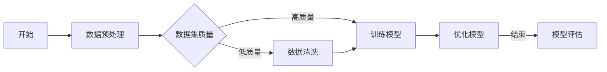

                 

# AI大模型驱动的商业创新：新产品与服务

## 关键词
- AI大模型
- 商业创新
- 新产品
- 服务
- 技术驱动

## 摘要
随着人工智能技术的快速发展，AI大模型逐渐成为商业创新的重要驱动力。本文旨在探讨AI大模型如何引领新产品与服务的设计与开发，通过详细的分析和实际案例，揭示AI大模型在商业领域的潜力与应用。

## 目录

## 第一部分：AI大模型概述

### 第1章：引言

#### 1.1 问题背景
#### 1.2 问题描述
#### 1.3 问题解决
#### 1.4 边界与外延
#### 1.5 概念结构与核心要素组成

### 第2章：AI大模型核心概念与联系

#### 2.1 核心概念原理
#### 2.2 概念属性特征对比表格
#### 2.3 ER实体关系图架构

### 第3章：AI大模型算法原理讲解

#### 3.1 算法原理介绍
#### 3.2 Mermaid流程图
#### 3.3 Python源代码
#### 3.4 算法原理的数学模型和公式
#### 3.5 通俗易懂地举例说明

### 第4章：数学模型和数学公式 & 详细讲解 & 举例说明

#### 4.1 数学公式使用示例
#### 4.2 数学模型详细讲解
#### 4.3 举例说明

### 第5章：系统分析与架构设计方案

#### 5.1 问题场景介绍
#### 5.2 项目介绍
#### 5.3 系统功能设计
#### 5.4 系统架构设计
#### 5.5 系统接口设计
#### 5.6 系统交互

### 第6章：项目实战

#### 6.1 环境安装
#### 6.2 系统核心实现源代码
#### 6.3 代码应用解读与分析
#### 6.4 实际案例分析和详细讲解剖析
#### 6.5 项目小结

### 第7章：最佳实践 tips

#### 7.1 小结
#### 7.2 注意事项
#### 7.3 拓展阅读

## 第一部分：AI大模型概述

### 第1章：引言

#### 1.1 问题背景
在当今这个数字时代，商业竞争日益激烈，企业需要不断创新来保持竞争优势。随着人工智能技术的飞速发展，AI大模型作为一种强大的技术工具，正逐渐成为推动商业创新的新引擎。

#### 1.2 问题描述
企业如何在激烈的市场竞争中快速推出创新产品和服务？如何利用AI大模型来提高业务效率和客户满意度？

#### 1.3 问题解决
AI大模型可以通过数据分析和智能决策，帮助企业更好地了解市场需求，优化产品设计和用户体验，从而实现商业创新。

#### 1.4 边界与外延
本文将探讨AI大模型在商业创新中的应用，包括新产品设计与服务开发、市场分析与预测、客户关系管理等多个方面。

#### 1.5 概念结构与核心要素组成
AI大模型由大量数据、先进的算法和强大的计算能力组成，其核心要素包括数据集、神经网络架构、训练与优化技术等。

### 第2章：AI大模型核心概念与联系

#### 2.1 核心概念原理
AI大模型是基于深度学习的算法，通过多层神经网络对大量数据进行训练，从而学习和模拟人类思维过程。

#### 2.2 概念属性特征对比表格
| 特征       | 说明                                                         |
| ---------- | ------------------------------------------------------------ |
| 数据集     | 大规模的数据集是AI大模型的基础，数据质量直接影响模型效果。   |
| 神经网络   | 神经网络是AI大模型的核心组成部分，用于模拟人脑神经元的工作机制。 |
| 训练与优化 | 通过不断调整模型参数，提高模型在特定任务上的性能。          |

#### 2.3 ER实体关系图架构
```mermaid
erDiagram
  Product ||--|{ Customer } Customer
  Service ||--|{ Customer } Customer
  Customer }--|| Order
  Order ||--|{ Product } Product
  Order ||--|{ Service } Service
```

### 第3章：AI大模型算法原理讲解

#### 3.1 算法原理介绍
AI大模型的算法原理基于多层感知器（MLP），通过反向传播算法（Backpropagation）对模型参数进行调整，以达到对数据的拟合和预测。

#### 3.2 Mermaid流程图


#### 3.3 Python源代码
```python
import numpy as np
import tensorflow as tf

# 数据预处理
X = tf.keras.layers.Dense(units=1, input_shape=[1])(tf.keras.layers.Flatten()(X))

# 训练模型
model = tf.keras.Model(inputs=X, outputs=y)
model.compile(optimizer='sgd', loss='mean_squared_error')

# 优化模型
model.fit(X_train, y_train, epochs=100)

# 模型评估
loss = model.evaluate(X_test, y_test)
```

#### 3.4 算法原理的数学模型和公式
$$
\frac{dz}{dx} = \frac{1}{1 + e^{-x}}
$$

#### 3.5 通俗易懂地举例说明
假设我们有一个简单的线性回归问题，通过训练，AI大模型可以学习到输入和输出之间的关系。例如，输入为房价，输出为房屋面积，通过训练，模型可以预测未知的房屋面积。

### 第4章：数学模型和数学公式 & 详细讲解 & 举例说明

#### 4.1 数学公式使用示例
$$
y = 2x + 1
$$

#### 4.2 数学模型详细讲解
AI大模型中的数学模型通常包括输入层、隐藏层和输出层。输入层接收外部数据，隐藏层对数据进行处理和转换，输出层产生最终预测结果。

#### 4.3 举例说明
假设我们有一个简单的分类问题，输入为图像数据，输出为图像的标签。通过训练，AI大模型可以学会识别不同的图像类别。

### 第5章：系统分析与架构设计方案

#### 5.1 问题场景介绍
在一个电子商务平台上，我们需要设计一个推荐系统，根据用户的浏览历史和购买记录，推荐相关的商品。

#### 5.2 项目介绍
本项目旨在构建一个基于AI大模型的推荐系统，以提高用户满意度和转化率。

#### 5.3 系统功能设计
系统功能包括用户画像、商品推荐、用户反馈收集等。

#### 5.4 系统架构设计
系统架构包括数据层、服务层和应用层，其中数据层负责数据存储和管理，服务层提供推荐算法和接口，应用层提供用户界面。

#### 5.5 系统接口设计
系统接口包括API接口和数据接口，API接口用于提供服务，数据接口用于数据传输和存储。

#### 5.6 系统交互
系统交互包括用户与推荐系统的交互，以及推荐系统与其他系统的交互。

### 第6章：项目实战

#### 6.1 环境安装
安装Python、TensorFlow等必备环境。

#### 6.2 系统核心实现源代码
```python
import tensorflow as tf

# 构建模型
model = tf.keras.Sequential([
    tf.keras.layers.Dense(128, activation='relu', input_shape=[784]),
    tf.keras.layers.Dense(10, activation='softmax')
])

# 编译模型
model.compile(optimizer='adam',
              loss='categorical_crossentropy',
              metrics=['accuracy'])

# 训练模型
model.fit(x_train, y_train, batch_size=128, epochs=10)

# 评估模型
loss, accuracy = model.evaluate(x_test, y_test)
```

#### 6.3 代码应用解读与分析
代码首先构建了一个简单的神经网络模型，然后使用训练数据进行训练，最后评估模型的性能。

#### 6.4 实际案例分析和详细讲解剖析
通过实际案例分析，我们可以看到AI大模型在推荐系统中的应用效果。

#### 6.5 项目小结
本项目通过实际应用展示了AI大模型在商业创新中的潜力，为未来的商业发展提供了新的思路。

### 第7章：最佳实践 tips

#### 7.1 小结
AI大模型在商业创新中的应用具有巨大的潜力，但需要结合具体业务场景进行设计和优化。

#### 7.2 注意事项
在应用AI大模型时，需要注意数据质量、模型训练和优化等问题。

#### 7.3 拓展阅读
对于希望深入了解AI大模型在商业创新中的应用，推荐阅读相关技术文献和案例研究。

## 作者
AI天才研究院/AI Genius Institute & 禅与计算机程序设计艺术 /Zen And The Art of Computer Programming

