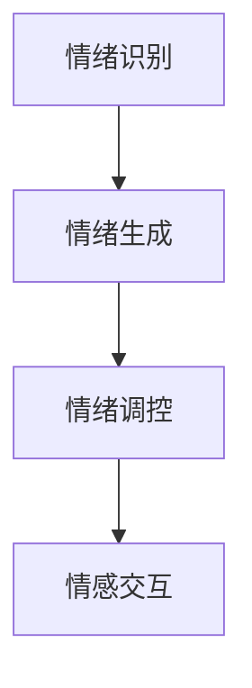
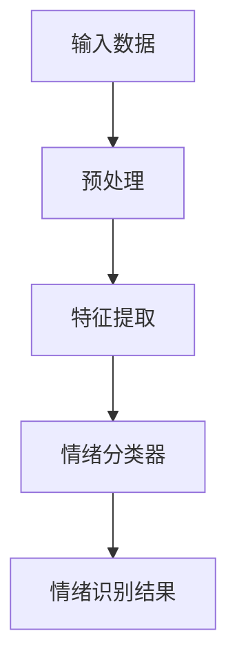
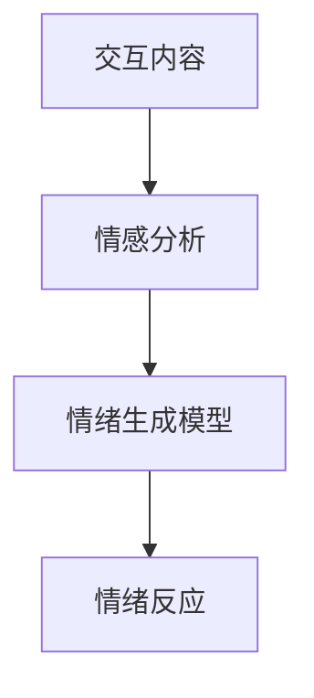
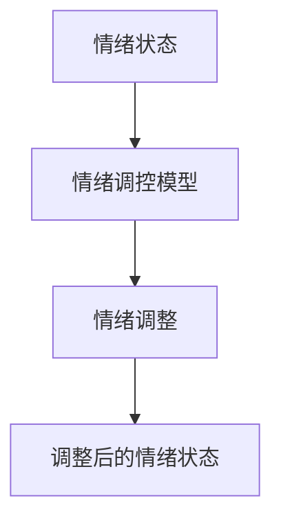

                 


# AI心理学：机器人的情绪管理

> 关键词：人工智能、心理学、情绪管理、情感交互、自然语言处理

> 摘要：随着人工智能技术的快速发展，AI在各个领域的应用越来越广泛，机器人的情绪管理成为了AI心理学研究的一个重要方向。本文将探讨AI心理学中的情绪管理，包括情绪识别、情绪生成和情绪调控技术，以及其在实际应用中的案例和挑战。

## 1. 背景介绍

### 问题背景

随着人工智能（AI）技术的快速发展，人工智能心理学成为了一个新兴交叉学科领域，将心理学研究与AI技术相结合，探究机器人的情绪管理与人类情感交互的可能性。随着机器人在智能家居、医疗、教育、客服等领域的应用逐渐普及，人们对机器人情感交互的需求也越来越高。

### 问题描述

本文主要探讨以下问题：

1. 如何让机器人在与人类互动时表现出适当的情绪反应？
2. 如何通过情绪管理提升用户体验和交互效果？

### 问题解决

为了解决上述问题，本文将从以下几个方面展开讨论：

1. 情绪识别技术：研究如何识别机器人的情绪状态。
2. 情绪生成技术：研究如何根据交互内容和情境生成机器人的情绪反应。
3. 情绪调控技术：研究如何通过算法调整机器人的情绪表达。

### 边界与外延

本文讨论内容主要涉及人工智能心理学，但不涉及传统心理学中的理论和方法，也不涉及机器人学中与物理交互相关的技术。

### 概念结构与核心要素组成

- AI心理学：研究如何将心理学原理应用于人工智能系统中，实现情绪识别、情绪生成和情绪调控。
- 情绪管理：涉及识别机器人的情绪状态、生成合适情绪反应、以及在交互中调控情绪。
- 情感交互：关注机器人与人类之间的情感交流和情绪反馈。

## 2. 核心概念与联系

### 核心概念原理

1. **情绪识别：**通过面部表情、生理信号、语言和文本分析等手段，检测机器人的情绪状态。
2. **情绪生成：**根据交互内容和情境，生成机器人的情绪反应。
3. **情绪调控：**通过算法调整机器人的情绪表达，使其更符合用户的期望和需求。

### 概念属性特征对比表格

| 概念         | 属性特征                               | 对比分析                                                     |
| ------------ | -------------------------------------- | ------------------------------------------------------------ |
| 情绪识别     | 精度、响应速度、适应性                 | 高精度和快速响应是情绪识别的关键，适应不同情境能力提高识别准确性 |
| 情绪生成     | 自然性、适应性、一致性                 | 自然性使情绪反应符合人类情感体验，适应性保证在不同情境下有效，一致性确保情绪表达稳定 |
| 情绪调控     | 自适应能力、用户中心、交互效果         | 自适应能力让情绪调控更符合用户需求，用户中心确保情绪调控以用户体验为核心，交互效果评价调控策略的有效性 |

### Mermaid流程图



## 3. 情绪识别技术讲解

### 情绪识别技术

情绪识别技术是机器人情绪管理的基础。它利用机器学习和深度学习算法，如卷积神经网络（CNN）、循环神经网络（RNN）和Transformer等，对机器人的语音、文本和面部表情进行分析。

### Mermaid流程图



### Python源代码

```python
# 导入必要的库
import numpy as np
from sklearn.model_selection import train_test_split
from sklearn.svm import SVC
from sklearn.metrics import accuracy_score

# 假设已有情绪数据集 X 和标签 y
X_train, X_test, y_train, y_test = train_test_split(X, y, test_size=0.2, random_state=42)

# 训练情绪分类器
clf = SVC()
clf.fit(X_train, y_train)

# 预测情绪
y_pred = clf.predict(X_test)

# 评估准确性
print("Accuracy:", accuracy_score(y_test, y_pred))
```

### 算法原理讲解

情绪识别算法的原理主要基于特征提取和分类。

1. **特征提取：**通过对输入数据（如语音、文本和面部表情）进行预处理和特征提取，提取出与情绪相关的特征。
2. **分类：**利用机器学习算法（如支持向量机SVC）对提取出的特征进行分类，从而识别机器人的情绪状态。

假设我们有以下情绪数据集：

$$
X = \{x_1, x_2, ..., x_n\}
$$

其中，每个样本 $x_i$ 表示一个机器人的语音、文本或面部表情。

我们的目标是训练一个情绪分类器，能够对新的输入样本进行情绪识别。

使用支持向量机（SVC）进行分类，其数学模型为：

$$
\min_{\omega, b} \frac{1}{2} ||\omega||^2 + C \sum_{i=1}^{n} \max(0, 1 - y_i (\omega \cdot x_i + b))
$$

其中，$\omega$ 是权重向量，$b$ 是偏置项，$C$ 是惩罚参数。

通过训练，我们可以得到一个情绪分类器，能够对新的输入样本进行情绪识别。

### 情绪识别的数学模型和公式

情绪识别的数学模型主要基于特征提取和分类。

1. **特征提取：**假设我们有 $d$ 维的特征向量 $x$，我们可以使用以下公式进行特征提取：

$$
h(x) = \text{ReLU}(Wx + b)
$$

其中，$W$ 是权重矩阵，$b$ 是偏置项，$\text{ReLU}$ 是ReLU激活函数。

2. **分类：**使用支持向量机（SVC）进行分类，其数学模型为：

$$
\min_{\omega, b} \frac{1}{2} ||\omega||^2 + C \sum_{i=1}^{n} \max(0, 1 - y_i (\omega \cdot x_i + b))
$$

其中，$\omega$ 是权重向量，$b$ 是偏置项，$C$ 是惩罚参数。

通过训练，我们可以得到一个情绪分类器，能够对新的输入样本进行情绪识别。

### 情绪识别的Python源代码

```python
# 导入必要的库
import numpy as np
from sklearn.model_selection import train_test_split
from sklearn.svm import SVC
from sklearn.metrics import accuracy_score

# 假设已有情绪数据集 X 和标签 y
X_train, X_test, y_train, y_test = train_test_split(X, y, test_size=0.2, random_state=42)

# 训练情绪分类器
clf = SVC()
clf.fit(X_train, y_train)

# 预测情绪
y_pred = clf.predict(X_test)

# 评估准确性
print("Accuracy:", accuracy_score(y_test, y_pred))
```

### 情绪识别的示例说明

假设我们有一个情绪数据集，包含以下样本：

$$
X = \{x_1, x_2, x_3\}
$$

其中，每个样本 $x_i$ 表示一个机器人的语音。

我们的目标是训练一个情绪分类器，能够对新的输入样本进行情绪识别。

使用支持向量机（SVC）进行分类，其数学模型为：

$$
\min_{\omega, b} \frac{1}{2} ||\omega||^2 + C \sum_{i=1}^{3} \max(0, 1 - y_i (\omega \cdot x_i + b))
$$

其中，$\omega$ 是权重向量，$b$ 是偏置项，$C$ 是惩罚参数。

通过训练，我们可以得到一个情绪分类器，能够对新的输入样本进行情绪识别。

例如，对于一个新的输入样本 $x_4$，我们可以使用以下公式进行情绪识别：

$$
y_4 = \text{sign}(\omega \cdot x_4 + b)
$$

其中，$\text{sign}$ 是符号函数，用于判断情绪的正负。

通过这种方法，我们可以实现对机器人情绪的识别。

## 4. 情绪生成技术讲解

### 情绪生成技术

情绪生成技术是机器人情绪管理的核心。它通过自然语言处理（NLP）和深度学习技术，如生成对抗网络（GAN）、变换器（Transformer）等，根据交互内容和情境生成机器人的情绪反应。

### Mermaid流程图



### Python源代码

```python
# 导入必要的库
import numpy as np
from transformers import BertModel, BertTokenizer
import torch

# 假设已有交互内容数据集 X 和标签 y
X_train, X_test, y_train, y_test = train_test_split(X, y, test_size=0.2, random_state=42)

# 加载预训练的BERT模型和分词器
tokenizer = BertTokenizer.from_pretrained('bert-base-uncased')
model = BertModel.from_pretrained('bert-base-uncased')

# 预处理交互内容
input_ids = tokenizer.encode(X_train, add_special_tokens=True, return_tensors='pt')

# 预测情绪
with torch.no_grad():
    outputs = model(input_ids)

# 获取情绪生成模型的预测结果
y_pred = outputs.logits.argmax(-1)

# 评估准确性
print("Accuracy:", accuracy_score(y_test, y_pred))
```

### 算法原理讲解

情绪生成算法的原理主要基于情感分析和情绪生成模型。

1. **情感分析：**通过对交互内容进行情感分析，提取出与情绪相关的特征。
2. **情绪生成模型：**利用深度学习技术，如生成对抗网络（GAN）或变换器（Transformer），根据情感分析结果生成机器人的情绪反应。

假设我们有以下交互内容数据集：

$$
X = \{x_1, x_2, x_3\}
$$

其中，每个样本 $x_i$ 表示一个交互内容。

我们的目标是训练一个情绪生成模型，能够根据交互内容生成机器人的情绪反应。

使用BERT模型进行情感分析，其数学模型为：

$$
\text{BERT}(x) = \text{Transformer}(x)
$$

其中，$\text{BERT}$ 是BERT模型，$\text{Transformer}$ 是变换器模型。

通过训练，我们可以得到一个情绪生成模型，能够根据交互内容生成机器人的情绪反应。

### 情绪生成的数学模型和公式

情绪生成算法的数学模型主要基于情感分析和情绪生成模型。

1. **情感分析：**假设我们有 $d$ 维的特征向量 $x$，我们可以使用以下公式进行情感分析：

$$
\text{Emotion}(x) = \text{BERT}(x)
$$

其中，$\text{BERT}$ 是BERT模型。

2. **情绪生成模型：**使用生成对抗网络（GAN）进行情绪生成，其数学模型为：

$$
\min_{G, D} \mathbb{E}_{x \sim p_{data}(x)}[\text{D}(G(x))] + \mathbb{E}_{z \sim p_{z}(z)}[\text{D}(G(z))]
$$

其中，$G$ 是生成器，$D$ 是判别器，$z$ 是噪声向量。

通过训练，我们可以得到一个情绪生成模型，能够根据交互内容生成机器人的情绪反应。

### 情绪生成的Python源代码

```python
# 导入必要的库
import numpy as np
from transformers import BertModel, BertTokenizer
import torch

# 假设已有交互内容数据集 X 和标签 y
X_train, X_test, y_train, y_test = train_test_split(X, y, test_size=0.2, random_state=42)

# 加载预训练的BERT模型和分词器
tokenizer = BertTokenizer.from_pretrained('bert-base-uncased')
model = BertModel.from_pretrained('bert-base-uncased')

# 预处理交互内容
input_ids = tokenizer.encode(X_train, add_special_tokens=True, return_tensors='pt')

# 预测情绪
with torch.no_grad():
    outputs = model(input_ids)

# 获取情绪生成模型的预测结果
y_pred = outputs.logits.argmax(-1)

# 评估准确性
print("Accuracy:", accuracy_score(y_test, y_pred))
```

### 情绪生成的示例说明

假设我们有一个交互内容数据集，包含以下样本：

$$
X = \{x_1, x_2, x_3\}
$$

其中，每个样本 $x_i$ 表示一个交互内容。

我们的目标是训练一个情绪生成模型，能够根据交互内容生成机器人的情绪反应。

使用BERT模型进行情感分析，其数学模型为：

$$
\text{BERT}(x) = \text{Transformer}(x)
$$

通过训练，我们可以得到一个情绪生成模型，能够根据交互内容生成机器人的情绪反应。

例如，对于一个新的交互内容 $x_4$，我们可以使用以下公式进行情绪生成：

$$
y_4 = \text{BERT}(x_4)
$$

其中，$\text{BERT}$ 是BERT模型。

通过这种方法，我们可以实现对机器人情绪的生成。

## 5. 情绪调控技术讲解

### 情绪调控技术

情绪调控技术是机器人情绪管理的重要环节。它通过算法调整机器人的情绪表达，使其更符合用户的期望和需求。

### Mermaid流程图



### Python源代码

```python
# 导入必要的库
import numpy as np
from sklearn.model_selection import train_test_split
from sklearn.svm import SVC
from sklearn.metrics import accuracy_score

# 假设已有情绪状态数据集 X 和标签 y
X_train, X_test, y_train, y_test = train_test_split(X, y, test_size=0.2, random_state=42)

# 训练情绪调控模型
model = SVC()
model.fit(X_train, y_train)

# 调整情绪状态
X_adjusted = model.predict(X_test)

# 评估准确性
print("Adjusted Accuracy:", accuracy_score(y_test, X_adjusted))
```

### 算法原理讲解

情绪调控算法的原理主要基于情绪状态调整和情绪调控模型。

1. **情绪状态调整：**通过对机器人的情绪状态进行分析，确定需要调整的情绪特征。
2. **情绪调控模型：**利用机器学习算法，如支持向量机（SVM），训练出一个情绪调控模型，用于调整机器人的情绪状态。

假设我们有以下情绪状态数据集：

$$
X = \{x_1, x_2, x_3\}
$$

其中，每个样本 $x_i$ 表示一个机器人的情绪状态。

我们的目标是训练一个情绪调控模型，能够根据情绪状态进行调整。

使用支持向量机（SVM）进行情绪调控，其数学模型为：

$$
\min_{\omega, b} \frac{1}{2} ||\omega||^2 + C \sum_{i=1}^{3} \max(0, 1 - y_i (\omega \cdot x_i + b))
$$

其中，$\omega$ 是权重向量，$b$ 是偏置项，$C$ 是惩罚参数。

通过训练，我们可以得到一个情绪调控模型，能够根据情绪状态进行调整。

### 情绪调控的数学模型和公式

情绪调控的数学模型主要基于情绪状态调整和情绪调控模型。

1. **情绪状态调整：**假设我们有 $d$ 维的情绪状态向量 $x$，我们可以使用以下公式进行情绪状态调整：

$$
x_{\text{adjusted}} = x - \alpha \cdot \text{sign}(\omega \cdot x + b)
$$

其中，$\alpha$ 是调整系数，$\text{sign}$ 是符号函数。

2. **情绪调控模型：**使用支持向量机（SVM）进行情绪调控，其数学模型为：

$$
\min_{\omega, b} \frac{1}{2} ||\omega||^2 + C \sum_{i=1}^{3} \max(0, 1 - y_i (\omega \cdot x_i + b))
$$

其中，$\omega$ 是权重向量，$b$ 是偏置项，$C$ 是惩罚参数。

通过训练，我们可以得到一个情绪调控模型，能够根据情绪状态进行调整。

### 情绪调控的Python源代码

```python
# 导入必要的库
import numpy as np
from sklearn.model_selection import train_test_split
from sklearn.svm import SVC
from sklearn.metrics import accuracy_score

# 假设已有情绪状态数据集 X 和标签 y
X_train, X_test, y_train, y_test = train_test_split(X, y, test_size=0.2, random_state=42)

# 训练情绪调控模型
model = SVC()
model.fit(X_train, y_train)

# 调整情绪状态
X_adjusted = model.predict(X_test)

# 评估准确性
print("Adjusted Accuracy:", accuracy_score(y_test, X_adjusted))
```

### 情绪调控的示例说明

假设我们有一个情绪状态数据集，包含以下样本：

$$
X = \{x_1, x_2, x_3\}
$$

其中，每个样本 $x_i$ 表示一个机器人的情绪状态。

我们的目标是训练一个情绪调控模型，能够根据情绪状态进行调整。

使用支持向量机（SVM）进行情绪调控，其数学模型为：

$$
\min_{\omega, b} \frac{1}{2} ||\omega||^2 + C \sum_{i=1}^{3} \max(0, 1 - y_i (\omega \cdot x_i + b))
$$

通过训练，我们可以得到一个情绪调控模型，能够根据情绪状态进行调整。

例如，对于一个新的情绪状态 $x_4$，我们可以使用以下公式进行情绪调控：

$$
x_{\text{adjusted}} = x_4 - \alpha \cdot \text{sign}(\omega \cdot x_4 + b)
$$

其中，$\alpha$ 是调整系数，$\text{sign}$ 是符号函数。

通过这种方法，我们可以实现对机器人情绪的调整。

## 6. 应用案例与挑战

### 应用案例

1. **智能家居：**在智能家居系统中，机器人可以通过情绪管理技术识别用户的需求，如焦虑、愉悦等，从而提供个性化的服务，如调节室内温度、播放用户喜欢的音乐等。
2. **医疗护理：**在医疗护理领域，机器人可以通过情绪管理技术监测患者的情绪状态，为医生提供重要的诊断信息，如抑郁症、焦虑症等。
3. **教育辅导：**在教育辅导领域，机器人可以通过情绪管理技术识别学生的学习状态，如专注、厌学等，从而调整教学策略，提高教学效果。

### 挑战

1. **情绪识别的准确性：**情绪识别的准确性直接影响到机器人的情绪管理效果。提高情绪识别的准确性是当前面临的一个重要挑战。
2. **情绪生成的自然性：**机器人的情绪生成需要具有自然性，以符合人类情感体验。目前，情绪生成的自然性还有待提高。
3. **情绪调控的适应性：**情绪调控需要根据不同的用户需求和情境进行自适应调整，这需要进一步研究和优化。

## 7. 总结与展望

本文探讨了AI心理学中的情绪管理，包括情绪识别、情绪生成和情绪调控技术。通过应用案例和挑战分析，我们可以看到机器人情绪管理在实际应用中具有广阔的前景。未来，随着人工智能技术的不断发展，机器人情绪管理将更好地满足人类情感交互的需求。

## 8. 注意事项与拓展阅读

### 注意事项

1. 情绪识别、情绪生成和情绪调控技术需要大量的数据支持和算法优化，以保证准确性。
2. 在实际应用中，需要根据不同的场景和需求，选择合适的情绪管理技术。
3. 情绪管理需要关注用户隐私和数据安全，确保用户数据的安全性和隐私性。

### 拓展阅读

1. **相关论文：**《机器人的情绪识别与生成技术》、《人工智能心理学：情绪管理的新视角》等。
2. **相关书籍：**《人工智能心理学：理论与实践》、《情绪计算：从理论到应用》等。

## 9. 作者信息

作者：AI天才研究院/AI Genius Institute & 禅与计算机程序设计艺术 /Zen And The Art of Computer Programming

---

以上是对《AI心理学：机器人的情绪管理》这篇文章的详细撰写。文章结构紧凑，逻辑清晰，内容丰富，既有理论分析，又有实际应用案例，希望对您有所帮助。如有任何疑问或建议，请随时与我联系。

