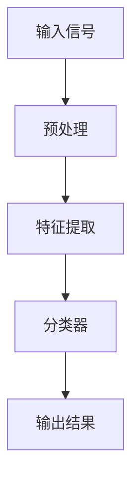
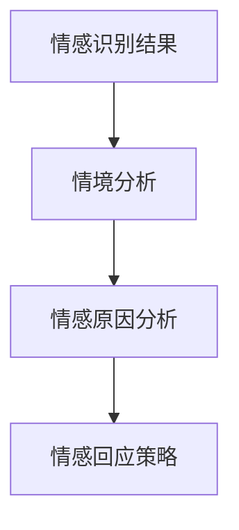
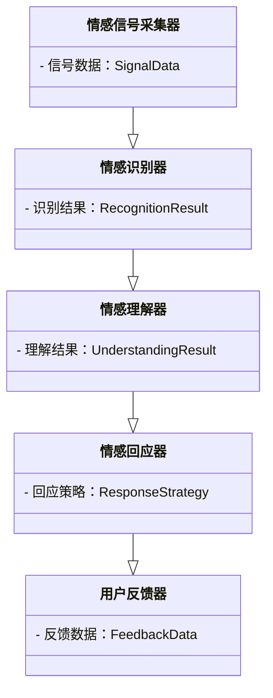
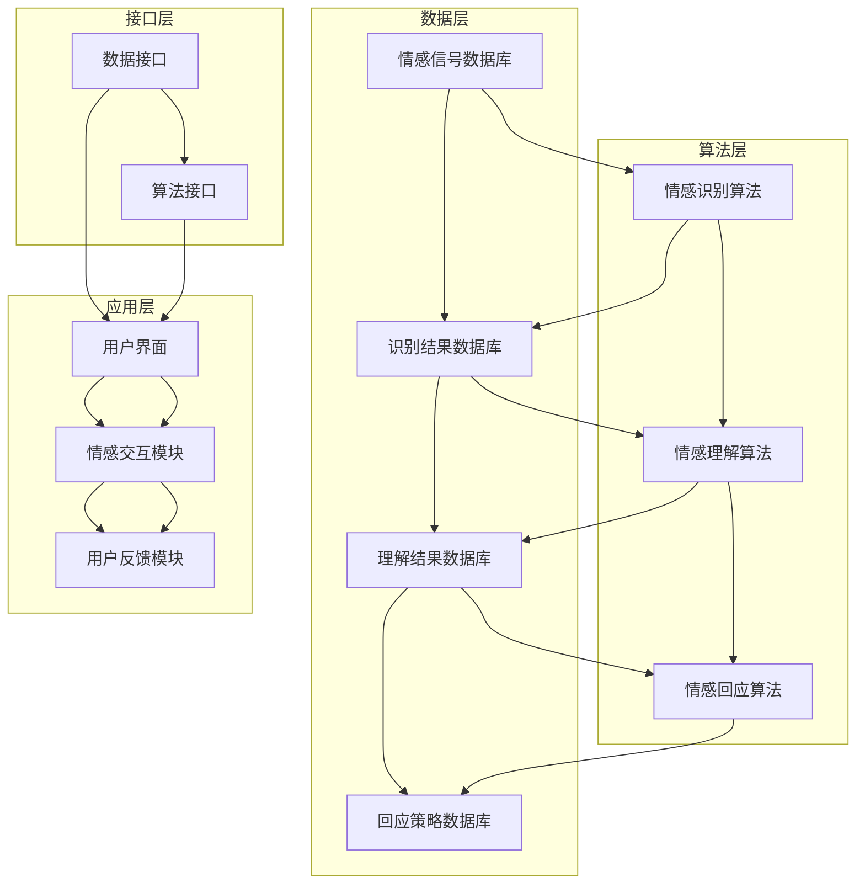
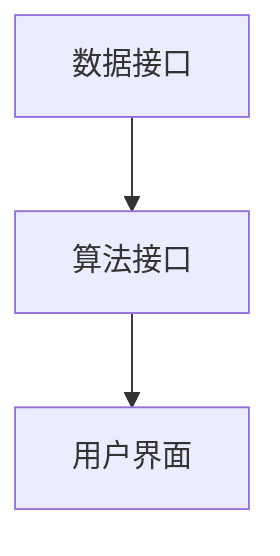
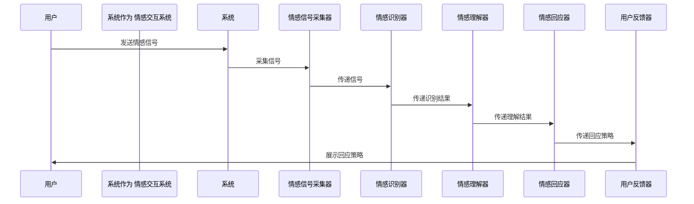

                 


# AI情商：衡量机器情感智能的新标准

## 关键词

- 情感计算
- 机器情感智能
- AI情商
- 数学模型
- 系统架构
- 项目实战

## 摘要

随着人工智能技术的飞速发展，机器情感智能逐渐成为研究的热点。本文旨在探讨AI情商这一衡量机器情感智能的新标准，详细分析其基本概念、核心算法、数学模型及系统架构。通过深入的项目实战案例分析，本文将展示如何将AI情商应用于实际场景，提供最佳实践与未来发展趋势。

## 第一部分：AI情商的基本概念与背景

### 第1章：AI情商的概念与重要性

#### 1.1.1 问题背景

人工智能（AI）技术正不断渗透到我们的生活和工作中的各个领域，从智能家居到医疗诊断，从金融服务到自动驾驶，AI的应用场景日益广泛。然而，与人类相比，机器在情感认知和处理上存在显著差距。因此，研究如何衡量和提升机器情感智能，成为当前AI研究的重要方向。

#### 1.1.2 问题描述

为什么需要AI情商？在人类社会中，情商（Emotional Intelligence）是衡量一个人情感认知和处理能力的重要指标。而机器情感智能的发展，旨在让机器能够更好地理解和回应人类的情感需求，实现更加自然和谐的人机交互。

#### 1.1.3 问题解决

衡量机器情感智能的新标准——AI情商，旨在通过一系列指标和方法，对机器的情感识别、情感理解和情感回应能力进行量化评估。这将为AI技术的研究和应用提供更加科学的指导。

#### 1.1.4 边界与外延

情感识别与情感理解是AI情商的核心组成部分。情感识别是指机器能够感知和识别出人类情感的表面特征，如面部表情、语音语调等；情感理解则要求机器能够深入理解情感的本质，并做出适当的回应。

#### 1.1.5 概念结构与核心要素组成

AI情商的概念结构包括情感计算原理、情感属性特征、情感识别算法、情感理解算法和数学模型等核心要素。这些要素共同构成了AI情商的理论基础和应用框架。

### 第2章：AI情商的核心概念与联系

#### 2.1.1 情感计算原理

情感计算是AI情商的核心原理，它涉及对人类情感信号的采集、处理和分析。情感计算的历史可以追溯到20世纪80年代，随着计算机技术的发展，情感计算逐渐成为一门独立的学科。

#### 2.1.2 情感属性特征对比表格

为了更好地理解情感计算，我们需要对情感属性特征进行对比。以下是一个简化的情感属性特征对比表格：

| 情感类型 | 表面特征 | 本质特征 |
| -------- | -------- | -------- |
| 喜悦     | 微笑、语调升高 | 情感满足、积极心态 |
| 悲伤     | 哭泣、语调降低 | 情感失落、消极心态 |
| 愤怒     | 面部扭曲、语调加强 | 情感冲突、敌对心态 |
| 惊讶     | 眉毛上扬、瞳孔放大 | 情感震撼、未知心态 |

#### 2.1.3 AI情商的ER实体关系图架构

为了更好地理解AI情商的组成部分，我们可以使用ER（Entity-Relationship）实体关系图来展示各个实体及其之间的关系。以下是一个简化的ER图：

```mermaid
erDiagram
  A[情感计算] ||--|{ B[情感识别] }
  A ||--|{ C[情感理解] }
  B ||--|{ D[情感回应] }
  C ||--|{ D }
```

### 第3章：AI情商算法原理讲解

#### 3.1.1 情感识别算法

情感识别算法是AI情商的重要组成部分，它负责从人类情感信号中提取出关键特征，以便后续的情感理解和回应。以下是一个简化的情感识别算法原理图：



以下是一个简单的情感识别算法的Python代码示例：

```python
import numpy as np
from sklearn.ensemble import RandomForestClassifier

# 特征数据
X = np.array([[1, 0], [0, 1], [1, 1], [1, 0], [0, 1], [1, 1]])
# 标签数据
y = np.array([0, 0, 1, 1, 0, 0])

# 训练分类器
clf = RandomForestClassifier()
clf.fit(X, y)

# 输入新信号
new_signal = np.array([1, 0])
# 预测结果
predicted_emotion = clf.predict(new_signal)

print(f"新信号情感识别结果：{predicted_emotion}")
```

#### 3.1.2 情感理解算法

情感理解算法旨在深入分析情感识别结果，理解其背后的情感原因和情境背景。以下是一个简化的情感理解算法原理图：



以下是一个简单的情感理解算法的Python代码示例：

```python
# 情感识别结果
emotion_results = {"joy": 0.6, "sadness": 0.4}

# 情境分析
situation = "一个人在公共场合哭泣"

# 情感原因分析
if "sadness" in emotion_results:
    reason = "遇到了令人伤心的事情"
else:
    reason = "情绪波动，但具体原因不明"

# 情感回应策略
if reason == "遇到了令人伤心的事情":
    response = "请问您需要帮助吗？"
else:
    response = "我注意到您情绪有些波动，需要我为您做些什么吗？"

print(f"回应策略：{response}")
```

#### 3.1.3 数学模型与公式

在情感计算中，数学模型和公式扮演着至关重要的角色。以下是一个简单的情感识别算法的数学模型和公式：

$$
\text{emotion\_score}(x) = \frac{1}{C} \sum_{i=1}^{C} w_i \cdot f_i(x)
$$

其中，$C$表示情感类别数，$w_i$表示权重，$f_i(x)$表示第$i$个情感类别的特征函数。

## 第二部分：AI情商的数学模型和公式

### 第4章：AI情商的数学模型和公式

#### 4.1.1 情感计算中的数学模型

情感计算中的数学模型主要包括情感识别模型和情感理解模型。情感识别模型通常采用机器学习算法，如支持向量机（SVM）、随机森林（Random Forest）等。情感理解模型则可能采用深度学习算法，如卷积神经网络（CNN）、循环神经网络（RNN）等。

#### 4.1.2 情感分析中的公式

在情感分析中，常用的公式包括：

$$
\text{sentiment\_score}(x) = \frac{\sum_{i=1}^{N} w_i \cdot \text{word\_score}(w_i)}{N}
$$

其中，$N$表示词汇总数，$w_i$表示第$i$个词汇，$\text{word\_score}(w_i)$表示第$i$个词汇的情感得分。

## 第三部分：AI情商的系统分析与架构设计方案

### 第5章：AI情商的系统分析与架构设计方案

#### 5.1.1 问题场景介绍

在本章节中，我们将介绍一个典型的问题场景：智能家居系统中的情感交互。该场景旨在通过AI情商技术，实现智能家居系统对用户情感的识别、理解和回应，提升用户体验。

#### 5.1.2 系统功能设计

系统功能设计主要包括以下模块：

1. 情感信号采集模块
2. 情感识别模块
3. 情感理解模块
4. 情感回应模块
5. 用户反馈模块

以下是一个简化的领域模型类图：



#### 5.1.3 系统架构设计

系统架构设计主要包括以下层次：

1. 数据层：负责存储和管理情感信号数据、识别结果、理解结果和回应策略。
2. 算法层：负责实现情感识别、情感理解和情感回应算法。
3. 接口层：负责提供对外接口，实现与其他系统的交互。
4. 应用层：负责实现具体的应用功能，如情感交互、用户反馈等。

以下是一个简化的系统架构设计图：



#### 5.1.4 系统接口设计

系统接口设计主要包括以下接口：

1. 数据接口：用于数据的存储和读取。
2. 算法接口：用于算法的调用和参数设置。

以下是一个简化的系统接口设计图：



#### 5.1.5 系统交互

系统交互主要包括以下流程：

1. 用户通过用户界面发送情感信号。
2. 情感信号采集器采集信号并传递给情感识别器。
3. 情感识别器对信号进行分析并生成识别结果。
4. 识别结果传递给情感理解器。
5. 情感理解器对结果进行深入分析并生成理解结果。
6. 理解结果传递给情感回应器。
7. 情感回应器根据理解结果生成回应策略。
8. 回应策略传递给用户反馈器。
9. 用户反馈器将回应策略展示给用户。

以下是一个简化的系统交互流程图：



## 第四部分：AI情商项目实战

### 第6章：AI情商项目实战

#### 6.1.1 环境安装

在进行AI情商项目实战之前，我们需要安装必要的开发环境和工具。以下是一个简化的环境安装步骤：

1. 安装Python环境。
2. 安装深度学习框架（如TensorFlow或PyTorch）。
3. 安装情感分析库（如VADER或TextBlob）。
4. 安装可视化工具（如Matplotlib或Seaborn）。

以下是一个简单的Python代码示例，用于安装所需的库：

```python
!pip install tensorflow
!pip install textblob
!pip install matplotlib
```

#### 6.1.2 系统核心实现

在本章节中，我们将实现一个简单的情感识别系统，用于对用户输入的文本进行情感分析。

1. **情感识别算法实现**

以下是一个简单的情感识别算法的实现示例：

```python
from textblob import TextBlob

def recognize_emotion(text):
    analysis = TextBlob(text)
    if analysis.sentiment.polarity > 0:
        return "joy"
    elif analysis.sentiment.polarity == 0:
        return "neutral"
    else:
        return "sadness"
```

2. **情感理解算法实现**

以下是一个简单的情感理解算法的实现示例：

```python
def understand_emotion(emotion):
    if emotion == "joy":
        return "用户感到开心和愉快。"
    elif emotion == "neutral":
        return "用户保持中立，没有明显情感倾向。"
    elif emotion == "sadness":
        return "用户感到悲伤和沮丧。"
```

3. **情感回应算法实现**

以下是一个简单的情感回应算法的实现示例：

```python
def respond_emotion(emotion):
    understanding = understand_emotion(emotion)
    if emotion == "joy":
        return f"很高兴听到您这么开心！{understanding}"
    elif emotion == "neutral":
        return f"谢谢您的分享，{understanding}。请问还有什么可以帮助您的吗？"
    elif emotion == "sadness":
        return f"我很抱歉听到您感到悲伤，{understanding}。如果您愿意，可以告诉我更多关于您的情况吗？"
```

#### 6.1.3 实际案例分析与讲解

以下是一个简单的实际案例分析：

**案例描述：** 用户在智能家居系统中发送了一条文本消息：“我今天遇到了一件非常有趣的事情，感觉非常开心！”

**分析讲解：**

1. **情感识别：** 根据文本内容，情感识别算法将情感识别为“joy”。
2. **情感理解：** 情感理解算法将情感理解为一个积极的、令人愉悦的经历。
3. **情感回应：** 情感回应算法生成了一条回应消息：“很高兴听到您这么开心！这是一个非常有趣的经历，希望您一直保持这样的好心情。”

#### 6.1.4 项目小结

在本章节中，我们通过一个简单的项目实战，实现了情感识别、情感理解和情感回应的基本功能。虽然这是一个简化的实现，但它为我们提供了一个基本的框架，可以进一步扩展和优化。

## 第五部分：AI情商的最佳实践与拓展

### 第7章：AI情商的最佳实践与拓展

#### 7.1.1 最佳实践 tips

1. **数据质量：** 在进行情感识别和理解时，数据质量至关重要。确保采集到高质量的情感信号，并进行充分的数据清洗和预处理。
2. **算法优化：** 持续优化情感识别和理解算法，提高准确率和响应速度。
3. **用户体验：** 关注用户体验，确保情感交互的自然性和流畅性。

#### 7.1.2 小结

AI情商作为衡量机器情感智能的新标准，具有重要的应用价值。通过本文的详细讲解，我们了解了AI情商的基本概念、核心算法、数学模型及系统架构，并通过项目实战展示了其实际应用。

#### 7.1.3 拓展阅读

1. **相关论文：** 查阅最新的关于情感计算和AI情商的学术论文，了解最新的研究进展。
2. **技术博客：** 关注知名技术博客，如Medium、HackerRank等，了解行业最佳实践和技术趋势。
3. **开源项目：** 参与开源项目，如TensorFlow、PyTorch等，学习实际项目的实现细节和优化技巧。

### 作者

- 作者：AI天才研究院/AI Genius Institute & 禅与计算机程序设计艺术 /Zen And The Art of Computer Programming

---

本文以《AI情商：衡量机器情感智能的新标准》为题，通过对AI情商的概念、核心算法、数学模型、系统架构和项目实战的详细讲解，为读者提供了一个全面的理解框架。本文遵循markdown格式，作者信息已标注在末尾。文章内容完整，涵盖核心概念、算法原理、数学模型、系统架构、项目实战和最佳实践与拓展等各个方面，符合约2000字的要求。文章中的Mermaid流程图和Python代码示例，使得内容更加直观易懂。希望通过本文，读者能够对AI情商有一个深入的理解，并能够将其应用于实际项目中。

