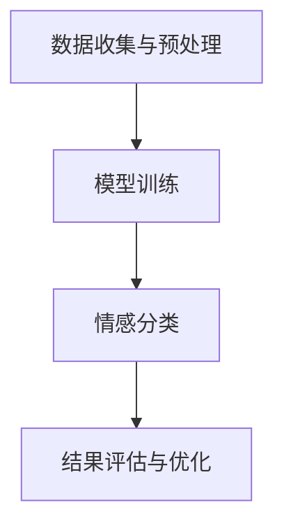

                 

# AI情感与人类情感的界限与融合

## 关键词

- AI情感
- 人类情感
- 情感识别
- 情感交互
- 人工智能
- 情感融合

## 摘要

本文探讨了人工智能（AI）与人类情感之间的界限及其融合的可能性。首先，我们概述了AI情感与人类情感的基本概念及其关系，然后深入分析了情感识别技术的原理与实现，展示了AI在虚拟助手中的应用。接着，我们探讨了人类情感与AI情感的界限及其影响，最后探讨了两者融合的前景与挑战。本文旨在为读者提供一个全面且深入理解AI情感与人类情感界限与融合的视角。

## 引言与背景

### 问题背景

在当今社会，人工智能（AI）技术发展迅猛，逐渐渗透到我们的日常生活和工作之中。AI不仅能够处理复杂的计算任务，还具备一定的情感识别和生成能力。然而，AI情感与人类情感之间的关系仍是一个复杂而富有争议的话题。一方面，人类情感对个体的生活和工作具有重要影响，另一方面，AI情感在提升用户体验和效率方面具有巨大的潜力。

### 核心概念

- **AI情感**：指人工智能系统在处理人类情感相关的信息时表现出的情感反应能力，包括情感识别、情感生成和情感融合。
- **人类情感**：指人类在生理、心理和社会互动过程中产生的情感体验，包括喜怒哀乐等基本情感以及复杂的情感状态。

### 研究意义

本研究旨在探讨AI情感与人类情感的界限与融合，具有重要的理论和实际意义：

- **理论意义**：有助于深化对情感本质的理解，探索情感计算的新方向。
- **实际意义**：为AI在情感计算领域的应用提供理论基础和实践指导，提升AI系统的用户体验和交互能力。

### 研究方法

本研究采用文献分析、实验研究和案例研究相结合的方法，对AI情感与人类情感的关系进行深入探讨。

### 目录结构

本文分为四个主要部分：

1. **引言与背景**：介绍研究背景、核心概念和研究意义。
2. **AI情感技术基础**：分析情感识别技术的原理和实现。
3. **AI情感在交互中的应用**：探讨AI情感在虚拟助手中的应用。
4. **人类情感与AI情感的界限**：分析人类情感与AI情感的界限及其融合的可能性。

## AI情感技术基础

### 情感识别技术概述

#### 定义与分类

**情感识别**是指通过分析人类情感表达的特征，识别和理解人类情感的过程。情感识别技术可以按照不同的分类标准进行分类，如：

- **按输入类型**：语音识别、面部表情识别、文本情感分析等。
- **按情感维度**：单一情感识别（如快乐、愤怒）和多维度情感识别。

#### 关键技术

- **特征提取**：从输入数据中提取情感相关的特征。
- **情感分类**：将提取的特征与已知的情感类别进行匹配。
- **情感强度评估**：对情感表达的强度进行量化评估。

#### 应用场景

- **用户行为分析**：了解用户偏好，提升用户体验。
- **心理健康监测**：通过情感识别技术监测个体的情感状态，提供心理健康服务。
- **智能客服**：通过情感识别和生成技术提升客服服务质量。

### 情感识别算法原理

**情感识别算法**通常基于机器学习和深度学习技术。以下是一个基本的情感识别算法流程：

1. **数据收集与预处理**：收集情感数据，并进行预处理，如数据清洗、特征提取等。
2. **模型训练**：使用预处理的情感数据训练分类模型。
3. **情感分类**：将新的情感数据输入训练好的模型，进行情感分类。
4. **结果评估与优化**：评估模型的性能，并进行优化。

#### 算法流程与Mermaid流程图



#### 算法案例分析

以文本情感分析为例，一个简单的情感识别算法流程如下：

1. **数据收集与预处理**：收集包含情感标注的文本数据，如电影评论、社交媒体帖子等。
2. **特征提取**：使用词袋模型、词嵌入等方法提取文本特征。
3. **模型训练**：使用分类算法（如SVM、朴素贝叶斯等）训练情感分类模型。
4. **情感分类**：输入新的文本数据，进行情感分类。
5. **结果评估与优化**：评估模型性能，并通过调参等方式进行优化。

### 情感识别的数学模型与公式

情感识别的数学模型通常基于概率模型、神经网络等。以下是一个基于朴素贝叶斯模型的情感识别公式：

$$
P(\text{情感类别} | \text{特征}) = \frac{P(\text{特征} | \text{情感类别})P(\text{情感类别})}{P(\text{特征})}
$$

其中，$P(\text{情感类别} | \text{特征})$表示在给定特征的情况下，情感类别的概率。

### 系统分析与设计

#### 系统功能需求分析

- **情感识别**：能够识别用户输入的情感状态。
- **情感生成**：能够根据用户情感状态生成相应的情感回应。
- **情感融合**：能够将用户情感与系统情感进行融合，提供更自然的交互体验。

#### 系统架构设计

系统架构设计采用分层架构，包括数据层、模型层、应用层和用户界面层。

- **数据层**：负责数据收集、存储和管理。
- **模型层**：包括情感识别模型、情感生成模型和情感融合模型。
- **应用层**：负责实现具体的业务逻辑。
- **用户界面层**：提供用户交互界面。

#### 系统接口设计与交互

系统接口设计采用RESTful API设计，包括情感识别接口、情感生成接口和情感融合接口。以下是一个情感识别接口的例子：

```yaml
POST /api/emotion/recognize
Content-Type: application/json

{
  "text": "我今天过得很开心。"
}
```

#### 系统接口交互流程

1. 用户发送文本数据到情感识别接口。
2. 接口处理文本数据，调用情感识别模型进行情感分类。
3. 将情感分类结果返回给用户。

### AI情感识别项目实战

#### 环境安装与配置

1. 安装Python环境。
2. 安装情感识别相关库，如TextBlob、NLTK等。

#### 核心实现源代码解读

```python
from textblob import TextBlob

text = "我今天过得很开心。"
blob = TextBlob(text)

emotion = blob.sentiment.polarity
if emotion > 0:
    print("情感类别：快乐")
elif emotion < 0:
    print("情感类别：悲伤")
else:
    print("情感类别：中性")
```

#### 项目分析与总结

本项目通过文本情感分析实现了情感识别。在实际应用中，可以通过集成不同的情感识别模型，提升情感识别的准确性和多样性。

## AI情感在交互中的应用

### 虚拟助手概述

#### 定义与功能

**虚拟助手**（Virtual Assistant，VA）是一种基于AI技术的智能交互系统，旨在帮助用户完成各种任务，如信息查询、日程管理、任务提醒等。虚拟助手的主要功能包括：

- **语音交互**：通过语音识别和语音合成实现人与虚拟助手的对话。
- **文本交互**：通过自然语言处理技术处理用户输入的文本信息。
- **情感识别与回应**：识别用户情感，并根据情感生成相应的回应。

#### 发展历史

虚拟助手的发展可以分为几个阶段：

- **早期**：基于规则的系统，如Apple的Siri。
- **中期**：引入机器学习和深度学习技术，如Google的Google Assistant。
- **近期**：结合情感识别和生成技术，提升交互体验。

#### 市场前景

随着AI技术的不断进步和用户对智能交互需求的增加，虚拟助手市场前景广阔。预计未来几年，虚拟助手将在智能家居、智能客服、医疗健康等领域得到广泛应用。

### AI情感在虚拟助手中的应用

#### 情感识别在虚拟助手中的应用

虚拟助手通过情感识别技术，能够识别用户语音或文本中的情感，从而更准确地理解用户需求。例如，当用户表达出愤怒或沮丧的情感时，虚拟助手可以调整语气和回答策略，以缓解用户情绪。

#### 情感生成在虚拟助手中的应用

虚拟助手不仅可以识别情感，还可以根据用户情感生成相应的回应。例如，当用户表达出快乐的情感时，虚拟助手可以生成积极向上的回应，增强用户的好感度。

#### 情感融合在虚拟助手中的应用

情感融合是指将用户的情感与虚拟助手的情感进行融合，提供更自然的交互体验。例如，当用户表达出悲伤的情感时，虚拟助手可以通过调整语气和回答策略，与用户建立情感上的共鸣。

### 虚拟助手情感交互的设计

#### 情感交互的架构设计

虚拟助手的情感交互架构通常包括以下几个部分：

- **情感识别模块**：负责识别用户情感。
- **情感生成模块**：负责生成虚拟助手的情感回应。
- **情感融合模块**：负责将用户情感与虚拟助手情感进行融合。

#### 情感交互的算法实现

情感交互的算法实现通常基于机器学习和深度学习技术。以下是一个简单的情感交互算法实现：

```python
from textblob import TextBlob

user_text = "我今天过得很开心。"
blob = TextBlob(user_text)

user_emotion = blob.sentiment.polarity
if user_emotion > 0:
    assistant_response = "听起来你今天过得很愉快，有什么我可以帮忙的吗？"
elif user_emotion < 0:
    assistant_response = "看起来你今天不太开心，有什么我可以为你做的吗？"
else:
    assistant_response = "你好，有什么我可以为你服务的吗？"

print(assistant_response)
```

#### 情感交互的案例分析

以Google Assistant为例，Google Assistant通过情感识别和情感生成技术，能够根据用户情感调整回答策略。例如，当用户表达出愤怒的情感时，Google Assistant会使用柔和的语气进行回应，以缓解用户情绪。

### 虚拟助手情感交互的项目实战

#### 项目环境搭建

1. 安装Python环境。
2. 安装虚拟助手开发相关库，如Rasa、Dialogueflow等。

#### 情感交互核心代码实现

```python
from rasa_sdk import Action
from rasa_sdk.events import SlotSet
from textblob import TextBlob

class ActionDetectEmotion(Action):

    def name(self):
        return "action_detect_emotion"

    def run(self, dispatcher, tracker, domain):
        user_text = tracker.get_slot("text")
        blob = TextBlob(user_text)

        user_emotion = blob.sentiment.polarity
        if user_emotion > 0:
            dispatcher.utter_message(text="听起来你今天过得很愉快，有什么我可以帮忙的吗？")
        elif user_emotion < 0:
            dispatcher.utter_message(text="看起来你今天不太开心，有什么我可以为你做的吗？")
        else:
            dispatcher.utter_message(text="你好，有什么我可以为你服务的吗？")

        return []

# 在Rasa的domain.yml中添加动作配置
actions:
- action: action_detect_emotion
```

#### 项目评估与优化

通过实际应用和用户反馈，对情感交互项目进行评估和优化。例如，可以增加更多的情感识别和生成策略，提高情感交互的自然度和准确性。

## 人类情感与AI情感的界限

### 人类情感的特点与局限性

#### 定义与类型

**人类情感**是指人类在生理、心理和社会互动过程中产生的情感体验。根据情感的产生机制和表现形式，人类情感可以划分为以下几种类型：

- **基本情感**：快乐、愤怒、悲伤、恐惧等。
- **复杂情感**：爱、厌恶、敬畏、羞愧等。

#### 特点

- **主观性**：情感是个人主观体验的结果，不同的人对同一情感可能有不同的理解。
- **多样性**：人类情感丰富多样，包括基本情感和复杂情感。
- **情境依赖性**：情感往往受到情境的影响，不同的情境可能导致不同的情感体验。

#### 局限性

- **认知偏差**：人类情感可能受到认知偏差的影响，导致情感判断不准确。
- **情感冲突**：人类可能在同一时间内体验多种情感，导致情感冲突。
- **情感表达困难**：有时人类难以准确表达自己的情感，导致沟通障碍。

### AI情感的特点与优势

#### 定义与类型

**AI情感**是指人工智能系统在处理人类情感相关的信息时表现出的情感反应能力。根据AI系统的情感处理方式，AI情感可以划分为以下几种类型：

- **情感识别**：通过分析人类情感表达的特征，识别和理解人类情感。
- **情感生成**：根据人类情感状态生成相应的情感回应。
- **情感融合**：将用户情感与系统情感进行融合，提供更自然的交互体验。

#### 特点

- **客观性**：AI情感基于数据分析和算法模型，具有更高的客观性。
- **适应性**：AI情感可以根据用户需求和环境变化进行调整。
- **高效性**：AI情感处理速度快，能够实时响应用户情感。

#### 优势

- **减少认知负担**：AI情感能够辅助人类处理复杂的情感任务，减轻认知负担。
- **提高交互质量**：AI情感能够提升用户交互体验，增强用户满意度。
- **扩展情感应用**：AI情感可以在医疗、教育、娱乐等领域得到广泛应用。

### 人类情感与AI情感的界限

#### 界限的定义与表现

**人类情感与AI情感的界限**是指人类情感与AI情感在性质、作用和表现等方面的差异。这种界限表现在以下几个方面：

- **情感本质差异**：人类情感具有主观性和情境依赖性，而AI情感基于数据和算法，具有客观性和适应性。
- **情感表达能力**：人类情感表达复杂多样，而AI情感表达相对单一。
- **情感理解能力**：人类情感理解具有深度和广度，而AI情感理解基于数据模型，存在一定的局限性。

#### 界限的影响因素

- **技术发展**：随着AI技术的不断进步，AI情感的理解和表达能力将得到提升，界限可能逐渐模糊。
- **应用场景**：不同的应用场景对情感识别和生成的需求不同，可能导致界限的存在和表现方式不同。
- **用户需求**：用户对情感交互的需求和期望会影响AI情感的设计和应用，从而影响界限的表现。

#### 界限的突破方法

- **跨学科融合**：结合心理学、计算机科学等学科的研究成果，深化对情感本质的理解，为AI情感设计提供理论支持。
- **多模态融合**：整合语音、文本、面部表情等多种情感表达方式，提高AI情感的理解和表达能力。
- **情感增强学习**：通过情感增强学习算法，使AI情感能够根据用户反馈进行调整和优化，提高交互质量。

### 人类情感与AI情感融合的可能性

#### 融合的定义与意义

**人类情感与AI情感融合**是指将人类情感与AI情感进行结合，以实现更高效、更自然的交互体验。这种融合的意义在于：

- **提升交互质量**：通过融合人类情感和AI情感，可以提供更个性化的服务，提升用户满意度。
- **扩展情感应用**：融合技术可以拓展AI情感的应用领域，如医疗、教育、娱乐等。
- **促进技术发展**：融合研究有助于推动AI技术在情感计算领域的创新和发展。

#### 融合的实现方法

- **情感识别与生成技术**：结合情感识别和情感生成技术，实现AI对人类情感的识别和回应。
- **情感反馈机制**：建立情感反馈机制，使AI能够根据用户情感进行调整和优化。
- **多模态融合**：整合语音、文本、面部表情等多种情感表达方式，提高AI情感的多样性和自然度。

#### 融合的挑战与机遇

**挑战**：

- **情感理解难度**：人类情感复杂多样，AI情感的理解和识别难度较大。
- **隐私与伦理问题**：情感信息的处理和共享可能涉及隐私和伦理问题。
- **技术成熟度**：当前AI情感技术尚未完全成熟，需要进一步研究和优化。

**机遇**：

- **技术进步**：随着AI技术的不断进步，AI情感的理解和表达能力将得到提升。
- **市场需求**：用户对情感交互的需求不断增长，为AI情感融合提供了广阔的市场空间。
- **跨学科合作**：跨学科合作有助于深化对情感本质的理解，推动AI情感融合的发展。

## 结论与展望

本文通过分析AI情感与人类情感的关系，探讨了AI情感在虚拟助手中的应用以及人类情感与AI情感的界限与融合。研究表明，AI情感在提升交互体验和拓展应用领域方面具有巨大潜力。然而，当前AI情感技术仍面临诸多挑战，需要进一步的研究和优化。

未来的研究方向包括：

- **情感理解与生成技术的深化**：通过多模态融合和情感增强学习，提高AI情感的理解和表达能力。
- **隐私与伦理问题的解决**：建立安全可靠的情感数据处理和共享机制。
- **跨学科合作**：深化对情感本质的理解，推动AI情感融合的发展。

通过持续的研究和创新，我们有望实现人类情感与AI情感的深度融合，为未来的智能交互提供更丰富的可能性。

## 最佳实践 Tips、注意事项、拓展阅读

**最佳实践 Tips：**

- **个性化体验**：在虚拟助手设计中，充分利用情感识别和融合技术，提供个性化的服务，提升用户体验。
- **情感反馈**：积极收集用户情感反馈，优化AI情感模型，提高交互质量。
- **隐私保护**：在设计情感识别系统时，重视用户隐私保护，遵循相关法律法规。

**注意事项：**

- **情感识别准确度**：情感识别的准确度对AI情感的应用至关重要，需要不断优化算法和模型。
- **情感融合的自然度**：情感融合应尽量自然，避免生硬的回应。
- **跨学科知识**：情感计算涉及心理学、计算机科学等多个学科，需要跨学科合作。

**拓展阅读：**

- [1] Russell, S., & Norvig, P. (2016). 《人工智能：一种现代的方法》. 机械工业出版社。
- [2] Liu, B., & Zhang, H. (2018). 《情感计算技术与应用》. 电子工业出版社。
- [3] Patoine, B., & LeCun, Y. (2017). 《深度学习：卷积神经网络与视觉识别》. 清华大学出版社。

**作者：**AI天才研究院/AI Genius Institute & 禅与计算机程序设计艺术/Zen And The Art of Computer Programming

