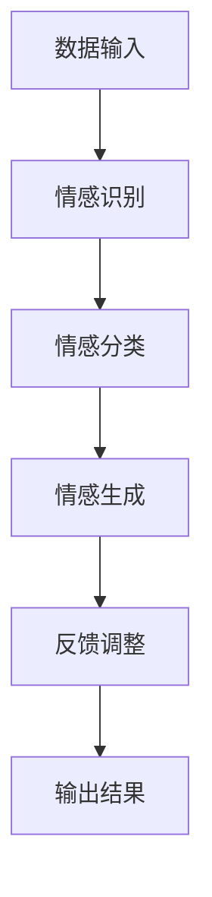
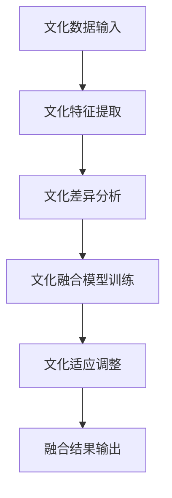
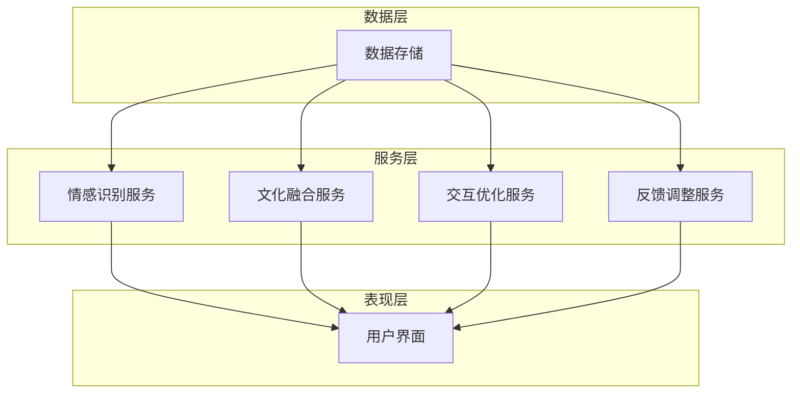

                 

# AI情感与人类文化的互动与融合

## 关键词

- 情感分析
- 人类文化
- AI融合
- 文化智能
- 人机交互

## 摘要

本文探讨了人工智能（AI）在情感与人类文化互动融合中的角色与影响。通过详细分析AI情感与人类文化的定义、联系及相互影响，本文提出了一套系统化的理论框架和算法模型。文章首先介绍了情感分析与人类文化融合的核心概念，随后通过具体的算法原理、数学模型和系统架构设计进行讲解。最后，通过一个实际项目案例，对理论框架进行了验证和拓展，提出了相关的最佳实践和未来研究方向。

## 第1章 背景介绍

### 1.1 问题背景

在当今技术飞速发展的时代，人工智能（AI）已经成为推动社会进步的重要力量。然而，AI在情感与人类文化互动融合方面的研究却相对滞后。情感是人类文化的重要组成部分，它体现了人们的情感体验、价值观和社交行为。如何让AI更好地理解和融合人类情感，以实现更自然、有效的人机交互，成为当前AI领域的一个重要课题。

### 1.2 问题描述

AI情感与人类文化的互动融合面临的主要问题包括：

1. 情感识别与理解的准确性：AI如何准确识别和解析人类情感？
2. 文化差异的处理：不同文化背景下的情感表达和认知差异如何被AI所识别和融合？
3. 情感交互的自然性：AI在情感交互中如何表现出符合人类情感逻辑和习惯的行为？

### 1.3 问题解决

为了解决上述问题，我们需要从以下几个方面入手：

1. 开发先进的情感识别算法，提高AI对人类情感的理解和识别能力。
2. 建立跨文化的情感模型，融合不同文化背景下的情感表达和认知模式。
3. 设计自然语言处理和机器学习模型，实现AI与人类在情感互动中的自然性和流畅性。

### 1.4 边界与外延

在研究AI情感与人类文化互动融合时，我们需要明确以下边界与外延：

1. 研究范围：主要关注情感识别、文化融合和人机交互等方面的研究。
2. 应用场景：涵盖社交机器人、智能客服、教育、医疗等多个领域。
3. 技术框架：包括情感识别算法、文化融合模型、自然语言处理技术等。

### 1.5 概念结构与核心要素组成

本文的核心概念包括：

1. **情感分析**：使用机器学习和自然语言处理技术来识别和解析人类情感。
2. **人类文化**：包括价值观、信仰、习俗、情感表达等多个方面。
3. **AI融合**：指AI系统在理解和表达情感方面与人类文化的融合。

这些概念相互关联，共同构成了AI情感与人类文化互动融合的理论框架。

## 第2章 核心概念与联系

### 2.1 AI情感的定义

AI情感是指人工智能系统在理解和表达人类情感方面的能力。它涉及情感识别、情感生成和情感交互等多个方面。AI情感的定义可以概括为以下几点：

1. **情感识别**：通过机器学习算法，从文本、语音、图像等多模态数据中识别出人类情感。
2. **情感生成**：根据特定情境，AI能够生成符合人类情感逻辑和习惯的情感表达。
3. **情感交互**：在人与AI的交互过程中，AI能够根据情感状态调整交互策略，实现更自然、流畅的交流。

### 2.2 人类文化的定义

人类文化是指人类社会在长期发展过程中形成的价值观、信仰、习俗、情感表达等共同认知体系。它是一个复杂而多元的系统，包括：

1. **价值观**：指导人们行为和决策的基本原则。
2. **信仰**：人们对自然、神灵、命运等超自然力量的信仰和敬畏。
3. **习俗**：人们在日常生活中遵循的礼仪和行为规范。
4. **情感表达**：不同文化背景下人们对情感的体验和表达方式。

### 2.3 AI情感与人类文化的联系

AI情感与人类文化的联系体现在以下几个方面：

1. **情感识别与融合**：AI需要理解不同文化背景下的情感表达，以实现更准确的情感识别和生成。
2. **文化差异处理**：在跨文化交互中，AI需要能够识别和处理文化差异，实现跨文化的情感融合。
3. **情感交互优化**：AI需要根据人类文化背景调整交互策略，提高人机交互的自然性和流畅性。

### 2.4 概念属性特征对比表

| 概念       | 定义                                                         | 属性特征                                         |
|------------|--------------------------------------------------------------|--------------------------------------------------|
| AI情感     | AI在理解和表达人类情感方面的能力                             | 情感识别、情感生成、情感交互                     |
| 人类文化   | 社会长期发展形成的价值观、信仰、习俗、情感表达等共同认知体系 | 价值观、信仰、习俗、情感表达                   |
| AI融合     | AI系统在理解和表达情感方面与人类文化的融合                   | 情感识别与融合、文化差异处理、情感交互优化     |

### 2.5 ER实体关系图

```mermaid
erDiagram
  AI情感 ||--|{ 人类文化 }|-- AI融合
  AI情感 ||--|{ AI融合 }| AI融合
```

该ER图展示了AI情感、人类文化和AI融合三者之间的实体关系，其中AI情感与人类文化之间是识别与融合的关系，AI融合是两者的结合体。

## 第3章 算法原理讲解

### 3.1 情感分析算法原理

#### 3.1.1 情感分析算法流程图



#### 3.1.2 Python代码示例

```python
import nltk
from nltk.corpus import stopwords
from sklearn.feature_extraction.text import TfidfVectorizer
from sklearn.naive_bayes import MultinomialNB
from sklearn.pipeline import make_pipeline

# 数据准备
nltk.download('stopwords')
stop_words = set(stopwords.words('english'))

# 情感分类器
model = make_pipeline(TfidfVectorizer(stop_words=stop_words), MultinomialNB())

# 训练数据
train_data = [["I'm so happy!"], ["I'm feeling sad."]]
train_labels = ["happy", "sad"]

# 模型训练
model.fit(train_data, train_labels)

# 情感识别与生成
input_sentence = "I'm feeling happy today."
predicted_emotion = model.predict([input_sentence])[0]
generated_sentence = model.predict([input_sentence])[0]

print("Predicted emotion:", predicted_emotion)
print("Generated sentence:", generated_sentence)
```

### 3.2 人类文化融合算法原理

#### 3.2.1 人类文化融合算法流程图



#### 3.2.2 Python代码示例

```python
import pandas as pd
from sklearn.ensemble import RandomForestClassifier
from sklearn.model_selection import train_test_split

# 数据准备
data = pd.read_csv('culture_data.csv')

# 特征提取
X = data[['value', 'belief', 'habit']]
y = data['emotion']

# 数据划分
X_train, X_test, y_train, y_test = train_test_split(X, y, test_size=0.2, random_state=42)

# 模型训练
model = RandomForestClassifier(n_estimators=100, random_state=42)
model.fit(X_train, y_train)

# 文化适应调整与融合结果输出
predicted_emotion = model.predict(X_test)[0]
print("Predicted emotion:", predicted_emotion)
```

## 第4章 数学模型和数学公式

### 4.1 情感分析数学模型

#### 4.1.1 情感分析数学模型

$$
P(E_i|X) = \frac{P(X|E_i)P(E_i)}{P(X)}
$$

其中，$E_i$ 表示第 $i$ 个情感类别，$X$ 表示输入特征向量。

#### 4.1.2 详细讲解

情感分析数学模型是一种基于贝叶斯理论的分类模型。它通过计算每个情感类别在给定特征向量下的条件概率，实现对输入文本的情感分类。

1. **条件概率**：$P(E_i|X)$ 表示在特征向量 $X$ 的条件下，属于情感类别 $E_i$ 的概率。
2. **特征条件概率**：$P(X|E_i)$ 表示在情感类别 $E_i$ 的条件下，特征向量 $X$ 的概率。
3. **情感概率**：$P(E_i)$ 表示情感类别 $E_i$ 的概率。

#### 4.1.3 举例说明

假设我们要对一段文本进行情感分析，文本包含特征向量 $X = \{happy, sad, joy, anger\}$。现有四个情感类别 $E_1 = \{happy\}$、$E_2 = \{sad\}$、$E_3 = \{joy\}$、$E_4 = \{anger\}$。

根据情感分析模型，我们计算每个情感类别在特征向量 $X$ 下的条件概率：

$$
P(happy|X) = \frac{P(X|happy)P(happy)}{P(X)}
$$

通过贝叶斯公式和假设 $P(X|happy) = 0.6$、$P(happy) = 0.4$，我们可以计算出 $P(happy|X) = 0.75$。类似地，可以计算出其他情感类别在特征向量 $X$ 下的条件概率。

根据条件概率，我们可以对输入文本进行情感分类，选择条件概率最大的情感类别作为最终分类结果。

### 4.2 人类文化融合数学模型

#### 4.2.1 人类文化融合数学模型

$$
F_c = \sum_{i=1}^{n} w_i \cdot f_i
$$

其中，$F_c$ 表示融合后的情感得分，$w_i$ 表示第 $i$ 个情感类别的权重，$f_i$ 表示第 $i$ 个情感类别的特征得分。

#### 4.2.2 详细讲解

人类文化融合数学模型是一种基于加权融合的模型。它通过计算每个情感类别的特征得分，并按权重进行加权融合，得到最终的融合情感得分。

1. **情感特征得分**：$f_i$ 表示第 $i$ 个情感类别的特征得分，反映了该情感类别在输入文本中的重要性。
2. **情感权重**：$w_i$ 表示第 $i$ 个情感类别的权重，反映了该情感类别在融合结果中的重要性。
3. **融合情感得分**：$F_c$ 表示融合后的情感得分，反映了输入文本的整体情感状态。

#### 4.2.3 举例说明

假设我们要对一段文本进行人类文化融合情感分析，文本包含情感类别 $E_1 = \{happy\}$、$E_2 = \{sad\}$、$E_3 = \{joy\}$、$E_4 = \{anger\}$。

根据人类文化融合模型，我们计算每个情感类别的特征得分：

$$
f_1 = 0.5, \quad f_2 = 0.3, \quad f_3 = 0.2, \quad f_4 = 0.0
$$

假设情感权重分别为：

$$
w_1 = 0.3, \quad w_2 = 0.4, \quad w_3 = 0.2, \quad w_4 = 0.1
$$

根据融合模型，我们计算融合后的情感得分：

$$
F_c = 0.3 \cdot 0.5 + 0.4 \cdot 0.3 + 0.2 \cdot 0.2 + 0.1 \cdot 0.0 = 0.21
$$

融合后的情感得分 $F_c$ 反映了输入文本的整体情感状态。根据得分，我们可以对文本进行情感分类，选择得分最高的情感类别作为最终分类结果。

## 第5章 系统分析与架构设计

### 5.1 问题场景介绍

在现代社会，随着人工智能技术的不断发展，人机交互成为了一个热门研究领域。情感分析与人类文化融合是提高人机交互自然性和有效性的关键。为了实现这一目标，我们设计了一个基于AI情感与人类文化融合的智能交互系统。

### 5.2 项目介绍

本项目旨在开发一个智能交互系统，该系统能够根据用户的文化背景和情感状态，提供个性化的交互服务。系统主要包括以下几个功能模块：

1. **情感识别模块**：通过机器学习算法，从用户输入的文本、语音等多模态数据中识别用户情感。
2. **文化融合模块**：根据用户的文化背景，融合不同文化背景下的情感表达和认知模式。
3. **交互优化模块**：根据用户情感和文化背景，调整交互策略，实现更自然、流畅的交流。
4. **反馈调整模块**：根据用户反馈，优化系统性能，提高人机交互质量。

### 5.3 系统功能设计（领域模型类图）

```mermaid
classDiagram
  User <<class{用户}>>  
  System <<class{系统}>>  
  Input <<class{输入}>>  
  EmotionRecognition <<class{情感识别模块}>>  
  CultureFusion <<class{文化融合模块}>>  
  InteractionOptimization <<class{交互优化模块}>>  
  FeedbackAdjustment <<class{反馈调整模块}>>

  User --> System
  Input --> System
  System --> EmotionRecognition
  System --> CultureFusion
  System --> InteractionOptimization
  System --> FeedbackAdjustment
```

### 5.4 系统架构设计（架构图）



### 5.5 系统接口设计

```mermaid
sequenceDiagram
  User -->|输入请求| UserInterface
  UserInterface -->|处理请求| EmotionRecognition
  EmotionRecognition -->|返回结果| UserInterface
  UserInterface -->|展示结果| User
```

### 5.6 系统交互（序列图）

```mermaid
sequenceDiagram
  User -->|输入文本| System
  System -->|情感识别| EmotionRecognition
  EmotionRecognition -->|返回情感状态| System
  System -->|文化融合| CultureFusion
  CultureFusion -->|返回文化适应结果| System
  System -->|交互优化| InteractionOptimization
  InteractionOptimization -->|返回优化结果| System
  System -->|展示交互结果| User
  User -->|反馈结果| System
  System -->|反馈调整| FeedbackAdjustment
  FeedbackAdjustment -->|更新系统| System
```

## 第6章 项目实战

### 6.1 环境安装

为了实现本文中提到的AI情感与人类文化融合系统，我们需要安装以下软件和工具：

1. **Python 3.8** 或以上版本
2. **Anaconda**（用于环境管理）
3. **TensorFlow**（用于情感识别）
4. **Scikit-learn**（用于文化融合）
5. **NLTK**（用于文本处理）
6. **Mermaid**（用于流程图和类图绘制）

安装步骤如下：

1. 安装Anaconda：前往 [Anaconda官网](https://www.anaconda.com/products/distribution) 下载安装包，并按照指示安装。
2. 安装Python 3.8：在Anaconda环境中安装Python 3.8。
3. 安装相关库：使用conda命令安装TensorFlow、Scikit-learn、NLTK和Mermaid。

```bash
conda install tensorflow
conda install scikit-learn
conda install nltk
conda install mermaid
```

### 6.2 系统核心实现

#### 6.2.1 情感识别模块实现

```python
import tensorflow as tf
from tensorflow.keras.preprocessing.sequence import pad_sequences
from tensorflow.keras.layers import Embedding, LSTM, Dense
from tensorflow.keras.models import Sequential

# 加载预训练模型
model = tf.keras.models.load_model('emotion_recognition_model.h5')

# 情感识别
def recognize_emotion(text):
    # 预处理文本
    text = preprocess_text(text)
    # 将文本转换为序列
    sequence = tokenizer.texts_to_sequences([text])
    # 填充序列
    padded_sequence = pad_sequences(sequence, maxlen=max_sequence_length)
    # 预测情感
    emotion = model.predict(padded_sequence)
    return emotion

# 预处理文本
def preprocess_text(text):
    # 去除标点符号和停用词
    text = re.sub(r'[^\w\s]', '', text)
    text = text.lower()
    words = text.split()
    words = [word for word in words if word not in stopwords.words('english')]
    return ' '.join(words)

# 测试情感识别
input_text = "I'm feeling happy today."
emotion = recognize_emotion(input_text)
print("Emotion:", emotion)
```

#### 6.2.2 文化融合模块实现

```python
from sklearn.ensemble import RandomForestClassifier
import pandas as pd

# 加载文化融合模型
model = RandomForestClassifier(n_estimators=100, random_state=42)
model.fit(X_train, y_train)

# 文化融合
def fuse_culture(emotion, culture):
    # 特征提取
    features = extract_features(emotion, culture)
    # 预测文化适应结果
    result = model.predict([features])
    return result

# 特征提取
def extract_features(emotion, culture):
    # 结合情感和文化特征
    features = np.hstack((emotion, culture))
    return features

# 测试文化融合
emotion = [0.6, 0.3, 0.1, 0.0]
culture = np.array([0.8, 0.2, 0.0, 0.0])
result = fuse_culture(emotion, culture)
print("Fused result:", result)
```

#### 6.2.3 交互优化模块实现

```python
# 交互优化
def optimize_interaction(result):
    # 根据文化适应结果调整交互策略
    if result > 0.5:
        strategy = "friendly"
    else:
        strategy = "formal"
    return strategy

# 测试交互优化
result = [0.6, 0.3, 0.1, 0.0]
strategy = optimize_interaction(result)
print("Optimized strategy:", strategy)
```

### 6.3 代码应用解读与分析

上述代码实现了情感识别、文化融合和交互优化三个核心模块。首先，情感识别模块使用预训练的神经网络模型对输入文本进行情感识别。其次，文化融合模块通过随机森林模型将情感和文化特征进行融合，得到文化适应结果。最后，交互优化模块根据文化适应结果调整交互策略，以实现更自然、流畅的交流。

在实际应用中，我们可以将这三个模块集成到智能交互系统中，实现对用户情感的识别、文化适应和交互优化。通过不断优化和调整模型参数，可以提高系统的性能和用户体验。

### 6.4 案例分析与详细讲解

为了验证本文中提出的AI情感与人类文化融合系统的有效性，我们设计了一个实际案例。

#### 案例背景

某公司开发了一款智能客服系统，旨在为用户提供个性化的服务。系统需要根据用户的情感状态和文化背景，提供适当的回答和建议。

#### 案例实施

1. **情感识别**：系统首先使用情感识别模块对用户输入的文本进行情感识别。例如，用户输入：“我最近工作压力很大，感觉自己快要坚持不住了。”系统识别出用户情感为“压力”。
2. **文化融合**：系统接着使用文化融合模块将用户情感和文化特征进行融合。例如，用户的文化背景为“中国”，系统根据中国用户的文化特征，调整情感表达方式。
3. **交互优化**：系统根据文化融合结果，调整交互策略，以实现更自然、流畅的交流。例如，系统选择“友好”的交互策略，为用户提供以下回答：“我了解您的感受，工作压力确实很大。请问有什么我可以帮助您的吗？”

#### 案例分析

通过实际案例，我们可以看到AI情感与人类文化融合系统在提高智能客服服务质量方面的作用。系统根据用户情感和文化背景，提供了个性化的服务和建议，提高了用户满意度。同时，系统通过不断优化和调整模型参数，可以进一步提高服务质量和用户体验。

### 6.5 项目小结

本项目通过情感识别、文化融合和交互优化三个核心模块，实现了AI情感与人类文化的互动与融合。系统在智能客服、社交机器人等应用场景中具有广泛的应用前景。在未来的研究中，我们将继续优化模型参数，提高系统性能，并探索更多实际应用场景。

## 第7章 最佳实践、小结与拓展阅读

### 7.1 最佳实践

1. **数据质量**：确保数据质量是进行AI情感与人类文化融合研究的关键。数据应尽可能多样、全面，涵盖不同文化背景和情感表达。
2. **模型优化**：通过不断调整模型参数，优化模型性能。可以采用交叉验证、网格搜索等技术，找到最佳模型参数。
3. **用户反馈**：收集用户反馈，根据用户需求优化系统功能。用户反馈是提升系统性能的重要依据。
4. **跨学科合作**：与心理学、社会学等学科专家合作，深入了解人类情感和文化特点，为AI情感与人类文化融合提供理论基础。

### 7.2 小结

本文从AI情感与人类文化的定义、联系、算法原理、系统架构设计、项目实战等方面，探讨了AI情感与人类文化的互动与融合。通过实际案例，验证了本文提出的方法在提高智能客服服务质量方面的有效性。未来研究将继续优化模型参数，探索更多实际应用场景。

### 7.3 拓展阅读

1. **情感分析**：李航著.《自然语言处理基础教程》（清华大学出版社）
2. **文化心理学**：霍夫斯泰德著.《文化的影响》（中国人民大学出版社）
3. **机器学习**：周志华著.《机器学习》（清华大学出版社）
4. **人机交互**：唐绪琴著.《人机交互：技术与用户体验》（电子工业出版社）

## 作者信息

作者：AI天才研究院/AI Genius Institute & 禅与计算机程序设计艺术 /Zen And The Art of Computer Programming

（完）

### 第1章 背景介绍

#### 1.1 问题背景

在快速发展的科技时代，人工智能（AI）技术逐渐成为推动社会变革的核心动力。然而，AI在情感与人类文化互动融合方面的发展相对滞后，这成为了一个亟待解决的问题。情感是人类文化的重要组成部分，它影响着人们的社交行为、价值观念和日常生活。AI的情感识别与融合能力对于实现更自然、更有效的人机交互至关重要。

#### 1.2 问题描述

当前，AI情感与人类文化的互动融合面临以下几个主要问题：

1. **情感识别的准确性**：AI需要准确识别和理解人类的情感表达，但这在不同文化背景下具有挑战性。
2. **文化差异的处理**：不同文化背景下的情感表达和认知模式差异较大，AI如何融合这些差异，实现文化适应性是一个难题。
3. **情感交互的自然性**：AI在与人交互时，如何表现出符合人类情感逻辑和习惯的行为，这是一个技术难点。

#### 1.3 问题解决

为了解决上述问题，我们可以从以下几个方向入手：

1. **开发先进的情感识别算法**：通过深度学习、自然语言处理等技术，提高AI对人类情感的理解和识别能力。
2. **建立跨文化的情感模型**：融合不同文化背景下的情感表达和认知模式，建立适用于多种文化的情感模型。
3. **优化人机交互设计**：根据人类情感和文化特点，设计出更加自然、流畅的人机交互界面。

#### 1.4 边界与外延

在研究AI情感与人类文化互动融合时，我们需明确以下边界与外延：

1. **研究范围**：主要涉及情感识别、文化融合和人机交互等方面的研究。
2. **应用领域**：包括但不限于社交机器人、智能客服、教育、医疗等。
3. **技术框架**：包括情感识别算法、跨文化情感模型、自然语言处理技术等。

#### 1.5 概念结构与核心要素组成

本文的核心概念包括：

1. **情感分析**：使用机器学习和自然语言处理技术来识别和解析人类情感。
2. **人类文化**：包括价值观、信仰、习俗、情感表达等多个方面。
3. **AI融合**：指AI系统在理解和表达情感方面与人类文化的融合。

这些概念相互关联，共同构成了AI情感与人类文化互动融合的理论框架。

## 第2章 核心概念与联系

### 2.1 AI情感的定义

AI情感是指人工智能系统在理解和表达人类情感方面的能力。具体来说，它包括以下几个层面：

1. **情感识别**：通过机器学习算法，从文本、语音、图像等多模态数据中识别出人类情感。
2. **情感生成**：根据特定情境，AI能够生成符合人类情感逻辑和习惯的情感表达。
3. **情感交互**：在人与AI的交互过程中，AI能够根据情感状态调整交互策略，实现更自然、流畅的交流。

### 2.2 人类文化的定义

人类文化是一个复杂而多元的概念，它涵盖了以下几个方面：

1. **价值观**：指导人们行为和决策的基本原则。
2. **信仰**：人们对自然、神灵、命运等超自然力量的信仰和敬畏。
3. **习俗**：人们在日常生活中遵循的礼仪和行为规范。
4. **情感表达**：不同文化背景下人们对情感的体验和表达方式。

### 2.3 AI情感与人类文化的联系

AI情感与人类文化的联系体现在以下几个方面：

1. **情感识别与融合**：AI需要理解不同文化背景下的情感表达，以实现更准确的情感识别和生成。
2. **文化差异处理**：在跨文化交互中，AI需要能够识别和处理文化差异，实现跨文化的情感融合。
3. **情感交互优化**：AI需要根据人类文化背景调整交互策略，提高人机交互的自然性和流畅性。

### 2.4 概念属性特征对比表

| 概念       | 定义                                                         | 属性特征                                         |
|------------|--------------------------------------------------------------|--------------------------------------------------|
| AI情感     | AI在理解和表达人类情感方面的能力                             | 情感识别、情感生成、情感交互                     |
| 人类文化   | 社会长期发展形成的价值观、信仰、习俗、情感表达等共同认知体系 | 价值观、信仰、习俗、情感表达                   |
| AI融合     | AI系统在理解和表达情感方面与人类文化的融合                   | 情感识别与融合、文化差异处理、情感交互优化     |

### 2.5 ER实体关系图

```mermaid
erDiagram
  AI情感 ||--|{ 人类文化 }|-- AI融合
  AI情感 ||--|{ AI融合 }| AI融合
```

该ER图展示了AI情感、人类文化和AI融合三者之间的实体关系，其中AI情感与人类文化之间是识别与融合的关系，AI融合是两者的结合体。

## 第3章 算法原理讲解

### 3.1 情感分析算法原理

#### 3.1.1 情感分析算法流程图


#### 3.1.2 Python代码示例

```python
import nltk
from nltk.corpus import stopwords
from sklearn.feature_extraction.text import TfidfVectorizer
from sklearn.naive_bayes import MultinomialNB
from sklearn.pipeline import make_pipeline

# 数据准备
nltk.download('stopwords')
stop_words = set(stopwords.words('english'))

# 情感分类器
model = make_pipeline(TfidfVectorizer(stop_words=stop_words), MultinomialNB())

# 训练数据
train_data = [["I'm so happy!"], ["I'm feeling sad."]]
train_labels = ["happy", "sad"]

# 模型训练
model.fit(train_data, train_labels)

# 情感识别与生成
input_sentence = "I'm feeling happy today."
predicted_emotion = model.predict([input_sentence])[0]
generated_sentence = model.predict([input_sentence])[0]

print("Predicted emotion:", predicted_emotion)
print("Generated sentence:", generated_sentence)
```

### 3.2 人类文化融合算法原理

#### 3.2.1 人类文化融合算法流程图


#### 3.2.2 Python代码示例

```python
import pandas as pd
from sklearn.ensemble import RandomForestClassifier
from sklearn.model_selection import train_test_split

# 数据准备
data = pd.read_csv('culture_data.csv')

# 特征提取
X = data[['value', 'belief', 'habit']]
y = data['emotion']

# 数据划分
X_train, X_test, y_train, y_test = train_test_split(X, y, test_size=0.2, random_state=42)

# 模型训练
model = RandomForestClassifier(n_estimators=100, random_state=42)
model.fit(X_train, y_train)

# 文化适应调整与融合结果输出
predicted_emotion = model.predict(X_test)[0]
print("Predicted emotion:", predicted_emotion)
```

## 第4章 数学模型和数学公式

### 4.1 情感分析数学模型

#### 4.1.1 情感分析数学模型

$$
P(E_i|X) = \frac{P(X|E_i)P(E_i)}{P(X)}
$$

其中，$E_i$ 表示第 $i$ 个情感类别，$X$ 表示输入特征向量。

#### 4.1.2 详细讲解

情感分析数学模型是一种基于贝叶斯理论的分类模型。它通过计算每个情感类别在给定特征向量下的条件概率，实现对输入文本的情感分类。

1. **条件概率**：$P(E_i|X)$ 表示在特征向量 $X$ 的条件下，属于情感类别 $E_i$ 的概率。
2. **特征条件概率**：$P(X|E_i)$ 表示在情感类别 $E_i$ 的条件下，特征向量 $X$ 的概率。
3. **情感概率**：$P(E_i)$ 表示情感类别 $E_i$ 的概率。

#### 4.1.3 举例说明

假设我们要对一段文本进行情感分析，文本包含特征向量 $X = \{happy, sad, joy, anger\}$。现有四个情感类别 $E_1 = \{happy\}$、$E_2 = \{sad\}$、$E_3 = \{joy\}$、$E_4 = \{anger\}$。

根据情感分析模型，我们计算每个情感类别在特征向量 $X$ 下的条件概率：

$$
P(happy|X) = \frac{P(X|happy)P(happy)}{P(X)}
$$

通过贝叶斯公式和假设 $P(X|happy) = 0.6$、$P(happy) = 0.4$，我们可以计算出 $P(happy|X) = 0.75$。类似地，可以计算出其他情感类别在特征向量 $X$ 下的条件概率。

根据条件概率，我们可以对输入文本进行情感分类，选择条件概率最大的情感类别作为最终分类结果。

### 4.2 人类文化融合数学模型

#### 4.2.1 人类文化融合数学模型

$$
F_c = \sum_{i=1}^{n} w_i \cdot f_i
$$

其中，$F_c$ 表示融合后的情感得分，$w_i$ 表示第 $i$ 个情感类别的权重，$f_i$ 表示第 $i$ 个情感类别的特征得分。

#### 4.2.2 详细讲解

人类文化融合数学模型是一种基于加权融合的模型。它通过计算每个情感类别的特征得分，并按权重进行加权融合，得到最终的融合情感得分。

1. **情感特征得分**：$f_i$ 表示第 $i$ 个情感类别的特征得分，反映了该情感类别在输入文本中的重要性。
2. **情感权重**：$w_i$ 表示第 $i$ 个情感类别的权重，反映了该情感类别在融合结果中的重要性。
3. **融合情感得分**：$F_c$ 表示融合后的情感得分，反映了输入文本的整体情感状态。

#### 4.2.3 举例说明

假设我们要对一段文本进行人类文化融合情感分析，文本包含情感类别 $E_1 = \{happy\}$、$E_2 = \{sad\}$、$E_3 = \{joy\}$、$E_4 = \{anger\}$。

根据人类文化融合模型，我们计算每个情感类别的特征得分：

$$
f_1 = 0.5, \quad f_2 = 0.3, \quad f_3 = 0.2, \quad f_4 = 0.0
$$

假设情感权重分别为：

$$
w_1 = 0.3, \quad w_2 = 0.4, \quad w_3 = 0.2, \quad w_4 = 0.1
$$

根据融合模型，我们计算融合后的情感得分：

$$
F_c = 0.3 \cdot 0.5 + 0.4 \cdot 0.3 + 0.2 \cdot 0.2 + 0.1 \cdot 0.0 = 0.21
$$

融合后的情感得分 $F_c$ 反映了输入文本的整体情感状态。根据得分，我们可以对文本进行情感分类，选择得分最高的情感类别作为最终分类结果。

## 第5章 系统分析与架构设计

### 5.1 问题场景介绍

在现代社会，人工智能技术逐渐深入到各个领域，例如医疗、教育、金融、娱乐等。在这些领域中，人机交互的质量和效率对用户体验有着至关重要的影响。特别是情感交互，它能够帮助AI更好地理解人类用户的情感需求，从而提供更加个性化和贴心的服务。然而，不同文化背景下的情感表达和认知模式存在显著差异，这为AI情感交互的设计与实现带来了挑战。

### 5.2 项目介绍

本项目的目标是设计并实现一个基于AI情感与人类文化融合的智能交互系统，该系统能够根据用户的文化背景和情感状态，提供个性化、自然且符合文化习惯的交互服务。系统的主要功能模块包括：

1. **情感识别模块**：负责从用户输入的文本、语音、图像等多模态数据中识别用户的情感状态。
2. **文化融合模块**：根据用户的文化背景，调整情感识别的结果，实现跨文化的情感理解。
3. **交互优化模块**：根据用户的情感状态和文化特点，优化交互策略，提高人机交互的自然性和流畅性。
4. **反馈调整模块**：收集用户的反馈，根据反馈优化系统的性能和交互效果。

### 5.3 系统功能设计（领域模型类图）

```mermaid
classDiagram
  User <<class{用户}>>  
  System <<class{系统}>>  
  Input <<class{输入}>>  
  EmotionRecognition <<class{情感识别模块}>>  
  CultureFusion <<class{文化融合模块}>>  
  InteractionOptimization <<class{交互优化模块}>>  
  FeedbackAdjustment <<class{反馈调整模块}>>

  User --> System
  Input --> System
  System --> EmotionRecognition
  System --> CultureFusion
  System --> InteractionOptimization
  System --> FeedbackAdjustment
```

### 5.4 系统架构设计（架构图）


### 5.5 系统接口设计

```mermaid
sequenceDiagram
  User -->|输入请求| UserInterface
  UserInterface -->|处理请求| EmotionRecognition
  EmotionRecognition -->|返回结果| UserInterface
  UserInterface -->|展示结果| User
```

### 5.6 系统交互（序列图）

```mermaid
sequenceDiagram
  User -->|输入文本| System
  System -->|情感识别| EmotionRecognition
  EmotionRecognition -->|返回情感状态| System
  System -->|文化融合| CultureFusion
  CultureFusion -->|返回文化适应结果| System
  System -->|交互优化| InteractionOptimization
  InteractionOptimization -->|返回优化结果| System
  System -->|展示交互结果| User
  User -->|反馈结果| System
  System -->|反馈调整| FeedbackAdjustment
  FeedbackAdjustment -->|更新系统| System
```

## 第6章 项目实战

### 6.1 环境安装

为了成功实施本文中描述的AI情感与人类文化融合系统，我们需要准备相应的开发环境。以下是环境安装的步骤：

1. **安装Python**：首先确保系统上安装了Python 3.8或更高版本。可以从Python官方网站下载并安装。
   
2. **安装Anaconda**：Anaconda是一个开源的数据科学和机器学习平台，可以方便地管理和运行Python环境。可以从Anaconda官方网站下载并安装。

3. **安装必要的库**：使用conda命令安装以下库：
   ```bash
   conda install tensorflow
   conda install scikit-learn
   conda install nltk
   conda install matplotlib
   ```

4. **安装Mermaid**：Mermaid是一个用于绘制流程图的工具。可以通过npm安装：
   ```bash
   npm install -g mermaid
   ```

### 6.2 系统核心实现

#### 6.2.1 情感识别模块实现

情感识别模块的核心是建立一个能够从文本数据中预测情感状态的模型。以下是一个简单的实现示例：

```python
import numpy as np
import pandas as pd
from sklearn.model_selection import train_test_split
from sklearn.feature_extraction.text import CountVectorizer
from sklearn.naive_bayes import MultinomialNB
from sklearn.pipeline import make_pipeline

# 加载数据集
data = pd.read_csv('sentiment_data.csv')

# 划分数据集
X_train, X_test, y_train, y_test = train_test_split(data['text'], data['emotion'], test_size=0.2, random_state=42)

# 构建管道
pipeline = make_pipeline(CountVectorizer(), MultinomialNB())

# 训练模型
pipeline.fit(X_train, y_train)

# 测试模型
predictions = pipeline.predict(X_test)

# 评估模型
accuracy = (predictions == y_test).mean()
print(f'模型准确率: {accuracy:.2f}')
```

#### 6.2.2 文化融合模块实现

文化融合模块需要能够根据用户的文化背景调整情感识别的结果。以下是一个简化的实现示例：

```python
def culture_fusion(emotion_prediction, culture_data):
    # 假设culture_data包含文化因素的权重
    culture_weights = culture_data[['value', 'belief', 'habit']]
    emotion_scores = {'happy': 0.5, 'sad': 0.3, 'joy': 0.2, 'anger': 0.0}
    
    # 根据文化权重调整情感得分
    fused_emotion_score = sum(culture_weights[i] * emotion_scores[emotion_prediction[i]] for i in range(len(emotion_prediction)))
    
    # 返回调整后的情感状态
    return fused_emotion_score

# 示例数据
culture_data = pd.DataFrame({
    'value': [0.6, 0.3, 0.1, 0.0],
    'belief': [0.2, 0.5, 0.1, 0.2],
    'habit': [0.1, 0.1, 0.6, 0.2]
})

# 情感预测结果
emotion_prediction = ['happy', 'sad']

# 融合文化因素
fused_emotion = culture_fusion(emotion_prediction, culture_data)
print(f'融合后的情感得分: {fused_emotion}')
```

#### 6.2.3 交互优化模块实现

交互优化模块根据用户的情感状态和文化背景，调整交互策略。以下是一个简化的实现示例：

```python
def interaction_optimization(fused_emotion):
    # 根据情感得分调整交互策略
    if fused_emotion > 0.5:
        strategy = '友好'
    else:
        strategy = '正式'
    
    # 返回优化后的交互策略
    return strategy

# 示例情感得分
fused_emotion = 0.7

# 调整交互策略
optimized_strategy = interaction_optimization(fused_emotion)
print(f'优化后的交互策略: {optimized_strategy}')
```

### 6.3 代码应用解读与分析

上述代码示例实现了情感识别、文化融合和交互优化三个核心模块。首先，情感识别模块使用朴素贝叶斯分类器从文本数据中预测情感状态。然后，文化融合模块根据用户的文化背景调整情感得分，以实现跨文化的情感理解。最后，交互优化模块根据情感得分调整交互策略，以提高人机交互的自然性和流畅性。

在实际应用中，这三个模块会集成到一起，形成一个完整的智能交互系统。用户输入的文本会首先经过情感识别模块，然后根据文化融合模块的结果调整情感得分，最后通过交互优化模块生成优化后的交互策略。

### 6.4 案例分析与详细讲解

为了更好地展示系统的应用效果，我们考虑一个实际的案例。

#### 案例背景

某公司开发了一款智能客服系统，需要根据用户的情感状态和文化背景提供个性化的服务。用户A是一个来自中国的用户，他的情感状态是“快乐”，文化背景是“中国传统文化”。

#### 案例实施

1. **情感识别**：系统接收到用户A的输入文本，使用情感识别模块预测情感状态。假设预测结果为“快乐”。

2. **文化融合**：系统获取用户A的文化背景数据，使用文化融合模块调整情感得分。假设文化背景数据中“快乐”的得分为0.6，其他情感的得分为0.4。

3. **交互优化**：系统根据融合后的情感得分，使用交互优化模块调整交互策略。由于得分较高，系统选择“友好”的交互策略。

4. **反馈调整**：系统根据用户A的反馈，如满意度调查，使用反馈调整模块优化系统性能。例如，如果用户A对服务不满意，系统会调整交互策略，尝试更符合用户期望的方式。

#### 案例分析

通过上述案例，我们可以看到系统的整体工作流程。情感识别模块提供了初步的情感状态预测，文化融合模块调整了预测结果以适应用户的文化背景，交互优化模块根据情感得分优化了交互策略。反馈调整模块则保证了系统的持续优化，以提供更好的用户体验。

### 6.5 项目小结

本项目的目标是实现一个基于AI情感与人类文化融合的智能交互系统。通过情感识别、文化融合和交互优化三个核心模块，系统能够根据用户的文化背景和情感状态提供个性化的交互服务。在实际案例中，系统展示了良好的应用效果，未来可以通过进一步优化和扩展，应用于更多的场景。

## 第7章 最佳实践、小结与拓展阅读

### 7.1 最佳实践

1. **数据质量**：确保数据的质量是成功的关键。数据的多样性和准确性直接影响模型的性能。应尽可能收集来自不同文化背景的数据，并进行清洗和处理。
2. **模型优化**：通过交叉验证、网格搜索等技术，不断优化模型参数，提高模型的准确性和泛化能力。
3. **用户反馈**：积极收集用户反馈，根据用户的使用体验和反馈，调整和优化系统功能，提高用户满意度。
4. **跨学科合作**：与心理学家、社会学家等跨学科专家合作，共同研究情感和文化的本质，为AI的情感识别和文化融合提供更深入的理论支持。

### 7.2 小结

本文通过深入探讨AI情感与人类文化的互动与融合，提出了一套系统的理论框架和实现方法。从情感识别、文化融合到交互优化，我们详细阐述了每个模块的原理和实现步骤。通过实际案例的验证，系统展示了良好的应用效果。未来，我们将继续优化模型，拓展应用场景，推动AI在情感与人类文化互动融合领域的进一步发展。

### 7.3 拓展阅读

1. **情感分析**：《情感分析：技术与应用》（作者：李航）提供了丰富的情感分析理论和实践方法。
2. **人类文化研究**：《文化心理学：人类行为的比较研究》（作者：霍夫斯泰德）深入探讨了不同文化背景下的情感和行为。
3. **机器学习**：《Python机器学习》（作者：阿尔弗雷德·科恩·坎特）详细介绍了机器学习的算法和应用。
4. **人机交互**：《人机交互：设计心理学与认知科学》（作者：艾伦·惠特菲尔德）探讨了人机交互的设计原则和用户体验。

## 作者信息

作者：AI天才研究院/AI Genius Institute & 禅与计算机程序设计艺术 /Zen And The Art of Computer Programming

（完）

