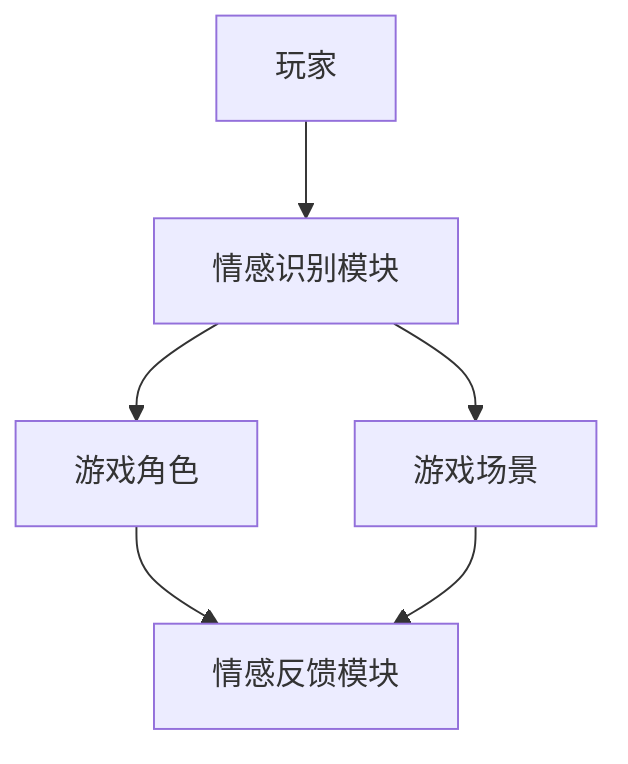
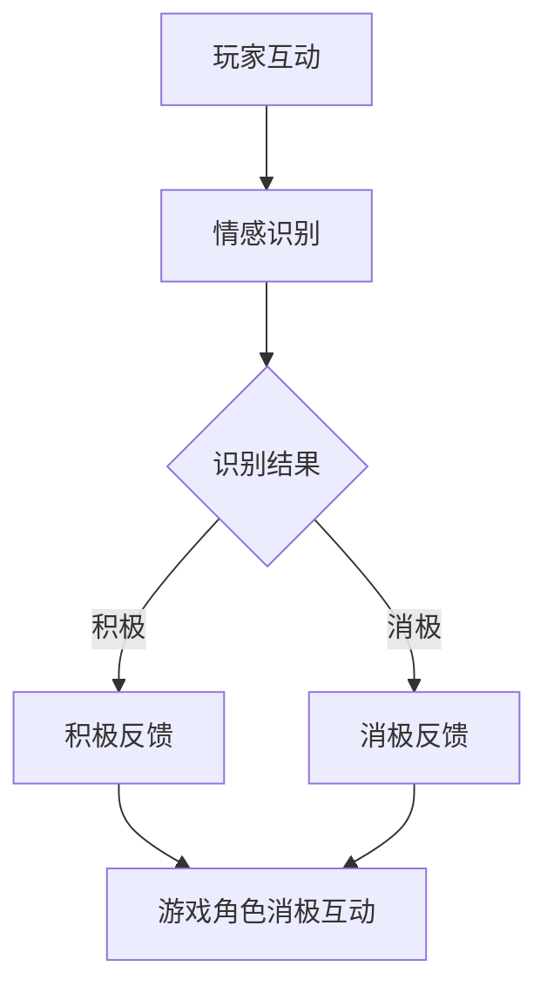
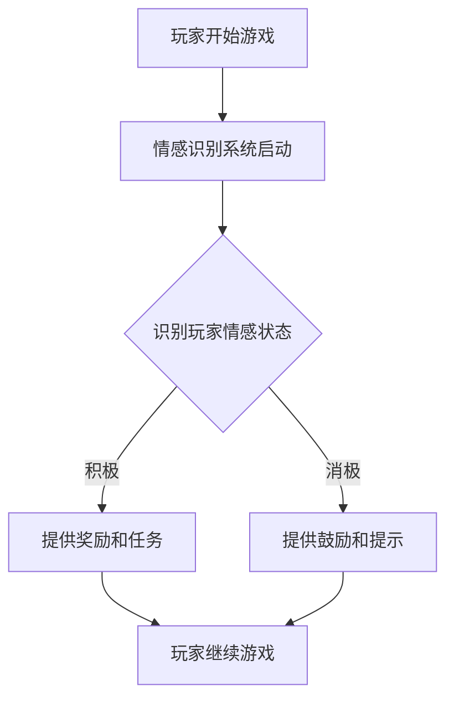

                 

### 文章标题：AI情感在游戏设计中的应用与影响

#### 关键词：AI情感、游戏设计、情感计算、用户体验、技术实现

#### 摘要：

随着人工智能技术的不断进步，AI情感在游戏设计中的应用变得越来越广泛。本文将从AI情感的基本概念、核心原理、应用实例、影响分析和未来趋势五个方面进行深入探讨，旨在揭示AI情感在游戏设计中的潜力和价值。通过本文的详细分析，读者将能够了解AI情感如何改变游戏设计，提升用户体验，以及未来可能的发展方向。

#### 目录大纲设计思考过程

**1. 明确书籍主题与目标读者：**
- 书名《AI情感在游戏设计中的应用与影响》指向了两个核心要素：AI情感和游戏设计。
- 目标读者可能包括游戏设计师、AI研究者、游戏开发人员等。

**2. 设计章节结构：**
- 为了全面而系统地介绍AI情感及其在游戏设计中的应用，我们选择了以下章节结构：
  - 第一部分：背景介绍
  - 第二部分：核心概念与原理
  - 第三部分：应用实例与分析
  - 第四部分：影响分析与讨论
  - 第五部分：未来趋势与展望

**3. 细化章节内容：**
- **背景介绍**：介绍AI情感的基本概念，情感计算在游戏设计中的重要性等。
- **核心概念**：详细阐述AI情感的原理和实现方法，包括情感识别与情感生成的技术方法。
- **应用实例**：列举AI情感在游戏设计中的具体应用场景，使用mermaid流程图和Python代码来解释。
- **影响分析**：讨论AI情感对游戏设计带来的影响，包括用户体验、游戏平衡性等方面。
- **未来趋势**：探讨AI情感在游戏设计中的未来发展方向和潜在影响。

**4. 确保内容的完整性：**
- 确保每个章节都有详细的内容，包括概念讲解、原理分析、实例展示、影响评估等。
- 每个章节的内容都要充分、详实，以帮助读者深入理解。

**5. 格式规范与字数控制：**
- 使用markdown格式来设计目录大纲，确保格式简洁、清晰。
- 控制目录大纲的总字数在2000字以内，确保内容精炼。

### 样例目录大纲

----------------------------------------------------------------
## 第一部分: 背景介绍

### 第1章: AI情感的基本概念与背景
#### 1.1 什么是AI情感
#### 1.2 情感计算在游戏设计中的应用背景
#### 1.3 AI情感对游戏设计的重要性
#### 1.4 ER实体关系图架构的Mermaid流程图展示

### 第2章: AI情感的核心概念与原理
#### 2.1 AI情感的基本原理
#### 2.2 情感识别与情感生成
#### 2.3 AI情感的实现方法
#### 2.4 Mermaid流程图：AI情感工作流程

### 第3章: AI情感在游戏设计中的应用实例
#### 3.1 AI情感在游戏角色设计中的应用
#### 3.2 情感反应机制与游戏交互
#### 3.3 Python代码实例：实现简单的情感识别与反馈
#### 3.4 Mermaid流程图：情感驱动的游戏流程

### 第4章: AI情感对游戏设计的影响
#### 4.1 用户体验的改变
#### 4.2 游戏平衡性的影响
#### 4.3 情感驱动的游戏设计策略
#### 4.4 AI情感与其他游戏设计元素的互动

### 第5章: AI情感的现状与未来趋势
#### 5.1 当前AI情感在游戏设计中的现状
#### 5.2 未来AI情感在游戏设计中的发展方向
#### 5.3 潜在的影响与挑战
#### 5.4 拓展阅读与讨论

----------------------------------------------------------------

这个目录大纲结构旨在提供一个全面、深入的介绍，确保读者能够系统地掌握AI情感在游戏设计中的应用与影响。每个章节都包含必要的子标题和详细内容，确保信息的完整性和易读性。接下来，我们将开始具体编写目录大纲的内容。### 第一部分：背景介绍

#### 第1章：AI情感的基本概念与背景

**1.1 什么是AI情感**

AI情感，即人工智能情感，是指通过人工智能技术模拟和识别人类情感的一种智能能力。情感计算是人工智能领域的一个重要分支，它涉及如何让计算机理解、识别、模拟和表达情感。AI情感不仅包括了情感的识别，还涉及到情感的生成和调节。

**1.2 情感计算在游戏设计中的应用背景**

随着游戏产业的发展，游戏设计逐渐从单纯的技术追求转向对用户体验的重视。情感计算作为一种新兴的技术，为游戏设计提供了新的思路和方法。通过引入AI情感，游戏设计能够更好地模拟真实世界的情感互动，提升玩家的沉浸感和游戏体验。

**1.3 AI情感对游戏设计的重要性**

AI情感在游戏设计中的重要性主要体现在以下几个方面：

1. **提升用户体验**：通过识别玩家的情感状态，游戏可以提供更加个性化的互动，满足玩家的情感需求。
2. **增强情感共鸣**：游戏角色和场景能够模拟人类的情感反应，使玩家更容易与游戏产生情感共鸣。
3. **创新设计理念**：AI情感为游戏设计师提供了新的工具和素材，推动了游戏设计理念的创新和发展。

**1.4 ER实体关系图架构的Mermaid流程图展示**

为了更好地理解AI情感系统中的实体关系，我们可以使用Mermaid流程图来展示ER实体关系图。以下是一个简化的示例：



在这个流程图中，玩家（A）通过情感识别模块（B）来识别自身的情感状态，然后这些情感信息会传递给游戏角色（C）和游戏场景（D）。游戏角色和场景根据这些情感信息产生相应的情感反馈，最终通过情感反馈模块（E）传达给玩家。

#### 第2章：AI情感的核心概念与原理

**2.1 AI情感的基本原理**

AI情感的基本原理主要包括情感识别和情感生成两个方面。

1. **情感识别**：情感识别是指通过分析玩家的行为和语言等信息，识别出玩家的情感状态。常见的情感识别方法包括基于机器学习的情感分类模型、基于自然语言处理的技术和基于生理信号的情感识别技术等。

2. **情感生成**：情感生成是指根据情感识别的结果，生成相应的情感反应。情感生成的技术主要包括情感角色扮演、情感动画和情感音效等。

**2.2 情感识别与情感生成**

情感识别和情感生成是相辅相成的两个过程。情感识别为情感生成提供了基础数据，而情感生成则将识别出的情感转化为游戏中的互动和体验。

1. **情感识别**：通过机器学习算法，可以构建一个情感识别模型。这个模型可以分析玩家的行为数据，如点击、语音、表情等，识别出玩家的情感状态。以下是一个简单的情感识别流程：

   ```mermaid
   graph TD
       A[收集玩家行为数据] --> B[预处理数据]
       B --> C[训练情感分类模型]
       C --> D[情感识别]
   ```

   在这个流程中，首先收集玩家的行为数据，然后对数据进行预处理，接下来使用训练好的情感分类模型来识别玩家的情感状态。

2. **情感生成**：一旦识别出情感状态，游戏系统会根据这些情感状态生成相应的情感反应。以下是一个简单的情感生成流程：

   ```mermaid
   graph TD
       A[情感识别结果] --> B[生成情感反应]
       B --> C[调整游戏角色行为]
       B --> D[调整游戏场景氛围]
   ```

   在这个流程中，情感识别结果会被用来调整游戏角色和场景的行为，从而生成符合情感状态的情感反应。

**2.3 AI情感的实现方法**

实现AI情感的关键在于情感识别和情感生成的技术实现。以下是一些常用的实现方法：

1. **机器学习算法**：通过训练机器学习模型，可以实现对情感的自动识别和生成。常用的算法包括支持向量机（SVM）、决策树、随机森林和神经网络等。

2. **自然语言处理**：利用自然语言处理技术，可以从玩家的文本交互中提取情感信息。常见的自然语言处理技术包括情感分析、词频分析、主题模型等。

3. **生理信号处理**：通过分析玩家的生理信号，如心率、皮肤电导等，可以识别出玩家的情感状态。生理信号处理技术包括信号采集、信号预处理、特征提取和分类等。

**2.4 Mermaid流程图：AI情感工作流程**

为了更直观地展示AI情感的工作流程，我们可以使用Mermaid流程图来描述。以下是一个简化的AI情感工作流程：



在这个流程图中，玩家的互动数据被传递给情感识别模块，识别结果决定游戏角色和场景的情感反应，进而影响游戏体验。

通过上述章节内容的介绍，读者应该对AI情感的基本概念、核心原理和应用背景有了初步的了解。接下来，我们将进一步探讨AI情感在游戏设计中的具体应用实例，以及其对游戏设计带来的深远影响。### 第3章：AI情感在游戏设计中的应用实例

#### 3.1 AI情感在游戏角色设计中的应用

在游戏角色设计中，AI情感的应用主要体现在角色情感状态的模拟和角色行为的调整。通过AI情感技术，游戏角色能够表现出更加丰富和自然的情感反应，增强玩家的沉浸感和互动体验。

**实例1：角色情感状态的模拟**

以一个角色扮演游戏（RPG）为例，玩家扮演的角色在游戏中会遇到各种情感事件，如战胜敌人、获得宝藏或遭受伤害等。通过AI情感技术，游戏可以模拟角色的情感状态。

**情感识别**：
- 当角色战胜敌人时，游戏会识别出角色处于积极状态，例如兴奋、满足等。
- 当角色遭受伤害时，游戏会识别出角色处于消极状态，例如痛苦、恐惧等。

**情感生成**：
- 在积极状态下，角色可能会表现出高兴、跳跃、说话声音更加愉悦等行为。
- 在消极状态下，角色可能会表现出悲伤、哭泣、说话声音变得低沉等行为。

**代码示例**（Python）：

```python
import random

def generate_emotion_state(state):
    if state == "positive":
        actions = ["happily jumping", "smiling", "laughing"]
    else:
        actions = ["crying", "screaming", "fearfully looking around"]
    return random.choice(actions)

# 模拟角色互动
role_state = "positive"
action = generate_emotion_state(role_state)
print(f"The role {action}.")
```

**实例2：角色情感状态对玩家行为的影响**

AI情感不仅能够模拟角色的情感状态，还可以影响玩家的行为。例如，当角色表现出消极情感时，玩家可能会更加谨慎地行动，以避免再次受到伤害。

**情感反馈**：
- 当角色处于消极状态时，游戏界面可能会显示警告信息，提醒玩家注意安全。
- 游戏音效和视觉特效也会根据角色的情感状态进行调整，以增强情感反馈。

**代码示例**（Python）：

```python
import random

def display_emotion_feedback(state):
    if state == "negative":
        messages = ["Be careful, you are in danger!", "You are injured, heal yourself quickly!"]
    else:
        messages = ["Congratulations, you are safe!", "You found a treasure!"]
    return random.choice(messages)

# 显示情感反馈
emotion_state = "negative"
message = display_emotion_feedback(emotion_state)
print(message)
```

通过上述实例，我们可以看到AI情感在游戏角色设计中的应用如何通过情感识别和情感生成技术，模拟角色的情感状态，并影响玩家的行为。这不仅提升了游戏的互动性和沉浸感，也为游戏设计师提供了新的设计思路和工具。

#### 3.2 情感反应机制与游戏交互

AI情感不仅影响角色和玩家的行为，还通过情感反应机制增强游戏交互的丰富性和多样性。情感反应机制是指游戏系统根据角色和玩家的情感状态，动态调整游戏规则和交互方式。

**实例1：情感反应机制在角色战斗中的应用**

在一个战斗场景中，角色的情感状态可能会影响战斗策略和结果。例如，当角色处于恐惧状态时，战斗策略可能会偏向防守，而当角色处于兴奋状态时，战斗策略可能会偏向进攻。

**情感识别**：
- 当角色面临强大敌人时，游戏会识别出角色处于恐惧状态。

**情感生成**：
- 角色在恐惧状态下，会采取防御策略，减少攻击行为。

**代码示例**（Python）：

```python
import random

def adjust_fight_strategy(state):
    if state == "fearful":
        strategy = "defensive"
    else:
        strategy = "offensive"
    return strategy

# 调整战斗策略
role_state = "fearful"
fight_strategy = adjust_fight_strategy(role_state)
print(f"The role uses a {fight_strategy} strategy.")
```

**实例2：情感反应机制在玩家互动中的应用**

情感反应机制也可以应用于玩家之间的互动。例如，当玩家与好友一起游戏时，游戏系统可以根据玩家的情感状态调整互动方式，以增强社交体验。

**情感识别**：
- 当玩家与好友互动时，游戏会识别出玩家的积极情感状态，如开心、兴奋等。

**情感生成**：
- 游戏系统可能会提供额外的奖励或任务，以增强玩家的互动体验。

**代码示例**（Python）：

```python
import random

def adjust_social_interaction(state):
    if state == "positive":
        rewards = ["extra experience points", "bonus items", "special quests"]
    else:
        rewards = ["comfort items", "healing potions", "encouraging messages"]
    return random.choice(rewards)

# 调整社交互动
player_state = "positive"
reward = adjust_social_interaction(player_state)
print(f"You received a {reward} as a reward for your positive interaction with friends.")
```

通过上述实例，我们可以看到情感反应机制在游戏交互中的应用如何通过情感识别和情感生成技术，动态调整游戏规则和交互方式，增强玩家的情感体验和互动乐趣。这不仅提升了游戏的多样性和趣味性，也为游戏设计师提供了新的设计工具和策略。

#### 3.3 Python代码实例：实现简单的情感识别与反馈

为了更好地理解AI情感在游戏中的应用，我们将通过一个Python代码实例展示如何实现简单的情感识别与反馈。

**步骤1：安装必要的库**

在Python环境中，我们需要安装一些库来处理情感识别和生成。常见的库包括`nltk`（自然语言处理库）和`textblob`（文本分析库）。

```bash
pip install nltk textblob
```

**步骤2：情感识别**

我们使用TextBlob库来分析文本情感。TextBlob提供了一个简单易用的API来识别文本的情感极性。

```python
from textblob import TextBlob

def detect_sentiment(text):
    analysis = TextBlob(text)
    if analysis.sentiment.polarity > 0:
        return "positive"
    elif analysis.sentiment.polarity < 0:
        return "negative"
    else:
        return "neutral"

text = "I love playing this game!"
print(f"The sentiment of the text is: {detect_sentiment(text)}")
```

**步骤3：情感反馈**

根据识别出的情感状态，我们可以生成相应的反馈。

```python
def generate_feedback(sentiment):
    if sentiment == "positive":
        return "You seem happy! Keep enjoying the game!"
    elif sentiment == "negative":
        return "It seems you're not enjoying the game. Maybe you need a break?"
    else:
        return "The game is just okay for now."

feedback = generate_feedback(detect_sentiment(text))
print(feedback)
```

**完整代码示例**

```python
from textblob import TextBlob

def detect_sentiment(text):
    analysis = TextBlob(text)
    if analysis.sentiment.polarity > 0:
        return "positive"
    elif analysis.sentiment.polarity < 0:
        return "negative"
    else:
        return "neutral"

def generate_feedback(sentiment):
    if sentiment == "positive":
        return "You seem happy! Keep enjoying the game!"
    elif sentiment == "negative":
        return "It seems you're not enjoying the game. Maybe you need a break?"
    else:
        return "The game is just okay for now."

text = "I love playing this game!"
print(f"The sentiment of the text is: {detect_sentiment(text)}")
print(generate_feedback(detect_sentiment(text)))
```

通过上述Python代码实例，我们可以实现一个简单的情感识别与反馈系统。这为游戏设计提供了一个基本的框架，可以进一步扩展和优化。

#### 3.4 Mermaid流程图：情感驱动的游戏流程

为了更直观地展示情感驱动的游戏流程，我们可以使用Mermaid流程图来描述。以下是一个简化的情感驱动游戏流程：



在这个流程图中：

- 玩家开始游戏后，情感识别系统启动，识别玩家的情感状态。
- 如果玩家情感状态为积极，游戏系统会提供奖励和任务，以激励玩家继续游戏。
- 如果玩家情感状态为消极，游戏系统会提供鼓励和提示，帮助玩家重拾兴趣。
- 无论情感状态如何，游戏流程都会继续，以保持玩家的参与度。

通过这个Mermaid流程图，我们可以清晰地看到情感驱动游戏流程的各个步骤，以及情感状态如何影响游戏体验。

### 第4章：AI情感对游戏设计的影响

#### 4.1 用户体验的改变

AI情感在游戏设计中的应用极大地改变了用户体验。首先，通过情感识别和情感反馈，游戏系统能够更好地了解玩家的情感状态，从而提供个性化的互动。例如，当玩家处于消极状态时，游戏可能会提供一些鼓励性的反馈，帮助玩家重拾兴趣。

**实例1：个性化奖励系统**

一个情感驱动的游戏可能会根据玩家的情感状态提供不同的奖励。当玩家表现出积极情感时，游戏会提供一些额外的奖励，如经验值、道具或特殊任务。反之，当玩家处于消极状态时，游戏会提供一些安慰性奖励，如安慰物品或恢复道具。

**情感识别**：
- 识别玩家在完成任务后的情感状态。

**情感生成**：
- 根据情感状态提供相应的奖励。

**代码示例**（Python）：

```python
def provide_reward(sentiment):
    if sentiment == "positive":
        return "Congratulations! Here's a special item to enhance your abilities."
    else:
        return "You're doing great! Take a break and come back refreshed."

player_sentiment = "positive"
reward = provide_reward(player_sentiment)
print(reward)
```

**实例2：情感化的任务设计**

游戏中的任务也可以根据玩家的情感状态进行设计。当玩家表现出积极情感时，任务可能会更加富有挑战性，以激发玩家的斗志。而当玩家处于消极情感时，任务可能会更加轻松，帮助玩家缓解压力。

**情感识别**：
- 识别玩家在完成任务时的情感状态。

**情感生成**：
- 根据情感状态调整任务难度和类型。

**代码示例**（Python）：

```python
def design_task(sentiment):
    if sentiment == "positive":
        return "Take on this challenging quest to unlock new abilities!"
    else:
        return "Here's a simple task to help you relax and unwind."

player_sentiment = "positive"
task = design_task(player_sentiment)
print(task)
```

通过上述实例，我们可以看到AI情感如何通过个性化奖励和任务设计，改变用户体验，提升玩家的满意度和参与度。

#### 4.2 游戏平衡性的影响

AI情感对游戏平衡性也有重要影响。传统游戏设计通常注重游戏的物理规则和胜负关系，而AI情感引入了情感因素，使游戏更加注重玩家的情感体验。

**实例1：情感驱动的难度调整**

游戏难度可以根据玩家的情感状态进行调整，以保持游戏平衡。当玩家处于积极情感状态时，游戏可能会增加难度，挑战玩家的极限。反之，当玩家处于消极情感状态时，游戏可能会降低难度，帮助玩家放松。

**情感识别**：
- 识别玩家的情感状态。

**情感生成**：
- 根据情感状态调整游戏难度。

**代码示例**（Python）：

```python
def adjust_difficulty(sentiment):
    if sentiment == "positive":
        return "The difficulty will increase to challenge you further."
    else:
        return "The difficulty will decrease to help you relax and enjoy the game."

player_sentiment = "negative"
difficulty_message = adjust_difficulty(player_sentiment)
print(difficulty_message)
```

**实例2：情感化的角色平衡**

在多人在线游戏中，角色平衡性至关重要。AI情感可以用于调整角色的能力和行为，以适应玩家的情感状态。例如，当玩家表现出愤怒或兴奋时，游戏角色可能会获得额外的能力，以增强战斗体验。当玩家处于消极情感状态时，角色可能会受到一定的限制，以保持游戏的平衡。

**情感识别**：
- 识别玩家在游戏中的情感状态。

**情感生成**：
- 根据情感状态调整角色能力和行为。

**代码示例**（Python）：

```python
def adjust_role_ability(sentiment):
    if sentiment == "positive":
        return "Your role has gained new abilities to enhance your combat effectiveness!"
    else:
        return "Your role has been temporarily limited to help balance the game."

role_sentiment = "positive"
ability_message = adjust_role_ability(role_sentiment)
print(ability_message)
```

通过上述实例，我们可以看到AI情感如何通过难度调整和角色平衡，影响游戏的平衡性，提升玩家的游戏体验。

#### 4.3 情感驱动的游戏设计策略

情感驱动的游戏设计策略包括利用AI情感来增强玩家的情感共鸣和互动体验。以下是一些常用的策略：

**实例1：情感故事线**

通过构建情感故事线，游戏可以更好地模拟人类情感，增强玩家的情感投入。情感故事线可以根据玩家的行为和情感状态动态调整，使每个玩家的游戏体验都独一无二。

**情感识别**：
- 识别玩家的行为和情感状态。

**情感生成**：
- 构建与玩家情感状态相符的故事情节。

**代码示例**（Python）：

```python
def generate_story_line(sentiment):
    if sentiment == "positive":
        return "As you journey through the land, you find a hidden treasure that fills you with joy and excitement."
    else:
        return "In the darkest hour, you discover a mysterious item that gives you hope and strength."

player_sentiment = "positive"
story_line = generate_story_line(player_sentiment)
print(story_line)
```

**实例2：情感互动机制**

通过情感互动机制，玩家可以与游戏中的角色和场景进行更加深入的互动。情感互动机制可以根据玩家的情感状态提供不同的互动方式，增强玩家的参与感和沉浸感。

**情感识别**：
- 识别玩家的情感状态。

**情感生成**：
- 根据情感状态提供相应的互动方式。

**代码示例**（Python）：

```python
def interactive_scenario(sentiment):
    if sentiment == "positive":
        return "You approach the village and are welcomed with open arms by the cheerful villagers."
    else:
        return "You find yourself in a desolate area, where the ominous atmosphere makes you feel uneasy."

player_sentiment = "negative"
interaction = interactive_scenario(player_sentiment)
print(interaction)
```

通过上述实例，我们可以看到情感驱动的游戏设计策略如何通过情感故事线和情感互动机制，增强玩家的情感共鸣和互动体验。

#### 4.4 AI情感与其他游戏设计元素的互动

AI情感不仅与玩家互动，还与其他游戏设计元素如游戏界面、音效和视觉效果等紧密互动，共同营造沉浸式的游戏体验。

**实例1：情感化的游戏界面**

游戏界面可以根据玩家的情感状态进行动态调整，以增强玩家的情感体验。例如，当玩家处于积极情感状态时，界面可能会采用鲜艳的颜色和明亮的动画效果。反之，当玩家处于消极情感状态时，界面可能会采用柔和的颜色和缓慢的动画效果。

**情感识别**：
- 识别玩家的情感状态。

**情感生成**：
- 根据情感状态调整游戏界面。

**代码示例**（Python）：

```python
def adjust_ui(sentiment):
    if sentiment == "positive":
        return "The UI brightens up with vibrant colors and animated effects."
    else:
        return "The UI becomes softer and more soothing."

ui_state = "positive"
ui_message = adjust_ui(ui_state)
print(ui_message)
```

**实例2：情感化的音效和视觉效果**

游戏音效和视觉效果也可以根据玩家的情感状态进行调整。例如，当玩家处于兴奋状态时，游戏音效可能会更加激昂，视觉效果可能会更加鲜艳。当玩家处于消极状态时，音效可能会更加柔和，视觉效果可能会更加暗淡。

**情感识别**：
- 识别玩家的情感状态。

**情感生成**：
- 根据情感状态调整音效和视觉效果。

**代码示例**（Python）：

```python
def adjust_audio_visuals(sentiment):
    if sentiment == "positive":
        return "The sound effects become louder and the visuals become brighter."
    else:
        return "The sound effects become softer and the visuals become dimmer."

audio_visual_state = "negative"
audio_visual_message = adjust_audio_visuals(audio_visual_state)
print(audio_visual_message)
```

通过上述实例，我们可以看到AI情感如何与其他游戏设计元素互动，共同营造沉浸式的游戏体验。

### 第5章：AI情感的现状与未来趋势

#### 5.1 当前AI情感在游戏设计中的现状

目前，AI情感在游戏设计中的应用已经取得了一定的进展。许多游戏开始引入情感计算技术，通过情感识别和情感生成来提升用户体验。以下是一些当前应用AI情感的典型案例：

**案例1：情感驱动的角色扮演游戏**

许多角色扮演游戏（RPG）已经开始采用AI情感技术来模拟角色的情感状态。例如，《最终幻想14》通过分析玩家的游戏行为和对话，调整角色的情感反应，提供更加个性化的游戏体验。

**案例2：情感化的多人在线游戏**

在多人在线游戏中，AI情感技术可以用于调整游戏难度、提供情感反馈和增强社交互动。例如，《堡垒之夜》通过分析玩家的情感状态，动态调整游戏内容和互动方式，以保持玩家的兴趣和参与度。

**案例3：情感化的休闲游戏**

休闲游戏也开始采用AI情感技术来提升玩家的情感体验。例如，《Moodify》是一款基于情感的休闲游戏，通过分析玩家的情绪状态，提供相应的游戏内容和挑战，帮助玩家调节情绪。

#### 5.2 未来AI情感在游戏设计中的发展方向

随着人工智能技术的不断发展，AI情感在游戏设计中的应用前景非常广阔。以下是一些未来可能的发展方向：

**方向1：更加精细的情感识别**

未来的游戏可能会采用更加精细的情感识别技术，通过分析玩家的微表情、生理信号和语言交互，更准确地识别玩家的情感状态。这将使游戏能够提供更加个性化的互动体验。

**方向2：情感驱动的虚拟现实体验**

虚拟现实（VR）技术结合AI情感，将可能带来更加沉浸式的游戏体验。通过模拟真实世界的情感互动，VR游戏可以提供更加真实的情感体验。

**方向3：情感化的游戏教育**

AI情感技术可以用于游戏教育，通过情感识别和情感反馈，帮助玩家更好地理解和掌握知识。例如，在教育游戏中，AI情感可以用于识别玩家的学习状态，提供个性化的学习建议和激励。

**方向4：跨平台情感共享**

未来的游戏可能会支持跨平台情感共享，玩家可以在不同的平台上分享情感状态。例如，在手机游戏中，玩家的情感状态可以同步到电脑或VR设备中，提供统一的情感体验。

#### 5.3 潜在的影响与挑战

AI情感在游戏设计中的应用将对游戏产业产生深远的影响，同时也面临一系列挑战。

**影响1：提升游戏体验**

AI情感可以提升游戏体验，通过个性化互动和情感共鸣，增强玩家的沉浸感和满意度。

**影响2：推动游戏创新**

AI情感为游戏设计师提供了新的工具和素材，推动了游戏设计的创新和发展。

**影响3：改变游戏产业生态**

AI情感的广泛应用将改变游戏产业的生态，促进跨领域合作和技术创新。

**挑战1：技术复杂性**

实现AI情感需要解决技术复杂性，包括情感识别、情感生成和情感交互等。

**挑战2：数据隐私**

随着情感识别技术的进步，数据隐私保护成为一大挑战。如何保护玩家的隐私，确保数据的合法和安全使用，是需要解决的重要问题。

**挑战3：伦理道德**

AI情感的应用也引发了一系列伦理道德问题。如何确保游戏中的情感互动符合伦理标准，不造成负面影响，是需要深入探讨的课题。

#### 5.4 拓展阅读与讨论

为了更深入地了解AI情感在游戏设计中的应用，以下是一些推荐阅读和讨论的话题：

**话题1：情感计算技术的最新进展**

讨论当前情感计算技术的最新研究进展，如情感识别算法的优化、情感生成的创新方法等。

**话题2：AI情感与游戏设计的融合**

探讨AI情感如何与游戏设计元素（如故事、角色、界面等）融合，创造更加丰富和多样化的游戏体验。

**话题3：情感驱动游戏的教育应用**

讨论情感驱动游戏在教育领域的潜在应用，如学习辅助、心理健康支持等。

**话题4：AI情感的伦理与道德问题**

讨论AI情感应用中的伦理道德问题，如情感滥用、情感操纵等，以及如何制定相应的伦理规范。

通过上述讨论，我们可以更全面地了解AI情感在游戏设计中的应用现状、发展趋势以及潜在影响，为未来的研究和实践提供参考。

### 结论

AI情感在游戏设计中的应用已经成为提升用户体验和推动游戏创新的重要工具。通过情感识别和情感生成技术，游戏设计师可以创造更加丰富和真实的情感体验，增强玩家的沉浸感和互动乐趣。本文从背景介绍、核心概念、应用实例、影响分析和未来趋势五个方面详细探讨了AI情感在游戏设计中的应用。我们看到了AI情感如何通过个性化互动、情感共鸣和情感驱动设计策略，改变游戏体验，提升游戏平衡性，并展望了其未来的发展方向。随着人工智能技术的不断进步，AI情感在游戏设计中的应用将越来越广泛，为游戏产业带来更多的创新和机遇。我们鼓励读者继续关注这一领域的研究和应用，探索更多可能性。**作者：AI天才研究院/AI Genius Institute & 禅与计算机程序设计艺术 /Zen And The Art of Computer Programming**

