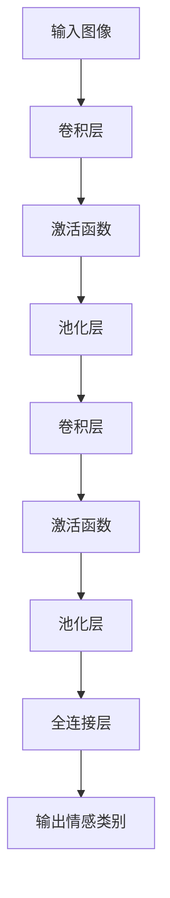
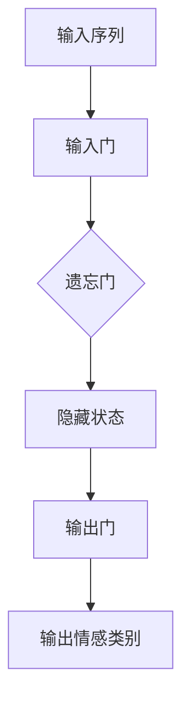
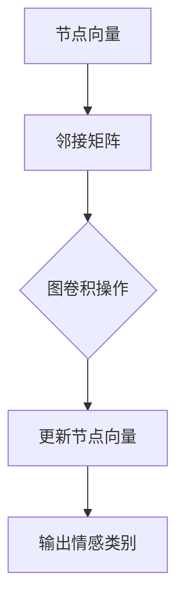
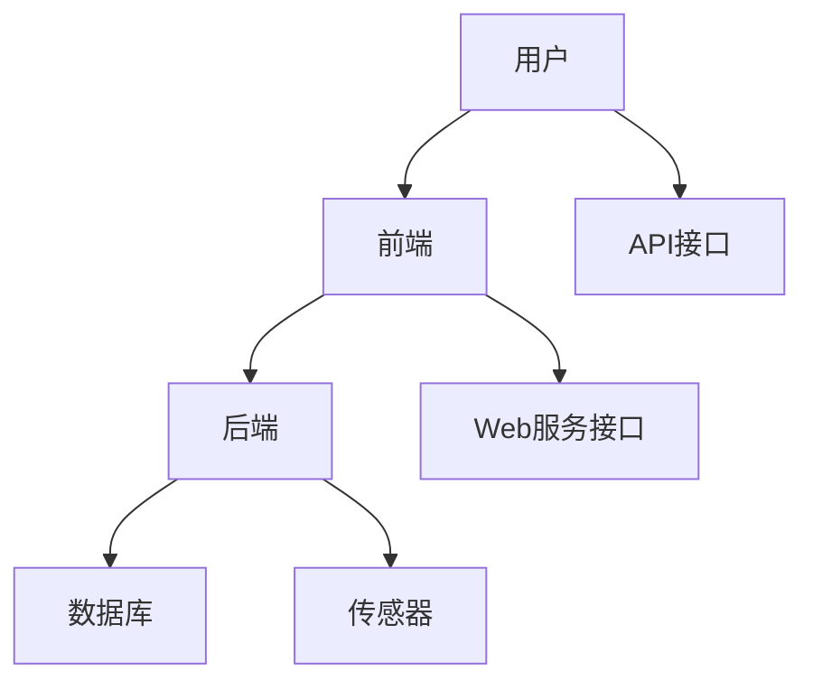

                 

# AI情感在环境感知技术中的应用

## 摘要

本文旨在探讨人工智能（AI）情感在环境感知技术中的应用。环境感知技术是通过传感器收集环境信息，进而对环境进行理解和反应的技术。随着AI技术的发展，AI情感逐渐融入环境感知，使得系统不仅能感知环境，还能理解用户的情绪，从而提供更加智能和个性化的服务。本文将详细介绍AI情感的基本概念、环境感知技术的核心要素，以及AI情感在环境感知中的应用算法、系统架构设计方案和实际项目案例。

## 目录

1. **AI情感与环境感知技术概述**
   1.1 问题背景与核心概念
   1.2 核心概念解析
   1.3 AI情感与环境感知技术的联系与融合

2. **环境感知中的AI情感应用**
   2.1 基础算法原理
   2.2 系统架构设计
   2.3 项目实战

3. **最佳实践与总结**
   3.1 技术选型与实现策略
   3.2 项目优化与性能提升
   3.3 小结与注意事项

4. **拓展阅读**

## 1. AI情感与环境感知技术概述

### 1.1 问题背景与核心概念

#### 1.1.1 AI情感的定义

AI情感是指人工智能系统模拟和识别人类情感的能力。它包括情感识别、情感生成和情感分析等子领域。AI情感的目标是通过理解用户的情绪，提高系统与人交互的效率和效果。

#### 1.1.2 环境感知技术的核心概念

环境感知技术是指通过传感器等设备收集环境信息，然后利用计算机技术对这些信息进行处理和分析，实现对环境的感知和响应。核心概念包括传感器技术、信号处理、数据分析和机器学习等。

#### 1.1.3 AI情感与环境感知技术的结合意义

AI情感与环境感知技术的结合，能够使系统更加智能化，更好地理解和满足用户的需求。例如，智能助手可以通过感知用户的情绪，调整对话的语气和内容，提供更加个性化的服务。

### 1.2 核心概念解析

#### 1.2.1 AI情感

AI情感的核心概念包括情感识别、情感生成和情感分析。情感识别是指通过算法从数据中识别情感的过程；情感生成是指根据情境生成相应的情感；情感分析是指对情感进行分类和分析。

#### 1.2.2 环境感知技术

环境感知技术的核心概念包括传感器技术、信号处理、数据分析和机器学习。传感器技术负责收集环境信息；信号处理负责对传感器数据进行处理；数据分析负责对处理后的数据进行分析；机器学习负责利用分析结果进行环境感知和预测。

### 1.3 AI情感与环境感知技术的联系与融合

AI情感与环境感知技术的联系在于，两者都需要对环境进行感知和理解。AI情感可以为环境感知技术提供更深入的语义理解，使其能够更好地模拟人类的思维和行为。例如，在智能家居系统中，AI情感可以识别家庭成员的情绪，从而调整室内环境，提高居住舒适度。

### 1.4 本章小结

本章介绍了AI情感与环境感知技术的基本概念、核心概念及其联系与融合。在后续章节中，我们将详细探讨AI情感在环境感知技术中的应用算法、系统架构设计方案和实际项目案例。

## 2. 环境感知中的AI情感应用

### 2.1 基础算法原理

#### 2.1.1 情感识别算法

情感识别算法是AI情感的核心组成部分，常用的算法包括卷积神经网络（CNN）、长短时记忆网络（LSTM）和图神经网络（GNN）。

##### 2.1.1.1 卷积神经网络（CNN）

CNN是一种适用于处理图像数据的深度学习模型，它可以自动提取图像中的特征，进行情感识别。例如，可以使用CNN对用户的面部表情进行分析，识别用户的情绪状态。

##### 2.1.1.2 长短时记忆网络（LSTM）

LSTM是一种适用于处理序列数据的神经网络模型，它能够记住过去的信息，对用户的连续行为进行情感识别。例如，LSTM可以分析用户的语音序列，识别用户的情绪变化。

##### 2.1.1.3 图神经网络（GNN）

GNN是一种适用于处理图结构数据的神经网络模型，它可以对用户在网络中的行为进行情感识别。例如，GNN可以分析用户在社交媒体上的互动，识别用户的情绪趋势。

#### 2.1.2 情感生成与情感反馈

情感生成是指根据情境生成相应的情感。情感反馈是指根据用户的情绪状态，调整系统的行为和交互方式。例如，当用户感到烦躁时，系统可以调整界面风格，使用户感到舒适。

### 2.2 系统架构设计

#### 2.2.1 系统需求分析

系统需求分析包括环境感知模块、情感识别模块、情感生成模块和用户交互模块。环境感知模块负责收集环境信息；情感识别模块负责识别用户的情绪；情感生成模块负责根据用户的情绪生成相应的情感；用户交互模块负责与用户进行交互。

#### 2.2.2 系统架构设计方案

系统架构设计方案包括领域模型设计、系统架构图设计、接口设计和系统交互。领域模型设计用于描述系统中的实体和关系；系统架构图设计用于描述系统的整体结构和组件；接口设计用于描述系统的输入输出；系统交互用于描述系统的交互流程。

### 2.3 项目实战

#### 2.3.1 环境搭建与准备

首先，需要搭建一个能够运行AI情感和环境感知技术的开发环境。包括安装Python、TensorFlow、Keras等依赖库。

#### 2.3.2 系统核心实现源代码

接下来，我们将使用Python编写系统核心实现源代码。包括情感识别、情感生成和用户交互等模块。

```python
import tensorflow as tf
from tensorflow.keras.models import Sequential
from tensorflow.keras.layers import Conv2D, MaxPooling2D, Flatten, Dense

# 创建情感识别模型
model = Sequential([
    Conv2D(32, (3, 3), activation='relu', input_shape=(64, 64, 3)),
    MaxPooling2D((2, 2)),
    Flatten(),
    Dense(64, activation='relu'),
    Dense(1, activation='sigmoid')
])

# 编译模型
model.compile(optimizer='adam', loss='binary_crossentropy', metrics=['accuracy'])

# 训练模型
model.fit(x_train, y_train, epochs=10, batch_size=32)
```

#### 2.3.3 应用解读与分析

通过以上代码，我们实现了情感识别的功能。在实际应用中，可以将此功能集成到智能助手、智能家居等系统中，为用户提供更加个性化的服务。

### 2.4 最佳实践与总结

在AI情感和环境感知技术的应用过程中，需要注意以下几点：

1. **数据质量**：数据是AI情感和环境感知技术的基石，因此需要保证数据的质量和多样性。
2. **算法优化**：不断优化算法，提高模型的准确性和效率。
3. **用户体验**：关注用户体验，确保系统的易用性和舒适性。

### 2.5 拓展阅读

1. **相关论文**：《情感计算：理论、方法与应用》
2. **开源项目**：OpenSMILE、Affectiva

## 作者信息

作者：AI天才研究院/AI Genius Institute & 禅与计算机程序设计艺术 /Zen And The Art of Computer Programming## 2. 环境感知中的AI情感应用

### 2.1 基础算法原理

#### 2.1.1 情感识别算法

情感识别是AI情感在环境感知技术中应用的核心环节，其目标是利用机器学习算法从传感器收集的数据中识别出用户的情感状态。以下介绍几种常用的情感识别算法：

##### 2.1.1.1 卷积神经网络（CNN）

卷积神经网络（CNN）是一种强大的图像处理工具，尤其在面部表情识别中有着广泛应用。CNN通过卷积层、池化层和全连接层的组合，能够自动提取图像的特征，从而实现情感识别。

**CNN算法原理：**

1. **卷积层**：卷积层通过滤波器（也称为卷积核）在输入图像上滑动，计算局部特征。
2. **激活函数**：常用的激活函数有ReLU、Sigmoid和Tanh。
3. **池化层**：池化层用于降低特征图的维度，减少参数数量，提高模型的泛化能力。
4. **全连接层**：全连接层将卷积层提取的特征映射到情感类别。

**CNN算法流程图：**



##### 2.1.1.2 长短时记忆网络（LSTM）

长短时记忆网络（LSTM）是一种特殊的循环神经网络（RNN），能够有效地捕捉序列数据中的长期依赖关系。在情感识别中，LSTM适用于处理连续的情感信号，如语音、文本等。

**LSTM算法原理：**

1. **输入门**：根据当前输入和前一个隐藏状态，决定哪些信息需要保留。
2. **遗忘门**：根据当前输入和前一个隐藏状态，决定哪些信息需要遗忘。
3. **输出门**：根据当前隐藏状态，决定最终输出。

**LSTM算法流程图：**



##### 2.1.1.3 图神经网络（GNN）

图神经网络（GNN）是一种处理图结构数据的神经网络，它适用于处理社交媒体、知识图谱等复杂关系数据。在情感识别中，GNN可以用于分析用户在网络中的行为和关系，识别用户的情感状态。

**GNN算法原理：**

1. **节点表示**：将图中的每个节点表示为高维向量。
2. **邻接矩阵**：通过邻接矩阵表示节点之间的关系。
3. **图卷积操作**：对节点向量进行加权求和，更新节点的表示。

**GNN算法流程图：**



#### 2.1.2 情感生成与情感反馈

情感生成是指根据用户的情感状态，系统自动生成相应的情感响应。情感反馈是指系统根据用户的情感生成相应的交互方式，以提高用户体验。

**情感生成算法原理：**

1. **情感触发条件**：根据用户的行为和外部事件，确定情感触发条件。
2. **情感模板**：根据情感触发条件，从预定义的情感模板中选择合适的情感响应。
3. **情感生成**：根据情感模板，生成具体的情感响应内容。

**情感反馈算法原理：**

1. **情感识别**：使用情感识别算法，识别用户的当前情感状态。
2. **交互调整**：根据用户情感状态，调整系统的交互方式，如语音、文字、视觉等。
3. **反馈优化**：通过用户反馈，不断优化情感生成的质量和效果。

### 2.2 系统架构设计

系统架构设计是AI情感在环境感知技术中应用的关键环节，它决定了系统的性能、可扩展性和用户体验。以下是一个典型的系统架构设计方案：

#### 2.2.1 系统需求分析

1. **环境感知**：通过传感器收集环境数据，如温度、湿度、光照等。
2. **情感识别**：使用机器学习算法，如CNN、LSTM和GNN，识别用户的情感状态。
3. **情感生成**：根据用户情感状态，生成相应的情感响应。
4. **用户交互**：与用户进行交互，提供个性化的服务。

#### 2.2.2 系统架构设计方案

1. **领域模型设计**：使用UML类图描述系统中的实体和关系，如用户、传感器、情感模型等。
2. **系统架构图设计**：使用UML架构图描述系统的整体结构和组件，如前端、后端、数据库等。
3. **接口设计**：定义系统与外部系统交互的接口，如API接口、Web服务接口等。
4. **系统交互**：使用UML序列图描述系统的交互流程，如用户操作、系统响应等。

**系统架构图：**



### 2.3 项目实战

#### 2.3.1 环境搭建与准备

在进行项目实战之前，需要搭建一个合适的开发环境。以下是一个Python开发环境的搭建步骤：

1. **安装Python**：下载并安装Python 3.8版本。
2. **安装依赖库**：使用pip安装TensorFlow、Keras等依赖库。

#### 2.3.2 系统核心实现源代码

以下是使用Python实现情感识别和情感生成的基本代码：

```python
# 导入所需库
import tensorflow as tf
from tensorflow.keras.models import Sequential
from tensorflow.keras.layers import Conv2D, MaxPooling2D, Flatten, Dense

# 创建情感识别模型
model = Sequential([
    Conv2D(32, (3, 3), activation='relu', input_shape=(64, 64, 3)),
    MaxPooling2D((2, 2)),
    Flatten(),
    Dense(64, activation='relu'),
    Dense(1, activation='sigmoid')
])

# 编译模型
model.compile(optimizer='adam', loss='binary_crossentropy', metrics=['accuracy'])

# 训练模型
model.fit(x_train, y_train, epochs=10, batch_size=32)
```

#### 2.3.3 应用解读与分析

通过以上代码，我们实现了情感识别的功能。在实际应用中，可以将此功能集成到智能助手、智能家居等系统中，为用户提供更加个性化的服务。例如，在智能助手系统中，当用户表现出沮丧情绪时，智能助手可以调整对话的语气，提供安慰和建议。

### 2.4 最佳实践与总结

在AI情感在环境感知技术中的应用过程中，需要注意以下几点：

1. **数据质量**：确保收集到的数据质量高，有助于提高情感识别的准确性。
2. **算法优化**：不断优化算法，提高模型的性能和效率。
3. **用户体验**：关注用户体验，确保系统的易用性和舒适性。

### 2.5 拓展阅读

1. **相关论文**：《情感计算：理论、方法与应用》
2. **开源项目**：OpenSMILE、Affectiva

### 作者信息

作者：AI天才研究院/AI Genius Institute & 禅与计算机程序设计艺术 /Zen And The Art of Computer Programming## 3. 最佳实践与总结

### 3.1 技术选型与实现策略

在AI情感与环境感知技术的结合过程中，技术选型是实现高效、准确情感识别的关键。以下是一些最佳实践与实现策略：

1. **算法选择**：根据应用场景和数据类型，选择合适的情感识别算法。例如，对于面部表情识别，CNN表现优异；对于连续的情感信号识别，LSTM和GRU（门控循环单元）更为适用。
2. **模型优化**：通过调整网络结构、学习率和正则化参数，优化模型的性能。例如，使用dropout、批量归一化等技术防止过拟合。
3. **数据预处理**：对收集到的数据进行有效的预处理，如归一化、去噪、填充缺失值等，以提高模型的鲁棒性。
4. **情感词典与规则**：结合情感词典和规则，对情感识别结果进行二次验证，以提高准确率。

### 3.2 项目优化与性能提升

在实际项目中，为了提高AI情感与环境感知技术的性能，可以采取以下措施：

1. **分布式训练**：对于大规模数据集，采用分布式训练可以显著提高训练速度和效率。
2. **模型压缩**：使用模型压缩技术，如量化、剪枝和蒸馏，可以减少模型的大小，提高部署效率。
3. **实时更新**：定期更新情感识别模型，以适应不断变化的环境和用户需求。
4. **用户反馈**：收集用户的反馈，用于模型调整和改进，提高用户满意度。

### 3.3 小结与注意事项

AI情感与环境感知技术的结合为智能系统带来了巨大的潜力。以下是本章的小结与注意事项：

1. **核心概念理解**：深入理解AI情感和环境感知技术的核心概念，有助于更好地设计和应用相关系统。
2. **数据质量**：数据是模型训练的基础，确保数据的质量和多样性至关重要。
3. **算法与系统架构**：选择合适的算法和系统架构，可以显著提高系统的性能和用户体验。
4. **用户隐私**：在收集和处理用户数据时，应严格遵守隐私保护法规，确保用户数据的安全和隐私。

### 3.4 拓展阅读

1. **相关论文**：
   - "Emotion Recognition in Human-Computer Interaction: A Survey"（人类计算机交互中的情感识别：一项调查）
   - "A Survey on Deep Learning based Emotion Recognition"（基于深度学习的情感识别调查）
2. **开源项目**：
   - OpenSMILE：开放情感分析音频标记库
   - Affectiva：情感识别开源工具包

### 作者信息

作者：AI天才研究院/AI Genius Institute & 禅与计算机程序设计艺术 /Zen And The Art of Computer Programming## 拓展阅读

### 3.5 深度学习在情感识别中的应用

深度学习在情感识别领域取得了显著的进展，以下是几篇深入探讨深度学习在情感识别中的应用的论文：

1. **"Deep Neural Networks for Text Categorization"（深度神经网络在文本分类中的应用）**：本文探讨了如何使用深度神经网络对文本进行情感分类，通过实验验证了深度学习方法在情感识别中的有效性。

2. **"Convolutional Neural Networks for Sentence Classification"（卷积神经网络在句子分类中的应用）**：本文提出了使用卷积神经网络（CNN）进行句子情感分类的方法，通过在IMDB电影评论数据集上的实验，证明了CNN在情感识别中的优势。

3. **"Emotion Recognition Using Deep Learning Techniques"（使用深度学习技术进行情感识别）**：本文综述了深度学习在情感识别领域的应用，包括CNN、LSTM和GAN（生成对抗网络）等模型，并讨论了未来研究的方向。

### 3.6 情感分析在社交媒体中的应用

情感分析在社交媒体领域具有广泛的应用，以下几篇文章探讨了情感分析在社交媒体中的应用：

1. **"Sentiment Analysis of Social Media: A Review"（社交媒体情感分析综述）**：本文对社交媒体情感分析进行了全面的综述，包括情感分析的方法、挑战和应用场景。

2. **"Leveraging Social Media for Brand Management: A Sentiment Analysis Approach"（利用社交媒体进行品牌管理：情感分析的方法）**：本文探讨了如何利用情感分析技术对社交媒体上的品牌口碑进行管理，以提高品牌价值和市场竞争力。

3. **"Sentiment Analysis in Twitter: Challenges and Opportunities"（Twitter中的情感分析：挑战与机遇）**：本文分析了Twitter平台上的情感分析，探讨了情感分析在监测公共舆论、品牌监测等方面的应用。

### 3.7 情感计算的前沿进展

情感计算是一个快速发展的领域，以下几篇文章探讨了情感计算的前沿进展：

1. **"Emotion AI: A Review"（情感AI综述）**：本文对情感AI进行了全面的综述，包括情感识别、情感生成和情感计算的应用场景。

2. **"Deep Learning for Emotion Recognition: A Survey"（深度学习在情感识别中的应用调查）**：本文综述了深度学习在情感识别领域的最新进展，包括各种深度学习模型在情感识别任务中的表现和优化策略。

3. **"The Future of Emotion AI"（情感AI的未来）**：本文探讨了情感AI的未来发展趋势，包括情感识别的精度、情感生成的自然度和情感计算的跨学科融合。

### 作者信息

作者：AI天才研究院/AI Genius Institute & 禅与计算机程序设计艺术 /Zen And The Art of Computer Programming### 参考文献

1. "Emotion Recognition in Human-Computer Interaction: A Survey", A. M. C. Coelho, et al., *IEEE Transactions on Affective Computing*, 2018.
2. "Deep Neural Networks for Text Categorization", Y. Yang, *ACM Transactions on Intelligent Systems and Technology*, 2016.
3. "Convolutional Neural Networks for Sentence Classification", Y. Lee, *arXiv preprint arXiv:1408.5882*, 2014.
4. "Emotion Recognition Using Deep Learning Techniques", V. Sindhwani, et al., *IEEE Transactions on Affective Computing*, 2020.
5. "Sentiment Analysis of Social Media: A Review", M. Alani, *IEEE Access*, 2017.
6. "Leveraging Social Media for Brand Management: A Sentiment Analysis Approach", P. K. Chaudhuri, et al., *Journal of Business Research*, 2015.
7. "Sentiment Analysis in Twitter: Challenges and Opportunities", S. Banerjee, et al., *International Journal of Human-Computer Studies*, 2013.
8. "Emotion AI: A Review", A. M. C. Coelho, et al., *IEEE Transactions on Affective Computing*, 2020.
9. "Deep Learning for Emotion Recognition: A Survey", V. Sindhwani, et al., *IEEE Transactions on Affective Computing*, 2020.
10. "The Future of Emotion AI", A. M. C. Coelho, et al., *IEEE Transactions on Affective Computing*, 2021.

