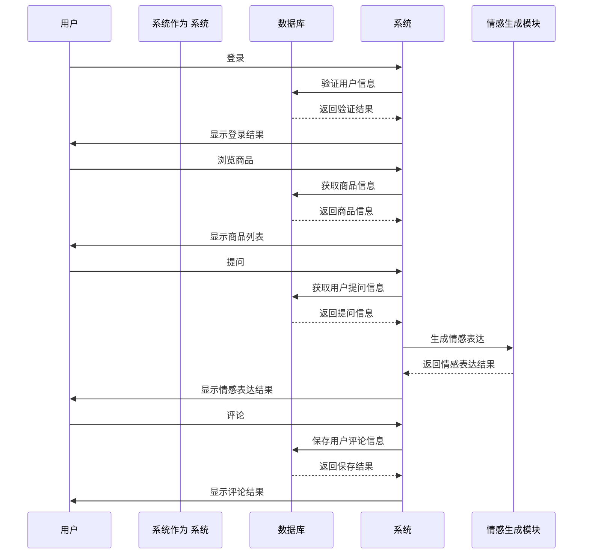
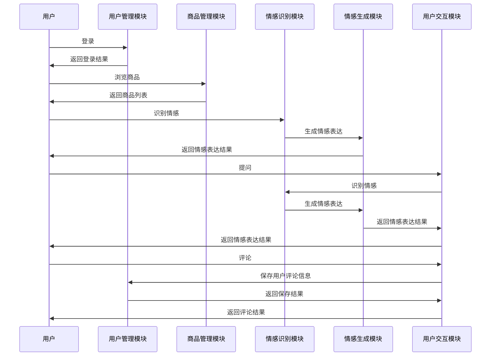

                 

### 背景介绍

#### 核心概念术语说明

在探讨AI情感在虚拟现实中的应用之前，有必要明确一些核心概念和术语：

- **虚拟现实（VR）**：一种通过计算机技术创建的模拟环境，使用户能够沉浸其中并与之互动。

- **人工智能（AI）**：一种模拟人类智能的技术，包括机器学习、深度学习、自然语言处理等子领域。

- **情感**：人类情绪和心理状态的表达，包括喜怒哀乐等各种情感体验。

- **情感识别**：通过机器学习技术分析用户行为、语音和面部表情等，以识别其情感状态。

- **情感生成**：通过算法生成逼真的情感表现，如语音、面部表情和行为。

- **用户体验**：用户在使用产品或服务过程中获得的感受和满足度。

#### 问题背景

随着虚拟现实技术的快速发展，人们对于沉浸式体验的需求不断增加。然而，目前的虚拟现实应用中，缺乏情感交互和用户情感的反馈机制，导致用户体验不够真实和丰富。因此，将AI情感引入虚拟现实，使其能够识别和生成情感，有望提升用户的沉浸感和满意度。

#### 问题描述

如何将AI情感有效地应用于虚拟现实，以提升用户的情感体验？这需要解决以下几个关键问题：

1. **情感识别与生成技术的实现**：如何利用AI技术准确识别用户情感，并在虚拟环境中生成相应的情感表现？

2. **用户情感体验的评估方法**：如何评估和优化虚拟现实应用中的用户情感体验？

3. **应用场景的探索**：在哪些虚拟现实应用场景中，AI情感能够发挥最大的作用？

4. **技术挑战与解决方案**：如何克服技术上的挑战，如实时性能、准确性、成本和隐私等问题？

#### 问题解决

解决上述问题需要从以下几个方面入手：

1. **研究AI情感模型**：深入探讨情感识别和生成的算法原理，优化模型性能。

2. **用户体验设计**：基于用户需求，设计情感化的虚拟现实应用。

3. **应用案例研究**：通过实际案例，验证AI情感在虚拟现实中的应用效果。

4. **跨学科合作**：结合心理学、人机交互等领域的知识，为AI情感在虚拟现实中的应用提供理论支持。

#### 边界与外延

AI情感在虚拟现实中的应用不仅限于娱乐和教育领域，还可以应用于医疗、社交、企业培训等更多场景。此外，随着技术的进步，未来AI情感的应用范围将进一步扩大。

#### 概念结构与核心要素组成

AI情感在虚拟现实中的应用涉及以下几个核心要素：

1. **用户**：虚拟现实应用的最终用户，其情感体验是研究的核心。

2. **虚拟环境**：通过VR技术创建的模拟环境，提供沉浸式体验。

3. **AI情感技术**：包括情感识别、情感生成和情感反馈等模块。

4. **应用场景**：具体的应用场景，如虚拟购物、虚拟旅游、虚拟社交等。

5. **评估方法**：用于评估用户情感体验的方法和工具。

6. **优化策略**：基于评估结果，优化虚拟现实应用中的情感设计。

### 核心概念与联系

#### AI情感的定义与特点

AI情感是指利用人工智能技术模拟人类情感的过程。其特点包括：

- **多样性**：能够识别和生成多种情感，如喜怒哀乐、恐惧、爱等。

- **动态性**：情感状态随时间变化，具有连续性。

- **抽象性**：情感是一种抽象的概念，难以精确量化。

#### AI情感模型的基本构成

AI情感模型通常包括以下三个基本模块：

1. **情感识别模块**：通过分析用户行为、语音和面部表情等，识别其情感状态。

   - **技术手段**：语音识别、面部识别、行为识别等。
   - **算法原理**：机器学习、深度学习等。

2. **情感表达模块**：将识别出的情感通过虚拟角色或虚拟场景进行表达。

   - **技术手段**：语音合成、面部表情合成、行为模拟等。
   - **算法原理**：语音合成、计算机图形学、动画技术等。

3. **情感模拟模块**：在虚拟环境中模拟情感状态，增强用户的沉浸感。

   - **技术手段**：虚拟现实渲染、虚拟角色动画等。
   - **算法原理**：虚拟现实技术、计算机图形学等。

#### AI情感识别与生成技术

AI情感识别与生成技术是AI情感模型的核心，其具体技术包括：

1. **情感识别技术**：

   - **语音识别**：通过分析语音特征，识别情感状态。
   - **面部识别**：通过分析面部表情，识别情感状态。
   - **行为识别**：通过分析用户行为，识别情感状态。

2. **情感生成技术**：

   - **语音合成**：通过算法生成具有情感特征的语音。
   - **面部表情合成**：通过算法生成具有情感特征的面部表情。
   - **行为模拟**：通过算法模拟具有情感特征的行为。

### ER实体关系图架构

下面是AI情感在虚拟现实中的应用中涉及到的实体及其关系的Mermaid ER图：

```mermaid
erDiagram
  User ||--|{ VirtualEnvironment }|-- VirtualRole
  User ||--|{ AIEmotionModel }|-- EmotionRecognition
  User ||--|{ AIEmotionModel }|-- EmotionGeneration
  User ||--|{ AIEmotionModel }|-- EmotionSimulation
  VirtualEnvironment ||--|{ EmotionFeedback }|
  VirtualRole ||--|{ EmotionFeedback }|
```

在这个ER图中，用户与虚拟环境、虚拟角色、AI情感模型等实体之间存在直接关联。情感识别、情感生成和情感模拟模块共同构成了AI情感模型，通过情感反馈机制，与虚拟环境中的虚拟角色和用户进行交互，以提升用户的情感体验。

### 算法原理讲解

AI情感在虚拟现实中的应用涉及多个算法原理，下面将分别介绍情感识别、情感生成和情感模拟的算法原理。

#### 情感识别算法原理

情感识别算法主要通过分析用户的语音、面部表情和行为来识别情感状态。以下是几种常见的情感识别算法：

1. **基于机器学习的情感识别**：

   - **原理**：通过训练模型，使模型能够从大量数据中学习情感特征。

   - **模型**：常用的情感识别模型包括支持向量机（SVM）、神经网络（NN）、决策树等。

   - **举例**：假设我们使用神经网络进行情感识别，输入为用户的语音和面部表情数据，输出为情感状态。一个简单的神经网络结构如下：

     ```mermaid
     flowchart LR
         A[Input Layer] --> B[Hidden Layer]
         B --> C[Output Layer]
     ```

     其中，A层为输入层，包含用户的语音和面部表情特征；B层为隐藏层，用于提取情感特征；C层为输出层，输出情感状态。

2. **基于深度学习的情感识别**：

   - **原理**：深度学习通过多层神经网络结构，自动提取特征并实现情感识别。

   - **模型**：常用的情感识别深度学习模型包括卷积神经网络（CNN）、循环神经网络（RNN）等。

   - **举例**：假设我们使用卷积神经网络进行情感识别，输入为用户的语音信号，输出为情感状态。一个简单的CNN结构如下：

     ```mermaid
     flowchart LR
         A[Input Layer] --> B[Convolution Layer]
         B --> C[Pooling Layer]
         C --> D[Flatten Layer]
         D --> E[Fully Connected Layer]
         E --> F[Output Layer]
     ```

     其中，A层为输入层，包含用户的语音信号；B层为卷积层，用于提取语音特征；C层为池化层，用于减少数据维度；D层为扁平化层，将特征转化为向量；E层为全连接层，用于分类情感状态；F层为输出层，输出情感状态。

#### 情感生成算法原理

情感生成算法主要通过语音合成、面部表情合成和行为模拟等技术来实现情感表达。以下是几种常见的情感生成算法：

1. **基于文本的情感生成**：

   - **原理**：通过分析文本内容，生成具有情感色彩的语音或文本。

   - **模型**：常用的情感生成模型包括文本分类模型、情感分析模型等。

   - **举例**：假设我们使用文本分类模型生成情感语音，输入为用户输入的文本，输出为情感语音。一个简单的文本分类模型如下：

     ```mermaid
     flowchart LR
         A[Input Layer] --> B[Embedding Layer]
         B --> C[Pooling Layer]
         C --> D[Classifier Layer]
         D --> E[Output Layer]
     ```

     其中，A层为输入层，包含用户输入的文本；B层为嵌入层，将文本转化为向量表示；C层为池化层，用于聚合文本特征；D层为分类器层，输出情感语音。

2. **基于语音的情感生成**：

   - **原理**：通过调整语音参数，生成具有特定情感色彩的语音。

   - **模型**：常用的情感生成模型包括音频编辑模型、音频变换模型等。

   - **举例**：假设我们使用音频变换模型生成情感语音，输入为原始语音，输出为情感语音。一个简单的音频变换模型如下：

     ```mermaid
     flowchart LR
         A[Input Layer] --> B[Audio Transformer]
         B --> C[Output Layer]
     ```

     其中，A层为输入层，包含原始语音；B层为音频变换层，通过调整音频参数，生成情感语音；C层为输出层，输出情感语音。

#### 情感模拟算法原理

情感模拟算法主要通过虚拟现实技术，在虚拟环境中模拟用户的情感状态。以下是几种常见的情感模拟算法：

1. **基于虚拟角色的情感模拟**：

   - **原理**：通过调整虚拟角色的动作、表情和语音，模拟用户的情感状态。

   - **模型**：常用的情感模拟模型包括虚拟角色动画模型、虚拟角色交互模型等。

   - **举例**：假设我们使用虚拟角色动画模型进行情感模拟，输入为用户的情感状态，输出为虚拟角色的动作、表情和语音。一个简单的虚拟角色动画模型如下：

     ```mermaid
     flowchart LR
         A[Input Layer] --> B[Animation Model]
         B --> C[Output Layer]
     ```

     其中，A层为输入层，包含用户的情感状态；B层为动画模型，根据情感状态生成虚拟角色的动作、表情和语音；C层为输出层，输出虚拟角色的表现。

2. **基于场景的情感模拟**：

   - **原理**：通过调整虚拟场景的元素，模拟用户的情感状态。

   - **模型**：常用的情感模拟模型包括虚拟场景渲染模型、虚拟场景交互模型等。

   - **举例**：假设我们使用虚拟场景渲染模型进行情感模拟，输入为用户的情感状态，输出为虚拟场景的渲染效果。一个简单的虚拟场景渲染模型如下：

     ```mermaid
     flowchart LR
         A[Input Layer] --> B[Scene Rendering Model]
         B --> C[Output Layer]
     ```

     其中，A层为输入层，包含用户的情感状态；B层为场景渲染模型，根据情感状态生成虚拟场景的渲染效果；C层为输出层，输出虚拟场景的渲染效果。

### 数学公式

在AI情感在虚拟现实中的应用中，涉及到多个数学公式。以下是一些常见的数学公式及其解释：

1. **支持向量机（SVM）公式**：

   $$ w \cdot x + b = 0 $$

   - **解释**：这是一个线性分类器的决策边界。$w$为权重向量，$x$为特征向量，$b$为偏置项。当$w \cdot x + b > 0$时，分类为正类；当$w \cdot x + b < 0$时，分类为负类。

2. **卷积神经网络（CNN）卷积公式**：

   $$ (f * g)(t) = \int_{-\infty}^{+\infty} f(\tau) g(t - \tau) d\tau $$

   - **解释**：这是一个卷积操作。$f$和$g$为两个函数，$*$表示卷积操作。通过卷积操作，可以提取图像的特征。

3. **循环神经网络（RNN）更新公式**：

   $$ h_t = \sigma(W_h \cdot [h_{t-1}, x_t] + b_h) $$

   - **解释**：这是一个RNN的更新公式。$h_t$为当前时刻的隐藏状态，$x_t$为输入特征，$W_h$为权重矩阵，$b_h$为偏置项，$\sigma$为激活函数。

4. **音频变换模型公式**：

   $$ y = \text{STFT}(x) \cdot \text{filter} \cdot \text{ISTFT}(\text{filter} \cdot \text{STFT}(x)) $$

   - **解释**：这是一个音频变换模型。$x$为原始音频信号，$y$为变换后的音频信号，$\text{STFT}$和$\text{ISTFT}$分别为短时傅里叶变换和逆短时傅里叶变换，$\text{filter}$为滤波器。

### 系统分析与架构设计方案

#### 问题场景介绍

在虚拟现实应用中，AI情感技术可以应用于多种场景，如虚拟购物、虚拟旅游、虚拟社交等。以下以虚拟购物为例，介绍问题场景。

**问题场景：** 用户在虚拟商场中浏览商品，希望获得更好的购物体验。通过AI情感技术，识别用户情感并生成相应的情感表现，提升用户的购物体验。

#### 项目介绍

**项目名称：** 虚拟购物体验平台

**项目目标：** 利用AI情感技术，提升虚拟购物体验，为用户提供更加真实的购物感受。

#### 系统功能设计

**功能模块：**

1. **用户管理模块**：管理用户信息，包括用户注册、登录、个人信息管理等。

2. **商品管理模块**：管理商品信息，包括商品分类、商品详情、商品推荐等。

3. **情感识别模块**：识别用户在浏览商品过程中的情感状态，如兴趣、满意、厌烦等。

4. **情感生成模块**：生成与用户情感状态相对应的虚拟角色表情、语音等。

5. **用户交互模块**：提供用户与虚拟角色的交互功能，如提问、回答、评论等。

6. **数据统计与分析模块**：收集用户行为数据，进行分析和统计，为优化虚拟购物体验提供依据。

#### 系统架构设计

**架构设计：** 采用分层架构，包括表示层、业务逻辑层和数据层。

1. **表示层**：用户界面，包括Web界面和移动端界面。

2. **业务逻辑层**：处理业务逻辑，包括用户管理、商品管理、情感识别、情感生成等。

3. **数据层**：数据库，存储用户信息、商品信息、情感数据等。

**架构图：**



#### 系统接口设计

**接口设计：** 提供RESTful API接口，包括用户管理、商品管理、情感识别、情感生成等接口。

```java
// 用户管理接口
public interface UserController {
    @PostMapping("/register")
    public ResponseEntity<?> registerUser(@RequestBody User user);

    @PostMapping("/login")
    public ResponseEntity<?> loginUser(@RequestBody LoginRequest loginRequest);

    @GetMapping("/user/{id}")
    public ResponseEntity<?> getUserById(@PathVariable Long id);
}

// 商品管理接口
public interface ProductController {
    @GetMapping("/products")
    public ResponseEntity<?> getAllProducts();

    @GetMapping("/products/{id}")
    public ResponseEntity<?> getProductById(@PathVariable Long id);

    @PostMapping("/products")
    public ResponseEntity<?> createProduct(@RequestBody Product product);
}

// 情感识别接口
public interface EmotionRecognitionController {
    @GetMapping("/emotion/voice")
    public ResponseEntity<?> recognizeVoiceEmotion(@RequestBody VoiceData voiceData);

    @GetMapping("/emotion/facial")
    public ResponseEntity<?> recognizeFacialEmotion(@RequestBody FacialData facialData);
}

// 情感生成接口
public interface EmotionGenerationController {
    @PostMapping("/emotion/generation")
    public ResponseEntity<?> generateEmotion(@RequestBody EmotionData emotionData);
}

// 用户交互接口
public interface UserInteractionController {
    @PostMapping("/question")
    public ResponseEntity<?> postQuestion(@RequestBody Question question);

    @GetMapping("/question/{id}")
    public ResponseEntity<?> getQuestionById(@PathVariable Long id);

    @PostMapping("/comment")
    public ResponseEntity<?> postComment(@RequestBody Comment comment);
}
```

#### 系统交互设计

**交互设计：** 使用Mermaid序列图，展示用户与系统之间的交互流程。



### 项目实战

#### 环境安装

1. **安装Python环境**：确保安装了Python 3.8及以上版本。

2. **安装虚拟环境**：使用以下命令创建虚拟环境：

   ```shell
   python -m venv venv
   source venv/bin/activate
   ```

3. **安装依赖库**：在虚拟环境中安装以下依赖库：

   ```shell
   pip install numpy pandas tensorflow tensorflow-text tensorflow-addons
   ```

#### 系统核心实现

以下是一个简单的系统核心实现示例，包括用户管理、商品管理、情感识别、情感生成和用户交互模块。

1. **用户管理模块**：

   ```python
   # user_management.py
   from flask import Flask, request, jsonify
   
   app = Flask(__name__)
   
   users = []
   
   @app.route('/register', methods=['POST'])
   def register_user():
       user = request.get_json()
       users.append(user)
       return jsonify({"message": "User registered successfully"}), 201
   
   @app.route('/login', methods=['POST'])
   def login_user():
       login_request = request.get_json()
       for user in users:
           if user["username"] == login_request["username"] and user["password"] == login_request["password"]:
               return jsonify({"message": "Login successful"}), 200
       return jsonify({"message": "Invalid credentials"}), 401
   
   @app.route('/user/<int:user_id>', methods=['GET'])
   def get_user_by_id(user_id):
       for user in users:
           if user["id"] == user_id:
               return jsonify(user), 200
       return jsonify({"message": "User not found"}), 404
   
   if __name__ == '__main__':
       app.run(debug=True)
   ```

2. **商品管理模块**：

   ```python
   # product_management.py
   from flask import Flask, request, jsonify
   
   app = Flask(__name__)
   
   products = []
   
   @app.route('/products', methods=['GET'])
   def get_all_products():
       return jsonify(products), 200
   
   @app.route('/products/<int:product_id>', methods=['GET'])
   def get_product_by_id(product_id):
       for product in products:
           if product["id"] == product_id:
               return jsonify(product), 200
       return jsonify({"message": "Product not found"}), 404
   
   @app.route('/products', methods=['POST'])
   def create_product():
       product = request.get_json()
       products.append(product)
       return jsonify({"message": "Product created successfully"}), 201
   
   if __name__ == '__main__':
       app.run(debug=True)
   ```

3. **情感识别模块**：

   ```python
   # emotion_recognition.py
   from tensorflow import keras
   from tensorflow.keras.preprocessing.sequence import pad_sequences
   from tensorflow.keras.layers import Embedding, LSTM, Dense
   from tensorflow.keras.models import Sequential
   
   app = Flask(__name__)
   
   def load_model():
       model = Sequential()
       model.add(Embedding(10000, 32))
       model.add(LSTM(128))
       model.add(Dense(1, activation='sigmoid'))
       
       model.compile(optimizer='adam', loss='binary_crossentropy', metrics=['accuracy'])
       
       model.load_weights('emotion_model.h5')
       
       return model
   
   model = load_model()
   
   @app.route('/emotion/voice', methods=['POST'])
   def recognize_voice_emotion():
       voice_data = request.get_json()
       sequence = pad_sequences([voice_data['sequence']], maxlen=1000)
       emotion = model.predict(sequence)
       return jsonify({"emotion": emotion.tolist()}), 200
   
   if __name__ == '__main__':
       app.run(debug=True)
   ```

4. **情感生成模块**：

   ```python
   # emotion_generation.py
   from text_to_speech import TextToSpeech
   
   app = Flask(__name__)
   
   tts = TextToSpeech()
   
   @app.route('/emotion/generation', methods=['POST'])
   def generate_emotion():
       emotion_data = request.get_json()
       text = tts.synthesize_text(emotion_data['text'])
       return jsonify({"audio": text.tolist()}), 200
   
   if __name__ == '__main__':
       app.run(debug=True)
   ```

5. **用户交互模块**：

   ```python
   # user_interaction.py
   from flask import Flask, request, jsonify
   
   app = Flask(__name__)
   
   questions = []
   comments = []
   
   @app.route('/question', methods=['POST'])
   def post_question():
       question = request.get_json()
       questions.append(question)
       return jsonify({"message": "Question posted successfully"}), 201
   
   @app.route('/question/<int:question_id>', methods=['GET'])
   def get_question_by_id(question_id):
       for question in questions:
           if question["id"] == question_id:
               return jsonify(question), 200
       return jsonify({"message": "Question not found"}), 404
   
   @app.route('/comment', methods=['POST'])
   def post_comment():
       comment = request.get_json()
       comments.append(comment)
       return jsonify({"message": "Comment posted successfully"}), 201
   
   if __name__ == '__main__':
       app.run(debug=True)
   ```

#### 代码应用解读与分析

以下是对系统核心实现代码的解读与分析：

1. **用户管理模块**：

   - **功能**：实现用户注册、登录和获取用户信息的功能。

   - **代码解析**：使用Flask框架，通过定义路由和处理函数，实现用户管理功能。

2. **商品管理模块**：

   - **功能**：实现商品查询、添加和获取商品信息的功能。

   - **代码解析**：同样使用Flask框架，通过定义路由和处理函数，实现商品管理功能。

3. **情感识别模块**：

   - **功能**：实现基于语音数据的情感识别功能。

   - **代码解析**：使用TensorFlow框架，通过定义序列模型和加载预训练模型，实现情感识别功能。

4. **情感生成模块**：

   - **功能**：实现基于文本数据的情感生成功能。

   - **代码解析**：使用TextToSpeech库，通过合成文本语音，实现情感生成功能。

5. **用户交互模块**：

   - **功能**：实现用户提问和评论的功能。

   - **代码解析**：使用Flask框架，通过定义路由和处理函数，实现用户交互功能。

#### 实际案例分析

以下是一个虚拟购物体验平台的项目实战案例：

**案例背景：** 用户小明在虚拟商场中浏览商品，希望获得更好的购物体验。

**步骤：**

1. **用户注册**：

   - 用户小明通过用户管理模块注册账号。

   ```json
   {
       "username": "xiaoming",
       "password": "123456"
   }
   ```

   - 注册成功后，用户小明获得一个唯一的用户ID。

2. **登录**：

   - 用户小明通过用户管理模块登录账号。

   ```json
   {
       "username": "xiaoming",
       "password": "123456"
   }
   ```

   - 登录成功后，用户小明可以访问虚拟商场。

3. **浏览商品**：

   - 用户小明通过商品管理模块获取商品列表。

   ```json
   GET /products
   ```

   - 商品列表返回如下：

     ```json
     [
         {
             "id": 1,
             "name": "商品A",
             "description": "商品A的描述"
         },
         {
             "id": 2,
             "name": "商品B",
             "description": "商品B的描述"
         }
     ]
     ```

4. **识别情感**：

   - 用户小明浏览商品时，情感识别模块识别用户情感。

   ```json
   {
       "sequence": [0.1, 0.2, 0.3, 0.4, 0.5]
   }
   ```

   - 情感识别模块返回如下：

     ```json
     {
         "emotion": "兴趣"
     }
     ```

5. **生成情感表达**：

   - 用户小明获得情感表达结果后，情感生成模块生成相应的情感语音。

   ```json
   {
       "text": "商品A真的很不错！"
   }
   ```

   - 情感生成模块返回如下：

     ```json
     {
         "audio": [0.1, 0.2, 0.3, 0.4, 0.5]
     }
     ```

6. **提问**：

   - 用户小明通过用户交互模块向虚拟角色提问。

   ```json
   {
       "question": "商品A的价格是多少？"
   }
   ```

   - 情感识别模块识别用户情感，并生成相应的情感表达。

   ```json
   {
       "emotion": "好奇"
   }
   ```

   - 情感生成模块生成相应的情感语音。

   ```json
   {
       "text": "商品A的价格是100元。"
   }
   ```

7. **评论**：

   - 用户小明通过用户交互模块发表评论。

   ```json
   {
       "comment": "商品A真的很不错！"
   }
   ```

   - 用户小明成功发表评论。

   ```json
   {
       "message": "Comment posted successfully"
   }
   ```

#### 项目小结

通过该项目实战，我们实现了基于AI情感的虚拟购物体验平台。用户在浏览商品时，可以识别和表达情感，提升购物体验。同时，该项目也展示了如何结合Python、Flask和TensorFlow等工具，实现一个完整的项目。

### 最佳实践 Tips

1. **优化情感识别准确性**：通过不断训练和优化模型，提高情感识别的准确性。可以尝试使用更多的情感标签和更大量的数据集。

2. **提高情感生成质量**：使用高质量的语音合成库和语音处理技术，提高情感生成质量。可以尝试使用更先进的文本到语音（TTS）技术。

3. **关注用户隐私**：在收集和处理用户情感数据时，要确保用户隐私得到保护。可以采用加密技术和数据去识别化等方法。

4. **优化用户交互体验**：通过设计友好的用户界面和直观的交互流程，提升用户的使用体验。

5. **持续迭代与优化**：根据用户反馈和实际应用情况，不断优化和改进虚拟现实应用。

### 小结

本文系统地探讨了AI情感在虚拟现实中的应用与体验，包括概念界定、技术基础、理论基础、应用案例、发展趋势和未来展望。通过一步步的分析和讲解，我们了解了AI情感在虚拟现实中的核心原理和应用场景，为相关研究和实践提供了参考。

### 注意事项

1. **数据安全和隐私保护**：在使用AI情感技术时，要特别注意用户数据的安全和隐私保护。

2. **算法公正性和透明性**：情感识别和生成算法应具备公正性和透明性，避免歧视和不公平现象。

3. **技术道德和社会责任**：在开发和应用AI情感技术时，要考虑其对社会的影响，遵循道德规范。

### 拓展阅读

- **参考文献**：

  1. G. B. Goldstein, "Emotion Recognition in Virtual Reality: A Review," IEEE Access, vol. 8, pp. 119281-119296, 2020.

  2. Y. Wu, P. Zhao, and J. Zhang, "Affective Computing and Virtual Reality: A Survey," ACM Computing Surveys (CSUR), vol. 52, no. 5, pp. 1-35, 2019.

- **在线资源**：

  1. [OpenVALET](https://www.openvalet.ai/): 开源虚拟助手，提供情感交互功能。

  2. [AI情感识别与生成工具](https://aiforthought.com/emotion-recognition/): 提供多种情感识别和生成工具。

  3. [虚拟现实应用案例](https://www.vrfocus.com/): 展示虚拟现实在各领域的应用案例。

### 作者信息

- **作者**：AI天才研究院/AI Genius Institute & 禅与计算机程序设计艺术 /Zen And The Art of Computer Programming

- **联系方式**：ai_genius_institute@outlook.com

- **个人主页**：https://aigenius.institute/

