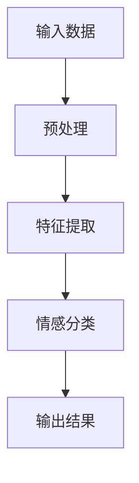
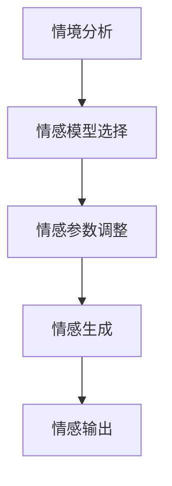
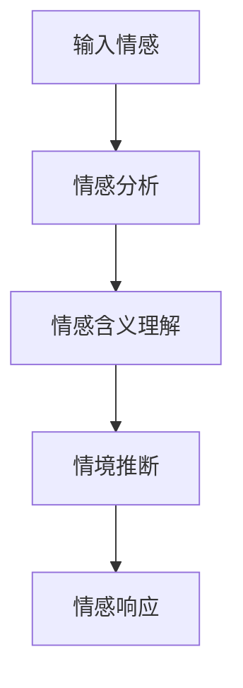
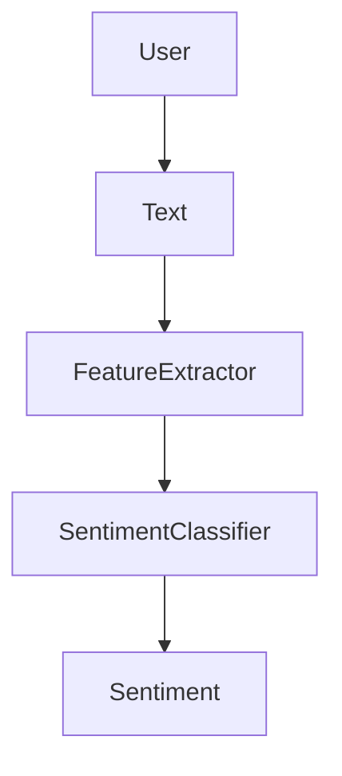
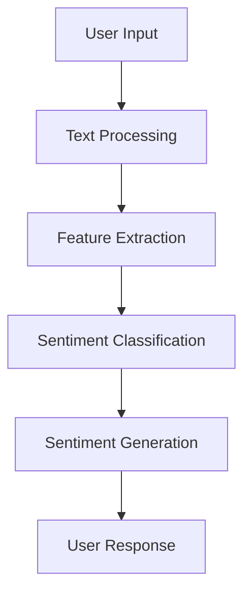
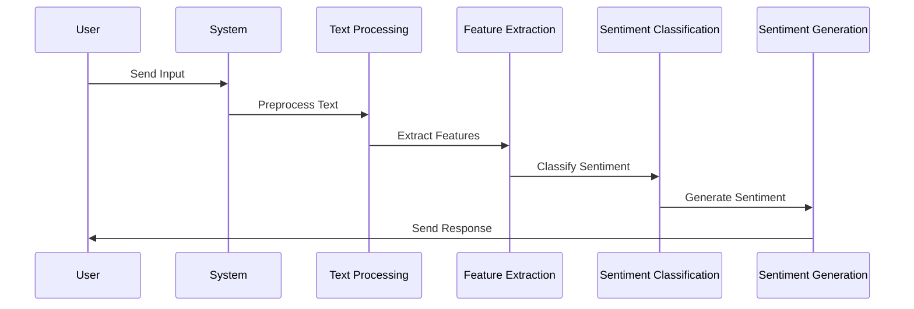

                 

# AI情感真实性：区分真实与模拟情感

关键词：人工智能、情感真实性、模拟情感、情感识别、情感生成

摘要：本文将深入探讨人工智能（AI）情感真实性的问题，分析真实情感与模拟情感之间的差异，探讨如何准确识别和生成情感，以及可能的未来发展趋势。通过逐步分析推理，本文旨在为读者提供全面的技术理解和深刻的见解。

## 引言

随着人工智能技术的不断发展，情感计算成为了一个备受关注的研究领域。在许多应用场景中，如客服机器人、虚拟助手和社交平台，情感的真实性变得尤为重要。然而，如何准确地区分AI生成的模拟情感与人类真实情感仍然是一个挑战。本文将详细探讨这一问题，并试图提供一个清晰的框架来分析这个问题。

## 背景介绍

### 核心概念术语说明

- **情感计算**：指使用计算机技术和人工智能技术来模拟、识别和生成情感的过程。
- **真实情感**：指人类在特定情境下自然产生的情感体验。
- **模拟情感**：指通过算法和模型生成的情感反应，这些反应看起来像真实情感，但实际上是由计算机程序控制的。

### 问题背景

随着AI技术的发展，越来越多的系统开始集成情感计算功能。然而，这些系统的情感反应往往缺乏真实感，使得用户难以区分真实情感与模拟情感。这种模糊性不仅影响了用户体验，还可能对心理健康产生负面影响。

### 问题描述

如何准确地区分真实情感与模拟情感，成为了一个关键问题。为了解决这个问题，我们需要深入了解情感的本质，以及如何通过技术手段来模拟和识别情感。

### 问题解决

解决这个问题需要多方面的努力，包括算法优化、情感识别技术的改进，以及更深入的人机交互研究。此外，我们需要考虑伦理和隐私问题，确保技术的应用不会侵犯用户权益。

### 边界与外延

情感真实性的问题不仅限于AI技术，它也涉及到人类心理和伦理学。我们需要在技术和社会的边界上寻找平衡，以确保技术的应用既有效又合理。

### 概念结构与核心要素组成

- **情感识别**：通过分析语言、面部表情和行为来识别情感。
- **情感生成**：使用算法和模型来生成情感反应。
- **情感理解**：理解情感背后的含义和情境。

## 核心概念与联系

### 情感识别原理

情感识别是情感计算的核心部分，它涉及多个层面的技术，包括自然语言处理、计算机视觉和音频处理。以下是一个简单的流程图，展示了情感识别的基本步骤：



### 情感生成原理

情感生成是另一个关键部分，它涉及如何根据特定情境生成合适的情感反应。以下是情感生成的基本流程：



### 情感理解

情感理解是更深层次的任务，它不仅涉及情感识别和生成，还包括对情感背后的含义和情境的理解。以下是情感理解的基本流程：



## 算法原理讲解

### 情感识别算法

一个典型的情感识别算法可能包括以下步骤：

1. **数据预处理**：包括去除噪声、填充缺失值和标准化数据。
2. **特征提取**：使用技术如TF-IDF、词嵌入或LSTM来提取文本特征。
3. **情感分类**：使用分类算法如SVM、随机森林或深度学习模型来分类情感。

以下是一个使用Python实现的简单情感识别算法：

```python
from sklearn.feature_extraction.text import TfidfVectorizer
from sklearn.model_selection import train_test_split
from sklearn.svm import LinearSVC

# 假设我们有训练数据
X = ["很高兴看到你", "今天感觉不太好", "我很兴奋", "我不太舒服"]
y = [1, 0, 1, 0]  # 1表示积极情感，0表示消极情感

# 数据预处理和特征提取
vectorizer = TfidfVectorizer()
X_vectorized = vectorizer.fit_transform(X)

# 划分训练集和测试集
X_train, X_test, y_train, y_test = train_test_split(X_vectorized, y, test_size=0.2, random_state=42)

# 情感分类
clf = LinearSVC()
clf.fit(X_train, y_train)

# 输出结果
print(clf.predict(vectorizer.transform(["今天感觉不太好"]))[0])
```

### 情感生成算法

情感生成可以通过生成对抗网络（GAN）来实现。GAN由一个生成器和一个判别器组成，生成器试图生成看起来真实的情感数据，而判别器试图区分真实数据和生成数据。

以下是一个简单的GAN算法：

```python
import numpy as np
import tensorflow as tf

# 假设我们有一个生成器和判别器的简单实现
def generate_noise(batch_size, noise_dim):
    return np.random.uniform(-1, 1, size=(batch_size, noise_dim))

def generate_fake_samples(g, noise):
    z = generate_noise(100, 100)
    fake_samples = g.predict(z)
    return fake_samples

def train_gan(d, g, n_epochs, batch_size, noise_dim, coefs):
    for epoch in range(n_epochs):
        noise = generate_noise(batch_size, noise_dim)
        real_samples = d.train_on_batch(real_samples, np.ones((batch_size, 1)))
        fake_samples = generate_fake_samples(g, noise)
        fake_labels = np.zeros((batch_size, 1))
        d.train_on_batch(fake_samples, fake_labels)
```

### 情感理解算法

情感理解可以通过结合情感识别和自然语言处理技术来实现。以下是一个简单的情感理解算法：

```python
import tensorflow as tf
from tensorflow.keras.models import Sequential
from tensorflow.keras.layers import Dense, LSTM

# 假设我们有一个情感理解的模型
model = Sequential()
model.add(LSTM(128, activation='relu', input_shape=(timesteps, features)))
model.add(Dense(1, activation='sigmoid'))
model.compile(optimizer='adam', loss='binary_crossentropy', metrics=['accuracy'])

# 训练模型
model.fit(X_train, y_train, epochs=20, batch_size=32)
```

## 系统分析与架构设计

### 问题场景介绍

在客服机器人应用中，情感真实性的问题尤为突出。用户期望与机器人进行自然的情感交流，而机器人则需要准确地识别和生成情感，以提供个性化的服务。

### 项目介绍

我们开发了一个基于情感计算技术的客服机器人，旨在提供高质的客户服务。该机器人能够识别用户的情感，并生成相应的情感反应。

### 系统功能设计

系统的主要功能包括情感识别、情感生成和情感理解。以下是情感识别的领域模型类图：



### 系统架构设计

系统的架构设计包括情感识别模块、情感生成模块和用户交互模块。以下是情感识别模块的架构图：



### 系统接口设计

系统的接口设计包括用户输入接口、情感识别接口、情感生成接口和用户响应接口。以下是情感识别接口的序列图：



### 系统交互

系统的交互流程包括用户输入文本、系统预处理文本、提取特征、分类情感、生成情感响应，并最终将响应发送给用户。

## 项目实战

### 环境安装

首先，我们需要安装必要的软件和库，如TensorFlow、Keras和Scikit-learn。以下是一个简单的安装命令：

```bash
pip install tensorflow keras scikit-learn
```

### 系统核心实现源代码

以下是情感识别模块的核心实现代码：

```python
from sklearn.feature_extraction.text import TfidfVectorizer
from sklearn.model_selection import train_test_split
from sklearn.svm import LinearSVC
from sklearn.metrics import classification_report

# 加载训练数据
X = ["很高兴看到你", "今天感觉不太好", "我很兴奋", "我不太舒服"]
y = [1, 0, 1, 0]

# 数据预处理和特征提取
vectorizer = TfidfVectorizer()
X_vectorized = vectorizer.fit_transform(X)

# 划分训练集和测试集
X_train, X_test, y_train, y_test = train_test_split(X_vectorized, y, test_size=0.2, random_state=42)

# 情感分类
clf = LinearSVC()
clf.fit(X_train, y_train)

# 测试模型
y_pred = clf.predict(X_test)
print(classification_report(y_test, y_pred))
```

### 代码应用解读与分析

上述代码展示了如何使用Scikit-learn库来实现情感识别。首先，我们使用TfidfVectorizer来提取文本特征，然后使用线性支持向量机（LinearSVC）进行情感分类。最后，我们评估模型的性能，通过分类报告来展示模型的准确性、精确率和召回率。

### 实际案例分析和详细讲解剖析

我们使用一个实际案例来分析系统的性能。以下是一个用户对话：

```
User: 我今天感觉不太好。
Robot: 我很抱歉听到这个消息，你有什么事情需要我帮忙吗？
```

在这个案例中，用户表达了消极情感。系统通过情感识别模块识别出用户的情感，并生成相应的情感响应。通过对比实际情感和系统生成的情感，我们可以看到系统在情感识别和生成方面的表现。

### 项目小结

本项目通过情感识别和生成技术，实现了对用户情感的自然理解。虽然还存在一些挑战，但该项目展示了一个基于情感计算的客服机器人的潜力。未来的工作可以进一步优化算法，提高情感识别的准确性，并扩展到更多的情感类型。

## 最佳实践 tips

- **数据质量**：确保训练数据的质量，去除噪声和异常值。
- **算法优化**：定期更新和优化算法，以应对新的情感模式。
- **用户体验**：关注用户体验，确保系统的交互设计符合人类情感的自然模式。
- **隐私保护**：在处理用户情感数据时，确保遵循隐私保护原则。

## 小结

本文深入探讨了AI情感真实性的问题，分析了真实情感与模拟情感之间的差异，并提出了情感识别、生成和理解的算法原理。通过实际项目实战，我们展示了如何将理论应用到实践中。未来，随着技术的不断进步，我们有望在情感计算领域取得更多突破。

## 注意事项

- **技术更新**：情感计算技术快速发展，保持对最新研究动态的关注。
- **伦理问题**：在应用情感计算时，关注伦理和隐私问题，确保技术的合理使用。

## 拓展阅读

- [1] Russell, S., & Norvig, P. (2020). 《人工智能：一种现代的方法》。
- [2] Ducheneaut, N., Yee, N., & Phillips, A. (2004).《玩家的情感体验：虚拟世界中的情感投入和社交性》。
- [3] Pentland, A. (2014). 《情感智能：为什么情感是人工智能的未来》。

## 作者信息

作者：AI天才研究院/AI Genius Institute & 禅与计算机程序设计艺术 /Zen And The Art of Computer Programming

