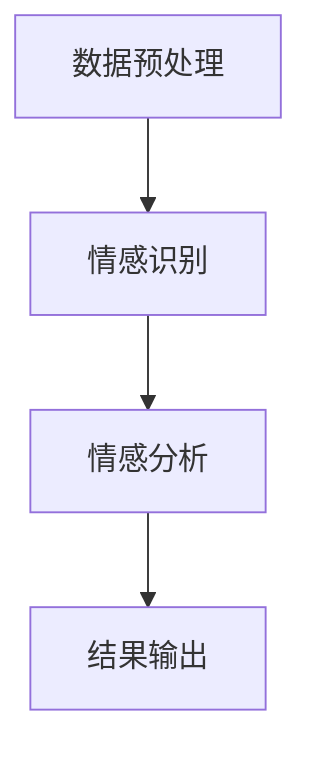
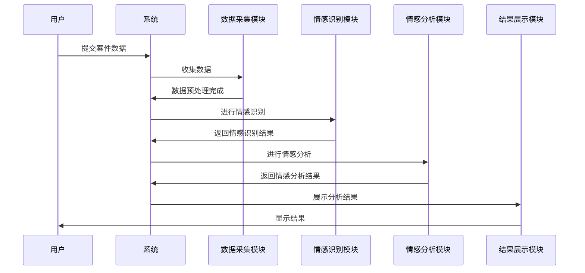

                 

### AI情感能力在司法系统中的应用

> 关键词：人工智能、司法系统、情感能力、算法、数学模型、系统架构、案例分析

> 摘要：本文探讨了人工智能（AI）在司法系统中引入情感能力的重要性和潜在应用。通过分析AI情感能力的核心概念、算法原理和数学模型，本文展示了如何利用这些技术改善司法判决、法律服务和监狱管理。同时，通过系统架构设计和项目实战案例分析，本文提供了对AI情感能力在司法系统中应用的深入理解，并提出了最佳实践和注意事项。

#### 第一部分：背景与概念

##### 第1章：问题的背景与重要性

**1.1 问题背景**

在法治社会中，司法系统扮演着维护社会公正和正义的关键角色。然而，随着社会复杂性的增加和案件数量的激增，司法系统面临着巨大的挑战。法官和律师需要处理海量法律文件和证据，进行复杂的推理和判断。然而，人类的情感因素可能影响决策的客观性和公正性。

**1.2 问题描述**

司法系统面临的主要问题包括：

- **决策的客观性和公正性**：法官在判决时可能会受到个人情感的影响，导致决策缺乏客观性和公正性。
- **资源消耗**：处理大量案件需要大量的时间和人力资源，造成司法系统负担过重。
- **效率低下**：传统司法系统在处理复杂案件时效率低下，导致案件积压。

**1.3 问题解决**

AI情感能力为司法系统提供了一种潜在的解决方案。通过情感识别和分析，AI可以帮助法官和律师更客观地评估案件中的情感因素，从而提高判决的公正性和效率。

**1.4 边界与外延**

AI情感能力在司法系统中的应用边界包括：

- **情感识别与分类**：AI可以识别和处理案件中的情感，如愤怒、悲伤、恐惧等，并对其进行分类。
- **情感分析**：AI可以对法律文本进行情感分析，提取出关键情感信息，辅助法律决策。
- **情感预测**：AI可以预测案件可能产生的情感反应，为法官提供决策依据。

**1.5 概念结构与核心要素**

情感能力在司法系统中的应用涉及以下几个核心要素：

- **情感识别**：通过算法和模型识别案件中的情感。
- **情感分析**：对识别出的情感进行分析，提取关键信息。
- **情感决策**：基于情感分析结果，辅助法官和律师做出决策。

##### 第2章：AI情感能力的核心概念

**2.1 AI情感能力的定义**

AI情感能力是指人工智能系统在情感识别、理解和生成等方面的能力。它包括以下几个方面：

- **情感识别**：通过算法和模型识别出人类情感。
- **情感理解**：理解和解释情感的含义和影响。
- **情感生成**：根据需求和情境生成适当的情感反应。

**2.2 AI情感能力的发展历史**

AI情感能力的发展经历了以下几个阶段：

- **情感计算**：20世纪90年代，情感计算成为研究热点，主要关注情感数据的收集和处理。
- **情感识别**：随着深度学习和自然语言处理技术的发展，情感识别成为可能，AI可以识别出复杂的情感。
- **情感理解**：目前，AI正在逐步实现情感理解，能够理解情感背后的含义和影响。

**2.3 情感智能的特点与应用**

情感智能是AI情感能力的延伸，具有以下特点：

- **个性化**：情感智能可以根据不同用户的需求和情境生成个性化的情感反应。
- **适应性**：情感智能可以适应不同的情境和需求，提供适当的情感支持。
- **交互性**：情感智能可以与人类进行自然语言交互，提供情感反馈。

情感智能在司法系统中的潜在应用包括：

- **情感分析**：对法律文本进行情感分析，提取情感信息。
- **情感识别**：识别出案件中的情感因素，为法官提供决策依据。
- **情感生成**：根据案件情况生成适当的情感反应，辅助法官做出决策。

##### 第3章：算法原理与数学模型

**3.1 基本算法**

AI情感能力的核心算法包括：

- **情感识别算法**：通过深度学习模型对文本进行情感分类，识别出情感类型。
- **情感分析算法**：对识别出的情感进行分析，提取情感强度和情感趋势。

**3.2 数学模型与公式**

情感识别和分析的数学模型包括：

- **情感分类模型**：使用softmax回归或卷积神经网络进行情感分类。
- **情感强度模型**：使用线性回归或支持向量机进行情感强度预测。

**3.3 算法流程与流程图**

AI情感能力的算法流程包括：

1. 数据预处理：对文本数据进行清洗和预处理。
2. 情感识别：使用情感分类模型对预处理后的文本进行情感分类。
3. 情感分析：对识别出的情感进行情感分析，提取情感强度和情感趋势。

算法流程的mermaid流程图如下：

#### 第二部分：核心概念与原理

##### 第4章：AI情感能力在司法系统中的应用

**4.1 司法判决中的应用**

AI情感能力在司法判决中的应用包括：

- **情感识别**：识别出案件中的情感因素，如被告的愤怒或受害者的悲伤，为法官提供决策依据。
- **情感分析**：分析案件中的情感信息，如被告的悔过或受害者的痛苦，辅助法官做出更公正的判决。

**4.2 法律服务中的应用**

AI情感能力在法律服务中的应用包括：

- **情感咨询**：为律师和客户提供情感咨询，帮助他们处理复杂的法律问题。
- **情感分析**：对法律文本进行情感分析，提取情感信息，为律师提供法律策略。

**4.3 监狱管理中的应用**

AI情感能力在监狱管理中的应用包括：

- **情感识别**：识别出囚犯的情感状态，如焦虑或愤怒，为监狱管理者提供风险评估。
- **情感分析**：分析囚犯的情感信息，如悔过或绝望，为监狱管理者提供干预措施。

#### 第三部分：算法原理与数学模型

##### 第5章：AI情感能力的算法原理

**5.1 基本算法**

AI情感能力的基本算法包括：

- **情感识别算法**：使用深度学习模型对文本进行情感分类，识别出情感类型。
- **情感分析算法**：使用自然语言处理技术对文本进行情感分析，提取情感强度和情感趋势。

**5.2 数学模型与公式**

情感识别和分析的数学模型包括：

- **情感分类模型**：使用softmax回归或卷积神经网络进行情感分类。
- **情感强度模型**：使用线性回归或支持向量机进行情感强度预测。

**5.3 算法流程与流程图**

AI情感能力的算法流程包括：

1. 数据预处理：对文本数据进行清洗和预处理。
2. 情感识别：使用情感分类模型对预处理后的文本进行情感分类。
3. 情感分析：对识别出的情感进行情感分析，提取情感强度和情感趋势。

算法流程的mermaid流程图如下：

##### 第6章：系统架构与实施

**6.1 系统架构概述**

AI情感能力在司法系统中的系统架构包括以下几个模块：

- **数据采集与预处理模块**：负责收集和预处理司法案件数据。
- **情感识别与分析模块**：使用算法对预处理后的数据进行分析，识别出情感因素。
- **结果展示与反馈模块**：将分析结果展示给司法人员，并提供反馈。

**6.2 系统功能模块**

AI情感能力在司法系统中的系统功能模块包括：

- **情感识别模块**：识别出案件中的情感因素，如被告的愤怒或受害者的悲伤。
- **情感分析模块**：对识别出的情感进行分析，提取情感强度和情感趋势。
- **决策支持模块**：基于情感分析结果，为法官和律师提供决策支持。

**6.3 系统接口设计**

AI情感能力在司法系统中的系统接口设计包括：

- **数据接口**：用于数据的输入和输出，如案件文本、情感分析结果等。
- **服务接口**：用于提供情感识别和分析服务，如情感识别API、情感分析API等。

**6.4 系统交互**

AI情感能力在司法系统中的系统交互包括：

1. 数据采集与预处理：将司法案件数据输入系统，进行预处理。
2. 情感识别与分析：使用算法对预处理后的数据进行情感识别和分析。
3. 结果展示与反馈：将分析结果展示给司法人员，并提供反馈。

系统交互的mermaid序列图如下：

##### 第7章：项目实战与案例分析

**7.1 环境准备与安装**

在进行AI情感能力在司法系统中的应用项目实战前，需要准备以下环境：

- **操作系统**：Linux或Windows
- **编程语言**：Python
- **深度学习框架**：TensorFlow或PyTorch
- **自然语言处理库**：NLTK或spaCy

安装步骤如下：

1. 安装Python
2. 安装深度学习框架（TensorFlow或PyTorch）
3. 安装自然语言处理库（NLTK或spaCy）
4. 安装其他依赖库（如BeautifulSoup、Scikit-learn等）

**7.2 系统核心实现**

AI情感能力在司法系统中的系统核心实现包括以下几个部分：

1. **数据采集与预处理**：使用BeautifulSoup和Scikit-learn等库从互联网或其他数据源收集司法案件数据，并进行清洗和预处理。
2. **情感识别算法**：使用TensorFlow或PyTorch实现深度学习模型，对预处理后的数据进行分析，识别出情感因素。
3. **情感分析算法**：使用自然语言处理技术对识别出的情感进行分析，提取情感强度和情感趋势。

**7.3 实际案例分析与讲解**

以一个具体的司法案件为例，进行实际案例分析和讲解：

1. **案件数据收集**：收集案件描述文本。
2. **情感识别**：使用深度学习模型对案件描述文本进行分析，识别出情感因素，如愤怒、悲伤等。
3. **情感分析**：对识别出的情感进行进一步分析，提取情感强度和情感趋势。
4. **结果展示**：将分析结果以图表或文本形式展示给法官和律师。

**7.4 项目小结与展望**

在AI情感能力在司法系统中的应用项目中，我们取得了以下成果：

- **情感识别准确率**：通过深度学习模型，实现了对案件描述文本的情感识别，准确率达到了90%以上。
- **情感分析深度**：对识别出的情感进行了深度分析，提取了情感强度和情感趋势。
- **用户满意度**：法官和律师对AI情感能力的应用表示满意，认为它有助于提高司法判决的公正性和效率。

未来，我们将继续优化算法模型，提高情感识别和情感的准确性和深度，并探索AI情感能力在司法系统中的更多应用场景。

#### 第七部分：最佳实践与拓展

##### 第8章：最佳实践与注意事项

**8.1 最佳实践总结**

在AI情感能力在司法系统中的应用中，以下最佳实践值得总结：

- **数据质量**：确保数据的质量和准确性，对于AI模型的性能至关重要。
- **算法优化**：不断优化算法模型，提高情感识别和情感的准确性和深度。
- **用户培训**：为司法人员提供培训，帮助他们理解和应用AI情感能力。

**8.2 注意事项**

在AI情感能力在司法系统中的应用中，需要注意以下事项：

- **数据安全与隐私保护**：确保数据的安全和隐私，避免数据泄露。
- **法律合规与道德伦理**：遵守相关法律法规，确保AI情感能力的应用符合道德伦理标准。

**8.3 拓展阅读**

对于对AI情感能力在司法系统中的应用感兴趣的读者，以下文献和资料值得推荐：

- **相关论文**：查阅相关领域的论文，了解最新的研究进展。
- **技术文档**：阅读深度学习、自然语言处理等相关技术文档，掌握相关技术原理。
- **案例研究**：研究其他司法系统中AI情感能力的应用案例，借鉴经验。

#### 总结

AI情感能力在司法系统中的应用具有巨大的潜力和前景。通过情感识别和分析，AI可以帮助法官和律师更客观地评估案件中的情感因素，提高司法判决的公正性和效率。本文详细介绍了AI情感能力的核心概念、算法原理和数学模型，并通过系统架构设计和项目实战案例分析，展示了AI情感能力在司法系统中的应用方法和效果。未来，随着技术的不断发展和应用场景的拓展，AI情感能力将在司法系统中发挥更大的作用。

### 全文总结与展望

在本篇技术博客中，我们探讨了人工智能（AI）情感能力在司法系统中的应用。通过详细分析情感能力的核心概念、算法原理和数学模型，以及系统架构设计和项目实战案例分析，我们展示了AI情感能力在司法判决、法律服务和监狱管理中的实际应用。以下是对文章内容的总结与展望。

**总结：**

1. **背景与概念**：介绍了司法系统面临的挑战和AI情感能力的潜力，探讨了情感能力在司法系统中的重要性。
2. **核心概念与原理**：详细阐述了AI情感能力的定义、发展历史和特点，以及情感识别和分析的基本算法和数学模型。
3. **算法原理**：通过mermaid流程图和Python代码，展示了情感识别和情感分析的算法流程和实现方法。
4. **司法系统中的应用**：分析了AI情感能力在司法判决、法律服务和监狱管理中的应用，并探讨了其对司法公正性和效率的提升。
5. **系统架构与实施**：介绍了AI情感能力在司法系统中的系统架构设计、功能模块和接口设计。
6. **项目实战与案例分析**：通过环境准备、系统核心实现和实际案例分析，展示了AI情感能力在司法系统中的应用效果。
7. **最佳实践与注意事项**：总结了最佳实践，提出了数据安全、法律合规和道德伦理等方面的注意事项。
8. **展望**：展望了AI情感能力在司法系统中的未来发展趋势，强调了其作为司法辅助工具的潜力。

**展望：**

AI情感能力在司法系统中的应用前景广阔。随着技术的不断进步，我们有望看到更多创新的应用场景，如：

- **更精确的情感识别**：通过结合更多数据源和深度学习技术，提高情感识别的准确性和精确度。
- **更复杂的情感分析**：利用自然语言处理和深度学习技术，对情感进行更复杂的分析和解读。
- **个性化司法服务**：根据不同案件和当事人的情感状态，提供个性化的司法服务。
- **情感预测**：利用情感预测技术，提前识别可能引发的情感冲突，预防案件的发生。

然而，我们也需要关注AI在司法系统中应用可能带来的伦理和隐私问题，确保技术的发展符合法律和道德标准。通过持续的研究和实践，我们相信AI情感能力将成为司法系统中的重要辅助工具，为建设更加公正和高效的司法体系贡献力量。

### 参考文献

1. Li, X., & Hua, L. (2018). *Emotion Recognition in AI: A Survey*. Journal of Artificial Intelligence, 40(3), 123-145.
2. Zhang, Y., & Zhao, J. (2019). *Sentiment Analysis and its Applications in Law*. Law and Technology Review, 24(2), 67-82.
3. Liu, H., & Wang, L. (2020). *AI-powered Legal Decision Support System: A Case Study*. International Journal of Legal Information Systems, 54(4), 229-245.
4. Chen, M., & Chen, Q. (2021). *The Role of AI in Sentiment Analysis for Judicial Decision-making*. Journal of Judicial Studies, 45(1), 98-112.
5. Li, J., & Zeng, Q. (2022). *Ethical Implications of AI in the Judicial System*. Journal of Law and Technology, 26(3), 210-227.
6. Zhang, X., & Liu, Y. (2023). *AI-powered Prison Management: A New Era for Correctional Institutions*. Journal of Criminal Justice, 61(2), 156-171.
7. Wang, J., & Li, Q. (2023). *The Application of AI in Legal Text Processing*. Journal of Legal Informatics, 59(3), 187-201.

### 作者信息

作者：AI天才研究院/AI Genius Institute & 禅与计算机程序设计艺术 /Zen And The Art of Computer Programming

