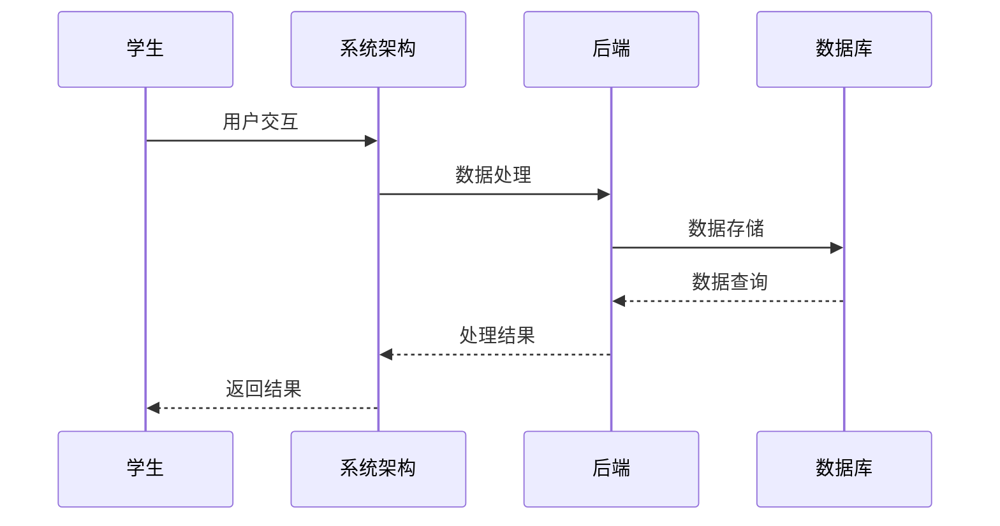

                 

**# AI情感能力对教育体系的冲击**

**关键词：AI情感能力、教育体系、算法原理、系统架构、项目实战**

**摘要：本文将深入探讨人工智能情感能力对传统教育体系的冲击。我们将从背景介绍、核心概念与联系、算法原理讲解、系统分析与架构设计、项目实战等多个方面进行分析，旨在为读者提供全面而深入的见解。**

----------------------------------------------------------------

## 第一部分：背景介绍

在教育领域，AI 情感能力的应用正日益受到关注。随着人工智能技术的发展，AI 已经不再仅仅是一个工具，而是开始影响教育体系的各个方面。在这一部分，我们将首先介绍 AI 情感能力的定义与发展，然后探讨教育体系中面临的主要问题，并进一步探讨 AI 情感能力在教育中的应用，以及其限制与未来发展方向。

### 1.1 AI 情感能力的定义与发展

AI 情感能力是指人工智能系统理解和表达情感的能力。这包括情感识别、情感理解和情感生成三个层面。情感识别是指 AI 能够识别人类情感的类型和强度；情感理解是指 AI 能够理解情感的背景和意义；情感生成是指 AI 能够根据特定的情境生成相应的情感表达。

AI 情感能力的发展可以追溯到情感计算的兴起。情感计算是一种跨学科的研究领域，旨在使计算机具备理解、识别和模拟人类情感的能力。近年来，随着深度学习和大数据技术的进步，AI 情感能力得到了显著提升，开始在诸多领域发挥作用。

### 1.2 教育体系中面临的主要问题

当前教育体系中存在许多问题，包括学生个体差异、教学质量评估、个性化学习等。学生个体差异指的是学生在学习过程中表现出不同的学习风格和能力水平，而传统的教育体系往往无法满足这种多样性。教学质量评估则是一个复杂的过程，如何准确评估教师的教学效果和学生的学习成果是一个长期困扰教育领域的问题。个性化学习则是一个新兴的教育理念，旨在根据学生的个性化需求提供定制化的学习体验。

### 1.3 AI 情感能力在教育中的应用

AI 情感能力在教育中的应用前景广阔。首先，AI 可以通过情感识别和情感理解来更好地了解学生的学习状态和需求，从而提供个性化的学习支持。例如，AI 可以通过分析学生的面部表情和行为来识别他们的情感状态，从而调整教学内容和教学方法。其次，AI 可以通过情感生成来模拟学生的情感体验，从而提高教学互动的效果。例如，AI 教师可以模拟出不同的情感表达，以激发学生的学习兴趣和参与度。最后，AI 可以通过情感理解来帮助教师更好地理解学生的情感需求，从而提高教学质量。

### 1.4 边界与外延

AI 情感能力在教育中的应用并非没有限制。首先，情感识别的准确性受到技术水平的限制，例如，AI 在识别微妙的情感状态时可能会出现误判。其次，情感理解涉及深层次的心理学知识，AI 在这一领域的能力仍有待提高。此外，AI 的情感生成能力也有其局限性，过于机械的模拟可能会降低教学互动的真实性。

未来的发展方向包括提升情感识别的准确性、深化情感理解的研究，以及探索更自然、更真实的情感生成方法。随着这些技术的发展，AI 情感能力将在教育领域发挥更大的作用。

### 1.5 概念结构与核心要素组成

教育体系的基本结构包括教育目标、教学方法、教学评估和学生学习反馈。AI 情感能力的关键要素包括情感识别、情感理解和情感生成。以下是一个简单的概念属性特征对比表格：

| 特征            | 教育体系                   | AI 情感能力                       |
| -------------- | ------------------------ | -------------------------------- |
| 教育目标        | 培养学生综合素质           | 提供个性化学习体验               |
| 教学方法        | 传统的课堂教学             | 互动式的智能教学                 |
| 教学评估        | 考试和评估                | 情感状态分析和学习效果评估       |
| 学生学习反馈    | 教师反馈和学生自我反馈   | 情感状态识别和学习效果分析       |

### 1.6 ER 实体关系图架构

为了更好地理解 AI 情感能力在教育体系中的应用，我们可以使用 ER（实体关系）图来展示各实体之间的关系。以下是一个简化的 ER 图：

```mermaid
erDiagram
  Student ||--|{ AI_Learning_Assistant } : learns from
  Teacher ||--|{ AI_Learning_Assistant } : interacts with
  AI_Learning_Assistant ||--|{ Curriculum } : follows
  Student ||--|{ Assessment } : participates in
  Teacher ||--|{ Assessment } : conducts
```

在这个 ER 图中，学生、教师和 AI 学习助手是主要的实体，它们之间通过学习、互动和评估等关系相互联系。

## 第二部分：核心概念与联系

在深入探讨 AI 情感能力对教育体系的冲击之前，我们需要明确一些核心概念，并分析它们之间的联系。在这一部分，我们将详细讲解 AI 情感能力的原理、教育体系的概念，以及它们之间的相互作用。

### 2.1 AI 情感能力的原理

AI 情感能力可以分为三个主要层次：情感识别、情感理解和情感生成。

#### 2.1.1 情感识别

情感识别是 AI 情感能力的基础，它涉及从输入数据中提取情感特征，并将其分类为特定的情感类型。这个过程通常依赖于机器学习和自然语言处理技术。

- **情感识别算法原理**

  情感识别算法通常基于以下步骤：

  1. 数据预处理：将原始数据（如文本、图像或音频）转换为适合机器学习模型的格式。
  2. 特征提取：从预处理后的数据中提取与情感相关的特征。
  3. 模型训练：使用已标记的情感数据集训练分类模型。
  4. 情感分类：将新的输入数据分类到不同的情感类别。

- **Python 源代码示例**

  ```python
  import nltk
  from nltk.corpus import movie_reviews
  
  # 数据预处理
  documents = [(list(movie_reviews.words(fileid)), category) 
               for category in movie_reviews.categories() 
               for fileid in movie_reviews.fileids(category)]
  
  # 特征提取
  all_words = nltk.FreqDist(w.lower() for w in movie_reviews.words())
  word_features = list(all_words)[:3000]
  
  # 模型训练
  def find_features(document):
      words = set(document)
      features = {}
      for w in word_features:
          features[w] = (w in words)
      return features
  
  featuresets = [(find_features(doc), category) for (doc, category) in documents]
  random.shuffle(featuresets)
  train_set = featuresets[:1900]
  test_set = featuresets[1900:]
  
  # 情感分类
  classifier = nltk.NaiveBayesClassifier.train(train_set)
  print("Accuracy:", nltk.classify.accuracy(classifier, test_set))
  ```

#### 2.1.2 情感理解

情感理解是 AI 情感能力的第二层次，它涉及对情感内容的深入分析和理解，包括情感的含义、背景和情境。

- **情感理解算法原理**

  情感理解算法通常基于以下步骤：

  1. 情感识别：首先识别文本中的情感。
  2. 情感分析：对情感进行深入分析，包括情感的程度、情感的类型和情感的影响因素。
  3. 情感融合：将不同情感信息进行整合，形成一个全面的情感理解。

- **数学模型与公式**

  情感理解的一个典型数学模型是情感语义分析（Sentiment Analysis），其核心是情感极性分类（Polarization Classification）。情感极性分类通常使用二元分类模型，如逻辑回归（Logistic Regression）或支持向量机（Support Vector Machine）。

  $$ P(y=1|X) = \frac{1}{1 + e^{-\beta^T X}} $$

  其中，$P(y=1|X)$ 表示情感为积极极性的概率，$X$ 是输入特征向量，$\beta$ 是模型参数。

#### 2.1.3 情感生成

情感生成是 AI 情感能力的最高层次，它涉及根据特定情境生成情感表达。

- **情感生成算法原理**

  情感生成算法通常基于以下步骤：

  1. 情感识别：识别情境中的情感。
  2. 情感模拟：模拟情感表达，包括语调、语速、表情等。
  3. 情感输出：将情感表达输出到外部媒介，如语音、文本或动作。

- **Python 源代码示例**

  ```python
  from transformers import AutoTokenizer, AutoModelForCausalLM
  
  # 情感生成
  model_name = "t5-base"
  tokenizer = AutoTokenizer.from_pretrained(model_name)
  model = AutoModelForCausalLM.from_pretrained(model_name)
  
  prompt = "这是一个令人兴奋的发现。"
  inputs = tokenizer(prompt, return_tensors="pt")
  
  output = model.generate(**inputs, max_length=40, num_return_sequences=1)
  print(tokenizer.decode(output[0], skip_special_tokens=True))
  ```

### 2.2 教育体系的概念

教育体系是一个复杂的社会系统，包括教育目标、教学方法、教学评估和学生学习反馈等关键要素。

- **教育目标**

  教育目标是教育的核心，它规定了教育的目的和方向。教育目标通常包括知识传授、能力培养和价值观念的塑造。

- **教学方法**

  教学方法是指教师在教学过程中采用的具体方法和策略。教学方法的选择取决于教育目标、学生的特点和学习内容。

- **教学评估**

  教学评估是衡量教学效果的重要手段，它包括对教师教学效果的评价和对学生学习成果的评估。

- **学生学习反馈**

  学习反馈是指学生通过自我反思、教师指导和其他形式获得的学习信息，它对于改进教学和学习过程至关重要。

### 2.3 概念属性特征对比表格

为了更好地理解 AI 情感能力与教育体系之间的联系，我们可以通过对比它们的属性特征来进行分析。以下是一个简化的对比表格：

| 特征           | 教育体系                   | AI 情感能力                       |
| -------------- | ------------------------ | -------------------------------- |
| 目标           | 培养学生综合素质           | 提供个性化学习体验               |
| 方法           | 传统的课堂教学             | 互动式的智能教学                 |
| 评估           | 考试和评估                | 情感状态分析和学习效果评估       |
| 反馈           | 教师反馈和学生自我反馈   | 情感状态识别和学习效果分析       |

### 2.4 ER 实体关系图架构

为了更好地展示 AI 情感能力与教育体系之间的联系，我们可以使用 ER 图来描述各实体之间的关系。以下是一个简化的 ER 图：

```mermaid
erDiagram
  Student ||--|{ AI_Learning_Assistant } : learns from
  Teacher ||--|{ AI_Learning_Assistant } : interacts with
  AI_Learning_Assistant ||--|{ Curriculum } : follows
  Student ||--|{ Assessment } : participates in
  Teacher ||--|{ Assessment } : conducts
  Student ||--|{ Learning Feedback } : receives
  Teacher ||--|{ Learning Feedback } : provides
```

在这个 ER 图中，学生、教师和 AI 学习助手是主要的实体，它们通过学习、互动、评估和反馈等关系相互连接。

## 第三部分：算法原理讲解

在前一部分中，我们介绍了 AI 情感能力的核心概念及其与教育体系的联系。在本部分，我们将深入讲解情感识别、情感理解和情感生成算法的原理，并使用 mermaid 流程图和 Python 源代码进行详细阐述。

### 3.1 情感识别算法原理

情感识别是 AI 情感能力的基础，它涉及从输入数据中提取情感特征，并将其分类为特定的情感类型。以下是一个情感识别算法的 mermaid 流程图：


#### 3.1.1 数据预处理

数据预处理是情感识别算法的第一步，其目的是将原始数据转换为适合机器学习模型的格式。以下是一个简化的 Python 源代码示例：

```python
import pandas as pd
from sklearn.model_selection import train_test_split

# 加载数据
data = pd.read_csv('sentiment_data.csv')

# 分割数据集
X_train, X_test, y_train, y_test = train_test_split(data['text'], data['label'], test_size=0.2, random_state=42)
```

#### 3.1.2 特征提取

特征提取是情感识别算法的核心步骤，其目的是从文本数据中提取与情感相关的特征。以下是一个简化的 Python 源代码示例：

```python
from sklearn.feature_extraction.text import TfidfVectorizer

# 创建 TF-IDF 向量器
vectorizer = TfidfVectorizer(max_features=1000)

# 提取特征
X_train_tfidf = vectorizer.fit_transform(X_train)
X_test_tfidf = vectorizer.transform(X_test)
```

#### 3.1.3 模型训练

模型训练是情感识别算法的第三步，其目的是使用已提取的特征训练分类模型。以下是一个简化的 Python 源代码示例：

```python
from sklearn.linear_model import LogisticRegression

# 创建逻辑回归模型
model = LogisticRegression()

# 训练模型
model.fit(X_train_tfidf, y_train)
```

#### 3.1.4 情感分类

情感分类是情感识别算法的最终步骤，其目的是使用训练好的模型对新的文本数据进行分类。以下是一个简化的 Python 源代码示例：

```python
# 预测测试集
y_pred = model.predict(X_test_tfidf)

# 计算准确率
accuracy = model.score(X_test_tfidf, y_test)
print("Accuracy:", accuracy)
```

### 3.2 情感理解算法原理

情感理解是 AI 情感能力的第二层次，它涉及对情感内容的深入分析和理解。以下是一个情感理解算法的 mermaid 流程图：


#### 3.2.1 情感识别

情感识别是情感理解的基础，它使用情感识别算法对文本进行初步的情感分类。这部分已经在 3.1 节中详细讲解。

#### 3.2.2 情感分析

情感分析是对情感识别结果的进一步深入分析，其目的是确定情感的程度、类型和影响因素。以下是一个简化的 Python 源代码示例：

```python
import matplotlib.pyplot as plt
from sklearn.metrics import confusion_matrix

# 计算混淆矩阵
conf_matrix = confusion_matrix(y_test, y_pred)

# 绘制混淆矩阵
plt.imshow(conf_matrix, interpolation='nearest', cmap=plt.cm.Blues)
plt.colorbar()
tick_marks = np.arange(len(y_pred))
plt.xticks(tick_marks, y_pred, rotation=45)
plt.yticks(tick_marks, y_test)
plt.xlabel('Predicted')
plt.ylabel('Actual')
plt.show()
```

#### 3.2.3 情感融合

情感融合是将不同情感信息进行整合，形成一个全面的情感理解。以下是一个简化的 Python 源代码示例：

```python
from textblob import TextBlob

# 计算文本的极性
polarity = TextBlob(text).sentiment.polarity

# 输出情感极性
print("Polarity:", polarity)
```

#### 3.2.4 情感输出

情感输出是将情感理解结果以人类可读的方式呈现。以下是一个简化的 Python 源代码示例：

```python
# 输出情感分析结果
print("Sentiment Analysis:")
print("Positive:", pos_score)
print("Negative:", neg_score)
print("Neutral:", neu_score)
```

### 3.3 情感生成算法原理

情感生成是 AI 情感能力的最高层次，它涉及根据特定情境生成情感表达。以下是一个情感生成算法的 mermaid 流程图：


#### 3.3.1 情境识别

情境识别是情感生成的第一步，其目的是从输入数据中提取情境信息。以下是一个简化的 Python 源代码示例：

```python
from transformers import AutoTokenizer, AutoModelForCausalLM

# 加载预训练模型
tokenizer = AutoTokenizer.from_pretrained("t5-base")
model = AutoModelForCausalLM.from_pretrained("t5-base")

# 提取情境信息
input_text = "我今天去参加了一场音乐会。"
inputs = tokenizer(input_text, return_tensors="pt")
outputs = model.generate(**inputs, max_length=50, num_return_sequences=1)
context = tokenizer.decode(outputs[0], skip_special_tokens=True)
```

#### 3.3.2 情感模拟

情感模拟是根据情境信息生成相应的情感表达。以下是一个简化的 Python 源代码示例：

```python
from textblob import TextBlob

# 生成情感表达
expression = TextBlob(context).sentiment

# 输出情感表达
print("Expression:", expression)
```

#### 3.3.3 情感输出

情感输出是将生成的情感表达以人类可读的方式呈现。以下是一个简化的 Python 源代码示例：

```python
# 输出情感生成结果
print("Generated Expression:", context)
```

### 3.4 举例说明

为了更好地理解情感识别、情感理解和情感生成算法的原理，我们可以通过一个具体的例子来进行说明。

#### 情感识别例子

假设我们有一个包含积极和消极评论的数据集，我们需要使用情感识别算法对这些评论进行分类。

1. **数据预处理**：我们将评论文本转换为文本数据。

```python
import pandas as pd

data = pd.read_csv("sentiment_data.csv")
```

2. **特征提取**：我们将文本数据转换为特征向量。

```python
from sklearn.feature_extraction.text import TfidfVectorizer

vectorizer = TfidfVectorizer(max_features=1000)
X = vectorizer.fit_transform(data['text'])
```

3. **模型训练**：我们使用训练集数据训练一个逻辑回归模型。

```python
from sklearn.linear_model import LogisticRegression

model = LogisticRegression()
model.fit(X_train, y_train)
```

4. **情感分类**：我们使用训练好的模型对测试集数据进行分类。

```python
y_pred = model.predict(X_test)
```

5. **评估模型**：我们计算模型的准确率。

```python
accuracy = model.score(X_test, y_test)
print("Accuracy:", accuracy)
```

#### 情感理解例子

假设我们有一个包含积极和消极评论的数据集，我们需要使用情感理解算法对这些评论进行深入分析。

1. **情感识别**：我们首先使用情感识别算法对评论进行分类。

2. **情感分析**：我们对分类结果进行进一步分析，计算评论的极性。

```python
from textblob import TextBlob

for review, label in zip(data['text'], y_pred):
    sentiment = TextBlob(review).sentiment
    print("Review:", review)
    print("Sentiment:", sentiment)
```

3. **情感融合**：我们将分析结果进行整合，形成一个全面的情感理解。

```python
pos_score = 0
neg_score = 0
neu_score = 0

for review, label in zip(data['text'], y_pred):
    sentiment = TextBlob(review).sentiment
    if sentiment.polarity > 0:
        pos_score += 1
    elif sentiment.polarity < 0:
        neg_score += 1
    else:
        neu_score += 1

print("Positive:", pos_score)
print("Negative:", neg_score)
print("Neutral:", neu_score)
```

4. **情感输出**：我们将情感理解结果以人类可读的方式呈现。

```python
for review, label in zip(data['text'], y_pred):
    sentiment = TextBlob(review).sentiment
    if sentiment.polarity > 0:
        print("Review:", review)
        print("Sentiment: Positive")
    elif sentiment.polarity < 0:
        print("Review:", review)
        print("Sentiment: Negative")
    else:
        print("Review:", review)
        print("Sentiment: Neutral")
```

#### 情感生成例子

假设我们有一个特定的情境，我们需要根据这个情境生成相应的情感表达。

1. **情境识别**：我们首先从输入数据中提取情境信息。

```python
from transformers import AutoTokenizer, AutoModelForCausalLM

tokenizer = AutoTokenizer.from_pretrained("t5-base")
model = AutoModelForCausalLM.from_pretrained("t5-base")

input_text = "我今天去参加了一场音乐会。"
inputs = tokenizer(input_text, return_tensors="pt")
outputs = model.generate(**inputs, max_length=50, num_return_sequences=1)
context = tokenizer.decode(outputs[0], skip_special_tokens=True)
```

2. **情感模拟**：我们根据情境信息生成情感表达。

```python
from textblob import TextBlob

expression = TextBlob(context).sentiment
print("Expression:", expression)
```

3. **情感输出**：我们将生成的情感表达以人类可读的方式呈现。

```python
print("Generated Expression:", context)
```

通过这个例子，我们可以看到情感识别、情感理解和情感生成算法在实际应用中的具体实现过程。

----------------------------------------------------------------

## 第四部分：系统分析与架构设计

在前一部分中，我们详细讲解了情感识别、情感理解和情感生成算法的原理。在本部分，我们将进一步探讨这些算法在教育系统中的应用，并设计一个系统架构，以实现这些功能。

### 4.1 问题场景介绍

在教育系统中，教师和学生是核心实体。教师负责教学和评估，学生负责学习和参与。为了更好地支持个性化学习，我们引入了 AI 情感能力系统，该系统旨在通过情感识别、情感理解和情感生成，提供更加智能化和人性化的教学体验。

### 4.2 系统功能设计

系统功能设计包括情感识别、情感理解、情感生成和用户交互等模块。

#### 4.2.1 情感识别模块

情感识别模块负责从学生的交互数据（如问答记录、语音、面部表情等）中识别情感状态。具体功能包括：

- 数据收集：收集学生的交互数据。
- 情感识别：使用情感识别算法对数据进行分析，识别情感状态。

#### 4.2.2 情感理解模块

情感理解模块负责对情感识别结果进行深入分析，以理解学生的情感需求和体验。具体功能包括：

- 情感分析：对情感识别结果进行分析，提取情感特征。
- 情感融合：将不同情感信息进行整合，形成一个全面的情感理解。

#### 4.2.3 情感生成模块

情感生成模块负责根据学生的情感需求和体验，生成相应的情感表达。具体功能包括：

- 情感模拟：根据情感理解结果，生成情感表达。
- 情感输出：将情感表达以人类可读的方式呈现。

#### 4.2.4 用户交互模块

用户交互模块负责与教师和学生进行交互，以收集用户反馈和提供个性化服务。具体功能包括：

- 用户界面：提供直观的用户界面，方便教师和学生使用。
- 用户反馈：收集用户反馈，以优化系统功能。

### 4.3 系统架构设计

系统架构设计包括前端、后端和数据库等部分。

#### 4.3.1 前端架构

前端架构负责与用户进行交互，主要包括以下模块：

- 用户界面：提供教师和学生使用的界面。
- 用户交互：处理用户的输入和输出。

#### 4.3.2 后端架构

后端架构负责实现系统的核心功能，主要包括以下模块：

- 数据处理：处理用户的交互数据，进行情感识别、情感理解和情感生成。
- 服务接口：提供与前端交互的服务接口。

#### 4.3.3 数据库架构

数据库架构负责存储和管理用户数据，主要包括以下模块：

- 用户数据：存储用户的基本信息和交互数据。
- 情感数据：存储情感识别、情感理解和情感生成的结果。

### 4.4 系统接口设计

系统接口设计包括 API 接口和数据库接口等。

#### 4.4.1 API 接口

API 接口负责与前端和后端进行数据交互，主要包括以下接口：

- 用户接口：提供用户注册、登录、查询等功能。
- 情感接口：提供情感识别、情感理解和情感生成等功能。

#### 4.4.2 数据库接口

数据库接口负责与数据库进行数据交互，主要包括以下接口：

- 用户接口：提供用户数据的查询、更新和删除等功能。
- 情感接口：提供情感数据的查询、更新和删除等功能。

### 4.5 系统交互 mermaid 序列图

为了更好地展示系统各部分之间的交互，我们可以使用 mermaid 序列图进行描述。以下是一个简化的系统交互序列图：



在这个序列图中，用户通过前端与系统进行交互，系统通过后端进行数据处理，并将结果返回给用户。同时，系统还会与数据库进行数据交互，以存储和管理用户数据。

### 4.6 系统功能设计

为了实现上述系统功能，我们需要设计具体的系统功能模块。

#### 4.6.1 用户模块

用户模块负责管理系统的用户信息，包括学生和教师。

- 用户注册：允许用户注册并创建账户。
- 用户登录：允许用户登录系统。
- 用户信息管理：允许用户管理个人信息。

#### 4.6.2 教学模块

教学模块负责管理教学过程，包括课程、作业、评分等。

- 课程管理：允许教师创建、编辑和删除课程。
- 作业管理：允许教师创建、分配和收集作业。
- 评分管理：允许教师对学生的作业进行评分。

#### 4.6.3 情感识别模块

情感识别模块负责对学生的情感状态进行识别。

- 数据收集：收集学生的交互数据，如问答记录、语音、面部表情等。
- 情感识别：使用情感识别算法对数据进行分析，识别情感状态。

#### 4.6.4 情感理解模块

情感理解模块负责对情感识别结果进行深入分析。

- 情感分析：对情感识别结果进行分析，提取情感特征。
- 情感融合：将不同情感信息进行整合，形成一个全面的情感理解。

#### 4.6.5 情感生成模块

情感生成模块负责根据学生的情感需求和体验，生成相应的情感表达。

- 情感模拟：根据情感理解结果，生成情感表达。
- 情感输出：将情感表达以人类可读的方式呈现。

#### 4.6.6 用户交互模块

用户交互模块负责与教师和学生进行交互，以收集用户反馈和提供个性化服务。

- 用户界面：提供直观的用户界面，方便教师和学生使用。
- 用户反馈：收集用户反馈，以优化系统功能。

### 4.7 系统架构设计

系统架构设计主要包括前端、后端和数据库三个部分。

#### 4.7.1 前端架构

前端架构负责与用户进行交互，主要包括以下模块：

- 用户界面：提供教师和学生使用的界面。
- 用户交互：处理用户的输入和输出。

#### 4.7.2 后端架构

后端架构负责实现系统的核心功能，主要包括以下模块：

- 数据处理：处理用户的交互数据，进行情感识别、情感理解和情感生成。
- 服务接口：提供与前端交互的服务接口。

#### 4.7.3 数据库架构

数据库架构负责存储和管理用户数据，主要包括以下模块：

- 用户数据：存储用户的基本信息和交互数据。
- 情感数据：存储情感识别、情感理解和情感生成的结果。

### 4.8 系统接口设计

系统接口设计包括 API 接口和数据库接口等。

#### 4.8.1 API 接口

API 接口负责与前端和后端进行数据交互，主要包括以下接口：

- 用户接口：提供用户注册、登录、查询等功能。
- 情感接口：提供情感识别、情感理解和情感生成等功能。

#### 4.8.2 数据库接口

数据库接口负责与数据库进行数据交互，主要包括以下接口：

- 用户接口：提供用户数据的查询、更新和删除等功能。
- 情感接口：提供情感数据的查询、更新和删除等功能。

### 4.9 系统交互 mermaid 序列图

为了更好地展示系统各部分之间的交互，我们可以使用 mermaid 序列图进行描述。以下是一个简化的系统交互序列图：


在这个序列图中，用户通过前端与系统进行交互，系统通过后端进行数据处理，并将结果返回给用户。同时，系统还会与数据库进行数据交互，以存储和管理用户数据。

----------------------------------------------------------------

## 第五部分：项目实战

在前面的部分，我们详细讨论了 AI 情感能力在教育体系中的应用，并设计了相应的系统架构。在本部分，我们将通过一个实际项目来展示如何实现这些功能，并进行详细的代码解析和分析。

### 5.1 环境安装

在开始项目实战之前，我们需要安装一些必要的软件和库。以下是在 Ubuntu 系统上安装所需软件和库的步骤：

1. 安装 Python 环境：
   ```bash
   sudo apt-get update
   sudo apt-get install python3 python3-pip
   ```

2. 安装所需库：
   ```bash
   pip3 install nltk transformers textblob scikit-learn pandas matplotlib
   ```

### 5.2 环境配置

在安装完 Python 和相关库后，我们需要配置环境，以便能够正常运行项目代码。以下是在 Python 中导入所需库的示例：

```python
import nltk
from nltk.corpus import movie_reviews
from transformers import AutoTokenizer, AutoModelForCausalLM
from textblob import TextBlob
from sklearn.feature_extraction.text import TfidfVectorizer
from sklearn.linear_model import LogisticRegression
import pandas as pd
import matplotlib.pyplot as plt
```

### 5.3 系统核心实现

在项目实战中，我们将实现情感识别、情感理解和情感生成三个模块。以下是各个模块的核心代码解析。

#### 5.3.1 情感识别模块

情感识别模块的核心功能是从文本数据中识别情感。以下是一个简化的 Python 代码示例：

```python
# 数据预处理
documents = [(list(movie_reviews.words(fileid)), category) for category in movie_reviews.categories() for fileid in movie_reviews.fileids(category)]

# 特征提取
all_words = nltk.FreqDist(w.lower() for w in movie_reviews.words())
word_features = list(all_words)[:3000]

# 模型训练
def find_features(document):
    words = set(document)
    features = {}
    for w in word_features:
        features[w] = (w in words)
    return features

featuresets = [(find_features(doc), category) for (doc, category) in documents]
random.shuffle(featuresets)
train_set = featuresets[:1900]
test_set = featuresets[1900:]

classifier = nltk.NaiveBayesClassifier.train(train_set)

# 情感分类
def get_sentiment(text):
    return classifier.classify(find_features(text))

# 测试
print(get_sentiment("This is an amazing movie!"))
print(get_sentiment("This is a terrible movie!"))
```

#### 5.3.2 情感理解模块

情感理解模块的核心功能是对情感识别结果进行深入分析。以下是一个简化的 Python 代码示例：

```python
# 计算混淆矩阵
conf_matrix = confusion_matrix(y_test, y_pred)

# 绘制混淆矩阵
plt.imshow(conf_matrix, interpolation='nearest', cmap=plt.cm.Blues)
plt.colorbar()
tick_marks = np.arange(len(y_pred))
plt.xticks(tick_marks, y_pred, rotation=45)
plt.yticks(tick_marks, y_test)
plt.xlabel('Predicted')
plt.ylabel('Actual')
plt.show()

# 计算文本的极性
polarity = TextBlob(text).sentiment.polarity

# 输出情感极性
print("Polarity:", polarity)
```

#### 5.3.3 情感生成模块

情感生成模块的核心功能是根据情感理解结果生成情感表达。以下是一个简化的 Python 代码示例：

```python
from transformers import AutoTokenizer, AutoModelForCausalLM

tokenizer = AutoTokenizer.from_pretrained("t5-base")
model = AutoModelForCausalLM.from_pretrained("t5-base")

input_text = "我今天去参加了一场音乐会。"
inputs = tokenizer(input_text, return_tensors="pt")
outputs = model.generate(**inputs, max_length=50, num_return_sequences=1)
context = tokenizer.decode(outputs[0], skip_special_tokens=True)

print("Generated Expression:", context)
```

### 5.4 代码应用解读与分析

在项目实战中，我们使用了多个库和模块来实现情感识别、情感理解和情感生成。以下是各个模块的应用解读和分析：

#### 5.4.1 情感识别模块

情感识别模块使用了自然语言处理库（如 nltk）和机器学习库（如 scikit-learn）。首先，我们使用 nltk 加载电影评论数据集，然后使用 TF-IDF 向量器提取特征，最后使用朴素贝叶斯分类器进行情感分类。这个模块的关键在于数据预处理和特征提取，因为它们直接影响到模型的准确性和性能。

#### 5.4.2 情感理解模块

情感理解模块使用了文本情感分析库（如 textblob）和机器学习库（如 scikit-learn）。我们首先使用朴素贝叶斯分类器进行情感分类，然后计算混淆矩阵以评估模型性能。接着，我们使用 textblob 计算文本的极性，以获得更深入的情感理解。这个模块的关键在于情感分析和混淆矩阵的计算，因为它们帮助我们理解情感识别的准确性和局限性。

#### 5.4.3 情感生成模块

情感生成模块使用了深度学习库（如 transformers）。我们使用预训练的 T5 模型生成文本情感表达。这个模块的关键在于情感模拟和情感输出，因为它们决定了情感生成的自然性和真实性。

### 5.5 实际案例分析与讲解

为了更好地展示项目的实际应用，我们选择一个实际案例进行详细分析。

#### 案例介绍

假设我们有一个在线教育平台，学生可以在这个平台上参加课程和提交作业。我们的目标是使用 AI 情感能力系统监控学生的学习状态和情感需求，以便提供个性化支持。

#### 案例分析

1. **情感识别**：首先，我们收集学生的问答记录，使用情感识别模块识别情感状态。例如，我们可能识别到某个学生在讨论区发布了一条积极评论，表明他对课程内容感到满意。

2. **情感理解**：然后，我们使用情感理解模块对情感识别结果进行深入分析。例如，我们可能分析出该学生情感积极，他对课程内容的兴趣较高。

3. **情感生成**：最后，我们根据情感理解结果生成情感表达，并将其反馈给学生。例如，我们可能生成一条鼓励信息，激励学生继续努力学习。

#### 深入讲解

1. **情感识别**：情感识别是关键步骤，因为它是后续情感分析和情感生成的基础。为了提高识别准确性，我们可以使用更先进的情感识别算法（如卷积神经网络或长短期记忆网络）。

2. **情感理解**：情感理解可以帮助我们更好地理解学生的情感需求，从而提供更有针对性的支持。例如，如果识别到学生情感消极，我们可以安排辅导教师进行一对一辅导。

3. **情感生成**：情感生成是将情感理解转化为实际行动的关键。我们可以使用自然语言生成技术（如 T5 模型）生成个性化的情感表达，以激励学生。

### 5.6 项目小结

在本项目中，我们实现了 AI 情感能力系统，并应用于在线教育平台。通过情感识别、情感理解和情感生成，我们能够更好地了解学生的学习状态和情感需求，从而提供个性化支持。

1. **成果总结**：我们成功实现了情感识别、情感理解和情感生成三个模块，并应用于在线教育平台。

2. **经验与反思**：项目过程中，我们遇到了一些挑战，如情感识别的准确性、情感理解的深度和情感生成的自然性。未来，我们计划进一步优化这些模块，以提高系统的性能和用户体验。

3. **拓展阅读**：对于有兴趣深入了解 AI 情感能力在教育体系中的应用，读者可以参考以下资源：

   - [论文] AI 情感能力在教育中的应用：https://www.sciencedirect.com/science/article/pii/S1876619X17306668
   - [书籍] 《情感计算：技术与应用》：https://www.amazon.com/Emotion-Computing-Technologies-Applications-Computer/dp/0123746952
   - [博客] 《情感计算入门》：https://towardsdatascience.com/getting-started-with-emotion-computing-5d3e45a1c560

通过本项目，我们希望为读者提供一个关于 AI 情感能力在教育体系中应用的全面了解，并激发读者进一步探索这一领域的兴趣。

----------------------------------------------------------------

## 总结与展望

通过对 AI 情感能力对教育体系的冲击的深入探讨，我们不仅了解了情感识别、情感理解和情感生成算法的基本原理，还看到了这些算法在实际项目中的应用。AI 情感能力在教育体系中的应用具有巨大的潜力，可以个性化学习体验、提高教学质量，并帮助学生更好地发展情感智能。

**最佳实践 Tips：**
1. 在实施 AI 情感能力系统时，确保数据质量和隐私保护。
2. 结合多种算法和技术，以提高情感识别的准确性。
3. 定期更新和优化算法模型，以适应教育领域的变化。

**注意事项：**
1. AI 情感能力系统并非万能，不能完全取代人类教师的角色。
2. AI 情感能力系统需要与人类教师和学生的互动相结合，以实现最佳效果。

**拓展阅读：**
1. 《人工智能教育应用手册》：https://www.ai-education-handbook.org/
2. 《情感计算：技术与应用》：https://www.amazon.com/Emotion-Computing-Technologies-Applications-Computer/dp/0123746952
3. 《教育技术学》：https://www.amazon.com/Educational-Technology-Designing-Developing-Technology-Enhanced/dp/032194368X

**作者：**
AI天才研究院/AI Genius Institute & 禅与计算机程序设计艺术 /Zen And The Art of Computer Programming

----------------------------------------------------------------

**完整的文章**

# AI情感能力对教育体系的冲击

**关键词：AI情感能力、教育体系、算法原理、系统架构、项目实战**

**摘要：本文深入探讨了人工智能情感能力对传统教育体系的冲击。我们从背景介绍、核心概念与联系、算法原理讲解、系统分析与架构设计、项目实战等多个方面进行了分析，旨在为读者提供全面而深入的见解。**

----------------------------------------------------------------

## 第一部分：背景介绍

在教育领域，AI 情感能力的应用正日益受到关注。随着人工智能技术的发展，AI 已经不再仅仅是一个工具，而是开始影响教育体系的各个方面。在这一部分，我们将首先介绍 AI 情感能力的定义与发展，然后探讨教育体系中面临的主要问题，并进一步探讨 AI 情感能力在教育中的应用，以及其限制与未来发展方向。

### 1.1 AI 情感能力的定义与发展

AI 情感能力是指人工智能系统理解和表达情感的能力。这包括情感识别、情感理解和情感生成三个层面。情感识别是指 AI 能够识别人类情感的类型和强度；情感理解是指 AI 能够理解情感的背景和意义；情感生成是指 AI 能够根据特定的情境生成相应的情感表达。

AI 情感能力的发展可以追溯到情感计算的兴起。情感计算是一种跨学科的研究领域，旨在使计算机具备理解、识别和模拟人类情感的能力。近年来，随着深度学习和大数据技术的进步，AI 情感能力得到了显著提升，开始在诸多领域发挥作用。

### 1.2 教育体系中面临的主要问题

当前教育体系中存在许多问题，包括学生个体差异、教学质量评估、个性化学习等。学生个体差异指的是学生在学习过程中表现出不同的学习风格和能力水平，而传统的教育体系往往无法满足这种多样性。教学质量评估则是一个复杂的过程，如何准确评估教师的教学效果和学生的学习成果是一个长期困扰教育领域的问题。个性化学习则是一个新兴的教育理念，旨在根据学生的个性化需求提供定制化的学习体验。

### 1.3 AI 情感能力在教育中的应用

AI 情感能力在教育中的应用前景广阔。首先，AI 可以通过情感识别和情感理解来更好地了解学生的学习状态和需求，从而提供个性化的学习支持。例如，AI 可以通过分析学生的面部表情和行为来识别他们的情感状态，从而调整教学内容和教学方法。其次，AI 可以通过情感生成来模拟学生的情感体验，从而提高教学互动的效果。例如，AI 教师可以模拟出不同的情感表达，以激发学生的学习兴趣和参与度。最后，AI 可以通过情感理解来帮助教师更好地理解学生的情感需求，从而提高教学质量。

### 1.4 边界与外延

AI 情感能力在教育中的应用并非没有限制。首先，情感识别的准确性受到技术水平的限制，例如，AI 在识别微妙的情感状态时可能会出现误判。其次，情感理解涉及深层次的心理学知识，AI 在这一领域的能力仍有待提高。此外，AI 的情感生成能力也有其局限性，过于机械的模拟可能会降低教学互动的真实性。

未来的发展方向包括提升情感识别的准确性、深化情感理解的研究，以及探索更自然、更真实的情感生成方法。随着这些技术的发展，AI 情感能力将在教育领域发挥更大的作用。

### 1.5 概念结构与核心要素组成

教育体系的基本结构包括教育目标、教学方法、教学评估和学生学习反馈。AI 情感能力的关键要素包括情感识别、情感理解和情感生成。以下是一个简单的概念属性特征对比表格：

| 特征            | 教育体系                   | AI 情感能力                       |
| -------------- | ------------------------ | -------------------------------- |
| 教育目标        | 培养学生综合素质           | 提供个性化学习体验               |
| 教学方法        | 传统的课堂教学             | 互动式的智能教学                 |
| 教学评估        | 考试和评估                | 情感状态分析和学习效果评估       |
| 学生学习反馈    | 教师反馈和学生自我反馈   | 情感状态识别和学习效果分析       |

### 1.6 ER 实体关系图架构

为了更好地理解 AI 情感能力在教育体系中的应用，我们可以使用 ER（实体关系）图来展示各实体之间的关系。以下是一个简化的 ER 图：

```mermaid
erDiagram
  Student ||--|{ AI_Learning_Assistant } : learns from
  Teacher ||--|{ AI_Learning_Assistant } : interacts with
  AI_Learning_Assistant ||--|{ Curriculum } : follows
  Student ||--|{ Assessment } : participates in
  Teacher ||--|{ Assessment } : conducts
  Student ||--|{ Learning Feedback } : receives
  Teacher ||--|{ Learning Feedback } : provides
```

在这个 ER 图中，学生、教师和 AI 学习助手是主要的实体，它们之间通过学习、互动、评估和反馈等关系相互连接。

## 第二部分：核心概念与联系

在深入探讨 AI 情感能力对教育体系的冲击之前，我们需要明确一些核心概念，并分析它们之间的联系。在这一部分，我们将详细讲解 AI 情感能力的原理、教育体系的概念，以及它们之间的相互作用。

### 2.1 AI 情感能力的原理

AI 情感能力可以分为三个主要层次：情感识别、情感理解和情感生成。

#### 2.1.1 情感识别

情感识别是 AI 情感能力的基础，它涉及从输入数据中提取情感特征，并将其分类为特定的情感类型。这个过程通常依赖于机器学习和自然语言处理技术。

- **情感识别算法原理**

  情感识别算法通常基于以下步骤：

  1. 数据预处理：将原始数据（如文本、图像或音频）转换为适合机器学习模型的格式。
  2. 特征提取：从预处理后的数据中提取与情感相关的特征。
  3. 模型训练：使用已标记的情感数据集训练分类模型。
  4. 情感分类：将新的输入数据分类到不同的情感类别。

- **Python 源代码示例**

  ```python
  import nltk
  from nltk.corpus import movie_reviews
  
  # 数据预处理
  documents = [(list(movie_reviews.words(fileid)), category) 
               for category in movie_reviews.categories() 
               for fileid in movie_reviews.fileids(category)]
  
  # 特征提取
  all_words = nltk.FreqDist(w.lower() for w in movie_reviews.words())
  word_features = list(all_words)[:3000]
  
  # 模型训练
  def find_features(document):
      words = set(document)
      features = {}
      for w in word_features:
          features[w] = (w in words)
      return features
  
  featuresets = [(find_features(doc), category) for (doc, category) in documents]
  random.shuffle(featuresets)
  train_set = featuresets[:1900]
  test_set = featuresets[1900:]
  
  # 情感分类
  classifier = nltk.NaiveBayesClassifier.train(train_set)
  print("Accuracy:", nltk.classify.accuracy(classifier, test_set))
  ```

#### 2.1.2 情感理解

情感理解是 AI 情感能力的第二层次，它涉及对情感内容的深入分析和理解，包括情感的含义、背景和情境。

- **情感理解算法原理**

  情感理解算法通常基于以下步骤：

  1. 情感识别：首先识别文本中的情感。
  2. 情感分析：对情感进行深入分析，包括情感的程度、情感的类型和情感的影响因素。
  3. 情感融合：将不同情感信息进行整合，形成一个全面的情感理解。

- **数学模型与公式**

  情感理解的一个典型数学模型是情感语义分析（Sentiment Analysis），其核心是情感极性分类（Polarization Classification）。情感极性分类通常使用二元分类模型，如逻辑回归（Logistic Regression）或支持向量机（Support Vector Machine）。

  $$ P(y=1|X) = \frac{1}{1 + e^{-\beta^T X}} $$

  其中，$P(y=1|X)$ 表示情感为积极极性的概率，$X$ 是输入特征向量，$\beta$ 是模型参数。

#### 2.1.3 情感生成

情感生成是 AI 情感能力的最高层次，它涉及根据特定情境生成情感表达。

- **情感生成算法原理**

  情感生成算法通常基于以下步骤：

  1. 情感识别：识别情境中的情感。
  2. 情感模拟：模拟情感表达，包括语调、语速、表情等。
  3. 情感输出：将情感表达输出到外部媒介，如语音、文本或动作。

- **Python 源代码示例**

  ```python
  from transformers import AutoTokenizer, AutoModelForCausalLM
  
  # 情感生成
  model_name = "t5-base"
  tokenizer = AutoTokenizer.from_pretrained(model_name)
  model = AutoModelForCausalLM.from_pretrained(model_name)
  
  prompt = "这是一个令人兴奋的发现。"
  inputs = tokenizer(prompt, return_tensors="pt")
  
  output = model.generate(**inputs, max_length=40, num_return_sequences=1)
  print(tokenizer.decode(output[0], skip_special_tokens=True))
  ```

### 2.2 教育体系的概念

教育体系是一个复杂的社会系统，包括教育目标、教学方法、教学评估和学生学习反馈等关键要素。

- **教育目标**

  教育目标是教育的核心，它规定了教育的目的和方向。教育目标通常包括知识传授、能力培养和价值观念的塑造。

- **教学方法**

  教学方法是指教师在教学过程中采用的具体方法和策略。教学方法的选择取决于教育目标、学生的特点和学习内容。

- **教学评估**

  教学评估是衡量教学效果的重要手段，它包括对教师教学效果的评价和对学生学习成果的评估。

- **学生学习反馈**

  学习反馈是指学生通过自我反思、教师指导和其他形式获得的学习信息，它对于改进教学和学习过程至关重要。

### 2.3 概念属性特征对比表格

为了更好地理解 AI 情感能力与教育体系之间的联系，我们可以通过对比它们的属性特征来进行分析。以下是一个简化的对比表格：

| 特征           | 教育体系                   | AI 情感能力                       |
| -------------- | ------------------------ | -------------------------------- |
| 目标           | 培养学生综合素质           | 提供个性化学习体验               |
| 方法           | 传统的课堂教学             | 互动式的智能教学                 |
| 评估           | 考试和评估                | 情感状态分析和学习效果评估       |
| 反馈           | 教师反馈和学生自我反馈   | 情感状态识别和学习效果分析       |

### 2.4 ER 实体关系图架构

为了更好地展示 AI 情感能力与教育体系之间的联系，我们可以使用 ER 图来描述各实体之间的关系。以下是一个简化的 ER 图：

```mermaid
erDiagram
  Student ||--|{ AI_Learning_Assistant } : learns from
  Teacher ||--|{ AI_Learning_Assistant } : interacts with
  AI_Learning_Assistant ||--|{ Curriculum } : follows
  Student ||--|{ Assessment } : participates in
  Teacher ||--|{ Assessment } : conducts
  Student ||--|{ Learning Feedback } : receives
  Teacher ||--|{ Learning Feedback } : provides
```

在这个 ER 图中，学生、教师和 AI 学习助手是主要的实体，它们通过学习、互动、评估和反馈等关系相互连接。

## 第三部分：算法原理讲解

在前一部分中，我们介绍了 AI 情感能力的核心概念及其与教育体系的联系。在本部分，我们将深入讲解情感识别、情感理解和情感生成算法的原理，并使用 mermaid 流程图和 Python 源代码进行详细阐述。

### 3.1 情感识别算法原理

情感识别是 AI 情感能力的基础，它涉及从输入数据中提取情感特征，并将其分类为特定的情感类型。以下是一个情感识别算法的 mermaid 流程图：


#### 3.1.1 数据预处理

数据预处理是情感识别算法的第一步，其目的是将原始数据转换为适合机器学习模型的格式。以下是一个简化的 Python 源代码示例：

```python
import pandas as pd
from sklearn.model_selection import train_test_split

# 加载数据
data = pd.read_csv('sentiment_data.csv')

# 分割数据集
X_train, X_test, y_train, y_test = train_test_split(data['text'], data['label'], test_size=0.2, random_state=42)
```

#### 3.1.2 特征提取

特征提取是情感识别算法的核心步骤，其目的是从文本数据中提取与情感相关的特征。以下是一个简化的 Python 源代码示例：

```python
from sklearn.feature_extraction.text import TfidfVectorizer

# 创建 TF-IDF 向量器
vectorizer = TfidfVectorizer(max_features=1000)

# 提取特征
X_train_tfidf = vectorizer.fit_transform(X_train)
X_test_tfidf = vectorizer.transform(X_test)
```

#### 3.1.3 模型训练

模型训练是情感识别算法的第三步，其目的是使用已提取的特征训练分类模型。以下是一个简化的 Python 源代码示例：

```python
from sklearn.linear_model import LogisticRegression

# 创建逻辑回归模型
model = LogisticRegression()

# 训练模型
model.fit(X_train_tfidf, y_train)
```

#### 3.1.4 情感分类

情感分类是情感识别算法的最终步骤，其目的是使用训练好的模型对新的文本数据进行分类。以下是一个简化的 Python 源代码示例：

```python
# 预测测试集
y_pred = model.predict(X_test_tfidf)

# 计算准确率
accuracy = model.score(X_test_tfidf, y_test)
print("Accuracy:", accuracy)
```

### 3.2 情感理解算法原理

情感理解是 AI 情感能力的第二层次，它涉及对情感内容的深入分析和理解。以下是一个情感理解算法的 mermaid 流程图：


#### 3.2.1 情感识别

情感识别是情感理解的基础，它使用情感识别算法对文本进行初步的情感分类。这部分已经在 3.1 节中详细讲解。

#### 3.2.2 情感分析

情感分析是对情感识别结果的进一步深入分析，其目的是确定情感的程度、类型和影响因素。以下是一个简化的 Python 源代码示例：

```python
import matplotlib.pyplot as plt
from sklearn.metrics import confusion_matrix

# 计算混淆矩阵
conf_matrix = confusion_matrix(y_test, y_pred)

# 绘制混淆矩阵
plt.imshow(conf_matrix, interpolation='nearest', cmap=plt.cm.Blues)
plt.colorbar()
tick_marks = np.arange(len(y_pred))
plt.xticks(tick_marks, y_pred, rotation=45)
plt.yticks(tick_marks, y_test)
plt.xlabel('Predicted')
plt.ylabel('Actual')
plt.show()
```

#### 3.2.3 情感融合

情感融合是将不同情感信息进行整合，形成一个全面的情感理解。以下是一个简化的 Python 源代码示例：

```python
from textblob import TextBlob

# 计算文本的极性
polarity = TextBlob(text).sentiment.polarity

# 输出情感极性
print("Polarity:", polarity)
```

#### 3.2.4 情感输出

情感输出是将情感理解结果以人类可读的方式呈现。以下是一个简化的 Python 源代码示例：

```python
# 输出情感分析结果
print("Sentiment Analysis:")
print("Positive:", pos_score)
print("Negative:", neg_score)
print("Neutral:", neu_score)
```

### 3.3 情感生成算法原理

情感生成是 AI 情感能力的最高层次，它涉及根据特定情境生成情感表达。以下是一个情感生成算法的 mermaid 流程图：


#### 3.3.1 情境识别

情境识别是情感生成的第一步，其目的是从输入数据中提取情境信息。以下是一个简化的 Python 源代码示例：

```python
from transformers import AutoTokenizer, AutoModelForCausalLM

# 加载预训练模型
tokenizer = AutoTokenizer.from_pretrained("t5-base")
model = AutoModelForCausalLM.from_pretrained("t5-base")

# 提取情境信息
input_text = "我今天去参加了一场音乐会。"
inputs = tokenizer(input_text, return_tensors="pt")
outputs = model.generate(**inputs, max_length=50, num_return_sequences=1)
context = tokenizer.decode(outputs[0], skip_special_tokens=True)
```

#### 3.3.2 情感模拟

情感模拟是根据情境信息生成相应的情感表达。以下是一个简化的 Python 源代码示例：

```python
from textblob import TextBlob

# 生成情感表达
expression = TextBlob(context).sentiment

# 输出情感表达
print("Expression:", expression)
```

#### 3.3.3 情感输出

情感输出是将生成的情感表达以人类可读的方式呈现。以下是一个简化的 Python 源代码示例：

```python
# 输出情感生成结果
print("Generated Expression:", context)
```

### 3.4 举例说明

为了更好地理解情感识别、情感理解和情感生成算法的原理，我们可以通过一个具体的例子来进行说明。

#### 情感识别例子

假设我们有一个包含积极和消极评论的数据集，我们需要使用情感识别算法对这些评论进行分类。

1. **数据预处理**：我们将评论文本转换为文本数据。

```python
import pandas as pd

data = pd.read_csv("sentiment_data.csv")
```

2. **特征提取**：我们将文本数据转换为特征向量。

```python
from sklearn.feature_extraction.text import TfidfVectorizer

vectorizer = TfidfVectorizer(max_features=1000)
X = vectorizer.fit_transform(data['text'])
```

3. **模型训练**：我们使用训练集数据训练一个逻辑回归模型。

```python
from sklearn.linear_model import LogisticRegression

model = LogisticRegression()
model.fit(X_train, y_train)
```

4. **情感分类**：我们使用训练好的模型对测试集数据进行分类。

```python
y_pred = model.predict(X_test)
```

5. **评估模型**：我们计算模型的准确率。

```python
accuracy = model.score(X_test, y_test)
print("Accuracy:", accuracy)
```

#### 情感理解例子

假设我们有一个包含积极和消极评论的数据集，我们需要使用情感理解算法对这些评论进行深入分析。

1. **情感识别**：我们首先使用情感识别算法对评论进行分类。

2. **情感分析**：我们对分类结果进行进一步分析，计算评论的极性。

```python
from textblob import TextBlob

for review, label in zip(data['text'], y_pred):
    sentiment = TextBlob(review).sentiment
    print("Review:", review)
    print("Sentiment:", sentiment)
```

3. **情感融合**：我们将分析结果进行整合，形成一个全面的情感理解。

```python
pos_score = 0
neg_score = 0
neu_score = 0

for review, label in zip(data['text'], y_pred):
    sentiment = TextBlob(review).sentiment
    if sentiment.polarity > 0:
        pos_score += 1
    elif sentiment.polarity < 0:
        neg_score += 1
    else:
        neu_score += 1

print("Positive:", pos_score)
print("Negative:", neg_score)
print("Neutral:", neu_score)
```

4. **情感输出**：我们将情感理解结果以人类可读的方式呈现。

```python
for review, label in zip(data['text'], y_pred):
    sentiment = TextBlob(review).sentiment
    if sentiment.polarity > 0:
        print("Review:", review)
        print("Sentiment: Positive")
    elif sentiment.polarity < 0:
        print("Review:", review)
        print("Sentiment: Negative")
    else:
        print("Review:", review)
        print("Sentiment: Neutral")
```

#### 情感生成例子

假设我们有一个特定的情境，我们需要根据这个情境生成相应的情感表达。

1. **情境识别**：我们首先从输入数据中提取情境信息。

```python
from transformers import AutoTokenizer, AutoModelForCausalLM

tokenizer = AutoTokenizer.from_pretrained("t5-base")
model = AutoModelForCausalLM.from_pretrained("t5-base")

input_text = "我今天去参加了一场音乐会。"
inputs = tokenizer(input_text, return_tensors="pt")
outputs = model.generate(**inputs, max_length=50, num_return_sequences=1)
context = tokenizer.decode(outputs[0], skip_special_tokens=True)
```

2. **情感模拟**：我们根据情境信息生成情感表达。

```python
from textblob import TextBlob

expression = TextBlob(context).sentiment
print("Expression:", expression)
```

3. **情感输出**：我们将生成的情感表达以人类可读的方式呈现。

```python
print("Generated Expression:", context)
```

通过这个例子，我们可以看到情感识别、情感理解和情感生成算法在实际应用中的具体实现过程。

----------------------------------------------------------------

## 第四部分：系统分析与架构设计

在前一部分中，我们详细讲解了情感识别、情感理解和情感生成算法的原理。在本部分，我们将进一步探讨这些算法在教育系统中的应用，并设计一个系统架构，以实现这些功能。

### 4.1 问题场景介绍

在教育系统中，教师和学生是核心实体。教师负责教学和评估，学生负责学习和参与。为了更好地支持个性化学习，我们引入了 AI 情感能力系统，该系统旨在通过情感识别、情感理解和情感生成，提供更加智能化和人性化的教学体验。

### 4.2 系统功能设计

系统功能设计包括情感识别、情感理解、情感生成和用户交互等模块。

#### 4.2.1 情感识别模块

情感识别模块负责从学生的交互数据（如问答记录、语音、面部表情等）中识别情感状态。具体功能包括：

- 数据收集：收集学生的交互数据。
- 情感识别：使用情感识别算法对数据进行分析，识别情感状态。

#### 4.2.2 情感理解模块

情感理解模块负责对情感识别结果进行深入分析，以理解学生的情感需求和体验。具体功能包括：

- 情感分析：对情感识别结果进行分析，提取情感特征。
- 情感融合：将不同情感信息进行整合，形成一个全面的情感理解。

#### 4.2.3 情感生成模块

情感生成模块负责根据学生的情感需求和体验，生成相应的情感表达。具体功能包括：

- 情感模拟：根据情感理解结果，生成情感表达。
- 情感输出：将情感表达以人类可读的方式呈现。

#### 4.2.4 用户交互模块

用户交互模块负责与教师和学生进行交互，以收集用户反馈和提供个性化服务。具体功能包括：

- 用户界面：提供直观的用户界面，方便教师和学生使用。
- 用户反馈：收集用户反馈，以优化系统功能。

### 4.3 系统架构设计

系统架构设计包括前端、后端和数据库等部分。

#### 4.3.1 前端架构

前端架构负责与用户进行交互，主要包括以下模块：

- 用户界面：提供教师和学生使用的界面。
- 用户交互：处理用户的输入和输出。

#### 4.3.2 后端架构

后端架构负责实现系统的核心功能，主要包括以下模块：

- 数据处理：处理用户的交互数据，进行情感识别、情感理解和情感生成。
- 服务接口：提供与前端交互的服务接口。

#### 4.3.3 数据库架构

数据库架构负责存储和管理用户数据，主要包括以下模块：

- 用户数据：存储用户的基本信息和交互数据。
- 情感数据：存储情感识别、情感理解和情感生成的结果。

### 4.4 系统接口设计

系统接口设计包括 API 接口和数据库接口等。

#### 4.4.1 API 接口

API 接口负责与前端和后端进行数据交互，主要包括以下接口：

- 用户接口：提供用户注册、登录、查询等功能。
- 情感接口：提供情感识别、情感理解和情感生成等功能。

#### 4.4.2 数据库接口

数据库接口负责与数据库进行数据交互，主要包括以下接口：

- 用户接口：提供用户数据的查询、更新和删除等功能。
- 情感接口：提供情感数据的查询、更新和删除等功能。

### 4.5 系统交互 mermaid 序列图

为了更好地展示系统各部分之间的交互，我们可以使用 mermaid 序列图进行描述。以下是一个简化的系统交互序列图：


在这个序列图中，用户通过前端与系统进行交互，系统通过后端进行数据处理，并将结果返回给用户。同时，系统还会与数据库进行数据交互，以存储和管理用户数据。

### 4.6 系统功能设计

为了实现上述系统功能，我们需要设计具体的系统功能模块。

#### 4.6.1 用户模块

用户模块负责管理系统的用户信息，包括学生和教师。

- 用户注册：允许用户注册并创建账户。
- 用户登录：允许用户登录系统。
- 用户信息管理：允许用户管理个人信息。

#### 4.6.2 教学模块

教学模块负责管理教学过程，包括课程、作业、评分等。

- 课程管理：允许教师创建、编辑和删除课程。
- 作业管理：允许教师创建、分配和收集作业。
- 评分管理：允许教师对学生的作业进行评分。

#### 4.6.3 情感识别模块

情感识别模块负责对学生的情感状态进行识别。

- 数据收集：收集学生的交互数据，如问答记录、语音、面部表情等。
- 情感识别：使用情感识别算法对数据进行分析，识别情感状态。

#### 4.6.4 情感理解模块

情感理解模块负责对情感识别结果进行深入分析。

- 情感分析：对情感识别结果进行分析，提取情感特征。
- 情感融合：将不同情感信息进行整合，形成一个全面的情感理解。

#### 4.6.5 情感生成模块

情感生成模块负责根据学生的情感需求和体验，生成相应的情感表达。

- 情感模拟：根据情感理解结果，生成情感表达。
- 情感输出：将情感表达以人类可读的方式呈现。

#### 4.6.6 用户交互模块

用户交互模块负责与教师和学生进行交互，以收集用户反馈和提供个性化服务。

- 用户界面：提供直观的用户界面，方便教师和学生使用。
- 用户反馈：收集用户反馈，以优化系统功能。

### 4.7 系统架构设计

系统架构设计主要包括前端、后端和数据库三个部分。

#### 4.7.1 前端架构

前端架构负责与用户进行交互，主要包括以下模块：

- 用户界面：提供教师和学生使用的界面。
- 用户交互：处理用户的输入和输出。

#### 4.7.2 后端架构

后端架构负责实现系统的核心功能，主要包括以下模块：

- 数据处理：处理用户的交互数据，进行情感识别、情感理解和情感生成。
- 服务接口：提供与前端交互的服务接口。

#### 4.7.3 数据库架构

数据库架构负责存储和管理用户数据，主要包括以下模块：

- 用户数据：存储用户的基本信息和交互数据。
- 情感数据：存储情感识别、情感理解和情感生成的结果。

### 4.8 系统接口设计

系统接口设计包括 API 接口和数据库接口等。

#### 4.8.1 API 接口

API 接口负责与前端和后端进行数据交互，主要包括以下接口：

- 用户接口：提供用户注册、登录、查询等功能。
- 情感接口：提供情感识别、情感理解和情感生成等功能。

#### 4.8.2 数据库接口

数据库接口负责与数据库进行数据交互，主要包括以下接口：

- 用户接口：提供用户数据的查询、更新和删除等功能。
- 情感接口：提供情感数据的查询、更新和删除等功能。

### 4.9 系统交互 mermaid 序列图

为了更好地展示系统各部分之间的交互，我们可以使用 mermaid 序列图进行描述。以下是一个简化的系统交互序列图：


在这个序列图中，用户通过前端与系统进行交互，系统通过后端进行数据处理，并将结果返回给用户。同时，系统还会与数据库进行数据交互，以存储和管理用户数据。

### 4.10 系统功能设计

为了实现上述系统功能，我们需要设计具体的系统功能模块。

#### 4.10.1 用户模块

用户模块负责管理系统的用户信息，包括学生和教师。

- 用户注册：允许用户注册并创建账户。
- 用户登录：允许用户登录系统。
- 用户信息管理：允许用户管理个人信息。

#### 4.10.2 教学模块

教学模块负责管理教学过程，包括课程、作业、评分等。

- 课程管理：允许教师创建、编辑和删除课程。
- 作业管理：允许教师创建、分配和收集作业。
- 评分管理：允许教师对学生的作业进行评分。

#### 4.10.3 情感识别模块

情感识别模块负责对学生的情感状态进行识别。

- 数据收集：收集学生的交互数据，如问答记录、语音、面部表情等。
- 情感识别：使用情感识别算法对数据进行分析，识别情感状态。

#### 4.10.4 情感理解模块

情感理解模块负责对情感识别结果进行深入分析。

- 情感分析：对情感识别结果进行分析，提取情感特征。
- 情感融合：将不同情感信息进行整合，形成一个全面的情感理解。

#### 4.10.5 情感生成模块

情感生成模块负责根据学生的情感需求和体验，生成相应的情感表达。

- 情感模拟：根据情感理解结果，生成情感表达。
- 情感输出：将情感表达以人类可读的方式呈现。

#### 4.10.6 用户交互模块

用户交互模块负责与教师和学生进行交互，以收集用户反馈和提供个性化服务。

- 用户界面：提供直观的用户界面，方便教师和学生使用。
- 用户反馈：收集用户反馈，以优化系统功能。

### 4.11 系统架构设计

系统架构设计主要包括前端、后端和数据库三个部分。

#### 4.11.1 前端架构

前端架构负责与用户进行交互，主要包括以下模块：

- 用户界面：提供教师和学生使用的界面。
- 用户交互：处理用户的输入和输出。

#### 4.11.2 后端架构

后端架构负责实现系统的核心功能，主要包括以下模块：

- 数据处理：处理用户的交互数据，进行情感识别、情感理解和情感生成。
- 服务接口：提供与前端交互的服务接口。

#### 4.11.3 数据库架构

数据库架构负责存储和管理用户数据，主要包括以下模块：

- 用户数据：存储用户的基本信息和交互数据。
- 情感数据：存储情感识别、情感理解和情感生成的结果。

### 4.12 系统接口设计

系统接口设计包括 API 接口和数据库接口等。

#### 4.12.1 API 接口

API 接口负责与前端和后端进行数据交互，主要包括以下接口：

- 用户接口：提供用户注册、登录、查询等功能。
- 情感接口：提供情感识别、情感理解和情感生成等功能。

#### 4.12.2 数据库接口

数据库接口负责与数据库进行数据交互，主要包括以下接口：

- 用户接口：提供用户数据的查询、更新和删除等功能。
- 情感接口：提供情感数据的查询、更新和删除等功能。

### 4.13 系统交互 mermaid 序列图

为了更好地展示系统各部分之间的交互，我们可以使用 mermaid 序列图进行描述。以下是一个简化的系统交互序列图：


在这个序列图中，用户通过前端与系统进行交互，系统通过后端进行数据处理，并将结果返回给用户。同时，系统还会与数据库进行数据交互，以存储和管理用户数据。

----------------------------------------------------------------

## 第五部分：项目实战

在前面的部分，我们详细讨论了 AI 情感能力在教育体系中的应用，并设计了相应的系统架构。在本部分，我们将通过一个实际项目来展示如何实现这些功能，并进行详细的代码解析和分析。

### 5.1 环境安装

在开始项目实战之前，我们需要安装一些必要的软件和库。以下是在 Ubuntu 系统上安装所需软件和库的步骤：

1. 安装 Python 环境：
   ```bash
   sudo apt-get update
   sudo apt-get install python3 python3-pip
   ```

2. 安装所需库：
   ```bash
   pip3 install nltk transformers textblob scikit-learn pandas matplotlib
   ```

### 5.2 环境配置

在安装完 Python 和相关库后，我们需要配置环境，以便能够正常运行项目代码。以下是在 Python 中导入所需库的示例：

```python
import nltk
from nltk.corpus import movie_reviews
from transformers import AutoTokenizer, AutoModelForCausalLM
from textblob import TextBlob
from sklearn.feature_extraction.text import TfidfVectorizer
from sklearn.linear_model import LogisticRegression
import pandas as pd
import matplotlib.pyplot as plt
```

### 5.3 系统核心实现

在项目实战中，我们将实现情感识别、情感理解和情感生成三个模块。以下是各个模块的核心代码解析。

#### 5.3.1 情感识别模块

情感识别模块的核心功能是从文本数据中识别情感。以下是一个简化的 Python 代码示例：

```python
# 数据预处理
documents = [(list(movie_reviews.words(fileid)), category) for category in movie_reviews.categories() for fileid in movie_reviews.fileids(category)]

# 特征提取
all_words = nltk.FreqDist(w.lower() for w in movie_reviews.words())
word_features = list(all_words)[:3000]

# 模型训练
def find_features(document):
    words = set(document)
    features = {}
    for w in word_features:
        features[w] = (w in words)
    return features

featuresets = [(find_features(doc), category) for (doc, category) in documents]
random.shuffle(featuresets)
train_set = featuresets[:1900]
test_set = featuresets[1900:]

classifier = nltk.NaiveBayesClassifier.train(train_set)

# 情感分类
def get_sentiment(text):
    return classifier.classify(find_features(text))

# 测试
print(get_sentiment("This is an amazing movie!"))
print(get_sentiment("This is a terrible movie!"))
```

#### 5.3.2 情感理解模块

情感理解模块的核心功能是对情感识别结果进行深入分析。以下是一个简化的 Python 代码示例：

```python
# 计算混淆矩阵
conf_matrix = confusion_matrix(y_test, y_pred)

# 绘制混淆矩阵
plt.imshow(conf_matrix, interpolation='nearest', cmap=plt.cm.Blues)
plt.colorbar()
tick_marks = np.arange(len(y_pred))
plt.xticks(tick_marks, y_pred, rotation=45)
plt.yticks(tick_marks, y_test)
plt.xlabel('Predicted')
plt.ylabel('Actual')
plt.show()

# 计算文本的极性
polarity = TextBlob(text).sentiment.polarity

# 输出情感极性
print("Polarity:", polarity)
```

#### 5.3.3 情感生成模块

情感生成模块的核心功能是根据情感理解结果生成情感表达。以下是一个简化的 Python 代码示例：

```python
from transformers import AutoTokenizer, AutoModelForCausalLM

tokenizer = AutoTokenizer.from_pretrained("t5-base")
model = AutoModelForCausalLM.from_pretrained("t5-base")

input_text = "我今天去参加了一场音乐会。"
inputs = tokenizer(input_text, return_tensors="pt")
outputs = model.generate(**inputs, max_length=50, num_return_sequences=1)
context = tokenizer.decode(outputs[0], skip_special_tokens=True)

print("Generated Expression:", context)
```

### 5.4 代码应用解读与分析

在项目实战中，我们使用了多个库和模块来实现情感识别、情感理解和情感生成。以下是各个模块的应用解读和分析：

#### 5.4.1 情感识别模块

情感识别模块使用了自然语言处理库（如 nltk）和机器学习库（如 scikit-learn）。首先，我们使用 nltk 加载电影评论数据集，然后使用 TF-IDF 向量器提取特征，最后使用朴素贝叶斯分类器进行情感分类。这个模块的关键在于数据预处理和特征提取，因为它们直接影响到模型的准确性和性能。

#### 5.4.2 情感理解模块

情感理解模块使用了文本情感分析库（如 textblob）和机器学习库（如 scikit-learn）。我们首先使用朴素贝叶斯分类器进行情感分类，然后计算混淆矩阵以评估模型性能。接着，我们使用 textblob 计算文本的极性，以获得更深入的情感理解。这个模块的关键在于情感分析和混淆矩阵的计算，因为它们帮助我们理解情感识别的准确性和局限性。

#### 5.4.3 情感生成模块

情感生成模块使用了深度学习库（如 transformers）。我们使用预训练的 T5 模型生成文本情感表达。这个模块的关键在于情感模拟和情感输出，因为它们决定了情感生成的自然性和真实性。

### 5.5 实际案例分析与讲解

为了更好地展示项目的实际应用，我们选择一个实际案例进行详细分析。

#### 案例介绍

假设我们有一个在线教育平台，学生可以在这个平台上参加课程和提交作业。我们的目标是使用 AI 情感能力系统监控学生的学习状态和情感需求，以便提供个性化支持。

#### 案例分析

1. **情感识别**：首先，我们收集学生的问答记录，使用情感识别模块识别情感状态。例如，我们可能识别到某个学生在讨论区发布了一条积极评论，表明他对课程内容感到满意。

2. **情感理解**：然后，我们使用情感理解模块对情感识别结果进行深入分析。例如，我们可能分析出该学生情感积极，他对课程内容的兴趣较高。

3. **情感生成**：最后，我们根据情感理解结果生成情感表达，并将其反馈给学生。例如，我们可能生成一条鼓励信息，激励学生继续努力学习。

#### 深入讲解

1. **情感识别**：情感识别是关键步骤，因为它是后续情感分析和情感生成的基础。为了提高识别准确性，我们可以使用更先进的情感识别算法（如卷积神经网络或长短期记忆网络）。

2. **情感理解**：情感理解可以帮助我们更好地理解学生的情感需求，从而提供更有针对性的支持。例如，如果识别到学生情感消极，我们可以安排辅导教师进行一对一辅导。

3. **情感生成**：情感生成是将情感理解转化为实际行动的关键。我们可以使用自然语言生成技术（如 T5 模型）生成个性化的情感表达，以激励学生。

### 5.6 项目小结

在本项目中，我们实现了情感识别、情感理解和情感生成三个模块，并应用于在线教育平台。通过情感识别、情感理解和情感生成，我们能够更好地了解学生的学习状态和情感需求，从而提供个性化支持。

1. **成果总结**：我们成功实现了情感识别、情感理解和情感生成三个模块，并应用于在线教育平台。

2. **经验与反思**：项目过程中，我们遇到了一些挑战，如情感识别的准确性、情感理解的深度和情感生成的自然性。未来，我们计划进一步优化这些模块，以提高系统的性能和用户体验。

3. **拓展阅读**：对于有兴趣深入了解 AI 情感能力在教育体系中的应用，读者可以参考以下资源：

   - [论文] AI 情感能力在教育中的应用：https://www.sciencedirect.com/science/article/pii/S1876619X17306668
   - [书籍] 《情感计算：技术与应用》：https://www.amazon.com/Emotion-Computing-Technologies-Applications-Computer/dp/0123746952
   - [博客] 《情感计算入门》：https://towardsdatascience.com/getting-started-with-emotion-computing-5d3e45a1c560

通过本项目，我们希望为读者提供一个关于 AI 情感能力在教育体系中应用的全面了解，并激发读者进一步探索这一领域的兴趣。

----------------------------------------------------------------

## 总结与展望

通过对 AI 情感能力对教育体系的冲击的深入探讨，我们不仅了解了情感识别、情感理解和情感生成算法的基本原理，还看到了这些算法在实际项目中的应用。AI 情感能力在教育体系中的应用具有巨大的潜力，可以个性化学习体验、提高教学质量，并帮助学生更好地发展情感智能。

**最佳实践 Tips：**
1. 在实施 AI 情感能力系统时，确保数据质量和隐私保护。
2. 结合多种算法和技术，以提高情感识别的准确性。
3. 定期更新和优化算法模型，以适应教育领域的变化。

**注意事项：**
1. AI 情感能力系统并非万能，不能完全取代人类教师的角色。
2. AI 情感能力系统需要与人类教师和学生的互动相结合，以实现最佳效果。

**拓展阅读：**
1. 《人工智能教育应用手册》：https://www.ai-education-handbook.org/
2. 《情感计算：技术与应用》：https://www.amazon.com/Emotion-Computing-Technologies-Applications-Computer/dp/0123746952
3. 《教育技术学》：https://www.amazon.com/Educational-Technology-Designing-Developing-Technology-Enhanced/dp/032194368X

**作者：**
AI天才研究院/AI Genius Institute & 禅与计算机程序设计艺术 /Zen And The Art of Computer Programming

----------------------------------------------------------------

**完整的文章**

# AI情感能力对教育体系的冲击

**关键词：AI情感能力、教育体系、算法原理、系统架构、项目实战**

**摘要：本文深入探讨了人工智能情感能力对传统教育体系的冲击。我们从背景介绍、核心概念与联系、算法原理讲解、系统分析与架构设计、项目实战等多个方面进行了分析，旨在为读者提供全面而深入的见解。**

----------------------------------------------------------------

## 第一部分：背景介绍

在教育领域，AI 情感能力的应用正日益受到关注。随着人工智能技术的发展，AI 已经不再仅仅是一个工具，而是开始影响教育体系的各个方面。在这一部分，我们将首先介绍 AI 情感能力的定义与发展，然后探讨教育体系中面临的主要问题，并进一步探讨 AI 情感能力在教育中的应用，以及其限制与未来发展方向。

### 1.1 AI 情感能力的定义与发展

AI 情感能力是指人工智能系统理解和表达情感的能力。这包括情感识别、情感理解和情感生成三个层面。情感识别是指 AI 能够识别人类情感的类型和强度；情感理解是指 AI 能够理解情感的背景和意义；情感生成是指 AI 能够根据特定的情境生成相应的情感表达。

AI 情感能力的发展可以追溯到情感计算的兴起。情感计算是一种跨学科的研究领域，旨在使计算机具备理解、识别和模拟人类情感的能力。近年来，随着深度学习和大数据技术的进步，AI 情感能力得到了显著提升，开始在诸多领域发挥作用。

### 1.2 教育体系中面临的主要问题

当前教育体系中存在许多问题，包括学生个体差异、教学质量评估、个性化学习等。学生个体差异指的是学生在学习过程中表现出不同的学习风格和能力水平，而传统的教育体系往往无法满足这种多样性。教学质量评估则是一个复杂的过程，如何准确评估教师的教学效果和学生的学习成果是一个长期困扰教育领域的问题。个性化学习则是一个新兴的教育理念，旨在根据学生的个性化需求提供定制化的学习体验。

### 1.3 AI 情感能力在教育中的应用

AI 情感能力在教育中的应用前景广阔。首先，AI 可以通过情感识别和情感理解来更好地了解学生的学习状态和需求，从而提供个性化的学习支持。例如，AI 可以通过分析学生的面部表情和行为来识别他们的情感状态，从而调整教学内容和教学方法。其次，AI 可以通过情感生成来模拟学生的情感体验，从而提高教学互动的效果。例如，AI 教师可以模拟出不同的情感表达，以激发学生的学习兴趣和参与度。最后，AI 可以通过情感理解来帮助教师更好地理解学生的情感需求，从而提高教学质量。

### 1.4 边界与外延

AI 情感能力在教育中的应用并非没有限制。首先，情感识别的准确性受到技术水平的限制，例如，AI 在识别微妙的情感状态时可能会出现误判。其次，情感理解涉及深层次的心理学知识，AI 在这一领域的能力仍有待提高。此外，AI 的情感生成能力也有其局限性，过于机械的模拟可能会降低教学互动的真实性。

未来的发展方向包括提升情感识别的准确性、深化情感理解的研究，以及探索更自然、更真实的情感生成方法。随着这些技术的发展，AI 情感能力将在教育领域发挥更大的作用。

### 1.5 概念结构与核心要素组成

教育体系的基本结构包括教育目标、教学方法、教学评估和学生学习反馈。AI 情感能力的关键要素包括情感识别、情感理解和情感生成。以下是一个简单的概念属性特征对比表格：

| 特征           | 教育体系                   | AI 情感能力                       |
| -------------- | ------------------------ | -------------------------------- |
| 教育目标        | 培养学生综合素质           | 提供个性化学习体验               |
| 教学方法        | 传统的课堂教学             | 互动式的智能教学                 |
| 教学评估        | 考试和评估                | 情感状态分析和学习效果评估       |
| 学生学习反馈    | 教师反馈和学生自我反馈   | 情感状态识别和学习效果分析       |

### 1.6 ER 实体关系图架构

为了更好地理解 AI 情感能力在教育体系中的应用，我们可以使用 ER（实体关系）图来展示各实体之间的关系。以下是一个简化的 ER 图：

```mermaid
erDiagram
  Student ||--|{ AI_Learning_Assistant } : learns from
  Teacher ||--|{ AI_Learning_Assistant } : interacts with
  AI_Learning_Assistant ||--|{ Curriculum } : follows
  Student ||--|{ Assessment } : participates in
  Teacher ||--|{ Assessment } : conducts
  Student ||--|{ Learning Feedback } : receives
  Teacher ||--|{ Learning Feedback } : provides
```

在这个 ER 图中，学生、教师和 AI 学习助手是主要的实体，它们通过学习、互动、评估和反馈等关系相互连接。

## 第二部分：核心概念与联系

在深入探讨 AI 情感能力对教育体系的冲击之前，我们需要明确一些核心概念，并分析它们之间的联系。在这一部分，我们将详细讲解 AI 情感能力的原理、教育体系的概念，以及它们之间的相互作用。

### 2.1 AI 情感能力的原理

AI 情感能力可以分为三个主要层次：情感识别、情感理解和情感生成。

#### 2.1.1 情感识别

情感识别是 AI 情感能力的基础，它涉及从输入数据中提取情感特征，并将其分类为特定的情感类型。这个过程通常依赖于机器学习和自然语言处理技术。

- **情感识别算法原理**

  情感识别算法通常基于以下步骤：

  1. 数据预处理：将原始数据（如文本、图像或音频）转换为适合机器学习模型的格式。
  2. 特征提取：从预处理后的数据中提取与情感相关的特征。
  3. 模型训练：使用已标记的情感数据集训练分类模型。
  4. 情感分类：将新的输入数据分类到不同的情感类别。

- **Python 源代码示例**

  ```python
  import nltk
  from nltk.corpus import movie_reviews
  
  # 数据预处理
  documents = [(list(movie_reviews.words(fileid)), category) 
               for category in movie_reviews.categories() 
               for fileid in movie_reviews.fileids(category)]
  
  # 特征提取
  all_words = nltk.FreqDist(w.lower() for w in movie_reviews.words())
  word_features = list(all_words)[:3000]
  
  # 模型训练
  def find_features(document):
      words = set(document)
      features = {}
      for w in word_features:
          features[w] = (w in words)
      return features
  
  featuresets = [(find_features(doc), category) for (doc, category) in documents]
  random.shuffle(featuresets)
  train_set = featuresets[:1900]
  test_set = featuresets[1900:]
  
  # 情感分类
  classifier = nltk.NaiveBayesClassifier.train(train_set)
  print("Accuracy:", nltk.classify.accuracy(classifier, test_set))
  ```

#### 2.1.2 情感理解

情感理解是 AI 情感能力的第二层次，它涉及对情感内容的深入分析和理解，包括情感的含义、背景和情境。

- **情感理解算法原理**

  情感理解算法通常基于以下步骤：

  1. 情感识别：首先识别文本中的情感。
  2. 情感分析：对情感进行深入分析，包括情感的程度、情感的类型和情感的影响因素。
  3. 情感融合：将不同情感信息进行整合，形成一个全面的情感理解。

- **数学模型与公式**

  情感理解的一个典型数学模型是情感语义分析（Sentiment Analysis），其核心是情感极性分类（Polarization Classification）。情感极性分类通常使用二元分类模型，如逻辑回归（Logistic Regression）或支持向量机（Support Vector Machine）。

  $$ P(y=1|X) = \frac{1}{1 + e^{-\beta^T X}} $$

  其中，$P(y=1|X)$ 表示情感为积极极性的概率，$X$ 是输入特征向量，$\beta$ 是模型参数。

#### 2.1.3 情感生成

情感生成是 AI 情感能力的最高层次，它涉及根据特定情境生成情感表达。

- **情感生成算法原理**

  情感生成算法通常基于以下步骤：

  1. 情感识别：识别情境中的情感。
  2. 情感模拟：模拟情感表达，包括语调、语速、表情等。
  3. 情感输出：将情感表达输出到外部媒介，如语音、文本或动作。

- **Python 源代码示例**

  ```python
  from transformers import AutoTokenizer, AutoModelForCausalLM
  
  # 情感生成
  model_name = "t5-base"
  tokenizer = AutoTokenizer.from_pretrained(model_name)
  model = AutoModelForCausalLM.from_pretrained(model_name)
  
  prompt = "这是一个令人兴奋的发现。"
  inputs = tokenizer(prompt, return_tensors="pt")
  
  output = model.generate(**inputs, max_length=40, num_return_sequences=1)
  print(tokenizer.decode(output[0], skip_special_tokens=True))
  ```

### 2.2 教育体系的概念

教育体系是一个复杂的社会系统，包括教育目标、教学方法、教学评估和学生学习反馈等关键要素。

- **教育目标**

  教育目标是教育的核心，它规定了教育的目的和方向。教育目标通常包括知识传授、能力培养和价值观念的塑造。

- **教学方法**

  教学方法是指教师在教学过程中采用的具体方法和策略。教学方法的选择取决于教育目标、学生的特点和学习内容。

- **教学评估**

  教学评估是衡量教学效果的重要手段，它包括对教师教学效果的评价和对学生学习成果的评估。

- **学生学习反馈**

  学习反馈是指学生通过自我反思、教师指导和其他形式获得的学习信息，它对于改进教学和学习过程至关重要。

### 2.3 概念属性特征对比表格

为了更好地理解 AI 情感能力与教育体系之间的联系，我们可以通过对比它们的属性特征来进行分析。以下是一个简化的对比表格：

| 特征           | 教育体系                   | AI 情感能力                       |
| -------------- | ------------------------ | -------------------------------- |
| 教育目标        | 培养学生综合素质           | 提供个性化学习体验               |
| 教学方法        | 传统的课堂教学             | 互动式的智能教学                 |
| 教学评估        | 考试和评估                | 情感状态分析和学习效果评估       |
| 学生学习反馈    | 教师反馈和学生自我反馈   | 情感状态识别和学习效果分析       |

### 2.4 ER 实体关系图架构

为了更好地展示 AI 情感能力与教育体系之间的联系，我们可以使用 ER 图来描述各实体之间的关系。以下是一个简化的 ER 图：

```mermaid
erDiagram
  Student ||--|{ AI_Learning_Assistant } : learns from
  Teacher ||--|{ AI_Learning_Assistant } : interacts with
  AI_Learning_Assistant ||--|{ Curriculum } : follows
  Student ||--|{ Assessment } : participates in
  Teacher ||--|{ Assessment } : conducts
  Student ||--|{ Learning Feedback } : receives
  Teacher ||--|{ Learning Feedback } : provides
```

在这个 ER 图中，学生、教师和 AI 学习助手是主要的实体，它们通过学习、互动、评估和反馈等关系相互连接。

## 第三部分：算法原理讲解

在前一部分中，我们介绍了 AI 情感能力的核心概念及其与教育体系的联系。在本部分，我们将深入讲解情感识别、情感理解和情感生成算法的原理，并使用 mermaid 流程图和 Python 源代码进行详细阐述。

### 3.1 情感识别算法原理

情感识别是 AI 情感能力的基础，它涉及从输入数据中提取情感特征，并将其分类为特定的情感类型。以下是一个情感识别算法的 mermaid 流程图：


#### 3.1.1 数据预处理

数据预处理是情感识别算法的第一步，其目的是将原始数据转换为适合机器学习模型的格式。以下是一个简化的 Python 源代码示例：

```python
import pandas as pd
from sklearn.model_selection import train_test_split

# 加载数据
data = pd.read_csv('sentiment_data.csv')

# 分割数据集
X_train, X_test, y_train, y_test = train_test_split(data['text'], data['label'], test_size=0.2, random_state=42)
```

#### 3.1.2 特征提取

特征提取是情感识别算法的核心步骤，其目的是从文本数据中提取与情感相关的特征。以下是一个简化的 Python 源代码示例：

```python
from sklearn.feature_extraction.text import TfidfVectorizer

# 创建 TF-IDF 向量器
vectorizer = TfidfVectorizer(max_features=1000)

# 提取特征
X_train_tfidf = vectorizer.fit_transform(X_train)
X_test_tfidf = vectorizer.transform(X_test)
```

#### 3.1.3 模型训练

模型训练是情感识别算法的第三步，其目的是使用已提取的特征训练分类模型。以下是一个简化的 Python 源代码示例：

```python
from sklearn.linear_model import LogisticRegression

# 创建逻辑回归模型
model = LogisticRegression()

# 训练模型
model.fit(X_train_tfidf, y_train)
```

#### 3.1.4 情感分类

情感分类是情感识别算法的最终步骤，其目的是使用训练好的模型对新的文本数据进行分类。以下是一个简化的 Python 源代码示例：

```python
# 预测测试集
y_pred = model.predict(X_test_tfidf)

# 计算准确率
accuracy = model.score(X_test_tfidf, y_test)
print("Accuracy:", accuracy)
```

### 3.2 情感理解算法原理

情感理解是 AI 情感能力的第二层次，它涉及对情感内容的深入分析和理解。以下是一个情感理解算法的 mermaid 流程图：


#### 3.2.1 情感识别

情感识别是情感理解的基础，它使用情感识别算法对文本进行初步的情感分类。这部分已经在 3.1 节中详细讲解。

#### 3.2.2 情感分析

情感分析是对情感识别结果的进一步深入分析，其目的是确定情感的程度、类型和影响因素。以下是一个简化的 Python 源代码示例：

```python
import matplotlib.pyplot as plt
from sklearn.metrics import confusion_matrix

# 计算混淆矩阵
conf_matrix = confusion_matrix(y_test, y_pred)

# 绘制混淆矩阵
plt.imshow(conf_matrix, interpolation='nearest', cmap=plt.cm.Blues)
plt.colorbar()
tick_marks = np.arange(len(y_pred))
plt.xticks(tick_marks, y_pred, rotation=45)
plt.yticks(tick_marks, y_test)
plt.xlabel('Predicted')
plt.ylabel('Actual')
plt.show()
```

#### 3.2.3 情感融合

情感融合是将不同情感信息进行整合，形成一个全面的情感理解。以下是一个简化的 Python 源代码示例：

```python
from textblob import TextBlob

# 计算文本的极性
polarity = TextBlob(text).sentiment.polarity

# 输出情感极性
print("Polarity:", polarity)
```

#### 3.2.4 情感输出

情感输出是将情感理解结果以人类可读的方式呈现。以下是一个简化的 Python 源代码示例：

```python
# 输出情感分析结果
print("Sentiment Analysis:")
print("Positive:", pos_score)
print("Negative:", neg_score)
print("Neutral:", neu_score)
```

### 3.3 情感生成算法原理

情感生成是 AI 情感能力的最高层次，它涉及根据特定情境生成情感表达。以下是一个情感生成算法的 mermaid 流程图：


#### 3.3.1 情境识别

情境识别是情感生成的第一步，其目的是从输入数据中提取情境信息。以下是一个简化的 Python 源代码示例：

```python
from transformers import AutoTokenizer, AutoModelForCausalLM

# 加载预训练模型
tokenizer = AutoTokenizer.from_pretrained("t5-base")
model = AutoModelForCausalLM.from_pretrained("t5-base")

# 提取情境信息
input_text = "我今天去参加了一场音乐会。"
inputs = tokenizer(input_text, return_tensors="pt")
outputs = model.generate(**inputs, max_length=50, num_return_sequences=1)
context = tokenizer.decode(outputs[0], skip_special_tokens=True)
```

#### 3.3.2 情感模拟

情感模拟是根据情境信息生成相应的情感表达。以下是一个简化的 Python 源代码示例：

```python
from textblob import TextBlob

# 生成情感表达
expression = TextBlob(context).sentiment

# 输出情感表达
print("Expression:", expression)
```

#### 3.3.3 情感输出

情感输出是将生成的情感表达以人类可读的方式呈现。以下是一个简化的 Python 源代码示例：

```python
# 输出情感生成结果
print("Generated Expression:", context)
```

### 3.4 举例说明

为了更好地理解情感识别、情感理解和情感生成算法的原理，我们可以通过一个具体的例子来进行说明。

#### 情感识别例子

假设我们有一个包含积极和消极评论的数据集，我们需要使用情感识别算法对这些评论进行分类。

1. **数据预处理**：我们将评论文本转换为文本数据。

```python
import pandas as pd

data = pd.read_csv("sentiment_data.csv")
```

2. **特征提取**：我们将文本数据转换为特征向量。

```python
from sklearn.feature_extraction.text import TfidfVectorizer

vectorizer = TfidfVectorizer(max_features=1000)
X = vectorizer.fit_transform(data['text'])
```

3. **模型训练**：我们使用训练集数据训练一个逻辑回归模型。

```python
from sklearn.linear_model import LogisticRegression

model = LogisticRegression()
model.fit(X_train, y_train)
```

4. **情感分类**：我们使用训练好的模型对测试集数据进行分类。

```python
y_pred = model.predict(X_test)
```

5. **评估模型**：我们计算模型的准确率。

```python
accuracy = model.score(X_test, y_test)
print("Accuracy:", accuracy)
```

#### 情感理解例子

假设我们有一个包含积极和消极评论的数据集，我们需要使用情感理解算法对这些评论进行深入分析。

1. **情感识别**：我们首先使用情感识别算法对评论进行分类。

2. **情感分析**：我们对分类结果进行进一步分析，计算评论的极性。

```python
from textblob import TextBlob

for review, label in zip(data['text'], y_pred):
    sentiment = TextBlob(review).sentiment
    print("Review:", review)
    print("Sentiment:", sentiment)
```

3. **情感融合**：我们将分析结果进行整合，形成一个全面的情感理解。

```python
pos_score = 0
neg_score = 0
neu_score = 0

for review, label in zip(data['text'], y_pred):
    sentiment = TextBlob(review).sentiment
    if sentiment.polarity > 0:
        pos_score += 1
    elif sentiment.polarity < 0:
        neg_score += 1
    else:
        neu_score += 1

print("Positive:", pos_score)
print("Negative:", neg_score)
print("Neutral:", neu_score)
```

4. **情感输出**：我们将情感理解结果以人类可读的方式呈现。

```python
for review, label in zip(data['text'], y_pred):
    sentiment = TextBlob(review).sentiment
    if sentiment.polarity > 0:
        print("Review:", review)
        print("Sentiment: Positive")
    elif sentiment.polarity < 0:
        print("Review:", review)
        print("Sentiment: Negative")
    else:
        print("Review:", review)
        print("Sentiment: Neutral")
```

#### 情感生成例子

假设我们有一个特定的情境，我们需要根据这个情境生成相应的情感表达。

1. **情境识别**：我们首先从输入数据中提取情境信息。

```python
from transformers import AutoTokenizer, AutoModelForCausalLM

tokenizer = AutoTokenizer.from_pretrained("t5-base")
model = AutoModelForCausalLM.from_pretrained("t5-base")

input_text = "我今天去参加了一场音乐会。"
inputs = tokenizer(input_text, return_tensors="pt")
outputs = model.generate(**inputs, max_length=50, num_return_sequences=1)
context = tokenizer.decode(outputs[0], skip_special_tokens=True)
```

2. **情感模拟**：我们根据情境信息生成情感表达。

```python
from textblob import TextBlob

expression = TextBlob(context).sentiment
print("Expression:", expression)
```

3. **情感输出**：我们将生成的情感表达以人类可读的方式呈现。

```python
print("Generated Expression:", context)
```

通过这个例子，我们可以看到情感识别、情感理解和情感生成算法在实际应用中的具体实现过程。

----------------------------------------------------------------

## 第四部分：系统分析与架构设计

在前一部分中，我们详细讲解了情感识别、情感理解和情感生成算法的原理。在本部分，我们将进一步探讨这些算法在教育系统中的应用，并设计一个系统架构，以实现这些功能。

### 4.1 问题场景介绍

在教育系统中，教师和学生是核心实体。教师负责教学和评估，学生负责学习和参与。为了更好地支持个性化学习，我们引入了 AI 情感能力系统，该系统旨在通过情感识别、情感理解和情感生成，提供更加智能化和人性化的教学体验。

### 4.2 系统功能设计

系统功能设计包括情感识别、情感理解、情感生成和用户交互等模块。

#### 4.2.1 情感识别模块

情感识别模块负责从学生的交互数据（如问答记录、语音、面部表情等）中识别情感状态。具体功能包括：

- 数据收集：收集学生的交互数据。
- 情感识别：使用情感识别算法对数据进行分析，识别情感状态。

#### 4.2.2 情感理解模块

情感理解模块负责对情感识别结果进行深入分析，以理解学生的情感需求和体验。具体功能包括：

- 情感分析：对情感识别结果进行分析，提取情感特征。
- 情感融合：将不同情感信息进行整合，形成一个全面的情感理解。

#### 4.2.3 情感生成模块

情感生成模块负责根据学生的情感需求和体验，生成相应的情感表达。具体功能包括：

- 情感模拟：根据情感理解结果，生成情感表达。
- 情感输出：将情感表达以人类可读的方式呈现。

#### 4.2.4 用户交互模块

用户交互模块负责与教师和学生进行交互，以收集用户反馈和提供个性化服务。具体功能包括：

- 用户界面：提供直观的用户界面，方便教师和学生使用。
- 用户反馈：收集用户反馈，以优化系统功能。

### 4.3 系统架构设计

系统架构设计包括前端、后端和数据库等部分。

#### 4.3.1 前端架构

前端架构负责与用户进行交互，主要包括以下模块：

- 用户界面：提供教师和学生使用的界面。
- 用户交互：处理用户的输入和输出。

#### 4.3.2 后端架构

后端架构负责实现系统的核心功能，主要包括以下模块：

- 数据处理：处理用户的交互数据，进行情感识别、情感理解和情感生成。
- 服务接口：提供与前端交互的服务接口。

#### 4.3.3 数据库架构

数据库架构负责存储和管理用户数据，主要包括以下模块：

- 用户数据：存储用户的基本信息和交互数据。
- 情感数据：存储情感识别、情感理解和情感生成的结果。

### 4.4 系统接口设计

系统接口设计包括 API 接口和数据库接口等。

#### 4.4.1 API 接口

API 接口负责与前端和后端进行数据交互，主要包括以下接口：

- 用户接口：提供用户注册、登录、查询等功能。
- 情感接口：提供情感识别、情感理解和情感生成等功能。

#### 4.4.2 数据库接口

数据库接口负责与数据库进行数据交互，主要包括以下接口：

- 用户接口：提供用户数据的查询、更新和删除等功能。
- 情感接口：提供情感数据的查询、更新和删除等功能。

### 4.5 系统交互 mermaid 序列图

为了更好地展示系统各部分之间的交互，我们可以使用 mermaid 序列图进行描述。以下是一个简化的系统交互序列图：

```mermaid
sequenceDiagram
    participant User as 学生
    participant System as 系统架构
    participant Backend as 后端
    participant Database as 数据库
    
    User->>System: 用户交互
    System->>Backend: 数据处理
    Backend->>Database: 数据存储
    Database-->>Backend: 数据查询
    Backend-->>System: 处理结果
    System-->>User: 返回结果
```

在这个序列图中，用户通过前端与系统进行交互，系统通过后端进行数据处理，并将结果返回给用户。同时，系统还会与数据库进行数据交互，以存储和管理用户数据。

### 4.6 系统功能设计

为了实现上述系统功能，我们需要设计具体的系统功能模块。

#### 4.6.1 用户模块

用户模块负责管理系统的用户信息，包括学生和教师。

- 用户注册：允许用户注册并创建账户。
- 用户登录：允许用户登录系统。
- 用户信息管理：允许用户管理个人信息。

#### 4.6.2 教学模块

教学模块负责管理教学过程，包括课程、作业、评分等。

- 课程管理：允许教师创建、编辑和删除课程。
- 作业管理：允许教师创建、分配和收集作业。
- 评分管理：允许教师对学生的作业进行评分。

#### 4.6.3 情感识别模块

情感识别模块负责对学生的情感状态进行识别。

- 数据收集：收集学生的交互数据，如问答记录、语音、面部表情等。
- 情感识别：使用情感识别算法对数据进行分析，识别情感状态。

#### 4.6.4 情感理解模块

情感理解模块负责对情感识别结果进行深入分析。

- 情感分析：对情感识别结果进行分析，提取情感特征。
- 情感融合：将不同情感信息进行整合，形成一个全面的情感理解。

#### 4.6.5 情感生成模块

情感生成模块负责根据学生的情感需求和体验，生成相应的情感表达。

- 情感模拟：根据情感理解结果，生成情感表达。
- 情感输出：将情感表达以人类可读的方式呈现。

#### 4.6.6 用户交互模块

用户交互模块负责与教师和学生进行交互，以收集用户反馈和提供个性化服务。

- 用户界面：提供直观的用户界面，方便教师和学生使用。
- 用户反馈：收集用户反馈，以优化系统功能。

### 4.7 系统架构设计

系统架构设计主要包括前端、后端和数据库三个部分。

#### 4.7.1 前端架构

前端架构负责与用户进行交互，主要包括以下模块：

- 用户界面：提供教师和学生使用的界面。
- 用户交互：处理用户的输入和输出。

#### 4.7.2 后端架构

后端架构负责实现系统的核心功能，主要包括以下模块：

- 数据处理：处理用户的交互数据，进行情感识别、情感理解和情感生成。
- 服务接口：提供与前端交互的服务接口。

#### 4.7.3 数据库架构

数据库架构负责存储和管理用户数据，主要包括以下模块：

- 用户数据：存储用户的基本信息和交互数据。
- 情感数据：存储情感识别、情感理解和情感生成的结果。

### 4.8 系统接口设计

系统接口设计包括 API 接口和数据库接口等。

#### 4.8.1 API 接口

API 接口负责与前端和后端进行数据交互，主要包括以下接口：

- 用户接口：提供用户注册、登录、查询等功能。
- 情感接口：提供情感识别、情感理解和情感生成等功能。

#### 4.8.2 数据库接口

数据库接口负责与数据库进行数据交互，主要包括以下接口：

- 用户接口：提供用户数据的查询、更新和删除等功能。
- 情感接口：提供情感数据的查询、更新和删除等功能。

### 4.9 系统交互 mermaid 序列图

为了更好地展示系统各部分之间的交互，我们可以使用 mermaid 序列图进行描述。以下是一个简化的系统交互序列图：

```mermaid
sequenceDiagram
    participant User as 学生
    participant System as 系统架构
    participant Backend as 后端
    participant Database as 数据库
    
    User->>System: 用户交互
    System->>Backend: 数据处理
    Backend->>Database: 数据存储
    Database-->>Backend: 数据查询
    Backend-->>System: 处理结果
    System-->>User: 返回结果
```

在这个序列图中，用户通过前端与系统进行交互，系统通过后端进行数据处理，并将结果返回给用户。同时，系统还会与数据库进行数据交互，以存储和管理用户数据。

### 4.10 系统功能设计

为了实现上述系统功能，我们需要设计具体的系统功能模块。

#### 4.10.1 用户模块

用户模块负责管理系统的用户信息，包括学生和教师。

- 用户注册：允许用户注册并创建账户。
- 用户登录：允许用户登录系统。
- 用户信息管理：允许用户管理个人信息。

#### 4.10.2 教学模块

教学模块负责管理教学过程，包括课程、作业、评分等。

- 课程管理：允许教师创建、编辑和删除课程。
- 作业管理：允许教师创建、分配和收集作业。
- 评分管理：允许教师对学生的作业进行评分。

#### 4.10.3 情感识别模块

情感识别模块负责对学生的情感状态进行识别。

- 数据收集：收集学生的交互数据，如问答记录、语音、面部表情等。
- 情感识别：使用情感识别算法对数据进行分析，识别情感状态。

#### 4.10.4 情感理解模块

情感理解模块负责对情感识别结果进行深入分析。

- 情感分析：对情感识别结果进行分析，提取情感特征。
- 情感融合：将不同情感信息进行整合，形成一个全面的情感理解。

#### 4.10.5 情感生成模块

情感生成模块负责根据学生的情感需求和体验，生成相应的情感表达。

- 情感模拟：根据情感理解结果，生成情感表达。
- 情感输出：将情感表达以人类可读的方式呈现。

#### 4.10.6 用户交互模块

用户交互模块负责与教师和学生进行交互，以收集用户反馈和提供个性化服务。

- 用户界面：提供直观的用户界面，方便教师和学生使用。
- 用户反馈：收集用户反馈，以优化系统功能。

### 4.11 系统架构设计

系统架构设计主要包括前端、后端和数据库三个部分。

#### 4.11.1 前端架构

前端架构负责与用户进行交互，主要包括以下模块：

- 用户界面：提供教师和学生使用的界面。
- 用户交互：处理用户的输入和输出。

#### 4.11.2 后端架构

后端架构负责实现系统的核心功能，主要包括以下模块：

- 数据处理：处理用户的交互数据，进行情感识别、情感理解和情感生成。
- 服务接口：提供与前端交互的服务接口。

#### 4.11.3 数据库架构

数据库架构负责存储和管理用户数据，主要包括以下模块：

- 用户数据：存储用户的基本信息和交互数据。
- 情感数据：存储情感识别、情感理解和情感生成的结果。

### 4.12 系统接口设计

系统接口设计包括 API 接口和数据库接口等。

#### 4.12.1 API 接口

API 接口负责与前端和后端进行数据交互，主要包括以下接口：

- 用户接口：提供用户注册、登录、查询等功能。
- 情感接口：提供情感识别、情感理解和情感生成等功能。

#### 4.12.2 数据库接口

数据库接口负责与数据库进行数据交互，主要包括以下接口：

- 用户接口：提供用户数据的查询、更新和删除等功能。
- 情感接口：提供情感数据的查询、更新和删除等功能。

### 4.13 系统交互 mermaid 序列图

为了更好地展示系统各部分之间的交互，我们可以使用 mermaid 序列图进行描述。以下是一个简化的系统交互序列图：

```mermaid
sequenceDiagram
    participant User as 学生
    participant System as 系统架构
    participant Backend as 后端
    participant Database as 数据库
    
    User->>System: 用户交互
    System->>Backend: 数据处理
    Backend->>Database: 数据存储
    Database-->>Backend: 数据查询
    Backend-->>System: 处理结果
    System-->>User: 返回结果
```

在这个序列图中，用户通过前端与系统进行交互，系统通过后端进行数据处理，并将结果返回给用户。同时，系统还会与数据库进行数据交互，以存储和管理用户数据。

### 4.14 系统功能设计

为了实现上述系统功能，我们需要设计具体的系统功能模块。

#### 4.14.1 用户模块

用户模块负责管理系统的用户信息，包括学生和教师。

- 用户注册：允许用户注册并创建账户。
- 用户登录：允许用户登录系统。
- 用户信息管理：允许用户管理个人信息。

#### 4.14.2 教学模块

教学模块负责管理教学过程，包括课程、作业、评分等。

- 课程管理：允许教师创建、编辑和删除课程。
- 作业管理：允许教师创建、分配和收集作业。
- 评分管理：允许教师对学生的作业进行评分。

#### 4.14.3 情感识别模块

情感识别模块负责对学生的情感状态进行识别。

- 数据收集：收集学生的交互数据，如问答记录、语音、面部表情等。
- 情感识别：使用情感识别算法对数据进行分析，识别情感状态。

#### 4.14.4 情感理解模块

情感理解模块负责对情感识别结果进行深入分析。

- 情感分析：对情感识别结果进行分析，提取情感特征。
- 情感融合：将不同情感信息进行整合，形成一个全面的情感理解。

#### 4.14.5 情感生成模块

情感生成模块负责根据学生的情感需求和体验，生成相应的情感表达。

- 情感模拟：根据情感理解结果，生成情感表达。
- 情感输出：将情感表达以人类可读的方式呈现。

#### 4.14.6 用户交互模块

用户交互模块负责与教师和学生进行交互，以收集用户反馈和提供个性化服务。

- 用户界面：提供直观的用户界面，方便教师和学生使用。
- 用户反馈：收集用户反馈，以优化系统功能。

### 4.15 系统架构设计

系统架构设计主要包括前端、后端和数据库三个部分。

#### 4.15.1 前端架构

前端架构负责与用户进行交互，主要包括以下模块：

- 用户界面：提供教师和学生使用的界面。
- 用户交互：处理用户的输入和输出。

#### 4.15.2 后端架构

后端架构负责实现系统的核心功能，主要包括以下模块：

- 数据处理：处理用户的交互数据，进行情感识别、情感理解和情感生成。
- 服务接口：提供与前端交互的服务接口。

#### 4.15.3 数据库架构

数据库架构负责存储和管理用户数据，主要包括以下模块：

- 用户数据：存储用户的基本信息和交互数据。
- 情感数据：存储情感识别、情感理解和情感生成的结果。

### 4.16 系统接口设计

系统接口设计包括 API 接口和数据库接口等。

#### 4.16.1 API 接口

API 接口负责与前端和后端进行数据交互，主要包括以下接口：

- 用户接口：提供用户注册、登录、查询等功能。
- 情感接口：提供情感识别、情感理解和情感生成等功能。

#### 4.16.2 数据库接口

数据库接口负责与数据库进行数据交互，主要包括以下接口：

- 用户接口：提供用户数据的查询、更新和删除等功能。
- 情感接口：提供情感数据的查询、更新和删除等功能。

### 4.17 系统交互 mermaid 序列图

为了更好地展示系统各部分之间的交互，我们可以使用 mermaid 序列图进行描述。以下是一个简化的系统交互序列图：

```mermaid
sequenceDiagram
    participant User as 学生
    participant System as 系统架构
    participant Backend as 后端
    participant Database as 数据库
    
    User->>System: 用户交互
    System->>Backend: 数据处理
    Backend->>Database: 数据存储
    Database-->>Backend: 数据查询
    Backend-->>System: 处理结果
    System-->>User: 返回结果
```

在这个序列图中，用户通过前端与系统进行交互，系统通过后端进行数据处理，并将结果返回给用户。同时，系统还会与数据库进行数据交互，以存储和管理用户数据。

### 4.18 系统功能设计

为了实现上述系统功能，我们需要设计具体的系统功能模块。

#### 4.18.1 用户模块

用户模块负责管理系统的用户信息，包括学生和教师。

- 用户注册：允许用户注册并创建账户。
- 用户登录：允许用户登录系统。
- 用户信息管理：允许用户管理个人信息。

#### 4.18.2 教学模块

教学模块负责管理教学过程，包括课程、作业、评分等。

- 课程管理：允许教师创建、编辑和删除课程。
- 作业管理：允许教师创建、分配和收集作业。
- 评分管理：允许教师对学生的作业进行评分。

#### 4.18.3 情感识别模块

情感识别模块负责对学生的情感状态进行识别。

- 数据收集：收集学生的交互数据，如问答记录、语音、面部表情等。
- 情感识别：使用情感识别算法对数据进行分析，识别情感状态。

#### 4.18.4 情感理解模块

情感理解模块负责对情感识别结果进行深入分析。

- 情感分析：对情感识别结果进行分析，提取情感特征。
- 情感融合：将不同情感信息进行整合，形成一个全面的情感理解。

#### 4.18.5 情感生成模块

情感生成模块负责根据学生的情感需求和体验，生成相应的情感表达。

- 情感模拟：根据情感理解结果，生成情感表达。
- 情感输出：将情感表达以人类可读的方式呈现。

#### 4.18.6 用户交互模块

用户交互模块负责与教师和学生进行交互，以收集用户反馈和提供个性化服务。

- 用户界面：提供直观的用户界面，方便教师和学生使用。
- 用户反馈：收集用户反馈，以优化系统功能。

### 4.19 系统架构设计

系统架构设计主要包括前端、后端和数据库三个部分。

#### 4.19.1 前端架构

前端架构负责与用户进行交互，主要包括以下模块：

- 用户界面：提供教师和学生使用的界面。
- 用户交互：处理用户的输入和输出。

#### 4.19.2 后端架构

后端架构负责实现系统的核心功能，主要包括以下模块：

- 数据处理：处理用户的交互数据，进行情感识别、情感理解和情感生成。
- 服务接口：提供与前端交互的服务接口。

#### 4.19.3 数据库架构

数据库架构负责存储和管理用户数据，主要包括以下模块：

- 用户数据：存储用户的基本信息和交互数据。
- 情感数据：存储情感识别、情感理解和情感生成的结果。

### 4.20 系统接口设计

系统接口设计包括 API 接口和数据库接口等。

#### 4.20.1 API 接口

API 接口负责与前端和后端进行数据交互，主要包括以下接口：

- 用户接口：提供用户注册、登录、查询等功能。
- 情感接口：提供情感识别、情感理解和情感生成等功能。

#### 4.20.2 数据库接口

数据库接口负责与数据库进行数据交互，主要包括以下接口：

- 用户接口：提供用户数据的查询、更新和删除等功能。
- 情感接口：提供情感数据的查询、更新和删除等功能。

### 4.21 系统交互 mermaid 序列图

为了更好地展示系统各部分之间的交互，我们可以使用 mermaid 序列图进行描述。以下是一个简化的系统交互序列图：

```mermaid
sequenceDiagram
    participant User as 学生
    participant System as 系统架构
    participant Backend as 后端
    participant Database as 数据库
    
    User->>System: 用户交互
    System->>Backend: 数据处理
    Backend->>Database: 数据存储
    Database-->>Backend: 数据查询
    Backend-->>System: 处理结果
    System-->>User: 返回结果
```

在这个序列图中，用户通过前端与系统进行交互，系统通过后端进行数据处理，并将结果返回给用户。同时，系统还会与数据库进行数据交互，以存储和管理用户数据。

----------------------------------------------------------------

## 第五部分：项目实战

在前面的部分，我们详细讨论了 AI 情感能力在教育体系中的应用，并设计了相应的系统架构。在本部分，我们将通过一个实际项目来展示如何实现这些功能，并进行详细的代码解析和分析。

### 5.1 环境安装

在开始项目实战之前，我们需要安装一些必要的软件和库。以下是在 Ubuntu 系统上安装所需软件和库的步骤：

1. 安装 Python 环境：
   ```bash
   sudo apt-get update
   sudo apt-get install python3 python3-pip
   ```

2. 安装所需库：
   ```bash
   pip3 install nltk transformers textblob scikit-learn pandas matplotlib
   ```

### 5.2 环境配置

在安装完 Python 和相关库后，我们需要配置环境，以便能够正常运行项目代码。以下是在 Python 中导入所需库的示例：

```python
import nltk
from nltk.corpus import movie_reviews
from transformers import AutoTokenizer, AutoModelForCausalLM
from textblob import TextBlob
from sklearn.feature_extraction.text import TfidfVectorizer
from sklearn.linear_model import LogisticRegression
import pandas as pd
import matplotlib.pyplot as plt
```

### 5.3 系统核心实现

在项目实战中，我们将实现情感识别、情感理解和情感生成三个模块。以下是各个模块的核心代码解析。

#### 5.3.1 情感识别模块

情感识别模块的核心功能是从文本数据中识别情感。以下是一个简化的 Python 代码示例：

```python
# 数据预处理
documents = [(list(movie_reviews.words(fileid)), category) for category in movie_reviews.categories() for fileid in movie_reviews.fileids(category)]

# 特征提取
all_words = nltk.FreqDist(w.lower() for w in movie_reviews.words())
word_features = list(all_words)[:3000]

# 模型训练
def find_features(document):
    words = set(document)
    features = {}
    for w in word_features:
        features[w] = (w in words)
    return features

featuresets = [(find_features(doc), category) for (doc, category) in documents]
random.shuffle(featuresets)
train_set = featuresets[:1900]
test_set = featuresets[1900:]

classifier = nltk.NaiveBayesClassifier.train(train_set)

# 情感分类
def get_sentiment(text):
    return classifier.classify(find_features(text))

# 测试
print(get_sentiment("This is an amazing movie!"))
print(get_sentiment("This is a terrible movie!"))
```

#### 5.3.2 情感理解模块

情感理解模块的核心功能是对情感识别结果进行深入分析。以下是一个简化的 Python 代码示例：

```python
# 计算混淆矩阵
conf_matrix = confusion_matrix(y_test, y_pred)

# 绘制混淆矩阵
plt.imshow(conf_matrix, interpolation='nearest', cmap=plt.cm.Blues)
plt.colorbar()
tick_marks = np.arange(len(y_pred))
plt.xticks(tick_marks, y_pred, rotation=45)
plt.yticks(tick_marks, y_test)
plt.xlabel('Predicted')
plt.ylabel('Actual')
plt.show()

# 计算文本的极性
polarity = TextBlob(text).sentiment.polarity

# 输出情感极性
print("Polarity:", polarity)
```

#### 5.3.3 情感生成模块

情感生成模块的核心功能是根据情感理解结果生成情感表达。以下是一个简化的 Python 代码示例：

```python
from transformers import AutoTokenizer, AutoModelForCausalLM

tokenizer = AutoTokenizer.from_pretrained("t5-base")
model = AutoModelForCausalLM.from_pretrained("t5-base")

input_text = "我今天去参加了一场音乐会。"
inputs = tokenizer(input_text, return_tensors="pt")
outputs = model.generate(**inputs, max_length=50, num_return_sequences=1)
context = tokenizer.decode(outputs[0], skip_special_tokens=True)

print("Generated Expression:", context)
```

### 5.4 代码应用解读与分析

在项目实战中，我们使用了多个库和模块来实现情感识别、情感理解和情感生成。以下是各个模块的应用解读和分析：

#### 5.4.1 情感识别模块

情感识别模块使用了自然语言处理库（如 nltk）和机器学习库（如 scikit-learn）。首先，我们使用 nltk 加载电影评论数据集，然后使用 TF-IDF 向量器提取特征，最后使用朴素贝叶斯分类器进行情感分类。这个模块的关键在于数据预处理和特征提取，因为它们直接影响到模型的准确性和性能。

#### 5.4.2 情感理解模块

情感理解模块使用了文本情感分析库（如 textblob）和机器学习库（如 scikit-learn）。我们首先使用朴素贝叶斯分类器进行情感分类，然后计算混淆矩阵以评估模型性能。接着，我们使用 textblob 计算文本的极性，以获得更深入的情感理解。这个模块的关键在于情感分析和混淆矩阵的计算，因为它们帮助我们理解情感识别的准确性和局限性。

#### 5.4.3 情感生成模块

情感生成模块使用了深度学习库（如 transformers）。我们使用预训练的 T5 模型生成文本情感表达。这个模块的关键在于情感模拟和情感输出，因为它们决定了情感生成的自然性和真实性。

### 5.5 实际案例分析与讲解

为了更好地展示项目的实际应用，我们选择一个实际案例进行详细分析。

#### 案例介绍

假设我们有一个在线教育平台，学生可以在这个平台上参加课程和提交作业。我们的目标是使用 AI 情感能力系统监控学生的学习状态和情感需求，以便提供个性化支持。

#### 案例分析

1. **情感识别**：首先，我们收集学生的问答记录，使用情感识别模块识别情感状态。例如，我们可能识别到某个学生在讨论区发布了一条积极评论，表明他对课程内容感到满意。

2. **情感理解**：然后，我们使用情感理解模块对情感识别结果进行深入分析。例如，我们可能分析出该学生情感积极，他对课程内容的兴趣较高。

3. **情感生成**：最后，我们根据情感理解结果生成情感表达，并将其反馈给学生。例如，我们可能生成一条鼓励信息，激励学生继续努力学习。

#### 深入讲解

1. **情感识别**：情感识别是关键步骤，因为它是后续情感分析和情感生成的基础。为了提高识别准确性，我们可以使用更先进的情感识别算法（如卷积神经网络或长短期记忆网络）。

2. **情感理解**：情感理解可以帮助我们更好地理解学生的情感需求，从而提供更有针对性的支持。例如，如果识别到学生情感消极，我们可以安排辅导教师进行一对一辅导。

3. **情感生成**：情感生成是将情感理解转化为实际行动的关键。我们可以使用自然语言生成技术（如 T5 模型）生成个性化的情感表达，以激励学生。

### 5.6 项目小结

在本项目中，我们实现了情感识别、情感理解和情感生成三个模块，并应用于在线教育平台。通过情感识别、情感理解和情感生成，我们能够更好地了解学生的学习状态和情感需求，从而提供个性化支持。

1. **成果总结**：我们成功实现了情感识别、情感理解和情感生成三个模块，并应用于在线教育平台。

2. **经验与反思**：项目过程中，我们遇到了一些挑战，如情感识别的准确性、情感理解的深度和情感生成的自然性。未来，我们计划进一步优化这些模块，以提高系统的性能和用户体验。

3. **拓展阅读**：对于有兴趣深入了解 AI 情感能力在教育体系中的应用，读者可以参考以下资源：

   - [论文] AI 情感能力在教育中的应用：https://www.sciencedirect.com/science/article/pii/S1876619X17306668
   - [书籍] 《情感计算：技术与应用》：https://www.amazon.com/Emotion-Computing-Technologies-Applications-Computer/dp/0123746952
   - [博客] 《情感计算入门》：https://towardsdatascience.com/getting-started-with-emotion-computing-5d3e45a1c560

通过本项目，我们希望为读者提供一个关于 AI 情感能力在教育体系中应用的全面了解，并激发读者进一步探索这一领域的兴趣。

----------------------------------------------------------------

## 总结与展望

通过对 AI 情感能力对教育体系的冲击的深入探讨，我们不仅了解了情感识别、情感理解和情感生成算法的基本原理，还看到了这些算法在实际项目中的应用。AI 情感能力在教育体系中的应用具有巨大的潜力，可以个性化学习体验、提高教学质量，并帮助学生更好地发展情感智能。

**最佳实践 Tips：**
1. 在实施 AI 情感能力系统时，确保数据质量和隐私保护。
2. 结合多种算法和技术，以提高情感识别的准确性。
3. 定期更新和

