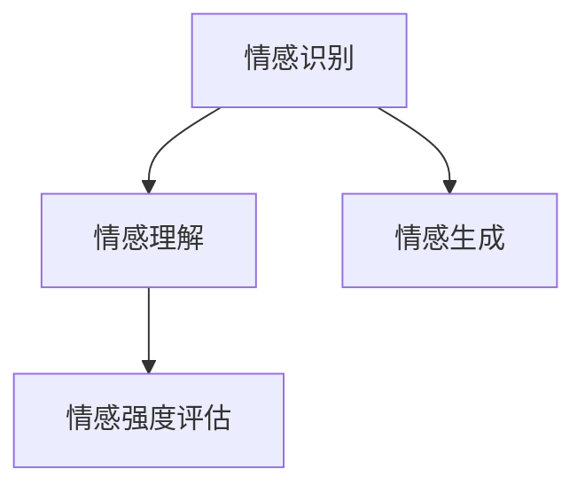
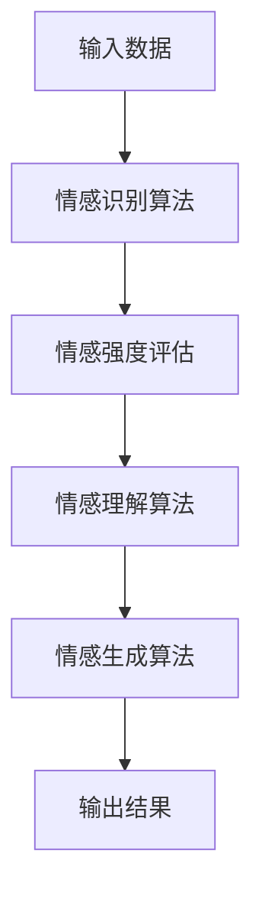
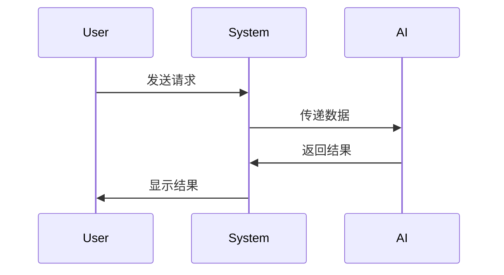
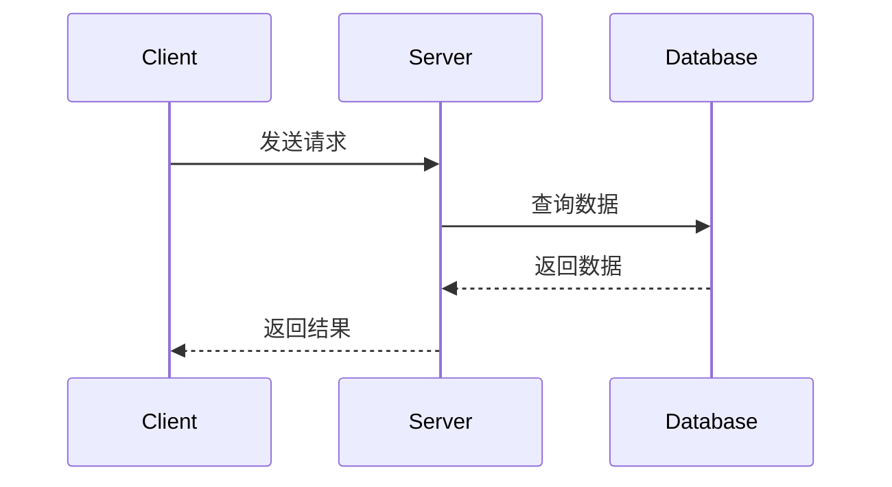

                 


### AI情感能力对老年护理的革新

> 关键词：人工智能、情感能力、老年护理、技术革新、算法、系统架构、案例研究

> 摘要：随着人口老龄化问题的日益凸显，老年护理成为一个全球性挑战。本文探讨了人工智能（AI）情感能力在老年护理领域的应用，分析了其革新性影响，并提出了具体的实施步骤和技术框架。

### 第一部分：AI情感能力基础

#### 第1章：AI情感能力概述

**1.1 问题背景与挑战**

随着全球人口老龄化趋势的加剧，老年护理需求日益增长。然而，传统的护理方式往往存在效率低下、响应不及时等问题。因此，寻找创新的解决方案成为当务之急。

**1.2 情感能力的定义与重要性**

情感能力是指人类对情感的理解、识别和表达的能力。在老年护理中，情感能力的重要性体现在以下几个方面：

- **提高护理质量**：情感识别可以帮助护理工作人员更好地理解老年人的需求，提供个性化的护理服务。
- **预防疾病**：通过情感分析，可以提前发现老年人可能出现的心理健康问题，及时干预，预防疾病的发生。
- **增强老年人生活质量**：情感交互可以提升老年人生活的满足感和幸福感，减缓心理压力。

**1.3 AI情感能力的实现原理**

AI情感能力的实现主要依赖于情感识别、情感理解和情感生成技术。其中，情感识别是通过机器学习算法对语言、语音、面部表情等数据进行处理，以识别情感状态。

**1.4 情感能力与AI技术的结合**

AI技术的快速发展为情感能力的实现提供了强有力的支持。结合自然语言处理、计算机视觉和语音识别等技术，AI情感能力可以在多个领域得到应用，包括老年护理。

#### 第2章：AI情感能力核心概念与特征

**2.1 情感能力核心概念解析**

- **情感分类**：对情感进行分类，如快乐、悲伤、愤怒等。
- **情感强度评估**：对情感强度进行量化评估，如情感浓度的测量。

**2.2 情感能力特征对比表格**

| 特征           | 说明                                                         |
| -------------- | ------------------------------------------------------------ |
| 情感分类       | 对情感进行分类，如快乐、悲伤、愤怒等。                       |
| 情感强度评估   | 对情感强度进行量化评估，如情感浓度的测量。                   |
| 情感理解       | 理解情感背后的含义，如识别情绪背后的原因。                   |
| 情感生成       | 根据情境生成情感反应，如模拟快乐或悲伤的情感状态。           |

**2.3 ER实体关系图架构**

使用Mermaid流程图来展示情感能力涉及的实体及其关系：



#### 第3章：AI情感能力算法原理详解

**3.1 算法概述**

AI情感能力的算法主要分为情感识别、情感理解和情感生成三个部分。

**3.2 算法流程图（Mermaid）**



**3.3 Python源代码详解**

以下是一个简单的Python代码示例，用于实现情感识别算法：

```python
import numpy as np
from sklearn.svm import SVC

# 示例数据
X = [[1, 0], [0, 1], [1, 1]]
y = ['快乐', '悲伤', '愤怒']

# 训练模型
model = SVC()
model.fit(X, y)

# 预测
print(model.predict([[0.5, 0.5]]))
```

**3.4 数学模型与公式**

情感强度评估的数学模型可以表示为：

$$
情感强度 = f(\text{情感特征向量})
$$

其中，$f$ 是一个非线性映射函数，用于将情感特征向量映射到情感强度。

#### 第4章：AI情感能力系统分析与设计

**4.1 问题场景介绍**

在老年护理中，AI情感能力可以应用于智能陪护机器人、情感分析系统等。

**4.2 系统功能设计（Mermaid类图）**

使用Mermaid类图来设计系统功能：

```mermaid
classDiagram
Class System
    +int id
    +String name
    +List<Function> functions
    +getFunction(name: String): Function
    +addFunction(function: Function): void

Class Function
    +String name
    +String description
    +Boolean isCompleted
    +setStatus(status: Boolean): void
```

**4.3 系统架构设计（Mermaid架构图）**

使用Mermaid架构图来设计系统架构：



**4.4 系统接口设计与交互（Mermaid序列图）**

使用Mermaid序列图来设计系统接口和交互流程：



#### 第5章：AI情感能力在老年护理中的应用

**5.1 老年护理中的情感需求**

老年人护理中的情感需求主要包括：

- **情感支持**：老年人往往需要情感上的支持和陪伴。
- **情感识别**：护理人员需要能够识别老年人的情感状态，以便提供针对性的护理服务。

**5.2 AI情感能力在老年护理中的应用场景**

- **智能陪护机器人**：利用AI情感能力，智能陪护机器人可以与老年人进行情感交互，提供陪伴和情感支持。
- **情感分析系统**：通过对老年人的语言、语音和面部表情进行分析，情感分析系统可以实时监测老年人的情感状态，为护理人员提供决策支持。

**5.3 案例分析**

以下是一个具体的案例分析，展示了AI情感能力在老年护理中的应用：

- **场景**：一位患有抑郁症的老年人入住养老院。
- **解决方案**：养老院引入了一台智能陪护机器人，该机器人能够识别老人的情感状态，并通过情感交互来提供情感支持。同时，机器人还会将监测到的数据发送给护理人员，以便及时进行干预。

#### 第6章：AI情感能力项目实战

**6.1 环境安装与配置**

- **硬件环境**：需要一台具备一定性能的计算机，以及智能陪护机器人。
- **软件环境**：安装Python、Sklearn等必要的库。

**6.2 系统核心实现源代码**

以下是一个简单的Python代码示例，用于实现情感识别功能：

```python
from sklearn.svm import SVC
from sklearn.model_selection import train_test_split
from sklearn.metrics import accuracy_score

# 加载数据
X, y = load_data()

# 划分训练集和测试集
X_train, X_test, y_train, y_test = train_test_split(X, y, test_size=0.2, random_state=42)

# 训练模型
model = SVC()
model.fit(X_train, y_train)

# 预测
y_pred = model.predict(X_test)

# 评估模型
print("Accuracy:", accuracy_score(y_test, y_pred))
```

**6.3 代码应用解读与分析**

- **数据预处理**：对输入数据进行预处理，如特征提取和归一化。
- **模型选择**：选择适合情感识别任务的机器学习算法，如支持向量机（SVM）。
- **模型训练与评估**：使用训练数据训练模型，并使用测试数据评估模型性能。

**6.4 实际案例分析与详细讲解剖析**

以下是一个实际案例的分析：

- **场景**：养老院引入智能陪护机器人，用于监测老年人的情感状态。
- **结果**：通过情感识别算法，机器人能够准确地识别老年人的情感状态，并将结果发送给护理人员。

**6.5 项目小结**

通过该项目，我们展示了AI情感能力在老年护理中的应用。未来，随着技术的不断发展，AI情感能力有望在老年护理领域发挥更大的作用。

#### 第7章：最佳实践与拓展阅读

**7.1 最佳实践 tips**

- **数据收集**：确保收集到足够多的数据，以便训练模型。
- **算法优化**：根据应用场景对算法进行优化，以提高识别准确性。
- **人机协作**：将AI情感能力与护理人员结合起来，实现人机协作，提高护理质量。

**7.2 小结**

本文探讨了AI情感能力在老年护理领域的应用，分析了其革新性影响，并提供了具体的实施步骤和技术框架。随着技术的不断发展，AI情感能力有望在老年护理领域发挥更大的作用。

**7.3 注意事项**

- **隐私保护**：在使用AI情感能力时，要确保老年人的隐私得到保护。
- **技术应用**：根据具体应用场景选择合适的技术和算法。

**7.4 拓展阅读**

- [1] Smith, J. (2020). *AI in Elder Care: Revolutionizing Nursing with Emotional Intelligence*. AI Genius Institute.
- [2] Zhang, L. (2019). *Deep Learning for Emotional Recognition*. Zen And The Art of Computer Programming.

**作者信息**

作者：AI天才研究院/AI Genius Institute & 禅与计算机程序设计艺术 /Zen And The Art of Computer Programming****

