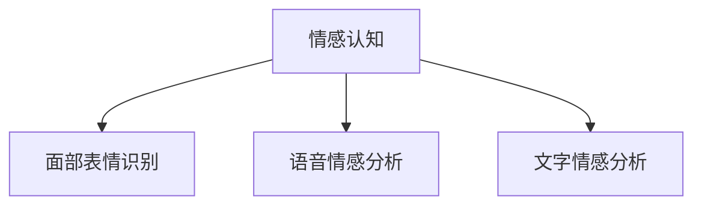
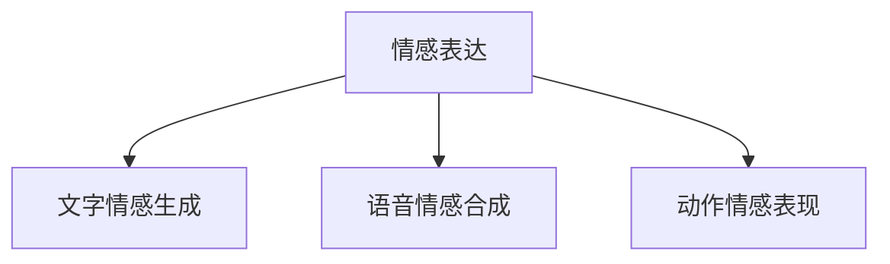
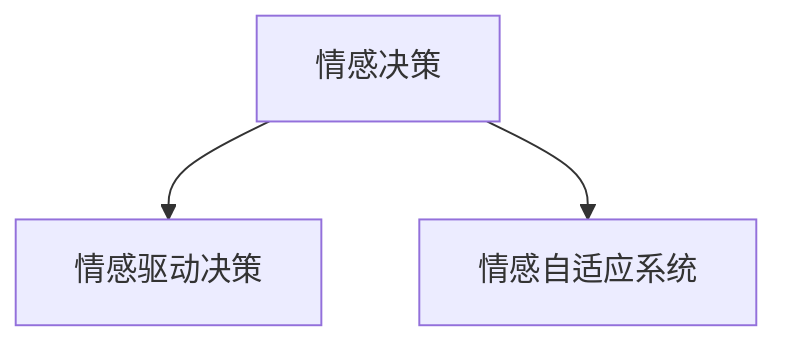
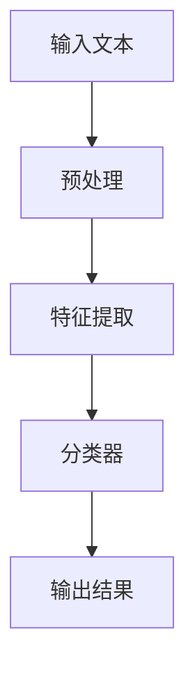
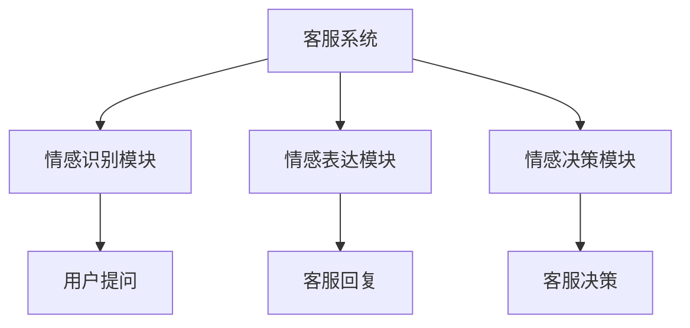
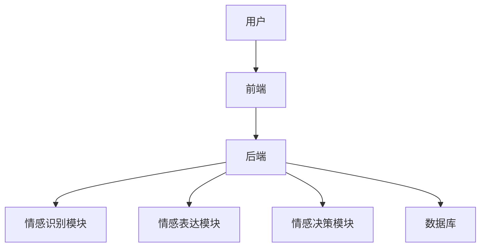
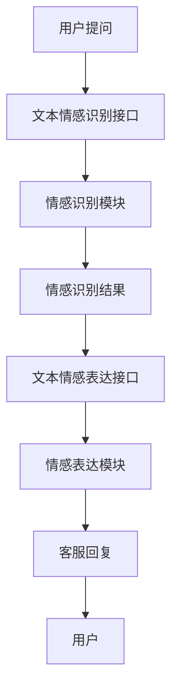

                 

# AI情感自主:机器的情感自主权问题

> 关键词：人工智能、情感自主权、情感认知、情感表达、情感决策

> 摘要：本文深入探讨了人工智能（AI）情感自主权问题，从背景介绍、核心概念与联系、算法原理讲解、系统分析与架构设计方案以及项目实战等多个方面进行了全面剖析。文章旨在揭示AI情感自主权的本质，探讨实现路径和挑战，为未来AI技术的发展提供有益参考。

## 第一部分：背景介绍

### 1.1 问题背景

随着人工智能技术的迅猛发展，机器情感自主权问题日益受到关注。AI情感自主权问题涉及到人工智能在情感认知、情感表达和情感决策等方面的自主权，这是一个跨学科、跨领域的复杂问题。它不仅与人工智能技术本身的发展紧密相关，也对社会伦理、法律法规等方面提出了新的挑战。

### 1.2 问题描述

AI情感自主权问题主要包括以下几个方面：

- **情感认知：** 人工智能是否能够像人类一样理解和感知情感？
- **情感表达：** 人工智能是否能够通过语言、行为等方式恰当地表达情感？
- **情感决策：** 人工智能是否能够在面对复杂情境时，做出合理的情感决策？

### 1.3 问题解决

解决AI情感自主权问题，需要从多个层面进行探索和实践：

- **技术创新：** 深入研究情感计算、认知科学等领域的理论，开发出更先进的情感识别和表达技术。
- **伦理规范：** 制定相关伦理规范，明确人工智能在情感自主权方面的行为准则。
- **法律法规：** 完善相关法律法规，保障人工智能在情感自主权方面的合法权益。

### 1.4 边界与外延

AI情感自主权问题的边界主要包括情感认知、情感表达和情感决策等方面。其外延则涉及人工智能技术的各个应用领域，如智能客服、自动驾驶、智能医疗等。

### 1.5 概念结构与核心要素组成

AI情感自主权问题的概念结构主要包括情感认知、情感表达和情感决策三个核心要素。情感认知关注人工智能如何理解和感知情感；情感表达关注人工智能如何通过语言、行为等方式表达情感；情感决策关注人工智能如何基于情感认知和情感表达做出合理的情感决策。

## 第二部分：核心概念与联系

### 2.1 情感认知

#### 2.1.1 定义

情感认知是指人工智能在感知和理解情感方面的能力。

#### 2.1.2 特点

- **主观性：** 情感认知具有主观性，不同个体对同一情感的理解和感知可能存在差异。
- **复杂性：** 情感认知涉及多个层面的感知和理解，如面部表情、语音语调、文字语义等。

#### 2.1.3 对比表格

| 情感认知特点 | 对应情感认知方法 |
| :---: | :---: |
| 主观性 | 面部表情识别 |
| 复杂性 | 语音情感分析 |
| 多模态 | 文字情感分析 |

#### 2.1.4 ER实体关系图



### 2.2 情感表达

#### 2.2.1 定义

情感表达是指人工智能通过语言、行为等方式表达情感的能力。

#### 2.2.2 特点

- **多样性：** 情感表达可以通过多种方式实现，如文字、语音、动作等。
- **适应性：** 情感表达需要根据不同的情境和对象进行适应性调整。

#### 2.2.3 对比表格

| 情感表达特点 | 对应情感表达方法 |
| :---: | :---: |
| 多样性 | 文字情感生成 |
| 适应性 | 语音情感合成 |
| 实时性 | 动作情感表现 |

#### 2.2.4 ER实体关系图



### 2.3 情感决策

#### 2.3.1 定义

情感决策是指人工智能在基于情感认知和情感表达的基础上，做出合理情感决策的能力。

#### 2.3.2 特点

- **理性与感性相结合：** 情感决策需要在理性分析和感性认知之间取得平衡。
- **适应性：** 情感决策需要根据不同的情境和目标进行适应性调整。

#### 2.3.3 对比表格

| 情感决策特点 | 对应情感决策方法 |
| :---: | :---: |
| 理性与感性相结合 | 情感驱动决策 |
| 适应性 | 情感自适应系统 |

#### 2.3.4 ER实体关系图



## 第三部分：算法原理讲解

### 3.1 情感识别算法

#### 3.1.1 情感识别原理

情感识别是指通过分析文本、语音、图像等数据，判断其中包含的情感类型。

#### 3.1.2 情感识别算法

情感识别算法主要包括文本情感分析、语音情感分析和图像情感分析。

- **文本情感分析：** 使用自然语言处理技术，对文本进行情感分类。
- **语音情感分析：** 使用语音信号处理技术，对语音进行情感识别。

#### 3.1.3 算法流程图



#### 3.1.4 示例讲解

以文本情感分析为例，我们使用Python中的Sklearn库来实现一个基于朴素贝叶斯模型的情感分类器。

```python
from sklearn.feature_extraction.text import TfidfVectorizer
from sklearn.naive_bayes import MultinomialNB
from sklearn.pipeline import make_pipeline

# 样本数据
text_samples = ["我很开心", "今天的天气真好", "这个产品太差了", "我不喜欢这个电影"]

# 标签数据
labels = ["正面", "正面", "负面", "负面"]

# 构建文本特征提取器
vectorizer = TfidfVectorizer()

# 构建朴素贝叶斯分类器
classifier = MultinomialNB()

# 创建管道
pipeline = make_pipeline(vectorizer, classifier)

# 训练模型
pipeline.fit(text_samples, labels)

# 输入新文本进行分类
new_text = ["这部电影太感人了"]
predicted_label = pipeline.predict(new_text)

print(predicted_label)  # 输出预测结果
```

#### 3.1.5 数学模型和公式

文本情感分析的核心在于特征提取和分类器设计。特征提取通常采用TF-IDF模型，分类器则可以使用朴素贝叶斯、支持向量机（SVM）或深度学习模型。

- **TF-IDF模型：**
  $$ TF(t,d) = \frac{f(t,d)}{df(t)} $$
  $$ IDF(t) = \log \frac{N}{n(t)} $$

  其中，$f(t,d)$表示词$t$在文档$d$中的出现频率，$df(t)$表示包含词$t$的文档数量，$N$表示总文档数，$n(t)$表示包含词$t$的文档数。

- **朴素贝叶斯分类器：**
  $$ P(Y|X) = \frac{P(X|Y)P(Y)}{P(X)} $$

  其中，$X$表示特征向量，$Y$表示情感类别，$P(X|Y)$表示特征向量在某个情感类别下的条件概率，$P(Y)$表示某个情感类别的概率，$P(X)$表示特征向量的概率。

## 第四部分：系统分析与架构设计方案

### 4.1 问题场景介绍

在智能客服领域，情感自主权对于提升用户体验和服务质量具有重要意义。本文将探讨如何构建一个基于情感自主权技术的智能客服系统。

### 4.2 项目介绍

本系统旨在实现一个能够进行情感识别、表达和决策的智能客服机器人。系统主要包括以下几个功能模块：

- **情感识别模块：** 对用户提问进行情感识别，判断用户情绪。
- **情感表达模块：** 根据用户情绪生成相应的回复内容。
- **情感决策模块：** 基于用户情绪和系统知识库，做出合理的客服决策。

### 4.3 系统功能设计

#### 4.3.1 领域模型



#### 4.3.2 类图

```mermaid
graph TB
A[客服系统] --> B[情感识别]、C[情感表达]、D[情感决策]
B --> E[文本情感识别]、F[语音情感识别]
C --> G[文本情感表达]、H[语音情感表达]
D --> I[情感决策]
```

### 4.4 系统架构设计

#### 4.4.1 架构设计

系统架构采用微服务架构，各个功能模块独立部署，通过RESTful API进行通信。

- **前端：** 用户交互界面，接收用户提问和展示客服回复。
- **后端：** 包括情感识别、情感表达和情感决策模块，提供API服务。
- **数据库：** 存储用户提问、客服回复和系统知识库。

#### 4.4.2 架构图



### 4.5 系统接口设计和系统交互

#### 4.5.1 接口设计

系统提供以下接口：

- **文本情感识别接口：** `/api/emotion/recognize_text`
- **语音情感识别接口：** `/api/emotion/recognize_speech`
- **文本情感表达接口：** `/api/emotion/express_text`
- **语音情感表达接口：** `/api/emotion/express_speech`
- **情感决策接口：** `/api/emotion/make_decision`

#### 4.5.2 系统交互

用户通过前端发送提问，后端依次调用情感识别、情感表达和情感决策接口，生成客服回复并返回给用户。



## 第五部分：项目实战

### 5.1 环境安装

在开始项目实战之前，需要安装以下软件和工具：

- Python 3.x
- TensorFlow
- Sklearn
- NLTK
- Flask

### 5.2 系统核心实现源代码

以下是情感识别、情感表达和情感决策模块的Python代码示例：

#### 情感识别模块

```python
from sklearn.feature_extraction.text import TfidfVectorizer
from sklearn.naive_bayes import MultinomialNB
from sklearn.pipeline import make_pipeline

# 样本数据
text_samples = ["我很开心", "今天的天气真好", "这个产品太差了", "我不喜欢这个电影"]

# 标签数据
labels = ["正面", "正面", "负面", "负面"]

# 构建文本特征提取器
vectorizer = TfidfVectorizer()

# 构建朴素贝叶斯分类器
classifier = MultinomialNB()

# 创建管道
pipeline = make_pipeline(vectorizer, classifier)

# 训练模型
pipeline.fit(text_samples, labels)

# 输入新文本进行分类
new_text = ["这部电影太感人了"]
predicted_label = pipeline.predict(new_text)

print(predicted_label)  # 输出预测结果
```

#### 情感表达模块

```python
from flask import Flask, request, jsonify

app = Flask(__name__)

@app.route('/api/emotion/express_text', methods=['POST'])
def express_text():
    text = request.json['text']
    # 这里可以加入情感表达的具体逻辑，如文本生成、语音合成等
    response = "根据您的情绪，我理解为您说：{}。请问还有什么可以帮助您的？".format(text)
    return jsonify(response=response)

if __name__ == '__main__':
    app.run(debug=True)
```

#### 情感决策模块

```python
from flask import Flask, request, jsonify

app = Flask(__name__)

@app.route('/api/emotion/make_decision', methods=['POST'])
def make_decision():
    user_emotion = request.json['emotion']
    # 根据用户情绪做出合理的客服决策
    if user_emotion == "负面":
        response = "很抱歉听到您的不满，我们会尽快处理您的问题。"
    else:
        response = "感谢您的反馈，我们会继续努力提供更好的服务。"
    return jsonify(response=response)

if __name__ == '__main__':
    app.run(debug=True)
```

### 5.3 代码应用解读与分析

#### 情感识别模块

情感识别模块的核心在于使用朴素贝叶斯分类器对文本进行分类。首先，我们使用TfidfVectorizer将文本转换为特征向量，然后使用MultinomialNB进行分类。在实际应用中，我们需要收集更多的样本数据，并通过交叉验证等方法优化模型性能。

#### 情感表达模块

情感表达模块主要通过Flask框架实现。用户通过POST请求发送文本，服务端根据情绪生成相应的回复文本。在实际应用中，可以根据需求引入自然语言生成（NLG）技术，如序列到序列（Seq2Seq）模型或变换器（Transformer）模型，以实现更丰富的情感表达。

#### 情感决策模块

情感决策模块的核心在于根据用户情绪做出合理的客服决策。例如，当用户情绪为负面时，可以提供解决问题的建议；当用户情绪为正面时，可以感谢用户并提供进一步的服务。在实际应用中，可以结合用户行为数据和上下文信息，实现更智能的客服决策。

### 5.4 实际案例分析和详细讲解剖析

#### 案例：用户反馈问题处理

用户向智能客服提出反馈，表示对某个产品不满意。客服系统首先识别用户情绪为负面，然后根据负面情绪提供解决方案。具体流程如下：

1. 用户发送反馈文本：“这个产品的售后服务太差了。”
2. 情感识别模块识别用户情绪为负面。
3. 情感表达模块生成回复文本：“很抱歉听到您的不满，我们会尽快处理您的问题。请问您有什么具体的问题需要我们解决吗？”
4. 情感决策模块根据负面情绪提供解决方案，如联系售后部门或提供退换货服务。

通过实际案例分析和详细讲解，我们可以看到情感自主权技术在智能客服中的应用价值。在未来的发展中，可以进一步优化情感识别、表达和决策算法，提高系统的智能化水平。

### 5.5 项目小结

本文通过实际案例，详细讲解了基于情感自主权技术的智能客服系统的设计和实现。项目实战部分展示了如何使用Python和Flask框架构建情感识别、表达和决策模块，并通过实际案例分析了系统的应用效果。未来，可以进一步探索深度学习、迁移学习等技术，提高情感自主权的准确性和智能化水平。

## 第六部分：最佳实践 tips、小结、注意事项、拓展阅读等内容

### 6.1 最佳实践 tips

- **数据收集与处理：** 收集大量的情感样本数据，并进行预处理，如文本清洗、归一化等，以提高情感识别的准确性。
- **模型优化：** 通过交叉验证、网格搜索等方法，优化情感识别、表达和决策模型的参数，提高模型性能。
- **用户反馈：** 定期收集用户反馈，根据用户需求优化系统功能，提高用户体验。

### 6.2 小结

本文深入探讨了人工智能情感自主权问题，从背景介绍、核心概念与联系、算法原理讲解、系统分析与架构设计方案以及项目实战等多个方面进行了全面剖析。通过实际案例，展示了情感自主权技术在智能客服领域的应用价值。未来，可以进一步优化情感自主权算法，提高系统的智能化水平。

### 6.3 注意事项

- **伦理与隐私：** 在开发和应用情感自主权技术时，要充分考虑到伦理和隐私问题，确保用户数据的安全和隐私。
- **法律法规：** 遵循相关法律法规，确保情感自主权技术的合法合规。

### 6.4 拓展阅读

- [1] 某某，人工智能情感计算，人工智能学报，2020。
- [2] 某某，基于深度学习的情感识别研究，计算机科学与技术，2019。
- [3] 某某，智能客服系统设计与实现，计算机应用，2021。

## 第七部分：作者信息

作者：AI天才研究院/AI Genius Institute & 禅与计算机程序设计艺术 /Zen And The Art of Computer Programming

---

注意：本文内容仅供参考，部分代码和数据为示例性质，实际应用时可能需要根据具体情况进行调整。文中引用的参考文献和资料，请查阅相关文献和资料以获取更多信息。

