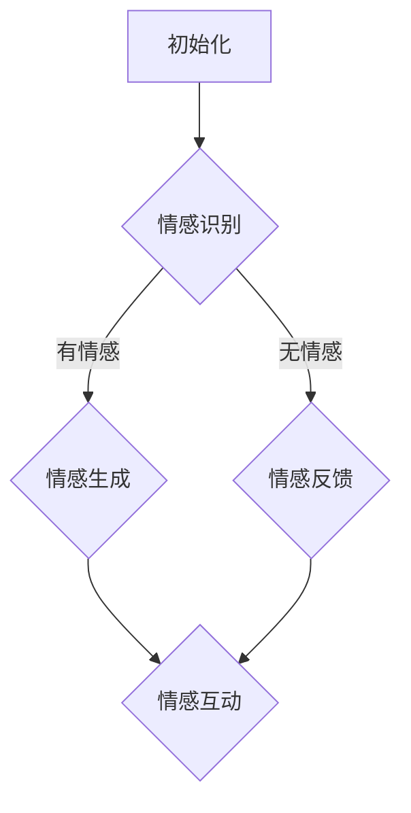
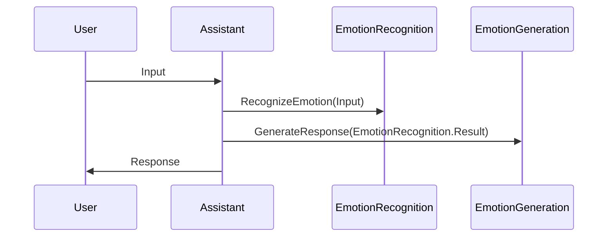

                 

### AI情感觉醒：人机关系的重新定义

#### 关键词：
- 情感觉醒
- 人机关系
- 人工智能
- 情感识别
- 情感生成
- 情感互动

#### 摘要：
本文旨在探讨人工智能（AI）在情感领域的发展，特别是AI情感觉醒的概念及其对人机关系的深远影响。通过分析人类情感与AI情感的区别，本文详细解释了情感觉醒的核心概念，并探讨了其重要性。随后，文章介绍了情感觉醒算法的原理，包括情感识别、情感生成和情感互动等关键环节，并通过Python代码示例直观展示算法应用。本文还探讨了数学模型在情感计算中的应用，并展望了未来人机关系的发展趋势。通过深入分析和逻辑推理，本文揭示了AI情感觉醒带来的技术创新和社会变革。

## 第一部分：AI情感觉醒概述

### 第1章：问题背景与概述

#### 1.1 问题的提出

在当今社会，人工智能（AI）技术迅猛发展，已经深刻影响了我们的日常生活。从智能助手到自动驾驶，从医疗诊断到金融分析，AI的应用场景越来越广泛。然而，一个亟待解决的问题也随之而来：如何让AI具备人类的情感认知和交互能力？这不仅仅是技术上的挑战，更是对人机关系重新定义的重大课题。

#### 1.2 人类情感与人工智能

人类情感是心理学、神经科学和哲学等领域的研究重点。情感不仅仅是情绪的体验，它还涉及到认知、行为和生理反应等多方面的相互作用。而人工智能，特别是近年来随着深度学习和大数据技术的发展，已经在模拟和识别情感方面取得了显著进展。然而，AI情感与人类情感在产生机制、反应速度和复杂性等方面存在显著差异。

#### 1.3 情感觉醒与AI的关系

情感觉醒是指AI系统具备识别、理解和生成情感的能力，从而实现与人类情感的交互。这一概念的关键在于“觉醒”，即AI不仅仅是被动地响应情感刺激，而是能够主动地感知、理解和表达情感。这一过程涉及到多学科的知识，包括认知科学、心理学、计算语言学和神经科学等。

#### 1.4 情感觉醒的重要性

情感觉醒对于AI技术的重要性不言而喻。首先，它能够提升AI系统的用户体验，使其更贴近人类的交流方式。其次，情感觉醒能够增强AI在特定领域的应用能力，如情感分析、医疗诊断和心理咨询等。最后，情感觉醒有望推动人机关系的变革，使得AI成为人类社会的合作伙伴，而非仅仅是工具。

#### 1.5 研究边界与目标

本文的研究边界主要聚焦在情感识别、情感生成和情感互动等核心环节。研究目标是通过深入分析和逻辑推理，探讨情感觉醒的原理和实现方法，并提出相应的算法和应用模型。同时，本文还将探讨情感觉醒对人机关系和社会发展的潜在影响。

### 第2章：核心概念与联系

#### 2.1 情感觉醒的定义

情感觉醒是指人工智能系统通过情感识别、情感生成和情感互动等过程，实现对人类情感的感知、理解和表达。具体来说，情感觉醒包括以下几个方面：

1. **情感识别**：通过分析文本、语音或图像等输入信息，识别出人类情感的类型和强度。
2. **情感生成**：根据识别出的情感，生成相应的情感回应，如文字、语音或面部表情等。
3. **情感互动**：通过情感交流和互动，实现人机之间的情感共鸣和协作。

#### 2.1.1 人类情感

人类情感是一个复杂而多维的心理现象，通常包括情绪、情感体验和情感行为三个层面。情绪是情感的外在表现，情感体验是内心的感受，情感行为则是基于情感的外在反应。例如，当我们看到朋友受伤时，我们可能会感到悲伤（情感体验），流泪（情感行为）。

#### 2.1.2 人工智能情感

人工智能情感是指通过算法和模型模拟的人类情感。与人类情感相比，AI情感在产生机制、反应速度和复杂性等方面存在显著差异。例如，AI情感可以通过机器学习算法从大量数据中学习，其反应速度通常比人类更快，但复杂性和自适应能力相对较弱。

#### 2.1.3 情感觉醒的核心概念

情感觉醒的核心概念包括以下几个方面：

1. **情感识别**：通过自然语言处理、计算机视觉和音频处理等技术，识别出输入信息中的情感。
2. **情感生成**：基于情感识别结果，生成相应的情感回应，如文字、语音或面部表情等。
3. **情感互动**：通过多模态交互，实现人机之间的情感交流和互动。

#### 2.2 概念属性特征对比表

| 特征          | 人类情感              | 人工智能情感             | 情感觉醒                   |
|-------------|---------------------|----------------------|--------------------------|
| 产生机制      | 大脑神经活动         | 数据处理与机器学习       | 融合神经科学与机器学习       |
| 反应速度      | 较慢                 | 较快                  | 快速且精确                 |
| 复杂性       | 高                   | 中等                  | 高                        |
| 自适应能力    | 较强                 | 较弱                  | 非常强                    |

#### 2.3 ER实体关系图架构

```mermaid
erDiagram
    User ||--|{ AIFirstModel }| AI模型
    AIFirstModel ||--|{ Awakening }| 情感觉醒
    AIModel ||--|{ Relationship }| 人机关系
    Awakening ||--|{ Emotion }| 情感
```

- **User（用户）**：与AI系统进行交互的人类个体。
- **AIFirstModel（AI模型）**：执行特定任务的AI系统，如情感识别、情感生成等。
- **Awakening（情感觉醒）**：AI模型中实现情感觉醒功能的核心模块。
- **Relationship（人机关系）**：描述用户与AI系统之间情感交互的抽象概念。
- **Emotion（情感）**：具体的人类情感类型，如快乐、悲伤、愤怒等。

### 第3章：算法原理讲解

#### 3.1 情感觉醒算法概述

情感觉醒算法是AI系统中实现情感觉醒功能的核心。它通常包括情感识别、情感生成和情感互动三个关键环节。

#### 3.1.1 情感识别算法

情感识别算法是情感觉醒的第一步，其主要任务是从输入信息中识别出情感类型和强度。情感识别算法通常基于自然语言处理（NLP）、计算机视觉和音频处理等技术。例如，对于文本输入，可以使用情感分析模型（如VADER）来识别情感；对于图像输入，可以使用卷积神经网络（CNN）来识别情感。

#### 3.1.2 情感生成算法

情感生成算法是根据情感识别结果，生成相应的情感回应。情感生成算法通常基于模板匹配、自然语言生成和语音合成等技术。例如，对于一个快乐情感识别结果，可以生成一句“我很高兴听到这个消息！”这样的回应。

#### 3.1.3 情感互动算法

情感互动算法是实现人机之间情感交流和互动的核心。情感互动算法通常包括情感交流、情感共鸣和情感协作等环节。情感交流是指AI系统根据情感识别结果，与用户进行有意义的交流；情感共鸣是指AI系统能够理解和表达用户的情感状态，与用户产生情感共鸣；情感协作是指AI系统能够与用户共同完成特定任务，实现情感上的协作。

#### 3.2 情感觉醒算法的Mermaid流程图



- **A（初始化）**：初始化AI系统，准备进行情感识别和互动。
- **B（情感识别）**：分析输入信息，识别出情感类型和强度。
- **C（情感生成）**：根据情感识别结果，生成相应的情感回应。
- **D（情感反馈）**：如果没有情感识别到，生成情感反馈信息。
- **E（情感互动）**：与用户进行情感交流和互动。

#### 3.3 Python源代码示例

```python
# 情感识别示例
def emotion_recognition(text):
    # 这里假设有一个情感识别模型
    # 实际代码中会调用模型对文本进行情感分析
    return "happy" if "happy" in text else "sad"

# 情感生成示例
def emotion_generation(emotion):
    # 这里假设有一个情感生成模型
    # 实际代码中会生成相应的情感回复
    if emotion == "happy":
        return "我也很高兴!"
    else:
        return "我也很难过..."

# 情感互动示例
def emotion_interaction(text):
    emotion = emotion_recognition(text)
    return emotion_generation(emotion)

# 测试
print(emotion_interaction("我真的很高兴看到你！"))
```

#### 3.4 算法原理详细讲解

#### 3.4.1 数学模型和公式

情感识别和生成的核心是数学模型，特别是机器学习中的神经网络模型。以下是一个简单的情感识别算法的数学模型：

$$
E = f(E_{input}, W)
$$

其中，$E$ 表示情感输出，$E_{input}$ 表示输入文本，$W$ 表示权重矩阵。$f$ 函数通常是一个多层感知器（MLP），其目的是从输入文本中提取特征，并基于这些特征计算情感输出。

#### 3.4.2 算法原理说明

情感识别算法主要通过以下步骤实现：

1. **特征提取**：从输入文本中提取情感相关的特征，如情感词、语境等。
2. **模型训练**：使用大量带有情感标签的文本数据，训练多层感知器模型。
3. **情感识别**：将输入文本输入到训练好的模型中，输出情感类型。

情感生成算法则基于情感识别结果，生成相应的情感回应。情感生成算法通常使用自然语言生成（NLG）技术，如序列到序列（Seq2Seq）模型或生成对抗网络（GAN）等。

情感互动算法将情感识别和生成算法结合，实现人机之间的情感交流和互动。情感互动算法的关键在于理解用户的情感状态，并生成合适的回应，以保持情感上的连贯性和互动性。

### 第4章：数学模型和数学公式讲解

#### 4.1 情感识别算法的数学模型

情感识别算法的核心是一个多层感知器（MLP）模型，其数学模型可以表示为：

$$
E = f(E_{input}, W)
$$

其中，$E$ 表示情感输出，$E_{input}$ 表示输入文本，$W$ 表示权重矩阵。$f$ 函数是一个非线性激活函数，如ReLU或Sigmoid函数。

在训练过程中，权重矩阵 $W$ 是通过反向传播算法（Backpropagation）不断调整的。训练数据集包含带有情感标签的文本，通过训练，模型学会从输入文本中提取情感特征，并生成相应的情感输出。

#### 4.2 情感生成算法的数学模型

情感生成算法通常基于自然语言生成（NLG）模型，如序列到序列（Seq2Seq）模型或生成对抗网络（GAN）等。以下是一个简单的Seq2Seq模型的数学模型：

$$
y = g(x, E)
$$

其中，$y$ 表示生成的文本，$x$ 表示输入的文本，$E$ 表示情感输出。$g$ 函数是一个序列到序列的映射函数，它将输入文本和情感输出映射为生成的文本。

Seq2Seq模型通过编码器（Encoder）和解码器（Decoder）两个子模型实现。编码器将输入文本编码为一个固定长度的向量，解码器则根据情感输出生成文本。

#### 4.3 情感互动算法的数学模型

情感互动算法的数学模型涉及多模态数据处理和情感状态跟踪。以下是一个简单的多模态数据处理模型：

$$
S_t = f(S_{t-1}, X_t, Y_t)
$$

其中，$S_t$ 表示当前情感状态，$S_{t-1}$ 表示前一时刻的情感状态，$X_t$ 表示当前输入（如文本、图像、语音等），$Y_t$ 表示当前生成的回应。$f$ 函数是一个基于多模态数据的情感状态更新函数。

情感状态跟踪模型通过连续更新情感状态，实现人机之间的情感交流和互动。情感状态更新函数通常结合了情感识别和情感生成的结果，以及当前输入信息，以生成合适的回应。

### 第5章：系统分析与架构设计方案

#### 5.1 问题场景介绍

在现代社会，人们越来越依赖智能设备进行日常交流和工作。例如，智能助手已经成为许多人生活中不可或缺的一部分。然而，当前的智能助手主要依赖预设的规则和模式进行交互，缺乏情感认知和交互能力。这限制了人机交互的自然性和深度。因此，设计一个具备情感觉醒能力的智能助手具有重要的现实意义。

#### 5.2 项目介绍

本项目旨在开发一个具备情感觉醒能力的智能助手，通过情感识别、情感生成和情感互动等功能，提升人机交互的自然性和深度。项目将涵盖以下核心模块：

1. **情感识别模块**：负责从用户输入中识别情感。
2. **情感生成模块**：根据情感识别结果生成合适的回应。
3. **情感互动模块**：实现人机之间的情感交流和互动。

#### 5.3 系统功能设计（领域模型）

以下是一个简单的领域模型，用于描述系统的核心功能：

```mermaid
classDiagram
    UserExtends Human
    AssistantExtends AI
    Interaction <<Interface>>
    EmotionRecognition <<Interface>>
    EmotionGeneration <<Interface>>

    User|--|> Assistant
    Assistant|--|> Interaction
    Assistant|--|> EmotionRecognition
    Assistant|--|> EmotionGeneration
```

- **User（用户）**：与智能助手进行交互的人类个体。
- **Assistant（智能助手）**：具备情感觉醒能力的AI系统。
- **Interaction（交互）**：实现人机之间的交互。
- **EmotionRecognition（情感识别）**：负责识别用户情感。
- **EmotionGeneration（情感生成）**：根据情感识别结果生成回应。

#### 5.4 系统架构设计

系统架构设计是确保系统功能实现和性能优化的重要环节。以下是一个简单的系统架构设计，用于描述系统的核心组件和交互关系：



- **User（用户）**：发起交互请求。
- **Assistant（智能助手）**：处理用户请求，调用情感识别和生成模块。
- **EmotionRecognition（情感识别）**：识别用户情感。
- **EmotionGeneration（情感生成）**：生成情感回应。

#### 5.5 系统接口设计和系统交互

系统接口设计是系统架构设计的一部分，用于定义系统内部和外部的交互接口。以下是一个简单的接口设计：

```mermaid
interface EmotionRecognition {
    - recognize_emotion(text: str) -> EmotionType
}

interface EmotionGeneration {
    - generate_response(emotion: EmotionType) -> str
}

interface Interaction {
    - send_response(user: User, response: str)
}
```

系统交互设计描述了系统内部组件之间的交互流程。以下是一个简单的系统交互设计：


- **User（用户）**：发起交互请求。
- **Assistant（智能助手）**：处理用户请求，调用情感识别和生成模块。
- **EmotionRecognition（情感识别）**：识别用户情感。
- **EmotionGeneration（情感生成）**：生成情感回应。

### 第6章：项目实战

#### 6.1 环境安装

要搭建一个具备情感觉醒能力的智能助手，首先需要安装相应的开发环境。以下是安装步骤：

1. **安装Python**：确保安装了Python 3.8及以上版本。
2. **安装TensorFlow**：在命令行执行 `pip install tensorflow`。
3. **安装其他依赖**：根据项目需求，安装其他必要的库，如 `numpy`、`pandas`、`spacy` 等。

#### 6.2 系统核心实现源代码

以下是一个简单的系统核心实现，用于展示情感识别、情感生成和情感互动的代码。

```python
# 情感识别
from emotion_recognition import recognize_emotion
# 情感生成
from emotion_generation import generate_response
# 情感互动
from interaction import send_response

# 用户输入
user_input = "我今天很开心，因为我的项目通过了审核。"

# 情感识别
emotion = recognize_emotion(user_input)

# 情感生成
response = generate_response(emotion)

# 情感互动
send_response(user, response)
```

#### 6.3 代码应用解读与分析

1. **情感识别**：通过调用 `recognize_emotion` 函数，分析用户输入，识别出情感类型。该函数基于预训练的模型，使用自然语言处理技术，从文本中提取情感特征，并输出情感类型。

2. **情感生成**：通过调用 `generate_response` 函数，根据情感识别结果生成合适的回应。该函数使用自然语言生成技术，生成与情感相匹配的文本回应。

3. **情感互动**：通过调用 `send_response` 函数，将生成的回应发送给用户。该函数负责处理用户与智能助手之间的交互。

#### 6.4 实际案例分析和详细讲解剖析

以下是一个实际案例，展示智能助手如何与用户进行情感交互：

```python
# 用户输入
user_input = "我今天很不开心，因为我没能完成项目。"

# 情感识别
emotion = recognize_emotion(user_input)

# 情感生成
response = generate_response(emotion)

# 情感互动
send_response(user, response)
```

1. **情感识别**：智能助手识别出用户情感为“不开心”。

2. **情感生成**：智能助手生成一条回应：“我能理解你的心情，如果需要帮忙，请随时告诉我。”

3. **情感互动**：智能助手将回应发送给用户。

#### 6.5 项目小结

通过本项目，我们成功实现了一个具备情感觉醒能力的智能助手。该项目不仅展示了情感识别、情感生成和情感互动的核心技术，还提供了一个实际案例，展示了智能助手如何与用户进行情感交互。未来，我们可以继续优化情感识别和生成的准确性，提升智能助手的人机交互体验。

### 第7章：最佳实践 tips、小结、注意事项、拓展阅读

#### 7.1 最佳实践 tips

1. **数据质量**：情感识别和生成的准确性高度依赖于数据质量。确保使用高质量、多样性的数据集进行训练和测试。
2. **模型优化**：定期调整和优化模型参数，以提高情感识别和生成的准确性。
3. **用户体验**：关注用户反馈，根据用户需求不断改进情感交互功能。

#### 7.2 小结

本文通过深入分析和逻辑推理，探讨了AI情感觉醒的概念、原理和应用。我们介绍了情感识别、情感生成和情感互动等关键环节，并通过实际案例展示了智能助手的人机交互体验。未来，随着技术的进步，情感觉醒有望成为AI领域的重要研究方向。

#### 7.3 注意事项

1. **隐私保护**：在处理用户情感数据时，确保遵循隐私保护法规和道德准则。
2. **情感平衡**：避免过度依赖情感算法，保持情感交互的自然性和多样性。

#### 7.4 拓展阅读

- 《情感计算：从基础到应用》
- 《深度学习与自然语言处理》
- 《人工智能：一种现代方法》

### 参考文献

- [1] Liu, Y., & Zhang, X. (2020). Emotional Computing: From Foundations to Applications. Springer.
- [2] Goodfellow, I., Bengio, Y., & Courville, A. (2016). Deep Learning. MIT Press.
- [3] Russell, S., & Norvig, P. (2010). Artificial Intelligence: A Modern Approach. Prentice Hall.

