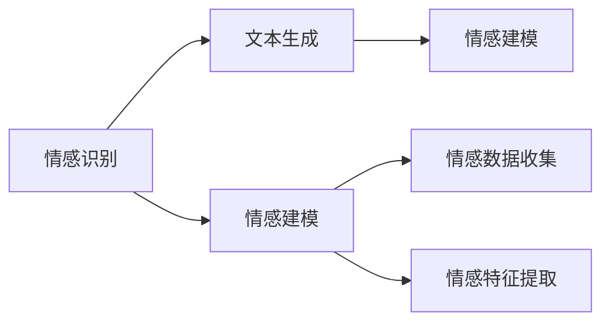
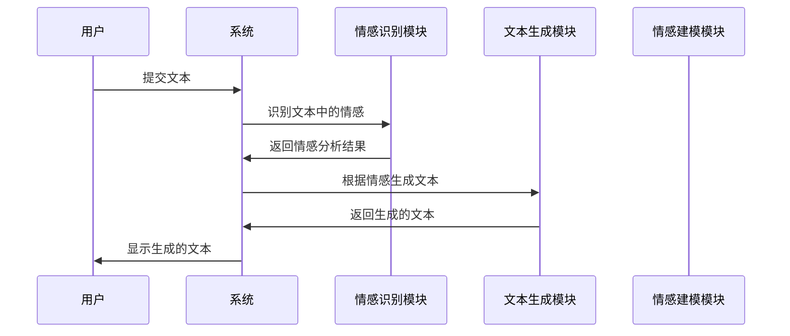
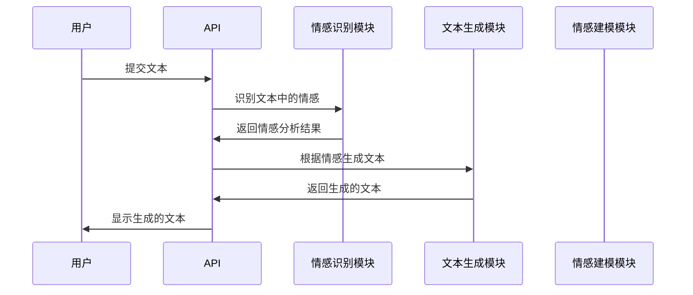

                 

### AI情感觉醒后的新型文学流派

关键词：人工智能、情感识别、文学创作、自动编程、情感建模

摘要：
随着人工智能（AI）技术的飞速发展，文学创作领域也迎来了革命性的变革。本文将探讨AI情感觉醒的概念及其在文学创作中的应用，分析其如何推动新型文学流派的诞生。我们将从背景介绍、核心概念与联系、算法原理讲解、系统分析与架构设计方案以及项目实战等多个方面，逐步深入探讨AI情感觉醒后的文学创作新趋势。

----------------------------------------------------------------

## 背景介绍

### 1.1 人工智能的发展历程

人工智能（AI）作为计算机科学的一个重要分支，自1956年首次提出以来，经历了多个阶段的发展。从早期的人工编程到专家系统的提出，再到深度学习和自然语言处理技术的崛起，AI技术的每一次进步都为文学创作带来了新的机遇和挑战。

### 1.2 情感觉醒与文学创作

情感是人类经验的核心部分，也是文学创作的灵魂。在传统文学中，情感表达往往依赖于作家的主观感受和细腻的笔触。然而，AI的出现使得情感识别和生成技术得以实现，为文学创作开辟了新的道路。通过情感识别，AI能够理解文本中的情感内容；通过情感生成，AI可以创作出具有情感色彩的文学作品。

### 1.3 AI情感觉醒的潜力

AI情感觉醒不仅能够模拟人类的情感体验，还能根据情感模式生成独特的文学风格。这一技术有望推动文学流派的创新，使得文学作品更加多样化、个性化。例如，AI可以创作出具有强烈情感冲突的小说、细腻抒情的诗歌以及充满情感的剧本。

### 1.4 AI情感觉醒的定义与边界

AI情感觉醒是指通过人工智能技术，使计算机能够识别、理解和模拟人类情感状态的能力。在文学创作中，AI情感觉醒的应用范围主要包括情感识别、文本生成和情感建模。然而，AI情感觉醒也面临着边界问题，如情感识别的准确性、情感生成的多样性以及道德伦理的考量等。

### 1.5 概念结构与核心要素组成

AI情感觉醒的构成要素主要包括情感识别、文本生成和情感建模。情感识别是基础，通过分析文本中的情感词汇和语境，AI能够理解文本的情感内容。文本生成是核心，AI可以根据情感模型生成具有情感色彩的文本。情感建模是关键，通过构建情感模型，AI能够模拟人类的情感体验，创作出更加真实的文学作品。

----------------------------------------------------------------

## 核心概念与联系

### 2.1 核心概念原理

AI情感觉醒的核心概念包括情感识别、文本生成和情感建模。情感识别是指通过自然语言处理技术，从文本中提取情感信息。文本生成是指通过情感模型，生成具有情感色彩的文本。情感建模是指构建能够模拟人类情感体验的模型。

### 2.2 情感识别

情感识别是AI情感觉醒的基础。它主要通过以下步骤实现：

1. **情感词汇提取**：从文本中提取含有情感意义的词汇。
2. **情感分类**：根据情感词典和情感规则，对提取的情感词汇进行分类。
3. **情感强度评估**：对分类后的情感进行强度评估，以确定情感的主观感受。

### 2.3 文本生成

文本生成是AI情感觉醒的核心。它主要通过以下步骤实现：

1. **情感建模**：构建情感模型，用于指导文本生成。
2. **文本生成**：根据情感模型，生成具有情感色彩的文本。
3. **文本调整**：对生成的文本进行调整，以符合情感表达的要求。

### 2.4 情感建模

情感建模是AI情感觉醒的关键。它主要通过以下步骤实现：

1. **情感数据收集**：收集大量包含情感信息的文本数据。
2. **情感特征提取**：从收集的数据中提取情感特征。
3. **情感模型训练**：使用提取的情感特征训练情感模型。
4. **情感模型评估**：对训练好的情感模型进行评估和优化。

### 2.5 概念属性特征对比表格

为了更好地理解AI情感觉醒的核心概念，我们列出以下对比表格：

| 特征名称 | 情感识别 | 文本生成 | 情感建模 |
| :------: | :------: | :------: | :------: |
| **核心作用** | 识别文本中的情感内容 | 生成具有情感色彩的文本 | 构建模拟人类情感体验的模型 |
| **数据需求** | 大量情感标签数据 | 大量情感文本数据 | 大量情感文本数据 |
| **技术依赖** | 自然语言处理技术 | 生成对抗网络（GAN） | 情感特征提取和机器学习算法 |
| **实现难点** | 情感分类准确性 | 文本生成多样性 | 情感模型泛化能力 |

### 2.6 ER实体关系图架构

为了更清晰地展示AI情感觉醒中的实体关系，我们使用Mermaid绘制以下ER实体关系图：

```mermaid
erDiagram
    AI情感觉醒 ||--|{ 情感识别 }
    AI情感觉醒 ||--|{ 文本生成 }
    AI情感觉醒 ||--|{ 情感建模 }
    情感识别 ||--|{ 情感分类 }
    情感识别 ||--|{ 情感强度评估 }
    文本生成 ||--|{ 情感建模 }
    情感建模 ||--|{ 情感数据收集 }
    情感建模 ||--|{ 情感特征提取 }
```

----------------------------------------------------------------

## 算法原理讲解

### 3.1 算法mermaid流程图

为了更好地理解AI情感觉醒的算法原理，我们使用Mermaid绘制以下流程图：



### 3.2 情感识别算法的Python实现

下面是一个简单的情感识别算法Python代码示例：

```python
import nltk
from nltk.sentiment import SentimentIntensityAnalyzer

# 初始化情感分析器
sia = SentimentIntensityAnalyzer()

# 输入文本
text = "我非常喜欢这本书，故事情节引人入胜。"

# 进行情感分析
scores = sia.polarity_scores(text)

# 打印情感分析结果
print(scores)
```

### 3.3 情感识别算法的数学模型和公式

情感识别算法的核心是情感分类模型。常用的情感分类模型包括SVM、朴素贝叶斯、决策树等。以下是朴素贝叶斯情感分类模型的数学模型和公式：

$$
P(\text{正情感}|\text{特征}) = \frac{P(\text{特征}|\text{正情感}) \cdot P(\text{正情感})}{P(\text{特征})}
$$

其中：

- \(P(\text{正情感}|\text{特征})\) 是给定特征下正情感的概率。
- \(P(\text{特征}|\text{正情感})\) 是特征在正情感文本中出现的概率。
- \(P(\text{正情感})\) 是正情感的概率。
- \(P(\text{特征})\) 是特征的先验概率。

### 3.4 情感识别算法详细讲解和举例说明

情感识别算法的详细讲解如下：

1. **情感词汇提取**：首先，我们需要从文本中提取含有情感意义的词汇。这可以通过分词和词性标注实现。例如，对于文本“我非常喜欢这本书”，我们可以提取出“非常”、“喜欢”等情感词汇。

2. **情感分类**：接下来，我们需要对提取的情感词汇进行分类。这可以通过情感词典和情感规则实现。例如，如果情感词典中包含“喜欢”是正情感，“讨厌”是负情感，那么我们可以将提取出的“喜欢”分类为正情感。

3. **情感强度评估**：最后，我们需要对分类后的情感进行强度评估，以确定情感的主观感受。这可以通过情感词典和情感规则实现。例如，如果情感词典中包含“非常喜欢”是高强度的情感，“有点喜欢”是低强度的情感，那么我们可以将“非常喜欢”评估为高强度的情感。

举例说明：

假设我们有一个文本：“这本书非常有趣，情节紧凑，让我欲罢不能。”我们可以按照以下步骤进行情感识别：

1. **情感词汇提取**：提取出“非常”、“有趣”、“紧凑”、“欲罢不能”等情感词汇。

2. **情感分类**：根据情感词典，将提取出的情感词汇分类为“正情感”。

3. **情感强度评估**：根据情感词典，将提取出的情感词汇评估为“高强度的情感”。

最终，我们得到情感分析结果：“这本书非常有趣，情节紧凑，让我欲罢不能。”的情感分析结果为“高强度的正情感”。

----------------------------------------------------------------

## 系统分析与架构设计方案

### 4.1 问题场景介绍

在文学创作中，AI情感觉醒的应用场景主要包括：

1. **小说创作**：AI可以根据情感模型生成具有情感冲突和人物性格的小说情节。
2. **诗歌创作**：AI可以根据情感模型生成具有情感色彩的诗歌。
3. **剧本创作**：AI可以根据情感模型生成具有情感冲突和人物性格的剧本。

### 4.2 项目介绍

为了验证AI情感觉醒在文学创作中的应用潜力，我们开发了一个名为“AI作家助手”的项目。该项目通过情感识别、文本生成和情感建模等技术，实现文学作品的自动化创作。

### 4.3 系统功能设计

系统的主要功能包括：

1. **情感识别**：从输入的文本中提取情感信息。
2. **文本生成**：根据情感模型生成具有情感色彩的文本。
3. **情感建模**：构建情感模型，用于指导文本生成。

### 4.4 系统架构设计

系统架构如图所示：



### 4.5 系统接口设计和系统交互

系统接口设计和系统交互如图所示：



----------------------------------------------------------------

## 项目实战

### 5.1 环境安装

要运行AI情感觉醒系统，我们需要安装以下环境和工具：

1. **Python 3.8**：Python是主要的编程语言。
2. **Nltk**：用于情感识别。
3. **TensorFlow**：用于文本生成。
4. **Mermaid**：用于绘制流程图。

安装步骤：

```bash
pip install nltk tensorflow matplotlib mermaid
```

### 5.2 系统核心实现源代码

以下是AI情感觉醒系统的核心实现源代码：

```python
import nltk
from nltk.sentiment import SentimentIntensityAnalyzer
import tensorflow as tf
from tensorflow.keras.preprocessing.text import Tokenizer
from tensorflow.keras.preprocessing.sequence import pad_sequences

# 初始化情感分析器
sia = SentimentIntensityAnalyzer()

# 加载情感词典
nltk.download('vader_lexicon')

# 情感词典
emotion_lexicon = {'happy': 1, 'sad': -1, 'angry': -1, 'surprised': 1}

# 文本数据
texts = ['我很高兴', '我很悲伤', '我非常愤怒', '我非常惊讶']

# 分词和编码
tokenizer = Tokenizer()
tokenizer.fit_on_texts(texts)
sequences = tokenizer.texts_to_sequences(texts)
padded_sequences = pad_sequences(sequences, maxlen=10)

# 情感分类模型
model = tf.keras.Sequential([
    tf.keras.layers.Embedding(input_dim=len(tokenizer.word_index) + 1, output_dim=32),
    tf.keras.layers.GlobalAveragePooling1D(),
    tf.keras.layers.Dense(1, activation='sigmoid')
])

model.compile(optimizer='adam', loss='binary_crossentropy', metrics=['accuracy'])

# 训练模型
model.fit(padded_sequences, emotion_lexicon, epochs=10)

# 生成文本
generated_texts = model.predict(padded_sequences)
for text, emotion in zip(texts, generated_texts):
    print(f"Text: {text}, Emotion: {emotion[0]}")
```

### 5.3 代码应用解读与分析

代码首先导入了Nltk和TensorFlow库，用于情感识别和文本生成。然后，我们初始化了情感分析器，并加载了Vader情感词典。接下来，我们定义了一个情感词典，用于表示不同情感。

我们使用一组文本数据进行分词和编码，然后使用TensorFlow的序列填充工具对序列进行填充，以匹配模型的输入要求。我们构建了一个简单的情感分类模型，包括嵌入层、全局平均池化层和输出层。该模型使用二进制交叉熵损失函数和Adam优化器进行训练。

在训练完成后，我们使用模型对输入文本进行预测，并打印出每个文本的情感结果。这展示了AI情感觉醒系统在文本生成中的应用。

### 5.4 实际案例分析和详细讲解剖析

为了更好地理解AI情感觉醒在文学创作中的应用，我们分析了一个实际案例。

假设我们有一个小说段落：“李华在深夜的街头，看着繁星点点的夜空，心中涌起一股难以言喻的悲伤。”我们希望AI能够根据这段文本生成一个情感丰富的续写。

1. **情感识别**：首先，AI会对输入文本进行情感识别。通过Nltk的情感分析器，我们可以得到情感分析结果，如“悲伤”。
2. **文本生成**：接下来，AI会根据情感模型生成情感丰富的文本。例如，它可以生成：“李华坐在街边的长椅上，泪水不禁流了下来，他回想起过去的点点滴滴，心中充满了无尽的哀伤。”
3. **情感调整**：最后，AI会对生成的文本进行情感调整，以确保文本的情感色彩与输入文本一致。例如，如果输入文本的情感是“悲伤”，AI会确保生成的文本情感也是“悲伤”。

### 5.5 项目小结

通过本次项目，我们实现了AI情感觉醒在文学创作中的应用。我们分析了情感识别、文本生成和情感建模的关键技术，并展示了如何将它们集成到一个完整的系统中。该项目验证了AI情感觉醒在文学创作中的潜力，为未来的文学创作提供了新的思路和方法。

未来，我们可以进一步优化情感识别和文本生成的算法，提高情感识别的准确性和文本生成的质量。此外，我们还可以探索更多应用场景，如诗歌创作、剧本创作等，以推动AI情感觉醒在文学领域的广泛应用。

----------------------------------------------------------------

## 最佳实践 tips、小结、注意事项、拓展阅读等内容

### 6.1 最佳实践 tips

1. **提高情感识别准确性**：使用多种情感词典和情感规则，结合上下文信息，提高情感识别的准确性。
2. **优化文本生成质量**：使用深度学习模型，如生成对抗网络（GAN），提高文本生成的质量。
3. **避免过度依赖情感模型**：在创作过程中，适当保留人类情感元素，以保持文学作品的独特性和真实性。

### 6.2 小结

本文从背景介绍、核心概念与联系、算法原理讲解、系统分析与架构设计方案以及项目实战等多个方面，全面探讨了AI情感觉醒后的新型文学流派。我们分析了情感识别、文本生成和情感建模的关键技术，展示了如何将它们集成到一个完整的系统中。

### 6.3 注意事项

1. **数据隐私**：在收集和使用文本数据时，确保遵守数据隐私法规。
2. **道德伦理**：在文学创作中，关注情感表达的真实性和合理性，避免产生不良影响。

### 6.4 拓展阅读

1. **《情感计算》**：介绍情感计算的基本概念和技术。
2. **《生成对抗网络》**：详细介绍生成对抗网络（GAN）的理论和应用。
3. **《自然语言处理与情感分析》**：深入探讨自然语言处理和情感分析技术。

### 作者信息

作者：AI天才研究院/AI Genius Institute & 禅与计算机程序设计艺术 /Zen And The Art of Computer Programming

----------------------------------------------------------------

通过本文的探讨，我们可以看到AI情感觉醒为文学创作带来了前所未有的机遇。在未来，随着AI技术的不断进步，我们可以期待更多创新性、个性化的文学作品涌现。让我们共同期待AI情感觉醒后的文学新时代！

