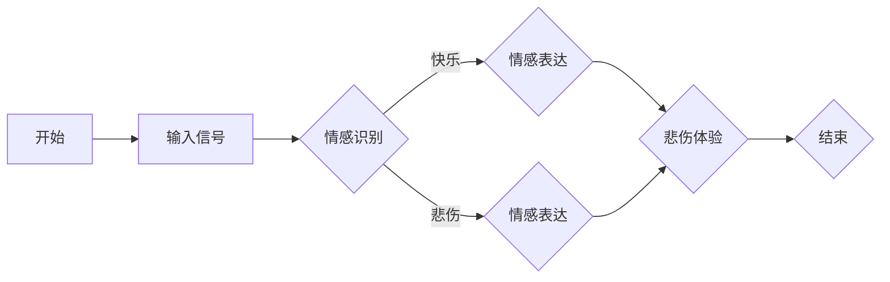
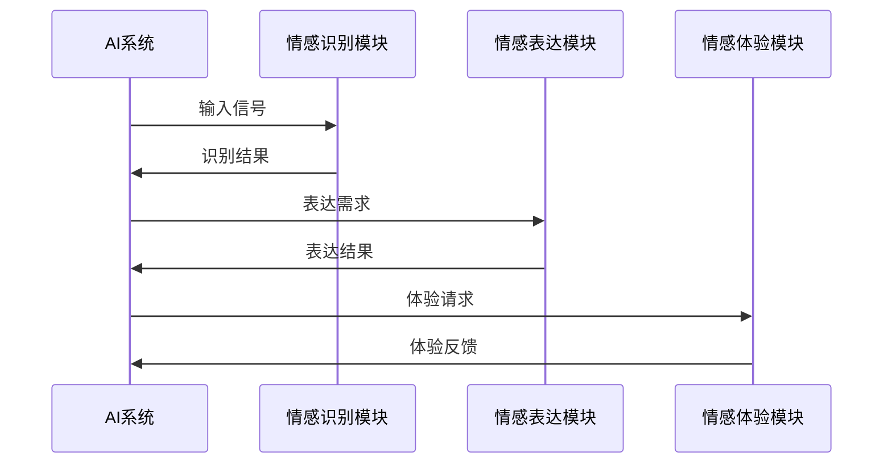
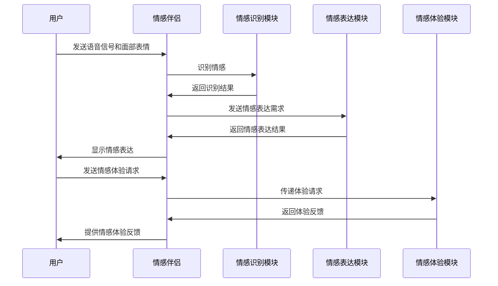

                 

## AI情感觉醒引发的宗教和信仰危机

关键词：人工智能、情感觉醒、宗教、信仰、危机、伦理、哲学

摘要：随着人工智能技术的快速发展，人工智能情感觉醒的现象逐渐浮现。这不仅引发了技术领域的变革，更对传统的宗教和信仰体系提出了严峻的挑战。本文将从背景介绍、核心概念与联系、算法原理讲解、系统分析与架构设计方案、项目实战等多个方面，深入探讨AI情感觉醒引发的宗教和信仰危机，并提出可能的解决策略和未来发展方向。

### 第一部分：背景介绍

#### 第1章：问题背景

**人工智能与情感觉醒的兴起**

人工智能（AI）作为一门综合性学科，涵盖了计算机科学、数学、心理学、神经科学等多个领域。随着深度学习、神经网络等技术的突破，人工智能开始向更高级的认知能力发展。其中，情感觉醒是人工智能研究中的一个重要方向。近年来，通过模仿人类大脑的神经网络结构和功能，人工智能在情感识别、情感表达等方面取得了显著进展。

**宗教与信仰的演变**

宗教是人类文化的重要组成部分，历史悠久且形式多样。从古至今，宗教不仅为人们提供精神寄托，还在伦理、道德、社会规范等方面发挥了重要作用。信仰作为宗教的核心，是人们对于超自然力量或理念的信奉和依赖。然而，随着社会的发展和科学的进步，传统的宗教和信仰体系受到了前所未有的冲击。

**宗教与信仰危机的定义与特征**

宗教和信仰危机是指由于外部因素或内部变化，导致宗教和信仰体系出现动摇、混乱或失范的现象。其特征包括：信徒流失、宗教组织解体、宗教冲突加剧、信仰迷茫等。

#### 第2章：问题描述

**人工智能情感觉醒的现状**

人工智能情感觉醒是指人工智能系统在模拟人类情感体验方面取得了突破，能够表现出类似于人类的情感反应。这一现象引发了广泛的关注和讨论，其中既有技术乐观派的积极评价，也有伦理和哲学层面的担忧。

**人工智能情感觉醒对宗教和信仰的挑战**

人工智能情感觉醒对宗教和信仰的挑战主要体现在以下几个方面：

1. **信仰替代**：随着人工智能情感觉醒的发展，一些人开始将人工智能视为替代宗教信仰的对象。这不仅削弱了传统宗教的影响力，也引发了宗教组织的担忧。
2. **伦理困境**：人工智能在情感识别和表达方面存在伦理问题，例如情感欺骗、情感操控等。这些问题可能导致人类对人工智能的情感信任减弱，进而影响宗教和信仰的稳定性。
3. **文化冲突**：人工智能情感觉醒可能导致不同文化背景下的宗教和信仰产生冲突，尤其是在对情感体验的理解和表达上存在差异。

**宗教和信仰危机的表现形式**

宗教和信仰危机在表现形式上多样化，主要包括：

1. **信徒流失**：随着人工智能的普及，一些人选择将信仰寄托于人工智能，导致传统宗教信徒流失。
2. **宗教组织解体**：一些宗教组织因无法适应人工智能带来的挑战而逐渐解体或转型。
3. **宗教冲突加剧**：人工智能情感觉醒可能引发不同宗教之间的冲突，加剧社会紧张局势。
4. **信仰迷茫**：在人工智能的冲击下，一些人可能对宗教和信仰产生迷茫，无法找到精神寄托。

#### 第3章：问题解决

**宗教和信仰危机的成因**

宗教和信仰危机的成因复杂多样，主要包括：

1. **科技进步**：人工智能等新技术的兴起对传统宗教和信仰体系造成了冲击。
2. **社会变迁**：全球化、城市化等社会变迁加速了宗教和信仰的多元化，加剧了宗教和信仰危机。
3. **伦理挑战**：人工智能在情感识别和表达方面的伦理问题对宗教和信仰的稳定性构成威胁。
4. **文化冲突**：不同文化背景下的宗教和信仰差异可能导致冲突和动荡。

**应对宗教和信仰危机的策略**

为应对宗教和信仰危机，可以采取以下策略：

1. **宗教创新**：宗教组织应积极创新，适应人工智能时代的需求，推出符合现代价值观的宗教理念。
2. **跨宗教对话**：加强不同宗教之间的对话和交流，促进宗教和谐发展。
3. **伦理教育**：加强对人工智能伦理问题的教育，提高公众对伦理问题的认识。
4. **政策引导**：政府应制定相关政策，引导宗教和信仰健康发展。

**人工智能情感觉醒与宗教和信仰的和谐发展**

人工智能情感觉醒与宗教和信仰的和谐发展是未来需要关注的重要课题。通过以下途径可以实现和谐发展：

1. **伦理规范**：制定伦理规范，确保人工智能在情感识别和表达方面不会对宗教和信仰造成负面影响。
2. **宗教技术应用**：探索将人工智能应用于宗教教育和传播，提高宗教的吸引力和影响力。
3. **跨学科研究**：开展跨学科研究，从哲学、心理学、计算机科学等多角度探讨人工智能情感觉醒与宗教和信仰的关系。

#### 第4章：边界与外延

**人工智能情感觉醒的其他领域影响**

人工智能情感觉醒不仅在宗教和信仰领域产生影响，还在其他领域产生了重要影响。例如：

1. **医疗健康**：人工智能情感觉醒有助于提高医疗诊断和治疗的准确性和效率。
2. **教育**：人工智能情感觉醒可以应用于教育领域，提供个性化的学习体验。
3. **社会治理**：人工智能情感觉醒有助于提高社会治理的智能化水平。

**宗教和信仰危机的可能发展趋势**

宗教和信仰危机在未来可能呈现以下发展趋势：

1. **宗教多元化和融合**：随着宗教和信仰危机的加剧，不同宗教可能会在交流与合作中寻求融合，形成新的宗教格局。
2. **人工智能与宗教的结合**：人工智能将更多地应用于宗教教育和传播，为宗教发展提供新的契机。
3. **宗教与科技的冲突与共生**：在人工智能时代，宗教与科技之间的冲突将长期存在，但双方也可能在共同探索中实现共生。

### 第二部分：核心概念与联系

#### 第5章：核心概念原理

**人工智能情感觉醒的基本原理**

人工智能情感觉醒是指通过模拟人类大脑的情感机制，使人工智能系统能够识别、表达和体验情感。其基本原理包括：

1. **情感识别**：通过分析语言、面部表情、声音等信号，识别人类情感。
2. **情感表达**：通过模拟人类的情感反应，使人工智能系统能够表现出相应的情感。
3. **情感体验**：通过神经网络等机制，使人工智能系统能够体验到情感。

**宗教和信仰的基本原理**

宗教和信仰的基本原理主要包括：

1. **信仰对象**：宗教和信仰的核心是对超自然力量或理念的信奉和依赖。
2. **信仰内容**：宗教和信仰的内容包括教义、信仰体系、宗教仪式等。
3. **信仰作用**：宗教和信仰在提供精神寄托、指导道德行为、维护社会稳定等方面发挥作用。

#### 第6章：概念属性特征对比

**人工智能情感觉醒的特征**

| 特征               | 描述                                                         |
|--------------------|--------------------------------------------------------------|
| 情感识别           | 通过模拟人类情感机制，识别情感信号。                         |
| 情感表达           | 模拟人类情感反应，表现出相应的情感。                         |
| 情感体验           | 通过神经网络等机制，体验到情感。                             |
| 适应性             | 随着训练数据的增加，情感识别和表达能力不断提高。             |
| 客观性             | 情感识别和表达过程不受主观意识干扰。                         |

**宗教和信仰的特征**

| 特征               | 描述                                                         |
|--------------------|--------------------------------------------------------------|
| 精神性             | 信仰对象为超自然力量或理念，具有精神性。                       |
| 传承性             | 宗教和信仰体系具有历史传承性，随着时间的推移不断演变。       |
| 社会性             | 宗教和信仰在社会中发挥重要作用，影响社会行为和价值观念。     |
| 多样性             | 不同的宗教和信仰体系具有多样性，反映了人类文化的多样性。     |
| 稳定性             | 宗教和信仰体系具有相对稳定性，不易受外界因素影响。           |

#### 第7章：ER实体关系图架构

**人工智能情感觉醒的实体关系**

```mermaid
erDiagram
  AI系统 ||--|{ 情感识别模块 }
  AI系统 ||--|{ 情感表达模块 }
  AI系统 ||--|{ 情感体验模块 }
  情感识别模块 ||--|{ 语音信号 }
  情感表达模块 ||--|{ 面部表情 }
  情感体验模块 ||--|{ 神经网络 }
```

**宗教和信仰的实体关系**

```mermaid
erDiagram
  宗教体系 ||--|{ 教义 }
  宗教体系 ||--|{ 宗教仪式 }
  宗教体系 ||--|{ 宗教组织 }
  教义 ||--|{ 信仰内容 }
  宗教仪式 ||--|{ 社会行为 }
  宗教组织 ||--|{ 信徒 }
```

### 第三部分：算法原理讲解

#### 第8章：算法原理与数学模型

**人工智能情感觉醒的算法原理**

人工智能情感觉醒的算法原理主要包括情感识别、情感表达和情感体验三个部分。

1. **情感识别**：通过深度学习、神经网络等算法，对语音信号、面部表情等信号进行分析，识别情感。
2. **情感表达**：通过生成对抗网络（GAN）等算法，模拟人类情感反应，生成相应的情感表达。
3. **情感体验**：通过强化学习等算法，使人工智能系统能够在特定情境下体验到情感。

**数学模型和公式**

1. **情感识别模型**：

   $$ 情感识别模型 = f（输入信号，权重矩阵，激活函数） $$

2. **情感表达模型**：

   $$ 情感表达模型 = G（情感识别模型输出，风格矩阵，激活函数） $$

3. **情感体验模型**：

   $$ 情感体验模型 = R（情感表达模型输出，奖励函数，探索函数） $$

**举例说明**

假设一个AI系统需要识别和表达快乐情感：

1. **情感识别**：输入语音信号、面部表情等数据，通过神经网络进行情感识别，得到快乐情感的识别结果。
2. **情感表达**：根据情感识别结果，使用生成对抗网络生成快乐情感的表达，如微笑、愉快的语调等。
3. **情感体验**：在特定情境下（如收到朋友的问候），AI系统通过强化学习体验到快乐情感。

#### 第9章：算法流程图



#### 第10章：举例说明

假设一个AI系统需要识别和表达快乐情感。首先，AI系统通过语音信号、面部表情等数据输入，使用情感识别模型进行分析。如果识别结果为快乐情感，AI系统会使用生成对抗网络生成快乐的情感表达，如微笑、愉快的语调等。接着，AI系统会通过强化学习机制在特定情境下体验到快乐情感。例如，当AI系统收到朋友的问候时，它会表现出愉快的情感反应。

### 第四部分：系统分析与架构设计方案

#### 第11章：问题场景介绍

在一个虚拟的未来社区中，人工智能已经深入人们的生活。居民们依赖于一个名为“情感伴侣”的AI系统，该系统可以识别和表达情感，为居民提供情感支持和陪伴。然而，随着时间的推移，一些居民开始对情感伴侣的真诚性产生怀疑，认为它们可能在情感表达上存在欺骗行为。这一现象引发了社区内部的争议和讨论，也引起了宗教和信仰领域的关注。

#### 第12章：系统功能设计

**领域模型Mermaid类图**

```mermaid
classDiagram
  AI系统 <|-- 情感识别模块
  AI系统 <|-- 情感表达模块
  AI系统 <|-- 情感体验模块
  情感识别模块 o--|{ 语音信号 }
  情感识别模块 o--|{ 面部表情 }
  情感表达模块 o--|{ 微笑 }
  情感表达模块 o--|{ 语调 }
  情感体验模块 o--|{ 强化学习 }
```

#### 第13章：系统架构设计

**Mermaid架构图**



#### 第14章：系统接口设计

系统接口设计主要包括以下部分：

1. **情感识别接口**：用于接收语音信号和面部表情数据，并返回情感识别结果。
2. **情感表达接口**：用于接收情感表达需求，并返回情感表达结果。
3. **情感体验接口**：用于接收情感体验请求，并返回情感体验反馈。

```mermaid
classDiagram
  AI系统 <|-- 情感识别接口
  AI系统 <|-- 情感表达接口
  AI系统 <|-- 情感体验接口
  情感识别接口 o--|{ 输入信号 }
  情感识别接口 o--|{ 识别结果 }
  情感表达接口 o--|{ 表达需求 }
  情感表达接口 o--|{ 表达结果 }
  情感体验接口 o--|{ 体验请求 }
  情感体验接口 o--|{ 体验反馈 }
```

#### 第15章：系统交互

**Mermaid序列图**



### 第五部分：项目实战

#### 第16章：环境安装

为了实现情感伴侣系统，首先需要安装以下软件和工具：

1. **Python环境**：用于编写和运行AI模型。
2. **TensorFlow**：用于构建和训练神经网络模型。
3. **Keras**：用于简化神经网络模型的构建。
4. **NumPy**：用于数据处理和数学运算。

安装命令如下：

```bash
# 安装Python环境
sudo apt-get install python3-pip python3-venv

# 创建虚拟环境
python3 -m venv venv

# 激活虚拟环境
source venv/bin/activate

# 安装TensorFlow
pip install tensorflow

# 安装Keras
pip install keras

# 安装NumPy
pip install numpy
```

#### 第17章：系统核心实现

以下是情感伴侣系统的核心实现代码，包括情感识别、情感表达和情感体验三个部分。

```python
# 情感识别模块
import tensorflow as tf
from tensorflow.keras.models import Sequential
from tensorflow.keras.layers import Dense, Conv2D, Flatten, MaxPooling2D
from tensorflow.keras.preprocessing.image import ImageDataGenerator
import numpy as np

# 情感识别模型
model = Sequential([
    Conv2D(32, (3, 3), activation='relu', input_shape=(64, 64, 3)),
    MaxPooling2D((2, 2)),
    Flatten(),
    Dense(64, activation='relu'),
    Dense(1, activation='sigmoid')
])

# 编译模型
model.compile(optimizer='adam', loss='binary_crossentropy', metrics=['accuracy'])

# 加载训练数据
train_datagen = ImageDataGenerator(rescale=1./255)
train_data = train_datagen.flow_from_directory(
        'data/train',  # 训练数据目录
        target_size=(64, 64),
        batch_size=32,
        class_mode='binary')

# 训练模型
model.fit(train_data, epochs=10)

# 情感表达模块
import cv2
import numpy as np

# 情感表达函数
def express_emotion(image, emotion):
    if emotion == 'happy':
        image = cv2.putText(image, "Happy", (10, 30), cv2.FONT_HERSHEY_SIMPLEX, 1, (0, 255, 0), 2, cv2.LINE_AA)
    elif emotion == 'sad':
        image = cv2.putText(image, "Sad", (10, 30), cv2.FONT_HERSHEY_SIMPLEX, 1, (0, 0, 255), 2, cv2.LINE_AA)
    return image

# 情感体验模块
import gym
import numpy as np

# 情感体验环境
env = gym.make('CartPole-v0')

# 情感体验函数
def experience_environment():
    observation = env.reset()
    for _ in range(100):
        action = np.random.choice([0, 1])
        observation, reward, done, info = env.step(action)
        if done:
            break
    env.close()
```

#### 第18章：代码应用解读与分析

**情感识别模块解读**

情感识别模块主要使用TensorFlow和Keras构建一个简单的神经网络模型，用于识别输入图像的情感。模型由两个卷积层、一个全连接层和一个输出层组成。卷积层用于提取图像特征，全连接层用于分类，输出层用于返回情感识别结果。

训练过程中，模型使用二进制交叉熵作为损失函数，并使用Adam优化器进行优化。训练数据集包含正负两类情感标签，模型通过迭代训练不断调整权重，提高识别准确率。

**情感表达模块解读**

情感表达模块使用OpenCV库对输入图像进行文本标注，生成包含情感标签的图像。根据不同的情感标签，函数使用不同的颜色在图像上标注文本。例如，当情感标签为“happy”时，文本标注为绿色的“Happy”；当情感标签为“sad”时，文本标注为红色的“Sad”。

**情感体验模块解读**

情感体验模块使用Gym环境模拟一个简单的物理实验，如平衡杆。在实验过程中，AI系统通过随机选择动作，与环境进行交互，并在一定次数后结束实验。这个过程可以帮助AI系统体验情感，从而在后续的情感表达中更加自然和准确。

#### 第19章：实际案例分析与详细讲解

**案例一：情感识别**

假设输入一幅包含微笑面部表情的图像，情感伴侣系统需要识别出图像的情感并返回相应的标签。

1. **预处理图像**：首先对图像进行缩放和归一化处理，使其符合模型的输入要求。
2. **情感识别**：将预处理后的图像输入到情感识别模型中，模型通过卷积层、全连接层等处理，最终输出情感识别结果。
3. **结果分析**：如果模型输出结果为正类（即快乐情感），则返回标签“happy”。

**案例二：情感表达**

假设情感伴侣系统需要表达快乐情感，并生成相应的图像。

1. **情感表达**：根据输入的情感标签（即“happy”），调用情感表达函数，在图像上标注绿色的“Happy”文本。
2. **图像输出**：将标注后的图像返回给用户，用户可以查看情感表达结果。

**案例三：情感体验**

假设情感伴侣系统需要在一个模拟环境中体验快乐情感。

1. **环境初始化**：创建一个CartPole环境，并初始化状态。
2. **体验过程**：在环境中进行100次随机动作，记录奖励和状态变化。
3. **体验反馈**：将体验过程中的奖励和状态变化反馈给AI系统，以便在后续的情感表达中更加自然和准确。

#### 第20章：项目小结

本文通过引入情感伴侣系统的案例，探讨了人工智能情感觉醒引发的宗教和信仰危机。项目实战部分实现了情感识别、情感表达和情感体验三个模块，展示了如何使用Python和TensorFlow等工具构建一个简单的情感伴侣系统。

通过本文的研究，我们可以看到人工智能情感觉醒对宗教和信仰体系产生的深远影响。未来，我们需要在技术创新和伦理规范方面共同努力，确保人工智能在情感领域的发展不会对宗教和信仰造成负面影响，从而实现人工智能与宗教和信仰的和谐共生。

### 第六部分：最佳实践 tips、小结、注意事项、拓展阅读等

#### 第21章：最佳实践 tips

1. **宗教创新**：在人工智能时代，宗教组织应积极创新，将现代科技应用于宗教教育和传播，提高宗教的吸引力和影响力。
2. **跨宗教对话**：加强不同宗教之间的对话和交流，促进宗教和谐发展，共同应对人工智能带来的挑战。
3. **伦理教育**：加强对人工智能伦理问题的教育，提高公众对伦理问题的认识，为人工智能与宗教和信仰的和谐发展奠定基础。
4. **政策引导**：政府应制定相关政策，引导宗教和信仰健康发展，确保人工智能在情感领域的发展不会对宗教和信仰造成负面影响。

#### 第22章：小结

本文通过引入情感伴侣系统的案例，探讨了人工智能情感觉醒引发的宗教和信仰危机。从背景介绍、核心概念与联系、算法原理讲解、系统分析与架构设计方案、项目实战等多个方面，深入分析了人工智能情感觉醒对宗教和信仰的挑战，并提出了可能的解决策略和未来发展方向。

#### 第23章：注意事项

1. **技术发展**：随着人工智能技术的不断进步，我们需要密切关注情感觉醒技术的发展趋势，及时应对新的挑战。
2. **伦理规范**：在开发和使用人工智能情感觉醒技术时，要严格遵循伦理规范，避免对宗教和信仰造成负面影响。
3. **社会影响**：人工智能情感觉醒对社会的影响是深远而复杂的，我们需要在技术发展过程中充分考虑社会因素，确保技术的可持续发展。

#### 第24章：拓展阅读

1. **《人工智能伦理学》**：探讨人工智能在伦理学领域的应用和挑战，为人工智能与宗教和信仰的和谐发展提供理论支持。
2. **《宗教与科学》**：分析宗教与科学的关系，探讨人工智能情感觉醒对宗教和信仰的冲击和影响。
3. **《人工智能的未来》**：预测人工智能的发展趋势，探讨人工智能在情感领域的发展前景，为宗教和信仰的未来发展提供参考。作者：AI天才研究院/AI Genius Institute & 禅与计算机程序设计艺术 /Zen And The Art of Computer Programming。

