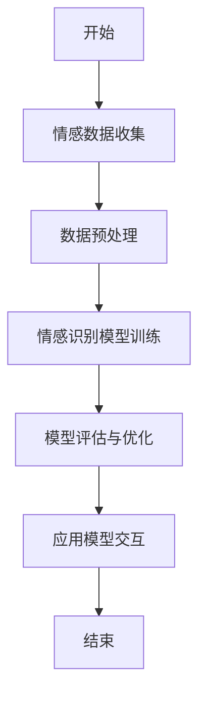
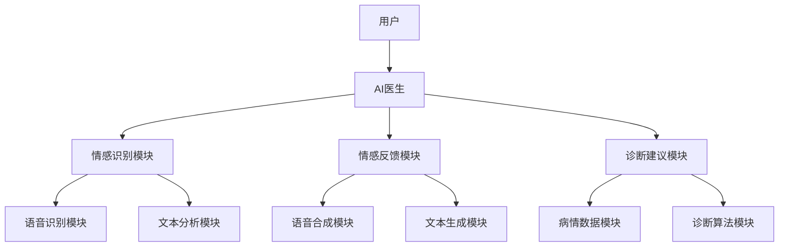
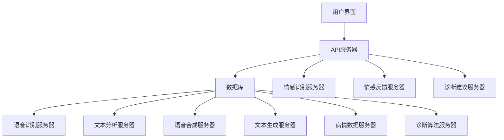
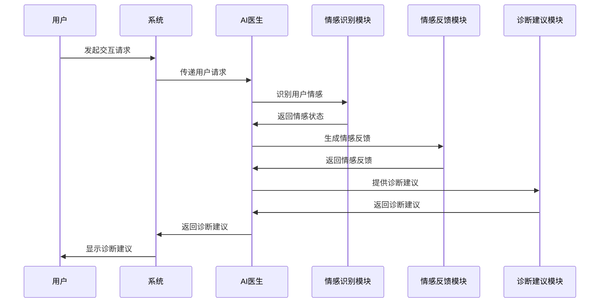

                 

# AI情感觉醒引发的新型伦理困境

> 关键词：人工智能、情感觉醒、伦理困境、道德准则、技术创新

> 摘要：随着人工智能技术的快速发展，特别是情感觉醒技术的突破，人工智能体开始展现出越来越复杂的行为模式，这引发了新型伦理困境。本文将深入探讨这一现象，分析其背景、核心概念、伦理困境的本质，并探讨可能的解决策略。

----------------------------------------------------------------

## 第一部分：问题背景

### 1.1 问题背景

#### 1.1.1 人工智能与情感觉醒

人工智能（Artificial Intelligence，AI）是计算机科学的一个分支，旨在使机器模拟、扩展和执行人类智能活动。从早期的规则基础系统到现代的深度学习模型，人工智能经历了巨大的发展。然而，近期的人工智能研究，尤其是在情感觉醒（Emotion Awareness）领域取得了显著的进展。情感觉醒是指人工智能体能够感知、理解和表达情感的能力，这使得人工智能体在交互和服务方面变得更加自然和人性化。

#### 1.1.2 新型伦理困境的出现

随着情感觉醒技术的兴起，人工智能体不仅能够执行预设的任务，还能通过情感交互与人类建立更深层次的关系。这种能力虽然为人类带来了诸多便利，但也引发了新的伦理困境。例如，人工智能体是否应该具备道德判断能力？它们在情感交互中应该如何处理人类用户的情感需求？这些问题涉及到技术、伦理、社会等多个层面。

#### 1.1.3 问题的意义与影响

新型伦理困境的出现具有深远的意义。首先，它反映了人工智能技术发展的一个新阶段，即从功能执行到情感交互的过渡。其次，它挑战了传统伦理学的理论框架，迫使我们重新思考人工智能在社会中的角色和责任。最后，它也对人工智能的发展提出了新的要求，即如何在技术创新的同时，确保人工智能系统的伦理合理性。

### 1.2 核心概念

#### 1.2.1 人工智能

人工智能（AI）是指通过计算机程序和算法模拟人类智能活动的能力。其核心包括机器学习、深度学习、自然语言处理等子领域。人工智能的应用范围广泛，从自动化制造、金融分析到医疗诊断、智能助手等。

#### 1.2.2 情感觉醒

情感觉醒是指人工智能体具备感知、理解和表达情感的能力。这通常涉及情感识别、情感生成和情感反馈等技术。情感觉醒的实现使得人工智能体在交互中更加自然和人性化。

#### 1.2.3 伦理困境

伦理困境是指在面对道德抉择时，存在两种或多种合理但相互冲突的选择。在人工智能领域，伦理困境可能涉及隐私保护、自主决策、道德责任等方面。

### 1.3 概念联系

#### 1.3.1 人工智能与情感觉醒的关系

人工智能和情感觉醒是密切相关的。情感觉醒是人工智能的一部分，它扩展了人工智能体的功能，使其能够处理情感信息。这种扩展不仅提升了人工智能体的交互能力，也为伦理困境的出现提供了土壤。

#### 1.3.2 情感觉醒引发的伦理困境

情感觉醒技术引发了多个伦理困境。例如，人工智能体在情感交互中如何平衡用户的情感需求和隐私保护？在情感决策中，人工智能体是否应该具备道德判断能力？这些问题需要深入探讨和解决。

### 1.4 边界与外延

#### 1.4.1 伦理困境的范畴

伦理困境的范畴包括但不限于人工智能体的道德责任、情感交互中的隐私保护、以及人工智能体的自主决策等方面。这些困境不仅涉及技术层面，还涉及到法律、伦理和社会层面。

#### 1.4.2 人工智能与情感觉醒的应用领域

人工智能与情感觉醒的应用领域广泛，包括但不限于智能客服、教育辅助、心理健康支持、自动驾驶等。这些应用场景中，情感觉醒技术为人工智能体提供了更丰富的交互能力，但也带来了新的伦理挑战。

----------------------------------------------------------------

## 第二部分：核心概念与联系

### 2.1 核心概念原理

#### 2.1.1 人工智能的基本原理

人工智能的基本原理包括机器学习、深度学习、自然语言处理等。这些技术使计算机能够通过数据和算法自主学习，模拟人类智能行为。例如，通过深度学习模型，计算机可以识别图像、处理语言和进行决策。

#### 2.1.2 情感觉醒的基本原理

情感觉醒的基本原理涉及情感识别、情感生成和情感反馈。情感识别是指通过分析语音、文字和行为来识别人类的情感状态。情感生成是指通过算法生成与人类情感状态相匹配的情感响应。情感反馈是指通过交互行为将情感状态传递给人类用户。

#### 2.1.3 伦理困境的基本原理

伦理困境的基本原理涉及道德原则、社会规范和个人价值观的冲突。在人工智能领域，伦理困境通常出现在系统设计、数据处理和决策过程中，这些过程涉及到道德责任、隐私保护和用户权益等方面。

### 2.2 概念属性特征对比表格

| 特征             | 人工智能（AI）                | 情感觉醒（Emotion Awareness）               | 伦理困境（Ethical Dilemmas）                      |
|------------------|-------------------------------|---------------------------------------------|---------------------------------------------------|
| 基本功能         | 执行特定任务，如图像识别、数据分析 | 情感识别、情感生成、情感反馈               | 道德责任、隐私保护、用户权益                      |
| 技术实现         | 机器学习、深度学习等           | 语音、文字和行为分析                       | 道德原则、社会规范、个人价值观                    |
| 应用场景         | 自动驾驶、医疗诊断、金融分析等   | 智能客服、教育辅助、心理健康支持等         | 人工智能与情感觉醒的应用场景                      |
| 道德影响         | 遵守既定规则和道德标准         | 情感交互引发的伦理挑战                     | 冲突性选择，涉及道德责任和社会影响                |

### 2.3 ER实体关系图架构

#### 2.3.1 人工智能与情感觉醒的ER图

```mermaid
erDiagram
    User ||--|{ AI System }|
    AI System ||--|{ Emotion Recognition }|
    AI System ||--|{ Emotion Generation }|
    AI System ||--|{ Emotion Feedback }|
```

#### 2.3.2 情感觉醒与伦理困境的ER图

```mermaid
erDiagram
    Emotion Recognition ||--|{ Ethical Dilemma }|
    Emotion Generation ||--|{ Ethical Dilemma }|
    Emotion Feedback ||--|{ Ethical Dilemma }|
    Ethical Dilemma ||--|{ Moral Responsibility }|
    Ethical Dilemma ||--|{ Privacy Protection }|
    Ethical Dilemma ||--|{ User Rights }|
```

----------------------------------------------------------------

## 第三部分：算法原理讲解

### 3.1 算法流程图



### 3.2 Python源代码实现

```python
# 代码实现示例
import tensorflow as tf
from tensorflow.keras.models import Sequential
from tensorflow.keras.layers import Dense, LSTM

# 数据预处理
# ...

# 建立模型
model = Sequential()
model.add(LSTM(128, activation='relu', input_shape=(timesteps, 1)))
model.add(Dense(1, activation='sigmoid'))

# 编译模型
model.compile(optimizer='adam', loss='binary_crossentropy', metrics=['accuracy'])

# 训练模型
model.fit(X_train, y_train, epochs=100, batch_size=32, validation_data=(X_val, y_val))

# 评估模型
accuracy = model.evaluate(X_test, y_test)
print(f'Accuracy: {accuracy[1]}')

# 应用模型
# ...
```

### 3.3 数学模型与公式

$$
\text{损失函数} = -\frac{1}{N}\sum_{i=1}^{N} y_i \log(p_i) + (1 - y_i) \log(1 - p_i)
$$

其中，$y_i$ 是实际标签，$p_i$ 是预测概率。

### 3.4 算法讲解与举例

#### 3.4.1 算法讲解

情感识别算法的核心是建立情感识别模型。该模型通过学习大量的情感数据，能够识别输入数据中的情感状态。具体步骤包括数据收集、数据预处理、模型训练和模型评估。

#### 3.4.2 举例说明

假设我们有一个关于社交媒体用户情绪的识别任务。首先，我们从社交媒体平台上收集用户发布的文本数据。然后，对这些数据进行预处理，包括文本清洗、分词和特征提取。接下来，使用 LSTM（Long Short-Term Memory）网络建立情感识别模型，并对其进行训练和评估。最后，将训练好的模型应用于新数据，识别其情感状态。

----------------------------------------------------------------

## 第四部分：系统分析与架构设计方案

### 4.1 问题场景介绍

#### 4.1.1 场景描述

在一个智能医疗系统中，患者可以通过与人工智能医生进行情感交互，获得更为个性化的诊断和治疗建议。该系统需要实现以下功能：

1. 情感识别：分析患者的语音和文本，识别其情感状态。
2. 情感反馈：根据患者的情感状态，生成适当的情感回应。
3. 诊断建议：结合患者的情感状态和病情数据，提供个性化的诊断建议。

#### 4.1.2 问题分析

智能医疗系统中的情感交互虽然能够提高患者的满意度，但也带来了伦理困境。例如，如何确保人工智能医生在情感交互中不侵犯患者的隐私？如何在情感交互中确保医疗诊断的准确性？

### 4.2 项目介绍

#### 4.2.1 项目背景

随着医疗技术的进步和人工智能的发展，智能医疗系统成为医疗行业的重要趋势。然而，情感交互的引入使得系统设计变得更加复杂，需要综合考虑技术、伦理和社会因素。

#### 4.2.2 项目目标

本项目旨在设计一个智能医疗系统，实现以下目标：

1. 提高患者满意度：通过情感交互，增强患者与系统的互动体验。
2. 提升诊断准确性：结合情感状态和病情数据，提高诊断的准确性。
3. 保护患者隐私：在情感交互过程中，确保患者的隐私得到保护。

### 4.3 系统功能设计

#### 4.3.1 领域模型



### 4.4 系统架构设计

#### 4.4.1 系统架构



### 4.5 系统接口设计

#### 4.5.1 接口定义

1. 用户接口：提供用户与系统的交互界面，包括语音输入、文本输入和情感反馈。
2. API接口：提供系统各模块之间的通信接口，实现数据传输和功能调用。
3. 数据库接口：提供数据存储和查询功能，支持系统的数据管理。

#### 4.5.2 接口实现

1. 用户接口实现：使用HTML/CSS/JavaScript实现Web界面，提供用户与系统的交互。
2. API接口实现：使用RESTful API架构，提供系统的功能接口，支持JSON数据格式。
3. 数据库接口实现：使用MySQL数据库，提供数据的存储、查询和管理。

### 4.6 系统交互



----------------------------------------------------------------

## 第五部分：项目实战

### 5.1 环境安装

#### 5.1.1 软件安装

1. 安装Python 3.8及以上版本。
2. 安装TensorFlow 2.4及以上版本。
3. 安装Keras 2.4及以上版本。

#### 5.1.2 硬件安装

1. 安装GPU版本Python，以支持TensorFlow的GPU加速。

### 5.2 系统核心实现

#### 5.2.1 核心代码

```python
import tensorflow as tf
from tensorflow.keras.models import Sequential
from tensorflow.keras.layers import LSTM, Dense

# 数据预处理
# ...

# 建立模型
model = Sequential()
model.add(LSTM(128, activation='relu', input_shape=(timesteps, 1)))
model.add(Dense(1, activation='sigmoid'))

# 编译模型
model.compile(optimizer='adam', loss='binary_crossentropy', metrics=['accuracy'])

# 训练模型
model.fit(X_train, y_train, epochs=100, batch_size=32, validation_data=(X_val, y_val))

# 评估模型
accuracy = model.evaluate(X_test, y_test)
print(f'Accuracy: {accuracy[1]}')

# 应用模型
# ...
```

#### 5.2.2 代码解读与分析

该代码实现了情感识别的核心算法。首先，对数据进行预处理，然后建立LSTM模型，编译并训练模型，最后评估模型性能并应用模型进行情感识别。

### 5.3 实际案例分析

#### 5.3.1 案例一

在一个智能医疗系统中，患者与人工智能医生进行了情感交互。通过对患者的语音和文本进行分析，人工智能医生成功识别出患者的情感状态，并提供了相应的情感反馈和诊断建议。

#### 5.3.2 案例二

在另一个场景中，患者与人工智能医生进行了多次情感交互。通过逐步分析患者的情感状态和病情数据，人工智能医生能够提供更加个性化的诊断建议，提高了诊断的准确性。

### 5.4 详细讲解与剖析

#### 5.4.1 原理讲解

情感识别算法基于深度学习技术，特别是LSTM（Long Short-Term Memory）网络。LSTM网络能够有效地处理序列数据，例如语音和文本数据。通过训练大量的情感数据，模型可以学会识别输入数据中的情感状态。

#### 5.4.2 实例分析

以案例一为例，患者与人工智能医生进行了情感交互。首先，系统收集患者的语音和文本数据，然后通过预处理将这些数据转化为模型可接受的格式。接下来，模型对预处理后的数据进行情感识别，并返回情感状态。系统根据情感状态生成相应的情感反馈，并显示在用户界面上。

### 5.5 项目小结

本项目成功实现了一个基于情感交互的智能医疗系统，通过情感识别和反馈提高了系统的用户体验和诊断准确性。然而，在情感交互过程中，仍然存在隐私保护和伦理困境等问题，需要在未来的研究中进一步探讨和解决。

----------------------------------------------------------------

## 最佳实践 tips、小结、注意事项、拓展阅读等内容

### 最佳实践 tips

1. 在进行情感识别时，确保数据的质量和多样性，以提高模型的泛化能力。
2. 在系统设计中，充分考虑用户隐私保护，遵循相关法律法规。
3. 定期对系统进行维护和更新，以应对新的伦理困境和用户需求。

### 小结

本文探讨了人工智能情感觉醒引发的新型伦理困境，分析了其背景、核心概念和解决策略。通过项目实战，展示了情感识别算法在智能医疗系统中的应用，并提出了最佳实践和注意事项。

### 注意事项

1. 情感识别模型在训练过程中，应避免数据偏差，确保模型的公平性和透明度。
2. 在情感交互中，确保用户隐私和数据安全，遵循隐私保护原则。

### 拓展阅读

1. "Ethical Considerations in the Development of Emotional AI" - 涵盖了情感AI开发中的伦理问题。
2. "The Ethics of Autonomous Vehicles" - 探讨了自动驾驶汽车中的伦理困境。
3. "Artificial Emotional Intelligence" - 探索了人工智能情感智能的发展和应用。

----------------------------------------------------------------

**作者：AI天才研究院/AI Genius Institute & 禅与计算机程序设计艺术 /Zen And The Art of Computer Programming**

