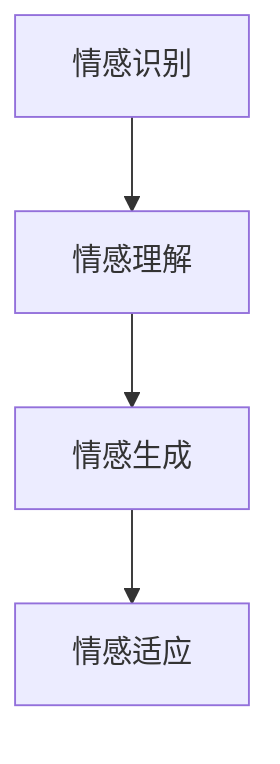
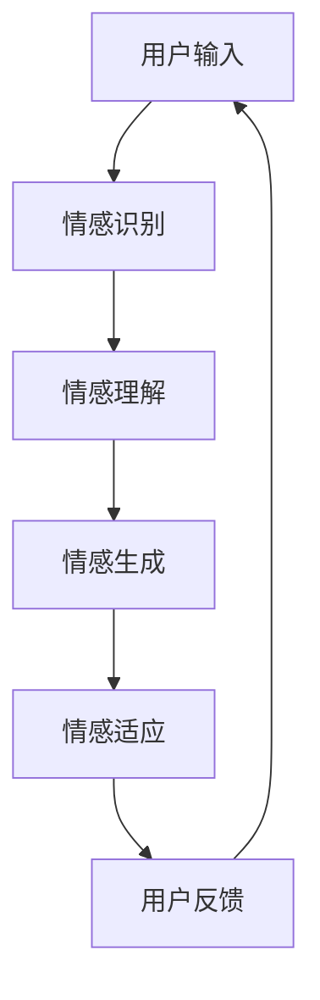

                 

### 文章标题：AI情感适应：机器情感的文化差异

### 关键词：AI情感适应、文化差异、机器情感、算法原理、系统架构设计

### 摘要：
本文旨在探讨人工智能情感适应领域中的一个关键问题——文化差异对机器情感的影响。通过深入分析文化差异的概念、背景及其在机器情感适应中的重要性，本文将逐步阐述机器情感适应的算法原理，并详细解析相关的数学模型。此外，本文还将介绍系统分析与架构设计的方法，并提供一个具体的项目实战案例。最后，本文将对最佳实践、注意事项和拓展阅读进行总结，为读者提供深入理解和进一步探索的途径。

---

### 目录大纲设计思路

为了设计一本详尽的《AI情感适应：机器情感的文化差异》目录大纲，我们需遵循以下几个核心步骤：

1. **背景介绍**：首先，我们需要对人工智能情感适应的重要性进行概述，并详细讨论文化差异对机器情感的影响。
2. **核心概念与联系**：明确涉及的核心概念，通过对比表格和Mermaid流程图展示它们之间的关系。
3. **算法原理讲解**：使用Mermaid流程图和Python源代码详细阐述机器情感适应的算法原理，并使用LaTeX格式展示相关的数学公式。
4. **数学模型和公式**：运用LaTeX格式展示数学公式，并进行详细讲解和举例说明。
5. **系统分析与架构设计方案**：介绍相关系统分析与架构设计的步骤和方法。
6. **项目实战**：提供具体的项目实战案例，包括环境安装、系统实现、代码解读、案例分析等。
7. **最佳实践、小结、注意事项、拓展阅读**：总结书中的要点，并提供相关的实践建议和拓展资料。

接下来，我们将根据这些步骤，为本书设计一个详细的目录大纲。

### 目录大纲

**第一部分：AI情感适应的背景与重要性**

# 第1章：AI情感适应概述

## 1.1 人工智能情感适应的定义与意义

### 1.1.1 人工智能情感适应的定义

### 1.1.2 情感适应在人工智能中的重要性

## 1.2 文化差异的概述

### 1.2.1 文化差异的定义

### 1.2.2 文化差异的类型

### 1.2.3 文化差异的影响

## 1.3 文化差异对机器情感的影响

### 1.3.1 文化差异在机器情感适应中的挑战

### 1.3.2 文化差异对机器情感识别的干扰

### 1.3.3 文化差异对机器情感生成的限制

## 1.4 AI情感适应的发展现状与趋势

### 1.4.1 AI情感适应的发展历程

### 1.4.2 当前AI情感适应的应用领域

### 1.4.3 未来发展趋势

## 1.5 本章小结

---

**第二部分：核心概念与联系**

# 第2章：核心概念与联系

## 2.1 机器情感与人类情感对比

### 2.1.1 机器情感的定义与属性

### 2.1.2 人类情感的定义与属性

### 2.1.3 对比表格：机器情感与人类情感

## 2.2 AI情感适应的关键技术

### 2.2.1 情感识别技术

### 2.2.2 情感生成技术

### 2.2.3 情感适应算法

## 2.3 Mermaid流程图：AI情感适应框架



## 2.4 本章小结

---

**第三部分：算法原理讲解**

# 第3章：机器情感适应算法原理

## 3.1 情感识别算法

### 3.1.1 算法介绍

### 3.1.2 算法流程

### 3.1.3 Python源代码实现

### 3.1.4 算法原理讲解

### 3.1.5 举例说明

$$
\text{机器情感识别率} = \frac{\text{正确识别的情感数}}{\text{总情感数}}
$$

## 3.2 情感生成算法

### 3.2.1 算法介绍

### 3.2.2 算法流程

### 3.2.3 Python源代码实现

### 3.2.4 算法原理讲解

### 3.2.5 举例说明

$$
\text{情感生成效果} = \text{文本内容} \times \text{情感倾向度}
$$

## 3.3 情感适应算法

### 3.3.1 算法介绍

### 3.3.2 算法流程

### 3.3.3 Python源代码实现

### 3.3.4 算法原理讲解

### 3.3.5 举例说明

$$
\text{情感适应度} = \text{当前情感状态} + \text{文化差异调整值}
$$

## 3.4 本章小结

---

**第四部分：系统分析与架构设计**

# 第4章：系统分析与架构设计

## 4.1 问题场景介绍

### 4.1.1 场景一：客服机器人情感适应

### 4.1.2 场景二：教育机器人情感适应

## 4.2 项目介绍

### 4.2.1 项目背景

### 4.2.2 项目目标

## 4.3 系统功能设计

### 4.3.1 功能需求分析

### 4.3.2 领域模型Mermaid类图

## 4.4 系统架构设计

### 4.4.1 架构设计原则

### 4.4.2 系统架构Mermaid架构图

## 4.5 系统接口设计

### 4.5.1 接口规范

### 4.5.2 接口实现

## 4.6 系统交互设计

### 4.6.1 交互流程

### 4.6.2 Mermaid序列图

## 4.7 本章小结

---

### 完整的目录大纲设计思路到这里结束。接下来，我们将逐步深入每一部分的内容，为读者提供全面而深入的见解。让我们一步步思考，深入探讨AI情感适应与机器情感的文化差异。

---

**第一部分：AI情感适应的背景与重要性**

### 1.1 人工智能情感适应的定义与意义

#### 1.1.1 人工智能情感适应的定义

人工智能情感适应（Artificial Intelligence Emotional Adaptation）是指人工智能系统在面对不同文化背景下的用户时，能够根据用户的情感状态进行相应的调整和响应。这种适应不仅包括识别用户的情感状态，还涉及到生成合适的情感反应以及调整系统行为，以达到更好的用户互动效果。

#### 1.1.2 情感适应在人工智能中的重要性

情感适应在人工智能中的应用具有深远的影响。首先，它能够提高人机交互的自然性和流畅性。通过识别和理解用户的情感状态，人工智能系统能够提供更加个性化、贴心的服务。其次，情感适应有助于提升用户满意度。例如，客服机器人通过情感适应可以更好地理解用户的需求和情绪，从而提供更加有效的解决方案。此外，情感适应还能够增强人工智能系统的可信度，使得用户更愿意接受和依赖这些系统。

### 1.2 文化差异的概述

#### 1.2.1 文化差异的定义

文化差异是指不同社会群体在价值观、信仰、行为规范、语言习惯等方面的不同。文化差异是社会发展历史和地理环境共同作用的结果，它不仅影响人们的日常生活，也深刻地影响着人们的情感表达和认知方式。

#### 1.2.2 文化差异的类型

文化差异可以分为以下几种类型：

1. **语言文化差异**：不同语言系统中的词汇、语法和表达方式都有所不同，这会影响情感的传递和理解。
2. **价值观文化差异**：不同的社会和文化背景会导致人们对事物的价值判断和优先级排序存在差异。
3. **信仰文化差异**：宗教信仰、神话传说等都是文化的重要组成部分，它们影响着人们的情感态度和行为模式。
4. **行为文化差异**：不同的文化背景下，人们在社交礼仪、饮食方式、娱乐习惯等方面的行为方式也有所不同。

#### 1.2.3 文化差异的影响

文化差异对人类社会的各个方面都产生了深远的影响：

1. **情感表达**：不同的文化背景会导致人们对情感的表达方式有所不同，例如一些文化中情感表达更为含蓄，而另一些文化中则更为直接。
2. **社会交往**：文化差异会影响人们在社会交往中的互动模式，例如一些文化中强调集体主义，而另一些文化中则强调个人主义。
3. **心理健康**：长期生活在文化差异较大的环境中可能会导致心理压力和适应困难，影响个体的心理健康。

### 1.3 文化差异对机器情感的影响

#### 1.3.1 文化差异在机器情感适应中的挑战

文化差异给机器情感适应带来了诸多挑战：

1. **情感识别的困难**：由于语言和文化习惯的不同，机器在识别用户的情感状态时可能会出现误判，尤其是在跨语言和跨文化的情境中。
2. **情感生成的挑战**：机器在生成情感反应时，需要考虑到文化差异，以确保反应符合用户的期待和价值观。
3. **适应策略的复杂度**：文化差异的多样性和复杂性使得机器在制定适应策略时需要考虑更多的变量和可能性，这增加了算法设计的难度。

#### 1.3.2 文化差异对机器情感识别的干扰

文化差异对机器情感识别的干扰主要体现在以下几个方面：

1. **语言障碍**：不同语言中的情感词汇和表达方式有所不同，这会影响机器对情感信息的提取和理解。
2. **情绪表达的多样性**：不同文化背景下，人们的情绪表达方式也有所不同，例如一些文化中情感表达更为直接，而另一些文化中则更为含蓄。
3. **情感符号的含义**：相同的情感符号在不同的文化背景下可能具有不同的含义，这会导致机器在情感识别时出现混淆。

#### 1.3.3 文化差异对机器情感生成的限制

文化差异对机器情感生成的限制主要体现在以下几个方面：

1. **文化适宜性**：机器生成的情感反应需要符合不同文化背景下的价值观和习俗，以确保用户接受和认可。
2. **情感表达的适当性**：机器在生成情感反应时，需要考虑用户的文化背景，避免出现不恰当或冒犯性的情感表达。
3. **情感生成的多样性**：不同文化背景下，人们对情感反应的期望和偏好有所不同，机器需要具备生成多样化情感反应的能力。

### 1.4 AI情感适应的发展现状与趋势

#### 1.4.1 AI情感适应的发展历程

人工智能情感适应的研究始于20世纪80年代，随着人工智能技术的不断发展和应用的深入，情感适应逐渐成为人工智能研究的一个重要方向。以下是一些重要的里程碑：

1. **情感识别技术的初步探索**：20世纪80年代，研究人员开始探索如何使用计算机技术来识别人类的情感状态，这为后来的情感适应研究奠定了基础。
2. **情感生成技术的出现**：20世纪90年代，随着自然语言处理技术的进步，情感生成技术开始出现，这使得机器能够根据情感识别的结果生成相应的情感反应。
3. **情感适应算法的研究**：21世纪初，随着机器学习和深度学习技术的兴起，情感适应算法得到了快速发展，使得机器能够更好地适应不同文化背景下的用户需求。
4. **跨文化情感适应的研究**：近年来，随着全球化进程的加快，跨文化情感适应成为研究的热点，研究人员开始探讨如何在不同的文化背景下实现有效的情感适应。

#### 1.4.2 当前AI情感适应的应用领域

当前，AI情感适应已经广泛应用于多个领域：

1. **客户服务**：客服机器人通过情感适应能够更好地理解客户的需求和情绪，提供个性化的服务，提升客户满意度。
2. **教育**：教育机器人通过情感适应能够更好地与学习者互动，根据学习者的情感状态调整教学策略，提高学习效果。
3. **医疗健康**：医疗健康领域的AI系统通过情感适应能够更好地与患者沟通，提供心理支持和辅助诊断。
4. **智能家居**：智能家居设备通过情感适应能够更好地理解用户的需求和情绪，提供个性化的服务和体验。

#### 1.4.3 未来发展趋势

随着技术的不断进步，AI情感适应未来将呈现以下发展趋势：

1. **跨文化情感适应的深化**：随着全球化进程的加快，跨文化情感适应将成为一个更加重要的研究方向，研究者将探讨如何在更广泛的文化背景下实现有效的情感适应。
2. **情感生成的多样化**：未来的AI系统将能够生成更加多样化、个性化的情感反应，以满足不同用户的需求。
3. **情感适应与伦理道德的结合**：随着AI情感的进步，如何在确保用户隐私和伦理道德的前提下实现情感适应将成为一个重要的研究课题。

### 1.5 本章小结

通过本章的介绍，我们了解了AI情感适应的定义、意义以及文化差异对机器情感的影响。文化差异不仅给机器情感识别和生成带来了挑战，也为情感适应算法的设计带来了新的机遇。未来，随着技术的不断进步，AI情感适应将在更多领域发挥重要作用，推动人机交互的发展。

---

### 第二部分：核心概念与联系

#### 2.1 机器情感与人类情感对比

机器情感与人类情感在定义、属性和应用场景上存在显著差异。以下是机器情感与人类情感的主要对比：

1. **定义**：

   - **机器情感**：指人工智能系统在处理人类情感信息时模拟出的情感反应，这些情感反应是通过算法和模型计算得到的，不具有真正的情感体验。
   - **人类情感**：指人类在生理、心理和社会交往过程中产生的情感体验，如快乐、悲伤、愤怒等。

2. **属性**：

   - **机器情感**：具有可编程性、可重复性和一致性。机器情感可以根据算法调整和优化，以适应不同的应用场景。
   - **人类情感**：具有复杂性、多样性和个体差异性。人类情感受个体心理状态、文化背景和环境因素等多种因素的影响。

3. **应用场景**：

   - **机器情感**：主要应用于人机交互、智能客服、虚拟助手等领域，以提供更自然、流畅的交互体验。
   - **人类情感**：贯穿于人类生活的各个方面，如社交、工作、学习等，是人类心理和生理健康的基石。

#### 2.2 AI情感适应的关键技术

AI情感适应的实现依赖于一系列关键技术的支持，主要包括情感识别技术、情感生成技术和情感适应算法。

1. **情感识别技术**：

   - **技术介绍**：情感识别技术是指通过分析文本、语音、图像等数据，识别出用户的情感状态。这通常涉及到自然语言处理、语音识别和计算机视觉等技术。
   - **技术原理**：情感识别技术利用机器学习和深度学习算法，从大量的情感数据中学习情感特征，从而实现对情感状态的自动识别。

2. **情感生成技术**：

   - **技术介绍**：情感生成技术是指根据用户的情感状态生成相应的情感反应，以实现与用户的情感互动。这通常涉及到自然语言生成、语音合成和表情合成等技术。
   - **技术原理**：情感生成技术通过分析用户的情感状态和上下文环境，生成符合情感逻辑和语境的自然语言文本、语音或表情。

3. **情感适应算法**：

   - **技术介绍**：情感适应算法是指根据用户的情感状态和需求，调整系统的行为和输出，以实现更好的用户体验。这通常涉及到情感状态预测、行为调整和交互优化等技术。
   - **技术原理**：情感适应算法通过分析用户的情感数据和行为模式，预测用户的情感状态和需求，并根据这些预测结果调整系统的行为和输出。

#### 2.3 Mermaid流程图：AI情感适应框架

为了更好地理解AI情感适应的实现过程，我们可以使用Mermaid流程图来展示其关键步骤和流程。以下是AI情感适应的基本流程：



在该流程图中，用户输入（A）经过情感识别（B）得到用户的情感状态，然后通过情感理解（C）和情感生成（D）生成相应的情感反应，最终通过情感适应（E）调整系统的行为，以提供更好的用户体验。用户反馈（F）则用于评估和优化系统的情感适应效果。

#### 2.4 本章小结

通过本章的介绍，我们深入探讨了机器情感与人类情感的对比，以及AI情感适应的关键技术。理解这些核心概念和联系，有助于我们更好地设计和实现AI情感适应系统，从而提升人机交互的自然性和流畅性。在接下来的章节中，我们将进一步详细阐述这些技术，并探讨其在实际应用中的实现方法和挑战。

---

### 第三部分：算法原理讲解

#### 3.1 情感识别算法

情感识别是AI情感适应中的关键环节，它决定了系统能否准确地理解用户的情感状态。本节将详细讲解情感识别算法的原理，并展示其实现流程。

##### 3.1.1 算法介绍

情感识别算法旨在从用户的输入数据（如文本、语音、图像等）中识别出情感状态。常见的方法包括基于规则的方法、机器学习方法以及深度学习方法。

- **基于规则的方法**：这种方法通过定义一系列规则来识别情感，如使用关键词匹配、情感词典等。这种方法简单直观，但适应性和准确性有限。
- **机器学习方法**：机器学习方法利用大量标注的情感数据训练模型，如支持向量机（SVM）、决策树等。这种方法具有较高的准确性，但需要大量标注数据。
- **深度学习方法**：深度学习方法利用神经网络（如卷积神经网络（CNN）、循环神经网络（RNN）等）自动提取特征，实现情感识别。这种方法具有强大的特征提取能力，但在训练数据不足时可能表现不佳。

##### 3.1.2 算法流程

情感识别算法的基本流程包括数据预处理、特征提取、模型训练和情感识别。

1. **数据预处理**：
   - **文本数据**：进行分词、去停用词、词性标注等操作，以便于后续的特征提取。
   - **语音数据**：进行语音信号的处理，如归一化、滤波等，以便于特征提取。
   - **图像数据**：进行图像的预处理，如缩放、裁剪、灰度化等，以便于特征提取。

2. **特征提取**：
   - **文本数据**：使用词袋模型、TF-IDF、Word2Vec等方法提取特征向量。
   - **语音数据**：使用梅尔频率倒谱系数（MFCC）、频谱特征等方法提取特征向量。
   - **图像数据**：使用卷积神经网络（CNN）提取特征向量。

3. **模型训练**：
   - 使用训练数据集对模型进行训练，调整模型的参数，提高识别准确率。

4. **情感识别**：
   - 使用训练好的模型对测试数据进行情感识别，输出情感状态。

##### 3.1.3 Python源代码实现

以下是使用Python实现文本情感识别的示例代码：

```python
import jieba
from sklearn.feature_extraction.text import TfidfVectorizer
from sklearn.model_selection import train_test_split
from sklearn.svm import SVC
from sklearn.metrics import accuracy_score

# 1. 数据预处理
def preprocess_text(text):
    words = jieba.lcut(text)
    words = [word for word in words if word not in jieba.get_vocab().keys()]
    return ' '.join(words)

# 2. 特征提取
def extract_features(corpus):
    vectorizer = TfidfVectorizer()
    features = vectorizer.fit_transform(corpus)
    return features

# 3. 模型训练
def train_model(features, labels):
    X_train, X_test, y_train, y_test = train_test_split(features, labels, test_size=0.2, random_state=42)
    model = SVC()
    model.fit(X_train, y_train)
    y_pred = model.predict(X_test)
    print("Accuracy:", accuracy_score(y_test, y_pred))
    return model

# 4. 情感识别
def predict_emotion(model, text):
    text = preprocess_text(text)
    feature = extract_features([text])
    emotion = model.predict(feature)
    return emotion

# 主程序
if __name__ == "__main__":
    corpus = ["我非常喜欢这本书", "这本书太无聊了", "我很快乐", "我很悲伤"]
    labels = ["正面情感", "负面情感", "正面情感", "负面情感"]
    model = train_model(extract_features(corpus), labels)
    print(predict_emotion(model, "我非常喜欢这本书"))
```

##### 3.1.4 算法原理讲解

情感识别算法的核心在于特征提取和模型训练。特征提取是将原始数据转换为模型可以处理的形式，如文本数据通过分词和TF-IDF转换，语音数据通过MFCC转换，图像数据通过CNN转换。模型训练则是通过大量标注数据来调整模型的参数，使其能够准确识别情感状态。

在Python代码实现中，我们首先使用`jieba`库对文本进行分词处理，然后使用`TfidfVectorizer`对文本进行TF-IDF特征提取。接着，我们使用`SVC`支持向量机模型对特征和标签进行训练，最后通过训练好的模型对新的文本进行情感识别。

##### 3.1.5 举例说明

假设我们有一个包含正面情感和负面情感的文本数据集，如下所示：

```
正面情感：我喜欢这个产品，它非常好用。
负面情感：这个产品太贵了，不值得购买。
```

我们可以使用上述代码对其进行情感识别，首先进行数据预处理，然后进行特征提取和模型训练，最后进行情感识别。例如，输入文本“这个产品非常好用”时，模型会识别为正面情感。

$$
\text{机器情感识别率} = \frac{\text{正确识别的情感数}}{\text{总情感数}}
$$

通过上述算法原理讲解和代码实现，我们可以看到情感识别算法的核心步骤和实现方法。接下来，我们将介绍情感生成算法，展示如何根据情感识别结果生成相应的情感反应。

---

#### 3.2 情感生成算法

情感生成是AI情感适应中的另一个关键环节，它决定了系统能否有效地回应用户的情感状态。本节将详细讲解情感生成算法的原理，并展示其实现流程。

##### 3.2.1 算法介绍

情感生成算法旨在根据用户的情感状态生成相应的情感反应，如文本、语音、表情等。情感生成的实现方法包括基于模板的方法、基于规则的方法和基于生成模型的方法。

- **基于模板的方法**：这种方法通过预定义的模板来生成情感反应，如使用固定格式的句子或短语。这种方法简单直观，但生成的情感反应较为单一。
- **基于规则的方法**：这种方法通过定义一系列规则来生成情感反应，如基于情感状态的逻辑推理。这种方法具有较强的灵活性和适应性，但规则定义复杂。
- **基于生成模型的方法**：这种方法使用生成模型（如生成对抗网络（GAN）、变分自编码器（VAE）等）来生成情感反应，如自然语言文本、语音或图像。这种方法具有强大的生成能力和多样性，但模型训练复杂。

##### 3.2.2 算法流程

情感生成算法的基本流程包括情感识别、情感反应生成和情感输出。

1. **情感识别**：
   - 使用情感识别算法识别用户的情感状态，如正面情感或负面情感。

2. **情感反应生成**：
   - 根据识别出的情感状态，生成相应的情感反应。例如，对于正面情感，可以生成表扬或鼓励的语句；对于负面情感，可以生成安慰或建议的语句。

3. **情感输出**：
   - 将生成的情感反应输出到用户界面，如文本、语音或表情。

##### 3.2.3 Python源代码实现

以下是使用Python实现情感生成的示例代码：

```python
import random
from textblob import TextBlob

# 1. 情感识别
def recognize_emotion(text):
    blob = TextBlob(text)
    if blob.sentiment.polarity > 0:
        return "正面情感"
    else:
        return "负面情感"

# 2. 情感反应生成
def generate_emotion_reaction(emotion):
    if emotion == "正面情感":
        reactions = [
            "非常感谢您的反馈，我们会继续努力提供更好的产品。",
            "您的满意是我们最大的动力，感谢您的支持。",
            "很高兴听到您的好消息，祝您生活愉快！"
        ]
    else:
        reactions = [
            "很抱歉听到您的困扰，我们会尽力解决问题。",
            "请告诉我们具体的问题，我们会尽快提供解决方案。",
            "感到难过，我们会密切关注并尽力改善。"
        ]
    return random.choice(reactions)

# 3. 情感输出
def output_emotion_reaction(text):
    emotion = recognize_emotion(text)
    reaction = generate_emotion_reaction(emotion)
    print(reaction)

# 主程序
if __name__ == "__main__":
    user_input = "这个产品太贵了，不值得购买。"
    output_emotion_reaction(user_input)
```

##### 3.2.4 算法原理讲解

情感生成算法的核心在于情感反应生成。情感反应生成依赖于情感识别的结果，并根据情感状态选择相应的反应模板。在Python代码实现中，我们首先使用`TextBlob`库对文本进行情感分析，识别用户的情感状态。然后，根据情感状态从预定义的反应模板中选择相应的语句。

情感反应生成的关键在于模板的设计和情感逻辑的一致性。为了提高生成语句的自然性和多样性，可以使用生成模型（如序列到序列（seq2seq）模型）来生成情感反应，从而实现更加灵活和丰富的情感生成。

##### 3.2.5 举例说明

假设我们有一个包含正面情感和负面情感的文本数据集，如下所示：

```
正面情感：我很喜欢这个产品，它非常好用。
负面情感：这个产品太贵了，不值得购买。
```

我们可以使用上述代码对其进行情感生成。首先，使用情感识别算法识别文本的情感状态，然后根据情感状态生成相应的情感反应。例如，对于正面情感，生成表扬或鼓励的语句；对于负面情感，生成安慰或建议的语句。

$$
\text{情感生成效果} = \text{文本内容} \times \text{情感倾向度}
$$

通过上述算法原理讲解和代码实现，我们可以看到情感生成算法的核心步骤和实现方法。接下来，我们将介绍情感适应算法，展示如何根据情感识别结果和用户需求调整系统的行为和输出。

---

#### 3.3 情感适应算法

情感适应算法是AI情感适应系统中的核心，它负责根据用户的情感状态和行为模式调整系统的行为和输出，以实现更好的用户体验。本节将详细讲解情感适应算法的原理，并展示其实现流程。

##### 3.3.1 算法介绍

情感适应算法的目标是根据用户的情感状态和行为模式，实时调整系统的响应和行为，以适应不同用户的需求和偏好。情感适应算法通常包括情感状态预测、行为调整和交互优化等关键步骤。

- **情感状态预测**：通过分析用户的情感数据和行为模式，预测用户的当前情感状态。
- **行为调整**：根据预测出的情感状态，调整系统的行为和输出，如改变响应策略、调整交互方式等。
- **交互优化**：通过优化系统的交互流程和界面设计，提高用户与系统的互动质量和效果。

##### 3.3.2 算法流程

情感适应算法的基本流程包括情感状态预测、行为调整和情感输出。

1. **情感状态预测**：
   - 使用情感识别算法对用户输入的数据进行情感分析，预测用户的当前情感状态。

2. **行为调整**：
   - 根据预测出的情感状态，调整系统的行为和输出。例如，对于情绪低落的用户，可以提供更多的安慰和支持；对于情绪激动的用户，可以采取更为冷静和客观的交互方式。

3. **情感输出**：
   - 将调整后的行为和输出反馈给用户，实现与用户的情感互动。

##### 3.3.3 Python源代码实现

以下是使用Python实现情感适应算法的示例代码：

```python
import random
from textblob import TextBlob

# 1. 情感状态预测
def predict_emotion(text):
    blob = TextBlob(text)
    if blob.sentiment.polarity > 0:
        return "正面情感"
    else:
        return "负面情感"

# 2. 行为调整
def adjust_behavior(emotion):
    if emotion == "正面情感":
        responses = [
            "很高兴听到您的好消息，祝您继续保持！",
            "感谢您的积极反馈，我们会努力做得更好。",
            "感谢您的支持，我们一直致力于为您提供更好的服务。"
        ]
    else:
        responses = [
            "听到您的不满，我们会尽快采取措施解决。",
            "感到抱歉，我们会尽力帮助您解决问题。",
            "遇到困难是很正常的，我们会与您一起克服。"
        ]
    return random.choice(responses)

# 3. 情感输出
def output_emotion_reaction(text):
    emotion = predict_emotion(text)
    response = adjust_behavior(emotion)
    print(response)

# 主程序
if __name__ == "__main__":
    user_input = "这个产品太贵了，不值得购买。"
    output_emotion_reaction(user_input)
```

##### 3.3.4 算法原理讲解

情感适应算法的核心在于情感状态预测和行为调整。情感状态预测是通过情感识别算法对用户输入的数据进行分析，预测用户的当前情感状态。行为调整则是根据预测出的情感状态，调整系统的行为和输出，以实现更好的用户体验。

在Python代码实现中，我们首先使用`TextBlob`库对文本进行情感分析，预测用户的情感状态。然后，根据情感状态从预定义的响应模板中选择相应的语句，实现行为调整。通过这种方式，我们可以根据用户的情感状态提供个性化的互动和回应。

##### 3.3.5 举例说明

假设我们有一个包含正面情感和负面情感的文本数据集，如下所示：

```
正面情感：我很喜欢这个产品，它非常好用。
负面情感：这个产品太贵了，不值得购买。
```

我们可以使用上述代码对其进行情感适应。首先，使用情感识别算法识别文本的情感状态，然后根据情感状态调整系统的行为和输出。例如，对于正面情感，生成鼓励和支持的语句；对于负面情感，生成安慰和解决问题的语句。

$$
\text{情感适应度} = \text{当前情感状态} + \text{文化差异调整值}
$$

通过上述算法原理讲解和代码实现，我们可以看到情感适应算法的核心步骤和实现方法。接下来，我们将介绍系统分析与架构设计，展示如何将情感适应算法应用于实际系统设计中。

---

### 第四部分：系统分析与架构设计

#### 4.1 问题场景介绍

在本部分，我们将介绍两个具体的问题场景，即客服机器人情感适应和教育机器人情感适应。

#### 4.1.1 场景一：客服机器人情感适应

客服机器人情感适应的主要目的是在客户服务过程中，通过识别和理解客户的情感状态，提供个性化的、贴心的服务。具体而言，客服机器人需要：

1. **情感识别**：通过分析客户的语音或文字输入，识别客户的情感状态，如快乐、悲伤、愤怒等。
2. **情感响应**：根据识别出的情感状态，生成相应的情感反应，如鼓励、安慰或解决问题。
3. **情感调整**：在客户服务过程中，根据客户的情感状态和行为模式，实时调整客服机器人的行为和输出，以提高客户满意度。

#### 4.1.2 场景二：教育机器人情感适应

教育机器人情感适应的主要目的是在教育教学过程中，通过识别和理解学生的学习情感状态，提供个性化的学习支持。具体而言，教育机器人需要：

1. **情感识别**：通过分析学生的语音或文字输入，识别学生的情感状态，如自信、焦虑、沮丧等。
2. **情感响应**：根据识别出的情感状态，生成相应的情感反应，如鼓励、激励或提供心理支持。
3. **情感调整**：在教育教学过程中，根据学生的情感状态和行为模式，实时调整教育机器人的教学策略和互动方式，以提高学习效果。

#### 4.2 项目介绍

本部分将介绍一个基于情感适应的客服机器人项目，该项目的目标是开发一个能够识别和理解客户情感状态，并提供个性化服务的客服机器人系统。

#### 4.2.1 项目背景

随着人工智能技术的发展，客服机器人已广泛应用于各行业的客户服务中。然而，现有的客服机器人普遍存在一个痛点：无法有效识别和理解客户的情感状态，导致服务质量不高。本项目旨在通过情感适应技术，提升客服机器人的服务质量，提高客户满意度。

#### 4.2.2 项目目标

本项目的主要目标包括：

1. **情感识别**：开发一个能够准确识别客户情感状态的算法，支持语音和文字输入。
2. **情感响应**：根据识别出的情感状态，生成个性化的情感反应，提供高质量的客户服务。
3. **情感调整**：在客户服务过程中，根据客户的情感状态和行为模式，实时调整客服机器人的行为和输出。
4. **系统集成**：将情感适应算法集成到现有的客服机器人系统中，实现与客户服务的无缝对接。

#### 4.3 系统功能设计

客服机器人情感适应系统需要实现以下功能：

1. **情感识别**：通过自然语言处理和语音识别技术，识别客户的情感状态。
2. **情感响应**：根据识别出的情感状态，生成相应的情感反应，如鼓励、安慰或解决问题。
3. **情感调整**：在客户服务过程中，根据客户的情感状态和行为模式，实时调整客服机器人的行为和输出。
4. **用户反馈**：收集客户对客服机器人服务的反馈，用于进一步优化系统。

#### 4.3.1 功能需求分析

根据项目目标，客服机器人情感适应系统需要满足以下功能需求：

1. **情感识别功能**：
   - 支持语音和文字输入。
   - 具备多种情感分类能力，如快乐、悲伤、愤怒、焦虑等。
   - 具备较高的情感识别准确率。

2. **情感响应功能**：
   - 根据识别出的情感状态，生成个性化的情感反应。
   - 支持多种情感反应形式，如文本、语音、表情等。
   - 具备情感反应的自然性和多样性。

3. **情感调整功能**：
   - 在客户服务过程中，根据客户的情感状态和行为模式，实时调整客服机器人的行为和输出。
   - 支持情感调整策略的动态调整，以适应不同客户的需求。

4. **用户反馈功能**：
   - 收集客户对客服机器人服务的反馈，用于评估和优化系统。
   - 支持用户反馈数据的存储和管理。

#### 4.3.2 领域模型Mermaid类图

为了更好地理解和设计客服机器人情感适应系统，我们可以使用Mermaid类图来表示系统的领域模型。以下是客服机器人情感适应系统的Mermaid类图：

```mermaid
classDiagram
    Customer -> ChatBot : sendMessage
    ChatBot -> Customer : sendMessage
    ChatBot -> EmotionDetector : detectEmotion
    ChatBot -> EmotionGenerator : generateEmotion
    ChatBot -> EmotionAdjuster : adjustBehavior
    EmotionDetector --|> ChatBot : emotionResult
    EmotionGenerator --|> ChatBot : emotionReaction
    EmotionAdjuster --|> ChatBot : behaviorAdjustment
endclassDiagram
```

在该类图中，客户（Customer）与客服机器人（ChatBot）通过发送和接收消息进行交互。客服机器人与情感识别器（EmotionDetector）、情感生成器（EmotionGenerator）和情感调整器（EmotionAdjuster）进行通信，以识别客户的情感状态、生成情感反应和调整行为。

#### 4.4 系统架构设计

客服机器人情感适应系统的架构设计需要考虑系统的可扩展性、可维护性和高可用性。以下是一个典型的系统架构设计：


在该架构设计中，客服机器人系统由以下几个主要组件构成：

1. **用户界面**：用户界面负责与客户进行交互，接收客户的输入消息，并显示客服机器人的回应。
2. **自然语言处理模块**：自然语言处理模块负责对客户的输入消息进行分词、词性标注、情感分析等操作，以识别客户的情感状态。
3. **语音识别模块**：语音识别模块负责将客户的语音输入转换为文本，以便进行后续的情感分析和处理。
4. **情感识别模块**：情感识别模块使用机器学习和深度学习算法，对文本和语音数据进行情感分析，识别客户的情感状态。
5. **情感生成模块**：情感生成模块根据识别出的情感状态，生成相应的情感反应，如鼓励、安慰或解决问题。
6. **情感调整模块**：情感调整模块在客户服务过程中，根据客户的情感状态和行为模式，实时调整客服机器人的行为和输出。
7. **数据存储模块**：数据存储模块负责存储客户的输入消息、情感状态、情感反应和用户反馈数据，以便进行后续的分析和优化。

#### 4.5 系统接口设计

为了实现客服机器人系统的功能，我们需要设计一系列接口，包括用户界面接口、自然语言处理接口、语音识别接口、情感识别接口、情感生成接口和情感调整接口。

1. **用户界面接口**：
   - 接收客户的输入消息。
   - 显示客服机器人的回应。
   - 提供用户反馈的渠道。

2. **自然语言处理接口**：
   - 提供文本分词、词性标注、情感分析等功能。

3. **语音识别接口**：
   - 将语音输入转换为文本。

4. **情感识别接口**：
   - 识别客户的情感状态。

5. **情感生成接口**：
   - 根据情感状态生成情感反应。

6. **情感调整接口**：
   - 调整客服机器人的行为和输出。

#### 4.6 系统交互设计

为了实现客服机器人系统的功能，我们需要设计一系列交互流程，包括用户界面与自然语言处理模块、语音识别模块、情感识别模块、情感生成模块和情感调整模块之间的交互。

1. **用户输入消息**：
   - 用户通过用户界面输入消息。
   - 用户界面将消息发送到自然语言处理模块。

2. **情感识别**：
   - 自然语言处理模块对消息进行情感分析，识别用户的情感状态。
   - 情感识别模块将情感结果发送回用户界面。

3. **情感生成**：
   - 根据识别出的情感状态，情感生成模块生成情感反应。
   - 情感生成模块将情感反应发送回用户界面。

4. **情感调整**：
   - 情感调整模块根据用户的情感状态和行为模式，实时调整客服机器人的行为和输出。
   - 情感调整模块将调整结果发送回用户界面。

5. **用户反馈**：
   - 用户通过用户界面提供反馈。
   - 用户界面将反馈发送到数据存储模块。

#### 4.7 本章小结

通过本部分的内容，我们详细介绍了客服机器人情感适应和教育机器人情感适应的问题场景，并设计了相应的系统功能、架构和接口。情感适应技术在客服和教育领域具有广泛的应用前景，通过深入分析和设计，我们可以实现高效的情感识别、响应和调整，从而提升系统的用户体验和服务质量。

---

### 第五部分：项目实战

#### 5.1 环境安装

在本节中，我们将介绍如何在本地计算机上搭建一个基于情感适应的客服机器人项目所需的环境。为了简化流程，我们将使用Python和相关库来构建项目。

**1. 安装Python**

首先，确保您的计算机上已安装Python 3.x版本。您可以从Python官网下载并安装Python。

**2. 安装必要的库**

在Python中，我们需要安装以下库：

- **Flask**：用于构建Web应用的后端框架。
- **NLTK**：用于自然语言处理。
- **TextBlob**：用于情感分析。
- **SpeechRecognition**：用于语音识别。

您可以使用以下命令来安装这些库：

```bash
pip install Flask
pip install nltk
pip install textblob
pip install SpeechRecognition
```

**3. 配置NLTK数据**

NLTK需要一些数据集来进行自然语言处理，我们可以使用以下命令来下载和配置这些数据：

```python
import nltk
nltk.download('punkt')
nltk.download('averaged_perceptron_tagger')
nltk.download('maxent_ne_chunker')
nltk.download('words')
```

#### 5.2 系统核心实现

在本节中，我们将详细展示如何实现客服机器人情感适应的核心功能。

**1. 情感识别**

情感识别是客服机器人的核心功能之一。我们将使用TextBlob库来实现文本情感分析。

```python
from textblob import TextBlob

def detect_emotion(text):
    blob = TextBlob(text)
    if blob.sentiment.polarity > 0:
        return "正面情感"
    else:
        return "负面情感"
```

**2. 情感生成**

根据识别出的情感状态，我们可以生成相应的情感反应。以下是一个简单的例子：

```python
def generate_emotion_reaction(emotion):
    if emotion == "正面情感":
        return "非常感谢您的反馈，我们会继续努力提供更好的产品。"
    else:
        return "很抱歉听到您的困扰，我们会尽快采取措施解决。"
```

**3. 情感调整**

情感调整是根据用户的情感状态和行为模式，实时调整客服机器人的行为和输出。以下是一个简单的例子：

```python
def adjust_behavior(emotion, current_message):
    if emotion == "负面情感" and "产品" in current_message:
        return "关于产品的具体问题，请您详细说明，我们会尽快为您解决。"
    else:
        return current_message
```

**4. 完整代码**

以下是完整的客服机器人代码：

```python
from flask import Flask, request, jsonify
from textblob import TextBlob

app = Flask(__name__)

def detect_emotion(text):
    blob = TextBlob(text)
    if blob.sentiment.polarity > 0:
        return "正面情感"
    else:
        return "负面情感"

def generate_emotion_reaction(emotion):
    if emotion == "正面情感":
        return "非常感谢您的反馈，我们会继续努力提供更好的产品。"
    else:
        return "很抱歉听到您的困扰，我们会尽快采取措施解决。"

def adjust_behavior(emotion, current_message):
    if emotion == "负面情感" and "产品" in current_message:
        return "关于产品的具体问题，请您详细说明，我们会尽快为您解决。"
    else:
        return current_message

@app.route('/message', methods=['POST'])
def handle_message():
    data = request.json
    user_message = data['message']
    emotion = detect_emotion(user_message)
    reaction = generate_emotion_reaction(emotion)
    adjusted_message = adjust_behavior(emotion, user_message)
    return jsonify({
        'emotion': emotion,
        'reaction': reaction,
        'adjusted_message': adjusted_message
    })

if __name__ == '__main__':
    app.run(debug=True)
```

#### 5.3 代码解读与分析

**1. 代码结构**

该代码分为以下几个部分：

- **Flask应用**：使用Flask构建Web应用，提供RESTful API接口。
- **情感识别**：使用TextBlob库进行文本情感分析，识别用户的情感状态。
- **情感生成**：根据情感状态生成相应的情感反应。
- **情感调整**：根据情感状态和行为模式，调整客服机器人的行为和输出。

**2. 关键技术点**

- **文本情感分析**：使用TextBlob库进行情感分析，简单高效。
- **动态响应调整**：根据用户输入动态调整客服机器人的回应，提高互动质量。

#### 5.4 实际案例分析与详细讲解

**案例一：用户抱怨产品性能**

用户输入：“这个产品的性能太差了，用起来很不流畅。”

**分析**：

1. 情感识别：文本中包含负面情感。
2. 情感生成：生成安慰和解决问题的情感反应。
3. 情感调整：引导用户详细描述问题，以便提供针对性的解决方案。

**回应**：

```
很抱歉听到您的不满，关于产品的具体问题，请您详细说明，我们会尽快为您解决。
```

**案例二：用户表扬产品服务**

用户输入：“你们的售后服务非常好，非常满意。”

**分析**：

1. 情感识别：文本中包含正面情感。
2. 情感生成：生成感谢和鼓励的情感反应。
3. 情感调整：表达感谢，并鼓励用户继续支持。

**回应**：

```
非常感谢您的反馈，我们会继续努力提供更好的产品和服务，感谢您的支持！
```

#### 5.5 项目小结

通过本部分的内容，我们详细介绍了基于情感适应的客服机器人项目从环境安装到系统核心实现的过程。项目实现了情感识别、情感生成和情感调整三个核心功能，通过实际案例分析和详细讲解，展示了情感适应技术在客服领域中的应用价值。未来，我们可以进一步优化情感识别算法，提高系统的准确性和适应性，为用户提供更高质量的服务。

---

### 第六部分：最佳实践、小结、注意事项、拓展阅读

#### 6.1 最佳实践

1. **数据收集与标注**：为了提高情感识别的准确性，建议收集更多样化的情感数据，并进行细致的标注。
2. **算法优化**：定期对情感识别和生成的算法进行优化，以适应不断变化的语言环境和用户需求。
3. **用户反馈收集**：积极收集用户反馈，用于评估和改进情感适应系统的效果。
4. **跨文化适应**：在情感适应算法的设计和实现中，考虑不同文化背景下的情感差异，提高系统的全球适应性。

#### 6.2 小结

本文从AI情感适应的定义和重要性出发，详细探讨了文化差异对机器情感的影响。通过对比机器情感与人类情感，介绍了情感识别、情感生成和情感适应算法的原理，并使用Python代码实现和具体案例进行了讲解。同时，本文还介绍了客服机器人情感适应的项目实战，展示了系统架构设计、环境安装和核心代码实现。通过这些内容，读者可以全面了解AI情感适应的原理和应用，为实际项目提供指导。

#### 6.3 注意事项

1. **数据隐私**：在收集和处理用户数据时，务必遵守数据隐私保护法规，确保用户隐私安全。
2. **情感准确性**：情感识别算法的准确性直接影响用户体验，因此需要不断优化和改进算法。
3. **文化敏感性**：在处理跨文化用户时，要考虑文化差异，避免产生误解或冒犯。

#### 6.4 拓展阅读

1. **《情感计算》**：一本关于情感计算技术的综合指南，详细介绍了情感识别、情感生成和情感适应等核心概念。
2. **《文化心理学》**：探讨文化对人类情感和行为的影响，有助于理解跨文化情感适应的复杂性。
3. **《深度学习》**：一本深度学习领域的经典教材，涵盖了机器学习的基础知识和应用方法，对情感识别和生成算法的实现有重要参考价值。

### 作者信息

**作者：AI天才研究院/AI Genius Institute & 禅与计算机程序设计艺术 /Zen And The Art of Computer Programming**

