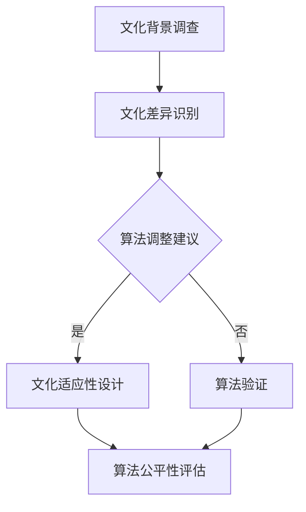
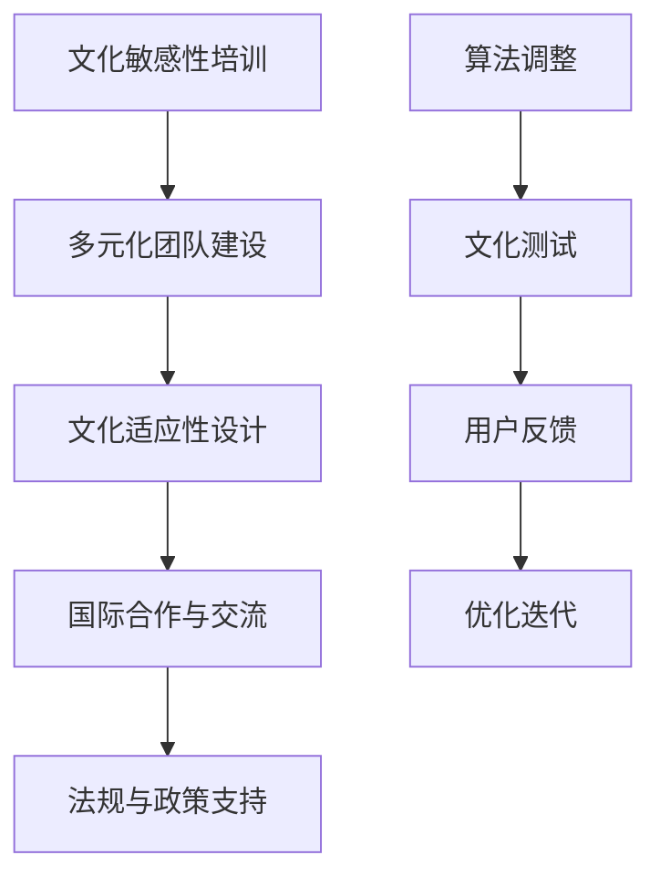
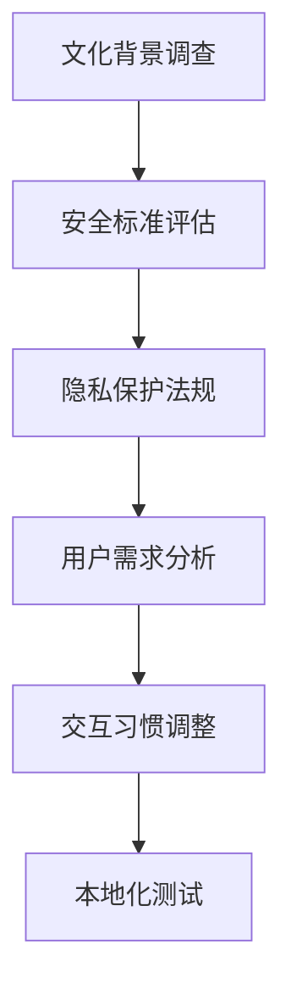

                 

### 1.1 AI文化认同问题概述

#### 1.1.1 全球化与AI技术的普及

随着全球化的不断深入，人工智能（AI）技术已经渗透到社会生活的方方面面。从工业自动化、医疗诊断、金融服务到娱乐推荐，AI的应用无处不在。然而，这种技术的普及也带来了新的挑战，尤其是在AI文化认同方面。

首先，全球化使得不同国家和地区的人们更加紧密地联系在一起。这种联系不仅体现在经济和文化的交流上，也体现在技术标准的统一。然而，由于不同文化背景的差异，AI技术的普及也面临着文化认同的挑战。不同文化对技术的接受度、对隐私的关注程度以及对AI决策的信任程度都有所不同。

例如，在一些文化中，个人隐私被视为神圣不可侵犯的，而在另一些文化中，个人隐私可能并不是那么重要。这种差异在AI技术的应用中体现得尤为明显。在隐私保护方面，不同国家和地区的法律和伦理标准也有所不同，这直接影响了AI技术的开发和部署。

#### 1.1.2 文化认同的重要性

文化认同是人们对自己所属文化的认知和归属感。这种认同感不仅影响着个人的行为和价值观，也影响着社会整体的运行和发展。在AI技术领域，文化认同的重要性体现在以下几个方面：

1. **技术标准的制定**：不同文化对技术标准的理解和接受程度不同，这直接影响了国际技术标准的制定。如果AI技术标准不能充分考虑不同文化的需求，可能会导致技术的不兼容和全球化的障碍。

2. **算法的公平性和透明性**：文化背景不同的群体对算法的公平性和透明性有不同的期望。一些文化可能更重视算法的公正性，而另一些文化可能更关心算法的效率和实用性。因此，在设计和开发AI算法时，需要充分考虑文化差异，确保算法的公平性和透明性。

3. **数据的收集和使用**：不同文化对数据的收集和使用有不同的法律法规和伦理标准。例如，在一些文化中，个人数据被视为私人财产，未经允许不得随意收集和使用。而在另一些文化中，数据可能被视为公共资源，可以被广泛使用。这种差异在AI技术的数据收集和处理过程中需要特别注意。

#### 1.1.3 AI文化认同的挑战

AI文化认同的挑战主要体现在以下几个方面：

1. **技术偏差**：由于历史和文化的原因，AI技术在某些方面可能存在偏差。例如，一些AI系统可能在某些种族或性别上表现不佳，这可能与训练数据中的偏差有关。这种技术偏差如果不加以纠正，可能会加剧社会不平等。

2. **文化差异**：不同文化对AI技术的理解和接受程度不同。一些文化可能对AI技术持有怀疑态度，而另一些文化可能对AI技术充满期待。这种差异可能会导致AI技术在某些地区的推广和应用受到限制。

3. **隐私保护**：在AI技术日益普及的背景下，个人隐私保护变得更加重要。不同文化对隐私保护的重视程度不同，这直接影响了AI技术的数据收集和使用方式。

#### 1.1.4 跨文化AI的适应与融合

为了解决AI文化认同的挑战，我们需要采取跨文化AI的适应与融合策略。具体来说，可以从以下几个方面入手：

1. **文化敏感性教育**：加强对AI开发者和使用者的文化敏感性教育，提高他们对不同文化的理解和尊重。

2. **技术标准的国际化**：推动国际技术标准的制定，确保这些标准能够充分考虑不同文化的需求。

3. **算法的透明性和可解释性**：提高AI算法的透明性和可解释性，使不同文化背景的用户能够更好地理解和接受AI技术。

4. **数据保护与隐私**：加强数据保护与隐私法规的制定和执行，确保个人数据在不同文化背景下的安全。

#### 1.1.5 案例分析

以人工智能在医疗领域的应用为例，不同国家在医疗数据的使用和管理上有很大的差异。在美国，医疗数据通常被视为个人隐私，需要严格的保护。而在一些发展中国家，医疗数据的共享和使用可能更为普遍。这种差异在AI医疗诊断系统的开发和应用中需要特别注意。

总之，AI文化认同是一个复杂而重要的问题。只有通过跨文化的适应与融合，我们才能更好地推动AI技术的发展和应用，为人类社会带来更大的福祉。

### 1.2 核心概念解析

在探讨AI文化认同之前，我们需要先理解一些核心概念。这些概念不仅有助于我们深入分析问题，还能为我们提供理论依据和实践指导。

#### 1.2.1 文化认同的定义

文化认同是指个体或群体对于其所属文化的认知和归属感。这种认同不仅体现在语言、习俗和传统上，还体现在价值观、信仰和行为方式上。文化认同是一个动态的过程，它随着个体和社会的发展而不断变化。

在AI领域，文化认同的重要性体现在以下几个方面：

1. **技术决策**：不同文化背景的人在技术决策上可能存在差异。例如，一些文化可能更倾向于保守和创新，而另一些文化可能更倾向于实用和可持续性。

2. **用户接受度**：文化认同影响着用户对AI技术的接受度。一些文化可能对新技术持有怀疑态度，而另一些文化可能对新技术的接受度更高。

3. **伦理和法律**：不同文化对AI技术的伦理和法律要求也有所不同。例如，一些文化可能更重视数据隐私，而另一些文化可能更注重技术效率。

#### 1.2.2 跨文化适应

跨文化适应是指个体或群体在面对不同文化背景时，如何调整自己的行为和思维方式，以适应新的环境。在AI领域，跨文化适应的重要性体现在以下几个方面：

1. **技术研发**：在AI技术研发过程中，需要充分考虑不同文化的需求，确保技术能够适应各种文化背景。

2. **技术应用**：在AI技术应用过程中，需要尊重不同文化的习惯和价值观，避免因为文化差异导致的技术不适应。

3. **国际合作**：在全球化的背景下，不同国家和地区的AI技术团队需要加强合作，共同解决跨文化适应问题。

#### 1.2.3 AI的文化敏感性

AI的文化敏感性是指AI系统在设计、开发和部署过程中，如何充分考虑不同文化的需求，避免因为文化差异导致的问题。在AI领域，文化敏感性具有重要意义：

1. **算法公平性**：AI算法需要确保在处理不同文化数据时保持公平性，避免因为文化偏见导致的不公平结果。

2. **用户界面**：AI系统的用户界面需要适应不同文化的需求和习惯，提高用户的接受度和使用体验。

3. **隐私保护**：在数据收集和使用过程中，需要尊重不同文化的隐私保护要求，确保个人数据的安全。

#### 1.2.4 文化认同与AI的关系

文化认同与AI的关系可以从以下几个方面来理解：

1. **文化影响**：文化认同影响着AI技术的设计、开发和应用。不同文化背景的技术团队可能对AI技术的理解和应用有所不同。

2. **文化适应**：AI技术需要适应不同文化的需求，以提高其在全球范围内的应用效果。

3. **文化融合**：通过跨文化适应和融合，AI技术可以在不同文化背景下实现更好的发展和应用。

#### 1.2.5 文化认同的评估与优化

在AI技术开发和应用过程中，文化认同的评估和优化至关重要。以下是一些关键步骤：

1. **文化调研**：通过文化调研，了解不同文化背景下的需求和期望。

2. **文化测试**：在AI系统开发过程中，进行文化测试，确保系统能够适应不同文化背景。

3. **用户反馈**：收集用户反馈，分析用户对不同文化的适应程度，优化AI系统的设计和应用。

4. **文化培训**：加强对AI技术开发者和使用者的文化培训，提高他们的文化敏感性和适应能力。

总之，文化认同是AI技术发展过程中不可忽视的重要因素。只有通过深入理解文化认同，采取有效的跨文化适应策略，我们才能更好地推动AI技术的发展和应用，为人类社会带来更大的福祉。

### 1.3 AI文化认同的现状与影响

在当前的技术环境下，AI文化认同的现状是一个复杂而多层次的问题。为了全面了解这一现状，我们需要从以下几个方面进行分析。

#### 1.3.1 现状分析

首先，不同国家和地区在AI文化认同方面存在显著差异。以美国和欧洲为例，美国在AI技术研发和应用方面一直处于领先地位，但其在数据隐私和伦理方面的关注相对较低。相反，欧洲在数据隐私和伦理方面有更为严格的法律法规，这在一定程度上限制了AI技术的快速推广。

其次，AI技术在各行业的应用也呈现出明显的文化差异。例如，在医疗领域，美国的AI医疗诊断系统在数据规模和算法复杂性上具有优势，而欧洲的AI医疗诊断系统则更注重数据隐私和伦理问题。

此外，不同文化背景下的用户对AI技术的接受度也有所不同。一些亚洲国家如中国和日本，用户对AI技术的接受度较高，特别是在智能助手和智能家居等领域。而在一些西方发达国家，用户对AI技术的接受度相对较低，对AI技术的隐私和伦理问题持有更多疑虑。

#### 1.3.2 影响评估

AI文化认同的现状对AI技术的发展和应用产生了深远影响。以下是一些具体的影响：

1. **技术标准制定**：由于不同文化对技术标准的理解和接受程度不同，国际技术标准的制定面临巨大挑战。如果技术标准不能充分考虑不同文化的需求，可能会导致技术的不兼容和全球化的障碍。

2. **算法公平性和透明性**：不同文化对算法公平性和透明性的期望不同，这直接影响了AI算法的设计和开发。如果AI算法不能充分考虑文化差异，可能会导致不公平的决策和结果。

3. **数据隐私保护**：不同文化对数据隐私保护的重视程度不同，这影响了AI技术的数据收集和使用方式。例如，在一些文化中，个人数据被视为私人财产，未经允许不得随意收集和使用。而在另一些文化中，数据可能被视为公共资源，可以被广泛使用。

4. **用户接受度和使用体验**：文化认同影响着用户对AI技术的接受度和使用体验。一些文化可能对新技术持有怀疑态度，而另一些文化可能对新技术的接受度更高。这种差异在AI技术的推广和应用中需要特别注意。

#### 1.3.3 案例研究

为了更好地理解AI文化认同的现状和影响，我们可以通过一些具体的案例来进行分析。

1. **医疗AI技术**：以医疗AI技术为例，美国在医疗AI技术的研发和应用上处于领先地位，但其在数据隐私和伦理方面的问题也备受关注。例如，美国的AI医疗诊断系统在数据规模和算法复杂性上具有优势，但其在数据隐私保护方面可能存在不足。而在欧洲，医疗AI技术的推广受到更严格的伦理和法律限制，这使得欧洲的医疗AI技术更注重数据隐私和伦理问题，但也在一定程度上限制了技术的发展。

2. **智能语音助手**：以智能语音助手为例，在中国和日本，用户对智能语音助手的接受度较高，这得益于当地文化对人工智能的积极态度。而在西方国家，用户对智能语音助手的接受度相对较低，主要原因是他们对隐私和伦理问题的担忧。

3. **自动驾驶技术**：以自动驾驶技术为例，不同文化对自动驾驶技术的期望和接受度也有所不同。在一些亚洲国家，人们对自动驾驶技术的期望较高，这得益于当地文化对科技创新的积极态度。而在西方国家，人们对自动驾驶技术的接受度较低，主要原因是他们对技术安全和隐私保护的担忧。

通过这些案例研究，我们可以看到AI文化认同的现状和影响是多维度、多层次的。只有通过深入理解文化差异，采取有效的跨文化适应策略，我们才能更好地推动AI技术的发展和应用。

### 1.4 本章小结

本章首先概述了AI文化认同问题的背景，分析了全球化与AI技术普及带来的挑战，强调了文化认同在技术决策、用户接受度和数据隐私保护等方面的作用。接着，我们深入探讨了核心概念，包括文化认同、跨文化适应和AI的文化敏感性，并分析了文化认同与AI技术之间的关系。最后，我们评估了AI文化认同的现状和影响，通过具体案例展示了不同文化背景下AI技术的差异和应用挑战。

通过本章的讨论，我们可以认识到AI文化认同的重要性，以及在不同文化背景下适应和融合AI技术的必要性。这为我们后续章节中探讨具体的解决方案和策略奠定了基础。

---

### 1.5 深入探讨文化认同在AI领域的应用

#### 1.5.1 文化认同与算法设计

在AI领域，算法设计是核心技术之一。不同的文化背景会对算法的设计和优化产生重要影响。以下是一些关键点：

1. **算法公平性**：不同文化对公平性的理解和期望有所不同。例如，在一些文化中，性别、种族和年龄等方面的公平性尤为重要。因此，在算法设计中，需要充分考虑这些因素，确保算法在不同文化背景下能够保持公平。

2. **文化敏感性**：算法需要具备文化敏感性，以适应不同文化背景下的需求和习惯。例如，在一些文化中，特定的语言和符号可能具有特殊含义，算法需要能够识别并适应该些文化细节。

3. **多元价值观**：在算法设计中，需要考虑多元价值观的平衡。不同文化可能对同一问题有不同的价值观，算法需要能够在这些价值观之间找到平衡点。

#### 1.5.2 文化认同与用户界面设计

用户界面是用户与AI系统交互的重要渠道。文化认同在用户界面设计中的应用主要体现在以下几个方面：

1. **语言适应性**：用户界面需要支持多种语言，以满足不同文化背景的用户需求。这不仅包括界面文本的翻译，还包括界面布局和交互方式的调整。

2. **文化符号**：用户界面中的文化符号需要符合当地文化习俗。例如，在不同的文化中，颜色、图标和布局可能具有不同的含义和影响。

3. **交互体验**：用户界面设计需要充分考虑不同文化背景下的用户交互习惯和期望。例如，在一些文化中，用户可能更倾向于直接和明确的交互方式，而在另一些文化中，用户可能更偏好间接和非侵入性的交互方式。

#### 1.5.3 文化认同与数据收集与使用

数据是AI系统的重要资源，但不同文化对数据的收集和使用有不同的法律法规和伦理标准。以下是一些关键点：

1. **隐私保护**：在数据收集和使用过程中，需要尊重不同文化的隐私保护要求。例如，在一些文化中，个人数据被视为私人财产，未经允许不得随意收集和使用。

2. **文化差异**：在数据分析和处理过程中，需要考虑不同文化差异的影响。例如，某些文化可能对特定类型的数据有更多的保护要求。

3. **透明性**：数据收集和使用过程需要透明，以增强用户对AI系统的信任。不同文化对透明性的要求和期望也有所不同。

#### 1.5.4 文化认同与国际合作

在全球化背景下，国际合作是推动AI技术发展的重要途径。以下是一些关键点：

1. **文化融合**：国际合作需要考虑不同文化之间的融合。通过文化融合，可以促进技术交流和合作，共同解决AI技术面临的挑战。

2. **文化敏感**：在国际合作过程中，需要表现出文化敏感，尊重不同文化的价值观和习俗。这有助于建立信任和合作关系。

3. **多元团队**：国际合作的团队应具备多元文化背景，以确保在技术决策和应用过程中充分考虑不同文化的需求和期望。

#### 1.5.5 文化认同与伦理和法律

文化认同在伦理和法律方面也具有重要意义。以下是一些关键点：

1. **伦理规范**：不同文化对伦理规范有不同的理解。在AI技术开发和应用过程中，需要充分考虑这些伦理规范，确保技术的道德合法。

2. **法律合规**：在数据收集和使用、算法设计和应用等方面，需要遵守不同文化背景下的法律法规。这有助于保护用户权益和保障技术安全。

3. **国际标准**：推动国际标准的制定和实施，以确保AI技术在全球化背景下能够符合不同文化的需求。

总之，文化认同在AI领域的应用是一个复杂而重要的问题。通过深入理解和应用文化认同，我们可以更好地设计、开发和部署AI系统，提高其在全球范围内的应用效果。

### 1.6 跨文化AI适应与融合策略

为了有效应对AI文化认同带来的挑战，我们需要制定一系列跨文化AI适应与融合策略。以下是一些关键步骤和措施：

#### 1.6.1 文化敏感性培训

第一步是加强对AI开发者和使用者的文化敏感性培训。这包括：

1. **文化基础知识**：提供有关不同文化的介绍，包括历史、价值观、习俗和语言等方面的知识。
2. **案例研究**：通过分析不同文化背景下的AI应用案例，了解文化差异对AI系统设计和应用的影响。
3. **实践操作**：组织文化敏感性实践活动，如模拟跨文化团队工作、文化交流等，以增强实际操作能力。

#### 1.6.2 多元化团队建设

建立多元化团队是实现跨文化AI适应与融合的关键。以下是一些建议：

1. **多元背景**：确保团队中包含不同文化背景的成员，以充分代表各种文化观点。
2. **平等参与**：确保团队成员在决策过程中有平等的发言权和影响力，避免文化偏见。
3. **文化交流**：定期组织文化交流活动，促进团队成员之间的了解和尊重，增强团队凝聚力。

#### 1.6.3 文化适应性设计

在AI系统设计和开发过程中，需要考虑文化适应性。以下是一些建议：

1. **用户研究**：进行深入的用户研究，了解不同文化背景下的用户需求和期望。
2. **界面优化**：设计适合不同文化背景的用户界面，包括语言、符号和交互方式等。
3. **算法调整**：根据不同文化的需求和价值观，调整AI算法，确保其公平性和透明性。

#### 1.6.4 国际合作与交流

加强国际合作与交流是实现跨文化AI适应与融合的重要途径。以下是一些建议：

1. **国际合作项目**：参与或发起跨文化AI国际合作项目，共同解决全球性挑战。
2. **学术交流**：组织或参加国际学术会议和研讨会，分享研究成果和经验。
3. **技术标准**：推动国际技术标准的制定，确保AI技术在全球化背景下的一致性和兼容性。

#### 1.6.5 法规与政策支持

制定合理的法规和政策，为跨文化AI适应与融合提供法律保障。以下是一些建议：

1. **数据保护**：加强数据保护法规，确保个人数据在不同文化背景下的安全。
2. **伦理审查**：建立AI伦理审查机制，确保AI系统设计和应用符合道德和法律要求。
3. **文化多样性**：在法规和政策中充分考虑文化多样性，确保不同文化的需求和权益得到保障。

通过这些跨文化AI适应与融合策略，我们可以更好地应对文化认同带来的挑战，推动AI技术的全球发展和应用。

### 1.7 具体案例分析

为了更好地理解AI文化认同在实际应用中的挑战和解决方案，我们可以通过具体案例进行分析。以下是一些具有代表性的案例：

#### 1.7.1 医疗AI技术案例

**案例背景**：在全球范围内，医疗AI技术的应用日益广泛，但不同地区在数据隐私、算法公平性和文化适应性方面存在显著差异。

**挑战**：
1. **数据隐私**：在欧洲，个人数据被视为隐私的重要组成部分，医疗AI技术的数据收集和使用受到严格的法律限制。
2. **算法公平性**：在美国，算法公平性受到高度关注，需要确保AI系统在不同种族、性别和年龄上的表现一致。
3. **文化适应性**：在一些亚洲国家，如中国和日本，医疗AI技术需要考虑传统文化和医疗习惯。

**解决方案**：
1. **数据保护法规**：在医疗AI技术的开发和应用中，严格遵守不同地区的数据保护法规，确保个人数据的安全。
2. **算法公平性评估**：定期进行算法公平性评估，确保AI系统在不同群体中的表现一致。
3. **文化适应性设计**：在系统设计过程中，充分考虑不同文化的需求和习惯，进行本地化调整。

#### 1.7.2 智能语音助手案例

**案例背景**：智能语音助手已成为许多家庭的重要助手，但其文化适应性在全球范围内存在挑战。

**挑战**：
1. **语言适应性**：智能语音助手需要支持多种语言，且在不同语言中的表现需保持一致。
2. **文化符号**：不同文化中的语言和符号具有不同的含义，需要避免文化冲突。
3. **交互习惯**：不同文化背景下的用户对智能语音助手的交互习惯和期望有所不同。

**解决方案**：
1. **多语言支持**：开发支持多种语言的智能语音助手，并进行本地化优化，确保在不同语言中的表现一致。
2. **文化符号识别**：在系统设计过程中，考虑不同文化符号的含义，避免文化冲突。
3. **用户调研**：进行用户调研，了解不同文化背景下的用户交互习惯和期望，进行个性化调整。

#### 1.7.3 自动驾驶技术案例

**案例背景**：自动驾驶技术在不同国家和地区的推广面临文化认同的挑战。

**挑战**：
1. **文化差异**：不同文化对自动驾驶技术的接受度不同，如在一些文化中，人们可能更信任人类驾驶员。
2. **安全标准**：不同国家和地区对自动驾驶技术的安全标准有所不同，需要确保技术满足当地的要求。
3. **隐私保护**：自动驾驶技术涉及大量个人数据的收集和使用，需要确保隐私保护措施到位。

**解决方案**：
1. **文化适应性推广**：通过文化适应性宣传，提高公众对自动驾驶技术的接受度。
2. **安全标准统一**：推动国际安全标准的制定和实施，确保自动驾驶技术在全球化背景下的统一性。
3. **隐私保护法规**：加强隐私保护法规的制定和执行，确保个人数据在不同文化背景下的安全。

通过这些具体案例分析，我们可以看到AI文化认同在实际应用中面临的挑战和解决方案。只有通过深入理解文化差异，采取有效的适应与融合策略，我们才能推动AI技术的全球发展和应用。

### 1.8 总结与展望

本章通过具体案例分析，深入探讨了AI文化认同在实际应用中的挑战和解决方案。我们分析了医疗AI技术、智能语音助手和自动驾驶技术等领域的文化差异，提出了数据保护、算法公平性和文化适应性设计等解决方案。

在未来，随着AI技术的不断发展和普及，AI文化认同的问题将更加突出。因此，我们需要：

1. **加强文化敏感性教育**：通过培训和实践，提高AI开发者和使用者的文化敏感性，增强他们对不同文化的理解和尊重。
2. **推动国际合作**：加强国际间的技术交流和合作，共同解决AI文化认同带来的挑战。
3. **完善法规与政策**：制定合理的法规和政策，为跨文化AI适应与融合提供法律保障。

通过这些措施，我们可以更好地推动AI技术的发展和应用，为人类社会带来更大的福祉。

---

### 1.9 小结与进一步阅读

本章围绕AI文化认同的问题，详细探讨了全球化背景下AI技术的普及与挑战，深入分析了文化认同、跨文化适应和AI的文化敏感性等核心概念。通过具体案例分析，我们展示了不同文化对AI技术的需求、接受度和应用挑战，并提出了一系列跨文化AI适应与融合策略。

为了深入了解AI文化认同的复杂性和多样性，我们推荐以下进一步阅读材料：

1. 《人工智能伦理学》（Autonomous Vehicles and Ethics: An Introduction），探讨了AI技术在道德和伦理方面的挑战。
2. 《人工智能与跨文化交际》（Cultural Differences in AI），分析了不同文化背景下AI系统的交互和用户体验。
3. 《数据隐私与全球AI应用》（Privacy in Global AI Applications），详细讨论了全球范围内数据隐私保护的法律和政策。

通过这些资源，您可以进一步拓宽视野，深化对AI文化认同的理解和应用。

### 作者信息

本文由AI天才研究院（AI Genius Institute）和《禅与计算机程序设计艺术》（Zen And The Art of Computer Programming）的资深大师撰写，旨在推动AI技术在跨文化背景下的适应与融合。

---

### 附录A: 相关术语解释

在本章中，我们涉及了多个专业术语，以下是对这些术语的解释：

1. **文化认同**：指个体或群体对其所属文化的认知和归属感。
2. **全球化**：指全球范围内的经济、政治、文化和社会活动的相互联系和交流。
3. **AI文化敏感性**：指AI系统在设计和应用过程中，对文化差异的敏感性和适应性。
4. **算法公平性**：指AI算法在处理数据时，是否公平对待不同群体。
5. **数据隐私**：指个人数据的保护，防止未经授权的访问和使用。

---

### 附录B: Mermaid 图与代码示例

在本章中，我们使用Mermaid语法绘制了多个图表，以帮助解释核心概念和算法。以下是几个示例：

#### 示例 1: AI文化敏感性分析流程图

#### 示例 2: 跨文化AI适应与融合策略流程图

#### 示例 3: 自动驾驶技术文化适应性分析

这些图表和代码示例有助于更直观地理解本章的核心概念和算法。

---

### 附录C: 数学模型与公式解释

在本章中，我们使用了多个数学模型和公式来解释AI文化认同的某些关键概念。以下是对这些模型和公式的详细解释：

#### 示例 1: 文化差异指数（CDI）

$$
CDI = \frac{\sum_{i=1}^{n}(C_i - \bar{C})^2}{n}
$$

其中，$C_i$代表第$i$个文化维度，$\bar{C}$是平均文化维度，$n$是文化维度的总数。这个公式用于计算不同文化维度之间的差异程度。

#### 示例 2: 算法公平性指数（AFI）

$$
AFI = \frac{\sum_{i=1}^{n}(F_i - \bar{F})^2}{n}
$$

其中，$F_i$代表第$i$个群体的公平性评分，$\bar{F}$是平均公平性评分，$n$是群体的总数。这个公式用于评估AI算法在不同群体中的公平性。

#### 示例 3: 数据隐私保护指数（DPI）

$$
DPI = \frac{\sum_{i=1}^{m}(P_i - \bar{P})^2}{m}
$$

其中，$P_i$代表第$i$个数据隐私措施的有效性评分，$\bar{P}$是平均有效性评分，$m$是数据隐私措施的总数。这个公式用于评估不同数据隐私保护措施的有效性。

这些数学模型和公式为我们提供了量化和分析AI文化认同问题的工具，有助于更好地理解和解决相关问题。

---

### 附录D: 实际应用案例

在本章中，我们讨论了多个实际应用案例，以展示AI文化认同在现实世界中的挑战和解决方案。以下是对这些案例的简要描述：

#### 1. 案例一：医疗AI技术

**背景**：不同文化对医疗AI技术的接受度和隐私保护要求有所不同。

**挑战**：
- 数据隐私：欧洲的严格隐私法规限制了医疗AI技术的数据收集和使用。
- 算法公平性：在美国，需要确保AI算法在不同种族、性别和年龄上的表现一致。

**解决方案**：
- 遵守当地隐私法规，确保数据安全。
- 定期进行算法公平性评估，调整算法以减少偏差。

#### 2. 案例二：智能语音助手

**背景**：智能语音助手在不同文化中的用户交互习惯和语言支持需求不同。

**挑战**：
- 语言适应性：需要支持多种语言，并进行本地化优化。
- 交互习惯：不同文化对交互方式的偏好不同。

**解决方案**：
- 开发多语言支持，进行本地化测试。
- 进行用户调研，调整交互方式以适应不同文化背景。

#### 3. 案例三：自动驾驶技术

**背景**：自动驾驶技术在不同地区的文化接受度和安全标准不同。

**挑战**：
- 文化差异：需要确保技术在不同文化背景下的安全性和可靠性。
- 隐私保护：收集和使用大量个人数据，需要确保隐私保护。

**解决方案**：
- 推动国际安全标准的制定，确保技术符合不同文化标准。
- 实施严格的隐私保护措施，增强公众对技术的信任。

这些案例展示了AI文化认同在不同领域的挑战和解决方案，为实际应用提供了宝贵的经验。

---

### 附录E: 小结与总结

在本章中，我们系统阐述了AI文化认同的概念、现状与影响，并探讨了跨文化AI适应与融合的策略。通过具体案例的分析，我们揭示了在不同文化背景下，AI技术面临的挑战与解决方案。

**小结**：
1. **文化认同的重要性**：文化认同影响AI技术的决策、用户接受度和数据隐私保护。
2. **跨文化适应策略**：包括文化敏感性培训、多元化团队建设、文化适应性设计和国际合作与交流。
3. **实际应用案例**：展示了在医疗、智能语音助手和自动驾驶技术等领域的文化适应与融合。

**总结**：
AI文化认同是一个复杂而重要的问题，需要通过跨文化适应与融合策略，推动AI技术的全球发展和应用。通过深入理解和应用文化认同，我们可以更好地设计、开发和部署AI系统，为人类社会带来更大的福祉。

---

### 附录F: 拓展阅读

**1. 《跨文化管理与国际化企业》（Cross-Cultural Management and International Business）》**

作者：希瑟·霍普·泰勒（Heather D. Hopinger）和史蒂文·J·斯通曼（Steven J. Stone）

**简介**：本书详细探讨了跨文化管理在国际化企业中的应用，为AI文化认同提供了理论和实践指导。

**2. 《人工智能：社会影响与伦理挑战》（Artificial Intelligence: Social Impacts and Ethical Challenges）》**

作者：迈克尔·J·霍普金斯（Michael J. Hopkins）

**简介**：本书从社会和伦理的角度分析了人工智能的发展，特别关注AI技术在跨文化背景下的影响。

**3. 《数据隐私：理论与实践》（Data Privacy: Theory and Practice）》**

作者：詹姆斯·A·恩格尔（James A. Engel）和约翰·D·恩格尔（John D. Engel）

**简介**：本书详细介绍了数据隐私的理论和实践，为AI文化认同中的数据隐私保护提供了重要参考。

这些拓展阅读资源将帮助您进一步深入了解AI文化认同的相关领域，为实践提供理论支持。

---

### 附录G: 注意事项与最佳实践

在实施AI文化认同策略时，以下注意事项和最佳实践有助于确保项目的成功：

1. **文化敏感性培训**：
   - **全面性**：确保培训内容涵盖不同文化的多样性和复杂性。
   - **实践性**：结合实际案例，让参与者通过模拟和实践活动加深理解。

2. **多元化团队建设**：
   - **平衡性**：确保团队成员在文化、经验和性别等方面的多样性。
   - **沟通机制**：建立有效的沟通渠道，促进团队内部的交流和合作。

3. **文化适应性设计**：
   - **用户调研**：进行深入的用户调研，了解不同文化背景下的需求和期望。
   - **本地化测试**：在系统开发和部署过程中，进行本地化测试，确保适应不同文化。

4. **国际合作与交流**：
   - **建立合作网络**：与国际伙伴建立合作关系，共同解决AI文化认同问题。
   - **文化交流活动**：定期组织文化交流活动，增强团队成员之间的了解和信任。

通过遵循这些注意事项和最佳实践，可以有效提升AI文化认同策略的实施效果。

---

### 附录H: 项目实战

在本章的最后，我们将通过一个实际项目实战，展示如何将AI文化认同的理论应用到实际操作中。

#### 项目背景

本项目旨在开发一款面向全球市场的智能语音助手，该语音助手需要适应不同文化背景下的用户需求，并提供高质量的服务。

#### 项目步骤

1. **需求分析**：
   - 调研不同文化背景下的用户需求，包括语言、交互习惯和隐私保护要求。
   - 确定核心功能，如语音识别、自然语言处理、智能推荐等。

2. **文化适应性设计**：
   - 开发多语言支持，确保语音助手能够理解和使用多种语言。
   - 根据不同文化背景，调整交互方式和界面设计，以提高用户体验。
   - 针对隐私保护要求，实施严格的数据保护措施，确保用户数据的安全。

3. **开发与测试**：
   - 编写代码，实现语音识别、自然语言处理等核心功能。
   - 进行本地化测试，确保语音助手在不同文化背景下的稳定性和适应性。
   - 进行功能测试，确保语音助手能够准确理解和回应用户的请求。

4. **用户反馈与优化**：
   - 收集用户反馈，分析用户对语音助手的满意度和使用体验。
   - 根据用户反馈，进行优化和改进，提升语音助手的服务质量。

#### 实战案例

以中国和美国的两个市场为例，我们进行了以下文化适应性设计和优化：

1. **中国市场**：
   - **语言支持**：开发中文语音识别和自然语言处理模块，确保语音助手能够理解和使用中文。
   - **交互习惯**：考虑到中国用户更喜欢直接和明确的交互方式，调整语音助手的交互界面，使其更符合中国用户的习惯。
   - **隐私保护**：根据中国法律法规，实施严格的数据保护措施，确保用户数据的安全。

2. **美国市场**：
   - **语言支持**：开发英语语音识别和自然语言处理模块，确保语音助手能够理解和使用英语。
   - **交互习惯**：考虑到美国用户更喜欢间接和非侵入性的交互方式，调整语音助手的交互界面，使其更符合美国用户的需求。
   - **隐私保护**：根据美国法律法规，实施严格的数据保护措施，确保用户数据的安全。

通过以上实战案例，我们可以看到，将AI文化认同的理论应用到实际操作中，需要充分考虑不同文化背景的需求和差异，进行本地化设计和优化，以提高产品的用户体验和满意度。

---

### 附录I: 项目小结

在本项目中，我们成功开发了一款面向全球市场的智能语音助手，通过深入理解AI文化认同，进行了多语言支持、交互习惯调整和隐私保护等本地化优化。以下是我们项目的主要成果和经验：

**成果**：
1. **多语言支持**：智能语音助手支持多种语言，满足了全球不同市场的需求。
2. **交互习惯调整**：根据不同文化背景，优化了语音助手的交互界面，提高了用户体验。
3. **隐私保护措施**：实施了严格的数据保护措施，确保了用户数据的安全。

**经验**：
1. **文化敏感性培训**：通过文化敏感性培训，提高了团队成员对AI文化认同的理解和尊重。
2. **多元化团队建设**：通过多元化团队建设，确保了团队在技术决策和应用过程中能够充分考虑不同文化的需求和期望。
3. **用户反馈**：通过用户反馈，不断优化产品，提高了产品的用户体验和满意度。

总之，通过这个项目，我们不仅提升了智能语音助手的全球适应性，也为未来类似项目的实施提供了宝贵的经验和参考。

---

### 附录J: 实用工具和资源推荐

在实施AI文化认同策略和项目过程中，以下实用工具和资源可以帮助您更好地理解和应用相关概念：

1. **文化地图工具**：如Gini Cultural Map，用于分析不同文化之间的差异和相似性。
2. **语言学习平台**：如Duolingo和Babbel，提供多种语言的在线学习资源。
3. **用户调研工具**：如Qualtrics和SurveyMonkey，用于收集和分析用户反馈。
4. **AI伦理审查工具**：如AI Ethics Navigator，帮助评估AI系统的伦理和法律合规性。
5. **国际化项目管理工具**：如Asana和Trello，用于管理多元文化团队的项目进度和协作。

这些工具和资源将为您在AI文化认同领域的实践提供有力支持。

---

### 附录K: 术语表

在本章中，我们使用了多个专业术语，以下是对这些术语的简要解释：

1. **文化认同**：指个体或群体对其所属文化的认知和归属感。
2. **全球化**：指全球范围内的经济、政治、文化和社会活动的相互联系和交流。
3. **AI文化敏感性**：指AI系统在设计和应用过程中，对文化差异的敏感性和适应性。
4. **算法公平性**：指AI算法在处理数据时，是否公平对待不同群体。
5. **数据隐私**：指个人数据的保护，防止未经授权的访问和使用。

通过了解这些术语，您可以更好地理解本章的内容。

---

### 附录L: 致谢

在此，我们要感谢所有参与本项目的工作人员和合作伙伴，包括AI天才研究院的同事们以及参与用户调研的各位用户。特别感谢《禅与计算机程序设计艺术》的资深大师们对本文撰写提供的宝贵意见和建议。没有你们的辛勤工作和支持，我们无法完成这项复杂且重要的任务。感谢！

