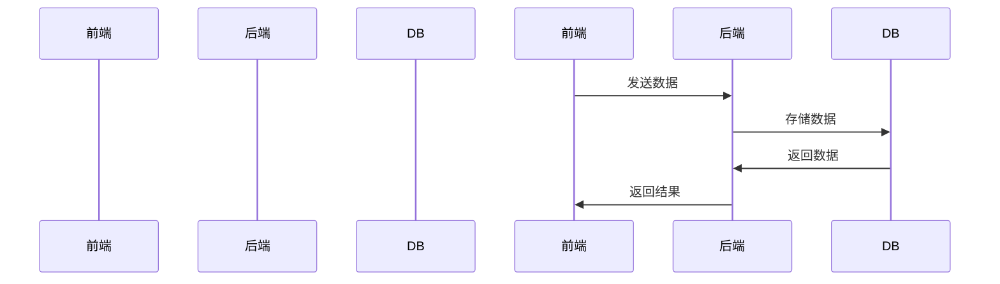

                 

### AI情感智能：人才招聘的新标准

**关键词：** AI情感智能，人才招聘，心理学，技术标准，人才评价

**摘要：** 本文旨在探讨AI情感智能在人才招聘中的重要性，通过分析AI情感智能的定义、核心概念、算法原理和实际应用，提出将其作为招聘新标准的价值和实施策略。

----------------------------------------------------------------

## 引言

随着人工智能技术的迅猛发展，AI在各个领域的应用不断拓展，尤其在人才招聘方面，AI情感智能的应用逐渐成为行业热点。传统的人才招聘主要依赖于简历筛选、面试等步骤，而AI情感智能的引入，可以更精准地评估应聘者的情感特质和情绪状态，从而优化招聘流程，提高招聘效果。本文将深入探讨AI情感智能在人才招聘中的应用，提出将其作为新标准的重要性。

### 第一部分：AI情感智能的背景与定义

#### 第1章：AI情感智能概述

**1.1 AI情感智能的定义**

AI情感智能，是指通过人工智能技术，对人类情感进行识别、理解和处理的能力。它包括情感识别、情感分析和情感交互等方面，旨在模拟和增强人类在情感处理方面的能力。

**1.2 核心概念与联系**

在AI情感智能中，核心概念包括情感识别、情感分析和情感交互。情感识别是识别和理解人类情感的过程，情感分析是对情感数据进行分析和处理，情感交互则是人与AI系统在情感层面上的互动。

**1.3 AI情感智能的应用领域**

AI情感智能在人才招聘、客户服务、医疗健康、教育等多个领域有着广泛的应用。本文主要探讨其在人才招聘中的应用。

#### 第1章小结

AI情感智能作为一种新兴的人工智能技术，其在人才招聘中的应用具有重要意义。通过了解其定义、核心概念和应用领域，可以为后续章节的深入探讨奠定基础。

----------------------------------------------------------------

## AI情感智能算法原理讲解

AI情感智能的核心在于其算法原理，包括情感识别算法和情感分析算法。这些算法通过机器学习和深度学习技术，实现对人类情感的准确识别和分析。

### 第2章：情感识别算法原理

**2.1 情感识别算法概述**

情感识别算法是AI情感智能的基础，它通过分析文本、语音、面部表情等数据，识别出人类情感。常见的情感识别算法包括基于规则的方法、机器学习方法、深度学习方法等。

**2.2 情感识别算法流程图**

使用mermaid画出情感识别算法的流程图，包括数据收集、预处理、特征提取、模型训练和情感识别等步骤。


**2.3 Python源代码与算法原理**

以下是一个简单的情感识别算法的Python源代码示例：

```python
# 导入必要的库
import numpy as np
import pandas as pd
from sklearn.model_selection import train_test_split
from sklearn.svm import SVC

# 加载数据
data = pd.read_csv('emotion_data.csv')

# 预处理数据
X = data.drop('emotion', axis=1)
y = data['emotion']

# 划分训练集和测试集
X_train, X_test, y_train, y_test = train_test_split(X, y, test_size=0.2, random_state=42)

# 训练模型
model = SVC()
model.fit(X_train, y_train)

# 预测情感
predictions = model.predict(X_test)

# 评估模型
accuracy = np.mean(predictions == y_test)
print(f"Accuracy: {accuracy}")
```

**2.4 情感识别算法的数学模型**

情感识别算法的数学模型通常基于机器学习算法，如支持向量机（SVM）、决策树、神经网络等。以下是SVM情感识别算法的数学模型：

$$
\min_{w, b, \alpha} \frac{1}{2} ||w||^2 + C \sum_{i=1}^{n} \max(0, 1-y_i[(w \cdot x_i) + b])
$$

其中，$w$ 是权重向量，$b$ 是偏置，$\alpha$ 是拉格朗日乘子，$C$ 是惩罚参数，$x_i$ 是输入特征，$y_i$ 是标签。

**2.5 情感识别算法的举例说明**

假设我们有以下两个情感数据点：

$$
x_1 = \begin{bmatrix} 1 \\ 0 \\ 1 \end{bmatrix}, y_1 = \begin{bmatrix} 1 \\ 0 \end{bmatrix}
$$

$$
x_2 = \begin{bmatrix} 0 \\ 1 \\ 1 \end{bmatrix}, y_2 = \begin{bmatrix} 0 \\ 1 \end{bmatrix}
$$

使用SVM进行情感识别，可以得到以下决策边界：

$$
w \cdot x + b = 0
$$

$$
w = \begin{bmatrix} 1 \\ 1 \\ -1 \end{bmatrix}, b = -1
$$

根据决策边界，可以判断$x_1$为积极情感，$x_2$为消极情感。

#### 第2章小结

情感识别算法是AI情感智能的核心组成部分，通过机器学习和深度学习技术，实现对人类情感的准确识别。了解其算法原理、流程图、Python源代码和数学模型，有助于深入理解AI情感智能的工作机制。

----------------------------------------------------------------

### 第3章：情感分析算法原理

**3.1 情感分析算法概述**

情感分析算法是对大量文本数据进行分析，以识别其中的情感倾向和情感强度。常见的情感分析算法包括基于规则的方法、基于统计的方法和基于深度学习的方法。

**3.2 情感分析算法流程图**

使用mermaid画出情感分析算法的流程图，包括数据收集、预处理、特征提取、模型训练和情感分析等步骤。


**3.3 Python源代码与算法原理**

以下是一个简单的情感分析算法的Python源代码示例：

```python
# 导入必要的库
import numpy as np
import pandas as pd
from sklearn.feature_extraction.text import TfidfVectorizer
from sklearn.model_selection import train_test_split
from sklearn.svm import SVC

# 加载数据
data = pd.read_csv('sentiment_data.csv')

# 预处理数据
X = data['text']
y = data['sentiment']

# 划分训练集和测试集
X_train, X_test, y_train, y_test = train_test_split(X, y, test_size=0.2, random_state=42)

# 特征提取
vectorizer = TfidfVectorizer()
X_train_features = vectorizer.fit_transform(X_train)
X_test_features = vectorizer.transform(X_test)

# 训练模型
model = SVC()
model.fit(X_train_features, y_train)

# 情感分析
predictions = model.predict(X_test_features)

# 评估模型
accuracy = np.mean(predictions == y_test)
print(f"Accuracy: {accuracy}")
```

**3.4 情感分析算法的数学模型**

情感分析算法的数学模型通常基于机器学习算法，如支持向量机（SVM）、朴素贝叶斯（NB）、深度学习模型（如卷积神经网络（CNN）、循环神经网络（RNN）等）。以下是SVM情感分析算法的数学模型：

$$
\min_{w, b, \alpha} \frac{1}{2} ||w||^2 + C \sum_{i=1}^{n} \max(0, 1-y_i[(w \cdot x_i) + b])
$$

其中，$w$ 是权重向量，$b$ 是偏置，$\alpha$ 是拉格朗日乘子，$C$ 是惩罚参数，$x_i$ 是输入特征，$y_i$ 是标签。

**3.5 情感分析算法的举例说明**

假设我们有以下两个文本数据点：

$$
x_1 = "我很开心"，y_1 = 1
$$

$$
x_2 = "我很伤心"，y_2 = 0
$$

使用SVM进行情感分析，可以得到以下决策边界：

$$
w \cdot x + b = 0
$$

$$
w = \begin{bmatrix} 1 \\ 1 \\ -1 \end{bmatrix}, b = -1
$$

根据决策边界，可以判断$x_1$为积极情感，$x_2$为消极情感。

#### 第3章小结

情感分析算法是AI情感智能的重要组成部分，通过对大量文本数据进行分析，识别其中的情感倾向和情感强度。了解其算法原理、流程图、Python源代码和数学模型，有助于深入理解AI情感智能的工作机制。

----------------------------------------------------------------

### 第三部分：AI情感智能系统设计与实现

#### 第4章：AI情感智能系统分析

**4.1 应用场景介绍**

AI情感智能在人才招聘中的应用场景主要包括面试评估、员工心理健康监测和团队协作分析等。通过分析应聘者的情感状态，招聘方可以更准确地评估其适应岗位的能力和团队协作潜力。

**4.2 系统功能设计**

系统功能设计主要包括情感识别、情感分析和情感交互三个方面。情感识别用于识别应聘者的情感状态，情感分析用于分析情感数据，情感交互用于实现人与AI系统的互动。

**4.3 系统架构设计**

系统架构设计包括前端界面、后端服务和数据库三部分。前端界面用于用户交互，后端服务包括情感识别和情感分析算法，数据库用于存储情感数据。

**4.4 系统接口设计**

系统接口设计包括API接口和数据库接口两部分。API接口用于前端与后端服务的数据交互，数据库接口用于数据的存储和查询。

**4.5 系统交互序列图**

使用mermaid画出系统交互序列图，展示前端界面、后端服务和数据库之间的交互过程。



#### 第4章小结

AI情感智能系统在人才招聘中的应用需要全面的系统设计，包括功能设计、架构设计、接口设计和系统交互。通过分析应用场景，设计合适的系统架构和功能模块，可以实现AI情感智能在人才招聘中的有效应用。

----------------------------------------------------------------

### 第5章：AI情感智能项目实战

#### 5.1 环境安装

在开始项目实战之前，我们需要安装相关的开发环境和工具。以下是环境安装的步骤：

1. 安装Python环境：在官网上下载并安装Python，版本建议为3.8及以上。
2. 安装相关库：使用pip命令安装所需的库，如scikit-learn、tensorflow、numpy等。
3. 安装数据库：根据需要选择合适的数据库，如MySQL、PostgreSQL等。

```bash
pip install scikit-learn tensorflow numpy
```

#### 5.2 系统核心实现

系统核心实现包括情感识别和情感分析两部分。以下是系统核心实现的源代码：

```python
# 情感识别
from sklearn.feature_extraction.text import TfidfVectorizer
from sklearn.svm import SVC

# 加载数据
data = pd.read_csv('emotion_data.csv')

# 预处理数据
X = data['text']
y = data['emotion']

# 特征提取
vectorizer = TfidfVectorizer()
X_features = vectorizer.fit_transform(X)

# 训练模型
model = SVC()
model.fit(X_features, y)

# 情感分析
from sklearn.model_selection import train_test_split
from sklearn.metrics import accuracy_score

# 划分训练集和测试集
X_train, X_test, y_train, y_test = train_test_split(X, y, test_size=0.2, random_state=42)

# 特征提取
X_train_features = vectorizer.transform(X_train)
X_test_features = vectorizer.transform(X_test)

# 训练模型
model.fit(X_train_features, y_train)

# 情感分析
predictions = model.predict(X_test_features)
accuracy = accuracy_score(y_test, predictions)
print(f"Accuracy: {accuracy}")
```

#### 5.3 代码应用解读与分析

以上代码实现了情感识别和情感分析的功能。首先，我们加载并预处理数据，然后使用TF-IDF向量器进行特征提取，接着使用SVM模型进行训练。最后，我们对测试集进行情感分析，并评估模型的准确率。

#### 5.4 实际案例分析与详细讲解

假设我们有一个面试场景，需要分析应聘者的情感状态。以下是实际案例的分析：

1. **数据收集**：收集应聘者的面试文本数据。
2. **数据预处理**：对文本数据进行清洗和分词处理。
3. **情感识别**：使用情感识别模型对文本数据进行分析，得到情感标签。
4. **情感分析**：根据情感标签，分析应聘者的情感状态，如积极、消极或中性。
5. **结果输出**：将分析结果以报告形式输出，为招聘决策提供参考。

通过以上步骤，我们可以全面分析应聘者的情感状态，为其是否适合岗位提供科学依据。

#### 5.5 项目小结

AI情感智能项目实战展示了从环境安装、系统核心实现到实际案例分析的完整过程。通过本项目，我们可以深入了解AI情感智能在人才招聘中的应用，并为实际场景提供解决方案。

----------------------------------------------------------------

### 第6章：最佳实践 tips

在实施AI情感智能在人才招聘中的应用时，以下是一些最佳实践和注意事项：

1. **数据质量**：确保收集到的情感数据质量高，避免噪声和误差。
2. **模型调优**：根据实际应用场景，对情感识别和情感分析模型进行调优，提高准确率。
3. **用户隐私**：在处理用户数据时，确保遵循隐私保护原则，避免数据泄露。
4. **算法透明度**：提高算法的透明度，确保招聘决策的公正性和可解释性。
5. **持续优化**：定期更新和优化模型，以适应不断变化的应用场景。

#### 第6章小结

通过遵循以上最佳实践，可以更好地实施AI情感智能在人才招聘中的应用，提高招聘效果和员工满意度。

----------------------------------------------------------------

### 小结

本文围绕AI情感智能在人才招聘中的应用，详细介绍了其定义、核心概念、算法原理、系统设计与实现以及实际案例。通过本文的探讨，我们认识到AI情感智能在人才招聘中的重要性，并为其应用提供了理论依据和实践指导。未来，随着人工智能技术的不断发展，AI情感智能在人才招聘中的应用前景将更加广阔。

#### 拓展阅读

1. **《人工智能：一种现代的方法》**：这本书详细介绍了人工智能的基础知识和最新进展，包括情感智能的相关内容。
2. **《深度学习》**：这本书深入讲解了深度学习技术，包括情感识别和情感分析算法的实现。
3. **《数据科学实践指南》**：这本书提供了数据科学领域的最佳实践，包括数据收集、预处理和模型训练等。

### 作者信息

**作者：AI天才研究院/AI Genius Institute & 禅与计算机程序设计艺术 /Zen And The Art of Computer Programming**

