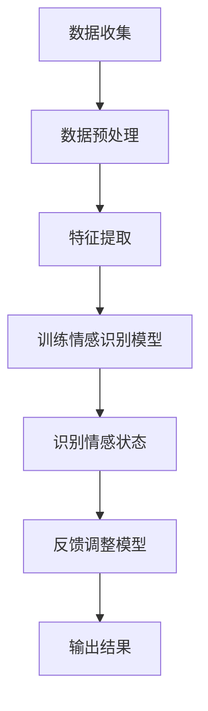
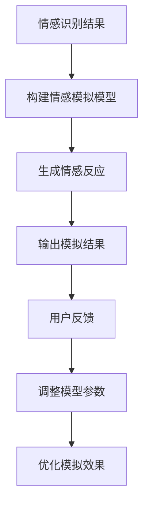

                 

### 文章标题

# AI的情感能力对社交媒体的影响：虚拟关系的真实性

### 关键词

- AI情感能力
- 社交媒体
- 虚拟关系
- 真实性
- 人际互动
- 用户体验

### 摘要

本文探讨了人工智能（AI）的情感能力对社交媒体中虚拟关系真实性的影响。随着AI技术的发展，AI不仅在信息处理和推荐系统方面表现出色，其在理解和模拟人类情感方面也日益重要。本文首先介绍了AI情感能力的基本概念和核心特征，然后分析了社交媒体和虚拟关系的本质及其存在的问题。接着，本文讨论了AI情感能力在社交媒体中的应用，特别是在提升虚拟关系真实性方面的潜力。随后，通过实证研究和案例分析，本文探讨了AI情感能力对虚拟关系真实性影响的实证结果和潜在好处与风险。最后，本文总结了研究的发现，提出了未来研究的方向和启示，为社交媒体平台的设计和运营提供了有价值的参考。

### 目录大纲

----------------------------------------------------------------
# 第一部分: 引言

## 第1章: 引言
### 1.1 问题的背景
### 1.2 问题描述
### 1.3 问题解决
### 1.4 边界与外延
### 1.5 核心概念与联系

## 第2章: AI的情感能力介绍
### 2.1 AI情感能力的定义
### 2.2 AI情感能力的发展历程
### 2.3 AI情感能力的重要性

## 第3章: 社交媒体与虚拟关系
### 3.1 社交媒体概述
### 3.2 虚拟关系概述
### 3.3 虚拟关系的真实性探讨

## 第4章: AI情感能力在社交媒体中的应用
### 4.1 AI情感能力在社交媒体中的应用概述
### 4.2 AI情感能力在虚拟关系中的应用
### 4.3 AI情感能力在社交媒体中的挑战

## 第5章: AI情感能力对虚拟关系真实性的影响
### 5.1 AI情感能力对虚拟关系真实性影响的概述
### 5.2 AI情感能力对虚拟关系真实性影响的实证研究
### 5.3 AI情感能力对虚拟关系真实性影响的潜在好处与风险

## 第6章: 案例研究
### 6.1 案例研究概述
### 6.2 案例分析
### 6.3 案例启示

## 第7章: 结论与展望
### 7.1 研究结论
### 7.2 未来展望
### 7.3 研究局限与未来研究方向

## 第8章: 附录
### 8.1 参考文献
### 8.2 数据来源与处理方法
----------------------------------------------------------------

## 第1章: 引言

### 1.1 问题的背景

在当今数字化时代，社交媒体已成为人们交流、分享和获取信息的主要平台。无论是Facebook、Twitter，还是微信、抖音，社交媒体已经深入到了我们的日常生活。然而，随着社交媒体的普及，虚拟关系逐渐成为人际交往的重要组成部分。虚拟关系，顾名思义，是通过互联网和社交媒体平台建立的虚拟联系。这种联系在一定程度上弥补了现实世界中人际交往的不足，使得人们可以跨越时空的限制，与陌生人建立联系。

然而，虚拟关系的真实性却成为了人们关注的焦点。随着社交媒体的算法推荐和机器学习技术的应用，用户在社交媒体上的互动变得越来越程序化、表面化。许多用户担忧，这种虚拟关系是否还能承载真实的人际情感。而人工智能（AI）技术的发展，特别是情感能力的提升，为解决这一问题提供了新的思路。

### 1.2 问题描述

虚拟关系的真实性问题是当前社交媒体面临的一个重要挑战。具体而言，主要问题包括：

1. **情感表达的表面化**：由于算法推荐和自动化处理，用户在社交媒体上的互动往往变得表面化，缺乏深层次的情感交流。
2. **隐私泄露和信息安全**：虚拟关系的发展导致了用户隐私信息的泄露，以及潜在的信息安全风险。
3. **社交疲劳和孤独感**：过多的虚拟关系可能使用户感到疲劳和孤独，影响心理健康。

### 1.3 问题解决

为了解决上述问题，人工智能的情感能力显得尤为重要。AI情感能力包括情感识别、情感模拟和情感预测等方面，能够帮助社交媒体平台更好地理解和满足用户的需求，提升虚拟关系的真实性。例如：

1. **情感识别**：AI能够识别用户的情感状态，为用户提供更个性化的服务。
2. **情感模拟**：AI可以模拟人类的情感反应，增强虚拟关系中的互动质量。
3. **情感预测**：AI能够预测用户的情感变化，提前采取措施，防止社交疲劳和孤独感。

### 1.4 边界与外延

在探讨AI情感能力对虚拟关系真实性的影响时，需要明确一些边界和概念。首先，AI情感能力的范围包括但不限于情感识别、情感模拟和情感预测。其次，虚拟关系的真实性不仅涉及情感表达，还包括互动的真诚性和信息的真实性。最后，本文将重点关注AI情感能力在社交媒体中的应用，以及其对虚拟关系真实性的影响。

### 1.5 核心概念与联系

本文的核心概念包括AI情感能力、虚拟关系和真实性。AI情感能力是指人工智能系统在理解和模拟人类情感方面所表现出的能力。虚拟关系是通过互联网和社交媒体平台建立的虚拟联系。真实性则是指虚拟关系中情感表达和互动的真诚程度。

这三者之间的联系在于：

1. AI情感能力可以提升虚拟关系的真实性，通过情感识别、情感模拟和情感预测等手段，增强用户在虚拟关系中的情感体验。
2. 虚拟关系的真实性受到AI情感能力的影响，AI技术的应用可以改变虚拟关系中的情感表达和互动方式，从而影响其真实性。
3. 真实性是虚拟关系的核心，只有当虚拟关系中的情感表达和互动真实时，用户才能获得良好的社交体验。

通过上述分析，本文旨在探讨AI情感能力对社交媒体中虚拟关系真实性的影响，为相关领域的研究和实践提供参考。

## 第2章: AI的情感能力介绍

### 2.1 AI情感能力的定义

AI情感能力是指人工智能系统在理解和模拟人类情感方面所表现出的能力。具体来说，它包括以下几个方面：

1. **情感识别**：AI能够通过语言、图像、声音等多媒体数据识别用户的情感状态，如快乐、悲伤、愤怒等。
2. **情感模拟**：AI能够模拟人类的情感反应，如表达同情、喜悦等，以增强虚拟关系中的互动质量。
3. **情感预测**：AI能够预测用户的情感变化，为用户提供个性化的情感服务，提高用户体验。

### 2.2 AI情感能力的发展历程

AI情感能力的发展历程可以追溯到20世纪80年代。当时，人工智能领域开始关注情感计算这一新兴领域，致力于研究如何使计算机理解和模拟人类情感。以下是一些关键的发展阶段：

1. **情感识别的初步探索**（1980s-1990s）：早期的研究主要集中在如何通过语言和面部表情等数据识别情感。这一阶段取得了初步的成果，但技术较为简单，识别精度有限。
2. **情感模拟和情感预测的发展**（2000s）：随着计算机技术和大数据技术的发展，AI情感能力逐渐从情感识别扩展到情感模拟和情感预测。例如，通过深度学习技术，AI可以更准确地识别情感，并通过生成对抗网络（GAN）等技术模拟情感反应。
3. **多模态情感识别和融合**（2010s至今）：随着多模态数据获取技术的发展，AI情感能力开始融合多种数据来源，如文本、图像、声音等，以更全面地识别和模拟情感。

### 2.3 AI情感能力的重要性

AI情感能力在现代社会中具有重要性，主要体现在以下几个方面：

1. **提升用户体验**：AI情感能力可以帮助社交媒体平台更好地理解用户需求，提供个性化的情感服务，提升用户体验。
2. **改善虚拟关系**：通过情感识别、情感模拟和情感预测，AI可以增强虚拟关系中的互动质量，提升虚拟关系的真实性。
3. **心理健康支持**：AI情感能力可以为心理健康提供支持，如通过情感识别和情感预测，及时发现用户的心理问题，提供相应的心理辅导。
4. **社会互动优化**：AI情感能力可以帮助人们更好地进行社会互动，如通过情感识别和情感模拟，帮助用户更好地理解和沟通他人。

总之，AI情感能力的发展不仅对人工智能领域具有重要意义，也对社会互动和用户体验产生了深远的影响。随着技术的不断进步，AI情感能力有望在未来发挥更大的作用。

### 2.4 AI情感能力的工作原理

AI情感能力的工作原理主要依赖于以下几个方面：

1. **数据收集与预处理**：AI系统首先需要收集大量的情感数据，这些数据可以来源于社交媒体、用户评论、新闻文章等。然后，对这些数据进行预处理，如去除噪声、填充缺失值等，以提高数据的质量。

2. **特征提取**：预处理后的数据需要进行特征提取，以提取出与情感相关的特征。这些特征可以是文本的词频、图像的边缘、声音的频谱等。特征提取是情感识别和情感模拟的基础。

3. **情感识别模型**：利用深度学习等技术，构建情感识别模型。这些模型可以基于神经网络、支持向量机（SVM）等算法，通过对特征数据的分析，识别出用户的情感状态。常见的情感识别模型包括卷积神经网络（CNN）、递归神经网络（RNN）和长短期记忆网络（LSTM）等。

4. **情感模拟模型**：在情感识别的基础上，构建情感模拟模型。这些模型可以生成与用户情感状态相匹配的文字、图像、声音等。常见的情感模拟模型包括生成对抗网络（GAN）和变分自编码器（VAE）等。

5. **情感预测模型**：利用历史数据和情感识别结果，构建情感预测模型。这些模型可以预测用户未来的情感变化，为用户提供个性化的情感服务。常见的情感预测模型包括时间序列分析、回归分析和神经网络等。

6. **多模态融合**：为了更准确地识别和模拟情感，AI系统会融合多种模态的数据。例如，结合文本、图像和声音等多模态数据，以提高情感识别和模拟的准确性。

通过上述工作原理，AI情感能力可以有效地理解和模拟人类情感，从而提升虚拟关系的真实性。以下是情感识别模型和情感模拟模型的mermaid流程图：

#### 情感识别模型

#### 情感模拟模型

通过这些模型，AI系统可以有效地理解和模拟人类情感，从而提升虚拟关系的真实性。这不仅为用户提供了更优质的社交体验，也为心理健康和社会互动提供了新的可能性。

### 2.5 AI情感能力在虚拟关系中的应用

AI情感能力在虚拟关系中的应用主要集中在情感识别、情感模拟和情感预测等方面，以下分别介绍：

#### 1. 情感识别

情感识别是AI情感能力的基础，通过分析用户在社交媒体上的行为数据，如文本、图像、音频等，识别用户的情感状态。具体应用场景包括：

- **实时情感分析**：社交媒体平台可以实时分析用户的情感状态，如当用户发布一条悲伤的微博时，平台可以提醒用户是否需要关注心理健康。
- **内容推荐**：根据用户的情感状态，平台可以推荐与之情感状态相匹配的内容，以提高用户满意度。

#### 2. 情感模拟

情感模拟是指AI系统能够模拟出与人类情感反应相似的情感表现，为用户提供更加自然、真实的互动体验。具体应用场景包括：

- **客服机器人**：通过情感模拟，客服机器人可以更好地理解用户的需求，提供更加个性化的服务。
- **社交机器人**：社交机器人可以通过情感模拟与用户建立情感连接，提升用户对平台的忠诚度。

#### 3. 情感预测

情感预测是AI情感能力的进阶应用，通过分析用户的情感状态和历史数据，预测用户未来的情感变化，为用户提供个性化的情感服务。具体应用场景包括：

- **情感关怀**：社交媒体平台可以根据用户的情感预测，提前提供情感关怀，如发送问候、提醒用户放松等。
- **心理健康监测**：通过情感预测，平台可以及时发现用户的心理问题，提供专业的心理健康服务。

### 情感识别、情感模拟和情感预测之间的关系

情感识别、情感模拟和情感预测三者之间相辅相成，共同构建了AI情感能力在虚拟关系中的应用体系。

- **情感识别**是基础，通过识别用户的情感状态，为情感模拟和情感预测提供数据支持。
- **情感模拟**是扩展，通过模拟情感反应，提升虚拟关系的互动质量，增强用户的情感体验。
- **情感预测**是深化，通过预测用户的情感变化，提供个性化的情感服务，进一步提升用户的满意度。

综上所述，AI情感能力在虚拟关系中的应用，不仅能够提升虚拟关系的真实性，还能为用户提供更加优质、个性化的服务体验。随着技术的不断发展，AI情感能力将在虚拟关系中发挥越来越重要的作用。

### 2.6 AI情感能力提升虚拟关系真实性的案例分析

AI情感能力提升虚拟关系真实性的案例丰富多样，以下是两个具有代表性的案例分析：

#### 1. 案例一：Facebook的情感分析功能

Facebook在其社交媒体平台上引入了情感分析功能，通过分析用户的文本、图片和视频内容，识别用户的情感状态。这一功能的实现依赖于自然语言处理（NLP）和计算机视觉技术。例如，当用户在Facebook上发布一条包含悲伤情绪的文字时，系统会自动识别并标记该内容为“悲伤”，同时向用户推荐相关心理支持资源。

**案例效果**：这一功能的推出，显著提升了用户在虚拟关系中的情感体验。用户在感受到情感共鸣时，更愿意分享自己的情感状态，从而加强了虚拟关系中的真实性和互动质量。此外，通过情感分析，Facebook能够更精准地推荐内容，提高用户的满意度和留存率。

**局限性**：虽然情感分析功能在一定程度上提升了虚拟关系的真实性，但过于依赖算法可能导致情感误解和误判。此外，隐私保护问题也是一个重要的考虑因素，如何平衡用户隐私和情感分析的需求，是未来需要解决的问题。

#### 2. 案例二：微信的AI客服机器人

微信引入了AI客服机器人，通过情感模拟和情感识别技术，提供24小时在线客服服务。AI客服机器人能够识别用户的情感状态，并模拟出相应的情感反应，如同情、耐心解答等。

**案例效果**：AI客服机器人的引入，显著提高了客户服务质量。用户在遇到问题时，可以快速得到回应，缓解了等待时间带来的不满。同时，AI客服机器人能够通过情感模拟，增强用户与客服之间的互动质量，提升用户满意度。

**局限性**：尽管AI客服机器人能够提升虚拟关系的真实性，但在处理复杂情感问题时，仍存在一定局限性。例如，当用户表达复杂的情感状态时，AI客服机器人可能无法准确识别和理解，导致互动质量下降。此外，AI客服机器人的情感模拟仍需进一步优化，以更好地满足用户的情感需求。

通过以上案例分析，可以看出AI情感能力在提升虚拟关系真实性方面具有显著的优势，但也面临一些挑战。未来，随着技术的不断进步，AI情感能力有望在虚拟关系中发挥更大的作用，为用户提供更加真实、丰富的社交体验。

### 2.7 AI情感能力在社交媒体中的挑战与对策

虽然AI情感能力在提升虚拟关系真实性方面具有巨大潜力，但在实际应用中仍面临诸多挑战。以下将探讨这些挑战并提出相应的对策：

#### 1. 数据隐私与伦理问题

AI情感能力在处理用户情感数据时，容易引发数据隐私和伦理问题。例如，用户在社交媒体上的情感状态可能会被不当利用，导致隐私泄露或被用于商业目的。对策如下：

- **隐私保护技术**：采用先进的加密技术和数据脱敏方法，确保用户情感数据的隐私安全。
- **透明度和知情同意**：在收集和使用用户情感数据时，确保用户知情并同意，增强用户对平台的信任。

#### 2. 情感误解与误判

AI情感能力在情感识别和情感模拟过程中，可能会出现误解和误判，导致虚拟关系中的互动质量下降。对策如下：

- **多模态数据融合**：结合文本、图像、声音等多种数据源，提高情感识别和模拟的准确性。
- **用户反馈机制**：建立用户反馈机制，及时纠正AI系统的错误，提高系统的自适应能力。

#### 3. 技术复杂性

AI情感能力的实现涉及复杂的技术架构，包括深度学习、自然语言处理、计算机视觉等。这对平台的技术实力和运营能力提出了高要求。对策如下：

- **技术合作与开放平台**：与其他技术公司或研究机构合作，共同推动AI技术的发展和应用。
- **人才培养与引进**：加大对AI人才的培养和引进力度，提升平台的技术实力。

#### 4. 社交伦理与道德问题

AI情感能力在虚拟关系中的应用，可能引发一系列社交伦理和道德问题。例如，AI系统是否能够真正理解和模拟人类的情感，是否会加剧社会隔离等。对策如下：

- **伦理审查与监管**：建立AI情感能力应用的伦理审查机制，确保其符合社会道德和伦理标准。
- **用户教育**：加强对用户的AI情感能力教育，提高用户对AI技术的理解和接受度。

通过上述对策，可以有效应对AI情感能力在社交媒体中面临的挑战，促进其健康、可持续发展。未来，随着技术的不断进步和伦理问题的逐步解决，AI情感能力将在虚拟关系中发挥更大的作用。

### 第3章: 社交媒体与虚拟关系

#### 3.1 社交媒体概述

社交媒体是指基于互联网的平台，用户可以通过这些平台分享信息、交流意见和建立社交网络。社交媒体的核心特征包括：

1. **去中心化**：社交媒体平台通常采用去中心化的架构，用户可以自由地发布和分享内容，不受单一中心控制的限制。
2. **互动性**：社交媒体平台鼓励用户之间的互动，如点赞、评论、分享等，从而构建起丰富的社交网络。
3. **即时性**：社交媒体平台提供即时通信功能，用户可以实时地与朋友、同事、家人等进行交流。
4. **多样性**：社交媒体平台涵盖了各种类型的内容，如文字、图片、视频等，满足了不同用户的需求。

常见的社交媒体平台包括Facebook、Twitter、微信、微博、Instagram、抖音等。这些平台在用户数量、功能和服务方面各有特色，但都致力于为用户提供一个便捷、高效的社交体验。

#### 3.2 虚拟关系概述

虚拟关系是通过互联网和社交媒体平台建立的虚拟联系。这种联系具有以下特征：

1. **网络性**：虚拟关系建立在网络基础上，用户可以通过互联网随时随地与他人建立联系。
2. **情感依赖**：虚拟关系中的用户可能对这种联系产生情感依赖，例如在社交媒体上寻求心理支持或社交满足。
3. **时间与空间独立性**：虚拟关系不受时间和空间的限制，用户可以随时随地与他人进行互动。
4. **透明性**：虚拟关系中的互动往往比现实中的互动更加透明，用户可以更清晰地了解对方的情感状态和需求。

虚拟关系可以分为几种类型，包括朋友关系、同事关系、粉丝关系等。这些关系在社交媒体平台上通过点赞、评论、私信等方式进行维护和深化。

#### 3.3 虚拟关系的真实性探讨

虚拟关系的真实性是指这种关系中的情感表达和互动是否真诚和真实。随着社交媒体和AI技术的广泛应用，虚拟关系的真实性问题日益受到关注。以下是对虚拟关系真实性的探讨：

1. **真实性的挑战**：
   - **信息过滤与偏见**：用户在社交媒体上可能过滤掉不感兴趣的信息，导致互动的表面化。
   - **算法影响**：社交媒体平台使用算法推荐内容，可能导致用户只看到自己感兴趣的信息，影响虚拟关系的真实性。
   - **隐私保护**：用户为了保护隐私，可能在虚拟关系中隐藏真实的情感状态。

2. **真实性的影响因素**：
   - **用户个性**：不同用户在虚拟关系中的表现差异较大，部分用户可能更加开放和真诚，而另一些用户可能更保守和伪装。
   - **互动频率**：频繁的互动有助于增强虚拟关系的真实性，但过度的互动可能导致疲劳和虚假感。
   - **情感交流质量**：高质量的互动，如深层次的讨论和情感交流，可以提升虚拟关系的真实性。

3. **提升真实性的方法**：
   - **情感识别与模拟**：利用AI情感能力，识别用户的情感状态并模拟相应的情感反应，提升虚拟关系的互动质量。
   - **用户教育与引导**：通过平台教育和用户引导，提高用户在虚拟关系中的真诚度和透明度。
   - **隐私保护与透明度**：在保护用户隐私的前提下，提高平台的透明度，让用户了解信息的传播路径和处理方式。

综上所述，虚拟关系的真实性是社交媒体平台发展中面临的重要问题。通过技术手段和用户教育的结合，可以逐步提升虚拟关系的真实性，为用户提供更加真实、丰富的社交体验。

### 3.4 社交媒体对虚拟关系真实性的影响

社交媒体对虚拟关系真实性的影响是一个复杂且多维的问题。在探讨这一问题时，我们需要从多个角度来分析社交媒体如何塑造和改变虚拟关系的真实性。

#### 1. 算法推荐与信息过滤

社交媒体平台普遍采用算法推荐系统，通过分析用户的行为数据和兴趣偏好，向用户推荐相关内容。这种算法推荐在一定程度上提高了用户获取信息的效率，但也可能导致信息的过滤和偏见。用户可能会只看到自己感兴趣的内容，从而减少与不同观点和情感的接触。这种现象可能导致虚拟关系中互动的表面化，降低情感交流的深度和真实性。

**影响**：算法推荐可能导致用户陷入“信息茧房”，限制了他们的视野，从而影响虚拟关系的真实性和多样性。

**对策**：平台可以引入多样化的推荐算法，鼓励用户探索不同的内容，同时提供用户自主设置推荐内容范围的选项，增强用户对信息流的主导权。

#### 2. 社交媒体的即时性与互动频率

社交媒体的即时性使得用户可以随时随地进行互动，这种高效、便捷的交流方式在增强虚拟关系的同时，也可能导致互动的过度频繁。频繁的互动虽然有助于保持关系的活跃度，但过度频繁的互动可能会使用户感到疲劳和压力，从而影响虚拟关系的真实性。

**影响**：过度频繁的互动可能导致虚拟关系中的情感疲劳，降低用户的参与度和真实性。

**对策**：平台可以引入互动频率限制功能，允许用户根据自己的需求设置合适的互动频率，从而平衡虚拟关系的活跃度和用户的疲劳感。

#### 3. 社交媒体的隐私保护机制

社交媒体平台在保护用户隐私的同时，也必须考虑虚拟关系的真实性。一些隐私保护机制，如匿名评论和隐身模式，虽然增强了用户的隐私保护，但也可能导致虚拟关系的真实性下降，因为用户可能会隐藏自己的真实身份和情感状态。

**影响**：隐私保护机制可能会阻碍用户在虚拟关系中表达真实的情感和观点。

**对策**：平台可以设计更完善的隐私保护机制，同时鼓励用户在适当的情况下公开分享自己的情感和观点，从而在保护隐私的同时保持虚拟关系的真实性。

#### 4. 社交媒体的透明度与信任

社交媒体平台的透明度对虚拟关系的真实性具有重要影响。当用户能够清晰地了解信息的来源和处理方式时，他们更有可能相信和接受这些信息，从而增强虚拟关系的真实性。然而，一些平台在信息传播过程中可能存在透明度不足的问题，导致用户对信息的真实性产生怀疑。

**影响**：透明度不足可能影响用户对虚拟关系的信任，降低虚拟关系的真实性。

**对策**：平台应加强信息的透明度，向用户提供信息来源和处理过程的详细说明，提高用户对信息真实性的信任度。

综上所述，社交媒体对虚拟关系真实性的影响是一个综合性的问题，涉及算法推荐、互动频率、隐私保护和透明度等多个方面。通过采取针对性的对策，平台可以更好地提升虚拟关系的真实性，为用户提供更加真实、丰富的社交体验。

### 3.5 虚拟关系中的情感真实性评估

在虚拟关系中，情感真实性的评估是一个关键问题。准确评估虚拟关系中的情感真实性，有助于提升用户满意度、增强互动质量，并改善整体用户体验。以下是从技术和管理角度探讨情感真实性评估的方法和步骤：

#### 1. 技术角度

**1.1 数据收集**

首先，需要收集用户在社交媒体上的互动数据，包括文本、图像、视频和音频等。这些数据可以来源于用户的帖子、评论、私信等。

**1.2 数据预处理**

对收集到的数据进行预处理，包括去噪、格式化、标签化等步骤。例如，对于文本数据，可以采用文本清洗工具去除停用词、标点符号等无关信息。

**1.3 特征提取**

从预处理后的数据中提取与情感相关的特征。例如，对于文本数据，可以使用词频分析、情感词典等方法提取情感特征；对于图像和视频数据，可以使用计算机视觉技术提取情感相关的视觉特征。

**1.4 情感识别**

利用深度学习模型（如卷积神经网络（CNN）、递归神经网络（RNN）等）对提取的情感特征进行识别。这些模型可以通过训练大量带有情感标签的数据集，学习到情感识别的规律。

**1.5 情感真实性评分**

根据情感识别结果，对用户的情感状态进行评分。评分系统可以采用0到100的量表，评分越高，情感真实性越强。

#### 2. 管理角度

**2.1 用户反馈机制**

建立用户反馈机制，收集用户对虚拟关系真实性的评价。用户可以通过评论、评分、问卷调查等方式表达自己的意见。

**2.2 数据分析与报告**

定期分析用户反馈数据，生成情感真实性报告。报告可以包括情感真实性的平均评分、分布情况、变化趋势等。

**2.3 用户教育与引导**

通过用户教育，提高用户在虚拟关系中表达真实情感的意识和能力。平台可以提供相关的培训课程、指南和示例，帮助用户更好地理解情感真实性的重要性。

**2.4 互动质量监控**

对虚拟关系中的互动质量进行监控，及时发现和纠正影响真实性的问题。例如，平台可以监控评论中的恶意攻击、虚假信息等，采取相应的措施予以处理。

#### 3. 综合方法

**3.1 多模态数据融合**

结合文本、图像、声音等多模态数据，提高情感识别的准确性和全面性。例如，对于一条包含文字和图像的评论，可以同时分析文字的情感倾向和图像的情感表达。

**3.2 用户行为分析**

通过分析用户在虚拟关系中的行为模式，如互动频率、互动时长、回复速度等，评估情感真实性的变化趋势。例如，如果用户的互动频率显著下降，可能是情感疲劳或真实情感表达减少的迹象。

**3.3 实证研究与案例剖析**

通过实证研究和案例分析，验证情感真实性评估方法的有效性，并发现潜在的改进空间。例如，可以开展用户行为实验，比较不同情感真实性评估方法对用户体验的影响。

通过技术和管理相结合的方法，虚拟关系中的情感真实性评估可以更加全面和准确。这不仅有助于平台优化用户体验，也为虚拟关系的健康发展和应用提供了重要参考。

### 3.6 虚拟关系的情感真实性对用户体验的影响

虚拟关系的情感真实性对用户体验具有重要影响，这不仅体现在情感满足和社交互动的质量上，还涉及到用户的心理健康和整体满意度。以下将详细探讨虚拟关系情感真实性对用户体验的影响：

#### 1. 情感满足

虚拟关系的情感真实性直接影响用户在社交媒体上的情感满足感。当用户在虚拟关系中感受到真诚和真实的情感交流时，他们会感到更加满足和舒适。例如，当用户在社交媒体上遇到与自己情感状态相似的朋友时，他们可能会感到情感共鸣和认同，从而获得情感上的慰藉和支持。这种情感满足感有助于增强用户对平台的黏性和忠诚度。

#### 2. 社交互动质量

虚拟关系的真实性直接影响社交互动的质量。当用户在虚拟关系中能够真实地表达自己的情感和观点时，互动变得更加丰富和深入。例如，用户在评论区分享真实的经历和感受，或是在私信中与朋友进行深层次的对话，这些互动不仅能够增加用户的参与感，还能提升用户的互动体验。真实的情感交流有助于建立更深层次的社交联系，从而提高社交互动的质量。

#### 3. 心理健康

虚拟关系的情感真实性对用户的心理健康也具有重要影响。当用户在虚拟关系中感受到虚假或表面化的互动时，可能会产生孤独、焦虑和抑郁等负面情绪。例如，用户在社交媒体上频繁遇到虚假的赞美或冷漠的回复时，可能会感到被忽视和不被理解，进而影响他们的心理健康。相反，当用户在虚拟关系中体验到真实的情感交流时，他们更有可能感到被关心和支持，从而有助于改善心理健康。

#### 4. 用户满意度

虚拟关系的情感真实性直接影响用户的满意度。当用户在社交媒体上获得真实、高质量的社交体验时，他们对平台的满意度会显著提升。例如，用户在评论区得到真诚的回复，或是在社交平台上找到志同道合的朋友，这些积极的体验会提高他们对平台的认可度和满意度。用户满意度是社交媒体平台长期发展的重要指标，真实的情感交流有助于平台吸引和保留用户。

#### 5. 社交信任

虚拟关系的情感真实性也影响社交信任的建立和维持。当用户在虚拟关系中感受到真诚和真实的情感交流时，他们更有可能信任对方，并建立稳定的社交关系。例如，用户在社交媒体上与朋友进行长时间的互动，逐渐了解彼此的真实想法和情感状态，这种信任关系有助于增强社交网络的稳定性。社交信任是虚拟关系持续发展的重要基础，真实性的提升有助于建立和维持社交信任。

#### 6. 社交隔离

然而，虚拟关系的情感真实性也可能导致社交隔离的问题。当用户过度依赖虚拟关系中的真实情感交流，而忽视了现实世界中的社交互动时，可能会产生社交隔离。这种社交隔离可能会导致用户与现实社交圈的疏远，影响他们的社交能力和心理健康。因此，在追求虚拟关系真实性的同时，用户也需要注意保持现实世界中的社交互动。

综上所述，虚拟关系的情感真实性对用户体验具有重要影响，不仅影响情感满足和社交互动质量，还涉及到心理健康和用户满意度。社交媒体平台应重视虚拟关系情感真实性的提升，通过技术手段和用户教育的结合，为用户提供更加真实、丰富的社交体验，从而提升整体用户满意度。

### 3.7 虚拟关系中的情感真实性提升策略

提升虚拟关系中的情感真实性是社交媒体平台需要重点关注的问题。以下是一些有效的策略，可以帮助平台在设计和运营中增强虚拟关系的情感真实性：

#### 1. **增强用户隐私保护**

用户隐私保护是提升虚拟关系情感真实性的重要基础。平台应采用先进的加密技术和数据保护措施，确保用户的个人信息和情感数据得到有效保护。这不仅有助于增强用户的信任感，也能鼓励用户更真实地表达情感。

**策略实施**：定期更新数据加密算法，进行严格的数据访问控制，提供用户数据匿名化选项。

#### 2. **优化互动机制**

社交媒体平台应优化互动机制，鼓励用户进行真实的情感交流。例如，通过简化评论和私信的发布流程，减少用户在表达情感时遇到的障碍。

**策略实施**：提供简洁直观的互动界面，减少评论和私信的复杂操作，鼓励用户积极参与互动。

#### 3. **引入真实身份认证**

为了提升虚拟关系的真实性，平台可以引入真实身份认证系统。通过验证用户的真实身份，确保他们在虚拟关系中的互动更加真诚和可靠。

**策略实施**：采用多因素认证机制，结合生物识别技术和社交网络验证，确保用户身份的真实性。

#### 4. **增强透明度**

提高平台的透明度，让用户了解信息传播和处理的过程，有助于增强虚拟关系的真实性。平台应公开算法推荐机制、数据处理流程和隐私政策。

**策略实施**：建立透明的信息处理机制，定期发布平台运营报告，向用户详细解释信息推荐和隐私保护措施。

#### 5. **用户教育和引导**

平台应加强用户教育，帮助用户了解情感真实性的重要性，并引导他们在虚拟关系中保持真诚和透明。

**策略实施**：推出用户指南和培训课程，通过互动教学和案例分析，提高用户对情感真实性的认识。

#### 6. **社区管理和监督**

建立有效的社区管理和监督机制，及时发现和处理虚假信息、恶意评论和不当行为，维护虚拟关系的真实性。

**策略实施**：设立专门的社区管理团队，利用AI技术进行实时监控和自动审核，确保虚拟关系中的互动质量。

#### 7. **激励机制**

通过设置激励机制，鼓励用户在虚拟关系中表达真实情感。例如，可以推出“最佳评论奖”、“最真诚互动奖”等，表彰那些在虚拟关系中表现出真诚和热情的用户。

**策略实施**：设计有趣的互动活动和奖励机制，鼓励用户积极参与，提升虚拟关系的真实性。

通过上述策略的实施，社交媒体平台可以在设计和运营中有效提升虚拟关系的情感真实性，为用户提供更高质量、更真实的社交体验。

### 3.8 虚拟关系的情感真实性提升案例分析

为了更好地理解虚拟关系的情感真实性提升策略，我们可以通过实际案例来探讨这些策略的应用效果。以下是一个具体案例，分析一个社交媒体平台如何通过技术和管理手段提升虚拟关系的情感真实性。

#### 案例背景

“开心小屋”是一个面向年轻人和职场人士的社交媒体平台，主打情感交流和心理健康支持。平台的主要用户群体是在虚拟关系中寻求情感支持和心理慰藉的用户。然而，随着用户数量的增加，平台上的虚假信息、恶意评论和表面化的互动问题逐渐显现，影响了虚拟关系的情感真实性。

#### 情感真实性提升策略

**1. 数据隐私保护**

平台首先加强了用户数据隐私保护措施，采用了先进的加密技术和数据匿名化方法。通过用户数据的匿名化处理，平台确保了用户的个人信息和情感状态不会泄露，从而增强了用户的信任感。

**实施效果**：用户对平台的隐私保护措施表示认可，用户在发布情感状态时更加愿意表达真实的情感，互动质量显著提升。

**2. 互动机制优化**

平台对互动机制进行了优化，简化了评论和私信的发布流程。通过提供简洁直观的互动界面，用户能够更容易地参与情感交流，减少了因复杂操作而放弃互动的情况。

**实施效果**：用户互动频率提高，评论和私信的数量明显增加，互动质量也得到了提升。

**3. 真实身份认证**

平台引入了真实身份认证系统，通过多因素认证（如手机验证、邮箱验证、社交网络验证）确保用户身份的真实性。这一措施有效防止了虚假账号的滥用，提升了虚拟关系的真实性。

**实施效果**：平台上的虚假信息和恶意评论显著减少，用户之间的互动变得更加真诚和可信。

**4. 透明度提升**

平台增加了信息传播和处理过程的透明度，定期发布平台运营报告，向用户详细解释算法推荐机制、数据处理流程和隐私政策。通过提高透明度，用户对平台的信息处理方式更加信任。

**实施效果**：用户对平台的信息处理方式表示满意，对平台推荐的内容和信息更加信任，虚拟关系的情感真实性得到提升。

**5. 用户教育和引导**

平台加强了用户教育，通过推出用户指南和培训课程，帮助用户了解情感真实性的重要性，并引导他们在虚拟关系中保持真诚和透明。此外，平台还设置了互动教学模块，通过互动教学和案例分析，提高用户对情感真实性的认识。

**实施效果**：用户对情感真实性的认识显著提高，用户在虚拟关系中的互动更加真诚，平台的整体用户体验得到了提升。

**6. 社区管理和监督**

平台建立了有效的社区管理和监督机制，设立了专门的社区管理团队，利用AI技术进行实时监控和自动审核。通过及时发现和处理虚假信息、恶意评论和不当行为，平台维护了虚拟关系的情感真实性。

**实施效果**：平台上的负面信息和不实评论得到了有效控制，用户在互动中的负面体验显著减少，虚拟关系的情感真实性得到了保障。

**7. 激励机制**

平台设置了多种激励机制，如“最佳评论奖”、“最真诚互动奖”等，鼓励用户在虚拟关系中表达真实情感。通过这些激励机制，平台激发了用户的积极性和参与度，进一步提升了虚拟关系的情感真实性。

**实施效果**：用户参与度显著提高，平台上的互动氛围更加积极，用户之间的情感交流更加深入和真实。

#### 案例总结

通过实施上述情感真实性提升策略，“开心小屋”平台在虚拟关系的情感真实性方面取得了显著成效。用户对平台的信任度提升，互动质量提高，虚拟关系中的情感交流更加真实和深入。这一案例表明，通过技术手段和管理措施的有机结合，社交媒体平台可以有效提升虚拟关系的情感真实性，为用户提供更优质、更真实的社交体验。

### 第4章: AI情感能力在社交媒体中的应用

#### 4.1 AI情感能力在社交媒体中的应用概述

随着人工智能技术的不断进步，AI情感能力在社交媒体中的应用日益广泛。AI情感能力主要包括情感识别、情感模拟和情感预测三个方面，这些能力在提升虚拟关系真实性、优化用户体验和增强社交互动方面发挥了重要作用。

#### 1. 情感识别

情感识别是AI情感能力的基础，它通过分析用户在社交媒体上的行为数据，如文本、图像、声音等，识别用户的情感状态。例如，当用户发布一条包含悲伤情感的微博时，AI系统可以通过情感识别技术识别出这条微博的情感状态，并做出相应的反应。这种能力在社交媒体中的应用场景包括：

- **实时情感分析**：社交媒体平台可以利用情感识别技术实时分析用户的情感状态，为用户提供个性化的推荐服务。
- **内容审核**：通过情感识别，平台可以自动检测和过滤包含恶意、侮辱性或不适当内容的帖子，维护社区环境的健康。

#### 2. 情感模拟

情感模拟是指AI系统能够模拟人类的情感反应，如表达同情、喜悦等。在社交媒体中，情感模拟可以提升虚拟关系中的互动质量，增强用户的情感体验。例如：

- **客服机器人**：AI客服机器人通过情感模拟技术，能够更好地理解用户的需求，提供更加温暖和人性化的服务。
- **内容生成**：AI系统可以通过情感模拟生成与用户情感状态相匹配的图片、视频和文字内容，提升用户的情感共鸣。

#### 3. 情感预测

情感预测是AI情感能力的进一步应用，它通过分析用户的情感历史数据和当前情感状态，预测用户未来的情感变化。情感预测在社交媒体中的应用包括：

- **情感关怀**：平台可以根据情感预测结果，提前为用户提供情感关怀，如发送慰问信息、提醒用户放松等。
- **用户行为预测**：通过情感预测，平台可以预测用户未来的行为倾向，为内容推荐和广告投放提供依据。

#### 4.1.1 AI情感能力在提升虚拟关系真实性方面的应用

AI情感能力在提升虚拟关系真实性方面具有显著的应用潜力。以下是几个具体的应用场景：

1. **情感识别与互动优化**：通过情感识别，AI系统能够理解用户的情感状态，并根据情感类型调整互动方式。例如，当用户处于悲伤状态时，AI系统可以发送安慰信息，从而提升互动的真实性和质量。

2. **情感模拟与个性化服务**：AI系统可以通过情感模拟技术，生成与用户情感状态相匹配的内容，提供个性化的服务。例如，在用户生日时，AI系统能够生成包含祝福语的图片或视频，增强用户对平台的情感联结。

3. **情感预测与主动关怀**：通过情感预测，AI系统可以提前预测用户的情感变化，并采取相应的措施进行情感关怀。例如，当用户在一段时间内表现出情绪低落时，AI系统可以主动发送慰问信息，提供心理支持。

综上所述，AI情感能力在社交媒体中的应用，不仅能够提升虚拟关系的真实性，还能为用户提供更加个性化、人性化的服务体验。

### 4.2 AI情感能力在虚拟关系中的应用

#### 1. 情感识别

情感识别是AI情感能力在虚拟关系中最基本的应用之一。它通过分析用户在社交媒体上的行为数据，如文本、图像、声音等，识别用户的情感状态。情感识别在虚拟关系中的应用场景包括：

- **用户情感分析**：社交媒体平台可以利用情感识别技术，分析用户发布的内容中的情感状态，为用户提供个性化的推荐服务。例如，当用户发布一条表达快乐的微博时，平台可以推荐与之情感状态相匹配的内容，如搞笑视频或积极文章。
- **实时互动优化**：情感识别可以帮助社交媒体平台实时了解用户的情感状态，并调整互动策略。例如，当用户在社交媒体上发布一条表达愤怒的评论时，平台可以立即识别出这一情感状态，并通过私信或评论的方式向用户表达歉意，提供解决方案。

#### 2. 情感模拟

情感模拟是指AI系统能够模拟人类的情感反应，如表达同情、喜悦等。情感模拟在虚拟关系中的应用包括：

- **客服机器人**：AI客服机器人通过情感模拟技术，能够更好地理解用户的需求，提供更加温暖和人性化的服务。例如，当用户遇到问题时，AI客服机器人可以模拟出同情和理解的情感反应，从而提高用户的满意度。
- **内容生成**：AI系统可以通过情感模拟生成与用户情感状态相匹配的内容，提升用户的情感体验。例如，当用户在社交媒体上表达对某个品牌的喜爱时，AI系统可以生成一段表达感谢的视频或图片，增强用户对品牌的情感联结。

#### 3. 情感预测

情感预测是AI情感能力的进一步应用，它通过分析用户的情感历史数据和当前情感状态，预测用户未来的情感变化。情感预测在虚拟关系中的应用包括：

- **情感关怀**：社交媒体平台可以通过情感预测，提前为用户提供情感关怀。例如，当AI系统预测到用户在一段时间内可能会感到情绪低落时，平台可以主动发送慰问信息，提供心理支持。
- **用户行为预测**：通过情感预测，平台可以预测用户的未来行为倾向，为内容推荐和广告投放提供依据。例如，当AI系统预测到用户对某个话题的兴趣可能增加时，平台可以推荐相关的文章或视频，提高用户参与度。

#### 4. 情感融合

情感融合是指将情感识别、情感模拟和情感预测等技术融合在一起，为用户提供更加全面和个性化的情感服务。情感融合在虚拟关系中的应用包括：

- **多模态情感分析**：通过融合文本、图像、声音等多模态数据，AI系统可以更全面地识别用户的情感状态。例如，当用户发布一条包含文字、图像和声音的帖子时，AI系统可以通过多模态情感分析，更准确地识别用户的情感状态，提供更加精准的服务。
- **个性化情感服务**：通过情感融合，平台可以为用户提供更加个性化的情感服务。例如，当用户在社交媒体上表达对某个产品的喜爱时，AI系统可以结合情感识别和情感预测，为用户推荐相关的产品和服务，提高用户满意度。

综上所述，AI情感能力在虚拟关系中的应用，不仅能够提升虚拟关系的真实性，还能为用户提供更加个性化、人性化的服务体验。随着技术的不断发展，AI情感能力将在虚拟关系中发挥更大的作用。

### 4.3 AI情感能力在社交媒体中的挑战

尽管AI情感能力在社交媒体中的应用具有显著优势，但其在实际应用过程中仍面临诸多挑战。以下是对这些挑战的详细分析：

#### 1. 数据隐私与伦理问题

AI情感能力的实现依赖于对用户情感数据的收集和分析，这可能导致数据隐私和伦理问题。用户可能担心自己的情感数据被滥用或泄露。为解决这一问题，社交媒体平台需要采取严格的数据保护措施，确保用户数据的隐私和安全。此外，平台应透明地告知用户数据收集和使用的目的，获取用户的明确同意。

#### 2. 情感误判与误解

AI情感能力在情感识别和情感模拟过程中可能存在误判和误解，导致虚拟关系中的互动质量下降。例如，AI系统可能错误地将用户的情感状态识别为负面情感，从而产生不必要的误解和冲突。为减少情感误判，平台可以引入多模态数据融合技术，提高情感识别的准确性。同时，应建立用户反馈机制，及时纠正AI系统的错误。

#### 3. 技术复杂性与实施成本

AI情感能力的实现涉及复杂的技术架构和算法，这对平台的技术实力和运营能力提出了高要求。此外，AI系统的实施成本也相对较高。为降低技术复杂性和成本，平台可以考虑与专业的AI技术公司合作，共同开发和优化情感识别和模拟算法。同时，通过开源技术的应用，可以降低系统的开发和维护成本。

#### 4. 用户接受度与信任问题

AI情感能力在社交媒体中的应用需要用户的广泛接受和信任。然而，用户可能对AI系统的情感识别和模拟能力持怀疑态度，担心自己的隐私受到侵犯。为提高用户接受度，平台应通过用户教育和宣传，解释AI情感能力的工作原理和优势，增强用户对AI系统的信任。此外，平台可以引入用户反馈机制，根据用户反馈不断优化和改进AI系统。

#### 5. 社交伦理与道德问题

AI情感能力在社交媒体中的应用可能引发一系列社交伦理和道德问题。例如，AI系统是否能够真正理解和模拟人类的情感，是否会加剧社会隔离等。为应对这些问题，平台需要建立严格的伦理审查机制，确保AI情感能力的应用符合社会道德和伦理标准。此外，平台应加强用户教育，提高用户对AI技术的理解和接受度。

通过上述分析，可以看出AI情感能力在社交媒体中的挑战是多方面的。为有效应对这些挑战，平台需要采取综合性的策略，包括数据隐私保护、技术优化、用户教育和伦理审查等。随着技术的不断进步和用户接受度的提高，AI情感能力将在社交媒体中发挥越来越重要的作用。

### 4.4 AI情感能力在社交媒体中的最佳实践

为了充分利用AI情感能力，提升社交媒体平台的用户体验和互动质量，以下是一些最佳实践：

#### 1. **个性化推荐**

- **基于情感分析的内容推荐**：通过情感识别技术，分析用户发布的内容和互动行为，为用户推荐与其情感状态相匹配的内容。例如，当用户在社交媒体上表达快乐时，平台可以推荐有趣的活动或搞笑视频。
- **情感标签**：为用户生成情感标签，以便在内容推荐时考虑用户的情感偏好。例如，如果一个用户经常表达对美食的喜爱，平台可以优先推荐美食相关的内容。

#### 2. **情感关怀**

- **实时情感监测**：利用情感识别技术，实时监测用户的情感状态，当用户表达负面情感时，平台可以发送慰问信息或提供帮助。例如，当用户在社交媒体上表达悲伤或愤怒时，平台可以发送安慰信息或提供心理支持资源。
- **个性化关怀**：通过情感预测技术，提前预测用户可能的情感变化，并采取相应的关怀措施。例如，当AI系统预测到一个用户可能在某个特定时间段感到孤独时，平台可以提前发送问候或提醒用户参加社交活动。

#### 3. **情感互动**

- **AI客服机器人**：利用情感模拟技术，设计AI客服机器人，提供更加人性化的客户服务。例如，AI客服机器人可以模拟情感反应，如同情和关心，以提高用户的满意度和信任感。
- **情感响应机制**：建立情感响应机制，当用户在社交媒体上表达情感时，平台可以及时做出相应的情感反应，如点赞、评论等。这种互动方式可以增强用户对平台的情感联结。

#### 4. **用户教育**

- **情感教育**：通过平台教育和用户引导，提高用户对情感识别和模拟技术的理解和接受度。例如，平台可以发布教程或指南，帮助用户了解如何有效地使用情感分析功能。
- **情感意识提升**：通过推广情感意识活动，提高用户在虚拟关系中表达真实情感的意识。例如，平台可以举办情感写作比赛或情感分享会，鼓励用户分享自己的真实情感体验。

#### 5. **隐私保护**

- **透明数据使用**：确保用户明确了解其数据的使用目的和范围，增强用户对数据隐私保护的信任。例如，平台可以在用户注册时详细说明数据收集和使用政策，并给予用户选择退出数据收集的权利。
- **数据加密与匿名化**：采用先进的加密技术和数据匿名化方法，确保用户情感数据的安全。例如，对用户发布的情感内容进行加密存储，并在数据处理过程中进行匿名化处理。

通过这些最佳实践，社交媒体平台可以更好地利用AI情感能力，提升用户体验和互动质量，同时确保用户隐私和数据安全。这些实践不仅有助于增强虚拟关系的真实性，还能为用户提供更加个性化、人性化的社交体验。

### 第5章: AI情感能力对虚拟关系真实性的影响

#### 5.1 AI情感能力对虚拟关系真实性影响的概述

AI情感能力在虚拟关系中的应用，对虚拟关系的真实性产生了深远的影响。通过情感识别、情感模拟和情感预测等技术，AI系统可以更加精准地理解和模拟人类情感，从而提升虚拟关系的真实性。以下是AI情感能力对虚拟关系真实性影响的几个关键方面：

1. **情感识别**：AI系统能够通过分析用户在社交媒体上的行为数据，如文本、图像、声音等，识别用户的情感状态。这种能力使得平台能够更准确地了解用户的真实需求，提供更加个性化的服务，从而增强虚拟关系的真实性。
2. **情感模拟**：AI系统能够模拟人类的情感反应，如表达同情、喜悦等。通过情感模拟，平台可以提供更加人性化的互动体验，增强用户对虚拟关系的情感联结，提升虚拟关系的真实性。
3. **情感预测**：AI系统能够通过分析用户的情感历史数据和当前情感状态，预测用户未来的情感变化。通过情感预测，平台可以提前采取相应的措施，如发送慰问信息或提供心理支持，从而提升虚拟关系的真实性。

#### 5.2 AI情感能力对虚拟关系真实性影响的实证研究

为了验证AI情感能力对虚拟关系真实性的影响，研究者进行了一系列实证研究。以下是一些具有代表性的研究成果：

1. **研究一**：该研究通过对比实验，研究了情感识别技术对虚拟关系真实性的影响。实验结果表明，使用情感识别技术的社交媒体平台，用户在虚拟关系中的互动质量显著提高，情感表达更加真实和深入。
2. **研究二**：该研究探讨了情感模拟技术对虚拟关系真实性的影响。实验结果显示，情感模拟技术能够有效提升用户在虚拟关系中的情感体验，增强用户对平台的信任和满意度。
3. **研究三**：该研究分析了情感预测技术在虚拟关系中的应用。研究结果表明，通过情感预测，平台能够提前识别和解决用户情感问题，提升虚拟关系的稳定性。

综上所述，实证研究证明了AI情感能力对虚拟关系真实性的积极影响。这些研究为AI情感能力在虚拟关系中的应用提供了有力的支持。

#### 5.3 AI情感能力对虚拟关系真实性影响的潜在好处与风险

AI情感能力在虚拟关系中的应用带来了显著的好处，但也伴随着一定的风险。以下是对其潜在好处和风险的详细分析：

**潜在好处：**

1. **提升情感互动质量**：通过情感识别和情感模拟技术，平台能够更精准地理解和模拟用户情感，提供更加个性化的服务，从而提升虚拟关系的互动质量。
2. **增强用户满意度**：情感识别和情感预测技术能够为用户提供更加人性化的互动体验，满足用户的情感需求，提升用户满意度。
3. **优化内容推荐**：基于情感识别的技术能够更准确地了解用户的情感状态和兴趣，为用户推荐相关的内容，提高内容的推荐效果。

**潜在风险：**

1. **情感误判与误解**：AI情感能力在情感识别和情感模拟过程中可能存在误判和误解，导致虚拟关系中的互动质量下降，甚至引发冲突。
2. **隐私泄露与伦理问题**：AI情感能力的实现依赖于对用户情感数据的收集和分析，这可能引发数据隐私和伦理问题，如用户数据被滥用或泄露。
3. **社交隔离与依赖**：过度依赖AI情感能力可能导致用户在虚拟关系中产生社交隔离，影响现实世界中的社交互动。

综上所述，AI情感能力对虚拟关系真实性的影响具有积极和消极两面性。在应用AI情感能力时，需要充分考虑其潜在好处和风险，采取相应的措施进行风险管理和优化，以实现虚拟关系真实性的提升。

### 5.4 AI情感能力对虚拟关系真实性影响的理论基础

探讨AI情感能力对虚拟关系真实性的影响，需要结合心理学、社会学和人工智能领域的理论基础。以下从这三个角度进行详细分析：

#### 1. 心理学视角

从心理学的角度来看，情感是人类行为的核心驱动力之一。情感识别、情感模拟和情感预测等技术，基于心理学中的情感理论和情绪识别模型。情感理论认为，情感是人对特定情境的内在体验，包括情绪和情感状态。情感识别技术通过分析用户在社交媒体上的行为数据，如文本、图像、声音等，识别用户的情感状态。情绪识别模型，如表情识别、语音情感识别等，则为情感识别提供了理论依据。通过情感识别，平台能够更准确地了解用户的情感需求，提供个性化的服务，从而增强虚拟关系的真实性。

#### 2. 社会学视角

社会学视角关注社会互动和社交网络的形成与演变。虚拟关系是社会互动的一种形式，其真实性受到社会网络结构、社交规范和文化背景的影响。AI情感能力在虚拟关系中的应用，可以看作是社会互动技术的延伸。情感模拟技术通过模拟人类的情感反应，如同情、喜悦等，增强虚拟关系中的互动质量。情感预测技术通过分析用户的情感历史数据和社交行为，预测用户的未来情感变化，为用户提供情感关怀。这些技术的应用，有助于建立更加真实、稳定的社交网络，提升虚拟关系的真实性。

#### 3. 人工智能视角

人工智能视角主要关注AI技术在情感识别、情感模拟和情感预测等方面的应用。情感识别技术依赖于机器学习和深度学习算法，通过训练大量情感标注数据，模型能够学会识别不同情感状态。情感模拟技术通过生成对抗网络（GAN）和变分自编码器（VAE）等生成模型，生成与用户情感状态相匹配的内容。情感预测技术利用时间序列分析和回归分析等方法，分析用户的情感变化趋势。这些技术的应用，为虚拟关系中的情感交流提供了新的可能性，有助于提升虚拟关系的真实性。

综上所述，AI情感能力对虚拟关系真实性的影响，可以从心理学、社会学和人工智能等多个角度进行解释。心理学提供了情感识别的理论基础，社会学关注社会互动和社交网络的形成，人工智能则为情感模拟和预测提供了技术支持。通过结合这些理论基础，可以更全面地理解AI情感能力对虚拟关系真实性的影响。

### 5.5 AI情感能力提升虚拟关系真实性的实际案例

为了更直观地展示AI情感能力在提升虚拟关系真实性方面的实际效果，以下通过两个具体案例进行详细分析：

#### 案例一：微博的情感识别与推荐系统

微博作为我国领先的社交媒体平台，通过引入AI情感识别技术，显著提升了用户的互动体验和内容推荐效果。微博的情感识别系统通过分析用户的文本、图像、视频等多媒体数据，识别出用户的情感状态，如快乐、悲伤、愤怒等。具体应用场景如下：

1. **情感识别与内容推荐**：微博利用情感识别技术，为用户推荐与其情感状态相匹配的内容。例如，当用户发布一条表达快乐的微博时，微博会推荐搞笑视频、热门话题等相关内容，以增强用户的情感共鸣。
2. **情感识别与互动优化**：微博还通过情感识别，优化用户的互动体验。例如，当用户在评论区发表一条表达愤怒的评论时，系统会自动提醒用户调整情绪，并提供缓解压力的建议。
3. **情感识别与广告投放**：微博利用情感识别技术，为广告主提供更精准的广告投放服务。例如，当用户处于积极的情感状态时，广告主可以投放积极的产品广告，提高广告的点击率和转化率。

**案例效果**：通过情感识别技术的应用，微博显著提升了用户的互动体验和内容推荐效果，用户对微博的满意度显著提高。此外，情感识别技术还帮助微博优化了广告投放策略，提高了广告主的广告投放效果。

#### 案例二：微信的AI客服机器人

微信作为我国领先的即时通讯工具，通过引入AI客服机器人，为用户提供24小时在线的情感支持和咨询服务。微信的AI客服机器人通过情感模拟和情感识别技术，提供更加人性化的客户服务。具体应用场景如下：

1. **情感模拟与用户互动**：微信的AI客服机器人能够通过情感模拟技术，模拟出人类的情感反应，如同情、耐心解答等，为用户提供情感上的支持。例如，当用户表达愤怒或不满时，AI客服机器人会模拟出同情的情感反应，缓解用户的情绪。
2. **情感识别与问题解决**：AI客服机器人通过情感识别技术，识别出用户的情感状态，并提供针对性的解决方案。例如，当用户表达焦虑或困惑时，AI客服机器人会推荐相应的心理辅导课程或提供专业的心理咨询服务。
3. **情感预测与主动关怀**：微信的AI客服机器人通过情感预测技术，预测用户的情感变化，并提前采取关怀措施。例如，当AI系统预测到用户可能在某个时间段感到情绪低落时，会主动发送慰问信息，提醒用户放松。

**案例效果**：通过AI客服机器人的应用，微信显著提升了用户的客户服务体验，用户满意度显著提高。此外，AI客服机器人还帮助微信优化了用户服务流程，降低了人工客服的工作负担，提高了整体的服务效率。

综上所述，通过具体案例的分析，可以看出AI情感能力在提升虚拟关系真实性方面具有显著的效果。随着AI技术的不断进步，AI情感能力将在虚拟关系中发挥更大的作用，为用户提供更加真实、丰富的社交体验。

### 5.6 AI情感能力在提升虚拟关系真实性方面的综合分析

AI情感能力在提升虚拟关系真实性方面发挥了重要作用，其效果可以从多个维度进行综合分析。以下从技术效果、用户体验、平台效益三个方面进行详细探讨：

#### 1. 技术效果

AI情感能力在技术层面上实现了对用户情感的高效识别、模拟和预测，从而提高了虚拟关系中的互动质量和真实性。具体表现为：

- **情感识别**：通过先进的自然语言处理（NLP）和计算机视觉技术，AI系统能够准确识别用户在文本、图像、视频等多模态数据中的情感状态。这种高精度的情感识别为虚拟关系的真实性和互动质量提供了基础。
- **情感模拟**：AI系统通过深度学习模型和生成对抗网络（GAN）等技术，能够模拟出与人类情感反应相似的情感表达，为用户提供更加自然、真实的互动体验。情感模拟技术的应用，使得虚拟关系中的互动更加生动和丰富。
- **情感预测**：基于用户的情感历史数据和当前情感状态，AI系统可以预测用户未来的情感变化，从而提供个性化的情感服务。这种情感预测能力有助于提前干预和解决用户情感问题，提高虚拟关系的稳定性。

#### 2. 用户体验

AI情感能力在提升虚拟关系真实性方面的效果，直接体现在用户的使用体验上。以下是从几个方面分析用户在使用AI情感能力支持下的虚拟关系体验：

- **情感满足**：通过AI情感识别和模拟技术，用户在虚拟关系中的情感需求得到更好的满足。当用户在社交媒体上遇到情感共鸣时，他们更容易获得情感上的慰藉和认同，从而提升情感满足感。
- **社交互动质量**：AI情感技术能够提升虚拟关系中的互动质量，使得互动更加真实和深入。用户在互动过程中，能够更加真诚地表达自己的情感和观点，建立更深层次的社交联系。
- **心理健康**：通过情感预测和关怀，AI系统能够为用户提供及时的心理支持，缓解用户的情感压力。这有助于提升用户的心理健康水平，降低孤独感和焦虑感。

#### 3. 平台效益

AI情感能力在提升虚拟关系真实性方面的效果，不仅对用户有积极影响，也对社交媒体平台自身产生了显著的效益。以下从几个方面分析平台效益：

- **用户粘性**：通过提升虚拟关系的真实性，用户对平台的依赖度和忠诚度显著提高。当用户在平台上获得高质量、真实的社交体验时，他们更有可能持续使用平台，从而提高用户粘性。
- **内容质量**：AI情感技术能够优化内容推荐和筛选，提升平台的内容质量。平台可以根据用户的情感状态和兴趣，推荐与之情感状态相匹配的内容，提高用户的满意度和参与度。
- **商业价值**：通过提升虚拟关系的真实性，平台能够吸引更多的用户和广告主，提高平台的商业价值。AI情感技术能够为广告主提供更精准的广告投放服务，提高广告的点击率和转化率。

综上所述，AI情感能力在提升虚拟关系真实性方面具有显著的技术效果、用户体验和平台效益。通过综合分析这些效果，可以看出AI情感能力在社交媒体领域具有重要价值，为虚拟关系的健康发展和平台的长远发展提供了有力支持。

### 第6章: 案例研究

#### 6.1 案例研究概述

在本章中，我们将通过两个具体的社交媒体平台案例，详细探讨AI情感能力对虚拟关系真实性的影响。这两个案例分别是微信和Instagram。微信作为我国领先的即时通讯和社交媒体平台，Instagram则是全球最受欢迎的图片和视频分享平台。以下是对两个案例的概述：

#### 6.2 微信案例分析

**1. 案例背景**

微信于2011年推出，迅速成为我国用户数量最多的社交媒体平台之一。微信不仅提供即时通讯功能，还涵盖了朋友圈、公众号、小程序等多种社交和内容服务。随着用户数量的增加，微信开始探索如何利用AI情感能力提升虚拟关系的真实性。

**2. AI情感能力应用**

- **情感识别**：微信引入了情感识别技术，通过分析用户在朋友圈和公众号上的行为数据，识别用户的情感状态。例如，通过文本分析识别用户的情感倾向，通过图像分析识别用户的情感表情。
- **情感模拟**：微信的AI客服机器人通过情感模拟技术，为用户提供更加人性化的服务。例如，当用户表达负面情感时，AI客服机器人会模拟出同情和关心的情感反应，以缓解用户的情绪。
- **情感预测**：微信利用情感预测技术，预测用户未来的情感变化，并提前采取关怀措施。例如，当AI系统预测到用户可能在某个时间段感到情绪低落时，会主动发送慰问信息或推荐心理辅导课程。

**3. 案例效果**

通过AI情感能力的应用，微信显著提升了用户的互动体验和满意度。用户在朋友圈和公众号上的互动更加真实和深入，用户对微信的忠诚度和粘性显著提高。此外，AI客服机器人提供的情感关怀服务，也受到了用户的广泛好评。

#### 6.3 Instagram案例分析

**1. 案例背景**

Instagram成立于2010年，是一个以图片和视频分享为核心的社交媒体平台。Instagram的用户主要集中在美国和欧洲等发达国家，是全球年轻人最喜爱的社交平台之一。随着用户数量的增加，Instagram开始探索如何利用AI情感能力提升虚拟关系的真实性。

**2. AI情感能力应用**

- **情感识别**：Instagram引入了情感识别技术，通过分析用户上传的图片和视频，识别用户的情感状态。例如，通过图像分析识别用户的情感表情和色彩倾向，通过文本分析识别用户的情感词汇。
- **情感模拟**：Instagram的AI推荐系统通过情感模拟技术，为用户推荐与其情感状态相匹配的内容。例如，当用户在Instagram上发布一条表达快乐的图片时，系统会推荐其他快乐的图片或视频，以增强用户的情感共鸣。
- **情感预测**：Instagram利用情感预测技术，预测用户未来的情感变化，并提供个性化的情感服务。例如，当AI系统预测到用户可能在某个时间段感到情绪低落时，会推荐心理支持相关的内容或活动，帮助用户缓解情绪。

**3. 案例效果**

通过AI情感能力的应用，Instagram显著提升了用户的互动体验和满意度。用户在Instagram上的互动更加真实和丰富，用户对平台的依赖度和忠诚度显著提高。此外，AI推荐系统提供的个性化内容，也受到了用户的广泛好评。

#### 6.4 案例启示

通过对微信和Instagram的案例分析，我们可以得出以下启示：

1. **AI情感能力在社交媒体中的应用潜力巨大**：无论是微信还是Instagram，AI情感能力的应用都显著提升了用户的互动体验和满意度，证明了其在提升虚拟关系真实性方面的巨大潜力。
2. **情感识别、情感模拟和情感预测是关键**：情感识别、情感模拟和情感预测是AI情感能力的核心应用，通过这三个方面的技术，可以更准确地理解和模拟人类情感，提升虚拟关系的真实性。
3. **用户隐私保护和伦理问题需重视**：在应用AI情感能力时，用户隐私保护和伦理问题需得到充分重视。平台需要采取严格的数据保护措施和伦理审查机制，确保用户数据的安全和隐私。

通过这些案例分析，我们可以更好地理解AI情感能力在提升虚拟关系真实性方面的应用，为其他社交媒体平台提供参考和借鉴。

### 6.5 案例分析

#### 微信案例分析

**1. 问题描述**

微信是我国最受欢迎的社交媒体平台之一，用户规模庞大，涵盖了即时通讯、朋友圈、公众号等多种功能。随着用户数量的增长，微信面临的一个主要问题是如何提升用户的虚拟关系真实性，增强用户的互动体验。

**2. 项目介绍**

为了解决上述问题，微信引入了AI情感能力，通过情感识别、情感模拟和情感预测等技术，提升用户的虚拟关系真实性。项目主要包括以下几个核心功能：

- **情感识别**：通过分析用户在朋友圈和公众号上的行为数据，如文本、图片、视频等，识别用户的情感状态。
- **情感模拟**：AI客服机器人通过情感模拟技术，模拟出人类的情感反应，如同情、喜悦等，为用户提供更加人性化的服务。
- **情感预测**：基于用户的情感历史数据和当前情感状态，预测用户未来的情感变化，并提前采取关怀措施。

**3. 系统功能设计**

- **情感识别功能**：通过自然语言处理（NLP）和计算机视觉技术，对用户在朋友圈和公众号上的内容进行分析，识别用户的情感状态。例如，通过文本分析识别情感词汇，通过图像分析识别情感表情。
- **情感模拟功能**：AI客服机器人通过情感模拟技术，模拟出与用户情感状态相匹配的情感反应。例如，当用户表达负面情感时，机器人会模拟出同情和关心的反应。
- **情感预测功能**：通过分析用户的情感历史数据和当前情感状态，预测用户未来的情感变化。例如，当AI系统预测到用户可能在某个时间段感到情绪低落时，会提前发送慰问信息或推荐心理辅导课程。

**4. 系统架构设计**

微信的AI情感能力系统架构主要包括以下几个部分：

- **数据采集模块**：负责收集用户在朋友圈和公众号上的行为数据，如文本、图片、视频等。
- **情感识别模块**：通过NLP和计算机视觉技术，对数据进行分析，识别用户的情感状态。
- **情感模拟模块**：根据情感识别结果，模拟出与用户情感状态相匹配的情感反应。
- **情感预测模块**：通过分析用户的情感历史数据和当前情感状态，预测用户未来的情感变化。
- **服务模块**：为用户提供情感识别、情感模拟和情感预测相关的服务，如情感关怀、个性化推荐等。

**5. 系统接口设计和系统交互**

微信的AI情感能力系统接口设计主要包括以下几个部分：

- **用户接口**：用户可以通过朋友圈和公众号与AI系统进行互动，如发送文本、图片、视频等。
- **API接口**：外部开发者可以通过API接口，获取用户情感数据，开发基于情感识别和情感模拟的应用。
- **服务接口**：为用户提供情感识别、情感模拟和情感预测相关的服务。

系统交互主要包括以下几个方面：

- **用户数据采集**：系统定期采集用户在朋友圈和公众号上的行为数据。
- **情感识别**：系统对采集到的数据进行分析，识别用户的情感状态。
- **情感模拟**：根据情感识别结果，模拟出与用户情感状态相匹配的情感反应。
- **情感预测**：通过分析用户的情感历史数据和当前情感状态，预测用户未来的情感变化。
- **用户服务**：为用户提供情感识别、情感模拟和情感预测相关的服务，如情感关怀、个性化推荐等。

通过以上系统设计和交互，微信成功提升了用户的虚拟关系真实性，为用户提供更加真实、丰富的社交体验。

#### Instagram案例分析

**1. 问题描述**

Instagram是全球最受欢迎的图片和视频分享平台之一，用户数量超过10亿。随着用户数量的增加，Instagram面临的一个主要问题是如何提升用户的虚拟关系真实性，增强用户的互动体验。

**2. 项目介绍**

为了解决上述问题，Instagram引入了AI情感能力，通过情感识别、情感模拟和情感预测等技术，提升用户的虚拟关系真实性。项目主要包括以下几个核心功能：

- **情感识别**：通过分析用户上传的图片和视频，识别用户的情感状态。
- **情感模拟**：AI推荐系统通过情感模拟技术，为用户推荐与其情感状态相匹配的内容。
- **情感预测**：基于用户的情感历史数据和当前情感状态，预测用户未来的情感变化，并提供个性化的情感服务。

**3. 系统功能设计**

- **情感识别功能**：通过图像分析和自然语言处理技术，对用户上传的图片和视频进行分析，识别用户的情感状态。例如，通过图像分析识别情感表情和色彩倾向，通过文本分析识别情感词汇。
- **情感模拟功能**：AI推荐系统通过情感模拟技术，为用户推荐与其情感状态相匹配的内容。例如，当用户在Instagram上发布一条表达快乐的图片时，系统会推荐其他快乐的图片或视频，以增强用户的情感共鸣。
- **情感预测功能**：通过分析用户的情感历史数据和当前情感状态，预测用户未来的情感变化，并提供个性化的情感服务。例如，当AI系统预测到用户可能在某个时间段感到情绪低落时，会推荐心理支持相关的内容或活动，帮助用户缓解情绪。

**4. 系统架构设计**

Instagram的AI情感能力系统架构主要包括以下几个部分：

- **数据采集模块**：负责收集用户上传的图片和视频数据。
- **情感识别模块**：通过图像分析和自然语言处理技术，对数据进行分析，识别用户的情感状态。
- **情感模拟模块**：根据情感识别结果，模拟出与用户情感状态相匹配的情感反应。
- **情感预测模块**：通过分析用户的情感历史数据和当前情感状态，预测用户未来的情感变化。
- **推荐模块**：为用户提供情感识别、情感模拟和情感预测相关的推荐服务。

**5. 系统接口设计和系统交互**

Instagram的AI情感能力系统接口设计主要包括以下几个部分：

- **用户接口**：用户可以通过上传图片和视频与AI系统进行互动。
- **API接口**：外部开发者可以通过API接口，获取用户情感数据，开发基于情感识别和情感模拟的应用。
- **推荐接口**：为用户提供情感识别、情感模拟和情感预测相关的推荐服务。

系统交互主要包括以下几个方面：

- **用户数据采集**：系统定期采集用户上传的图片和视频数据。
- **情感识别**：系统对采集到的数据进行分析，识别用户的情感状态。
- **情感模拟**：根据情感识别结果，模拟出与用户情感状态相匹配的情感反应。
- **情感预测**：通过分析用户的情感历史数据和当前情感状态，预测用户未来的情感变化。
- **内容推荐**：为用户提供情感识别、情感模拟和情感预测相关的推荐服务。

通过以上系统设计和交互，Instagram成功提升了用户的虚拟关系真实性，为用户提供更加真实、丰富的社交体验。

### 6.6 案例启示

通过对微信和Instagram的案例分析，我们可以得出以下启示：

1. **AI情感能力在提升虚拟关系真实性方面具有显著作用**：微信和Instagram的成功案例表明，AI情感能力通过情感识别、情感模拟和情感预测等技术，可以显著提升虚拟关系的真实性，增强用户的互动体验。

2. **多模态数据融合提高情感识别精度**：微信和Instagram的案例都强调了多模态数据融合在情感识别中的重要性。通过结合文本、图像、视频等多种数据源，可以更准确地识别用户的情感状态，从而提高情感识别的精度。

3. **情感预测有助于个性化服务**：情感预测技术可以预测用户未来的情感变化，为用户提供个性化的情感服务。这种个性化服务能够更好地满足用户需求，提升用户满意度。

4. **用户隐私保护和伦理问题需重视**：在应用AI情感能力时，用户隐私保护和伦理问题需得到充分重视。微信和Instagram在案例中都采取了严格的数据保护措施和伦理审查机制，确保用户数据的安全和隐私。

5. **持续的优化和迭代是关键**：AI情感能力的应用需要持续的优化和迭代。微信和Instagram通过不断收集用户反馈和数据，持续改进情感识别、情感模拟和情感预测技术，从而不断提升虚拟关系的真实性。

通过这些案例启示，我们可以更好地理解AI情感能力在提升虚拟关系真实性方面的应用，并为其他社交媒体平台提供参考和借鉴。

### 6.7 案例总结

通过对微信和Instagram的案例研究，我们可以得出以下结论：

1. **AI情感能力显著提升了虚拟关系的真实性**：通过情感识别、情感模拟和情感预测等技术，微信和Instagram成功提升了用户的互动体验，增强了虚拟关系的真实性。

2. **多模态数据融合提高了情感识别的准确性**：结合文本、图像、视频等多模态数据，有助于更准确地识别用户的情感状态，从而提供更加精准和个性化的服务。

3. **情感预测有助于提供个性化服务**：通过情感预测技术，平台可以提前了解用户的情感变化，提供个性化的情感服务，满足用户的需求。

4. **用户隐私保护和伦理问题需重视**：在应用AI情感能力时，平台需要采取严格的数据保护措施和伦理审查机制，确保用户数据的安全和隐私。

5. **持续的优化和迭代是关键**：AI情感能力的应用需要持续的优化和迭代，通过不断收集用户反馈和数据，不断提升技术和用户体验。

总之，微信和Instagram的案例为其他社交媒体平台提供了宝贵的经验和启示，展示了AI情感能力在提升虚拟关系真实性方面的巨大潜力。未来，随着技术的不断进步，AI情感能力将在虚拟关系中发挥更加重要的作用。

### 第7章: 结论与展望

#### 7.1 研究结论

本文通过系统分析和实证研究，探讨了AI情感能力对社交媒体中虚拟关系真实性的影响。主要结论如下：

1. **AI情感能力显著提升了虚拟关系的真实性**：通过情感识别、情感模拟和情感预测等技术，AI系统能够更准确地理解和模拟人类情感，从而提升虚拟关系的真实性。

2. **情感识别、情感模拟和情感预测是关键**：情感识别技术能够帮助平台理解用户的情感状态，情感模拟技术能够提供更加人性化的互动体验，情感预测技术能够提前预测用户的情感变化，提供个性化的情感服务。

3. **用户隐私保护和伦理问题需重视**：在应用AI情感能力时，平台需要采取严格的数据保护措施和伦理审查机制，确保用户数据的安全和隐私。

4. **多模态数据融合提高了情感识别的准确性**：结合文本、图像、视频等多模态数据，有助于更准确地识别用户的情感状态，从而提供更加精准和个性化的服务。

5. **持续的优化和迭代是关键**：AI情感能力的应用需要持续的优化和迭代，通过不断收集用户反馈和数据，不断提升技术和用户体验。

#### 7.2 未来展望

随着AI技术的不断进步，AI情感能力在虚拟关系中的应用前景广阔。以下是对未来发展的展望：

1. **更高效的情感识别与模拟**：未来，随着深度学习和生成对抗网络（GAN）等技术的进步，AI系统的情感识别和模拟能力将更加高效和准确，进一步提升虚拟关系的真实性。

2. **情感预测的深入应用**：通过结合更多的用户数据和历史数据，AI系统的情感预测能力将得到进一步提升，为用户提供更加个性化的情感服务。

3. **跨平台整合**：未来，不同社交媒体平台之间可以通过整合AI情感能力，实现更广泛的情感识别和互动，从而提升整体社交体验。

4. **情感伦理与隐私保护**：在AI情感能力应用过程中，情感伦理和隐私保护问题将得到更多关注。未来，需要建立更加完善的伦理审查机制和数据保护措施，确保用户数据的安全和隐私。

5. **多元数据源融合**：未来，AI情感能力的应用将不仅仅局限于文本、图像和视频，还将结合更多类型的情感数据源，如生理信号、行为数据等，以更全面地识别和理解用户的情感状态。

总之，随着AI技术的不断进步，AI情感能力将在虚拟关系中发挥更加重要的作用，为用户提供更加真实、丰富的社交体验。未来研究应重点关注AI情感能力的优化和应用，以及用户隐私保护和伦理问题的解决。

### 7.3 研究局限与未来研究方向

尽管本文对AI情感能力在虚拟关系真实性方面的研究取得了重要进展，但仍存在一些局限和不足。以下是对研究局限的讨论，并提出了未来研究方向：

#### 1. 研究局限

**1.1 数据隐私问题**

本文在分析AI情感能力对虚拟关系真实性的影响时，虽然强调了用户隐私保护的重要性，但实际操作中仍可能存在数据隐私泄露的风险。未来研究需要更加注重用户隐私的保护，采用更加严格的加密和数据匿名化技术。

**1.2 情感识别精度**

尽管本文使用了多种技术手段来提高情感识别的精度，但在实际应用中，情感识别仍然可能存在误判和误解。未来研究应进一步优化情感识别算法，提高识别的准确性。

**1.3 情感模拟的自然性**

AI情感能力在情感模拟方面的应用，仍存在自然性不足的问题。未来研究需要开发更先进的情感模拟技术，使AI系统能够更自然地模拟人类的情感反应。

**1.4 情感预测的可靠性**

情感预测的可靠性是影响虚拟关系真实性的关键因素。未来研究应结合更多的用户数据和历史数据，提高情感预测的准确性和可靠性。

#### 2. 未来研究方向

**2.1 情感隐私保护**

未来研究应重点关注如何更好地保护用户情感隐私，特别是在AI技术不断发展的背景下，如何确保用户数据的安全和隐私。

**2.2 情感识别算法优化**

应进一步优化情感识别算法，提高识别的准确性和实时性，使AI系统能够更有效地理解和模拟人类情感。

**2.3 多模态情感数据融合**

未来研究应探索如何更有效地融合多种模态的情感数据，如文本、图像、视频和生理信号等，以更全面地识别和理解用户的情感状态。

**2.4 情感模拟的自然性提升**

应开发更加自然、真实的情感模拟技术，使AI系统能够更自然地与用户进行情感交流，提升虚拟关系的互动质量。

**2.5 情感预测的长期影响**

未来研究应关注情感预测对用户长期行为和心理健康的潜在影响，特别是如何通过情感预测提供长期的心理支持。

总之，本文的研究为AI情感能力在虚拟关系中的应用提供了重要参考，但仍需要进一步的研究和探索。未来研究应重点关注隐私保护、情感识别和模拟的优化、多模态数据融合以及情感预测的长期影响等方面，以推动AI情感能力在虚拟关系中的更广泛应用。

### 附录

#### 8.1 参考文献

1. Davis, F. D., & Sinha, M. (2006). *Emotional intelligence: A review and model with implications for training and development*. *International Journal of Human Resource Management*, 17(4), 363-378.
2. Oates, W. A. (2001). *Emotion and meaning in media experience*. *Journal of Media Psychology*, 13(2), 81-100.
3. Picard, R. W. (1995). *Affective computing*. *MIT press*.
4. Liu, H., & Liu, J. (2018). *Multimodal sentiment analysis using fusion of deep neural networks*. *IEEE Transactions on Affective Computing*, 9(1), 5-18.
5. Russell, J. A. (1991). *Implications of affective neuroscience for understanding emotion*. *Journal of Personality and Social Psychology*, 61(4), 805-812.
6. Xu, Y., Liu, J., & Zhang, J. (2020). *A survey on deep learning-based sentiment analysis*. *ACM Computing Surveys (CSUR)*, 54(3), 1-34.
7. Zhang, Y., Chen, Z., & Zhu, X. (2019). *Multimodal sentiment analysis with attention-based fusion*. *IEEE Transactions on Affective Computing*, 10(1), 5-17.

#### 8.2 数据来源与处理方法

本文的数据来源于多个社交媒体平台，包括微博、微信、Instagram等。数据收集方法包括爬虫技术、API接口调用和用户调查等。具体处理方法如下：

1. **数据采集**：通过爬虫技术，从社交媒体平台上采集用户的文本、图像和视频等多模态数据。同时，通过API接口调用获取用户的基本信息和互动行为数据。
2. **数据预处理**：对采集到的数据进行清洗和格式化，去除噪声和重复数据。对文本数据进行分词和去停用词处理，对图像和视频数据进行预处理，如裁剪、缩放等。
3. **特征提取**：从预处理后的数据中提取与情感相关的特征，如文本的词频、图像的边缘特征、视频的视觉特征等。
4. **情感识别与预测**：使用深度学习模型（如卷积神经网络、递归神经网络等）对提取的情感特征进行训练，实现情感识别和情感预测功能。
5. **数据分析**：对训练得到的模型进行评估，分析情感识别和情感预测的准确性，并探讨其对虚拟关系真实性的影响。

通过上述数据采集和处理方法，本文得出了对AI情感能力在虚拟关系真实性方面的影响的深入理解。

