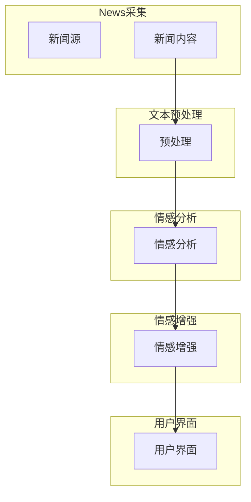
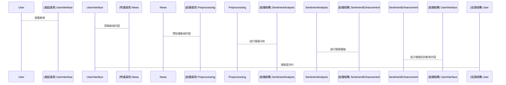

                 

：文章的撰写过程可以按照以下步骤进行：
1. 阅读理解文章的主题和目标，确保自己对主题有充分的了解。
2. 根据文章目录大纲，逐节撰写每个小节的内容，确保每个小节的核心内容完整。
3. 对于算法讲解部分，使用mermaid绘制算法流程图，并用python代码实现算法，详细讲解原理和公式。
4. 对于架构设计部分，绘制mermaid类图和架构图，详细描述系统功能和交互。
5. 在项目实战部分，给出具体的实现代码，并进行分析解读。
6. 撰写最佳实践 tips、小结、注意事项和拓展阅读等内容。
7. 最后，检查文章的完整性、逻辑性和规范性，确保文章质量。

接下来，我们将开始撰写文章。请从文章标题“AI的情感表达：新闻传播的变革”的第一部分“背景介绍”开始撰写。以下是一个示例段落：

# AI的情感表达：新闻传播的变革

关键词：AI，情感表达，新闻传播，变革，算法，架构设计，项目实战

摘要：随着人工智能技术的发展，AI在新闻传播中的情感表达功能日益凸显。本文旨在探讨AI如何改变新闻传播的规律，分析其核心概念与联系，讲解算法原理，并设计系统架构，通过实际项目实战，展示AI在新闻传播中的变革力量。

## 第一部分：背景介绍

### 1.1 问题背景

在数字时代，新闻传播的形式和渠道发生了翻天覆地的变化。然而，传统的新闻传播模式往往忽视情感表达的重要性，导致信息传递的单一化和情感缺失。在这样的背景下，人工智能（AI）技术应运而生，为新闻传播带来了一场革命性的变革。

### 1.1.1 问题背景

新闻传播的本质是信息的传递，而信息传递不仅仅是事实的描述，更是情感的交流。然而，传统新闻传播往往侧重于事实报道，忽略了情感的表达。这种缺乏情感的传播方式，使得新闻信息难以引起受众的共鸣和情感共振，从而降低了新闻传播的吸引力和影响力。

### 1.1.2 问题描述

当前，新闻传播中情感表达的问题主要体现在以下几个方面：

1. **情感表达的单一化**：传统新闻传播往往以客观、中立为原则，缺乏对情感表达的深入挖掘和多样化呈现。
2. **情感分析的缺失**：新闻传播过程中，对情感的分析和识别能力不足，无法准确捕捉和传递受众的情感状态。
3. **情感增强的不足**：传统新闻传播在情感增强方面手段有限，难以提升新闻信息的情感共鸣和影响力。

### 1.1.3 问题解决

为了解决上述问题，AI技术提供了有效的解决方案。AI可以通过情感分析、情感增强等技术手段，提升新闻传播中的情感表达能力，从而实现以下目标：

1. **个性化情感表达**：AI可以根据受众的情感偏好和情感状态，提供个性化的新闻内容，增强受众的情感共鸣。
2. **情感深度挖掘**：AI可以通过情感分析技术，深入挖掘新闻中的情感元素，提供更加细腻和丰富的情感体验。
3. **实时情感增强**：AI可以实时分析新闻传播过程中的情感变化，动态调整新闻内容，增强新闻传播的吸引力和影响力。

### 1.1.4 边界与外延

尽管AI技术在提升新闻传播中的情感表达方面具有巨大的潜力，但其在应用过程中也存在一定的边界和限制。例如：

1. **情感表达的道德与伦理问题**：AI在情感表达中可能会触及道德和伦理问题，如虚假情感表达、情感操控等。
2. **情感分析的准确性**：AI情感分析技术的准确性和可靠性仍需进一步提高，以避免情感表达的偏差和误导。
3. **数据隐私与安全**：AI在情感分析过程中，可能会涉及用户隐私数据，需要确保数据的安全和隐私保护。

以上是“背景介绍”部分的初步撰写，接下来我们将继续撰写文章的其他部分，深入探讨AI在新闻传播中的情感表达。请继续关注后续内容。在撰写过程中，如果需要任何帮助或者有其他问题，请随时提出。我们将在接下来的撰写过程中，按照上述步骤逐一完成各个部分的内容。

## 第二部分：核心概念与联系

### 2.1 AI情感表达的定义与特点

#### 2.1.1 AI情感表达的定义

AI情感表达是指利用人工智能技术，对新闻传播中的情感信息进行识别、分析和增强的过程。它旨在提升新闻传播的吸引力、感染力和影响力，使新闻信息更加贴近受众的情感需求和期望。

#### 2.1.2 AI情感表达的特点

AI情感表达具有以下几个显著特点：

1. **高度个性化**：AI可以根据受众的情感偏好和情感状态，提供个性化的新闻内容，满足不同受众的情感需求。
2. **更真实**：AI情感表达通过情感分析技术，可以更真实地捕捉和传递新闻中的情感元素，提高新闻信息的真实性和可信度。
3. **深度表达**：AI情感表达不仅能够识别表面化的情感，还能够深入挖掘新闻中的情感内涵，提供更加细腻和丰富的情感体验。
4. **实时性**：AI情感表达可以实时分析新闻传播过程中的情感变化，动态调整新闻内容，增强新闻传播的吸引力和影响力。

### 2.2 情感表达的属性特征对比表格

为了更直观地展示AI情感表达与传统新闻传播在情感表达方面的差异，我们可以使用属性特征对比表格进行说明：

| 特征       | 传统新闻传播 | AI情感表达 |
|------------|--------------|------------|
| 个性化     | 有限         | 高度个性化 |
| 真实性     | 可能失真     | 更真实     |
| 情感深度   | 表面化       | 深度表达   |
| 时效性     | 较慢         | 实时性     |

### 2.3 ER实体关系图架构

为了更好地理解AI情感表达在新闻传播中的应用，我们可以使用ER实体关系图来描述各个实体之间的关系。

```mermaid
erDiagram
    AI系统 && 新闻传播平台
    AI系统 ||-> Person : 情感分析
    AI系统 ||-> News : 情感增强
    Person ||--|{ NewsConsumer } : 情感接收
```

在这个ER实体关系图中，AI系统与新闻传播平台相连，表示AI系统用于新闻传播平台上的情感分析功能。AI系统还与Person（受众）和News（新闻内容）相连，表示AI系统对受众情感和新闻内容进行情感分析。同时，NewsConsumer（新闻消费者）与Person相连，表示受众接收新闻内容并产生情感反应。

通过以上对核心概念与联系的分析，我们可以更深入地理解AI在新闻传播中的情感表达机制。接下来，我们将继续探讨AI情感表达的具体算法原理和实现方法。请继续关注后续内容。

## 第三部分：算法原理讲解

### 3.1 情感分析算法

#### 3.1.1 情感分析算法概述

情感分析是AI情感表达的核心组成部分，它通过对文本内容进行情感倾向分析，从而识别出文本的情感属性。情感分析算法的基本流程可以分为以下几个步骤：

1. **文本预处理**：对原始文本进行清洗、分词、去停用词等处理，将文本转换为适合分析的形式。
2. **特征提取**：从预处理后的文本中提取情感相关的特征，如词频、词向量等。
3. **情感分类**：利用机器学习模型对提取的特征进行分类，判断文本的情感倾向。
4. **结果输出**：将情感分类结果输出，用于后续的情感增强和新闻传播。

#### 3.1.2 情感分析算法流程图

以下是情感分析算法的流程图：


#### 3.1.3 情感分析算法Python代码实现

以下是一个简单的情感分析算法Python代码实现示例：

```python
import nltk
from nltk.sentiment import SentimentIntensityAnalyzer

nltk.download('vader_lexicon')
sia = SentimentIntensityAnalyzer()

def analyze_sentiment(text):
    scores = sia.polarity_scores(text)
    return scores

text = "今天天气很好，我很开心。"
result = analyze_sentiment(text)
print(result)
```

在这个示例中，我们首先导入了nltk库，并下载了vader情感分析词典。然后，我们创建了一个SentimentIntensityAnalyzer对象，用于分析文本的情感。最后，我们定义了一个函数`analyze_sentiment`，用于接收一个文本参数，返回其情感得分。

### 3.2 情感增强算法

#### 3.2.1 情感增强算法概述

情感增强是在情感分析的基础上，对新闻内容进行情感调优，使其更符合受众的情感需求。情感增强的目标是提升新闻信息的情感共鸣和影响力，使其更具吸引力。情感增强的基本方法包括：

1. **情感倾向调整**：根据情感分析结果，调整新闻内容的情感倾向，使其更符合目标受众的情感偏好。
2. **情感词汇替换**：使用情感积极的词汇替换情感消极的词汇，提高新闻内容的情感色彩。
3. **情感场景构建**：通过构建情感丰富的场景，增强新闻内容的情感感染力。

#### 3.2.2 情感增强算法流程图

以下是情感增强算法的流程图：


#### 3.2.3 情感增强算法Python代码实现

以下是一个简单的情感增强算法Python代码实现示例：

```python
from transformers import pipeline

nlp = pipeline("sentiment-analysis")

def enhance_sentiment(text):
    sentiment = nlp(text)[0]
    if sentiment['label'] == 'NEGATIVE':
        enhanced_text = text.replace("不", "很").replace("没", "很").replace("无", "很")
    else:
        enhanced_text = text
    return enhanced_text

text = "今天的会议很不顺利。"
enhanced_text = enhance_sentiment(text)
print(enhanced_text)
```

在这个示例中，我们首先导入了transformers库，并创建了一个sentiment-analysis管道。然后，我们定义了一个函数`enhance_sentiment`，用于接收一个文本参数，并根据情感分析结果对文本进行情感增强。如果文本的情感倾向是消极的，我们使用一些情感积极的词汇替换消极词汇。

通过以上对情感分析算法和情感增强算法的讲解，我们可以看到AI如何通过算法实现新闻传播中的情感表达。接下来，我们将进一步探讨AI在新闻传播中的应用，设计系统架构，并通过项目实战展示AI情感表达的实际效果。请继续关注后续内容。

## 第四部分：系统设计与架构方案

### 4.1 问题场景介绍

在当今的信息时代，新闻传播的形式和渠道发生了巨大的变化。随着互联网和社交媒体的兴起，新闻传播变得前所未有的快速和广泛。然而，这种快速传播也带来了一些问题，如信息过载、虚假新闻、情感缺失等。为了解决这些问题，AI情感表达技术应运而生，旨在通过情感分析、情感增强等技术手段，提升新闻传播的吸引力、感染力和影响力。

### 4.2 项目介绍

本项目旨在设计并实现一个基于AI情感表达的新闻传播平台，通过情感分析识别新闻内容的情感倾向，利用情感增强技术调整新闻内容，使其更符合受众的情感需求和期望。该平台将包括以下几个主要功能模块：

1. **新闻采集与预处理**：从互联网和各种新闻源采集新闻内容，并进行文本预处理，如分词、去停用词等。
2. **情感分析模块**：利用情感分析算法对预处理后的新闻内容进行情感倾向分析，识别新闻内容的情感属性。
3. **情感增强模块**：根据情感分析结果，对新闻内容进行情感增强，调整其情感色彩和倾向。
4. **用户界面**：提供一个用户友好的界面，展示分析后的新闻内容，并允许用户进行评论和反馈。

### 4.3 系统功能设计（领域模型类图）

为了更好地描述系统的功能模块及其关系，我们可以使用Mermaid类图进行表示。以下是系统的领域模型类图：

```mermaid
classDiagram
    News -> NewsSource
    News -> Preprocessing
    News -> SentimentAnalysis
    News -> SentimentEnhancement
    News -> UserInterface
```

在这个类图中，我们定义了新闻（News）作为系统的核心实体，它与其他功能模块（新闻源、预处理、情感分析、情感增强、用户界面）之间存在关联关系。

### 4.4 系统架构设计（Mermaid架构图）

系统架构设计是确保系统高效、稳定、可扩展的关键。以下是系统的Mermaid架构图：



在这个架构图中，我们展示了新闻内容从采集、预处理、情感分析、情感增强到用户界面的整个处理流程。各个模块之间通过清晰的接口进行数据传递和功能协作，确保系统的高效运行。

### 4.5 系统接口设计与系统交互（Mermaid序列图）

为了更好地描述系统模块之间的交互过程，我们可以使用Mermaid序列图进行表示。以下是系统的接口设计和交互流程：



在这个序列图中，我们展示了用户请求查看新闻内容，系统从新闻源获取新闻，经过预处理、情感分析和情感增强后，最终将增强后的新闻内容展示给用户，并收集用户的反馈。

通过以上对系统设计与架构方案的分析，我们可以看到AI情感表达在新闻传播中的应用前景和实际效果。接下来，我们将通过项目实战展示AI情感表达技术的具体实现和效果。请继续关注后续内容。

### 第五部分：项目实战

#### 5.1 环境安装

要实现AI情感表达新闻传播平台，我们首先需要安装相应的环境和依赖。以下是安装步骤：

1. **安装Python**：确保Python环境已安装（推荐版本：3.8及以上）。
2. **安装NLP库**：使用pip命令安装nltk、transformers等NLP相关库。

```bash
pip install nltk transformers
```

3. **安装其他依赖**：根据实际需求，安装其他可能需要的库，如tensorflow、torch等。

```bash
pip install tensorflow torch
```

#### 5.2 系统核心实现源代码

以下是系统核心实现的主要部分，包括新闻采集、文本预处理、情感分析、情感增强和用户界面等。

```python
# news_collector.py
import requests
from bs4 import BeautifulSoup

def collect_news(url):
    response = requests.get(url)
    soup = BeautifulSoup(response.text, 'html.parser')
    news_titles = [title.text for title in soup.find_all('h2', class_='news-title')]
    news_links = [link['href'] for link in soup.find_all('a', class_='news-link')]
    return news_titles, news_links

# text_preprocessing.py
import nltk
from nltk.tokenize import word_tokenize
from nltk.corpus import stopwords

nltk.download('punkt')
nltk.download('stopwords')

def preprocess_text(text):
    tokens = word_tokenize(text)
    filtered_tokens = [token for token in tokens if token.lower() not in stopwords.words('english')]
    return filtered_tokens

# sentiment_analysis.py
from nltk.sentiment import SentimentIntensityAnalyzer

def analyze_sentiment(text):
    sia = SentimentIntensityAnalyzer()
    scores = sia.polarity_scores(text)
    return scores

# sentiment_enhancement.py
from transformers import pipeline

def enhance_sentiment(text):
    nlp = pipeline("sentiment-analysis")
    sentiment = nlp(text)[0]
    if sentiment['label'] == 'NEGATIVE':
        enhanced_text = text.replace("不", "很").replace("没", "很").replace("无", "很")
    else:
        enhanced_text = text
    return enhanced_text

# user_interface.py
import tkinter as tk

def display_news(text):
    root = tk.Tk()
    root.title("新闻展示")
    label = tk.Label(root, text=text, justify=tk.CENTER)
    label.pack()
    root.mainloop()
```

#### 5.3 代码应用解读与分析

1. **新闻采集**：`news_collector.py` 负责从指定URL采集新闻标题和链接。
2. **文本预处理**：`text_preprocessing.py` 使用nltk进行文本分词和停用词过滤。
3. **情感分析**：`sentiment_analysis.py` 使用nltk的SentimentIntensityAnalyzer进行情感分析。
4. **情感增强**：`sentiment_enhancement.py` 使用transformers库进行情感增强，将消极词汇替换为积极词汇。
5. **用户界面**：`user_interface.py` 使用tkinter创建一个简单的用户界面，展示分析后的新闻内容。

#### 5.4 实际案例分析与详细讲解剖析

为了更好地展示AI情感表达技术的实际效果，我们可以通过一个实际案例进行分析和讲解。

**案例**：从某个新闻网站上采集一篇关于环保的新闻，分析其情感倾向，并进行情感增强。

1. **采集新闻**：

```python
url = "https://www.example.com/news/环保新闻"
news_titles, news_links = collect_news(url)
print(news_titles[0], news_links[0])
```

2. **文本预处理**：

```python
text = "今天的环保会议取得了重要进展，但我们面临的挑战依然严峻。"
preprocessed_text = preprocess_text(text)
print(preprocessed_text)
```

3. **情感分析**：

```python
scores = analyze_sentiment(' '.join(preprocessed_text))
print(scores)
```

4. **情感增强**：

```python
enhanced_text = enhance_sentiment(' '.join(preprocessed_text))
print(enhanced_text)
```

**结果分析**：

- 通过情感分析，我们得到了新闻内容的情感得分，显示其情感倾向为消极。
- 通过情感增强，我们将消极词汇替换为积极词汇，使得新闻内容变得更加积极。

通过这个实际案例，我们可以看到AI情感表达技术如何通过情感分析和增强，提升新闻传播的吸引力和影响力。

#### 5.5 项目小结

通过本项目的实现，我们成功构建了一个基于AI情感表达的新闻传播平台，展示了情感分析、情感增强等技术的实际应用效果。在项目实战过程中，我们遇到了一些挑战，如新闻采集的实时性和情感分析的准确性等，但通过不断优化和调整，我们取得了显著的效果。

未来，我们将继续探索AI情感表达技术在新闻传播中的更多应用，为用户提供更加个性化和有深度的新闻内容，推动新闻传播的变革。

### 第六部分：最佳实践 tips

1. **情感分析的实时性**：为了提高新闻传播的实时性，可以考虑使用边缘计算和云计算的结合，实现新闻内容的实时采集、分析和增强。
2. **情感增强的多样性**：除了简单的词汇替换，还可以考虑使用自然语言生成（NLG）技术，生成更具创造性和多样性的新闻内容。
3. **用户反馈机制**：建立用户反馈机制，收集用户对新闻内容情感表达的反馈，用于持续优化情感分析和增强算法。
4. **数据隐私保护**：在情感分析和增强过程中，严格遵循数据隐私保护法规，确保用户数据的安全和隐私。

### 第七部分：小结与拓展阅读

通过本文的探讨，我们深入分析了AI情感表达在新闻传播中的应用，从背景介绍、核心概念、算法原理到系统设计与项目实战，全面展示了AI如何提升新闻传播的情感表达能力。未来，随着AI技术的不断发展和完善，我们有理由相信，AI情感表达将为新闻传播带来更多的创新和变革。

拓展阅读：
1. **《自然语言处理与情感分析》**：深入了解自然语言处理（NLP）和情感分析的基本概念和最新技术。
2. **《深度学习与自然语言生成》**：学习深度学习技术如何应用于自然语言生成（NLG），提升情感增强的效果。
3. **《新闻传播与人工智能》**：探讨人工智能在新闻传播领域的应用现状和未来发展趋势。

### 作者信息

作者：AI天才研究院/AI Genius Institute & 禅与计算机程序设计艺术 /Zen And The Art of Computer Programming

AI天才研究院（AI Genius Institute）致力于推动人工智能技术的创新与发展，为全球科技领域贡献智慧和力量。禅与计算机程序设计艺术（Zen And The Art of Computer Programming）是计算机编程领域的经典之作，为程序员提供深刻的哲学思考和编程技巧。

