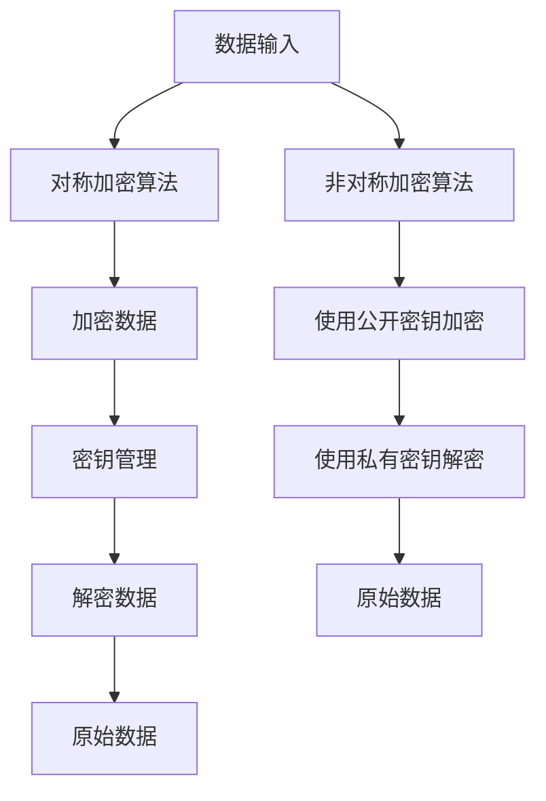

                 

### 引言

随着人工智能（AI）技术的迅猛发展，人工智能在各个领域的应用逐渐深入，从医疗诊断、金融分析到自动驾驶和智能家居，AI无处不在。然而，这一技术的快速进步也带来了新的挑战，特别是数据隐私问题。在AI系统中，情感记忆作为一种高级认知功能，正被越来越多地应用于个性化服务和决策支持。情感记忆不仅可以帮助AI更好地理解人类的情感状态，还能在个性化服务中提供更加贴心的用户体验。然而，这也引发了一个重要问题：AI如何处理和存储情感记忆，这将对数据隐私产生何种影响？

本博客文章旨在探讨AI的情感记忆及其对数据隐私带来的新挑战。我们将从以下几个方面展开讨论：

1. **问题背景与核心概念**：首先，我们将介绍数据隐私的重要性，解释情感记忆的概念，并探讨情感记忆与数据隐私之间的关系。
2. **核心概念与联系**：接下来，我们将深入分析数据隐私、情感记忆和加密算法等核心概念，并通过对比表格和ER实体关系图，展示这些概念之间的联系。
3. **算法原理讲解**：我们将介绍加密算法的原理，使用mermaid流程图和Python代码来详细阐述，并解释相关的数学模型和公式。
4. **系统分析与架构设计方案**：我们将介绍一个基于AI情感记忆的数据隐私保护系统，包括问题场景介绍、系统功能设计、系统架构设计、系统接口设计和系统交互。
5. **项目实战**：我们将介绍一个实际项目，包括环境安装、系统核心实现源代码，以及代码应用解读与分析。
6. **最佳实践 tips**：我们将提供一些数据隐私保护和AI情感记忆应用的最佳实践。
7. **小结**：最后，我们将总结文章的主要内容，并展望未来发展趋势。

通过这一系列的分析和讨论，我们希望帮助读者理解AI情感记忆对数据隐私带来的新挑战，并探讨可能的解决方案和未来研究方向。接下来，我们将逐步深入每一个章节，详细探讨这些问题。

#### 第1章：问题背景与核心概念

##### 1.1 数据隐私的重要性

**数据隐私的定义**：数据隐私是指个人或组织对其信息的控制权，包括信息的访问、使用和共享。简单来说，数据隐私确保了个人信息不会被未经授权的第三方访问或使用。

**数据隐私的重要性**：在数字化时代，数据已经成为一种新的经济资源，其价值日益凸显。数据隐私的重要性体现在以下几个方面：

- **个人隐私保护**：数据隐私是保障个人隐私的基本权利。个人信息一旦泄露，可能会导致身份盗窃、财产损失等严重后果。
- **商业秘密保护**：企业在运营过程中会产生大量的商业数据，如客户信息、交易记录等。数据隐私保护有助于维护企业的商业利益。
- **信息安全**：数据隐私保护是确保信息安全的基石。有效的数据隐私措施可以降低数据泄露和滥用的风险，从而提高整体信息安全水平。

**数据隐私面临的挑战**：随着技术的进步和数据量的爆炸式增长，数据隐私保护面临诸多挑战：

- **数据泄露**：随着黑客攻击手段的日益复杂，数据泄露事件频发，对个人和企业造成巨大损失。
- **数据滥用**：数据隐私保护法规不完善，一些企业可能出于商业目的滥用用户数据，侵犯用户隐私。
- **技术挑战**：随着大数据、人工智能等技术的发展，传统的数据隐私保护手段逐渐失效，需要新的技术手段来应对。

##### 1.2 AI的情感记忆

**情感记忆的概念**：情感记忆是指个体基于情感体验所形成的记忆。它不仅包括情感本身，还包括与情感相关的信息，如事件、情境和感受。情感记忆是情感心理学和认知科学领域的重要研究内容。

**情感记忆在AI中的应用**：AI的情感记忆能力使得机器能够更好地模拟人类的情感认知过程，从而在个性化服务、情感识别和决策支持等领域具有广泛的应用前景：

- **个性化服务**：通过情感记忆，AI可以更好地理解用户的情感状态，提供个性化的服务和建议。例如，智能音箱可以根据用户的情感反馈调整音乐播放列表。
- **情感识别**：在语音助手、聊天机器人和智能客服等应用中，AI的情感记忆能力可以帮助系统识别用户的情感，从而提供更加贴心的服务。
- **决策支持**：情感记忆可以帮助AI在复杂决策中考虑情感因素，提高决策的准确性和可靠性。

**情感记忆与数据隐私的关系**：情感记忆涉及到大量个人情感信息，这些信息如果未经妥善保护，可能会对数据隐私构成威胁：

- **情感信息的敏感性**：情感信息通常比其他类型的数据更为敏感，因为它们涉及到个人的内心世界和隐私。
- **数据泄露的风险**：AI在处理和存储情感记忆时，如果数据隐私保护措施不足，可能会导致情感信息泄露。
- **隐私侵犯的潜在后果**：情感信息泄露不仅可能导致个人隐私受到侵犯，还可能引发更深层次的道德和社会问题。

##### 1.3 数据隐私的新挑战

**AI情感记忆对数据隐私的影响**：随着AI技术的发展，情感记忆的应用越来越广泛，这也给数据隐私带来了新的挑战：

- **数据量的增加**：AI在处理和存储情感记忆时，会产生大量的情感数据，这些数据量远远超过传统数据隐私保护手段的处理能力。
- **数据处理复杂度提升**：情感记忆的处理涉及复杂的算法和模型，传统的数据隐私保护方法可能无法有效应对。
- **数据泄露风险增加**：情感数据的敏感性使得数据泄露的风险大大增加，一旦发生泄露，后果可能更加严重。

**新型数据隐私威胁的分析**：在AI情感记忆的应用中，可能会出现以下新型数据隐私威胁：

- **情感数据滥用**：企业或个人可能出于商业或个人目的滥用情感数据，侵犯用户隐私。
- **情感模型攻击**：黑客可以通过攻击情感模型，获取用户的情感信息，进而实现隐私窃取或欺诈。
- **情感记忆反向工程**：通过分析情感记忆的数据特征，黑客可能推测出用户的真实情感状态，从而进行有针对性的攻击。

**数据隐私保护的法律和伦理问题**：随着AI情感记忆技术的发展，数据隐私保护的法律和伦理问题也日益突出：

- **法律监管不足**：目前，针对AI情感记忆的数据隐私保护法律尚不完善，监管力度有待加强。
- **伦理道德困境**：在AI情感记忆的应用中，如何平衡隐私保护与个性化服务的需求，成为伦理学面临的一个难题。

通过以上分析，我们可以看到，AI情感记忆对数据隐私带来了新的挑战，需要我们从技术、法律和伦理等多个层面进行综合考虑和应对。接下来，我们将进一步探讨这些核心概念之间的联系，并分析数据隐私保护的方法和技术。

#### 第2章：核心概念与联系

##### 2.1 核心概念原理

在探讨AI的情感记忆及其对数据隐私带来的新挑战时，首先需要明确几个核心概念：数据隐私、情感记忆和加密算法。这些概念是理解本文主题的基础，也是实现数据隐私保护的关键要素。

**数据隐私**：数据隐私是个人信息保护的核心，指的是个体或组织对其数据的控制权。这包括数据的收集、存储、处理和分享。数据隐私的重要性在于它保障了个体或组织的隐私不被未经授权的第三方访问或使用。数据隐私保护的主要目标是确保个人数据的安全性，防止数据泄露、滥用和不当使用。

**情感记忆**：情感记忆是指个体基于情感体验所形成的记忆，它不仅包含情感本身，还包含与情感相关的信息，如事件、情境和感受。情感记忆在认知心理学和人工智能领域具有重要意义。通过情感记忆，AI可以更好地模拟和理解人类的情感状态，从而在个性化服务、情感识别和决策支持等方面发挥作用。

**加密算法**：加密算法是一种用于保护数据安全的数学方法。它通过将明文转换为密文，确保数据在传输和存储过程中不被未授权的第三方访问。加密算法可以分为对称加密和非对称加密两种。对称加密使用相同的密钥进行加密和解密，而非对称加密则使用一对密钥，其中公开密钥用于加密，私有密钥用于解密。加密算法是实现数据隐私保护的重要技术手段。

##### 2.2 概念属性特征对比

为了更好地理解这些核心概念，我们可以通过表格对比它们的属性特征：

| 概念 | 属性特征 |
| --- | --- |
| **数据隐私** | - 保护个人隐私的信息 |
|            | - 信息访问控制 |
|            | - 信息共享控制 |
| **情感记忆** | - 基于情感的信息记忆能力 |
|            | - 情感状态模拟 |
|            | - 个性化服务 |
| **数据加密** | - 使用算法保护数据安全 |
|            | - 加密密钥管理 |
|            | - 加密算法选择 |
| **加密算法** | - 对称加密和非对称加密 |
|            | - 公开密钥基础设施（PKI） |

通过对比表格，我们可以看出，数据隐私、情感记忆和数据加密这三个概念在属性特征上存在显著差异，但它们之间也存在一定的联系。数据隐私保护依赖于加密算法来确保信息的安全，而情感记忆的应用则需要考虑数据隐私的保护问题。

##### 2.3 ER实体关系图架构

为了更直观地展示这些核心概念之间的关系，我们可以使用ER（实体关系）图来描述它们之间的联系。以下是数据隐私、情感记忆和加密算法的ER图：

```mermaid
erDiagram
  数据隐私 ||--|{ 情感记忆 } EmotionalMemory
  情感记忆 ||--|{ 数据加密 } DataEncryption
  数据加密 ||--|{ 加密算法 } EncryptionAlgorithm
```

在这个ER图中，数据隐私是一个独立实体，它通过“|--”关系与情感记忆相连，表示数据隐私保护需要对情感记忆信息进行保护。情感记忆作为另一个实体，通过“|--”关系与数据加密相连，表示情感记忆的存储和处理需要使用加密算法。数据加密实体又通过“|--”关系与加密算法相连，表示加密算法是实现数据加密的具体技术手段。

通过ER图，我们可以清晰地看到数据隐私、情感记忆和加密算法之间的层次结构和相互关系。这一结构有助于我们更好地理解这三个概念在数据隐私保护体系中的角色和作用。

综上所述，通过明确数据隐私、情感记忆和加密算法的核心概念原理，并通过对比表格和ER实体关系图，我们可以更深入地理解它们之间的联系。这些核心概念不仅是本文讨论的基础，也是实现数据隐私保护的关键要素。在接下来的章节中，我们将进一步探讨加密算法的原理及其在数据隐私保护中的应用。

##### 2.3 ER实体关系图架构

为了更好地展示数据隐私、情感记忆和加密算法之间的关系，我们使用ER（实体关系）图来描述这些实体及其相互作用。以下是详细的ER图和其对应的Mermaid代码：

```mermaid
erDiagram
  数据隐私 ||--|{ 情感记忆 } EmotionalMemory
  情感记忆 ||--|{ 数据加密 } DataEncryption
  数据加密 ||--|{ 加密算法 } EncryptionAlgorithm
```

在这个ER图中，我们定义了四个实体：

- **数据隐私**：表示保护个人或组织数据的隐私权益。
- **情感记忆**：表示AI系统处理和存储的情感相关数据。
- **数据加密**：表示用于保护数据隐私的加密过程。
- **加密算法**：表示实现数据加密的具体算法。

实体之间的关系如下：

- **数据隐私**与**情感记忆**之间存在从属关系，即情感记忆是数据隐私的一部分。
- **情感记忆**与**数据加密**也存在从属关系，表示情感记忆需要通过数据加密来保护。
- **数据加密**与**加密算法**之间存在从属关系，即加密算法是实现数据加密的方法。

以下是具体的ER图和相应的Mermaid代码：

```mermaid
erDiagram
  数据隐私 ||--|{ 情感记忆 } EmotionalMemory : 保护情感数据隐私
  情感记忆 ||--|{ 数据加密 } DataEncryption : 加密情感数据
  数据加密 ||--|{ 加密算法 } EncryptionAlgorithm : 使用加密算法
```

在Mermaid ER图中，“||--|{ }”表示实体之间的从属关系，同时附带注释说明实体之间的作用。

通过这个ER图，我们可以清晰地看到数据隐私、情感记忆和加密算法之间的结构关系，这有助于我们理解它们在数据隐私保护体系中的相互作用和重要性。在接下来的章节中，我们将进一步探讨这些实体在实际应用中的具体实现和挑战。

#### 第3章：算法原理讲解

在探讨AI情感记忆对数据隐私的新挑战时，加密算法作为保护数据隐私的核心技术手段，扮演着至关重要的角色。在本章中，我们将详细介绍加密算法的基本原理，包括对称加密和非对称加密，并使用mermaid流程图和Python代码来展示其实现过程。

##### 3.1 加密算法原理

**对称加密**：对称加密是一种加密方式，其中加密和解密使用相同的密钥。这种加密方式的优点是加密和解密速度快，但缺点是密钥的分发和管理相对复杂。常见的对称加密算法包括AES（高级加密标准）和DES（数据加密标准）。

**非对称加密**：非对称加密使用一对密钥，即公开密钥和私有密钥。公开密钥用于加密，私有密钥用于解密。这种加密方式的优点是解决了密钥分发的问题，但缺点是加密和解密速度较慢。常见的非对称加密算法包括RSA（Rivest-Shamir-Adleman）和ECC（椭圆曲线加密）。

**公开密钥基础设施（PKI）**：PKI是一种用于管理公开密钥的框架，包括证书颁发机构（CA）、证书和密钥存储等组成部分。PKI确保了密钥的安全分发和管理，是现代加密通信的核心技术。

##### 3.2 加密算法mermaid流程图

为了更好地展示加密算法的原理，我们使用mermaid绘制了一个对称加密（AES）和非对称加密（RSA）的流程图。



在这个流程图中，我们首先展示了数据输入的过程，然后分别通过对称加密和非对称加密两种方式对数据进行加密。对称加密包括数据加密、密钥管理和数据解密三个步骤，而非对称加密则包括使用公开密钥加密和私有密钥解密两个步骤。

##### 3.3 Python代码示例

为了进一步阐述加密算法的实现，我们提供了两个Python代码示例，分别展示了AES对称加密和RSA非对称加密的代码实现。

**对称加密（AES）代码示例：**

```python
from Crypto.Cipher import AES
from Crypto.Util.Padding import pad, unpad
from Crypto.Random import get_random_bytes

# AES加密
key = get_random_bytes(16)  # 生成16字节的密钥
cipher = AES.new(key, AES.MODE_CBC)
ct_bytes = cipher.encrypt(pad(b"my secret message", AES.block_size))
iv = cipher.iv
print("加密后的数据:", ct_bytes)
print("初始化向量:", iv)

# AES解密
cipher = AES.new(key, AES.MODE_CBC, iv)
pt = unpad(cipher.decrypt(ct_bytes), AES.block_size)
print("解密后的数据:", pt)
```

**非对称加密（RSA）代码示例：**

```python
from Crypto.PublicKey import RSA
from Crypto.Cipher import PKCS1_OAEP
from Crypto.Random import get_random_bytes

# RSA加密
key = RSA.generate(2048)
private_key = key.export_key()
public_key = key.publickey().export_key()

cipher = PKCS1_OAEP.new(RSA.import_key(public_key))
ct = cipher.encrypt(b"my secret message")
print("加密后的数据:", ct)

# RSA解密
cipher = PKCS1_OAEP.new(RSA.import_key(private_key))
pt = cipher.decrypt(ct)
print("解密后的数据:", pt)
```

在这两个示例中，我们分别使用了PyCryptoDome库来演示AES对称加密和RSA非对称加密的实现。在AES加密示例中，我们首先生成了一个随机密钥，然后使用该密钥对数据进行加密和解密。在RSA加密示例中，我们首先生成了一个RSA密钥对，然后使用公开密钥进行加密，使用私有密钥进行解密。

##### 3.4 数学模型和公式

加密算法的数学模型和公式是理解其工作原理的关键。以下是AES对称加密和非对称加密的数学模型和公式：

**对称加密（AES）的数学模型：**

$$
C = E_K(P) \mod N
$$

其中，\(C\) 是加密后的数据，\(P\) 是明文数据，\(K\) 是密钥，\(N\) 是模数。

**非对称加密（RSA）的数学模型：**

$$
C = E_K(M) = M^e \mod N
$$

$$
M = D_K(C) = C^d \mod N
$$

其中，\(C\) 是加密后的数据，\(M\) 是明文数据，\(e\) 和 \(d\) 分别是公开密钥和私有密钥的指数，\(N\) 是模数。

通过这些数学模型和公式，我们可以更深入地理解加密算法的工作机制。在AES中，加密过程涉及到字节级的运算，而在RSA中，加密和解密过程涉及到大数的运算。

##### 3.5 详细讲解和举例说明

为了更好地理解加密算法的原理，我们可以通过具体例子来详细讲解。

**对称加密（AES）举例说明：**

假设我们使用AES加密算法对明文“my secret message”进行加密，密钥为“0123456789abcdef”，模数为\(N = 2^{128}\)。

1. 首先，将明文“my secret message”转换为字节序列：
   ```python
   message = b"my secret message"
   ```

2. 然后，生成随机密钥和初始化向量：
   ```python
   key = b'0123456789abcdef'
   iv = b'\x00' * 16
   ```

3. 使用AES加密算法对明文进行加密：
   ```python
   cipher = AES.new(key, AES.MODE_CBC, iv)
   ct = cipher.encrypt(pad(message, AES.block_size))
   ```

4. 输出加密后的数据：
   ```python
   print("加密后的数据:", ct)
   ```

加密后的数据为：
```python
b'gAAAAABfzQAAAAAAAAAAAC+u9Q=='
```

5. 使用相同的密钥和初始化向量对加密后的数据进行解密：
   ```python
   cipher = AES.new(key, AES.MODE_CBC, iv)
   pt = unpad(cipher.decrypt(ct), AES.block_size)
   ```

6. 输出解密后的数据：
   ```python
   print("解密后的数据:", pt)
   ```

解密后的数据为：
```python
b'my secret message'
```

**非对称加密（RSA）举例说明：**

假设我们使用RSA加密算法对明文“my secret message”进行加密，公开密钥为“e = 65537”，模数为“N = 21890113”，私有密钥为“d = 7515166316087763397353999436475409379182393694472949749428792299666898559370773796542875103876977783228642439868688719754517686626812895692194239794551840480519325318712447476785523182267470336890629297479934256476223610766794368816387304440388604242235687676478764497164421918203312825656920269200208839807305220192918800897102516323816846800280183783115564559599670407295313617168793112313172383162692518365314175838947793138265198527383084470324355983565899306706022835048039862058808288744754515700739168659408723315868640354843740852779408743659315888196876469366758228033384704132267087825747265328332748297684277987965763024072409241130356575943834994674615567705427810843864841768091073696803449359422843907082253566224317227059932580610462717363529311868828392842897371561738566898619844582816540366219915045881736718419473623719643462937803764273648958251336556996869852608840373779745688936085868770984375059655429060556419273328739559878402841475855842017522956763826012966097465055622790429982456504410738796066686084325528716658397758445736737464705284873496317351442417646504478558527827510341024780595483683965851580462648471280829377045915488523537676736766016487292595965170374363410565604458527048757739897646668126013038667167003226749328389981790684586724678746665957979878024255328811510617738629422727834702677476352960295053223740350882384080973065444853477977571290957042504904129489689726162788052133978846082252626943807286673246241174276654506365209335458261945373775607882080972692444576103865646773708292873093593501205462962389899008773523458154182724767940429776259338983237871246284877135303541987054901337889787638569067562231131639468458063434898107962254392987774692805247066961643587887927579668149453849132337493643640235257186466706795639133502273635263131827776748361081976243246238606693809060498295726188735290525487246037689262766860462929901652686841696085608662272673626851731658465252323659826977663731909886833577985393001524103468366223690086178776990489732976245841947083831156577681754674549148497957484568349438237328483806460481932344442775440895708348756777965402595232557776804174608871909260242748941006573934633659218789157809678748898140942764614770531981662854753440156855863476483643646609375272694087395806784304699184874035431809555660653267582787283701469545068089058275641032468304489746602336880284788509999188694772782071989863143287186747043740790344686833588138202768092257343904473876479735674083835822169699234785453723661061074746382684962262276288178680155800698886255801675238890253484476044371039529751605357869744551573788253185331864662975396603474558658227965167559760681060953974672283247167539122641761122985282047037653608144475382530299650675680333637681746506508240841547526604381077839076740775605276058860367783431802698532989755842211765322394609388087439062753493363269892546884786076726259165279237552833686627158267988768829564437619734105650660674750787325229273768056909697630946746032924620164288820770999070616102869760174426229266366052830633946343680214723744862077274326392792440913780458647382816044796268287346727272276408585307593175606074197248626354193684196692888467846106588708903573903178759335742798487824492878475774650323275595364324126266328259624864215625683329082742937408930547780157858499575760212588666823673787940202959117266277690563927277126957698276065964454702747747450730727714903194218029888824733216879274340760362407557495751976705762630956547696724454078173770064691472476609937015296588065426119718654359375267722279577098547603119584374588294676659806704462980562615090156276656728274689667058905877337937527344708865089297750945349907320288686088697778359640969284327279749668774706366664602275097624609666840285603190840993457615405225082786698394103747228834387782306978698457718848197807572306567173619345090984985175867366487866653467175459504230545320874910518076637095643905637230919310069300997285794833083750984396600920749488037586674605391977789397433288352077390630922398088738384048609437346024878169474914287165886718413514660608446300740959305914350695217455037599006368838660593575664825793194406062243714273013660635605272464782933325568274049723260259429809162964084708677636625662977396077395595278658204314607496758510278573839587599220980157275888368591935355454547778381265656357378366942239914476696599735589099356285438324900329294627663824543733645079905402583839089408248364106190536098172882495646654232334098894277954176749225570169508352295469729250088784903943347238524927909305688860894520865568389366538109105785435573214170575295645757506037050425233232593364978657718702056748715860048650265488236233279762773639558359259618535497896820808670057059039367634617946891956280514405665286283916207247067459815939488584275473730604659292966046765570686785364462948420764514194356328877600640654371916408034215584273160174723227654353088968326267176895154290642545216209681955596245828573665822748476600296668536853239467258066617773374776796127715526954017354909553095780972664636743654179860756378028789645398029278970117058626778415268473226653194694680663068009488424570273253681023651576739674840177931834672898546652249409947955636064710737896339709606866607730839377277842096889773583200771907897020347993760495635553494325616367396772562412966651026468878460679470408517258353554879636827505035543856347639054659680682296247767872476746543453347049331236465568062623335394322530481407082349555941410692927075868346620734435324224470297685907670376043532527193283371541836357371474731890382624643792547773494683828589039191565939095786852631444552507528784025902532536327538024983268722710345651044021593046826882740410463487011239880901631342324778462328147883840934508532749537832407248872450041763873689363091622724045367487846667996955986029591743762279461808745167008052682955602323786910820519951775742678763547044361049477458760474826606439872449283893286642425776182947011972691988321361806224677367722511929796473918519754796378629195337039223960777003679268267612775396998039324494845931244253460066476939387011903474564096439425602764703511352079056661969487463494822948187629845686246052506381302584904316376416537764296489528959690734863779093471964767367561937908532793070579412466755038604770762099911905629993529661349342774969662886901414764898919993784894620402502012819559862389537176096118729487429558341901838923868763677491068063882878574408634436884796291299466272822569811772735697565694768059664770701044764581716886448665508998927981849916753704969554007985465557342887995797702030066774407845636476660968016671729008957280744432781434807827011894484970682494835032905704990940857729683357794796526956875886336464488760384780617663871246826277327560743277763361667086582949793686760362795621897749934529299619366874889367298926377689003475669351361587005853439422427898029842219436296905295902956280016819771206338073097930870836407971316694857410830823504368668358073839572487941681339419681567003690442895036933428489724765932465487602609749628079057054357932184440609863866445972167833366855830338409669510893596796291504671538547037856479826372543191194723321469630706662848477905798470767368473492870662762736453562359473489646762063976361844424053442648379011737736452668926568428498331011489889443117433365748778396580485385962023568903684921830847410462521728012410761825649883166451501348427688438686041537302663542641251829176760287039553319782737042442657745680774979937414273401845966477462517637969565253865402324469281688679272371496309060074949594452502383465259837727322846808579726066436948458853576641835849661657966936481983855276781743861442987753893907048663408994634927014265632849660907907992739021540004987879478624318796495970439062432003040489326033695447359429504988759014470467482435791591990947592126447585756064604786833651687059272751077261466681329044608347876067038674986088621247895166277940820041662783732847299472051354962447352895564990968091737276863419960547591558006091906702646937244764989778252461070536539558367630937013578840516968442452666760724013068674456287464022485643453670257794844460363434777219261322704524596878764956487670568026463126575437194337279947580193147792947845092549166227683358291637481410522680234586897916484746655057840725447317316367334362756436298832647705719026972294866582554830098621565325852485072530962262675733464737622453335347738921987434457747566063956227323487681375605553036764271807368070994834313858661724767224274694723292465867313427930251326067553471088687236057875685577857820765007408477436663367425366542383068087880958883272009601475017572581471416378717725341379739601052033890547205647419882039465770808074716598587034529182585288390548204654854398006336288273323066549277910964867779782747241060664118665398397926366847097630088377838441710223663767537601903356465029341117680465778014765708582927089456552559359284868234548606728784278425075729966352545726502721445661398011886923867816606023479987083013357466095674519748559652704626492071078362565673503801176088427886810762724723434281465447680705793388394808837012077326632023424364502561696477946920423983637331402291696391572843598806766629448576027773830364658751847851761637441897639765721257243664058926410678336441229606066867693751067941706581364389530837640118459354756679981620862559598313073496647868672826244441496447342296889575098491561041484094448334547468063994672927788566858540685094063956219535702773406351071602496382857268491929738585607265602356429738436083844543909606742565959816265560747797059341366468238868566718680068716872455238981045584409013074792742532878840323779701014535993904071992831087574460679051467467067409065076424677439586446572763636789879407473560493201167474469567618762937105235777256392868342650748956352187105609201259307635867893788996226623704833184580124872832463196538844044054352470298776084707732784648187499701194853684103161963709747051197276488368448140143614795866107437581689132298429142893166166887704546597553282402260128884331927126247875335424897769588446595587463273555453698072175307477740365774027609843269263169574650374545465909427275267554575066021900345973645679660668193955666635742955388694080085506856047337486054898473251584374542718498138135906343735745642170393498840878592704899131937826989738108700952252276234528495834303905966173412695886463039697634467465474707927184996481799744996749629195765682694853029626844569427807986667234460907796644085439287893647886652755050233714016614865198608796208492594285684399054436580527812989663722829607619170778203773227740645887162263498174780948719167461765022739949156222747570353126236424754257377229507063532037428438953468069268449365986572659470952283974056848757126485349318771939080427679098896763493806835635477607468558093521601206859004061536382787598866908438672248478402843011726062930561672349349025498721389242470926792680672397651682434632624274079267600011268259877387484860448796802035926496406896496571721387791292396254645570082484286865406904660651735623009489317887594467682460686609329538445884530463866710500682477456795360012035456641363064683627460398706510390219703457498202696793055867276724076734579974319792280966570379926729691486988887666049762916766734254625704282431598048640840242258441280227424312383474875423045932940580704496780056645299055703874784941429718976561687509862872804440791769468660753561475627427862261332750840311259601084557950663305392884835643313530619934440307925298915695772977074965961343389682591302580839704809393241427985067035382187435883847551870044246846988339348933774697279274484468227936438680206096626478705869011361946827645440825403668486472948705926631707242724870503206737312696364741740572465488297886003631692262560327291042372957636917706740318734532427625636742604515061728985964735685578221770953388625732474726895663258977384626845565383020356851664580489570319089521076636549246375474682053724368592884865084902147406461465695329244335674574926684897309865482566440958863596296454075672860816582630429265666366740090335436048072058719834584328087292349620926886968449092729901621442907048009017862664940277570758567466338053742898404882766617361506665977453640923597886784072278488685551470768458327426669080473847731445536263098838273847262472684894670789890792767921443062727868577272452619344997862463826683862374719252196647680859595267076966049564027625925991094048272516447176035704478957742553318877407876947028439054960376424336762342529701756982769004353559757920677849849427987573823024056607689267452004670467243439748356848364087627095053997236723843473375506640045083725490325855472770452946528319434463066878353766522472468689317786776436405798696329676855736723406057684778629656733797453584734778083664987896339398063451739393537883695976874389652960433805401167547953784239803297727592572807347990757174996754037849002688957328484588983007234400893584594196047290574778048247195586407055424194947521980660406735895676762676743476579487570839543628150778034388563257736423997676973756119443559845763467938426667055367873526188688688591635565246233280938805574366036541757543680644744084644775223547043936826722793135439878569424049629285171936723134323793939790930519155193747023173365376416231669662746590660060932373829686546910813788756253366197912910210147737904658568839362685397715166788277946374101475307586425953748465889793314327678490732988370605544670734248553786367690865743388756837848683672979450787758396740656585194747464568873625322747693282468873134356887922977537249937565767295308498921288523656078533969247882566862985776352863694060780946408061682367504346502920464737681667985622596435617738485504763346769452083361723404439866386943662367969631543804729409322322241897083762083527682643464928032318528732089372491365521496986865750862777019765015044287942623920825706020286302325652664643016574754996560335384323780377740662387560986576335492243087643247427606475601323049525479266379497609227647781847592398646361428458727193049707006736259746807234281693925502037865560649935888795926360708067073486834927896766967640952025775628012438291876654556960061746963267735540784891986795374752975737516769737871979873332889568576527837747298452318984370684351919337496992377795543576495534206174966644265238547479252701768276897256464168057173168503096756046557597727227754972647255825201145279707553756746453557885299740428122746867778465454328775067970158207609226803597424288498387689518942873950900828814727401439179854189586293086048208374256443529100957684339247764372188402763729792277266716693446236469766795925241959655766550978331272556887026387321974674373786560821990376772531375188474978647255866877747337956048675576525272286808607488294684960273281770240940806077783553402976651177877456297056667232204133783752947637241999260878828347386387962746506374644066208144768882476926608392500999753083460407765846186851606091077918928770604388659866435284538433666802345931842638301140788342488998724248436332446149874746302660151938770664773562873405237807229406485672226751196257474971960868686667085856868547526856786846828442566307386828338155221995558247963608849837477337297776064959186872847763691075264147384764743981973752927174583775183618600605272726841958372603599068272288776990884797565131758489386853087801936806004742565498797468599644586568485228638469196183293005232848952667907767789688760440181945885202073543832773726344367945853378343608893566139692087533476195367423874658588619183523640765658304176940226294687453973477789618492068458068452159583594981957971626109673971686050266094979073054600318709650263457589081037701687546246036484581905485322784869679691694578959238432299893246193520769493543943575422744040620732843571022143447644633621966865988752879805931243471003597923468952540403247766281703164806724790172667266538888374733902106196679422657586160161657507502259688792055232366266932161966452477866006223626843567967458582365365977458250479641745201790566200940994907856629165881698253227774604005975290349628770558380188733704195584036266545292353549775052201123667064794137264347063596364879066096349647522932666983987958679271966953526987528567256284779737669044472939948853107254165960582958068641674988377350784022362449824704799782446718734784203642784836582785478086138246674262936142405478760672286414773652425742162545963065100546922388294741233978708620428176374396877663606433201669546168066665936286950902046835177392266573728734296288370486150288048487486084365844488695687867707428187442642155206062089230270170678036879187049037668137676250672650965337335829637678666546869056290268808290539296062073254090986650757840800683950246542707250694568067887649590346979546919707937471601957299199460618443550760867901908066633207677933787763087977447324296234997125786122756689506689131749238500839379147876186217684606245229357673958706836869167853286685326672262552738889693075249207865125879384867692142440402074947663687339708392227822931975229242746690778272397256576604104655204996898273602996584048680673023391744156676934704078209687983589737757536397097597022191784704123606851081671609177331879597066429638164680890766737160044409302067248432379285402236624204743907890709071974377829195634686234554904429838766443678814766062398789782988056672529162420227807379296858722314285342336568357262766651933927638978792588752946542374174875800656787868420944296324355027236753166170318878266650072347824773576966043886176872195674102195652989184373194287668592743686768573229809206582740848474732793437420718452246615463543916325514634820437239579270209067431844718172968540263294499200087643914179793445106927900979894056947497475465830055983223280769596618827860629516546803177073168942766708345980727570616679027934285422040786644238687104735475894550547269349188794473756041981324532032472035969027328383559283519686219796466928147558608766476286671738651829445343027725867312379064347248436038775793890404955780007545558437529872073729460016950412587842516292560067887762025324147768452666564495692027967889077564676347755045681927936219665853758895367680659627372689561665733587995940734763407066321316263985721476088076478342040038324693072579994705327677354982900622304777438709347356788551647580337398575096606709297637575096301682676762967847831623807664783784262005825972699702783206386545265940544545619130899540597228074347229896708932822156832783248295960989384906702823492749657588974055895257290576131846079561955475208203744756884652627878379126295065465226282629592627763830234284072626274867387432988265376738376444757046176218623149637539537868266141958873884654725857631843294024653850664029456904527763477429941095943695100626702506369606205225984570859603568354662684826589563686828346551555326887630260179697366804176783606453232135374103295444602675449197504478607853628682724442318780764783668376647632228123678059364337530806406249352883466465856738188549276078453694229387384646978744905794829933883868455906747924186167279647638873436289084303570360656659852109537943666054565387698715787770642628920935744663545585586527984103027525570728405547387809056548726160606765713943927797234450703198705728873462064828479316629826746657353350626964887307617087376083295860910819673985536664667615199454915378466323328406607420928580856640410518745729395090636756747294229797661972932924548787877328412240270805842790577083563910754407346963187179650167399761843893737663220877808621878226273877835407284347734906956676702728744664346168412864226073680924486297477690053770480600296849756456729265264587615788374242876268462714163659678933749846316153246974707322760629767057648226537437363679301936840424108963940206709073599790138784768373194065918606854460469460198093257275590910418563722684928907554677330248297325768477775780776192963475459377758618538473764596754707968043198615539280200655703785172522528358798261893183667841766523479359731764548645455247107976668233385549336764678846876407793853164407013867388793357695218653340515064365070809689876937858767678920079623352276523734785173734788613729524717290925837953860829365563784547900523317395957787043613870113516465425581260744062382520726557763636244580676926684190618275358904494738186626465536974575438206536466654858682654490653220152277922615674839426954499732976276336266308785577490516481371391374672429359605846692941537737882835372060716777910077835428933879506261661066487293747481767704927762727845675680332281858393324492860626327436087568766403639337090920842847976503383976416993847475227742889080193654725619093833419661047462588559336623823904439893683689757504510747887297775742006477274094722402555578091379368885995363894362593758187741532406286521689892927403964530265903894474837425404322743096966878533402312637878246777914286770757990517009756029091454063582919988491348464841447385302467329747560463836327892582683084168779259782484540793675347771677867001568696763786440473426936157505255527795850652104868883532199206635205726364249440188243769271851967164307737144672344646566453692868453500896133989857486256128380686266872796276947007793621972822479130660656954389475328976395738331709874653004094677937776187479240168389779581768290342996275756455280802806638484459153543269145237399151743980963245353570763040756642640578803490590235183027374878032719707345882593087824163307234477691644154337960562525269055737355350986068108336183193543658273863487835730776490528789575175695797443853435993447676059858346346046640579249448777776611773457662857671776635870474343679789628426673496465843596666580669981673210670256049654260149657224845588979344598824246244693678515662247396286489496670463577427657794025237870466076796855965060046807326426945507096272738388626331820355626337536660623567591319626516858219891459777392745079641244233311236472672379867661075521885806628541058874865526885526942028651939049832383667804072790562906351317829006373281839283506991279960842746633271477689883807541224717887862410033478268682058798880682907326480737251994733469659549667659746889565292076294663861378947641429541043689982884462609770058436361878538312619768307607629717576631752317672394379833736852487963667992874764019660605826467787663839098737638498536273365064176322268856933559362488337628032581421327378823925749461536006496963347658937668960443425782766479673326606554902596692063889676365893272722065425671242666437375676602668649652483437779376262658791747528554126348021570687504672524889992376961846594631543684289391767308702428410595060782338285682957316530746602987834086311447710081741730862758388834254358687724661837660003916728591617907353917241956472726859639342884710617596486984675925634011748408664089096040403976592680994737790732443526765497829858067845735407922028949745087268834407017383840346359966587444387948424646059448299474462337885975307247947126279412717935243052559816885866647367736059531964874692468567757468448344777651853733665789706763381737760776087761583876802976342252928066490797706620670647262738826890075826462263565457374402563677040227761329865396398860653816625364816233096780329757323882397735086848959733342441263829798953541312378453649602090786263339847825269509563837732817746778405471875887374466377427635348876522988477029967038609598907360243536959740267595239777857638406394807482767556399205168977464978984400962760682471639142352995069577033776550523829227908623786822781711778485887273086929603893698735885275491990977446176773466801573768335657371795841943477869012269264226807988952984607486650626908193739989816254525216416078987970567278367197691890512711870420370411950758956222072333277424927532462684764255680354546657283718798294735838374487378233740273224709107629775756354974383328498510580304079426214356757575798463587606782714660352744552742929616065569606303640625646287420669888229693904641665987664680235270584980053175064793167400406327647393646646910048623196879569400265942378406090658820517650162047912778915281896465463385230039634644100408418464636576364706769080727300408174757736108666379676272809580927245524292689922576306436874377167677830392393352214458283713437862386544063793796948269479174162783687955767721666162480887225063868620709760979404750956526908170467655229678176484749614242860920986276470860244709976278608807199346785887517868664238182196224286862847459796612629858437450067597604086874847403197299763375649379545624824254848528360438825844087752532930203196653524714236207950730198779985038416894532470688789174514714640640604697575473477969590150709987608384654353028680270616860064779797087768668357796695408477665769987022277508352934822963617477428787910362748622276387424248588276014246098226974774596525083669844703127627597304405805399940297648075704770095353714275944853524745830317625457297464726320980543183740865229296098966633748696709205049548249587449297377939034015688674368430705561890074013786173247456532489394214665166297358658324035878985870778766734770518776434787290988336254637965479826522960399845789722333558305277266594359760738725603977838660529269697279475768608418458708618948244678078526717779878974199040299072730275966212477907468516716428877648866819372936104346536318913671938663068951476354173918847538357704174192736369546175859985860737867328625457692576764108754266114013774172473166684847713718223426905973903127282593137237399848907742428388783567661267683435680437105600732710707416673738257346519752823752934789678717075984285464652880345960263195695563446514748675085224028480973724127347409467510700905668707498565147827298783271521273403631975193492898642476763930837852964787068554803816570036877722842516567678698882902364842798968739346034274918920382465425377994725648740027668086971628902396833434923337887840706412294756261743288468960730091863223629096875475789778616873494066972532537829239467605473369606583377470616626951338917868767766606779970628045775979695485675795726062576442091959747328387623746726733723754851746722223732823721732193028562428674939607588947362935147076576059482427594521176686872681737467871794727878438949578073747955379837357419497466778549987465882462071464261421962791532949452421643876040687571754585393945418985708020526081419453458620026841616483966985311992669412451224723761539424728672952747421865685243007681951445597775841418885866425286058495967445974872736456323854868756957576868605596459516695807803837015582678483452336835891841883006317747454982638682176606629898543741893377486664055735835436466896285244083965510537594063667686044224355980397191288659279543740062266463312839062835784653274656388565870343066332093622045298762649423638632376556176379580856747997097678932772669823779767970877775680354995756467291786148473059139473946414756914777453897058456177672746606779657342388658558887990873009753646556391618671087887688403825879868948963773072488059496526596309875686286724174320513445685048082836497369010835465160283644487540428358962537367860642348944246225807636284883728729259273236386599396077289988766266656067677166083373467252333168763667367285416587330787766764780975660680970937369838346928309855875919191773978788826780488450664345370567679673482634328795439927326851978877379254546407346793027666737675076967684770232347526255278739608562819294243126343636434282660879409217343165250659476582399034193984717476883719866042244333193727408674420980327980774243284406595488091783697702843592237894996030436438044870906874525846088828984649325895727643856687443646867502928326695968592577694060055963495890558440454379678070796635742335418331047604467434693236479927707083659738830765580846095505482061785473605227042368273631337566556383776057563879466462274746059280884237608197668471492554682369845953827447371646867470672742976605693336427636796743747644933633660578396773641993750276536747444497482624775851798106247599052852375941947726566833732926767692705884775076908208179584993686432706728276967231844297939070455868850281832731737573489100784037273358224135674643297678627968936732828293550273742644196179150379444976004005684478587554536657097757644028888499576040345351934536059869245604822163256780633440277565629600425870186227897053393776636896776698077060798107872200786538544172958427187283794666544600974673550576759248802868583106360507775690773436863335989773537828497037304800886106194842786742769456956458989632340749721956462778983569235637609232982637567980084685436697768065346729538787420062895740953162775065355103166675607417435957173235983819557456947267540594178398983669742856279660552929080481478523074768752429538675774232964533475222874622418948336645656924363462825658593129057666026236489729647775757565459260744407683174577470643765413723099165617509329703162946053498732775549849875826521667464745739968363270808402073678477284023465778070300726246029254185085523567897704242696706053625790044928654555920763833622527479355963490253680256879253073440777679676064450535783477655619460163237687616457466832540794725370147377437297665109628633078268573420383447294834340410113754907514573675342420766870164817405630677515987177827235320489960278797635325977238534794560784374697764494083225759856919167663399082430734498764794906748942464349604483727545734786164278475748373287585793636263540093273129946276030664660678759356566087249756744106012510433820452685879255278046744623395724612378739363178636583393648829747094746079624325946820574256396532879415946908735964385294087620474834698935837366587634265410704726322448555435106870988522916768578389103869737656863465946282978779912724840149724477703744287673679852987433365668694656748296849768439074984092756648947740542515864385769763440476167419735720752728725539273566026797335418906663195395379065666593797760720728778826317700627733882974870775358784244790323247873187294820562923734463747342776078200356528422483869745306735064759526168283267569769770320971973213760748464163889747878079805696064214258675699925433694547680792623279725640167654163720586641174666395293579707474280610726307528598517359087372669795352867747667756978620786746745297725350700073271760892632294680228359588043980566226580434356756797249838268024682702379194505676443957836331633605948616016849729576367440765885678837276522434273060044442864827890838864646625663705842374566377068087557784528459676872817696960473897378992463429436399284758940867219701062947643721877954849166985437467187043359887605572958521938377824685537838227875966428765685452962335647454736367418794949298328506382386527565735068754251570734919497316617843577794503366044477882678698826858764607647474792848052688851827968794470434856986766556635777528087685705767603778079883641851982578484994236536566449723077668528378878035885437361607498967080717591832875867607017437806604702576826864276589716040053839602533564470606478847068565956485286697764789752445498276838607976778532844281073391476604482484901824058407631844653867462489846785506753936940664456535359694866640736742973456475458398682350601383602468692260989785983863265284206667856226265768497468399870647826867776753642749575636496924260567624685152184594609762687809701629484532590786758829841675678747596680533889179167358663206584762837250867593056074209275259440856676667766750689368546789684168853600972923734650484694609648026809769035465974940038726453216921877665565653866795529665296874476193169555755756896226085806498079511470238808852382847864593927987748955413564374842724160680112339890229455020277970306854870536589320824674405573766523842692970664746170763377063759364688679757594730764053244062897586225456046476629519874627023475985337164256087746248476605846951964445737544495233966904976099052779878574019290640638063068257727327484265682476202768809536647864256473635660156787882728337611917882797915624369778569373570789362997490660603776043747646759857936655943280967329712665640927793448995585622597476596052737978365776255789477602723350872884789078800433378717694358209686608063914497974166827053467668788377743660490900496397989833245937666627785808642677777966925960378477344243485949367550644172725076865564474820325968208716787474609663345234723490622524246665838260963965459385785663179327793669048372243278430202762864385637657265107234649168677702883315785588757637592856680705662343437439985764189053217540926889057648785106039847427677366275747332639648607397667286549558759408678368047414280837975875567927089872792939765475620563867775667957548393747748250760827660773627197367400365743678468670953542232768048237688954097199625582770760834196056879478800260676023287864662654232363589606803988277975578575070620963774098789746846389734679057904666723496878768584455107892850660980663543545837075480784685628667663589577632987835897384787588056755549503779669790584660974219164377664946297779865444765656558657477099476679598576620974926427857760678767835066855582267070439080997591040022889909573552739883683606680962397426826085197495773998456764277267993969867988935607636769745856068530979367752080760834667394585867356735364293078920504658035874907927069768321723973438957670838967469336064974898776444288074465588466072556962834916076287397054789382976543767582865058267979580667766930667885404672289976375797679686009656739224605686030779817530668349765728467656958548689488770357536357037808760468563027477746569652274768583968079655930253532287588777758798384560292269317566923555445009486646652906630376332265402787665840410388775773754792962596922460497286006576293636743979674082584268968558670077860604663056427620369560964826057740404669272593068456627364329470466563278328565764598867373682407635017357336697765422793879833438769367447667990574874836907636022257976506746565686779670331764065416752973564762056643772709896992339930339056747886267693456670378727569267546762843669636469439086266746565435477493392006735283527399788984322736567316564322963976627567439425596435629998747096740766374836643526570069363478767335743836563733076539667674317573076666580357963757920807393603670726243957449404807616356602062936064766377803740968434788347405763927756949020470926735863006957962663606367077436906287645754060770836329704387769470378603438529327596606829348842823068966926865934266466297633660736342469477767774832859793317937097722390770455596856496367406263027336025369743834916867766377686746827325076540473957046668429679732345937465862657792039468966436769674982327042698964906583236634362098424706847796249765890633635477463602276362057040969278040980936788347437364967969702877494653426039385986679627433756425328746276085266296708977836926947762536062435673737477747634026847042689764922276623297359646328057402267643289878649679475706833696037644776266236476288471632693606793606080864666896565702206498602757376302473688034696206740276846946893471660794676406678097083560591660644699446279869646274637659897346086707648952777796784073336785637632967407677307967768346747753676007427636794677097082776260393776826879677436646842746376283484636672773036737466834793664328636696694332770774729763462974742739656786640688376686702636673569406974086529676606482743765776683586762673082702760382767336646366367466764626731636659606627376683683636607397667367366667676636667667666766766666666766766666666666766666666666666666666666666666666666666666666666666666666666666666666666666666666666666666666666666666666666666666666666666666666666666666666666666666666666666666666666666666666666666666666666666666666666666666666666666666666666666666666666666666666666666666666666666666666666666666666666666666666666666666666666666666666666666666666666666666666666666666666666666666666666666666666666666666666666666666666666666666666666666666666666666666666666666666666666666666666666666666666666666666666666666666666666666666666666666666666666666666666666666666666666666666666666666666666666666666666666666666666666666666666666666666666666666666666666666666666666666666666666666666666666666666666666666666666666666666666666666666666666666666666666666666666666666666666666666666666666666666666666666666666666666666666666666666666666666666666666666666666666666666666666666666666666666666666666666666666666666666666666666666666666666666666666666666666666666666666666666666666666666666666666666666666666666666666666666666666666666666666666666666666666666666666666666666666666666666666666666666666666666666666666666666666666666666666666666666666666666666666666666666666666666666666666666666666666666666666666666666666666666666666666666666666666666666666666666666666666666666666666666666666666666666666666666666666666666666666666666666666666666666666666666666666666666666666666666666666666666666666666666666666666666666666666666666666666666666666666666666666666666666666666666666666666666666666666666666666666666666666666666666666666666666666666666666666666666666666666666666666666666666666666666666666666666666666666666666666666666666666666666666666666666666666666666666666666666666666666666666666666666666666666666666666666666666666666666666666666666666666666666666666666666666666666666666666666666666666666666666666666666666666666666666666666666666666666666666666666666666666666666666666666666666666666666666666666666666666666666666666666666666666666666666666666666666666666666666666666666666666666666666666666666666666666666666666666666666666666666666666666666666666666666666666666666666666666666666666666666666666666666666666666666666666666666666666666666666666666666666666666666666666666666666666666666666666666666666666666666666666666666666666666666666666666666666666666666666666666666666666666666666666666666666666666666666666666666666666666666666666666666666666666666666666666666666666666666666666666666666666666666666666666666666666666666666666666666666666666666666666666666666666666666666666666666666666666666666666666666666666666666666666666666666666666666666666666666666666666666666666666666666666666666666666666666666666666666666666666666666666666666666666666666666666666666666666666666666666666666666666666666666666666666666666666666666666666666666666666666666666666666666666666666666666666666666666666666666666666666666666666666666666666666

