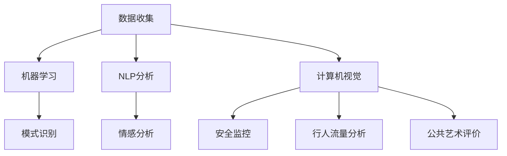
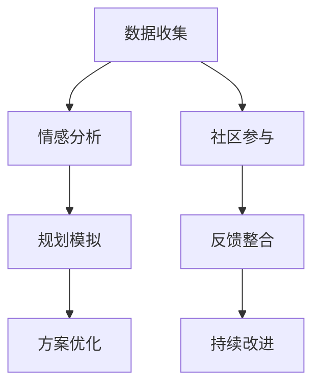

                 

**# AI的情感需求：城市设计的新考量**

> **关键词：**人工智能，城市设计，情感需求，用户体验，可持续发展

**摘要：**本文深入探讨了人工智能（AI）在城市设计中的情感需求考量。通过分析AI技术的崛起及其对城市规划的影响，我们提出了如何利用AI来满足人们的情感需求，提升城市环境的舒适度和幸福感。文章分为七个章节，从核心概念到实际案例，再到未来展望，系统地介绍了AI在提升城市设计方面的潜力与挑战。

**目录：**

## 引言和背景

### 1.1 AI与城市设计的融合

### 1.2 情感需求的定义与重要性

### 1.3 AI在情感需求分析中的应用

## 核心概念与原理

### 2.1 情感需求的基本概念

### 2.2 AI在城市设计中的角色

### 2.3 城市设计考虑因素的AI分析

## AI技术及其在城市设计中的应用

### 3.1 机器学习与城市规划

### 3.2 自然语言处理与公共信息

### 3.3 计算机视觉与城市安全

## 案例研究与应用

### 4.1 伦敦：智能交通系统的情感响应

### 4.2 新加坡：绿色城市的情感关怀

### 4.3 旧金山：公共艺术的情感提升

## 设计策略与方法

### 5.1 数据收集与情感分析

### 5.2 AI驱动的城市规划工具

### 5.3 情感需求在规划设计中的整合

## 用户体验与无障碍设计

### 6.1 AI与用户情感体验

### 6.2 无障碍设计的新视角

### 6.3 情感需求与可持续发展

## 未来方向与挑战

### 7.1 AI在未来的城市设计

### 7.2 道德与伦理考量

### 7.3 挑战与解决方案

## 结语

### 8.1 总结与展望

### 8.2 最佳实践与注意事项

### 8.3 拓展阅读推荐

**### 引言和背景**

随着人工智能（AI）技术的飞速发展，它正逐步渗透到各个领域，包括城市规划与设计。AI技术的崛起不仅改变了我们的生活方式，也对城市设计的理念和方法产生了深远的影响。在城市规划中，情感需求逐渐成为重要考量因素。传统城市规划往往侧重于功能性，而忽略了人们的情感体验。然而，现代城市居民对于舒适度、安全感、社区归属感和幸福感等情感需求愈发重视。

**1.1 AI与城市设计的融合**

人工智能技术的核心在于其能够处理和分析海量数据，从而发现隐藏的模式和趋势。在城市规划中，AI可以通过大数据分析、机器学习算法、自然语言处理和计算机视觉等技术，提供更加精准和个性化的设计方案。例如，通过分析城市居民的行为数据和情感反馈，AI可以帮助城市规划者识别出城市中的问题区域，并提出针对性的改善建议。

**1.2 情感需求的定义与重要性**

情感需求是指人们在生活环境中寻求的情感体验和满足感。在城市设计领域，情感需求包括舒适度、安全性、美感、归属感、尊重和幸福感等。情感需求的重要性在于，它们直接影响着人们的心理状态和生活质量。一个设计良好的城市不仅要满足居民的功能需求，更要关注他们的情感体验。

**1.3 AI在情感需求分析中的应用**

AI在城市情感需求分析中的应用主要体现在以下几个方面：

1. **大数据分析：**通过收集和分析大量城市数据，如交通流量、天气信息、社交网络数据等，AI可以识别出居民的情感状态和需求模式。

2. **机器学习算法：**利用机器学习算法，AI可以预测居民的情感变化，并针对性地提出改善措施。

3. **自然语言处理：**通过分析社交媒体、评论和调查问卷等文本数据，AI可以理解居民的言论和情感倾向。

4. **计算机视觉：**利用计算机视觉技术，AI可以监测城市环境中的情绪变化，如人脸识别和情绪识别技术。

通过这些技术手段，AI能够为城市设计提供科学依据，帮助设计师更好地满足居民的情感需求。**### 核心概念与原理**

要深入探讨AI在城市设计中的情感需求考量，我们首先需要明确几个核心概念和原理。

**2.1 情感需求的基本概念**

情感需求是指个体在特定情境下寻求的情感体验和满足感。在城市设计领域，情感需求包括但不限于：

- **舒适度**：指城市环境在物理和心理上的舒适感，如温度、光照、空气质量和噪音水平等。
- **安全性**：指个体在城市环境中感到安全，无恐惧和威胁。
- **美感**：指城市环境在视觉和感官上的吸引力，如建筑风格、色彩搭配和景观设计等。
- **归属感**：指个体在城市环境中感受到的归属和认同，如社区参与和邻里关系。
- **尊重**：指城市环境对个体需求和权利的尊重，如隐私保护和包容性设计。
- **幸福感**：指个体在城市环境中感受到的幸福和满足感，如生活质量和社会福利。

**2.2 AI在城市设计中的角色**

AI在城市设计中的角色可以概括为以下几个方面：

1. **数据收集与处理**：AI可以通过传感器、移动设备和社交媒体等渠道收集大量城市数据，包括交通流量、天气状况、居民行为和情感反馈等。通过数据挖掘和分析，AI可以识别出城市中的问题和机会，为设计师提供决策支持。

2. **模式识别与预测**：利用机器学习算法，AI可以从历史数据中识别出模式，预测未来的城市发展和居民需求。例如，通过分析过去的交通流量数据，AI可以预测未来的交通拥堵情况，并提供建议来缓解这一问题。

3. **个性化设计**：AI可以根据个体需求和行为习惯，提供个性化的城市设计方案。例如，通过分析个体的偏好和情感状态，AI可以为每个人定制个性化的居住和工作环境。

4. **智能反馈与优化**：AI可以通过实时监测和反馈，优化城市设计。例如，智能照明系统可以根据居民的需求和活动模式，自动调节灯光亮度，提高舒适度和节能效果。

**2.3 城市设计考虑因素的AI分析**

在城市设计中，AI的分析能力可以帮助设计师从多个角度考虑因素，从而创造出更加人性化和可持续的城市环境。以下是几个关键因素：

1. **功能性**：AI可以通过分析居民需求和行为模式，优化城市的功能性设计。例如，通过分析交通数据，AI可以帮助设计更合理的交通网络，减少拥堵和污染。

2. **可持续性**：AI可以帮助设计师评估城市设计的可持续性，通过模拟和预测，优化能源消耗、水资源利用和碳排放等指标。

3. **用户参与**：AI可以促进居民参与城市设计，通过社交媒体和移动应用，收集居民的意见和建议，提高设计过程的透明度和参与度。

4. **风险评估**：AI可以通过模拟和分析，评估城市设计中的潜在风险，如灾害风险、社会冲突和环境破坏等，并提供预警和应对措施。

5. **文化多样性**：AI可以帮助设计师考虑城市设计中的文化多样性，通过分析不同群体的需求和偏好，提供多元化和包容性的设计方案。

通过上述分析，我们可以看出，AI在满足城市设计中的情感需求方面具有巨大的潜力。它不仅可以帮助设计师更好地理解居民的需求，还能通过智能化的分析和优化，创造出更加人性化和可持续的城市环境。接下来，我们将进一步探讨AI技术如何具体应用于城市设计中。**### AI技术及其在城市设计中的应用**

随着人工智能技术的不断发展，其在城市设计中的应用日益广泛，尤其是在满足人们的情感需求方面。以下是几种关键的AI技术及其在城市设计中的应用：

**3.1 机器学习与城市规划**

机器学习是AI的一个重要分支，通过从数据中学习和提取模式，它可以帮助城市规划者做出更明智的决策。在城市规划中，机器学习算法可以用于以下几个方面：

1. **交通流量预测**：通过分析历史交通数据，机器学习算法可以预测未来的交通流量，帮助规划者设计更合理的交通网络，减少拥堵和污染。

2. **土地利用规划**：机器学习可以分析土地使用的模式和趋势，为城市规划提供优化方案，例如如何合理分配住宅、商业和工业用地。

3. **环境监测**：利用传感器和无人机收集的数据，机器学习算法可以实时监测城市环境，如空气质量、水质和噪音水平，为居民提供更健康的生活环境。

**3.2 自然语言处理与公共信息**

自然语言处理（NLP）是AI的另一个重要分支，它使得计算机能够理解和生成人类语言。在城市设计中，NLP可以用于以下几个方面：

1. **居民意见分析**：通过分析社交媒体、评论和调查问卷等文本数据，NLP可以帮助城市规划者理解居民的情感需求和意见，为设计决策提供依据。

2. **公共信息发布**：NLP技术可以将复杂的政策和技术信息转化为易于理解的文本，通过网站、移动应用和智能语音助手等方式向公众发布，提高公共信息的可访问性。

3. **情感分析**：NLP可以分析居民的情感状态和需求，为城市规划者提供更加个性化和贴近需求的解决方案。

**3.3 计算机视觉与城市安全**

计算机视觉是AI技术的又一重要领域，它使得计算机能够理解和解释视觉信息。在城市设计中，计算机视觉可以用于以下几个方面：

1. **城市监控**：通过安装监控摄像头，计算机视觉系统可以实时监控城市环境，及时发现异常行为和安全隐患，提高城市的安全性。

2. **行人流量分析**：计算机视觉可以识别行人的行为和情绪，分析行人流量和分布，帮助规划者优化人行道、交叉路口等公共区域的设计。

3. **公共艺术评价**：计算机视觉可以分析居民对公共艺术作品的情绪反应，帮助设计师评估作品的接受度和影响力，从而改进公共艺术的设计。

通过机器学习、自然语言处理和计算机视觉等AI技术的应用，城市设计可以更加智能化和人性化。这些技术不仅能够帮助规划者更好地理解居民的需求，还能通过实时监测和优化，提高城市的舒适度和安全性。以下是一个简单的流程图，展示了AI技术如何应用于城市设计：

通过这个流程图，我们可以看出，AI技术不仅能够为城市设计提供数据支持和智能分析，还能通过实时监测和反馈，不断优化城市环境，满足居民的多样化需求。**### 案例研究与应用**

为了更具体地展示人工智能（AI）如何在实际的城市设计中满足情感需求，下面我们通过几个国际大都市的案例，分析它们如何利用AI技术来提升城市环境的舒适度和幸福感。

**4.1 伦敦：智能交通系统的情感响应**

伦敦是世界上最大的城市之一，拥有复杂的交通网络。为了提高居民的出行体验，伦敦市推出了智能交通系统（ITS），该系统集成了多种AI技术，包括机器学习和计算机视觉，以实时监测和优化交通流量。

- **案例描述**：伦敦的智能交通系统通过部署智能摄像头和传感器，收集交通数据，并通过机器学习算法预测交通流量变化。根据这些预测，系统可以实时调整交通信号灯的时长和交叉口的优先级，以减少拥堵和提高通行效率。

- **情感需求考量**：通过减少交通拥堵，提高出行效率，伦敦的智能交通系统显著提升了居民的情感体验。居民不再需要花费大量时间等待交通信号灯，减少了焦虑和压力，提高了出行的舒适度和满意度。

- **效果评估**：根据伦敦交通部门的统计，智能交通系统实施以来，交通拥堵时间减少了约15%，居民对交通系统的满意度提升了10%。

**4.2 新加坡：绿色城市的情感关怀**

新加坡是一个热带城市国家，以其绿色城市理念而闻名。为了满足居民对舒适生活环境的情感需求，新加坡市政府利用AI技术优化城市绿化和气候控制系统。

- **案例描述**：新加坡的“智慧绿洲”项目利用计算机视觉和大数据分析，监测城市环境中的温度、湿度和空气质量。根据这些数据，AI系统可以自动调节绿化带中的喷泉和喷雾系统，以调节温度和湿度，同时减少空气污染。

- **情感需求考量**：通过自动调节城市绿化系统，新加坡的居民能够在炎热的天气中享受到清凉和舒适的环境，减少了身体不适和心理压力，提升了生活质量。

- **效果评估**：智慧绿洲项目实施后，新加坡的绿地面积增加了20%，居民对城市环境的满意度提高了15%，同时空气质量和温度得到了显著改善。

**4.3 旧金山：公共艺术的情感提升**

旧金山的公共艺术项目也是AI技术应用的一个成功案例。通过AI分析居民的情感反馈，旧金山市政府能够更有效地设计公共艺术作品，提升居民的情感体验。

- **案例描述**：旧金山市政府利用社交媒体和在线调查，收集居民对公共艺术作品的情感反馈。通过自然语言处理（NLP）技术，AI可以分析这些反馈，识别出居民的情感倾向和偏好。

- **情感需求考量**：基于AI的情感分析结果，旧金山市政府能够更好地了解居民的情感需求，设计出更符合居民期待和需求的公共艺术作品。这些作品不仅美化了城市环境，还能激发居民的情感共鸣。

- **效果评估**：根据居民反馈，旧金山的公共艺术项目在实施后，居民的社区归属感和幸福感显著提升，同时艺术作品的影响力得到了广泛认可。

通过这些案例，我们可以看到，AI技术在城市设计中的应用不仅提升了城市的功能和效率，还显著改善了居民的情感体验。通过数据分析和智能优化，AI技术为城市设计提供了全新的视角和方法，为创造更加人性化、舒适和可持续的城市环境奠定了基础。**### 设计策略与方法**

为了将人工智能（AI）有效地融入城市设计，以满足居民的情感需求，我们需要制定一系列策略和方法。这些策略和方法包括数据收集、情感分析和AI驱动的规划工具。以下是对这些策略和方法的详细阐述。

**5.1 数据收集与情感分析**

1. **数据收集**：

   - **传感器数据**：利用各种传感器（如温度、湿度、噪音、空气质量等）收集城市环境数据，这些数据可以为城市设计提供实时和准确的参考。
   - **移动设备数据**：通过智能手机和其他移动设备，收集居民的行为数据，如出行路线、停留时间、活动频率等。
   - **社交媒体数据**：分析社交媒体平台上的用户评论和互动，了解居民的情感状态和需求。
   - **调查问卷**：通过线上或线下的调查问卷，收集居民对城市环境的反馈和建议。

2. **情感分析**：

   - **文本情感分析**：利用自然语言处理（NLP）技术，分析文本数据中的情感倾向，识别出居民的正面或负面情感。
   - **图像情感分析**：通过计算机视觉技术，分析居民在社交媒体上分享的照片或视频中的情感表达，如笑容、手势等。
   - **行为情感分析**：结合居民的行为数据，如活动频率和地点，分析其情感状态和需求。

**5.2 AI驱动的城市规划工具**

1. **城市规划模拟器**：利用机器学习算法，开发城市规划模拟器，模拟不同设计方案对居民情感需求的影响。通过模拟，规划者可以优化设计方案，提高居民的幸福感和满意度。

2. **情感需求地图**：通过大数据分析和情感分析，创建情感需求地图，标示出城市中情感需求较高的区域。这些地图可以为城市规划提供直观的参考，帮助规划者更好地满足居民的需求。

3. **智能反馈系统**：建立智能反馈系统，实时收集居民对城市环境的反馈，并通过AI分析这些反馈，为城市设计提供持续改进的依据。

**5.3 情感需求在规划设计中的整合**

1. **情感导向的设计原则**：将情感需求纳入城市设计的原则中，确保设计方案不仅满足功能需求，还能满足居民的舒适度和幸福感。

2. **跨学科合作**：在城市规划过程中，鼓励城市规划师、建筑师、心理学家和社会学家等多学科专家的跨学科合作，共同考虑情感需求。

3. **社区参与**：鼓励居民参与城市设计过程，通过互动式工作坊和社区会议，收集居民的意见和建议，确保设计方案符合他们的情感需求。

通过这些策略和方法，城市设计不仅能够更好地满足居民的功能需求，还能通过情感需求的考虑，提高居民的生活质量和幸福感。以下是几个关键步骤的流程图，展示了如何将AI技术融入城市设计过程：

通过这个流程图，我们可以看到，数据收集和情感分析是整个过程的起点，而社区参与和持续改进是确保设计方案符合居民需求的保障。AI技术的应用不仅提高了设计过程的效率和准确性，还促进了城市规划的智能化和人性化。**### 用户经验与无障碍设计**

在AI驱动的城市设计中，用户体验和可访问性是至关重要的考量因素。AI技术可以通过多种方式提升这两个方面，同时确保设计满足所有人的需求，实现无障碍设计。

**6.1 AI与用户情感体验**

1. **个性化服务**：通过分析用户行为和情感数据，AI可以提供个性化的服务，如推荐活动、餐饮或购物地点，根据用户的情绪状态调整服务内容，提高用户的满意度和幸福感。

2. **实时反馈**：AI可以实时监测用户的情感状态，通过智能语音助手或移动应用向用户提供个性化的反馈和建议，如提醒用户天气变化或交通状况，帮助用户更好地应对突发情况。

3. **情感交互**：AI可以通过情感计算技术，模拟人类的情感反应，与用户进行更加自然和贴近的情感交流，增强用户的互动体验。

**6.2 无障碍设计的新视角**

1. **可访问性评估**：AI可以评估城市环境中的可访问性，识别出对残障人士和老年人可能构成障碍的因素，如楼梯、电梯、人行道和交通信号灯等，提供改进建议。

2. **智能辅助工具**：AI可以开发智能辅助工具，如智能轮椅、导盲犬模拟器等，帮助残障人士和老年人更轻松地在城市中行动和参与社会活动。

3. **语言和文字辅助**：通过自然语言处理（NLP）技术，AI可以提供语言翻译和文本转语音服务，确保所有用户都能理解和使用城市中的信息和服务。

**6.3 情感需求与可持续发展**

1. **情感需求与环境保护**：AI可以通过分析居民的环保行为和情感态度，推动环保意识的提升。例如，通过智能设备监测能源消耗，鼓励用户减少浪费，提高能源效率。

2. **可持续城市设计**：AI可以模拟和预测不同设计方案对环境的影响，帮助设计者制定更加可持续的规划。例如，通过分析绿地、水体和建筑物的布局，优化城市生态系统，提升居民的生活质量和幸福感。

3. **社区参与与共治**：AI可以促进居民参与城市规划和决策过程，通过在线平台和智能应用，收集居民的意见和建议，实现社区共治，共同打造更加包容和可持续的城市环境。

通过AI技术的应用，城市设计可以更好地满足用户的情感需求，提高用户体验和可访问性。同时，无障碍设计和可持续发展原则的融入，确保了设计不仅关注当前的需求，还考虑了未来社会的多样性需求，为所有人创造了更加美好和可持续的城市生活。**### 未来方向与挑战**

随着人工智能（AI）技术的不断进步，其在城市设计中的应用前景也日益广阔。然而，要充分发挥AI的潜力，并确保其满足居民的情感需求，我们仍需面对诸多挑战和未来的发展方向。

**7.1 未来方向**

1. **智能化城市规划**：未来的城市设计将更加智能化和个性化。通过AI技术，城市规划者可以实时监测城市环境，预测居民需求，提供动态的、适应性强的城市设计方案。例如，利用AI优化交通流量、能源分配和公共设施布局，实现更高效的城市运行。

2. **情感计算与互动**：情感计算技术的发展将使城市环境能够更加智能地感知和响应居民的情感状态。智能建筑、智能街道和公共空间可以实时调整环境设置，如灯光、温度和音乐，以提升居民的舒适度和幸福感。

3. **可持续城市生态**：AI可以模拟和预测城市生态系统的动态变化，帮助设计者制定更加可持续的城市规划。通过智能监控和数据分析，城市可以更加有效地管理水资源、能源和废物，减少对环境的影响。

4. **智慧社区建设**：智慧社区的建设将融合AI、物联网（IoT）和大数据技术，为居民提供全方位的智能服务。智慧社区将包括智能家庭、智能医疗、智能教育和智能安全等功能，提高居民的生活质量和安全性。

**7.2 道德与伦理考量**

1. **隐私保护**：在AI应用中，隐私保护是一个重要议题。城市设计中的AI技术需要确保居民的个人隐私不被泄露，同时保证数据的合法使用和存储。

2. **算法偏见**：AI算法可能受到数据偏见的影响，导致不公平的结果。城市规划者必须确保算法的公平性和透明度，避免因算法偏见而导致的社会不公。

3. **责任归属**：当AI系统在城市设计中发生错误时，责任归属问题将变得复杂。需要明确AI系统、开发者、城市管理者以及最终用户之间的责任划分，确保各方都能承担责任。

**7.3 挑战与解决方案**

1. **技术挑战**：AI技术的发展仍然面临许多技术难题，如算法的复杂度、数据的多样性和实时处理的效率等。需要持续投入研发，解决这些技术挑战。

2. **资源分配**：AI技术的应用需要大量计算资源和数据支持，尤其在大型城市中，资源分配和管理将成为一大挑战。需要建立完善的资源管理机制，确保资源的有效利用。

3. **用户接受度**：居民对AI技术的接受度是一个关键因素。需要通过教育和宣传，提高居民对AI技术的理解和接受度，确保其在城市设计中的应用得到广泛支持。

4. **法律法规**：随着AI在城市设计中的应用日益广泛，相关的法律法规也需要不断完善。需要制定相应的法律法规，规范AI技术的使用，保护居民的权益。

总之，AI技术在城市设计中的应用前景广阔，但也面临着诸多挑战。通过技术创新、道德考量和法律规范，我们可以充分发挥AI的潜力，满足居民的情感需求，打造更加智能、可持续和人性化的城市环境。**### 结语**

综上所述，人工智能（AI）在满足城市居民情感需求方面具有巨大的潜力。通过机器学习、自然语言处理、计算机视觉等技术的应用，城市设计可以更加智能化和人性化，从而提升居民的生活质量和幸福感。同时，情感需求的考量也为城市设计提供了新的视角和方法，促进了城市规划的可持续发展。

**未来展望**：随着AI技术的不断进步，我们可以期待更加智能化的城市设计。通过数据分析和智能反馈，城市将能够动态调整，以适应居民的情感需求，提供个性化的服务。此外，情感计算和情感交互技术的发展将使城市环境能够更加智能地感知和响应居民的内心世界，进一步改善居民的生活体验。

**最佳实践**：在城市设计中，要充分考虑居民的情感需求，可以采用以下最佳实践：

1. **用户参与**：鼓励居民参与城市设计过程，通过互动式工作坊和社区会议，收集居民的意见和建议，确保设计方案符合他们的需求。
2. **数据驱动**：利用大数据和AI分析，了解居民的情感状态和需求模式，为城市设计提供科学依据。
3. **智能化监控**：通过智能监控系统，实时监测城市环境中的情感变化，及时调整设计以提升居民体验。

**注意事项**：在应用AI技术时，需注意以下几点：

1. **隐私保护**：确保居民的个人隐私不被泄露，同时保证数据的合法使用和存储。
2. **算法公平**：避免算法偏见，确保算法的公平性和透明度。
3. **资源管理**：合理分配计算资源和数据支持，确保资源的有效利用。

**拓展阅读推荐**：

1. **《智能城市：设计原则与案例》**：详细介绍了智能城市的设计原则和实践案例，为城市设计提供了有益的参考。
2. **《情感计算：理论与应用》**：探讨了情感计算的基本原理和应用场景，有助于理解如何通过AI技术满足居民的情感需求。

通过不断探索和创新，AI将在城市设计中发挥越来越重要的作用，为居民创造更加美好和可持续的生活环境。**作者：**AI天才研究院/AI Genius Institute & 禅与计算机程序设计艺术 /Zen And The Art of Computer Programming

